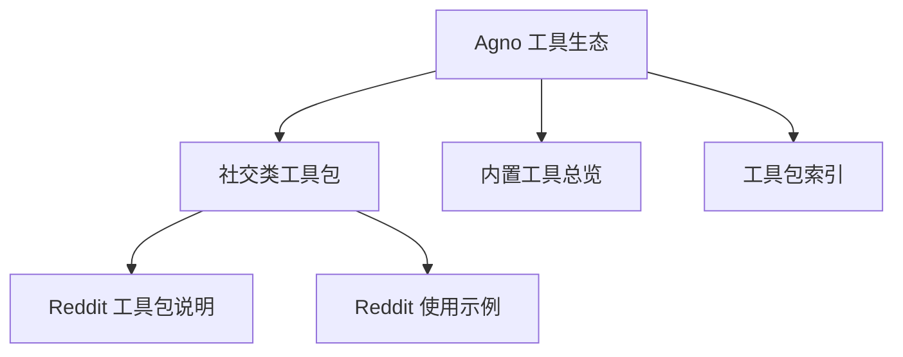
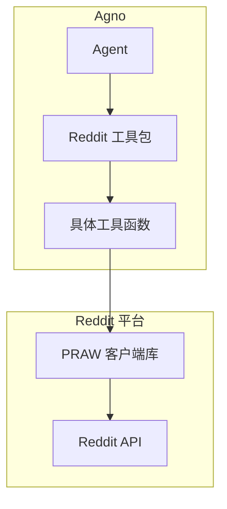
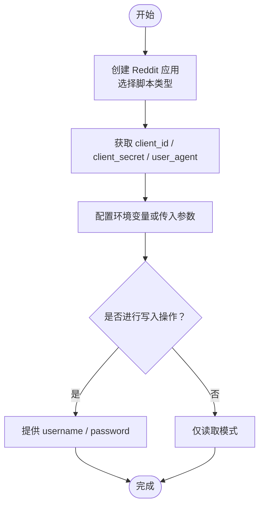
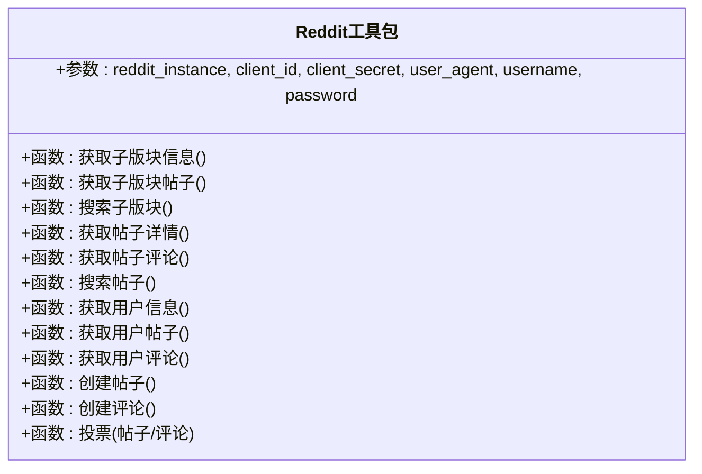
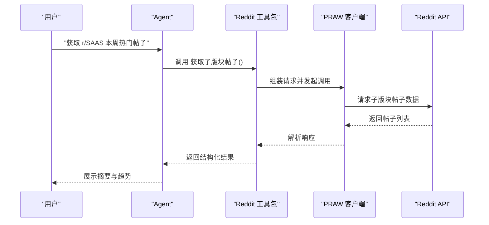
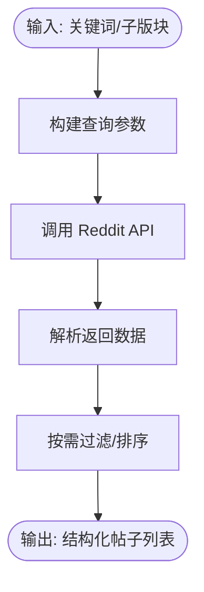
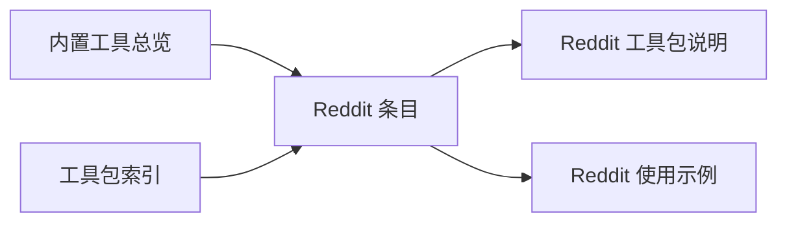

# Reddit 工具包

<cite>
**本文引用的文件**   
- [Reddit 工具包说明](file://tools/toolkits/social/reddit.mdx)
- [Reddit 使用示例](file://examples/tools/reddit-tools.mdx)
- [内置工具总览](file://cookbook/tools/built-in.mdx)
- [工具包索引](file://tools/toolkits/overview.mdx)
</cite>

## 目录
1. [简介](#简介)
2. [项目结构](#项目结构)
3. [核心组件](#核心组件)
4. [架构总览](#架构总览)
5. [详细组件分析](#详细组件分析)
6. [依赖关系分析](#依赖关系分析)
7. [性能与速率限制](#性能与速率限制)
8. [故障排查指南](#故障排查指南)
9. [结论](#结论)
10. [附录](#附录)

## 简介
本技术文档面向在 Agno 中集成 Reddit 的开发者与产品团队，系统性介绍如何通过 Reddit 工具包完成 Reddit API 的访问与操作，涵盖认证方式（OAuth2 与脚本应用）、参数配置、核心功能（帖子发布、评论管理、子版块与用户信息查询）以及在社区管理与内容分发场景中的应用实践。同时给出速率限制、内容审核与社区准则遵循建议，帮助您安全、合规地使用 Reddit 能力。

## 项目结构
Reddit 工具包在 Agno 文档体系中以“工具包”形式提供，位于社交类工具集合下，并配套使用示例与参数说明文档。关键位置如下：
- 工具包说明：用于展示工具包能力、参数与函数列表
- 使用示例：提供从创建 Reddit 应用到运行示例的完整步骤
- 内置工具总览：列出 Reddit 工具在 Agno 工具生态中的定位
- 工具包索引：导航到社交类工具包入口

**章节来源**
- [Reddit 工具包说明:1-62](file://tools/toolkits/social/reddit.mdx#L1-L62)
- [Reddit 使用示例:1-68](file://examples/tools/reddit-tools.mdx#L1-L68)
- [内置工具总览:113-135](file://cookbook/tools/built-in.mdx#L113-L135)
- [工具包索引:129-220](file://tools/toolkits/overview.mdx#L129-L220)

## 核心组件
- 工具包名称：Reddit
- 主要职责：为 Agent 提供访问 Reddit 的能力，支持浏览与分析帖子、评论、子版块与用户信息；在具备认证时支持发布、评论与投票等写入操作。
- 关键参数（来自工具包说明）：
  - reddit_instance：可复用的 praw.Reddit 实例
  - client_id / client_secret：应用凭据（可通过环境变量注入）
  - user_agent：请求标识字符串
  - username / password：账户凭据（用于需要认证的操作）

**章节来源**
- [Reddit 工具包说明:27-37](file://tools/toolkits/social/reddit.mdx#L27-L37)

## 架构总览
Reddit 工具包在 Agno 中作为“工具包”被加载到 Agent 的工具集中，Agent 通过自然语言指令触发工具调用，工具包内部封装对 Reddit API 的访问逻辑（基于 praw）。认证与权限控制由应用与账户凭据决定，写入操作（如发帖、评论、投票）需满足相应权限。

**图示来源**
- [Reddit 工具包说明:38-55](file://tools/toolkits/social/reddit.mdx#L38-L55)

**章节来源**
- [Reddit 工具包说明:38-55](file://tools/toolkits/social/reddit.mdx#L38-L55)

## 详细组件分析

### 认证与权限配置
- 应用类型：脚本应用（script）
- 凭据来源：Reddit 帐户偏好设置中的“我的应用”
- 必填字段（示例文档）：client_id、client_secret、user_agent、username、password
- 注意事项：
  - 脚本应用适用于自动化脚本或本地开发，不涉及浏览器授权流程
  - user_agent 需符合 Reddit 规范格式
  - 写入操作（发帖、评论、投票）需要账户凭据

**章节来源**
- [Reddit 使用示例:6-28](file://examples/tools/reddit-tools.mdx#L6-L28)

### 工具函数与能力矩阵
- 读取类：
  - 获取子版块信息
  - 获取子版块帖子（支持多种排序）
  - 搜索子版块
  - 获取帖子详情
  - 获取帖子评论
  - 搜索帖子（全站或子版块内）
  - 获取用户信息
  - 获取用户帖子
  - 获取用户评论
- 写入类（需认证）：
  - 创建帖子
  - 在帖子下创建评论
  - 对帖子/评论进行投票

**章节来源**
- [Reddit 工具包说明:27-55](file://tools/toolkits/social/reddit.mdx#L27-L55)

### 典型调用序列（以“获取子版块帖子”为例）

**图示来源**
- [Reddit 工具包说明:38-55](file://tools/toolkits/social/reddit.mdx#L38-L55)

**章节来源**
- [Reddit 工具包说明:6-25](file://tools/toolkits/social/reddit.mdx#L6-L25)

### 数据流与处理逻辑（以“搜索帖子”为例）

**图示来源**
- [Reddit 工具包说明](file://tools/toolkits/social/reddit.mdx#L47)

**章节来源**
- [Reddit 工具包说明](file://tools/toolkits/social/reddit.mdx#L47)

### 社区管理与内容分发应用场景
- 自动化内容发布：在指定子版块创建帖子（需认证），结合内容策略与时间窗口控制
- 社区互动：自动回复、点赞/踩（投票）与评论管理（需认证）
- 数据分析：抓取热门话题、统计趋势、识别热点标签与用户画像
- 合规与风控：基于内容审核规则过滤敏感话题，避免违规内容传播

[本节为概念性说明，不直接分析具体文件]

## 依赖关系分析
- 工具包定位：属于社交类工具包之一
- 生态位置：在“内置工具总览”中以“Reddit”条目出现
- 导航入口：在“工具包索引”的社交类卡片中可直达

**图示来源**
- [内置工具总览:113-135](file://cookbook/tools/built-in.mdx#L113-L135)
- [工具包索引:204-211](file://tools/toolkits/overview.mdx#L204-L211)

**章节来源**
- [内置工具总览:113-135](file://cookbook/tools/built-in.mdx#L113-L135)
- [工具包索引:204-211](file://tools/toolkits/overview.mdx#L204-L211)

## 性能与速率限制
- 速率限制：Reddit API 对请求频率有限制，应合理控制并发与调用频次，避免触发限流
- 缓存策略：对高频读取接口（如子版块信息、热门帖子）可采用缓存降低重复请求
- 错峰调用：根据业务需求设定固定周期拉取，避开高峰时段
- 异常退避：遇到限流或错误时采用指数退避重试

[本节提供通用指导，不直接分析具体文件]

## 故障排查指南
- 凭据问题
  - 确认 client_id / client_secret / user_agent 是否正确配置
  - 若使用账户写入操作，确认 username / password 正确且账户未受限
- 请求失败
  - 检查 user_agent 是否符合规范
  - 核对网络连通性与代理设置
- 速率限制
  - 降低请求频率或增加延时
  - 对相同查询结果进行缓存复用
- 内容审核与社区准则
  - 避免发布广告、垃圾信息与不当言论
  - 遵守子版块规则与平台内容政策

[本节提供通用指导，不直接分析具体文件]

## 结论
Reddit 工具包为在 Agno 中集成 Reddit 能力提供了开箱即用的工具集，覆盖读取与写入两大类操作。通过脚本应用与账户凭据的组合，开发者可在社区管理、内容分发与数据分析等场景中快速落地自动化方案。建议在生产环境中严格遵循速率限制与社区准则，配合缓存与异常处理机制，确保系统的稳定性与合规性。

## 附录

### 快速上手清单
- 在 Reddit 偏好设置创建脚本应用，记录 client_id、client_secret、user_agent
- 配置 username/password（若需写入）
- 在 Agent 中引入 Reddit 工具包并运行示例查询

**章节来源**
- [Reddit 使用示例:6-28](file://examples/tools/reddit-tools.mdx#L6-L28)