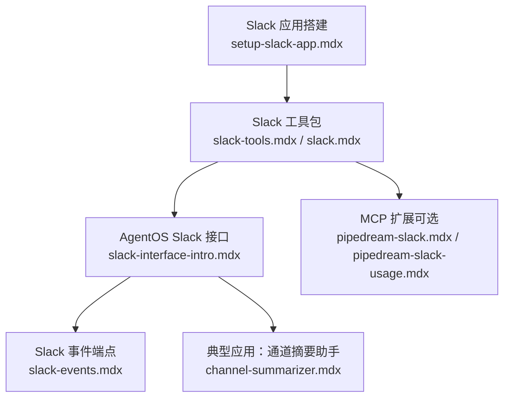
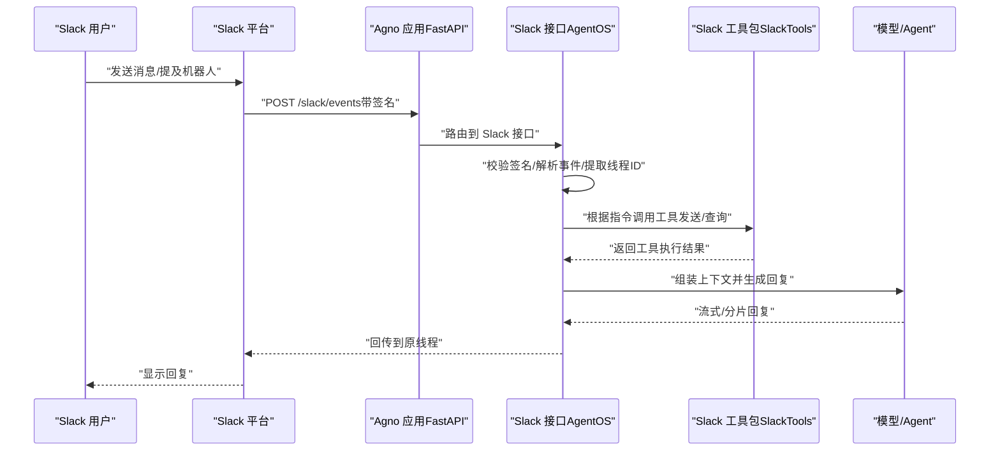
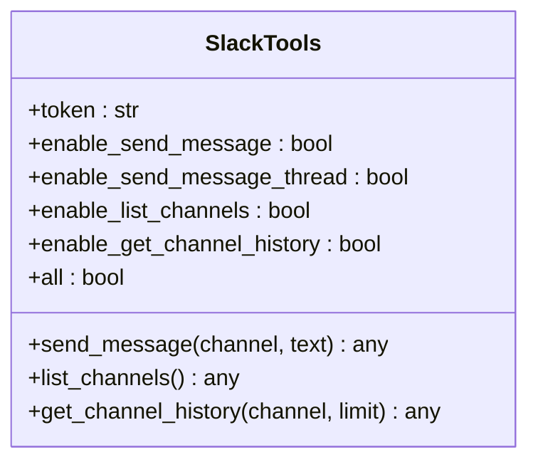
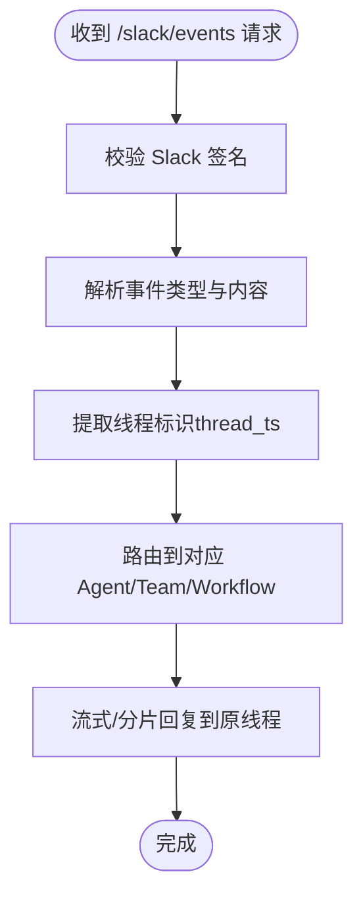
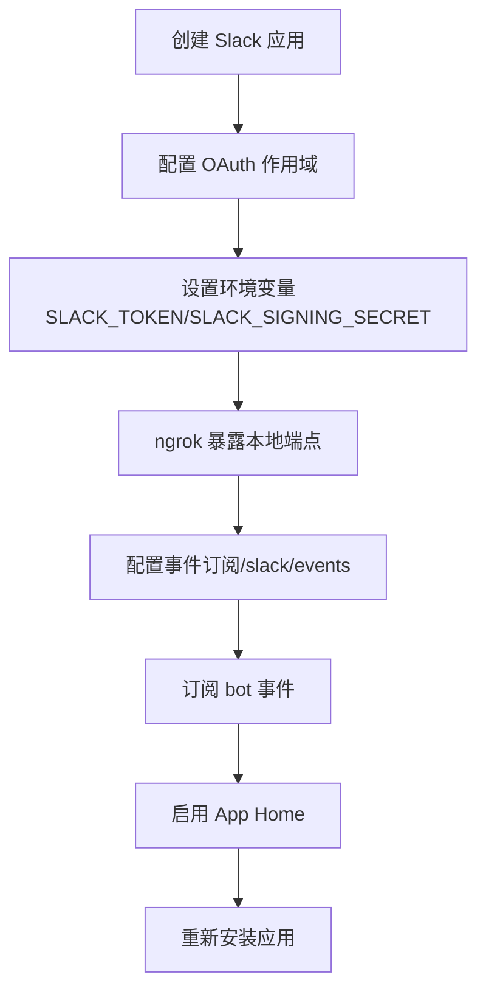
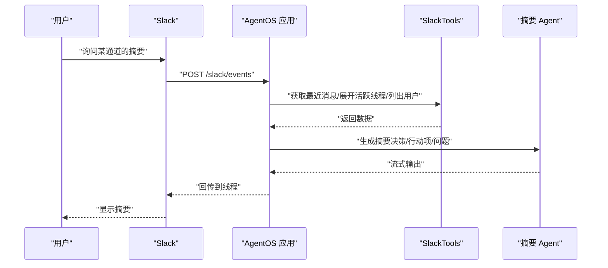
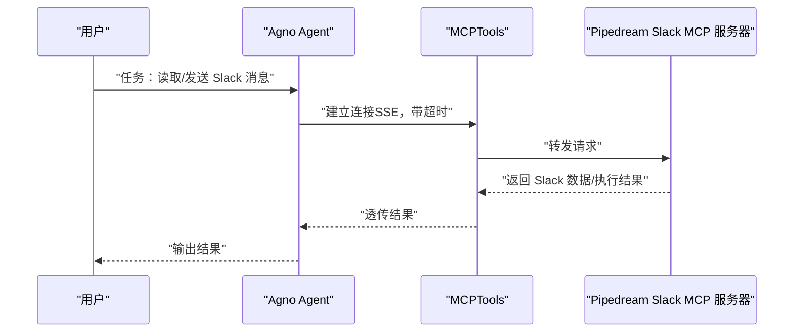
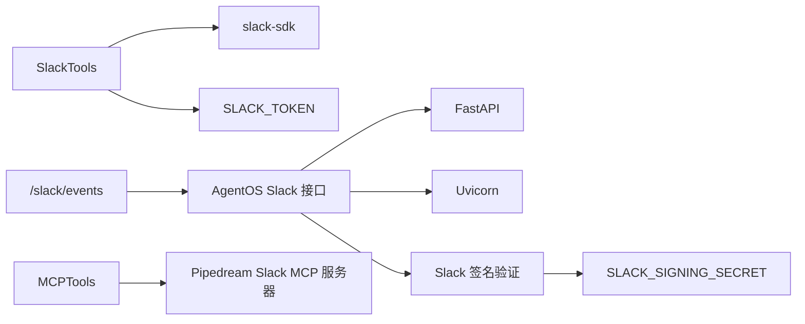

# Slack 工具包

<cite>
**本文引用的文件**
- [setup-slack-app.mdx](file://TBD/snippets/setup-slack-app.mdx)
- [slack-tools.mdx](file://examples/tools/slack-tools.mdx)
- [slack.mdx](file://tools/toolkits/social/slack.mdx)
- [slack-interface-intro.mdx](file://agent-os/interfaces/slack/introduction.mdx)
- [slack-events.mdx](file://reference-api/schema/slack/slack-events.mdx)
- [channel-summarizer.mdx](file://examples/agent-os/interfaces/slack/channel-summarizer.mdx)
- [pipedream-slack.mdx](file://examples/tools/mcp/pipedream-slack.mdx)
- [pipedream-slack-usage.mdx](file://tools/mcp/usage/pipedream-slack.mdx)
</cite>

## 目录
1. [简介](#简介)
2. [项目结构](#项目结构)
3. [核心组件](#核心组件)
4. [架构总览](#架构总览)
5. [详细组件分析](#详细组件分析)
6. [依赖关系分析](#依赖关系分析)
7. [性能考量](#性能考量)
8. [故障排查指南](#故障排查指南)
9. [结论](#结论)
10. [附录](#附录)

## 简介
本技术文档面向在 Agno 中集成 Slack 的开发者与产品团队，系统性说明如何创建 Slack Bot、配置 OAuth2 与签名验证、订阅事件并实现实时消息处理；同时覆盖频道管理、用户权限、交互式组件与文件上传能力的使用路径，并结合自动化通知、任务分配与项目管理等团队协作场景，给出可落地的应用范式与最佳实践。

## 项目结构
围绕 Slack 集成的关键文档与示例分布在以下位置：
- Slack 应用搭建与事件订阅：TBD/snippets/setup-slack-app.mdx
- Slack 工具包（工具集）：examples/tools/slack-tools.mdx、tools/toolkits/social/slack.mdx
- Slack 接口（AgentOS 集成）：agent-os/interfaces/slack/introduction.mdx
- Slack 事件接口定义：reference-api/schema/slack/slack-events.mdx
- 典型应用示例（通道摘要助手）：examples/agent-os/interfaces/slack/channel-summarizer.mdx
- MCP 与 Slack 集成（可选扩展）：examples/tools/mcp/pipedream-slack.mdx、tools/mcp/usage/pipedream-slack.mdx

**图示来源**
- [setup-slack-app.mdx:1-92](file://TBD/snippets/setup-slack-app.mdx#L1-L92)
- [slack-tools.mdx:1-91](file://examples/tools/slack-tools.mdx#L1-L91)
- [slack.mdx:1-66](file://tools/toolkits/social/slack.mdx#L1-L66)
- [slack-interface-intro.mdx:1-100](file://agent-os/interfaces/slack/introduction.mdx#L1-L100)
- [slack-events.mdx:1-3](file://reference-api/schema/slack/slack-events.mdx#L1-L3)
- [channel-summarizer.mdx:1-88](file://examples/agent-os/interfaces/slack/channel-summarizer.mdx#L1-L88)
- [pipedream-slack.mdx:1-78](file://examples/tools/mcp/pipedream-slack.mdx#L1-L78)
- [pipedream-slack-usage.mdx:1-59](file://tools/mcp/usage/pipedream-slack.mdx#L1-L59)

**章节来源**
- [setup-slack-app.mdx:1-92](file://TBD/snippets/setup-slack-app.mdx#L1-L92)
- [slack-tools.mdx:1-91](file://examples/tools/slack-tools.mdx#L1-L91)
- [slack.mdx:1-66](file://tools/toolkits/social/slack.mdx#L1-L66)
- [slack-interface-intro.mdx:1-100](file://agent-os/interfaces/slack/introduction.mdx#L1-L100)
- [slack-events.mdx:1-3](file://reference-api/schema/slack/slack-events.mdx#L1-L3)
- [channel-summarizer.mdx:1-88](file://examples/agent-os/interfaces/slack/channel-summarizer.mdx#L1-L88)
- [pipedream-slack.mdx:1-78](file://examples/tools/mcp/pipedream-slack.mdx#L1-L78)
- [pipedream-slack-usage.mdx:1-59](file://tools/mcp/usage/pipedream-slack.mdx#L1-L59)

## 核心组件
- Slack 工具包（SlackTools）
  - 能力范围：发送消息、发送线程消息、列出频道、获取频道历史、按需启用/禁用功能
  - 关键参数：token、enable_send_message、enable_send_message_thread、enable_list_channels、enable_get_channel_history、all
  - 关键函数：send_message、list_channels、get_channel_history
- AgentOS Slack 接口（Slack）
  - 将 Agent/Team/Workflow 暴露为 Slack 服务端，挂载 FastAPI 路由
  - 主要端点：POST /slack/events（事件入口，含签名验证、线程会话、流式回复）
  - 关键参数：agent/team/workflow、prefix、tags、reply_to_mentions_only
- Slack 事件接口定义
  - OpenAPI 定义：post /slack/events
- MCP 扩展（可选）
  - 通过 MCPTools 连接第三方 MCP 服务器（如 Pipedream Slack），以增强读取/写入能力

**章节来源**
- [slack.mdx:44-66](file://tools/toolkits/social/slack.mdx#L44-L66)
- [slack-interface-intro.mdx:53-99](file://agent-os/interfaces/slack/introduction.mdx#L53-L99)
- [slack-events.mdx:1-3](file://reference-api/schema/slack/slack-events.mdx#L1-L3)
- [pipedream-slack.mdx:1-78](file://examples/tools/mcp/pipedream-slack.mdx#L1-L78)
- [pipedream-slack-usage.mdx:1-59](file://tools/mcp/usage/pipedream-slack.mdx#L1-L59)

## 架构总览
下图展示从 Slack 用户到 Agno Agent 的完整链路：用户在 Slack 中触发事件或消息，Slack 将事件转发至 Agno 的 /slack/events 端点；该端点进行签名验证与线程上下文管理后，调用 AgentOS 挂载的接口，最终返回响应到 Slack 线程中。

**图示来源**
- [slack-interface-intro.mdx:76-99](file://agent-os/interfaces/slack/introduction.mdx#L76-L99)
- [slack-events.mdx:1-3](file://reference-api/schema/slack/slack-events.mdx#L1-L3)

## 详细组件分析

### 组件一：Slack 工具包（SlackTools）
- 功能定位：为 Agent 提供与 Slack 平台交互的能力集合，支持发送消息、列出频道、获取历史等
- 参数与能力开关：通过 enable_* 与 all 控制功能启用范围，便于最小权限部署
- 使用方式：作为工具注入到 Agent，Agent 通过自然语言指令驱动工具执行

**图示来源**
- [slack.mdx:44-66](file://tools/toolkits/social/slack.mdx#L44-L66)

**章节来源**
- [slack.mdx:1-66](file://tools/toolkits/social/slack.mdx#L1-L66)
- [slack-tools.mdx:1-91](file://examples/tools/slack-tools.mdx#L1-L91)

### 组件二：AgentOS Slack 接口（Slack）
- 功能定位：将 Agent/Team/Workflow 暴露为 Slack 服务端，统一处理事件、签名验证、线程会话与流式输出
- 关键特性：
  - 事件入口：POST /slack/events
  - 签名验证：对每个请求进行签名校验
  - 线程会话：以 thread_ts 作为会话标识，保持上下文连续性
  - 流式输出：长文本自动拆分并回传到原线程
- 配置要点：SLACK_TOKEN、SLACK_SIGNING_SECRET、ngrok 本地开发与事件订阅路径

**图示来源**
- [slack-interface-intro.mdx:76-99](file://agent-os/interfaces/slack/introduction.mdx#L76-L99)

**章节来源**
- [slack-interface-intro.mdx:1-100](file://agent-os/interfaces/slack/introduction.mdx#L1-L100)
- [slack-events.mdx:1-3](file://reference-api/schema/slack/slack-events.mdx#L1-L3)

### 组件三：Slack 应用搭建与事件订阅
- 必备步骤：创建应用、配置 OAuth 作用域、设置环境变量、配置 ngrok 与事件订阅、启用 App Home、重新安装应用
- 关键作用域（Bot Token Scopes）：app_mention、chat:write、chat:write.customize、chat:write.public、im:history、im:read、im:write
- 事件订阅：订阅 bot 事件（app_mention、message.im、message.channels、message.groups）

**图示来源**
- [setup-slack-app.mdx:11-89](file://TBD/snippets/setup-slack-app.mdx#L11-L89)

**章节来源**
- [setup-slack-app.mdx:1-92](file://TBD/snippets/setup-slack-app.mdx#L1-L92)

### 组件四：典型应用示例（通道摘要助手）
- 场景：基于 Slack 历史与线程信息，自动生成通道讨论摘要
- 能力组合：启用获取线程、搜索消息、列出用户等工具
- 实现要点：通过 AgentOS 挂载 Slack 接口，结合数据库持久化会话，实现多轮上下文与摘要生成

**图示来源**
- [channel-summarizer.mdx:26-66](file://examples/agent-os/interfaces/slack/channel-summarizer.mdx#L26-L66)

**章节来源**
- [channel-summarizer.mdx:1-88](file://examples/agent-os/interfaces/slack/channel-summarizer.mdx#L1-L88)

### 组件五：MCP 扩展（可选）
- 场景：通过 MCP 服务器（如 Pipedream Slack）扩展读取/写入能力，无需直接暴露 Slack 凭据
- 方式：使用 MCPTools 连接 MCP 服务器，以 SSE 传输与超时控制保障稳定性
- 适用：需要在受限环境中访问 Slack 数据与能力的团队

**图示来源**
- [pipedream-slack.mdx:34-60](file://examples/tools/mcp/pipedream-slack.mdx#L34-L60)
- [pipedream-slack-usage.mdx:32-58](file://tools/mcp/usage/pipedream-slack.mdx#L32-L58)

**章节来源**
- [pipedream-slack.mdx:1-78](file://examples/tools/mcp/pipedream-slack.mdx#L1-L78)
- [pipedream-slack-usage.mdx:1-59](file://tools/mcp/usage/pipedream-slack.mdx#L1-L59)

## 依赖关系分析
- Slack 工具包依赖 Slack SDK 与环境变量（SLACK_TOKEN）
- AgentOS Slack 接口依赖 FastAPI、Uvicorn、Slack 签名验证库
- 事件接口定义与实际路由一致，确保端点规范与安全
- MCP 扩展为可选依赖，用于增强读取/写入能力

**图示来源**
- [slack.mdx:1-66](file://tools/toolkits/social/slack.mdx#L1-L66)
- [slack-interface-intro.mdx:1-100](file://agent-os/interfaces/slack/introduction.mdx#L1-L100)
- [slack-events.mdx:1-3](file://reference-api/schema/slack/slack-events.mdx#L1-L3)
- [pipedream-slack.mdx:1-78](file://examples/tools/mcp/pipedream-slack.mdx#L1-L78)

**章节来源**
- [slack.mdx:1-66](file://tools/toolkits/social/slack.mdx#L1-L66)
- [slack-interface-intro.mdx:1-100](file://agent-os/interfaces/slack/introduction.mdx#L1-L100)
- [slack-events.mdx:1-3](file://reference-api/schema/slack/slack-events.mdx#L1-L3)
- [pipedream-slack.mdx:1-78](file://examples/tools/mcp/pipedream-slack.mdx#L1-L78)

## 性能考量
- 事件处理
  - 使用线程标识作为会话键，避免跨线程上下文污染
  - 对长回复进行分片回传，减少单次响应体积
- 网络与并发
  - 本地开发建议使用 ngrok；生产环境建议使用稳定域名与反向代理
  - 事件回调应尽量短小快速，复杂逻辑异步化
- 工具调用
  - 合理使用 enable_* 开关，仅启用必要能力，降低 API 调用频率
  - 对历史查询设置合理 limit，避免一次性拉取过多数据
- MCP 扩展
  - 设置合理的超时时间，避免阻塞主流程
  - 在高并发场景下评估 MCP 服务器承载能力

## 故障排查指南
- 环境变量
  - 确认 SLACK_TOKEN 与 SLACK_SIGNING_SECRET 已正确设置且未过期
- 事件订阅
  - ngrok 地址与 /slack/events 路径需与 Slack 设置一致
  - Slack 会在保存事件订阅后进行验证，需保证应用处于可访问状态
- 权限与作用域
  - 确认已授予 app_mention、chat:write、im:* 等必要作用域
  - 重新安装应用以应用新权限
- 签名验证失败
  - 检查签名算法与密钥是否匹配
  - 确保请求体与签名计算一致
- 无响应或延迟
  - 检查网络连通性与防火墙
  - 查看应用日志定位错误（权限、序列化、超时等）

**章节来源**
- [slack-interface-intro.mdx:94-100](file://agent-os/interfaces/slack/introduction.mdx#L94-L100)
- [setup-slack-app.mdx:50-89](file://TBD/snippets/setup-slack-app.mdx#L50-L89)

## 结论
通过 Slack 工具包与 AgentOS Slack 接口，Agno 能够无缝接入 Slack 生态，实现从事件订阅、签名验证、线程会话到流式回复的完整闭环。配合 MCP 扩展与典型应用（如通道摘要助手），可在团队协作与工作流中落地自动化通知、任务分配与项目管理等场景。建议遵循最小权限原则、完善事件订阅与签名验证、并结合性能优化策略提升稳定性与用户体验。

## 附录
- 团队协作与工作流用例
  - 自动化通知：在特定事件发生时向指定频道发送结构化通知
  - 任务分配：通过自然语言指令识别任务并标记负责人，再通过工具包发送提醒
  - 项目管理：汇总通道讨论、提取决策与行动项，形成每日/周报
- 最佳实践
  - 明确最小权限：仅启用必要的 enable_* 能力
  - 事件幂等：对重复事件进行去重处理
  - 错误隔离：对工具调用与外部服务增加超时与重试策略
  - 日志可观测：记录关键事件与错误堆栈，便于追踪与审计