# Telegram 工具包

<cite>
**本文档引用的文件**
- [Telegram 工具包说明](file://tools/toolkits/social/telegram.mdx)
- [Telegram 工具示例](file://examples/tools/telegram-tools.mdx)
- [接口概览](file://deploy/interfaces.mdx)
- [内置工具参考](file://cookbook/tools/built-in.mdx)
- [WhatsApp 接口介绍](file://agent-os/interfaces/whatsapp/introduction.mdx)
- [Discord 接口概览](file://integrations/discord/overview.mdx)
</cite>

## 目录
1. [简介](#简介)
2. [项目结构](#项目结构)
3. [核心组件](#核心组件)
4. [架构概览](#架构概览)
5. [详细组件分析](#详细组件分析)
6. [依赖关系分析](#依赖关系分析)
7. [性能考虑](#性能考虑)
8. [故障排除指南](#故障排除指南)
9. [结论](#结论)
10. [附录](#附录)

## 简介

Telegram 工具包是 Agno 框架中用于与 Telegram Bot API 进行交互的重要组件。该工具包允许开发者创建智能的 Telegram 机器人助手，通过自然语言与用户进行交互，执行各种任务和操作。

本工具包基于 Telegram Bot API 构建，提供了完整的消息发送、键盘菜单、Inline 查询等功能支持。它集成了先进的会话管理和状态跟踪机制，能够处理复杂的多轮对话场景。

## 项目结构

Telegram 工具包在 Agno 项目中的组织结构如下：

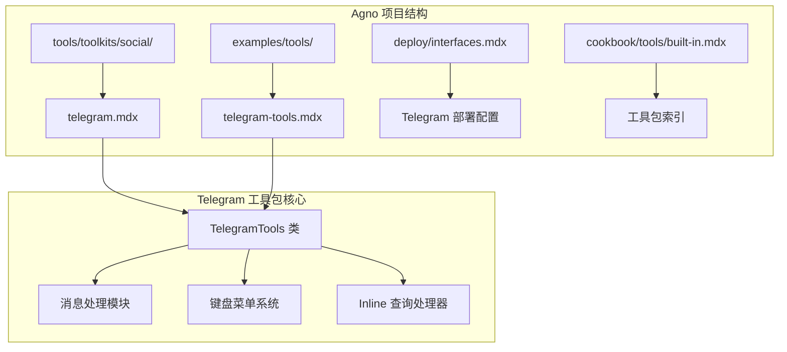

**图表来源**
- [Telegram 工具包说明:1-61](file://tools/toolkits/social/telegram.mdx#L1-L61)
- [Telegram 工具示例:1-62](file://examples/tools/telegram-tools.mdx#L1-L62)

**章节来源**
- [Telegram 工具包说明:1-61](file://tools/toolkits/social/telegram.mdx#L1-L61)
- [Telegram 工具示例:1-62](file://examples/tools/telegram-tools.mdx#L1-L62)

## 核心组件

### TelegramTools 类

TelegramTools 是工具包的核心类，提供了与 Telegram Bot API 交互的所有功能。该类支持多种配置选项和功能启用模式。

#### 主要参数配置

| 参数名 | 类型 | 默认值 | 描述 |
|--------|------|--------|------|
| `token` | Optional[str] | None | Telegram Bot API 令牌，如果未提供则检查 TELEGRAM_TOKEN 环境变量 |
| `chat_id` | Union[str, int] | - | 要发送消息的聊天 ID |
| `enable_send_message` | bool | True | 启用 send_message 功能 |
| `all` | bool | False | 启用所有功能 |

#### 核心功能方法

- **send_message**: 发送消息到指定的 Telegram 聊天
- **Keyboard Menu**: 支持自定义键盘菜单
- **Inline Query**: 处理 Inline 查询请求
- **Media Handling**: 支持图片、视频、音频等媒体类型

**章节来源**
- [Telegram 工具包说明:43-61](file://tools/toolkits/social/telegram.mdx#L43-L61)

### 初始化配置

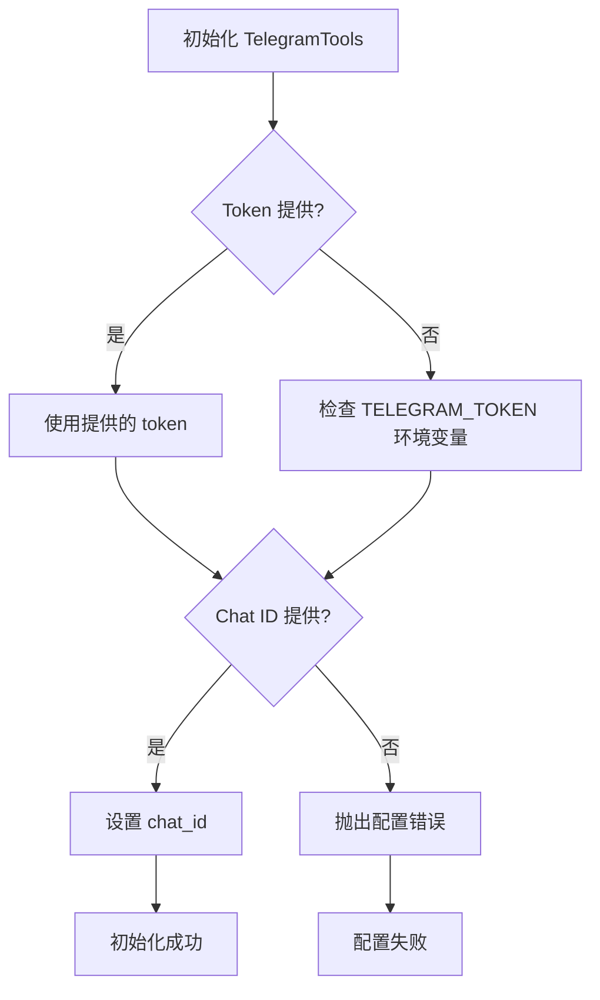

**图表来源**
- [Telegram 工具包说明:47-48](file://tools/toolkits/social/telegram.mdx#L47-L48)

## 架构概览

### 系统架构图

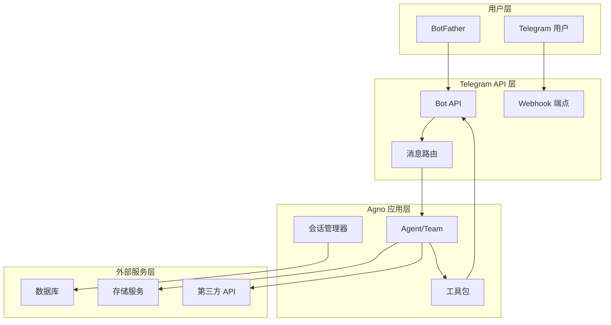

**图表来源**
- [Telegram 工具包说明:5-6](file://tools/toolkits/social/telegram.mdx#L5-L6)
- [接口概览:19-20](file://deploy/interfaces.mdx#L19-L20)

### 数据流处理流程

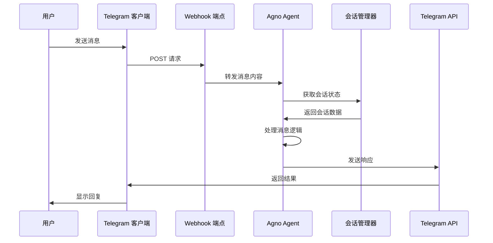

**图表来源**
- [Telegram 工具包说明:5-6](file://tools/toolkits/social/telegram.mdx#L5-L6)
- [WhatsApp 接口介绍:91-96](file://agent-os/interfaces/whatsapp/introduction.mdx#L91-L96)

## 详细组件分析

### 消息处理系统

#### 文本消息处理

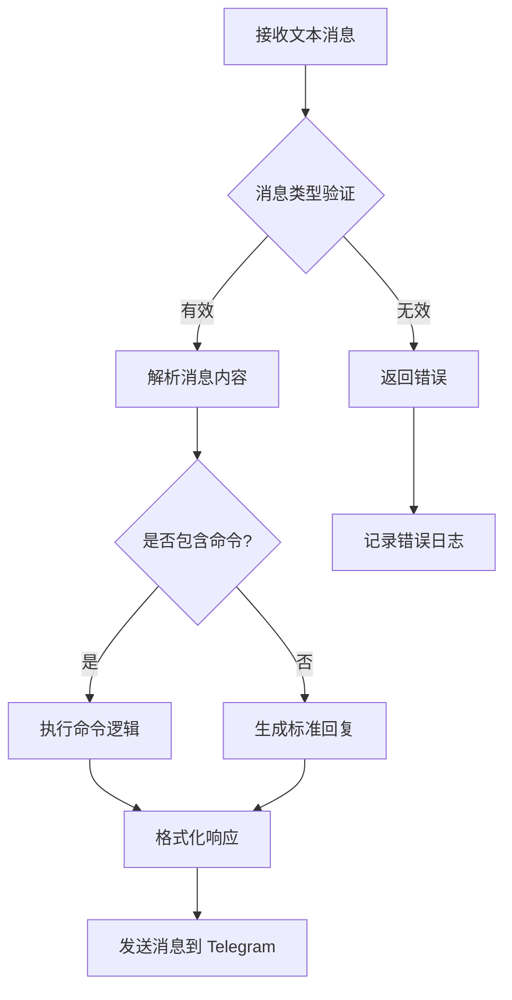

**图表来源**
- [Telegram 工具包说明:56-56](file://tools/toolkits/social/telegram.mdx#L56-L56)

#### 媒体消息处理

Telegram 工具包支持多种媒体类型的处理：

- **图片**: 支持 JPG、PNG 格式，最大文件大小限制
- **视频**: 支持 MP4、GIF 格式，带缩略图支持
- **音频**: 支持 MP3、M4A 格式，带时长显示
- **文档**: 支持 PDF、DOC、XLS 等格式
- **位置信息**: 支持经纬度坐标和地址信息

### 键盘菜单系统

#### 自定义键盘实现

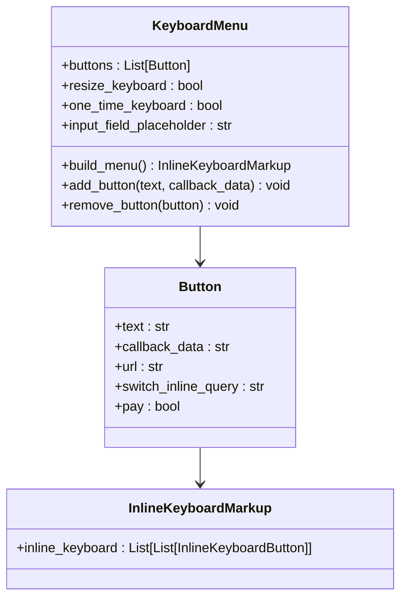

**图表来源**
- [Telegram 工具包说明:52-56](file://tools/toolkits/social/telegram.mdx#L52-L56)

#### 键盘菜单配置选项

| 选项名 | 类型 | 默认值 | 描述 |
|--------|------|--------|------|
| `resize_keyboard` | bool | False | 自动调整键盘大小以适应内容 |
| `one_time_keyboard` | bool | False | 一次性键盘，在用户选择后隐藏 |
| `input_field_placeholder` | str | "" | 输入框占位符文本 |
| `keyboard` | List[List[Dict]] | [] | 键盘按钮布局 |

### Inline 查询处理

#### 查询处理流程

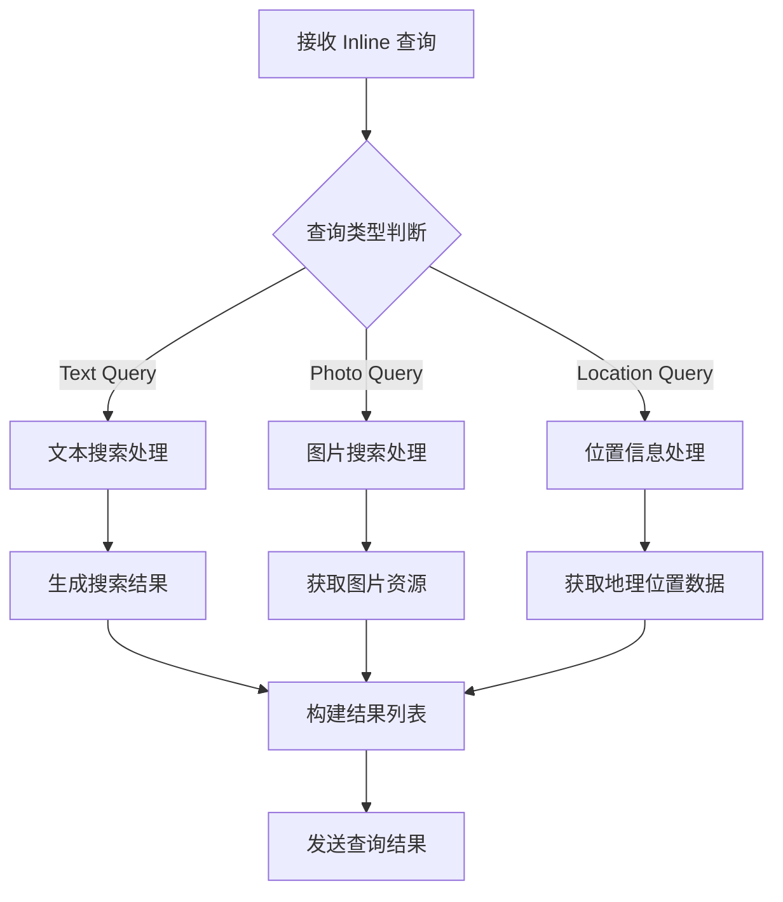

**图表来源**
- [Telegram 工具包说明:52-56](file://tools/toolkits/social/telegram.mdx#L52-L56)

### 会话管理

#### 会话状态跟踪

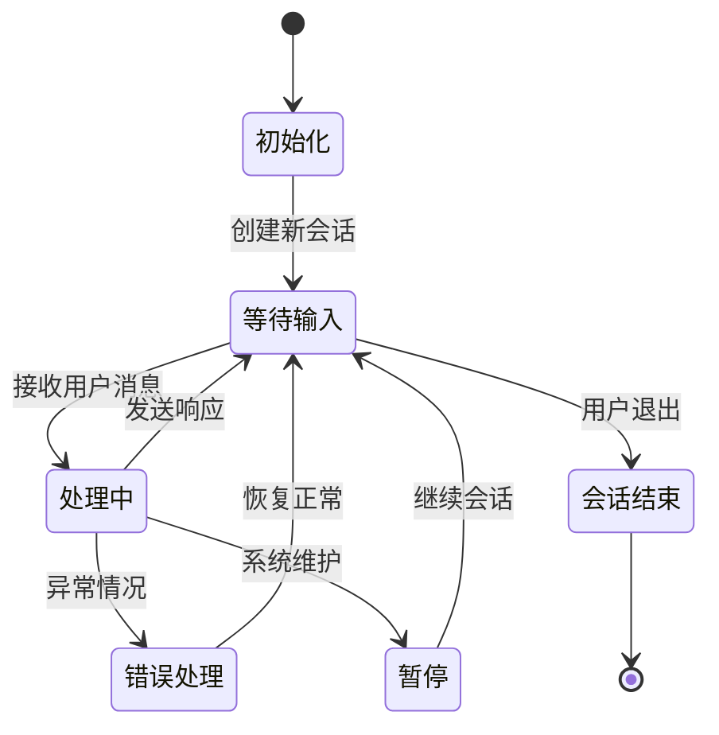

**图表来源**
- [Telegram 工具包说明:5-6](file://tools/toolkits/social/telegram.mdx#L5-L6)

## 依赖关系分析

### 外部依赖

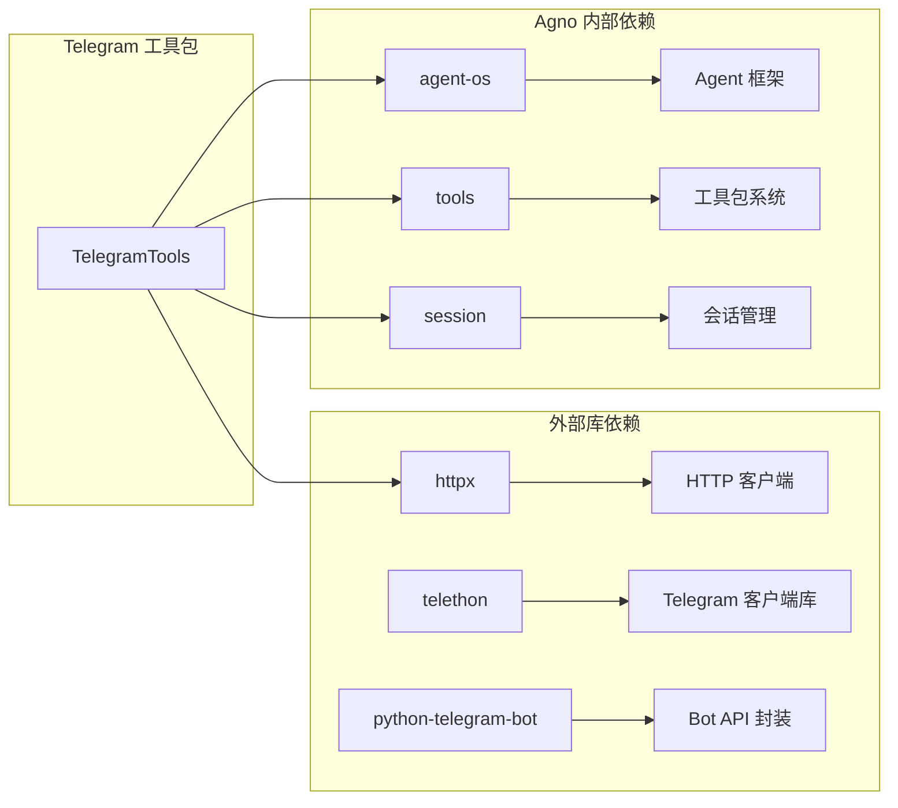

**图表来源**
- [Telegram 工具包说明:9-11](file://tools/toolkits/social/telegram.mdx#L9-L11)
- [内置工具参考:124-124](file://cookbook/tools/built-in.mdx#L124-L124)

### 内部组件依赖

| 组件 | 依赖关系 | 用途描述 |
|------|----------|----------|
| TelegramTools | Agent/Team | 执行 Telegram 操作 |
| Session Manager | Memory Store | 持久化会话状态 |
| Message Router | Handler System | 路由不同类型的消息 |
| Keyboard Builder | UI Components | 构建交互式键盘菜单 |
| Media Processor | File Storage | 处理上传的媒体文件 |

**章节来源**
- [内置工具参考:124-124](file://cookbook/tools/built-in.mdx#L124-L124)

## 性能考虑

### API 调用优化

1. **批量处理**: 对于大量消息，使用批量 API 调用减少网络往返
2. **缓存策略**: 缓存常用的配置和用户信息
3. **连接池**: 使用持久连接池提高 API 调用效率
4. **异步处理**: 支持异步消息处理避免阻塞

### 内存管理

- **会话清理**: 定期清理过期的会话数据
- **媒体文件**: 及时删除临时上传的媒体文件
- **内存监控**: 监控内存使用情况防止泄漏

### 并发处理

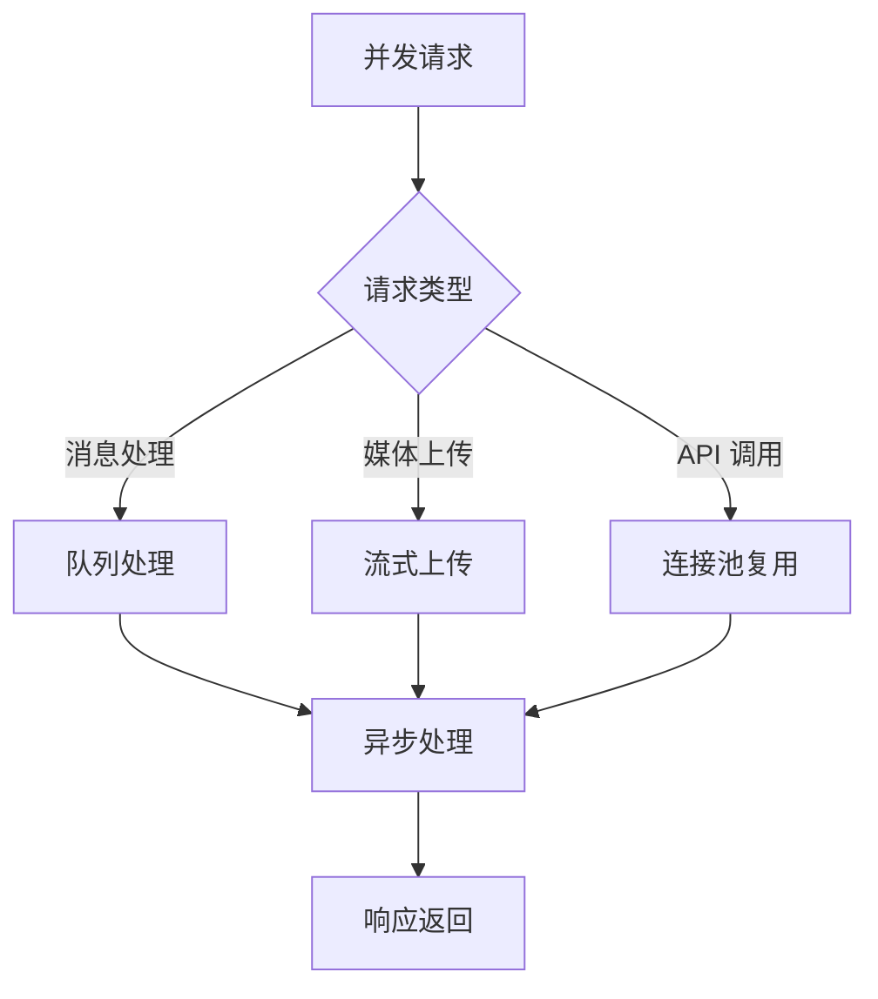

## 故障排除指南

### 常见问题及解决方案

#### 认证问题

| 问题症状 | 可能原因 | 解决方案 |
|----------|----------|----------|
| 401 未授权 | Token 无效或过期 | 重新生成 Bot Token |
| 403 禁止访问 | 权限不足 | 检查 Bot 权限设置 |
| 404 未找到 | Chat ID 错误 | 验证聊天 ID 正确性 |

#### 消息处理问题

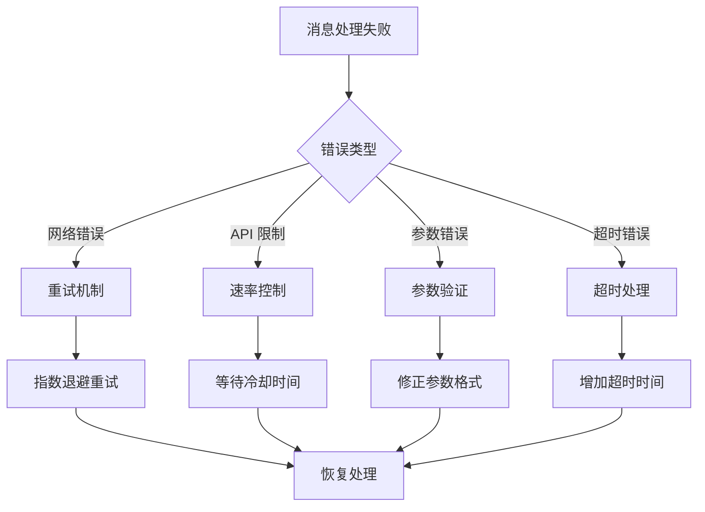

**图表来源**
- [WhatsApp 接口介绍:91-96](file://agent-os/interfaces/whatsapp/introduction.mdx#L91-L96)

#### 会话管理问题

- **会话丢失**: 检查数据库连接和会话存储配置
- **并发冲突**: 实现适当的锁机制
- **状态不一致**: 添加状态同步和校验

**章节来源**
- [WhatsApp 接口介绍:78-97](file://agent-os/interfaces/whatsapp/introduction.mdx#L78-L97)

## 结论

Telegram 工具包为 Agno 框架提供了强大的 Telegram Bot 集成功能。通过模块化的架构设计和丰富的功能特性，开发者可以快速构建智能的 Telegram 机器人应用。

该工具包的主要优势包括：

1. **易用性**: 简洁的 API 设计和灵活的配置选项
2. **扩展性**: 支持自定义功能和第三方集成
3. **可靠性**: 完善的错误处理和异常恢复机制
4. **性能**: 优化的并发处理和资源管理

未来的发展方向包括增强 AI 集成、改进多媒体处理能力和扩展更多 Telegram 特性支持。

## 附录

### 部署配置

#### 环境变量设置

```bash
# Telegram Bot 配置
export TELEGRAM_TOKEN="your-bot-token"
export TELEGRAM_CHAT_ID="target-chat-id"

# Webhook 配置
export WEBHOOK_URL="https://your-domain.com/telegram/webhook"
export WEBHOOK_SECRET="webhook-secret-key"

# 会话配置
export SESSION_STORAGE="redis://localhost:6379/0"
export SESSION_TIMEOUT="3600"
```

#### Docker 部署示例

```dockerfile
FROM python:3.9-slim

WORKDIR /app
COPY requirements.txt .
RUN pip install -r requirements.txt

COPY . .

EXPOSE 8000

CMD ["uvicorn", "main:app", "--host", "0.0.0.0", "--port", "8000"]
```

### 最佳实践

1. **安全配置**: 使用 HTTPS 和严格的访问控制
2. **监控告警**: 实施全面的日志记录和性能监控
3. **备份策略**: 定期备份会话数据和配置信息
4. **测试覆盖**: 编写完整的单元测试和集成测试

### 参考文档

- [Telegram Bot API 官方文档](https://core.telegram.org/bots/api)
- [Agno 框架文档](https://agno.ai/docs)
- [BotFather 使用指南](https://t.me/BotFather)