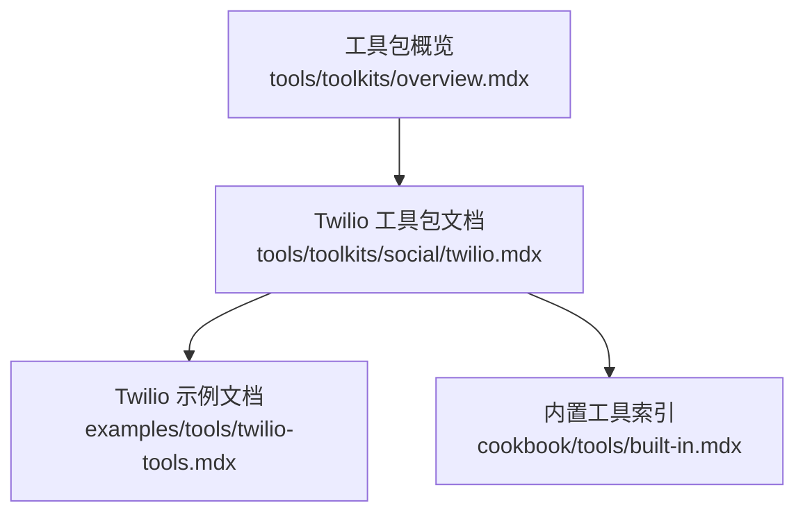
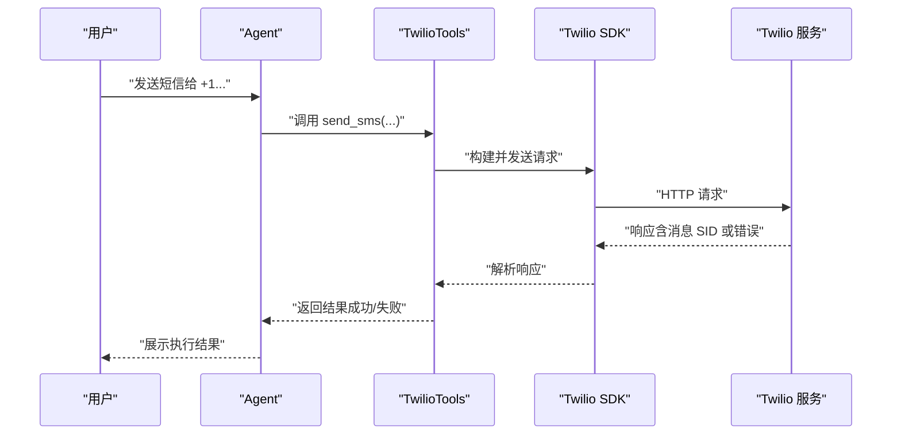
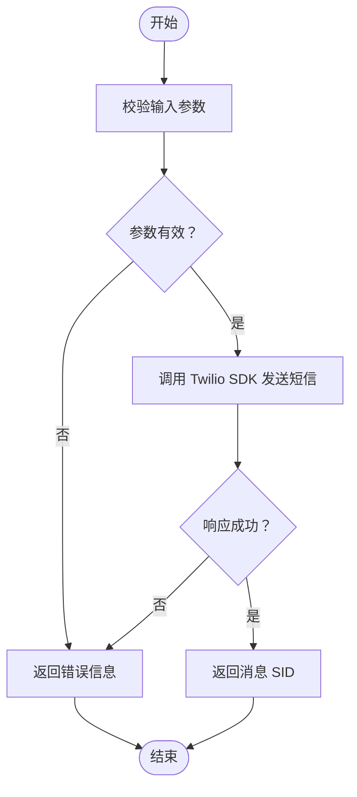
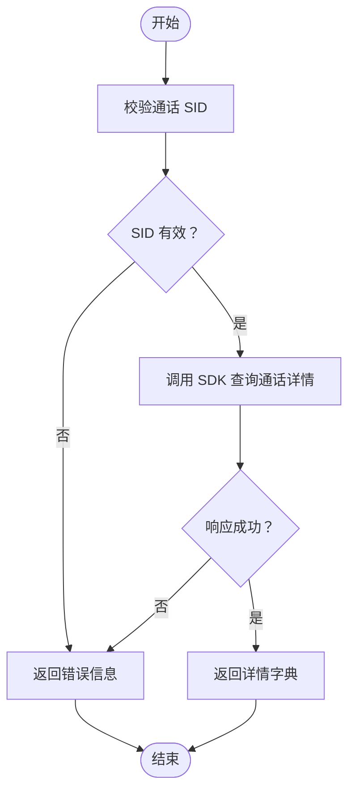
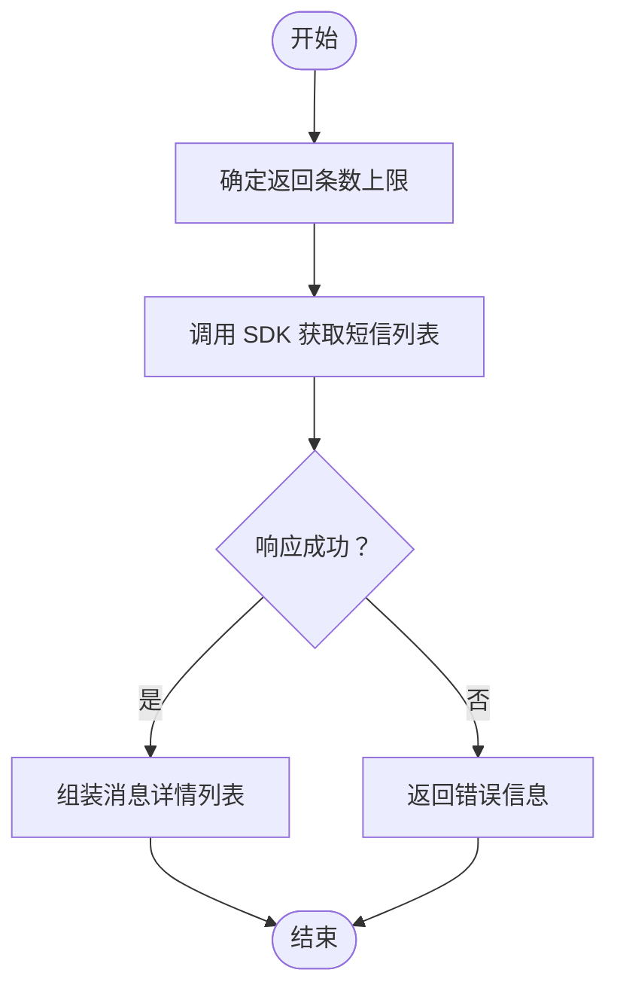
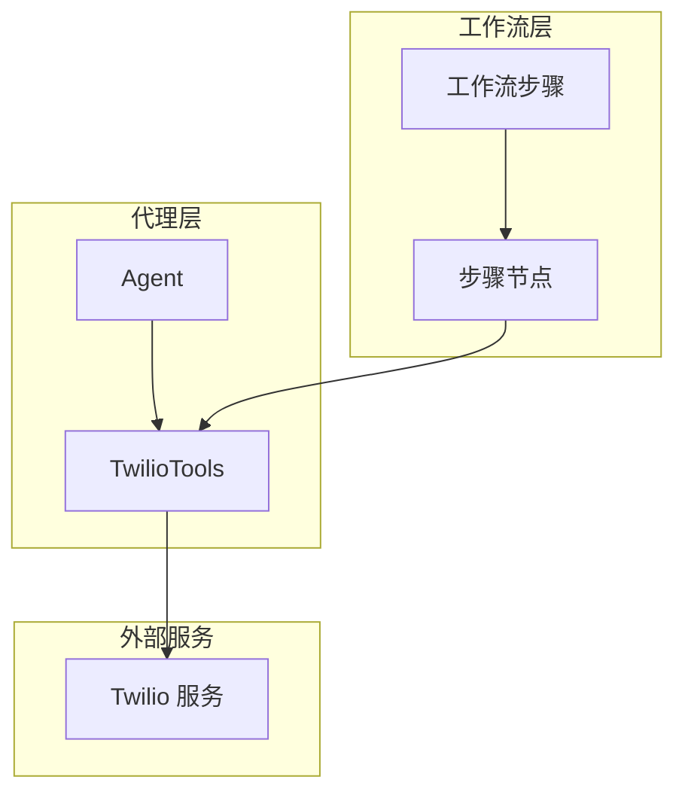
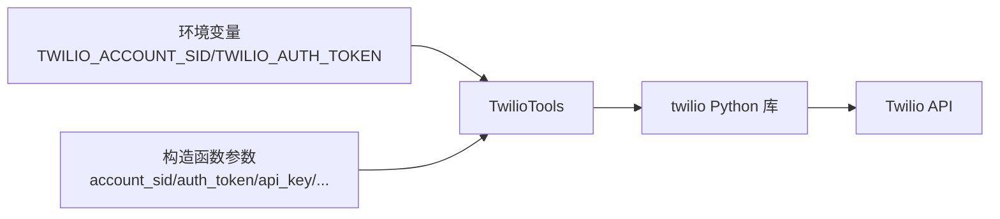

# Twilio 工具包

<cite>
**本文档引用的文件**
- [twilio.mdx](file://tools/toolkits/social/twilio.mdx)
- [twilio-tools.mdx](file://examples/tools/twilio-tools.mdx)
- [overview.mdx（工具包概览）](file://tools/toolkits/overview.mdx)
- [built-in.mdx（内置工具索引）](file://cookbook/tools/built-in.mdx)
</cite>

## 目录
1. [简介](#简介)
2. [项目结构](#项目结构)
3. [核心组件](#核心组件)
4. [架构总览](#架构总览)
5. [详细组件分析](#详细组件分析)
6. [依赖关系分析](#依赖关系分析)
7. [性能考虑](#性能考虑)
8. [故障排查指南](#故障排查指南)
9. [结论](#结论)
10. [附录](#附录)

## 简介
本文件面向在 Agno 中集成 Twilio 服务的开发者与产品团队，系统化说明如何配置 Twilio 账户与凭据、启用并使用 Twilio 工具包的各项能力（短信发送、通话详情查询、短信列表查询），以及在代理与工作流中落地典型场景（客户通知、语音客服、多媒体消息）。同时提供 API 使用建议、费用与合规注意事项，帮助您在安全与成本可控的前提下高效交付。

## 项目结构
Twilio 工具包位于工具包目录下，配套示例与参数说明集中于文档页，便于快速上手与参考。

图表来源
- [overview.mdx（工具包概览）](file://tools/toolkits/overview.mdx)
- [twilio.mdx](file://tools/toolkits/social/twilio.mdx)
- [twilio-tools.mdx](file://examples/tools/twilio-tools.mdx)
- [built-in.mdx（内置工具索引）](file://cookbook/tools/built-in.mdx)

章节来源
- [twilio.mdx](file://tools/toolkits/social/twilio.mdx)
- [twilio-tools.mdx](file://examples/tools/twilio-tools.mdx)
- [overview.mdx（工具包概览）](file://tools/toolkits/overview.mdx)
- [built-in.mdx（内置工具索引）](file://cookbook/tools/built-in.mdx)

## 核心组件
- TwilioTools：封装对 Twilio 的调用能力，支持按需启用短信发送、通话详情查询、短信列表查询等功能。
- 凭据与认证：支持通过环境变量或构造函数传参的方式注入 Account SID、Auth Token、API Key/Secret、区域与边缘等参数。
- 集成方式：可直接作为工具添加到 Agent；也可在工作流中以步骤形式调用。

章节来源
- [twilio.mdx](file://tools/toolkits/social/twilio.mdx)

## 架构总览
下图展示了 Twilio 工具包在 Agno 中的典型调用路径：Agent 通过工具调用 TwilioTools，TwilioTools 将请求转发至 Twilio SDK，并最终由 Twilio 服务返回结果。

图表来源
- [twilio.mdx](file://tools/toolkits/social/twilio.mdx)

## 详细组件分析

### 组件一：TwilioTools 参数与能力矩阵
- 认证参数
  - account_sid：账户 SID（优先从环境变量或构造函数传入）
  - auth_token：认证令牌（优先从环境变量或构造函数传入）
  - api_key / api_secret：API Key/Secret（替代账户级凭据）
  - region / edge：区域与边缘（可选）
- 功能开关
  - enable_send_sms：是否启用短信发送
  - enable_get_call_details：是否启用通话详情查询
  - enable_list_messages：是否启用短信列表查询
  - all：一键启用全部功能
- 调试
  - debug：开启调试日志以便排障

章节来源
- [twilio.mdx](file://tools/toolkits/social/twilio.mdx)

### 组件二：短信发送（send_sms）
- 输入：接收方手机号、发送方手机号（Twilio 号码）、短信正文
- 输出：成功时返回消息 SID；失败时返回错误信息
- 典型用途：客户通知、验证码下发、营销提醒等

图表来源
- [twilio.mdx](file://tools/toolkits/social/twilio.mdx)

章节来源
- [twilio.mdx](file://tools/toolkits/social/twilio.mdx)

### 组件三：通话详情查询（get_call_details）
- 输入：通话 SID
- 输出：通话状态、时长等详情字典
- 典型用途：客服工单关联通话记录、计费核对、质量审计

图表来源
- [twilio.mdx](file://tools/toolkits/social/twilio.mdx)

章节来源
- [twilio.mdx](file://tools/toolkits/social/twilio.mdx)

### 组件四：短信列表查询（list_messages）
- 输入：返回条数上限（默认 20）
- 输出：消息列表（含消息 SID、发送方、接收方、正文、状态等）
- 典型用途：消息审计、历史检索、对账与合规

图表来源
- [twilio.mdx](file://tools/toolkits/social/twilio.mdx)

章节来源
- [twilio.mdx](file://tools/toolkits/social/twilio.mdx)

### 组件五：在代理与工作流中的应用
- 客户通知
  - 场景：订单状态变更、物流更新、支付结果通知
  - 实现：Agent 使用 TwilioTools.send_sms 发送模板化短信
- 语音客服
  - 场景：IVR 自动应答、转接人工、录音归档
  - 实现：结合通话详情查询与通话 SID 关联工单
- 多媒体消息
  - 场景：带图片/文件的营销推送
  - 实现：基于短信扩展能力（如 MMS），在 Twilio 控制台配置并按平台规范开发

图表来源
- [twilio.mdx](file://tools/toolkits/social/twilio.mdx)
- [twilio-tools.mdx](file://examples/tools/twilio-tools.mdx)

章节来源
- [twilio-tools.mdx](file://examples/tools/twilio-tools.mdx)

## 依赖关系分析
- 依赖库：twilio Python 库（通过包管理器安装）
- 环境变量：TWILIO_ACCOUNT_SID、TWILIO_AUTH_TOKEN（亦可通过构造函数传入）
- 在 Agno 中的集成点：Agent 工具注册、工作流步骤调用

图表来源
- [twilio.mdx](file://tools/toolkits/social/twilio.mdx)

章节来源
- [twilio.mdx](file://tools/toolkits/social/twilio.mdx)

## 性能考虑
- 并发与限速：遵循 Twilio 的速率限制与配额策略，避免触发瞬时限流导致失败率上升。
- 批量发送：聚合短时间内的多条短信，减少 API 调用次数，但需遵守运营商与地区规则。
- 缓存与重试：对失败的发送进行指数退避重试，避免雪崩式重试。
- 日志与监控：开启 debug 模式辅助定位问题，生产环境建议仅在必要时开启。

## 故障排查指南
- 常见问题
  - 凭据无效：检查 TWILIO_ACCOUNT_SID 与 TWILIO_AUTH_TOKEN 是否正确设置或传入。
  - 区域/边缘配置：若使用特定 region/edge，请确认其合法性与网络可达性。
  - 号码格式：确保收发号码符合 E.164 格式，且发送方号码已在 Twilio 控制台完成验证与购买。
  - 功能未启用：确认对应 enable_* 开关已打开，或 all=True。
- 排查步骤
  - 启用 debug 日志，复现问题并观察 SDK 返回的错误码与描述。
  - 使用最小可复现示例（仅启用 send_sms）验证链路。
  - 检查 Twilio 控制台的用量与告警，确认账户状态正常。

章节来源
- [twilio.mdx](file://tools/toolkits/social/twilio.mdx)

## 结论
Twilio 工具包为在 Agno 中集成短信与通话能力提供了简洁稳定的接口。通过合理的凭据管理、功能开关与调试策略，可在代理与工作流中快速落地客户通知、语音客服与多媒体消息等场景。建议在上线前完成充分的压测与合规审查，并建立完善的监控与告警机制。

## 附录

### A. 快速开始清单
- 在 Twilio 控制台获取 Account SID 与 Auth Token
- 安装 twilio Python 库
- 设置环境变量或在构造函数中传入凭据
- 在 Agent 中注册 TwilioTools，按需启用功能
- 运行示例并观察结果

章节来源
- [twilio.mdx](file://tools/toolkits/social/twilio.mdx)
- [twilio-tools.mdx](file://examples/tools/twilio-tools.mdx)

### B. API 限制与费用（通用指导）
- 限制
  - 速率限制：根据套餐与地区不同，Twilio 对每秒/每分钟请求数有限制，建议在业务侧做节流与队列化处理。
  - 号码与内容审核：发送方号码需验证，短信内容需符合目的地国家/地区的广告与营销法规。
- 费用
  - 短信单价与目的地相关，建议在测试阶段使用沙盒号码与模板消息，避免产生真实费用。
  - 通话计费按分钟与目的地计价，建议在非生产环境关闭真实拨出权限。
- 合规
  - 明示收集与使用目的，提供退订渠道（如回复“TD”）。
  - 遵守 GDPR、CASL、TCPA 等法规，保留用户同意证据与退订记录。

### C. 相关入口与参考
- 工具包概览：社交类工具包入口
- Twilio 工具包文档：参数、方法与示例
- Twilio 示例：Agent 集成与运行示例
- 内置工具索引：工具导入路径与分类

章节来源
- [overview.mdx（工具包概览）](file://tools/toolkits/overview.mdx)
- [twilio.mdx](file://tools/toolkits/social/twilio.mdx)
- [twilio-tools.mdx](file://examples/tools/twilio-tools.mdx)
- [built-in.mdx（内置工具索引）](file://cookbook/tools/built-in.mdx)