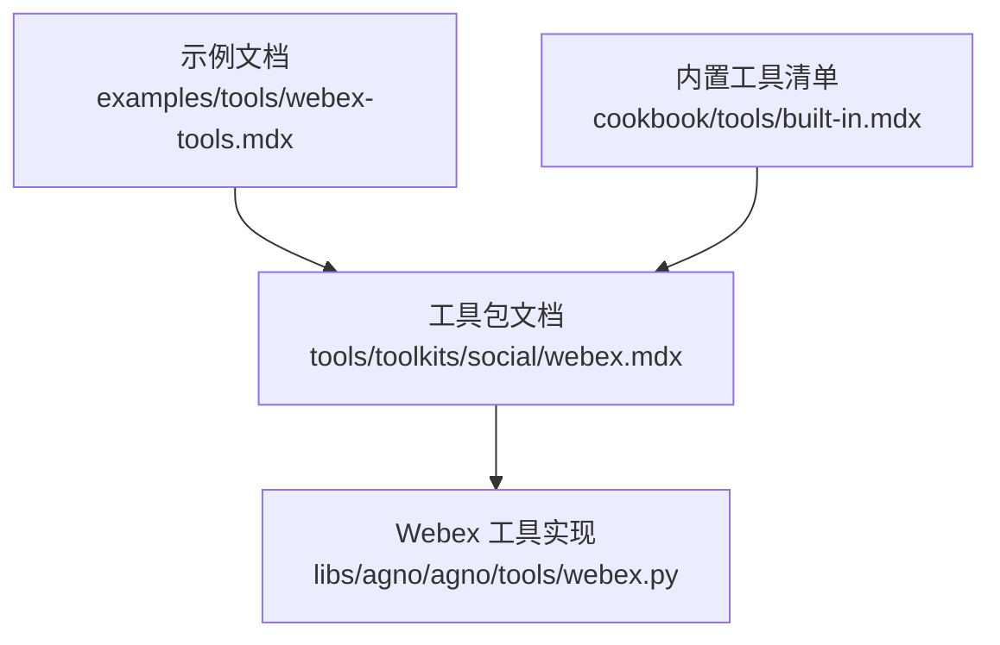
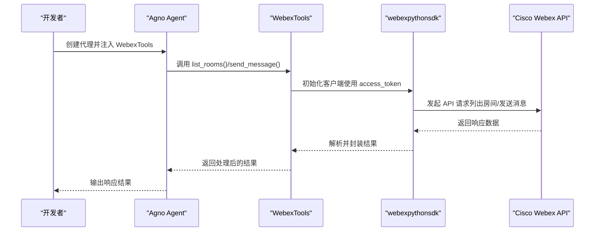
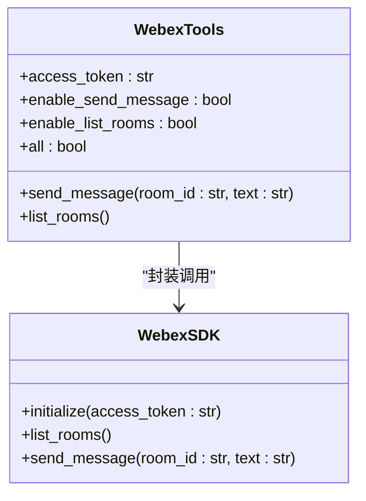
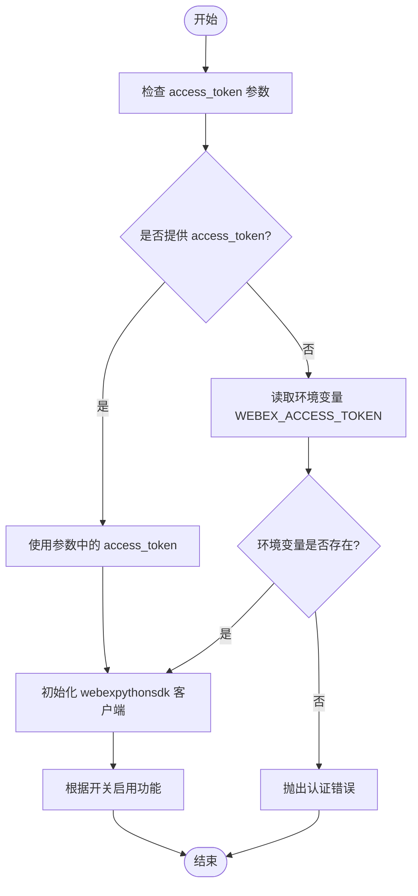
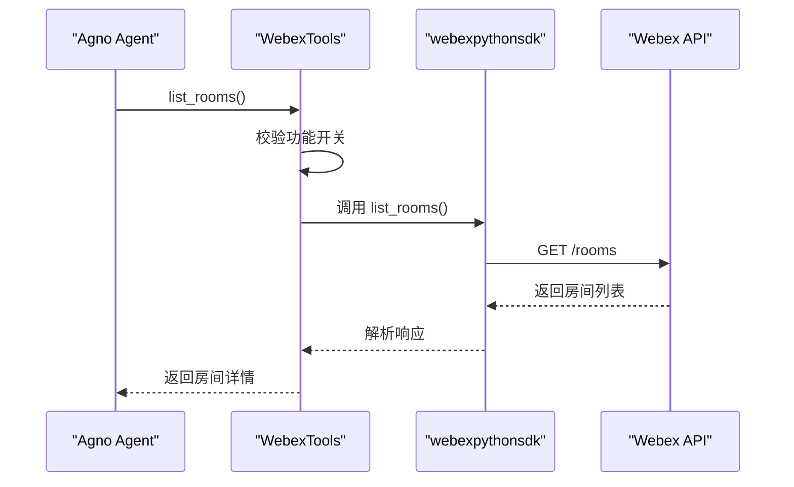
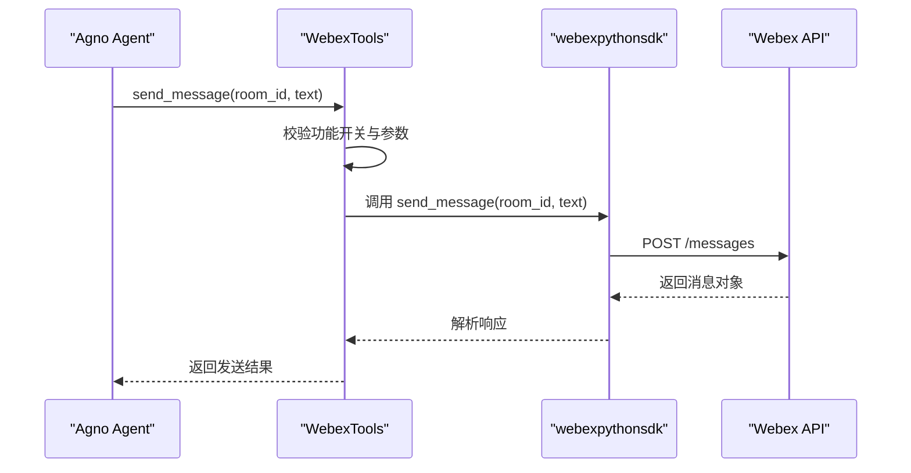
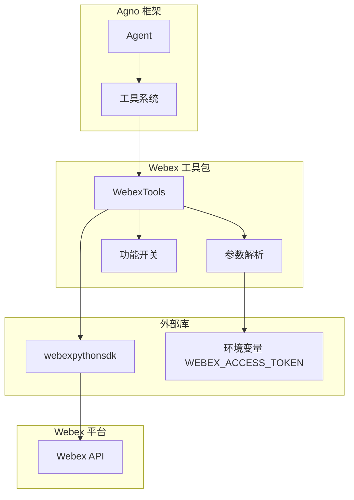

# Webex 工具包

<cite>
**本文档引用的文件**
- [webex.mdx](file://examples/tools/webex-tools.mdx)
- [webex.mdx](file://tools/toolkits/social/webex.mdx)
- [built-in.mdx](file://cookbook/tools/built-in.mdx)
</cite>

## 目录
1. [简介](#简介)
2. [项目结构](#项目结构)
3. [核心组件](#核心组件)
4. [架构概览](#架构概览)
5. [详细组件分析](#详细组件分析)
6. [依赖关系分析](#依赖关系分析)
7. [性能考虑](#性能考虑)
8. [故障排除指南](#故障排除指南)
9. [结论](#结论)
10. [附录](#附录)

## 简介
本文件为 Webex 工具包的技术文档，面向希望在 Agno 框架中集成 Cisco Webex API 的开发者。该工具包通过 WebexTools 提供对 Webex 团队协作平台的核心能力支持，包括房间列表查询与消息发送功能，帮助实现企业通信自动化与工作流集成。

## 项目结构
Webex 工具包相关文档分布在以下位置：
- 示例与使用说明：examples/tools/webex-tools.mdx
- 工具包官方文档：tools/toolkits/social/webex.mdx
- 内置工具清单：cookbook/tools/built-in.mdx

**图表来源**
- [webex.mdx](file://examples/tools/webex-tools.mdx)
- [webex.mdx](file://tools/toolkits/social/webex.mdx)
- [built-in.mdx](file://cookbook/tools/built-in.mdx)

**章节来源**
- [webex.mdx](file://examples/tools/webex-tools.mdx)
- [webex.mdx](file://tools/toolkits/social/webex.mdx)
- [built-in.mdx](file://cookbook/tools/built-in.mdx)

## 核心组件
Webex 工具包的核心是 WebexTools，它允许代理（Agent）与 Cisco Webex 进行交互，主要功能包括：
- 列出所有可用的 Webex 房间/空间
- 向指定房间发送消息

参数配置：
- access_token：Webex 访问令牌；若未提供则从环境变量 WEBEX_ACCESS_TOKEN 读取
- enable_send_message：是否启用发送消息功能，默认开启
- enable_list_rooms：是否启用列出房间功能，默认开启
- all：一键启用所有功能

函数接口：
- send_message(room_id: str, text: str)：向目标房间发送文本消息
- list_rooms()：返回房间列表，包含 ID、标题、类型与可见性等信息

**章节来源**
- [webex.mdx](file://tools/toolkits/social/webex.mdx)

## 架构概览
Webex 工具包在 Agno 中的集成路径如下：

**图表来源**
- [webex.mdx](file://tools/toolkits/social/webex.mdx)
- [webex.mdx](file://examples/tools/webex-tools.mdx)

## 详细组件分析

### 组件一：WebexTools 类与方法
WebexTools 作为工具类，负责与 Webex API 交互。其关键职责包括：
- 参数解析与校验（access_token、功能开关）
- 通过 webexpythonsdk 封装底层 API 调用
- 对返回数据进行格式化，便于代理消费

**图表来源**
- [webex.mdx](file://tools/toolkits/social/webex.mdx)

**章节来源**
- [webex.mdx](file://tools/toolkits/social/webex.mdx)

### 组件二：认证与初始化流程
WebexTools 的认证基于访问令牌（Access Token），可通过以下方式提供：
- 直接传入构造参数 access_token
- 通过环境变量 WEBEX_ACCESS_TOKEN 注入

初始化步骤：
1. 从环境变量或参数读取 access_token
2. 使用 webexpythonsdk 初始化客户端
3. 根据功能开关决定启用 list_rooms 或 send_message

**图表来源**
- [webex.mdx](file://tools/toolkits/social/webex.mdx)

**章节来源**
- [webex.mdx](file://tools/toolkits/social/webex.mdx)

### 组件三：API 调用序列
以“列出房间”为例，典型调用序列如下：

**图表来源**
- [webex.mdx](file://tools/toolkits/social/webex.mdx)

**章节来源**
- [webex.mdx](file://tools/toolkits/social/webex.mdx)

### 组件四：消息发送流程
以“向房间发送消息”为例，典型调用序列如下：

**图表来源**
- [webex.mdx](file://tools/toolkits/social/webex.mdx)

**章节来源**
- [webex.mdx](file://tools/toolkits/social/webex.mdx)

## 依赖关系分析
Webex 工具包的外部依赖与内部耦合关系如下：

**图表来源**
- [webex.mdx](file://tools/toolkits/social/webex.mdx)
- [webex.mdx](file://examples/tools/webex-tools.mdx)

**章节来源**
- [webex.mdx](file://tools/toolkits/social/webex.mdx)
- [webex.mdx](file://examples/tools/webex-tools.mdx)

## 性能考虑
- 功能开关优化：通过 enable_list_rooms 和 enable_send_message 控制功能启用，减少不必要的 API 调用。
- 环境变量优先：建议使用环境变量注入 access_token，避免在代码中硬编码，提升安全性与可维护性。
- 批量操作：如需频繁发送消息，建议合并请求或使用异步机制（若框架支持）以降低延迟。
- 缓存策略：对于房间列表等静态信息，可在应用层缓存以减少重复查询。

## 故障排除指南
常见问题与解决方案：
- 认证失败
  - 确认 access_token 是否正确设置，或检查 WEBEX_ACCESS_TOKEN 环境变量是否生效。
  - 若令牌丢失，可在 Webex 开发者门户重新生成并更新环境变量。
- 权限不足
  - 确保机器人账号具有访问房间列表与发送消息的权限。
  - 在 Webex 开发者门户确认应用权限范围。
- API 限制
  - 遵循 Webex API 的速率限制与配额策略，避免触发限流。
  - 对高频调用场景增加重试与退避策略。
- 网络异常
  - 检查网络连通性与代理设置，确保可访问 Webex API。
- 参数错误
  - 确保 room_id 有效且可访问，text 不为空或过长。

**章节来源**
- [webex.mdx](file://tools/toolkits/social/webex.mdx)
- [webex.mdx](file://examples/tools/webex-tools.mdx)

## 结论
Webex 工具包为 Agno 提供了简洁而强大的 Webex 集成能力，通过 WebexTools 实现房间列表查询与消息发送两大核心功能。借助清晰的参数配置与功能开关，开发者可以灵活地在不同场景下启用所需能力，并结合 Agno 的代理能力实现企业级的自动化协作与工作流集成。

## 附录

### 快速开始
- 在 Webex 开发者门户创建机器人并获取访问令牌
- 安装依赖：webexpythonsdk
- 设置环境变量 WEBEX_ACCESS_TOKEN
- 在 Agno 中创建代理并注入 WebexTools，即可调用 list_rooms 与 send_message

**章节来源**
- [webex.mdx](file://tools/toolkits/social/webex.mdx)
- [webex.mdx](file://examples/tools/webex-tools.mdx)