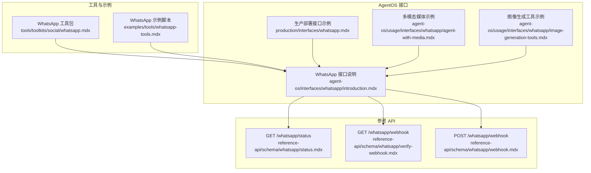
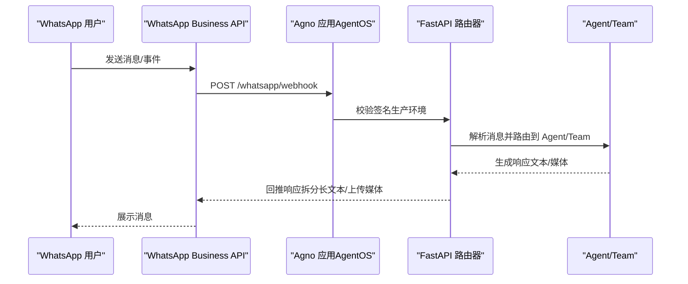
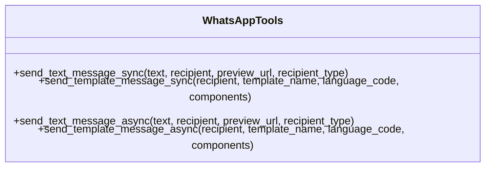
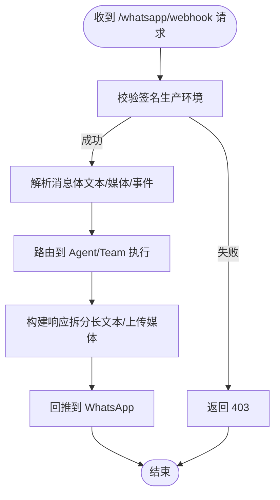
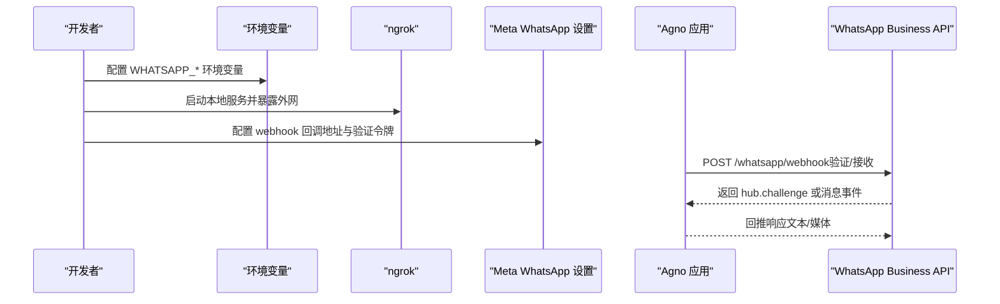
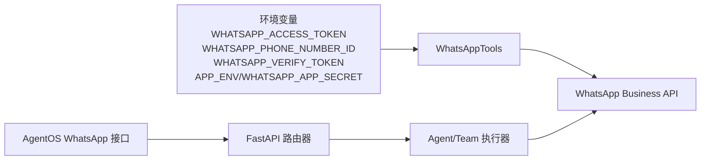

# WhatsApp 工具包

<cite>
**本文引用的文件**
- [setup-whatsapp-app.mdx](file://TBD/snippets/setup-whatsapp-app.mdx)
- [whatsapp.mdx](file://tools/toolkits/social/whatsapp.mdx)
- [whatsapp-tools.mdx](file://examples/tools/whatsapp-tools.mdx)
- [whatsapp.mdx](file://production/interfaces/whatsapp.mdx)
- [introduction.mdx](file://agent-os/interfaces/whatsapp/introduction.mdx)
- [webhook.mdx](file://reference-api/schema/whatsapp/webhook.mdx)
- [status.mdx](file://reference-api/schema/whatsapp/status.mdx)
- [verify-webhook.mdx](file://reference-api/schema/whatsapp/verify-webhook.mdx)
- [agent-with-media.mdx](file://agent-os/usage/interfaces/whatsapp/agent-with-media.mdx)
- [image-generation-tools.mdx](file://agent-os/usage/interfaces/whatsapp/image-generation-tools.mdx)
</cite>

## 目录
1. [简介](#简介)
2. [项目结构](#项目结构)
3. [核心组件](#核心组件)
4. [架构总览](#架构总览)
5. [详细组件分析](#详细组件分析)
6. [依赖关系分析](#依赖关系分析)
7. [性能考虑](#性能考虑)
8. [故障排查指南](#故障排查指南)
9. [结论](#结论)
10. [附录](#附录)

## 简介
本技术文档面向在 Agno 中集成 WhatsApp Business API 的开发者与产品团队，系统化说明如何完成企业账户注册、消息模板与媒体处理配置，并基于 WhatsApp 工具包实现消息发送、模板消息、互动按钮与用户状态管理。同时，文档提供在客户服务与营销自动化场景下的应用范式（自动回复、营销活动、客户支持），并总结合规性要求、消息限制与最佳实践，帮助团队安全、稳定地交付 WhatsApp 机器人服务。

## 项目结构
围绕 WhatsApp 集成，仓库中存在三类关键文档：
- 快餐式工具包：提供 WhatsAppTools 工具集，支持同步/异步文本与模板消息发送。
- AgentOS 接口：提供 WhatsApp 接口封装，挂载 webhook 路由，接收与回推消息，支持多模态媒体处理。
- 参考 API：定义 WhatsApp 接口的健康检查与 webhook 验证/回调端点。



**图表来源**
- [whatsapp.mdx:1-83](file://tools/toolkits/social/whatsapp.mdx#L1-L83)
- [whatsapp-tools.mdx:1-81](file://examples/tools/whatsapp-tools.mdx#L1-L81)
- [introduction.mdx:1-98](file://agent-os/interfaces/whatsapp/introduction.mdx#L1-L98)
- [whatsapp.mdx:1-137](file://production/interfaces/whatsapp.mdx#L1-L137)
- [agent-with-media.mdx:1-56](file://agent-os/usage/interfaces/whatsapp/agent-with-media.mdx#L1-L56)
- [image-generation-tools.mdx:1-51](file://agent-os/usage/interfaces/whatsapp/image-generation-tools.mdx#L1-L51)
- [status.mdx:1-3](file://reference-api/schema/whatsapp/status.mdx#L1-L3)
- [verify-webhook.mdx:1-3](file://reference-api/schema/whatsapp/verify-webhook.mdx#L1-L3)
- [webhook.mdx:1-3](file://reference-api/schema/whatsapp/webhook.mdx#L1-L3)

**章节来源**
- [whatsapp.mdx:1-83](file://tools/toolkits/social/whatsapp.mdx#L1-L83)
- [whatsapp-tools.mdx:1-81](file://examples/tools/whatsapp-tools.mdx#L1-L81)
- [introduction.mdx:1-98](file://agent-os/interfaces/whatsapp/introduction.mdx#L1-L98)
- [whatsapp.mdx:1-137](file://production/interfaces/whatsapp.mdx#L1-L137)
- [agent-with-media.mdx:1-56](file://agent-os/usage/interfaces/whatsapp/agent-with-media.mdx#L1-L56)
- [image-generation-tools.mdx:1-51](file://agent-os/usage/interfaces/whatsapp/image-generation-tools.mdx#L1-L51)
- [status.mdx:1-3](file://reference-api/schema/whatsapp/status.mdx#L1-L3)
- [verify-webhook.mdx:1-3](file://reference-api/schema/whatsapp/verify-webhook.mdx#L1-L3)
- [webhook.mdx:1-3](file://reference-api/schema/whatsapp/webhook.mdx#L1-L3)

## 核心组件
- WhatsApp 工具包（WhatsAppTools）
  - 支持同步/异步文本消息与模板消息发送。
  - 参数包括访问令牌、手机号 ID、API 版本、默认收件人 WAID、异步模式等。
  - 提供函数：发送文本消息（同步/异步）、发送模板消息（同步/异步）。
- AgentOS WhatsApp 接口
  - 封装 FastAPI 路由，挂载 /whatsapp 前缀的健康检查与 webhook 验证/回调端点。
  - 支持签名验证（生产环境 X-Hub-Signature-256），开发模式可放宽。
  - 处理文本、图片、视频、音频、文档等多模态消息；长文本拆分、生成图片上传后发送。
  - 自动以用户电话号码作为 user_id 与 session_id，确保会话与记忆按用户隔离。
- 参考 API
  - GET /whatsapp/status：健康检查。
  - GET /whatsapp/webhook：验证回调（hub.challenge）。
  - POST /whatsapp/webhook：接收事件并回推消息。

**章节来源**
- [whatsapp.mdx:61-79](file://tools/toolkits/social/whatsapp.mdx#L61-L79)
- [introduction.mdx:54-98](file://agent-os/interfaces/whatsapp/introduction.mdx#L54-L98)
- [status.mdx:1-3](file://reference-api/schema/whatsapp/status.mdx#L1-L3)
- [verify-webhook.mdx:1-3](file://reference-api/schema/whatsapp/verify-webhook.mdx#L1-L3)
- [webhook.mdx:1-3](file://reference-api/schema/whatsapp/webhook.mdx#L1-L3)

## 架构总览
下图展示从 WhatsApp 用户到 AgentOS 接口、再到 Agent/Team 的端到端流程，以及 webhook 验证与签名校验的关键节点。



**图表来源**
- [introduction.mdx:78-97](file://agent-os/interfaces/whatsapp/introduction.mdx#L78-L97)
- [webhook.mdx:1-3](file://reference-api/schema/whatsapp/webhook.mdx#L1-L3)

**章节来源**
- [introduction.mdx:78-97](file://agent-os/interfaces/whatsapp/introduction.mdx#L78-L97)

## 详细组件分析

### 组件一：WhatsApp 工具包（WhatsAppTools）
- 功能定位
  - 在 Agent 内部通过工具方式调用 WhatsApp Business API，发送文本与模板消息。
  - 支持同步与异步两种发送模式，便于吞吐优化与并发控制。
- 关键参数
  - 访问令牌、手机号 ID、API 版本、默认收件人 WAID、异步开关。
- 关键方法
  - 发送文本消息（同步/异步）
  - 发送模板消息（同步/异步）



**图表来源**
- [whatsapp.mdx:71-79](file://tools/toolkits/social/whatsapp.mdx#L71-L79)

**章节来源**
- [whatsapp.mdx:61-79](file://tools/toolkits/social/whatsapp.mdx#L61-L79)

### 组件二：AgentOS WhatsApp 接口
- 初始化与路由
  - 提供 Whatsapp 接口类，封装 Agent 或 Team 并返回 FastAPI 路由。
- 端点说明
  - GET /whatsapp/status：健康检查。
  - GET /whatsapp/webhook：验证回调（hub.challenge）。
  - POST /whatsapp/webhook：接收事件并回推消息。
- 安全与签名
  - 生产环境使用 X-Hub-Signature-256 校验；开发模式可放宽。
- 多模态与会话
  - 支持文本、图片、视频、音频、文档；长文本拆分；生成图片上传后发送。
  - 以用户电话号码作为 user_id 与 session_id，确保会话隔离。



**图表来源**
- [introduction.mdx:86-97](file://agent-os/interfaces/whatsapp/introduction.mdx#L86-L97)

**章节来源**
- [introduction.mdx:54-98](file://agent-os/interfaces/whatsapp/introduction.mdx#L54-L98)

### 组件三：参考 API（端点定义）
- GET /whatsapp/status：用于健康检查。
- GET /whatsapp/webhook：用于 webhook 验证（hub.challenge）。
- POST /whatsapp/webhook：用于接收消息与事件。

```mermaid
erDiagram
ENDPOINTS {
string METHOD
string PATH
string DESCRIPTION
}
ENDPOINTS {
"GET" "whatsapp/status" "健康检查"
"GET" "whatsapp/webhook" "验证回调"
"POST" "whatsapp/webhook" "接收消息与事件"
}
```

**图表来源**
- [status.mdx:1-3](file://reference-api/schema/whatsapp/status.mdx#L1-L3)
- [verify-webhook.mdx:1-3](file://reference-api/schema/whatsapp/verify-webhook.mdx#L1-L3)
- [webhook.mdx:1-3](file://reference-api/schema/whatsapp/webhook.mdx#L1-L3)

**章节来源**
- [status.mdx:1-3](file://reference-api/schema/whatsapp/status.mdx#L1-L3)
- [verify-webhook.mdx:1-3](file://reference-api/schema/whatsapp/verify-webhook.mdx#L1-L3)
- [webhook.mdx:1-3](file://reference-api/schema/whatsapp/webhook.mdx#L1-L3)

### 组件四：示例与部署
- 工具包示例
  - 使用 WhatsAppTools 创建 Agent 并发送模板消息。
- 生产部署示例
  - 通过 AgentOS 挂载 WhatsApp 接口，结合 ngrok 进行本地验证与 webhook 配置。
- 多模态与图像生成
  - 结合数据库与图像生成工具，实现媒体分析与生成能力。



**图表来源**
- [whatsapp-tools.mdx:34-81](file://examples/tools/whatsapp-tools.mdx#L34-L81)
- [whatsapp.mdx:79-121](file://production/interfaces/whatsapp.mdx#L79-L121)
- [setup-whatsapp-app.mdx:41-86](file://TBD/snippets/setup-whatsapp-app.mdx#L41-L86)

**章节来源**
- [whatsapp-tools.mdx:1-81](file://examples/tools/whatsapp-tools.mdx#L1-L81)
- [whatsapp.mdx:1-137](file://production/interfaces/whatsapp.mdx#L1-L137)
- [setup-whatsapp-app.mdx:1-88](file://TBD/snippets/setup-whatsapp-app.mdx#L1-L88)
- [agent-with-media.mdx:1-56](file://agent-os/usage/interfaces/whatsapp/agent-with-media.mdx#L1-L56)
- [image-generation-tools.mdx:1-51](file://agent-os/usage/interfaces/whatsapp/image-generation-tools.mdx#L1-L51)

## 依赖关系分析
- 工具包依赖
  - WhatsAppTools 依赖 WhatsApp Business API 的访问令牌、手机号 ID、API 版本等环境变量。
  - 支持同步/异步发送，降低阻塞与提升吞吐。
- 接口依赖
  - AgentOS WhatsApp 接口依赖 FastAPI 路由器与 Agent/Team 执行器。
  - 依赖签名验证（生产环境）与多模态消息处理能力。
- API 依赖
  - 依赖参考 API 的端点定义，确保与 WhatsApp Business API 的对接一致。



**图表来源**
- [whatsapp.mdx:20-27](file://tools/toolkits/social/whatsapp.mdx#L20-L27)
- [introduction.mdx:12-17](file://agent-os/interfaces/whatsapp/introduction.mdx#L12-L17)
- [whatsapp.mdx:79-86](file://production/interfaces/whatsapp.mdx#L79-L86)

**章节来源**
- [whatsapp.mdx:20-27](file://tools/toolkits/social/whatsapp.mdx#L20-L27)
- [introduction.mdx:12-17](file://agent-os/interfaces/whatsapp/introduction.mdx#L12-L17)
- [whatsapp.mdx:79-86](file://production/interfaces/whatsapp.mdx#L79-L86)

## 性能考虑
- 异步发送
  - 在高并发场景启用异步模式，减少请求等待时间，提升吞吐。
- 媒体处理
  - 对长文本进行拆分，对生成的图片进行上传后再发送，避免单次响应过大。
- 会话与缓存
  - 利用用户电话号码作为 session_id，确保会话连续性；结合持久化存储提升历史查询效率。
- 网络与签名
  - 生产环境启用签名验证，保障安全性；开发阶段可适度放宽以提升调试效率。

[本节为通用建议，不直接分析具体文件]

## 故障排查指南
- webhook 验证失败
  - 确认回调 URL 与验证令牌一致；开发环境可放宽签名验证；生产环境需设置 WHATSAPP_APP_SECRET。
- 签名验证错误（403）
  - 检查 X-Hub-Signature-256 是否正确计算；核对 APP_ENV 与 WHATSAPP_APP_SECRET。
- 环境变量缺失
  - 缺少 WHATSAPP_ACCESS_TOKEN、WHATSAPP_PHONE_NUMBER_ID、WHATSAPP_VERIFY_TOKEN 等会导致初始化或验证失败。
- 模板消息未通过审核
  - 首次推广必须使用已批准的消息模板；测试消息仅能发给测试环境中的号码。
- 媒体发送异常
  - 确认媒体上传与发送流程是否完整；长文本需拆分处理。

**章节来源**
- [introduction.mdx:86-97](file://agent-os/interfaces/whatsapp/introduction.mdx#L86-L97)
- [setup-whatsapp-app.mdx:41-86](file://TBD/snippets/setup-whatsapp-app.mdx#L41-L86)
- [whatsapp.mdx:29-32](file://tools/toolkits/social/whatsapp.mdx#L29-L32)

## 结论
通过 WhatsApp 工具包与 AgentOS WhatsApp 接口，Agno 能够快速、安全地接入 WhatsApp Business API，实现文本与模板消息发送、多模态媒体处理、签名验证与会话隔离。结合参考 API 的端点定义与示例工程，团队可在客户服务与营销自动化场景中高效落地自动回复、营销活动与客户支持等用例。建议在生产环境中严格遵循合规要求与最佳实践，确保消息模板审核、用户隐私与数据安全。

[本节为总结性内容，不直接分析具体文件]

## 附录

### A. 企业账户与环境准备
- Meta 开发者账号与业务账号
- 创建应用并启用 WhatsApp 集成
- 获取访问令牌、手机号 ID、业务账号 ID
- 配置 webhook 回调地址与验证令牌
- 生产环境设置 App Secret 与 APP_ENV

**章节来源**
- [setup-whatsapp-app.mdx:1-88](file://TBD/snippets/setup-whatsapp-app.mdx#L1-L88)

### B. 端点一览
- GET /whatsapp/status：健康检查
- GET /whatsapp/webhook：验证回调（hub.challenge）
- POST /whatsapp/webhook：接收消息与事件

**章节来源**
- [status.mdx:1-3](file://reference-api/schema/whatsapp/status.mdx#L1-L3)
- [verify-webhook.mdx:1-3](file://reference-api/schema/whatsapp/verify-webhook.mdx#L1-L3)
- [webhook.mdx:1-3](file://reference-api/schema/whatsapp/webhook.mdx#L1-L3)

### C. 场景化应用范式
- 客户服务
  - 自动回复：基于规则与上下文生成回复，长文本拆分发送。
  - 多模态支持：图片/视频/音频识别与分析，结合 Agent/Team 协作。
- 营销自动化
  - 模板消息：使用已批准模板进行批量触达，配合用户状态管理。
  - 互动按钮：在模板中嵌入交互按钮，引导用户下一步操作。
- 客户支持
  - 会话隔离：以电话号码为 user_id 与 session_id，确保对话连续性。
  - 媒体上传：生成图片或文档后上传并发送，提升支持效率。

**章节来源**
- [introduction.mdx:19-23](file://agent-os/interfaces/whatsapp/introduction.mdx#L19-L23)
- [agent-with-media.mdx:1-56](file://agent-os/usage/interfaces/whatsapp/agent-with-media.mdx#L1-L56)
- [image-generation-tools.mdx:1-51](file://agent-os/usage/interfaces/whatsapp/image-generation-tools.mdx#L1-L51)