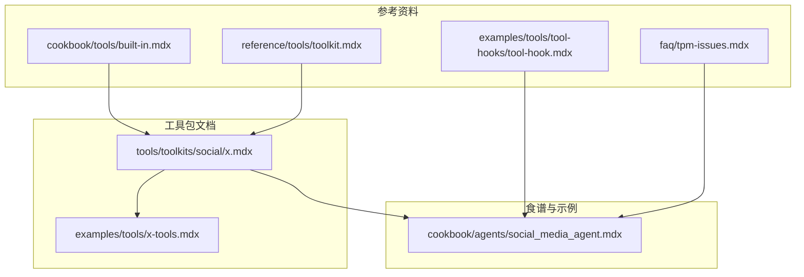
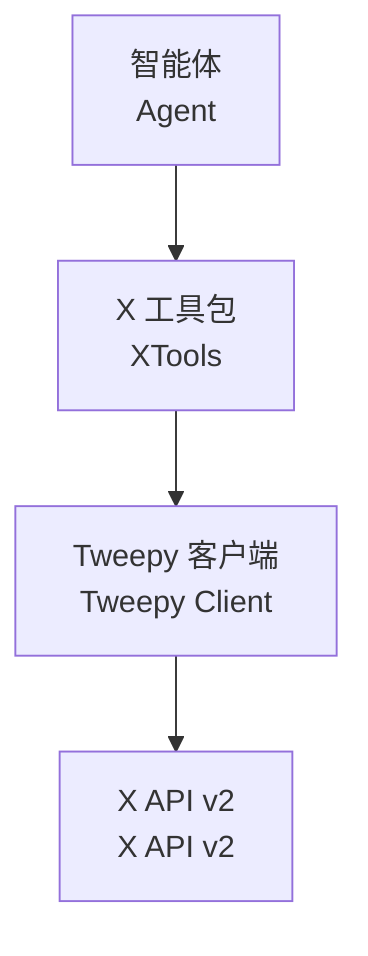
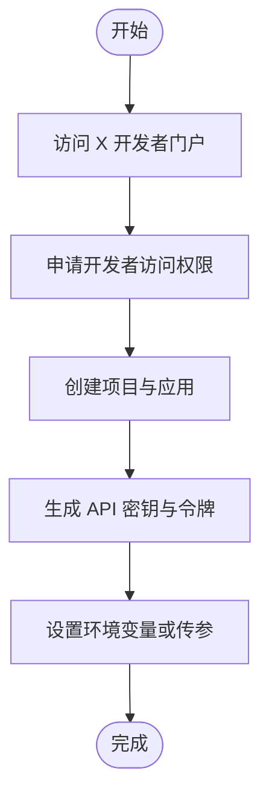
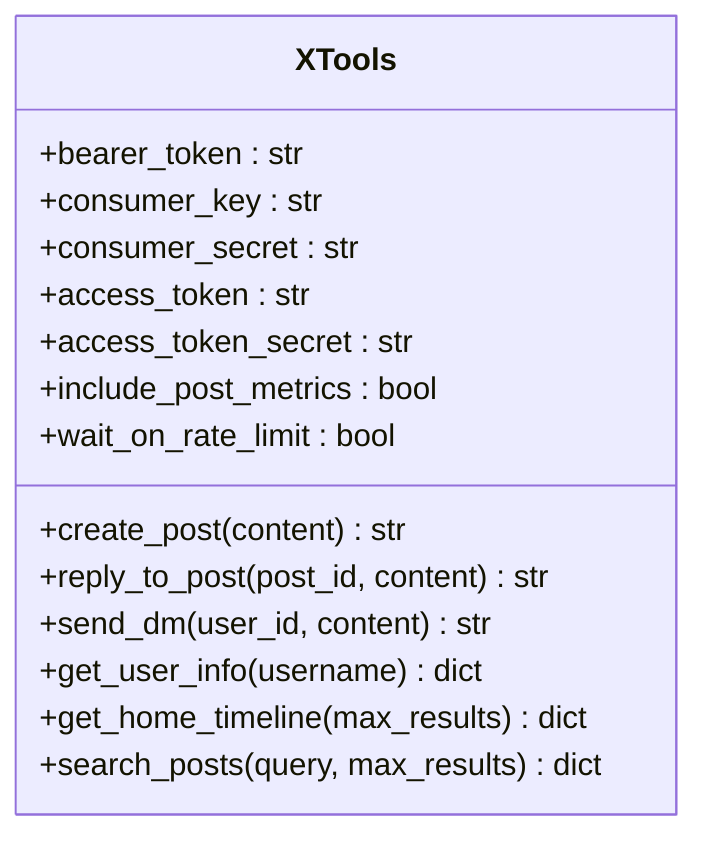
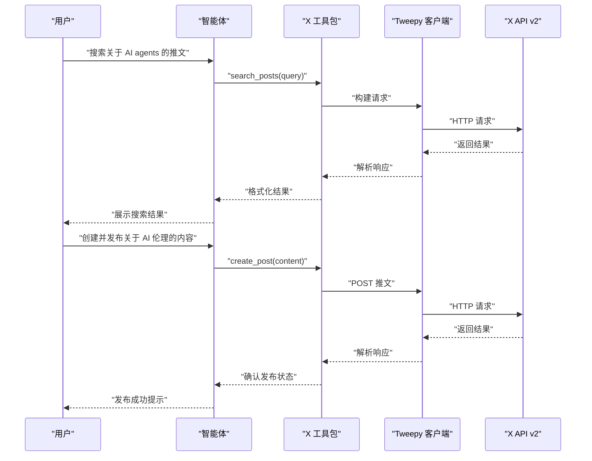
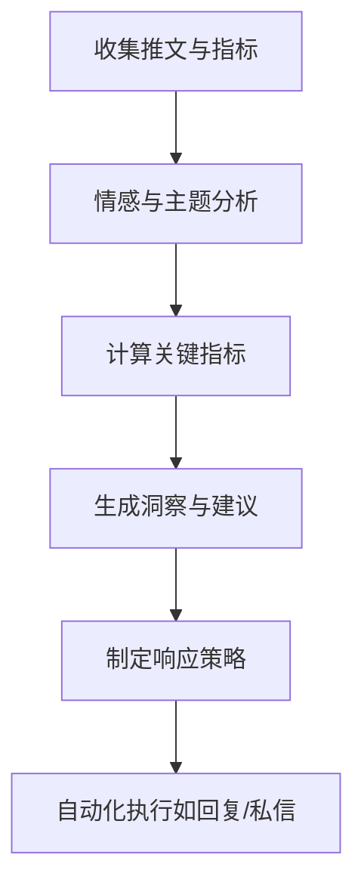
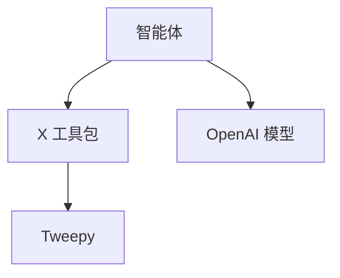
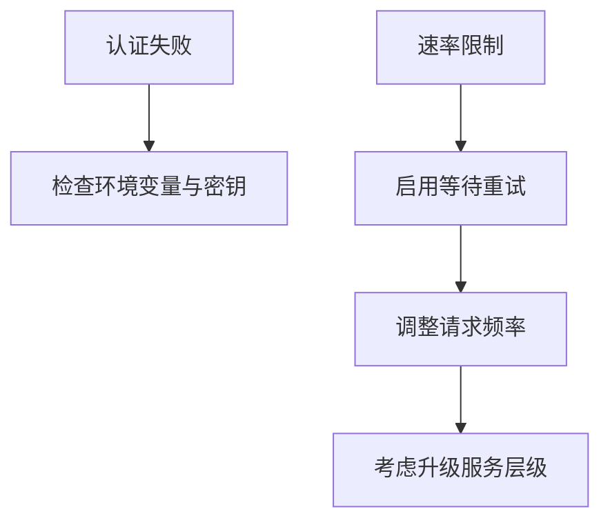

# X (Twitter) 工具包

<cite>
**本文档引用的文件**
- [x.mdx](file://tools/toolkits/social/x.mdx)
- [x-tools.mdx](file://examples/tools/x-tools.mdx)
- [social_media_agent.mdx](file://cookbook/agents/social_media_agent.mdx)
- [built-in.mdx](file://cookbook/tools/built-in.mdx)
- [toolkit.mdx](file://reference/tools/toolkit.mdx)
- [tool-hooks.mdx](file://examples/tools/tool-hooks/tool-hook.mdx)
- [tpm-issues.mdx](file://faq/tpm-issues.mdx)
</cite>

## 目录
1. [简介](#简介)
2. [项目结构](#项目结构)
3. [核心组件](#核心组件)
4. [架构概览](#架构概览)
5. [详细组件分析](#详细组件分析)
6. [依赖关系分析](#依赖关系分析)
7. [性能考虑](#性能考虑)
8. [故障排除指南](#故障排除指南)
9. [结论](#结论)
10. [附录](#附录)

## 简介
本文件为 Agno 框架中 X (Twitter) 工具包的完整技术文档。该工具包通过 Tweepy 库与 X API v2 进行交互，为智能体提供发布推文、搜索内容、用户信息查询、私信发送以及时间线获取等能力。文档涵盖从开发者账户注册到 API 密钥配置、应用权限设置的完整流程；详细说明工具包的功能特性、参数配置、使用方法与最佳实践；并结合社交媒体管理与品牌监控的实际场景，给出内容发布、舆情分析与用户互动等典型用例。

## 项目结构
X 工具包在文档仓库中的组织方式如下：
- 工具包文档：位于工具箱文档目录，提供安装、配置与使用说明
- 示例与用法：位于示例与食谱目录，展示具体调用与工作流
- 参考资料：位于参考与 FAQ 目录，提供参数定义与问题排查

**图表来源**
- [x.mdx:1-125](file://tools/toolkits/social/x.mdx#L1-L125)
- [x-tools.mdx:1-110](file://examples/tools/x-tools.mdx#L1-L110)
- [social_media_agent.mdx:1-144](file://cookbook/agents/social_media_agent.mdx#L1-L144)
- [built-in.mdx:118-118](file://cookbook/tools/built-in.mdx#L118-L118)
- [toolkit.mdx:1-86](file://reference/tools/toolkit.mdx#L1-L86)
- [tool-hooks.mdx:75-75](file://examples/tools/tool-hooks/tool-hook.mdx#L75-L75)
- [tpm-issues.mdx:1-28](file://faq/tpm-issues.mdx#L1-L28)

**章节来源**
- [x.mdx:1-125](file://tools/toolkits/social/x.mdx#L1-L125)
- [x-tools.mdx:1-110](file://examples/tools/x-tools.mdx#L1-L110)
- [social_media_agent.mdx:1-144](file://cookbook/agents/social_media_agent.mdx#L1-L144)

## 核心组件
X 工具包的核心由以下部分组成：
- 工具包文档：描述安装、开发者账户注册、密钥生成与环境变量配置
- 工具函数：提供创建推文、回复、发送私信、获取用户信息、获取时间线、搜索推文等能力
- 参数与配置：支持 bearer_token、consumer_key、consumer_secret、access_token、access_token_secret、include_post_metrics、wait_on_rate_limit 等参数
- 集成示例：展示如何在智能体中使用 X 工具包进行社交媒体分析与内容管理

**章节来源**
- [x.mdx:7-108](file://tools/toolkits/social/x.mdx#L7-L108)
- [x-tools.mdx:6-40](file://examples/tools/x-tools.mdx#L6-L40)
- [social_media_agent.mdx:18-27](file://cookbook/agents/social_media_agent.mdx#L18-L27)

## 架构概览
X 工具包在 Agno 智能体中的运行架构如下：

**图表来源**
- [x.mdx:5-15](file://tools/toolkits/social/x.mdx#L5-L15)
- [social_media_agent.mdx:16-27](file://cookbook/agents/social_media_agent.mdx#L16-L27)

该架构体现了智能体通过 X 工具包调用 Tweepy 客户端，最终访问 X API v2 的清晰层次关系。

## 详细组件分析

### 开发者账户与密钥配置
- 注册 X 开发者账户并创建项目与应用
- 在应用的“Keys and tokens”页面生成 API Key、API Secret、Bearer Token、Access Token 与 Access Token Secret
- 将密钥以环境变量形式导出，或作为构造函数参数传入

**图表来源**
- [x.mdx:19-39](file://tools/toolkits/social/x.mdx#L19-L39)
- [x-tools.mdx:12-39](file://examples/tools/x-tools.mdx#L12-L39)

**章节来源**
- [x.mdx:19-39](file://tools/toolkits/social/x.mdx#L19-L39)
- [x-tools.mdx:12-39](file://examples/tools/x-tools.mdx#L12-L39)

### 工具包参数与功能
- 支持的关键参数：bearer_token、consumer_key、consumer_secret、access_token、access_token_secret、include_post_metrics、wait_on_rate_limit
- 提供的核心功能：create_post、reply_to_post、send_dm、get_user_info、get_home_timeline、search_posts

**图表来源**
- [x.mdx:99-118](file://tools/toolkits/social/x.mdx#L99-L118)

**章节来源**
- [x.mdx:99-118](file://tools/toolkits/social/x.mdx#L99-L118)

### 使用示例与工作流
- 基础示例：初始化 XTools，创建智能体并执行搜索、发布、时间线获取、回复、用户信息查询与私信发送等操作
- 高级示例：社交媒体分析代理，结合 LLM 对推文进行情感分析与指标提取，并输出可执行的洞察报告

**图表来源**
- [x.mdx:43-89](file://tools/toolkits/social/x.mdx#L43-L89)
- [social_media_agent.mdx:104-106](file://cookbook/agents/social_media_agent.mdx#L104-L106)

**章节来源**
- [x.mdx:43-89](file://tools/toolkits/social/x.mdx#L43-L89)
- [social_media_agent.mdx:104-106](file://cookbook/agents/social_media_agent.mdx#L104-L106)

### 社交媒体管理与品牌监控场景
- 内容发布：根据指令生成并发布符合品牌规范的内容，严格遵循使用政策与速率限制
- 舆情分析：通过搜索与时间线获取原始数据，结合情感分析与指标权重，输出品牌健康评分与策略建议
- 用户互动：自动回复、私信沟通与用户画像分析，提升社区参与度与客户体验

**图表来源**
- [social_media_agent.mdx:28-99](file://cookbook/agents/social_media_agent.mdx#L28-L99)

**章节来源**
- [social_media_agent.mdx:18-102](file://cookbook/agents/social_media_agent.mdx#L18-L102)

## 依赖关系分析
X 工具包的依赖关系主要体现在以下方面：
- 外部库依赖：Tweepy 用于与 X API v2 通信
- 模型与 LLM：在高级分析场景中，结合 OpenAI 等模型进行文本理解与分析
- 工具选择：通过 include_tools/exclude_tools 控制智能体可用工具集

**图表来源**
- [x.mdx:12-15](file://tools/toolkits/social/x.mdx#L12-L15)
- [social_media_agent.mdx:16-22](file://cookbook/agents/social_media_agent.mdx#L16-L22)
- [built-in.mdx:118-118](file://cookbook/tools/built-in.mdx#L118-L118)

**章节来源**
- [x.mdx:12-15](file://tools/toolkits/social/x.mdx#L12-L15)
- [social_media_agent.mdx:16-22](file://cookbook/agents/social_media_agent.mdx#L16-L22)
- [built-in.mdx:118-118](file://cookbook/tools/built-in.mdx#L118-L118)

## 性能考虑
- 速率限制与重试：通过 wait_on_rate_limit 参数启用自动重试，避免因临时限流导致任务失败
- 指标获取：include_post_metrics 可增加结果丰富度，但会带来额外请求与处理开销
- 扩展性：在高并发场景下，建议合理规划请求间隔或采用 X API Premium 层级以获得更高配额

**章节来源**
- [x.mdx:107-107](file://tools/toolkits/social/x.mdx#L107-L107)
- [social_media_agent.mdx:23-26](file://cookbook/agents/social_media_agent.mdx#L23-L26)

## 故障排除指南
- 认证失败：检查环境变量是否正确设置，确保所有必需密钥均有效
- 速率限制：启用 wait_on_rate_limit 并适当降低请求频率；对于高吞吐场景，考虑升级至更高层级的服务
- 令牌与权限：确认应用权限范围满足所需功能（如读写、私信等），并在开发者门户中正确配置

**图表来源**
- [x.mdx:32-39](file://tools/toolkits/social/x.mdx#L32-L39)
- [social_media_agent.mdx:182-192](file://cookbook/agents/social_media_agent.mdx#L182-L192)

**章节来源**
- [x.mdx:32-39](file://tools/toolkits/social/x.mdx#L32-L39)
- [social_media_agent.mdx:182-192](file://cookbook/agents/social_media_agent.mdx#L182-L192)

## 结论
X (Twitter) 工具包为 Agno 智能体提供了与 X API v2 无缝集成的能力，覆盖内容发布、搜索、用户管理与趋势监控等核心场景。通过规范的开发者账户注册与密钥配置、合理的参数设置与速率控制，以及结合 LLM 的高级分析能力，可以高效地构建社交媒体管理与品牌监控解决方案。建议在生产环境中优先启用重试机制、合理规划请求频率，并持续关注平台政策与配额变化。

## 附录
- 参考实现：工具包源码位于 agno 项目的 tools.x 模块
- 工具选择：通过 include_tools 或 exclude_tools 精准控制智能体可用工具集

**章节来源**
- [x.mdx:124-125](file://tools/toolkits/social/x.mdx#L124-L125)
- [toolkit.mdx:1-86](file://reference/tools/toolkit.mdx#L1-L86)