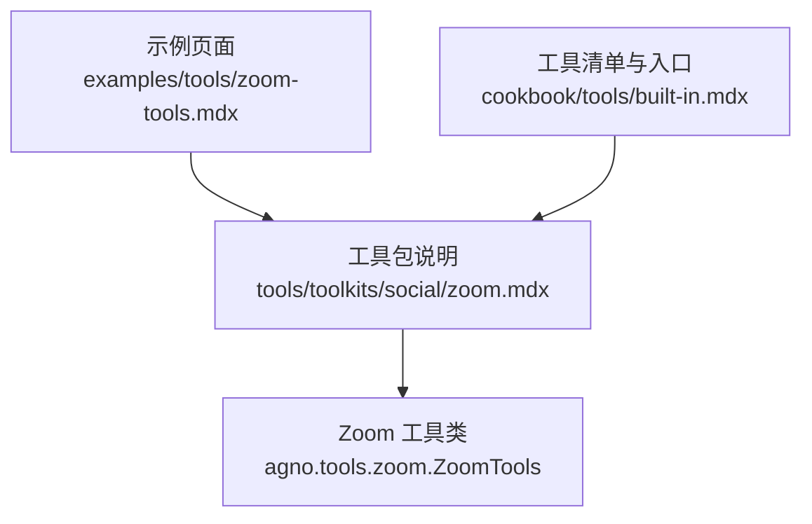
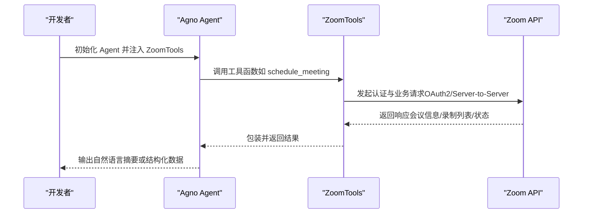
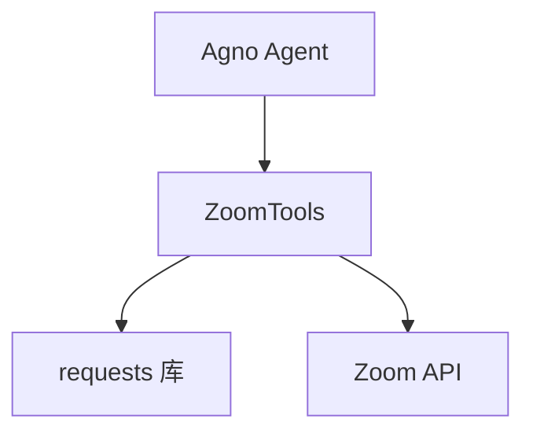

# Zoom 工具包

<cite>
**本文引用的文件**
- [examples/tools/zoom-tools.mdx](file://examples/tools/zoom-tools.mdx)
- [tools/toolkits/social/zoom.mdx](file://tools/toolkits/social/zoom.mdx)
- [cookbook/tools/built-in.mdx](file://cookbook/tools/built-in.mdx)
</cite>

## 目录
1. [简介](#简介)
2. [项目结构](#项目结构)
3. [核心组件](#核心组件)
4. [架构总览](#架构总览)
5. [详细组件分析](#详细组件分析)
6. [依赖关系分析](#依赖关系分析)
7. [性能考量](#性能考量)
8. [故障排查指南](#故障排查指南)
9. [结论](#结论)
10. [附录](#附录)

## 简介
本技术文档面向在 Agno 中集成 Zoom 工具包的开发者与产品团队，系统化说明如何通过 Zoom API 实现会议创建、录制管理、网络研讨会与用户管理等能力，并覆盖 OAuth2 认证、JWT 应用配置、API 权限设置、速率限制、安全与合规建议以及典型应用场景（如自动会议安排、参会者管理、会议记录等）。文档基于仓库中现有的 Zoom 工具包示例与工具包说明进行整理与扩展，帮助读者快速完成从环境准备到生产落地的全链路实践。

## 项目结构
Zoom 工具包在仓库中的相关文档与示例主要分布在以下位置：
- 示例页面：examples/tools/zoom-tools.mdx
- 工具包说明：tools/toolkits/social/zoom.mdx
- 工具清单与入口：cookbook/tools/built-in.mdx

下图展示 Zoom 工具包在文档体系中的位置与关联：

图表来源
- [examples/tools/zoom-tools.mdx:1-128](file://examples/tools/zoom-tools.mdx#L1-L128)
- [tools/toolkits/social/zoom.mdx:1-95](file://tools/toolkits/social/zoom.mdx#L1-L95)
- [cookbook/tools/built-in.mdx:140-160](file://cookbook/tools/built-in.mdx#L140-L160)

章节来源
- [examples/tools/zoom-tools.mdx:1-128](file://examples/tools/zoom-tools.mdx#L1-L128)
- [tools/toolkits/social/zoom.mdx:1-95](file://tools/toolkits/social/zoom.mdx#L1-L95)
- [cookbook/tools/built-in.mdx:140-160](file://cookbook/tools/built-in.mdx#L140-L160)

## 核心组件
- Zoom 工具类：agno.tools.zoom.ZoomTools
  - 支持的工具函数（以示例与说明为准）：
    - schedule_meeting：创建会议
    - get_upcoming_meetings：查询即将开始的会议
    - list_meetings：按类型列出会议
    - get_meeting_recordings：获取会议录制
    - delete_meeting：删除会议
    - get_meeting：获取会议详情
  - 关键参数（来自工具包说明）：
    - account_id：账户 ID（可从环境变量 ZOOM_ACCOUNT_ID 获取）
    - client_id：客户端 ID（可从环境变量 ZOOM_CLIENT_ID 获取）
    - client_secret：客户端密钥（可从环境变量 ZOOM_CLIENT_SECRET 获取）

章节来源
- [tools/toolkits/social/zoom.mdx:61-80](file://tools/toolkits/social/zoom.mdx#L61-L80)
- [examples/tools/zoom-tools.mdx:66-90](file://examples/tools/zoom-tools.mdx#L66-L90)

## 架构总览
下图展示了 Zoom 工具包在 Agno 中的调用路径与关键交互点（示例页面与工具包说明中体现的能力与流程）：

图表来源
- [examples/tools/zoom-tools.mdx:36-109](file://examples/tools/zoom-tools.mdx#L36-L109)
- [tools/toolkits/social/zoom.mdx:36-59](file://tools/toolkits/social/zoom.mdx#L36-L59)

## 详细组件分析

### 组件一：OAuth2 与 JWT 应用配置
- 认证方式
  - 使用 Zoom Marketplace 的 Server-to-Server OAuth 应用进行认证。
  - 该模式适合服务端到服务端调用，避免用户交互式授权。
- 应用创建与权限
  - 在 Zoom Marketplace 创建应用，选择 Server-to-Server OAuth 类型。
  - 配置所需作用域（示例中包含会议读写与录制读取）。
- 凭据管理
  - 通过环境变量传递 Account ID、Client ID、Client Secret。
  - 工具类支持直接传参或从环境变量读取。

章节来源
- [examples/tools/zoom-tools.mdx:15-34](file://examples/tools/zoom-tools.mdx#L15-L34)
- [tools/toolkits/social/zoom.mdx:17-34](file://tools/toolkits/social/zoom.mdx#L17-L34)

### 组件二：会议生命周期管理
- 会议创建
  - 使用 schedule_meeting 完成会议创建，支持指定主题、时间、时区与时长。
- 会议查询
  - get_upcoming_meetings：获取即将开始的会议列表。
  - list_meetings：按类型列出会议。
  - get_meeting：获取单个会议的详细信息。
- 会议删除
  - delete_meeting：删除已创建的会议。

章节来源
- [examples/tools/zoom-tools.mdx:66-90](file://examples/tools/zoom-tools.mdx#L66-L90)
- [tools/toolkits/social/zoom.mdx:69-78](file://tools/toolkits/social/zoom.mdx#L69-L78)

### 组件三：录制管理
- 录制获取
  - get_meeting_recordings：根据会议 ID 获取录制资源，支持下载链接、文件类型、时长与大小等信息。
- 下载令牌
  - 文档提示可按需包含下载令牌以控制访问。

章节来源
- [examples/tools/zoom-tools.mdx:76-80](file://examples/tools/zoom-tools.mdx#L76-L80)
- [tools/toolkits/social/zoom.mdx:76-76](file://tools/toolkits/social/zoom.mdx#L76-L76)

### 组件四：速率限制与稳定性
- 速率限制
  - Server-to-Server OAuth 应用默认较高并发；不同端点与账户类型存在差异。
  - 录制相关端点速率较低，需结合官方文档评估。
- 建议
  - 在批量操作时增加重试与退避策略。
  - 对高频接口进行本地缓存与去抖处理。

章节来源
- [tools/toolkits/social/zoom.mdx:82-90](file://tools/toolkits/social/zoom.mdx#L82-L90)

### 组件五：安全与合规
- 凭据保护
  - 严格使用环境变量存储敏感信息，避免硬编码。
- 最小权限原则
  - 仅授予必要的作用域（会议读写、录制读取），降低风险面。
- 数据最小化
  - 仅收集与处理完成任务所必需的数据，遵循隐私与数据保护法规。
- 合规审计
  - 建立访问日志与变更审计，确保满足企业内控与合规要求。

章节来源
- [examples/tools/zoom-tools.mdx:27-34](file://examples/tools/zoom-tools.mdx#L27-L34)
- [tools/toolkits/social/zoom.mdx:22-26](file://tools/toolkits/social/zoom.mdx#L22-L26)

### 组件六：典型应用场景
- 自动会议安排
  - 基于自然语言指令自动创建会议，返回会议 ID、加入链接与时间。
- 参会者管理
  - 结合会议查询与录制获取，实现对历史会议的回看与复盘。
- 会议记录与归档
  - 通过录制获取能力，统一拉取与归档会议内容，便于后续检索与分析。
- 网络研讨会与培训管理
  - 利用批量创建与查询能力，支撑大规模培训或活动的自动化编排。

章节来源
- [examples/tools/zoom-tools.mdx:5-13](file://examples/tools/zoom-tools.mdx#L5-L13)
- [examples/tools/zoom-tools.mdx:92-109](file://examples/tools/zoom-tools.mdx#L92-L109)

## 依赖关系分析
- 外部依赖
  - requests：用于 HTTP 请求（来自工具包说明）。
- 内部依赖
  - Agno Agent：作为工具的宿主，负责调度与执行。
  - ZoomTools：封装 Zoom API 的认证与业务调用。

图表来源
- [tools/toolkits/social/zoom.mdx:11-15](file://tools/toolkits/social/zoom.mdx#L11-L15)
- [tools/toolkits/social/zoom.mdx:36-59](file://tools/toolkits/social/zoom.mdx#L36-L59)

章节来源
- [tools/toolkits/social/zoom.mdx:11-15](file://tools/toolkits/social/zoom.mdx#L11-L15)
- [tools/toolkits/social/zoom.mdx:36-59](file://tools/toolkits/social/zoom.mdx#L36-L59)

## 性能考量
- 并发与速率
  - Server-to-Server OAuth 默认高并发，但需关注端点差异与账户类型限制。
- 批量操作
  - 对 list/get 类接口进行分页与批量处理，减少往返次数。
- 缓存与去抖
  - 对查询类接口（如 upcoming/list）进行短期缓存，避免重复请求。
- 错误重试
  - 对临时性错误（如网络抖动、限流）实施指数退避与最大重试次数控制。

章节来源
- [tools/toolkits/social/zoom.mdx:82-90](file://tools/toolkits/social/zoom.mdx#L82-L90)

## 故障排查指南
- 环境变量未设置
  - 症状：初始化失败或认证错误。
  - 排查：确认 ZOOM_ACCOUNT_ID、ZOOM_CLIENT_ID、ZOOM_CLIENT_SECRET 是否正确导出。
- 作用域不足
  - 症状：调用某些接口返回权限不足。
  - 排查：回到 Zoom Marketplace 检查应用的作用域是否包含会议与录制所需的权限。
- 时间与时区格式
  - 症状：会议时间不生效或时区异常。
  - 排查：确保使用 ISO 8601 格式与有效时区标识符。
- 速率限制触发
  - 症状：请求被拒绝或返回限流错误。
  - 排查：降低并发、增加退避与重试逻辑，并参考官方速率限制文档。

章节来源
- [examples/tools/zoom-tools.mdx:27-34](file://examples/tools/zoom-tools.mdx#L27-L34)
- [examples/tools/zoom-tools.mdx:81-88](file://examples/tools/zoom-tools.mdx#L81-L88)
- [tools/toolkits/social/zoom.mdx:82-90](file://tools/toolkits/social/zoom.mdx#L82-L90)

## 结论
通过在 Agno 中集成 Zoom 工具包，可以高效地实现会议生命周期管理、录制获取与归档、以及面向大规模培训与网络研讨会的自动化编排。配合严格的 OAuth2/Server-to-Server 配置、最小权限原则与速率限制策略，可在保证安全与合规的前提下，构建稳定可靠的在线会议与培训管理系统。

## 附录
- 快速开始
  - 在 Zoom Marketplace 创建 Server-to-Server OAuth 应用并配置所需作用域。
  - 设置环境变量并初始化 ZoomTools。
  - 将工具注入 Agent，即可通过自然语言指令完成会议创建、查询与录制获取等操作。
- 参考入口
  - 工具类与示例入口：cookbook/tools/built-in.mdx 中的 Zoom 条目。

章节来源
- [cookbook/tools/built-in.mdx:140-160](file://cookbook/tools/built-in.mdx#L140-L160)