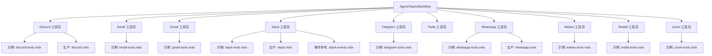
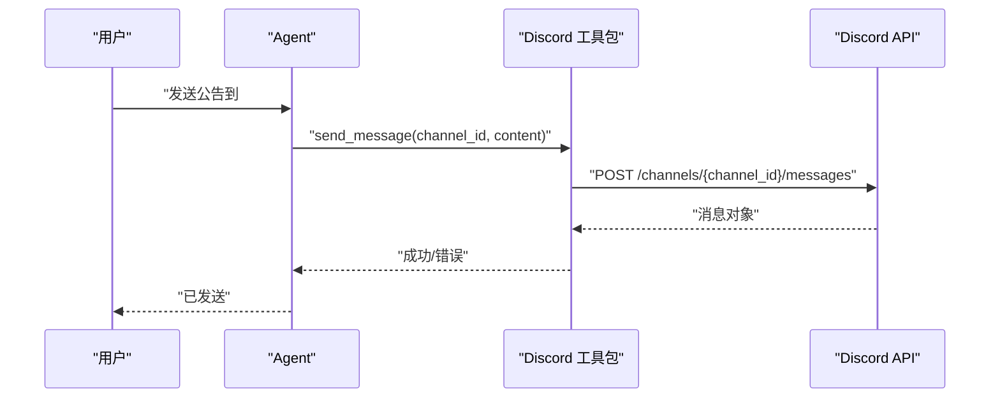
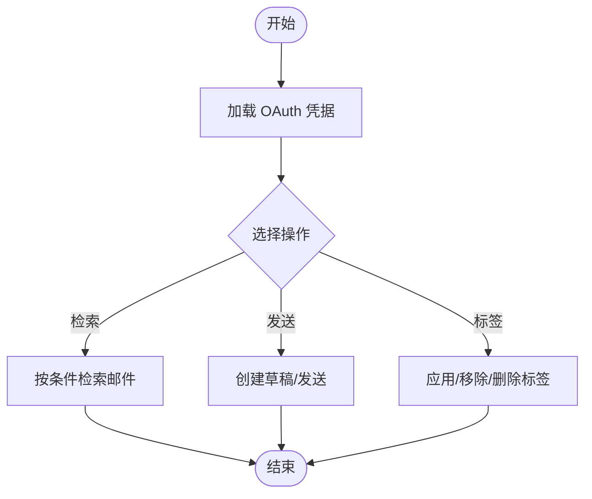
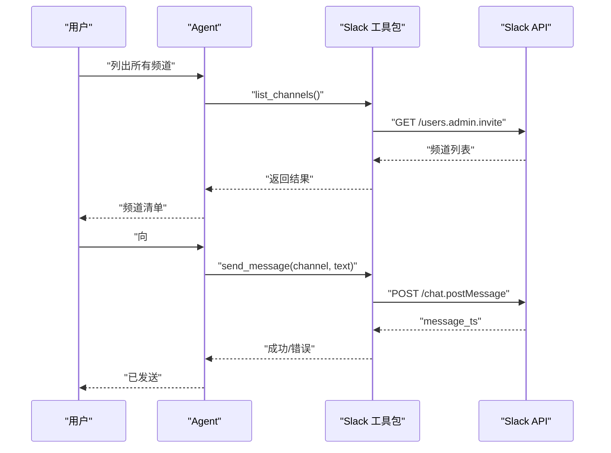
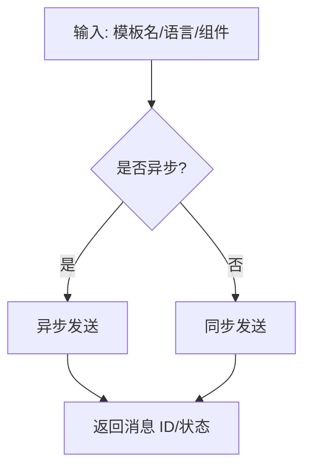
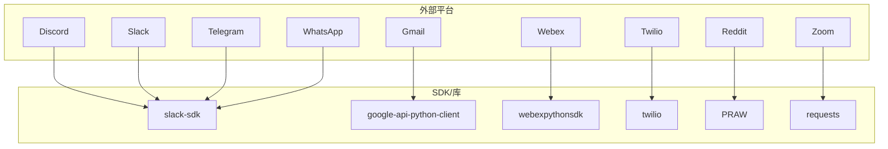

# 社交工具包

<cite>
**本文引用的文件**
- [tools/toolkits/social/discord.mdx](file://tools/toolkits/social/discord.mdx)
- [tools/toolkits/social/email.mdx](file://tools/toolkits/social/email.mdx)
- [tools/toolkits/social/gmail.mdx](file://tools/toolkits/social/gmail.mdx)
- [tools/toolkits/social/slack.mdx](file://tools/toolkits/social/slack.mdx)
- [tools/toolkits/social/telegram.mdx](file://tools/toolkits/social/telegram.mdx)
- [tools/toolkits/social/twilio.mdx](file://tools/toolkits/social/twilio.mdx)
- [tools/toolkits/social/whatsapp.mdx](file://tools/toolkits/social/whatsapp.mdx)
- [tools/toolkits/social/webex.mdx](file://tools/toolkits/social/webex.mdx)
- [tools/toolkits/social/reddit.mdx](file://tools/toolkits/social/reddit.mdx)
- [tools/toolkits/social/zoom.mdx](file://tools/toolkits/social/zoom.mdx)
- [TBD/snippets/setup-discord-app.mdx](file://TBD/snippets/setup-discord-app.mdx)
- [TBD/snippets/setup-whatsapp-app.mdx](file://TBD/snippets/setup-whatsapp-app.mdx)
- [TBD/snippets/setup-slack-app.mdx](file://TBD/snippets/setup-slack-app.mdx)
- [examples/tools/discord-tools.mdx](file://examples/tools/discord-tools.mdx)
- [examples/tools/email-tools.mdx](file://examples/tools/email-tools.mdx)
- [examples/tools/gmail-tools.mdx](file://examples/tools/gmail-tools.mdx)
- [examples/tools/slack-tools.mdx](file://examples/tools/slack-tools.mdx)
- [examples/tools/telegram-tools.mdx](file://examples/tools/telegram-tools.mdx)
- [examples/tools/twilio-tools.mdx](file://examples/tools/twilio-tools.mdx)
- [examples/tools/whatsapp-tools.mdx](file://examples/tools/whatsapp-tools.mdx)
- [examples/tools/webex-tools.mdx](file://examples/tools/webex-tools.mdx)
- [examples/tools/reddit-tools.mdx](file://examples/tools/reddit-tools.mdx)
- [examples/tools/zoom-tools.mdx](file://examples/tools/zoom-tools.mdx)
- [production/interfaces/discord.mdx](file://production/interfaces/discord.mdx)
- [production/interfaces/whatsapp.mdx](file://production/interfaces/whatsapp.mdx)
- [production/interfaces/slack.mdx](file://production/interfaces/slack.mdx)
- [reference-api/schema/slack/slack-events.mdx](file://reference-api/schema/slack/slack-events.mdx)
</cite>

## 目录
1. [简介](#简介)
2. [项目结构](#项目结构)
3. [核心组件](#核心组件)
4. [架构总览](#架构总览)
5. [详细组件分析](#详细组件分析)
6. [依赖关系分析](#依赖关系分析)
7. [性能考量](#性能考量)
8. [故障排查指南](#故障排查指南)
9. [结论](#结论)
10. [附录](#附录)

## 简介
本文件系统性梳理 Agno 提供的 12 个社交平台工具包：Discord、Email、Gmail、Slack、Telegram、Twilio、WhatsApp、Webex、X (Twitter)、Reddit、Zoom，以及一个未在当前仓库中出现的“X (Twitter)”工具包。内容覆盖各平台的 API 集成方式、认证配置、消息发送与接收机制、平台特定的消息格式与媒体上传、频道/房间管理、用户权限控制，并结合代理、团队与工作流的实际场景（自动化通知、客户服务、社区管理、会议组织）给出应用建议与最佳实践。

## 项目结构
社交工具包主要分布在以下位置：
- 工具包概览与参数说明：tools/toolkits/social/*.mdx
- 平台示例与使用：examples/tools/*-tools.mdx
- 平台部署与接口：production/interfaces/*.mdx
- 平台事件参考：reference-api/schema/*/slack-events.mdx
- 平台初始化与配置提示：TBD/snippets/*setup*.mdx

```mermaid
graph TB
subgraph "社交工具包"
D["Discord<br/>tools/toolkits/social/discord.mdx"]
E["Email<br/>tools/toolkits/social/email.mdx"]
G["Gmail<br/>tools/toolkits/social/gmail.mdx"]
S["Slack<br/>tools/toolkits/social/slack.mdx"]
T["Telegram<br/>tools/toolkits/social/telegram.mdx"]
W["Twilio<br/>tools/toolkits/social/twilio.mdx"]
WA["WhatsApp<br/>tools/toolkits/social/whatsapp.mdx"]
WX["Webex<br/>tools/toolkits/social/webex.mdx"]
R["Reddit<br/>tools/toolkits/social/reddit.mdx"]
Z["Zoom<br/>tools/toolkits/social/zoom.mdx"]
end
subgraph "示例与集成"
ED["examples/tools/discord-tools.mdx"]
ES["examples/tools/slack-tools.mdx"]
ET["examples/tools/telegram-tools.mdx"]
EW["examples/tools/whatsapp-tools.mdx"]
EG["examples/tools/gmail-tools.mdx"]
EE["examples/tools/email-tools.mdx"]
EWx["examples/tools/webex-tools.mdx"]
ER["examples/tools/reddit-tools.mdx"]
EZ["examples/tools/zoom-tools.mdx"]
Etw["examples/tools/twilio-tools.mdx"]
end
subgraph "生产与接口"
PD["production/interfaces/discord.mdx"]
PW["production/interfaces/whatsapp.mdx"]
PS["production/interfaces/slack.mdx"]
end
D --> ED
S --> ES
T --> ET
WA --> EW
G --> EG
E --> EE
WX --> EWx
R --> ER
Z --> EZ
W --> Etw
D --> PD
WA --> PW
S --> PS
```

图表来源
- [tools/toolkits/social/discord.mdx:1-51](file://tools/toolkits/social/discord.mdx#L1-L51)
- [tools/toolkits/social/slack.mdx:1-66](file://tools/toolkits/social/slack.mdx#L1-L66)
- [tools/toolkits/social/telegram.mdx:1-61](file://tools/toolkits/social/telegram.mdx#L1-L61)
- [tools/toolkits/social/whatsapp.mdx:1-83](file://tools/toolkits/social/whatsapp.mdx#L1-L83)
- [tools/toolkits/social/gmail.mdx:1-77](file://tools/toolkits/social/gmail.mdx#L1-L77)
- [tools/toolkits/social/email.mdx:1-52](file://tools/toolkits/social/email.mdx#L1-L52)
- [tools/toolkits/social/webex.mdx:1-72](file://tools/toolkits/social/webex.mdx#L1-L72)
- [tools/toolkits/social/reddit.mdx:1-63](file://tools/toolkits/social/reddit.mdx#L1-L63)
- [tools/toolkits/social/zoom.mdx:1-95](file://tools/toolkits/social/zoom.mdx#L1-L95)
- [tools/toolkits/social/twilio.mdx:1-67](file://tools/toolkits/social/twilio.mdx#L1-L67)

章节来源
- [tools/toolkits/social/discord.mdx:1-51](file://tools/toolkits/social/discord.mdx#L1-L51)
- [tools/toolkits/social/slack.mdx:1-66](file://tools/toolkits/social/slack.mdx#L1-L66)
- [tools/toolkits/social/telegram.mdx:1-61](file://tools/toolkits/social/telegram.mdx#L1-L61)
- [tools/toolkits/social/whatsapp.mdx:1-83](file://tools/toolkits/social/whatsapp.mdx#L1-L83)
- [tools/toolkits/social/gmail.mdx:1-77](file://tools/toolkits/social/gmail.mdx#L1-L77)
- [tools/toolkits/social/email.mdx:1-52](file://tools/toolkits/social/email.mdx#L1-L52)
- [tools/toolkits/social/webex.mdx:1-72](file://tools/toolkits/social/webex.mdx#L1-L72)
- [tools/toolkits/social/reddit.mdx:1-63](file://tools/toolkits/social/reddit.mdx#L1-L63)
- [tools/toolkits/social/zoom.mdx:1-95](file://tools/toolkits/social/zoom.mdx#L1-L95)
- [tools/toolkits/social/twilio.mdx:1-67](file://tools/toolkits/social/twilio.mdx#L1-L67)

## 核心组件
- Discord 工具包：支持发送消息、读取历史、频道管理、消息删除；通过机器人令牌认证。
- Email 工具包：面向通用 SMTP 的邮件发送封装，适用于 Gmail 等服务。
- Gmail 工具包：基于 Google API 客户端库与 OAuth 2.0，支持收件箱检索、搜索、草稿、标签管理、回复等。
- Slack 工具包：基于 Slack SDK，支持发送消息、列出频道、获取频道历史。
- Telegram 工具包：基于 Telegram Bot API，支持向指定聊天发送消息。
- Twilio 工具包：支持发送短信、查询通话详情、列出短信；支持多种认证方式与调试模式。
- WhatsApp 工具包：基于 Meta WhatsApp Cloud API，支持文本与模板消息的同步/异步发送。
- Webex 工具包：基于 webexpythonsdk，支持发送消息与列出房间。
- Reddit 工具包：基于 PRAW，支持子版块信息、帖子、评论、用户信息、投票、发帖/回帖等。
- Zoom 工具包：基于 Zoom Server-to-Server OAuth，支持预约会议、查询、删除、录制管理等。

章节来源
- [tools/toolkits/social/discord.mdx:5-51](file://tools/toolkits/social/discord.mdx#L5-L51)
- [tools/toolkits/social/email.mdx:5-52](file://tools/toolkits/social/email.mdx#L5-L52)
- [tools/toolkits/social/gmail.mdx:5-77](file://tools/toolkits/social/gmail.mdx#L5-L77)
- [tools/toolkits/social/slack.mdx:5-66](file://tools/toolkits/social/slack.mdx#L5-L66)
- [tools/toolkits/social/telegram.mdx:5-61](file://tools/toolkits/social/telegram.mdx#L5-L61)
- [tools/toolkits/social/twilio.mdx:5-67](file://tools/toolkits/social/twilio.mdx#L5-L67)
- [tools/toolkits/social/whatsapp.mdx:5-83](file://tools/toolkits/social/whatsapp.mdx#L5-L83)
- [tools/toolkits/social/webex.mdx:5-72](file://tools/toolkits/social/webex.mdx#L5-L72)
- [tools/toolkits/social/reddit.mdx:3-63](file://tools/toolkits/social/reddit.mdx#L3-L63)
- [tools/toolkits/social/zoom.mdx:5-95](file://tools/toolkits/social/zoom.mdx#L5-L95)

## 架构总览
下图展示各社交工具包与示例、生产接口及事件参考的关系：

图表来源
- [examples/tools/discord-tools.mdx](file://examples/tools/discord-tools.mdx)
- [examples/tools/slack-tools.mdx](file://examples/tools/slack-tools.mdx)
- [examples/tools/telegram-tools.mdx](file://examples/tools/telegram-tools.mdx)
- [examples/tools/whatsapp-tools.mdx](file://examples/tools/whatsapp-tools.mdx)
- [examples/tools/gmail-tools.mdx](file://examples/tools/gmail-tools.mdx)
- [examples/tools/email-tools.mdx](file://examples/tools/email-tools.mdx)
- [examples/tools/webex-tools.mdx](file://examples/tools/webex-tools.mdx)
- [examples/tools/reddit-tools.mdx](file://examples/tools/reddit-tools.mdx)
- [examples/tools/zoom-tools.mdx](file://examples/tools/zoom-tools.mdx)
- [production/interfaces/discord.mdx](file://production/interfaces/discord.mdx)
- [production/interfaces/whatsapp.mdx](file://production/interfaces/whatsapp.mdx)
- [production/interfaces/slack.mdx](file://production/interfaces/slack.mdx)
- [reference-api/schema/slack/slack-events.mdx](file://reference-api/schema/slack/slack-events.mdx)

## 详细组件分析

### Discord 工具包
- 认证与配置
  - 使用机器人令牌进行认证，需在开发者门户创建应用并生成令牌。
  - 示例与环境变量设置参见平台示例与配置片段。
- 能力范围
  - 发送消息、读取消息历史、频道信息与列表、删除消息。
- 参数与函数
  - 关键参数：机器人令牌、功能开关（消息、历史、频道、消息管理）。
  - 主要函数：发送消息、获取频道信息、列出频道、获取消息历史、删除消息。
- 应用场景
  - 自动化通知、社区公告、日志告警、FAQ 回复。
- 最佳实践
  - 合理划分频道与角色权限，避免越权访问；对敏感操作启用最小权限原则。

图表来源
- [tools/toolkits/social/discord.mdx:38-47](file://tools/toolkits/social/discord.mdx#L38-L47)
- [examples/tools/discord-tools.mdx](file://examples/tools/discord-tools.mdx)

章节来源
- [tools/toolkits/social/discord.mdx:7-51](file://tools/toolkits/social/discord.mdx#L7-L51)
- [TBD/snippets/setup-discord-app.mdx](file://TBD/snippets/setup-discord-app.mdx)
- [examples/tools/discord-tools.mdx](file://examples/tools/discord-tools.mdx)

### Email 工具包
- 认证与配置
  - 基于 SMTP 的通用邮件发送封装，示例中明确适用于 Gmail。
- 能力范围
  - 向指定收件人发送邮件（主题与正文）。
- 参数与函数
  - 关键参数：收件人邮箱、发件人名称、发件人邮箱、发件人密钥、功能开关。
  - 主要函数：email_user(subject, body)。
- 应用场景
  - 客户服务自动回复、报告分发、审计通知。
- 最佳实践
  - 使用应用专用密码或授权码；避免在代码中硬编码凭据；启用 TLS/SSL。

章节来源
- [tools/toolkits/social/email.mdx:5-52](file://tools/toolkits/social/email.mdx#L5-L52)
- [examples/tools/email-tools.mdx](file://examples/tools/email-tools.mdx)

### Gmail 工具包
- 认证与配置
  - 依赖 Google API 客户端库与 OAuth 2.0；需在 Google Cloud 控制台创建项目、启用 Gmail API、创建 OAuth 凭据并设置环境变量。
- 能力范围
  - 获取最新/未读/加星标邮件、按用户/上下文/日期/线程检索、搜索、创建草稿、发送/回复邮件、标记已读/未读、标签管理、删除自定义标签。
- 参数与函数
  - 关键参数：凭据对象/路径、作用域、端口等。
  - 主要函数：latest/unread/starred/by_* 系列、search、draft/send/reply、read/unread、labels、delete_label。
- 应用场景
  - 智能客服、邮件聚合分析、合规归档、会议纪要分发。
- 最佳实践
  - 合理规划作用域与缓存策略；注意速率限制与配额；对附件大小与类型进行校验。

图表来源
- [tools/toolkits/social/gmail.mdx:40-77](file://tools/toolkits/social/gmail.mdx#L40-L77)

章节来源
- [tools/toolkits/social/gmail.mdx:7-77](file://tools/toolkits/social/gmail.mdx#L7-L77)
- [examples/tools/gmail-tools.mdx](file://examples/tools/gmail-tools.mdx)

### Slack 工具包
- 认证与配置
  - 依赖 slack-sdk；从 Slack 官方教程获取令牌并设置环境变量。
- 能力范围
  - 发送消息、发送带主题的消息、列出频道、获取频道历史。
- 参数与函数
  - 关键参数：令牌、功能开关（消息、线程、列表、历史）。
  - 主要函数：send_message、list_channels、get_channel_history。
- 应用场景
  - 实时协作、工单流转通知、会议提醒、知识分享。
- 最佳实践
  - 使用 Bot 用户与合适的权限范围；关注事件驱动与速率限制。

图表来源
- [tools/toolkits/social/slack.mdx:44-66](file://tools/toolkits/social/slack.mdx#L44-L66)
- [reference-api/schema/slack/slack-events.mdx](file://reference-api/schema/slack/slack-events.mdx)

章节来源
- [tools/toolkits/social/slack.mdx:5-66](file://tools/toolkits/social/slack.mdx#L5-L66)
- [TBD/snippets/setup-slack-app.mdx](file://TBD/snippets/setup-slack-app.mdx)
- [examples/tools/slack-tools.mdx](file://examples/tools/slack-tools.mdx)
- [production/interfaces/slack.mdx](file://production/interfaces/slack.mdx)

### Telegram 工具包
- 认证与配置
  - 依赖 httpx；通过 BotFather 创建机器人获取令牌；通过 getUpdates 获取 chat_id。
- 能力范围
  - 向指定聊天发送消息。
- 参数与函数
  - 关键参数：令牌、chat_id、功能开关。
  - 主要函数：send_message。
- 应用场景
  - 小型社群通知、个人助理、快速提醒。
- 最佳实践
  - 严格校验 chat_id；避免滥用；合理处理多媒体消息。

章节来源
- [tools/toolkits/social/telegram.mdx:7-61](file://tools/toolkits/social/telegram.mdx#L7-L61)
- [examples/tools/telegram-tools.mdx](file://examples/tools/telegram-tools.mdx)

### Twilio 工具包
- 认证与配置
  - 依赖 twilio；设置 Account SID 与 Auth Token；可选 API Key/Secret、区域与边缘。
- 能力范围
  - 发送短信、查询通话详情、列出短信。
- 参数与函数
  - 关键参数：Account SID、Auth Token、API Key/Secret、区域/边缘、调试开关、功能开关。
  - 主要函数：send_sms、get_call_details、list_messages。
- 应用场景
  - 身份验证短信、营销短信、告警通知、IVR 辅助。
- 最佳实践
  - 合规使用（禁止垃圾短信）；对号码格式与内容进行校验；开启调试定位问题。

章节来源
- [tools/toolkits/social/twilio.mdx:7-67](file://tools/toolkits/social/twilio.mdx#L7-L67)
- [examples/tools/twilio-tools.mdx](file://examples/tools/twilio-tools.mdx)

### WhatsApp 工具包
- 认证与配置
  - 基于 Meta WhatsApp Cloud API；需在 Meta 开发者平台完成应用与业务账号设置；配置环境变量（访问令牌、电话号码 ID、版本、默认收件人 WAID）。
- 能力范围
  - 文本消息与模板消息的同步/异步发送。
- 参数与函数
  - 关键参数：访问令牌、电话号码 ID、API 版本、默认收件人 WAID、异步模式。
  - 主要函数：send_text_message_sync/async、send_template_message_sync/async。
- 应用场景
  - 客户服务、营销活动、账单通知、预约提醒。
- 最佳实践
  - 遵循模板消息政策；仅向测试号码发送测试消息；注意首触达合规要求。

图表来源
- [tools/toolkits/social/whatsapp.mdx:61-83](file://tools/toolkits/social/whatsapp.mdx#L61-L83)
- [TBD/snippets/setup-whatsapp-app.mdx](file://TBD/snippets/setup-whatsapp-app.mdx)

章节来源
- [tools/toolkits/social/whatsapp.mdx:7-83](file://tools/toolkits/social/whatsapp.mdx#L7-L83)
- [examples/tools/whatsapp-tools.mdx](file://examples/tools/whatsapp-tools.mdx)
- [production/interfaces/whatsapp.mdx](file://production/interfaces/whatsapp.mdx)

### Webex 工具包
- 认证与配置
  - 依赖 webexpythonsdk；在 Webex 开发者门户创建 Bot，获取访问令牌并添加到空间。
- 能力范围
  - 发送消息至房间、列出房间。
- 参数与函数
  - 关键参数：访问令牌、功能开关。
  - 主要函数：send_message、list_rooms。
- 应用场景
  - 企业沟通、知识库推送、会议通知。
- 最佳实践
  - 合理命名与分类房间；避免重复消息；关注速率限制。

章节来源
- [tools/toolkits/social/webex.mdx:7-72](file://tools/toolkits/social/webex.mdx#L7-L72)
- [examples/tools/webex-tools.mdx](file://examples/tools/webex-tools.mdx)

### Reddit 工具包
- 认证与配置
  - 基于 PRAW；可配置 client_id/secret、user_agent、用户名/密码等。
- 能力范围
  - 子版块信息、帖子、评论、用户信息、搜索、投票、发帖/回帖。
- 参数与函数
  - 关键参数：Reddit 实例、client_id/secret、user_agent、用户名/密码。
  - 主要函数：subreddit_info/posts、post_details/comments、search_*、user_*、create_post/comment、vote_on_*。
- 应用场景
  - 社区监控、趋势分析、竞品情报、内容发现。
- 最佳实践
  - 遵守社区规则与速率限制；对敏感数据脱敏；尊重版权与隐私。

章节来源
- [tools/toolkits/social/reddit.mdx:27-63](file://tools/toolkits/social/reddit.mdx#L27-L63)
- [examples/tools/reddit-tools.mdx](file://examples/tools/reddit-tools.mdx)

### Zoom 工具包
- 认证与配置
  - 基于 Zoom Server-to-Server OAuth；在 Zoom 市场构建应用，配置 Account ID/Client ID/Client Secret。
- 能力范围
  - 预约会议、查询即将到来的会议、列出会议、获取会议录制、删除会议、获取会议详情。
- 参数与函数
  - 关键参数：Account ID、Client ID、Client Secret。
  - 主要函数：schedule_meeting、get_upcoming_meetings、list_meetings、get_meeting_recordings、delete_meeting、get_meeting。
- 应用场景
  - 会议组织、日程协调、录制归档、会务通知。
- 最佳实践
  - 合理规划会议时长与参与人数；遵守速率限制；确保录制与隐私合规。

章节来源
- [tools/toolkits/social/zoom.mdx:7-95](file://tools/toolkits/social/zoom.mdx#L7-L95)
- [examples/tools/zoom-tools.mdx](file://examples/tools/zoom-tools.mdx)

### X (Twitter) 工具包
- 当前仓库未提供 X (Twitter) 工具包的具体实现与文档。
- 建议参考其他社交平台工具包的结构与参数设计，结合 Twitter API 进行适配与扩展。

[本节不直接分析具体文件，故无章节来源]

## 依赖关系分析
- 外部依赖
  - Discord：机器人令牌（开发者门户）
  - Gmail：Google API 客户端库与 OAuth 2.0
  - Slack：slack-sdk 与官方令牌
  - Telegram：BotFather 与 Bot API
  - Twilio：twilio SDK 与账户凭据
  - WhatsApp：Meta 开发者平台与 Cloud API
  - Webex：webexpythonsdk 与 Bot 访问令牌
  - Reddit：PRAW 与 Reddit 凭据
  - Zoom：Server-to-Server OAuth 与账户凭据
- 内部耦合
  - 各工具包均通过统一的工具包参数与函数接口接入 Agent/Team/Workflow。
  - 生产部署与接口文档为平台集成提供参考。

图表来源
- [tools/toolkits/social/discord.mdx:9-13](file://tools/toolkits/social/discord.mdx#L9-L13)
- [tools/toolkits/social/gmail.mdx:11-28](file://tools/toolkits/social/gmail.mdx#L11-L28)
- [tools/toolkits/social/slack.mdx:9-17](file://tools/toolkits/social/slack.mdx#L9-L17)
- [tools/toolkits/social/telegram.mdx:9-15](file://tools/toolkits/social/telegram.mdx#L9-L15)
- [tools/toolkits/social/twilio.mdx:11-20](file://tools/toolkits/social/twilio.mdx#L11-L20)
- [tools/toolkits/social/whatsapp.mdx:20-27](file://tools/toolkits/social/whatsapp.mdx#L20-L27)
- [tools/toolkits/social/webex.mdx:9-33](file://tools/toolkits/social/webex.mdx#L9-L33)
- [tools/toolkits/social/reddit.mdx:31-36](file://tools/toolkits/social/reddit.mdx#L31-L36)
- [tools/toolkits/social/zoom.mdx:13-34](file://tools/toolkits/social/zoom.mdx#L13-L34)

章节来源
- [tools/toolkits/social/discord.mdx:9-13](file://tools/toolkits/social/discord.mdx#L9-L13)
- [tools/toolkits/social/gmail.mdx:11-28](file://tools/toolkits/social/gmail.mdx#L11-L28)
- [tools/toolkits/social/slack.mdx:9-17](file://tools/toolkits/social/slack.mdx#L9-L17)
- [tools/toolkits/social/telegram.mdx:9-15](file://tools/toolkits/social/telegram.mdx#L9-L15)
- [tools/toolkits/social/twilio.mdx:11-20](file://tools/toolkits/social/twilio.mdx#L11-L20)
- [tools/toolkits/social/whatsapp.mdx:20-27](file://tools/toolkits/social/whatsapp.mdx#L20-L27)
- [tools/toolkits/social/webex.mdx:9-33](file://tools/toolkits/social/webex.mdx#L9-L33)
- [tools/toolkits/social/reddit.mdx:31-36](file://tools/toolkits/social/reddit.mdx#L31-L36)
- [tools/toolkits/social/zoom.mdx:13-34](file://tools/toolkits/social/zoom.mdx#L13-L34)

## 性能考量
- 速率限制
  - Slack：遵循官方速率限制；事件驱动减少轮询。
  - Zoom：Server-to-Server OAuth 应用有请求频率限制，不同端点与账户类型不同。
  - Gmail：合理使用缓存与批量操作；注意 OAuth 令牌刷新。
  - WhatsApp：模板消息与首触达合规，避免频繁重试。
  - Reddit：尊重 API 速率限制与社区规则。
- 资源优化
  - 缓存常用元数据（如频道/房间列表、标签）。
  - 异步发送（如 WhatsApp）降低等待时间。
  - 对大附件与长文本进行预处理与压缩。
- 可靠性
  - 重试与退避策略；幂等性设计（如消息去重）。
  - 错误分类与告警上报。

[本节为通用指导，不直接分析具体文件，故无章节来源]

## 故障排查指南
- 常见问题定位
  - 认证失败：检查令牌/密钥/作用域是否正确；确认环境变量是否生效。
  - 权限不足：核对 Bot/应用权限范围；确保用户/群组权限配置正确。
  - 速率限制：查看平台文档与错误码；增加延迟或合并请求。
  - 网络异常：检查代理与防火墙；对 SDK 设置超时与重试。
- 平台特定建议
  - Discord：确认机器人加入服务器且具备相应权限；检查频道 ID。
  - Slack：使用事件订阅替代轮询；核对 scopes。
  - Gmail：OAuth 授权流程与令牌刷新；避免超出配额。
  - WhatsApp：模板消息合规；测试号码白名单。
  - Zoom：Server-to-Server OAuth 配置；会议相关端点的速率限制。
- 参考资源
  - Slack 事件参考与生产接口文档。
  - 平台初始化与配置片段。

章节来源
- [reference-api/schema/slack/slack-events.mdx](file://reference-api/schema/slack/slack-events.mdx)
- [production/interfaces/discord.mdx](file://production/interfaces/discord.mdx)
- [production/interfaces/whatsapp.mdx](file://production/interfaces/whatsapp.mdx)
- [production/interfaces/slack.mdx](file://production/interfaces/slack.mdx)
- [TBD/snippets/setup-discord-app.mdx](file://TBD/snippets/setup-discord-app.mdx)
- [TBD/snippets/setup-whatsapp-app.mdx](file://TBD/snippets/setup-whatsapp-app.mdx)
- [TBD/snippets/setup-slack-app.mdx](file://TBD/snippets/setup-slack-app.mdx)

## 结论
Agno 的社交工具包为多平台消息与协作提供了统一的抽象与一致的接入方式。通过合理的认证配置、功能开关与参数调优，可在代理、团队与工作流中实现自动化通知、客户服务、社区管理与会议组织等多样化场景。建议在生产环境中严格遵循各平台的速率限制、合规要求与安全最佳实践，持续监控与优化工具包的稳定性与性能。

[本节为总结性内容，不直接分析具体文件，故无章节来源]

## 附录
- 实际应用场景建议
  - 自动化通知：利用 Email/Gmail/Slack/Discord/Webex/Telegram 发送模板化消息。
  - 客户服务：结合 Gmail/Slack/WhatsApp/Twilio 实现多渠道响应与工单流转。
  - 社区管理：Reddit 分析与内容发现，Discord/Slack 频道运营。
  - 会议组织：Zoom 预约与录制管理，配合 Slack/Email 提醒。
- 平台限制与隐私
  - 各平台均有速率限制与使用条款；应避免抓取敏感数据；对用户隐私与数据留存进行合规评估。

[本节为概念性内容，不直接分析具体文件，故无章节来源]