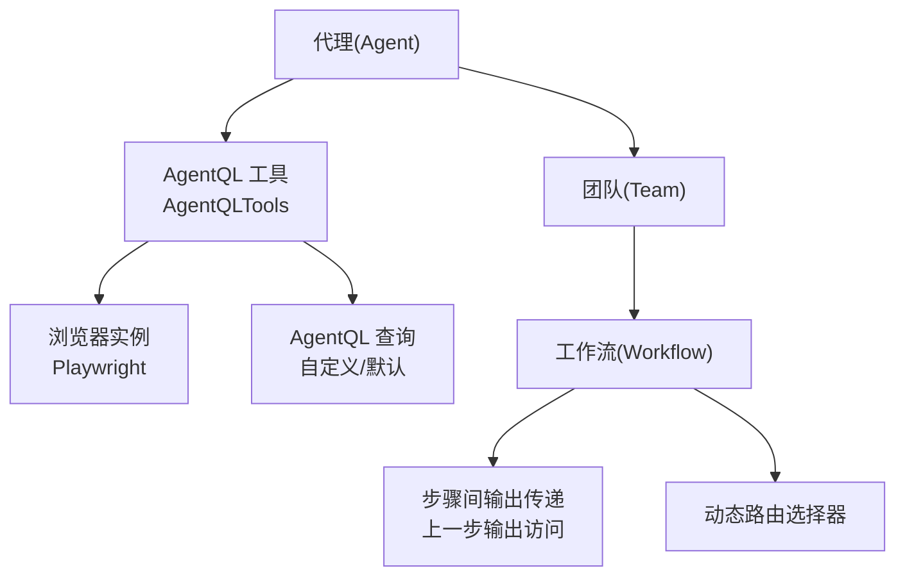
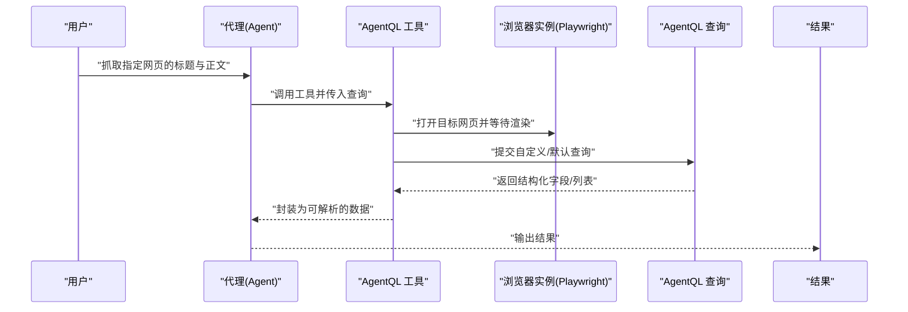
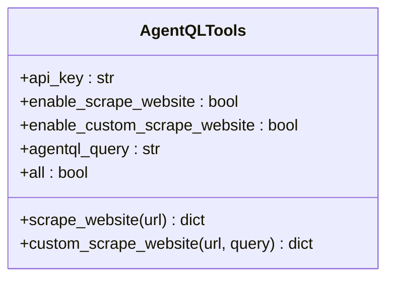
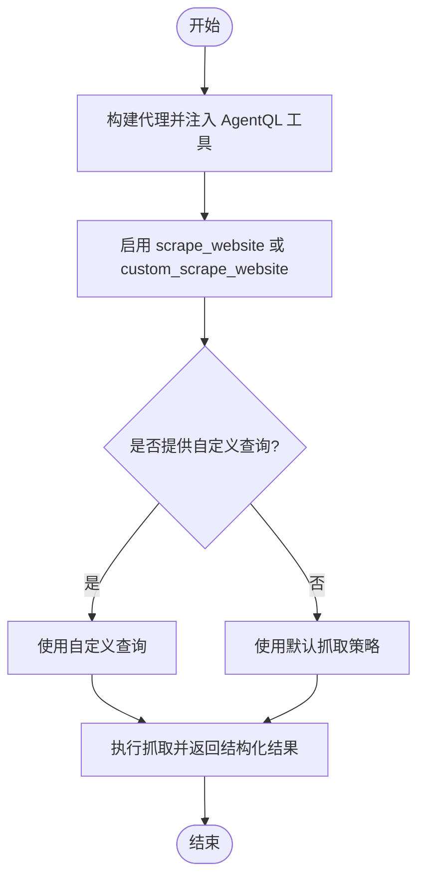
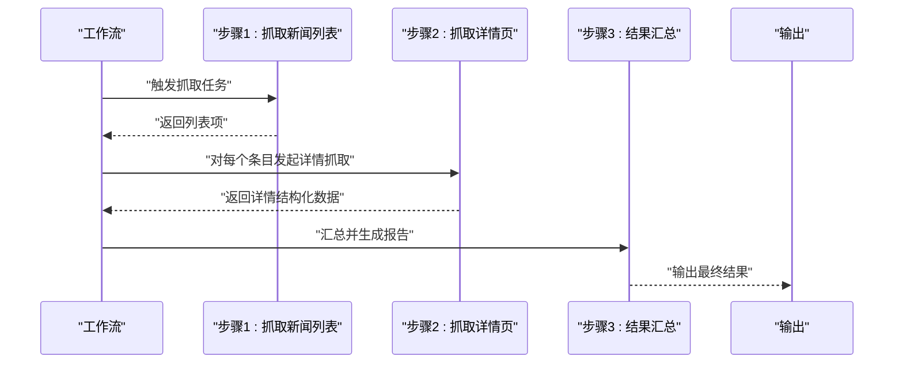
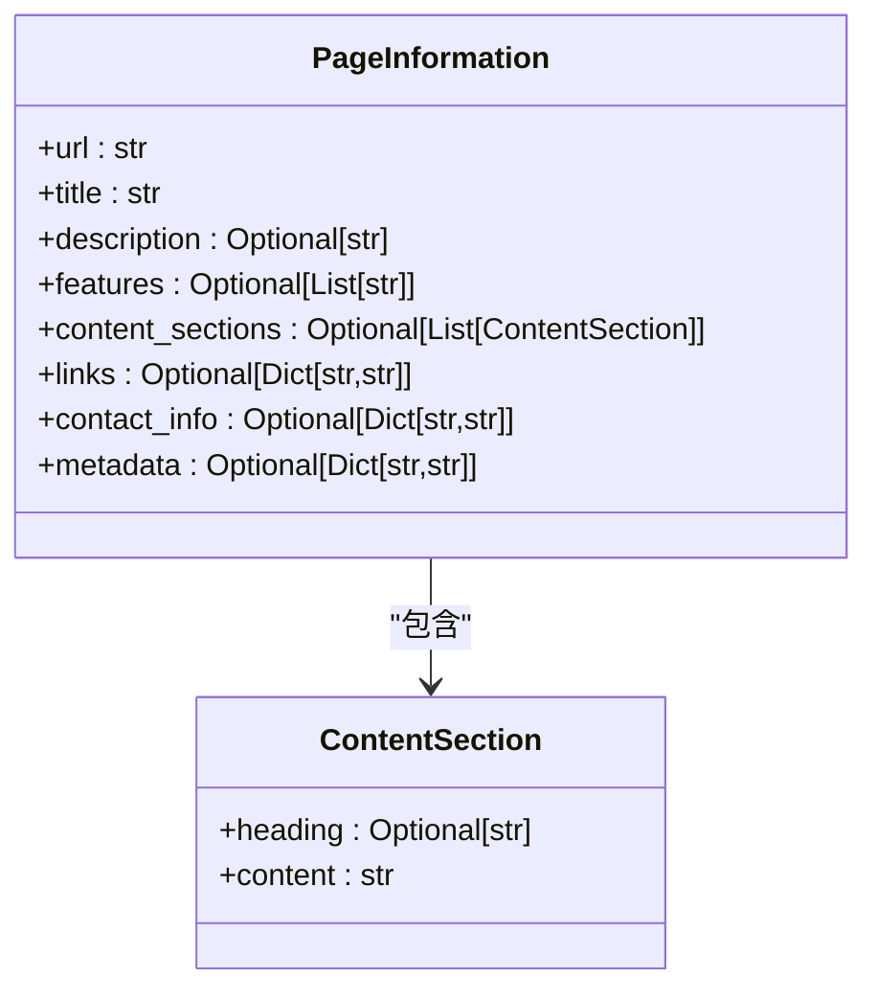
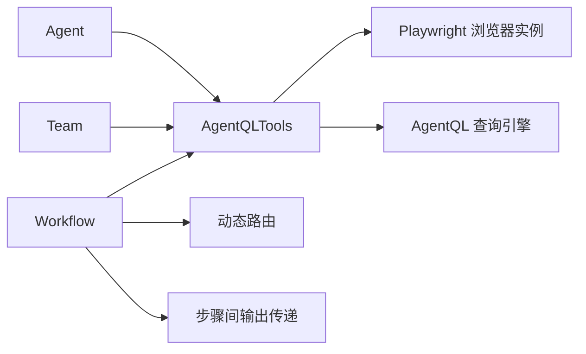

# AgentQL 网页抓取

<cite>
**本文引用的文件**
- [examples/tools/agentql-tools.mdx](file://examples/tools/agentql-tools.mdx)
- [tools/toolkits/web-scrape/agentql.mdx](file://tools/toolkits/web-scrape/agentql.mdx)
- [tools/toolkits/others/agentql.mdx](file://tools/toolkits/others/agentql.mdx)
- [cookbook/agents/web-extraction-agent.mdx](file://cookbook/agents/web-extraction-agent.mdx)
- [examples/teams/tools/async-tools.mdx](file://examples/teams/tools/async-tools.mdx)
- [examples/workflows/advanced-concepts/previous-step-outputs/access-previous-outputs.mdx](file://examples/workflows/advanced-concepts/previous-step-outputs/access-previous-outputs.mdx)
- [workflows/usage/examples/router-choices/dynamic-selector.mdx](file://workflows/usage/examples/router-choices/dynamic-selector.mdx)
</cite>

## 目录
1. [简介](#简介)
2. [项目结构](#项目结构)
3. [核心组件](#核心组件)
4. [架构总览](#架构总览)
5. [详细组件分析](#详细组件分析)
6. [依赖关系分析](#依赖关系分析)
7. [性能考量](#性能考量)
8. [故障排查指南](#故障排查指南)
9. [结论](#结论)
10. [附录](#附录)

## 简介
本文件系统性梳理 AgentQL 在网页自动化与数据抓取中的能力与用法，覆盖以下主题：
- 基于 CSS 选择器与 XPath 的元素定位（通过 AgentQL 查询语法与语义化查询）
- 动态内容抓取与表单交互（通过浏览器实例与查询语法协同）
- AgentQL 查询语法、数据提取方法与结果格式化
- 在代理、团队与工作流中规模化应用：电商产品信息抓取、新闻内容提取、价格监控等
- 最佳实践、性能优化与常见问题解决方案

AgentQL 工具在本仓库中以工具包形式提供，允许 Agent 通过浏览器打开目标站点并执行结构化抓取；同时支持自定义查询以提取特定字段或列表。

## 项目结构
围绕 AgentQL 的文档与示例主要分布在如下位置：
- 工具包与参数说明：tools/toolkits/web-scrape/agentql.mdx、tools/toolkits/others/agentql.mdx
- 使用示例与运行方式：examples/tools/agentql-tools.mdx
- 异步工具与团队集成：examples/teams/tools/async-tools.mdx
- 结构化输出与知识抽取：cookbook/agents/web-extraction-agent.mdx
- 工作流与路由：examples/workflows/advanced-concepts/previous-step-outputs/access-previous-outputs.mdx、workflows/usage/examples/router-choices/dynamic-selector.mdx

图表来源
- [examples/tools/agentql-tools.mdx:17-35](file://examples/tools/agentql-tools.mdx#L17-L35)
- [tools/toolkits/web-scrape/agentql.mdx:28-30](file://tools/toolkits/web-scrape/agentql.mdx#L28-L30)
- [examples/teams/tools/async-tools.mdx:66](file://examples/teams/tools/async-tools.mdx#L66)
- [examples/workflows/advanced-concepts/previous-step-outputs/access-previous-outputs.mdx:110-129](file://examples/workflows/advanced-concepts/previous-step-outputs/access-previous-outputs.mdx#L110-L129)
- [workflows/usage/examples/router-choices/dynamic-selector.mdx:64-76](file://workflows/usage/examples/router-choices/dynamic-selector.mdx#L64-L76)

章节来源
- [examples/tools/agentql-tools.mdx:1-89](file://examples/tools/agentql-tools.mdx#L1-L89)
- [tools/toolkits/web-scrape/agentql.mdx:1-61](file://tools/toolkits/web-scrape/agentql.mdx#L1-L61)
- [tools/toolkits/others/agentql.mdx:1-60](file://tools/toolkits/others/agentql.mdx#L1-L60)

## 核心组件
- AgentQL 工具（AgentQLTools）：封装网页浏览、文本抓取与自定义查询能力，支持启用 scrape_website 与 custom_scrape_website 功能，并可传入自定义查询字符串。
- 浏览器实例（Playwright）：用于打开目标站点并执行交互与渲染，确保动态内容可被正确抓取。
- 自定义查询（AgentQL Query）：通过语义化查询语法从页面中提取字段或列表，支持复杂嵌套与条件筛选。
- 代理（Agent）、团队（Team）、工作流（Workflow）：在不同抽象层级上组合 AgentQL 工具，实现规模化与编排化的网页数据抓取。

章节来源
- [tools/toolkits/web-scrape/agentql.mdx:40-56](file://tools/toolkits/web-scrape/agentql.mdx#L40-L56)
- [tools/toolkits/others/agentql.mdx:40-55](file://tools/toolkits/others/agentql.mdx#L40-L55)
- [examples/tools/agentql-tools.mdx:25-60](file://examples/tools/agentql-tools.mdx#L25-L60)

## 架构总览
下图展示 Agent 通过 AgentQL 工具调用浏览器实例，执行网页浏览与查询，最终产出结构化结果的整体流程。

图表来源
- [examples/tools/agentql-tools.mdx:17-35](file://examples/tools/agentql-tools.mdx#L17-L35)
- [tools/toolkits/web-scrape/agentql.mdx:28-32](file://tools/toolkits/web-scrape/agentql.mdx#L28-L32)

## 详细组件分析

### 组件一：AgentQL 工具参数与函数
- 参数
  - api_key：AgentQL API 密钥
  - enable_scrape_website：启用抓取网站文本
  - enable_custom_scrape_website：启用自定义查询抓取
  - agentql_query：自定义查询字符串
  - all：一键启用所有功能
- 函数
  - scrape_website：抓取页面全部文本
  - custom_scrape_website：使用自定义查询抓取

图表来源
- [tools/toolkits/web-scrape/agentql.mdx:42-56](file://tools/toolkits/web-scrape/agentql.mdx#L42-L56)
- [tools/toolkits/others/agentql.mdx:42-55](file://tools/toolkits/others/agentql.mdx#L42-L55)

章节来源
- [tools/toolkits/web-scrape/agentql.mdx:40-60](file://tools/toolkits/web-scrape/agentql.mdx#L40-L60)
- [tools/toolkits/others/agentql.mdx:40-59](file://tools/toolkits/others/agentql.mdx#L40-L59)

### 组件二：自定义查询与示例
- 示例展示了如何启用特定功能与自定义查询，以提取标题与正文列表。
- 支持通过 agentql_query 传入 GraphQL 风格的查询片段，实现细粒度字段提取。

图表来源
- [examples/tools/agentql-tools.mdx:25-74](file://examples/tools/agentql-tools.mdx#L25-L74)

章节来源
- [examples/tools/agentql-tools.mdx:43-74](file://examples/tools/agentql-tools.mdx#L43-L74)

### 组件三：在团队与工作流中的应用
- 团队（Team）：在多智能体协作场景中，AgentQL 可作为共享工具，统一抓取与结构化输出。
- 工作流（Workflow）：通过动态路由与步骤间输出传递，串联多个抓取与处理步骤，形成端到端的网页数据流水线。

图表来源
- [examples/workflows/advanced-concepts/previous-step-outputs/access-previous-outputs.mdx:110-129](file://examples/workflows/advanced-concepts/previous-step-outputs/access-previous-outputs.mdx#L110-L129)
- [workflows/usage/examples/router-choices/dynamic-selector.mdx:64-76](file://workflows/usage/examples/router-choices/dynamic-selector.mdx#L64-L76)

章节来源
- [examples/teams/tools/async-tools.mdx:66](file://examples/teams/tools/async-tools.mdx#L66)
- [examples/workflows/advanced-concepts/previous-step-outputs/access-previous-outputs.mdx:107-144](file://examples/workflows/advanced-concepts/previous-step-outputs/access-previous-outputs.mdx#L107-L144)
- [workflows/usage/examples/router-choices/dynamic-selector.mdx:48-77](file://workflows/usage/examples/router-choices/dynamic-selector.mdx#L48-L77)

### 组件四：结构化输出与知识抽取（对比参考）
虽然本节聚焦 AgentQL，但可参考 Web Extraction Agent 的结构化输出模式，理解如何将抓取结果组织为结构化模型，便于后续存储与检索。

图表来源
- [cookbook/agents/web-extraction-agent.mdx:44-90](file://cookbook/agents/web-extraction-agent.mdx#L44-L90)

章节来源
- [cookbook/agents/web-extraction-agent.mdx:1-140](file://cookbook/agents/web-extraction-agent.mdx#L1-L140)

## 依赖关系分析
- Agent 依赖 AgentQL 工具；AgentQL 工具依赖浏览器实例（Playwright）与 AgentQL 查询引擎。
- 在团队与工作流中，AgentQL 工具可被复用，配合动态路由与步骤间状态管理，形成可扩展的抓取流水线。

图表来源
- [examples/tools/agentql-tools.mdx:17-35](file://examples/tools/agentql-tools.mdx#L17-L35)
- [tools/toolkits/web-scrape/agentql.mdx:28-32](file://tools/toolkits/web-scrape/agentql.mdx#L28-L32)
- [workflows/usage/examples/router-choices/dynamic-selector.mdx:64-76](file://workflows/usage/examples/router-choices/dynamic-selector.mdx#L64-L76)
- [examples/workflows/advanced-concepts/previous-step-outputs/access-previous-outputs.mdx:110-129](file://examples/workflows/advanced-concepts/previous-step-outputs/access-previous-outputs.mdx#L110-L129)

章节来源
- [examples/tools/agentql-tools.mdx:17-35](file://examples/tools/agentql-tools.mdx#L17-L35)
- [tools/toolkits/web-scrape/agentql.mdx:28-32](file://tools/toolkits/web-scrape/agentql.mdx#L28-L32)

## 性能考量
- 浏览器实例启动与页面渲染成本较高，建议：
  - 合理设置查询范围，避免不必要的 DOM 遍历
  - 复用会话与缓存，减少重复打开页面
  - 在工作流中采用并行步骤与异步执行（参见异步工具示例）
- 动态内容抓取需等待渲染完成，可通过合理设置等待策略与重试机制提升稳定性
- 在团队与工作流中，利用步骤间输出复用与路由分流，降低重复抓取

[本节为通用指导，不直接分析具体文件]

## 故障排查指南
- 环境变量未配置：确认已设置 AgentQL API 密钥，并安装 Playwright 所需浏览器
- 工具未启用：检查是否启用了 scrape_website 或 custom_scrape_website
- 查询语法错误：核对自定义查询字符串格式，确保字段名与列表语法正确
- 异步执行：在异步框架中使用异步方法（如 arun/aprint_response），避免阻塞
- 步骤间数据缺失：在工作流中通过上一步输出访问接口获取中间结果，确保步骤顺序与键名一致

章节来源
- [examples/tools/agentql-tools.mdx:8-17](file://examples/tools/agentql-tools.mdx#L8-L17)
- [tools/toolkits/web-scrape/agentql.mdx:42-49](file://tools/toolkits/web-scrape/agentql.mdx#L42-L49)
- [examples/teams/tools/async-tools.mdx:74-92](file://examples/teams/tools/async-tools.mdx#L74-L92)
- [examples/workflows/advanced-concepts/previous-step-outputs/access-previous-outputs.mdx:110-129](file://examples/workflows/advanced-concepts/previous-step-outputs/access-previous-outputs.mdx#L110-L129)

## 结论
AgentQL 提供了面向网页的语义化抓取能力，结合浏览器实例与自定义查询，能够稳定地提取结构化数据。通过在代理、团队与工作流中组合使用，可以实现从新闻内容提取到电商产品信息抓取、再到价格监控等多样化场景。建议在实践中遵循最小查询原则、合理使用异步与并行、并在工作流中做好步骤间数据管理与路由控制，以获得更高的稳定性与性能。

[本节为总结性内容，不直接分析具体文件]

## 附录

### 实际应用场景建议
- 电商产品信息抓取：使用自定义查询提取标题、价格、评分、评论数等字段，结合结构化输出模型统一入库
- 新闻内容提取：先抓取列表页，再对详情页进行结构化抽取，最后汇总为报告
- 价格监控：定时抓取目标页面，比较历史快照差异，触发告警与更新

[本节为概念性内容，不直接分析具体文件]