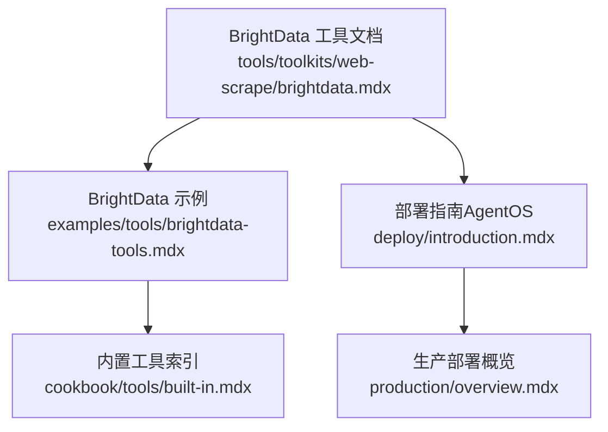
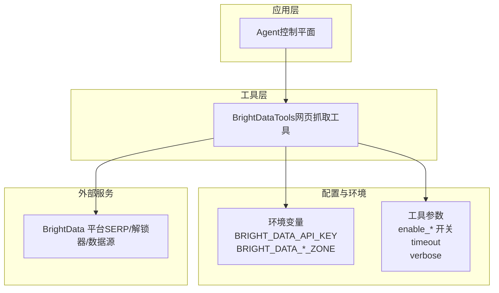
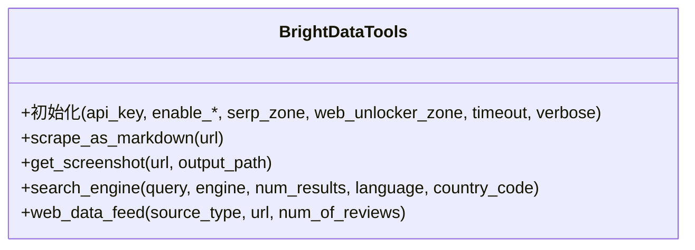
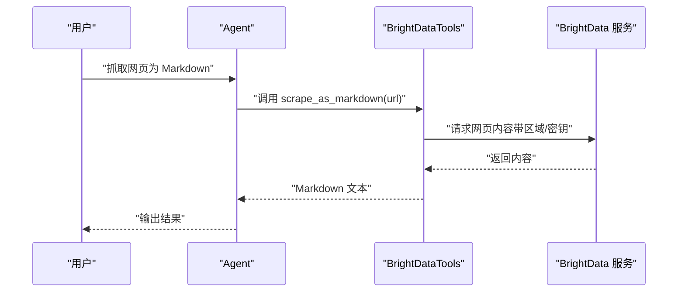
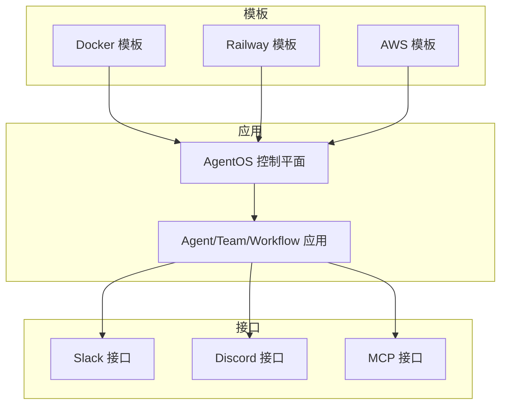
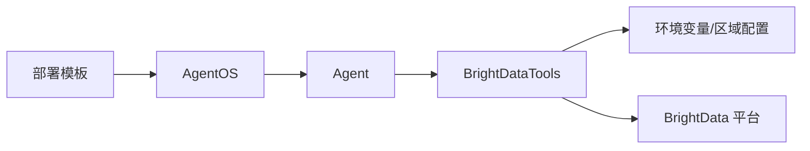

# BrightData 网页抓取

<cite>
**本文引用的文件**   
- [brightdata.mdx](file://tools/toolkits/web-scrape/brightdata.mdx)
- [brightdata-tools.mdx](file://examples/tools/brightdata-tools.mdx)
- [built-in.mdx](file://cookbook/tools/built-in.mdx)
- [introduction.mdx](file://deploy/introduction.mdx)
- [overview.mdx](file://production/overview.mdx)
</cite>

## 目录
1. [简介](#简介)
2. [项目结构](#项目结构)
3. [核心组件](#核心组件)
4. [架构总览](#架构总览)
5. [详细组件分析](#详细组件分析)
6. [依赖关系分析](#依赖关系分析)
7. [性能考量](#性能考量)
8. [故障排查指南](#故障排查指南)
9. [结论](#结论)
10. [附录](#附录)

## 简介
本技术文档围绕 BrightData 企业级网页抓取能力展开，结合仓库中的 BrightData 工具包与示例，系统化说明其在代理池管理、IP 旋转与反检测方面的可用能力边界，并给出在代理、团队与工作流中进行大规模、高并发网页数据抓取的实践建议。文档同时覆盖 BrightData 的 API 集成方式、环境变量配置、功能开关与参数调优，以及在企业环境中进行部署、性能优化与合规使用的最佳实践。

## 项目结构
BrightData 工具包位于工具集“web-scrape”下，配套示例位于 examples/tools 目录；部署与生产相关内容位于 deploy 与 production 模块。下图展示与 BrightData 抓取相关的文档与示例分布：

图表来源
- [brightdata.mdx](file://tools/toolkits/web-scrape/brightdata.mdx)
- [brightdata-tools.mdx](file://examples/tools/brightdata-tools.mdx)
- [built-in.mdx](file://cookbook/tools/built-in.mdx)
- [introduction.mdx](file://deploy/introduction.mdx)
- [overview.mdx](file://production/overview.mdx)

章节来源
- [brightdata.mdx](file://tools/toolkits/web-scrape/brightdata.mdx)
- [brightdata-tools.mdx](file://examples/tools/brightdata-tools.mdx)
- [built-in.mdx](file://cookbook/tools/built-in.mdx)
- [introduction.mdx](file://deploy/introduction.mdx)
- [overview.mdx](file://production/overview.mdx)

## 核心组件
- BrightData 工具包（BrightDataTools）
  - 功能：网页 Markdown 转换、截图生成、搜索引擎结果（SERP）检索、多平台结构化数据抓取（电商、社交、专业网络、其他平台等）。
  - 关键参数：API 密钥、启用函数开关（Markdown 抓取、截图、SERP、结构化数据）、区域（zone）设置、超时、日志级别等。
  - 使用方式：通过 Agent 注入工具，按需 include/exclude 具体子功能，或启用 all 模式一次性启用全部功能。

章节来源
- [brightdata.mdx](file://tools/toolkits/web-scrape/brightdata.mdx)
- [brightdata-tools.mdx](file://examples/tools/brightdata-tools.mdx)

## 架构总览
BrightData 在本仓库中的集成路径如下：Agent 作为控制平面，BrightDataTools 作为数据采集工具，通过环境变量与区域配置对接 BrightData 平台服务端点。部署层面可借助 AgentOS 的模板与接口进行企业化落地。

图表来源
- [brightdata.mdx](file://tools/toolkits/web-scrape/brightdata.mdx)
- [brightdata-tools.mdx](file://examples/tools/brightdata-tools.mdx)

## 详细组件分析

### 组件一：BrightData 工具包（BrightDataTools）
- 能力矩阵
  - 网页抓取：Markdown 转换、截图生成。
  - 搜索引擎：Google/Bing/Yandex 结果检索。
  - 结构化数据：覆盖电商、社交、专业网络、其他平台等多类数据源。
- 参数与行为
  - API 密钥优先使用环境变量，支持按需启用/禁用具体功能，支持区域配置与超时设置。
  - 支持 include/exclude 子功能，便于在不同场景下裁剪能力与成本。
- 使用模式
  - 单次任务：直接注入工具到 Agent，按需开启截图或 SERP。
  - 批量任务：结合团队/工作流并行执行，通过区域与参数优化吞吐。

图表来源
- [brightdata.mdx](file://tools/toolkits/web-scrape/brightdata.mdx)

章节来源
- [brightdata.mdx](file://tools/toolkits/web-scrape/brightdata.mdx)
- [brightdata-tools.mdx](file://examples/tools/brightdata-tools.mdx)

### 组件二：BrightData 示例与 Agent 集成
- 示例要点
  - 通过 Agent 注入 BrightDataTools，分别演示包含特定功能、排除截图功能、全量功能三种使用方式。
  - 提供运行脚本与环境准备步骤，便于快速验证。
- 适用场景
  - 快速原型：单 Agent + BrightDataTools 完成网页内容提取与截图。
  - 规模化：结合团队/工作流，拆分任务并行执行，降低端到端延迟。

图表来源
- [brightdata-tools.mdx](file://examples/tools/brightdata-tools.mdx)
- [brightdata.mdx](file://tools/toolkits/web-scrape/brightdata.mdx)

章节来源
- [brightdata-tools.mdx](file://examples/tools/brightdata-tools.mdx)

### 组件三：部署与企业化（AgentOS）
- 模板与接口
  - 提供 Docker、Railway、AWS 等模板，支持一键部署 AgentOS。
  - 可通过 Slack、Discord、MCP 等接口对外暴露应用。
- 企业特性
  - 控制面直连 AgentOS，强调私有化与数据主权。
  - 支持数据库与存储的本地化，避免外部数据共享与供应商锁定。

图表来源
- [introduction.mdx](file://deploy/introduction.mdx)
- [overview.mdx](file://production/overview.mdx)

章节来源
- [introduction.mdx](file://deploy/introduction.mdx)
- [overview.mdx](file://production/overview.mdx)

## 依赖关系分析
- 组件耦合
  - Agent 对 BrightDataTools 为组合依赖；BrightDataTools 依赖环境变量与区域配置。
  - 部署模板与接口为外部集成点，与工具层解耦。
- 外部依赖
  - BrightData 平台服务端点（通过 API 密钥与区域配置访问）。
  - 第三方库（如 requests）用于示例运行环境。

图表来源
- [brightdata.mdx](file://tools/toolkits/web-scrape/brightdata.mdx)
- [introduction.mdx](file://deploy/introduction.mdx)

章节来源
- [brightdata.mdx](file://tools/toolkits/web-scrape/brightdata.mdx)
- [introduction.mdx](file://deploy/introduction.mdx)

## 性能考量
- 功能裁剪
  - 通过 include/exclude 子功能，仅启用必要能力，减少网络与解析开销。
- 区域与超时
  - 合理设置 serp_zone/web_unlocker_zone 以匹配目标站点的稳定性与速度。
  - 根据任务复杂度调整 timeout，避免长尾阻塞。
- 并发与规模化
  - 将抓取任务拆分至多个 Agent 或团队成员，结合队列与重试策略提升吞吐。
  - 在部署侧采用水平扩展与资源隔离，保障关键任务的 SLA。

## 故障排查指南
- 常见问题定位
  - API 密钥未配置或无效：检查 BRIGHT_DATA_API_KEY 是否正确设置。
  - 区域配置不匹配：确认 BRIGHT_DATA_SERP_ZONE 与 BRIGHT_DATA_WEB_UNLOCKER_ZONE 的值是否与平台一致。
  - 超时与网络异常：适当提高 timeout，检查代理链路与防火墙策略。
- 日志与调试
  - 启用 verbose 输出，结合 Agent 的响应与工具返回信息定位问题。
  - 对于大规模任务，建议记录每个步骤的耗时与错误码以便复盘。

章节来源
- [brightdata.mdx](file://tools/toolkits/web-scrape/brightdata.mdx)

## 结论
BrightData 工具包在本仓库中提供了面向企业级网页抓取的核心能力：网页内容提取、截图、搜索引擎结果与多平台结构化数据抓取。通过 Agent 注入与灵活的功能开关，可在单任务与规模化场景中高效落地。结合 AgentOS 的部署模板与接口，可进一步实现私有化、可审计的企业级部署与运维。建议在实际业务中结合区域配置、超时与功能裁剪策略，持续优化性能与成本。

## 附录
- 商业应用场景建议
  - 竞争情报：利用 SERP 与结构化数据抓取，构建竞品监测与画像。
  - 价格监控：针对电商与零售平台的数据源，建立定时抓取与价格变化告警。
  - 市场研究：从专业网络与社交媒体抓取公开信息，辅助报告与洞察。
- 合规与安全
  - 明确数据使用范围与目的，遵守目标网站的 robots 协议与法律法规。
  - 在部署侧强化访问控制与数据治理，确保数据主权与最小化原则。