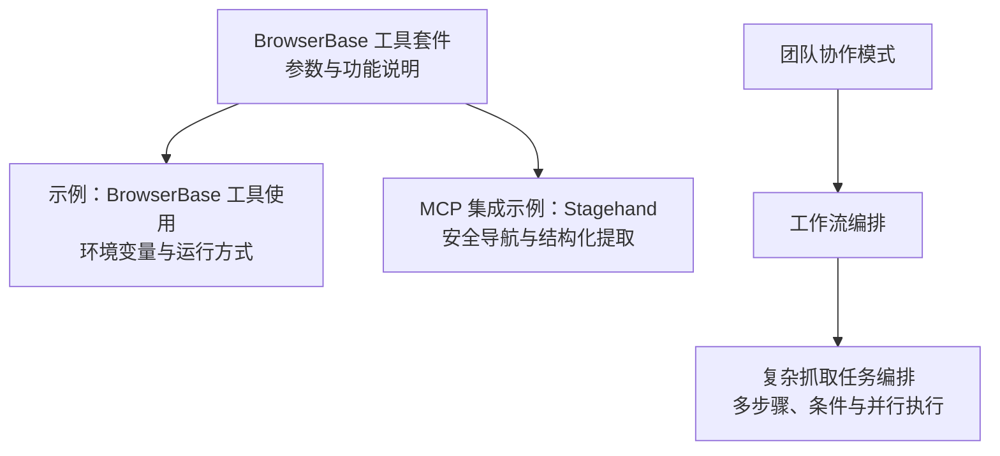
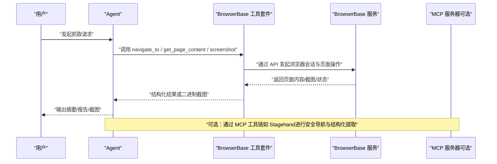
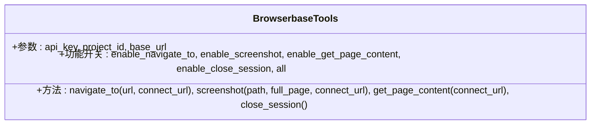
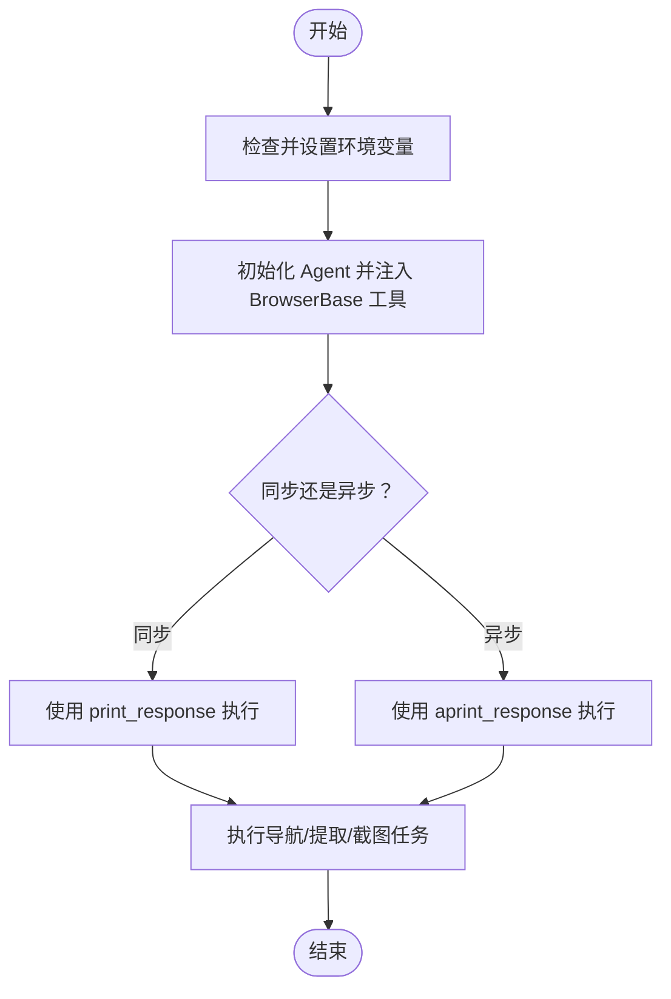
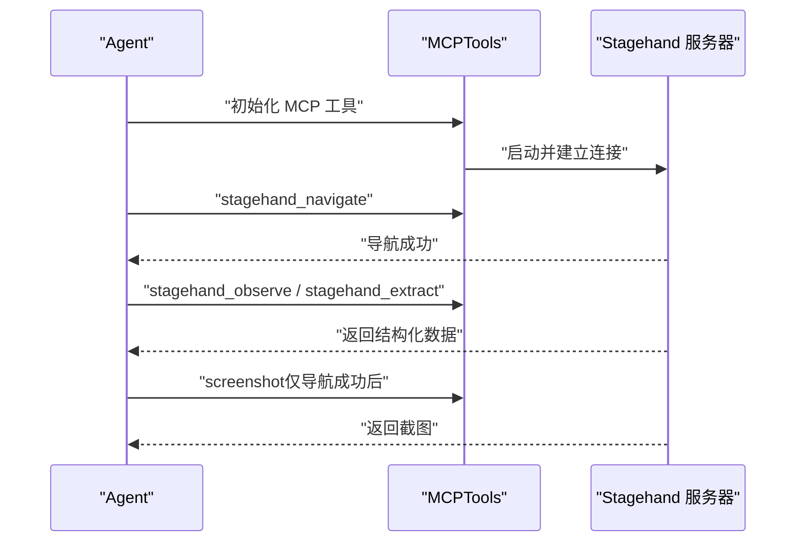
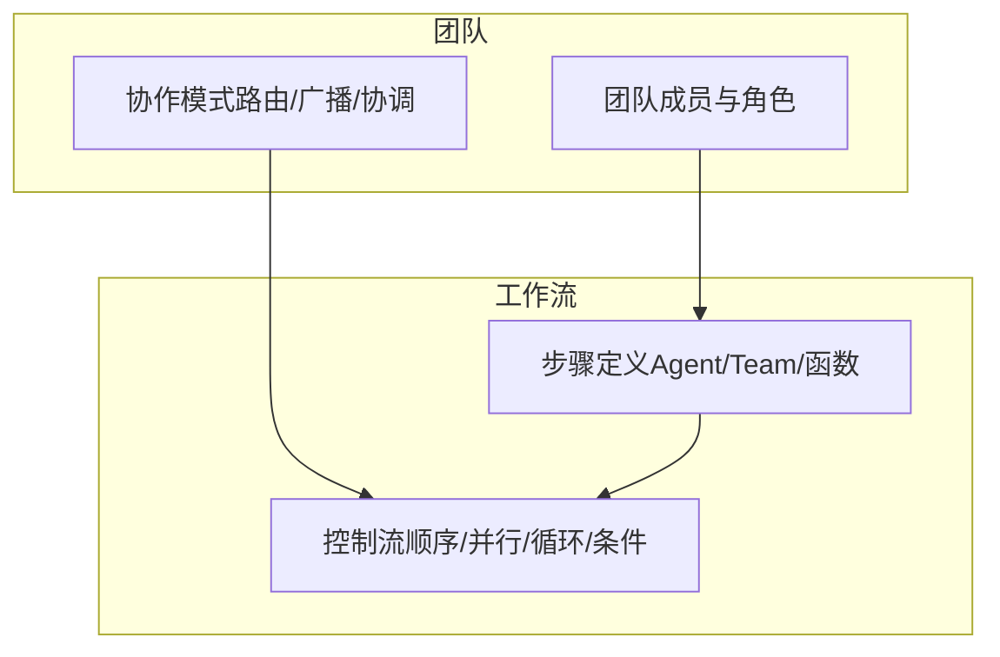
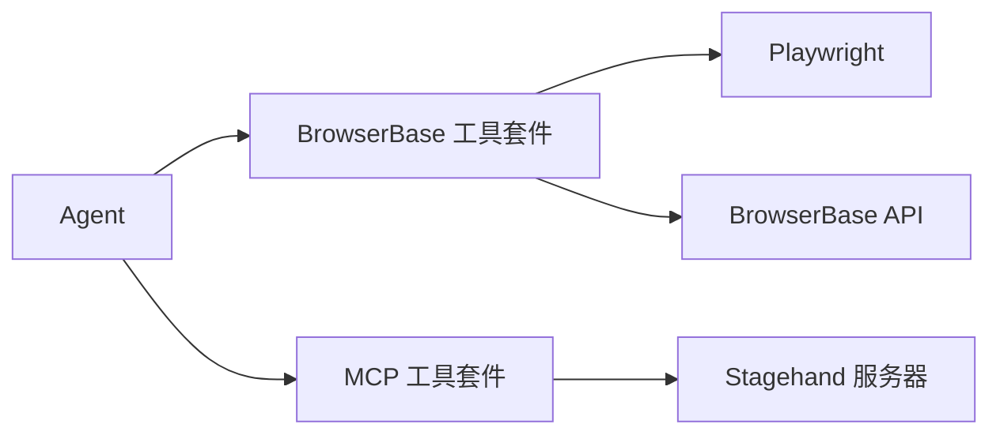

# BrowserBase 网页抓取

<cite>
**本文引用的文件**
- [browserbase.mdx](file://tools/toolkits/web-scrape/browserbase.mdx)
- [browserbase-tools.mdx](file://examples/tools/browserbase-tools.mdx)
- [stagehand.mdx](file://tools/mcp/usage/stagehand.mdx)
- [teams/overview.mdx](file://teams/overview.mdx)
- [workflows/overview.mdx](file://workflows/overview.mdx)
</cite>

## 目录
1. [简介](#简介)
2. [项目结构](#项目结构)
3. [核心组件](#核心组件)
4. [架构总览](#架构总览)
5. [详细组件分析](#详细组件分析)
6. [依赖关系分析](#依赖关系分析)
7. [性能考虑](#性能考虑)
8. [故障排查指南](#故障排查指南)
9. [结论](#结论)
10. [附录](#附录)

## 简介
本技术文档围绕 BrowserBase 网页抓取工具包展开，系统性介绍其在无头浏览器自动化、JavaScript 渲染页面处理、反爬虫绕过与动态内容抓取方面的能力，并覆盖浏览器配置选项、会话管理与代理设置。文档同时说明如何在代理、团队与工作流场景中使用 BrowserBase 进行复杂网页抓取（如社交媒体内容、动态应用数据与交互式网站数据提取），并提供性能优化策略、稳定性保障与法律合规建议。

## 项目结构
与 BrowserBase 相关的内容主要分布在以下位置：
- 工具套件与参数说明：tools/toolkits/web-scrape/browserbase.mdx
- 使用示例与环境变量：examples/tools/browserbase-tools.mdx
- MCP 集成示例（Stagehand）：tools/mcp/usage/stagehand.mdx
- 团队协作模式：teams/overview.mdx
- 工作流编排：workflows/overview.mdx

**图表来源**
- [browserbase.mdx:1-74](file://tools/toolkits/web-scrape/browserbase.mdx#L1-L74)
- [browserbase-tools.mdx:1-107](file://examples/tools/browserbase-tools.mdx#L1-L107)
- [stagehand.mdx:1-119](file://tools/mcp/usage/stagehand.mdx#L1-L119)
- [teams/overview.mdx:1-135](file://teams/overview.mdx#L1-L135)
- [workflows/overview.mdx:1-102](file://workflows/overview.mdx#L1-L102)

**章节来源**
- [browserbase.mdx:1-74](file://tools/toolkits/web-scrape/browserbase.mdx#L1-L74)
- [browserbase-tools.mdx:1-107](file://examples/tools/browserbase-tools.mdx#L1-L107)
- [stagehand.mdx:1-119](file://tools/mcp/usage/stagehand.mdx#L1-L119)
- [teams/overview.mdx:1-135](file://teams/overview.mdx#L1-L135)
- [workflows/overview.mdx:1-102](file://workflows/overview.mdx#L1-L102)

## 核心组件
- BrowserBase 工具套件
  - 功能：支持导航、截图、获取页面内容、关闭会话等。
  - 参数：API 密钥、项目 ID、自定义基础 URL、功能开关（启用/禁用各功能）、统一启用全部功能。
  - 适用场景：需要在无头环境中进行 JavaScript 渲染、动态内容抓取与可视化验证的网页自动化任务。
- 示例与环境变量
  - 提供同步与异步两种调用方式，自动根据上下文选择对应实现。
  - 环境变量：BROWSERBASE_API_KEY、BROWSERBASE_PROJECT_ID、BROWSERBASE_BASE_URL。
- MCP 集成（Stagehand）
  - 通过 MCP 服务器提供安全初始化序列与结构化提取流程，强调“先导航、后截图”的顺序约束，降低初始化错误风险。
- 团队与工作流
  - 团队模式：明确协作风格与任务委派；工作流模式：定义可重复的步骤编排，适合复杂抓取流水线。

**章节来源**
- [browserbase.mdx:5-74](file://tools/toolkits/web-scrape/browserbase.mdx#L5-L74)
- [browserbase-tools.mdx:8-107](file://examples/tools/browserbase-tools.mdx#L8-L107)
- [stagehand.mdx:60-119](file://tools/mcp/usage/stagehand.mdx#L60-L119)
- [teams/overview.mdx:79-101](file://teams/overview.mdx#L79-L101)
- [workflows/overview.mdx:49-69](file://workflows/overview.mdx#L49-L69)

## 架构总览
下图展示了从 Agent 到 BrowserBase 的典型调用链路，以及在 MCP 与团队/工作流中的集成方式：

**图表来源**
- [browserbase.mdx:17-45](file://tools/toolkits/web-scrape/browserbase.mdx#L17-L45)
- [stagehand.mdx:60-108](file://tools/mcp/usage/stagehand.mdx#L60-L108)

## 详细组件分析

### 组件一：BrowserBase 工具套件
- 能力概览
  - 导航到指定 URL，支持连接参数。
  - 截取当前页面截图（支持整页截取）。
  - 获取当前页面 HTML 内容。
  - 关闭浏览器会话。
- 配置项
  - API 密钥、项目 ID、基础 URL（用于自托管实例或跨区域访问）。
  - 功能开关：是否启用导航、截图、获取页面内容、关闭会话；统一启用全部功能。
- 使用要点
  - 同步与异步自动适配，便于在不同运行时（脚本/异步框架）中复用同一 Agent。
  - 建议在需要 JavaScript 渲染与动态内容加载的站点上优先使用该工具套件。

**图表来源**
- [browserbase.mdx:49-70](file://tools/toolkits/web-scrape/browserbase.mdx#L49-L70)

**章节来源**
- [browserbase.mdx:5-74](file://tools/toolkits/web-scrape/browserbase.mdx#L5-L74)

### 组件二：示例与环境变量
- 环境变量
  - BROWSERBASE_API_KEY：认证所需，格式以特定前缀开头。
  - BROWSERBASE_PROJECT_ID：标识所属项目，格式为标准 UUID。
  - BROWSERBASE_BASE_URL：API 端点，默认值可在工具内部读取环境变量。
- 使用方式
  - 同步：适用于常规脚本与阻塞式执行。
  - 异步：适用于 FastAPI、异步框架或异步运行接口。
- 示例目标
  - 访问示例站点并分页抓取内容，展示导航、内容提取与截图的组合使用。

**图表来源**
- [browserbase-tools.mdx:39-93](file://examples/tools/browserbase-tools.mdx#L39-L93)

**章节来源**
- [browserbase-tools.mdx:8-107](file://examples/tools/browserbase-tools.mdx#L8-L107)

### 组件三：MCP 集成（Stagehand）
- 安全导航与结构化提取
  - 强制初始化顺序：先导航，再观察/提取/交互，最后截图。
  - 通过 MCP 服务器提供稳定工具集，降低常见自动化错误。
- 工具清单
  - 导航、结构化提取、元素观察、页面交互、截图。
- 适用场景
  - 需要稳健的页面探索与结构化输出的复杂抓取任务。

**图表来源**
- [stagehand.mdx:60-119](file://tools/mcp/usage/stagehand.mdx#L60-L119)

**章节来源**
- [stagehand.mdx:6-119](file://tools/mcp/usage/stagehand.mdx#L6-L119)

### 组件四：团队与工作流中的抓取
- 团队协作
  - 明确协作风格（路由/广播/协调），提升复杂任务的分工与一致性。
  - 支持可调用工厂与缓存设置，便于扩展与维护。
- 工作流编排
  - 将 Agent、Team 与函数作为步骤，支持顺序、并行、循环与条件分支。
  - 适合构建可重复、可观测的抓取流水线。

**图表来源**
- [teams/overview.mdx:79-101](file://teams/overview.mdx#L79-L101)
- [workflows/overview.mdx:49-69](file://workflows/overview.mdx#L49-L69)

**章节来源**
- [teams/overview.mdx:39-101](file://teams/overview.mdx#L39-L101)
- [workflows/overview.mdx:49-69](file://workflows/overview.mdx#L49-L69)

## 依赖关系分析
- 外部依赖
  - BrowserBase SDK 与 Playwright（示例中明确要求安装）。
  - MCP 服务器（Stagehand）用于增强导航与提取的安全性与结构化能力。
- 内部依赖
  - Agent 与工具套件解耦，支持同步/异步双实现，便于在不同运行时复用。
  - 团队与工作流对工具的抽象层友好，便于在复杂任务中组合使用。

**图表来源**
- [browserbase.mdx:9-15](file://tools/toolkits/web-scrape/browserbase.mdx#L9-L15)
- [stagehand.mdx:21-31](file://tools/mcp/usage/stagehand.mdx#L21-L31)

**章节来源**
- [browserbase.mdx:9-15](file://tools/toolkits/web-scrape/browserbase.mdx#L9-L15)
- [stagehand.mdx:21-31](file://tools/mcp/usage/stagehand.mdx#L21-L31)

## 性能考虑
- 会话复用与生命周期管理
  - 在一次抓取任务内尽量复用会话，减少连接开销；任务结束后及时关闭会话。
- JavaScript 渲染与等待策略
  - 对于重度渲染页面，合理设置等待时间与重试机制，避免过早提取导致内容不完整。
- 截图与内容提取的权衡
  - 截图会增加带宽与存储成本，建议仅在必要时使用；优先提取结构化数据以降低体积。
- 并发与限速
  - 在团队/工作流中合理调度并发度，避免触发目标站点的速率限制。
- 缓存与去重
  - 对重复抓取的目标启用缓存与去重策略，减少无效请求。

## 故障排查指南
- 初始化顺序问题（MCP/Stagehand）
  - 必须先执行导航工具，确认页面加载成功后再进行观察、提取或截图。
  - 若出现初始化错误，按提示重启并仅执行导航工具以恢复状态。
- 环境变量缺失
  - 确认已正确设置 BROWSERBASE_API_KEY、BROWSERBASE_PROJECT_ID、BROWSERBASE_BASE_URL。
- 会话异常
  - 在任务完成后主动调用关闭会话工具，避免资源泄漏。
- 页面内容为空或不完整
  - 检查目标站点的 JavaScript 渲染需求，适当延长等待时间或调整渲染策略。
- 代理与网络
  - 如需通过代理访问，确保基础 URL 指向正确的代理端点；在团队/工作流中统一配置网络策略。

**章节来源**
- [stagehand.mdx:75-87](file://tools/mcp/usage/stagehand.mdx#L75-L87)
- [browserbase-tools.mdx:10-24](file://examples/tools/browserbase-tools.mdx#L10-L24)
- [browserbase.mdx:55-60](file://tools/toolkits/web-scrape/browserbase.mdx#L55-L60)

## 结论
BrowserBase 工具包为无头浏览器自动化提供了简洁而强大的接口，结合 JavaScript 渲染、动态内容抓取与会话管理能力，能够胜任多种复杂网页抓取任务。通过 MCP 集成可进一步提升导航与提取的稳健性；在团队与工作流中，可将抓取任务模块化、可重复化与可观测化。配合合理的性能优化与合规策略，可在保证稳定性的同时高效完成大规模数据采集。

## 附录
- 法律合规建议
  - 遵守目标站点的 robots 协议与服务条款，尊重版权与隐私政策。
  - 对敏感数据进行脱敏与加密存储，遵循数据最小化原则。
  - 在跨境数据传输场景中，遵守相关国家的数据本地化与跨境传输规定。
- 最佳实践清单
  - 明确初始化顺序（导航优先），在截图前确认页面加载完成。
  - 在团队/工作流中统一配置环境变量与网络策略。
  - 对重复任务启用缓存与去重，控制并发与限速，避免对目标站点造成压力。
  - 定期审计抓取日志与会话状态，确保可追溯与可恢复。