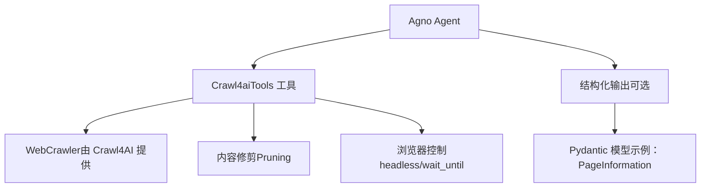
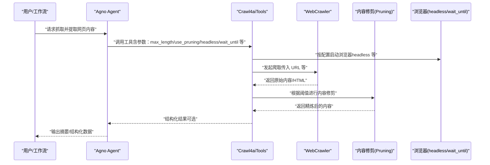
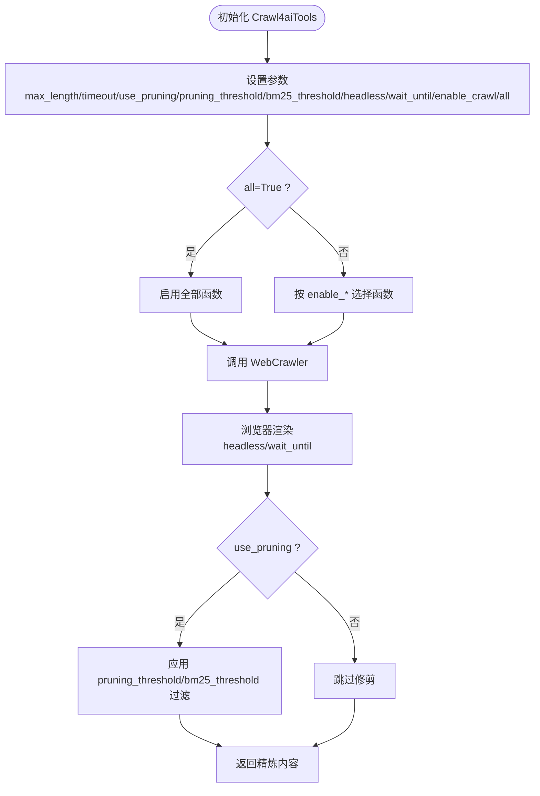
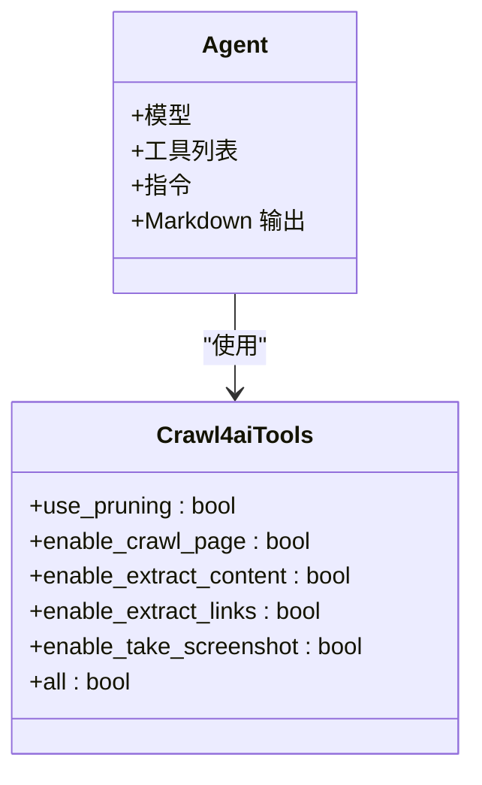
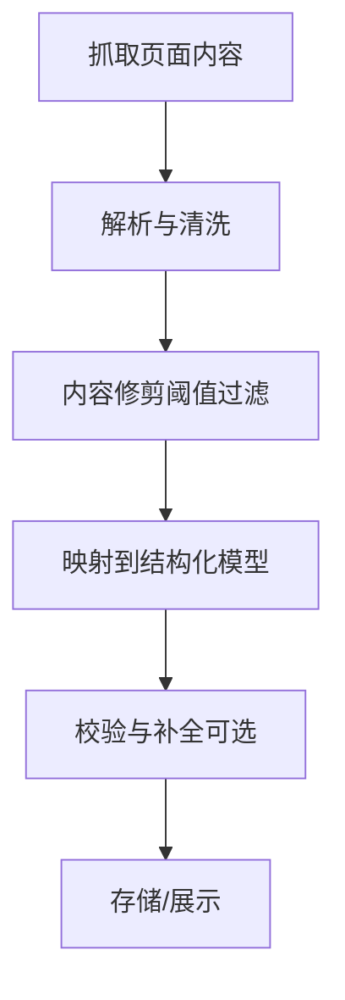
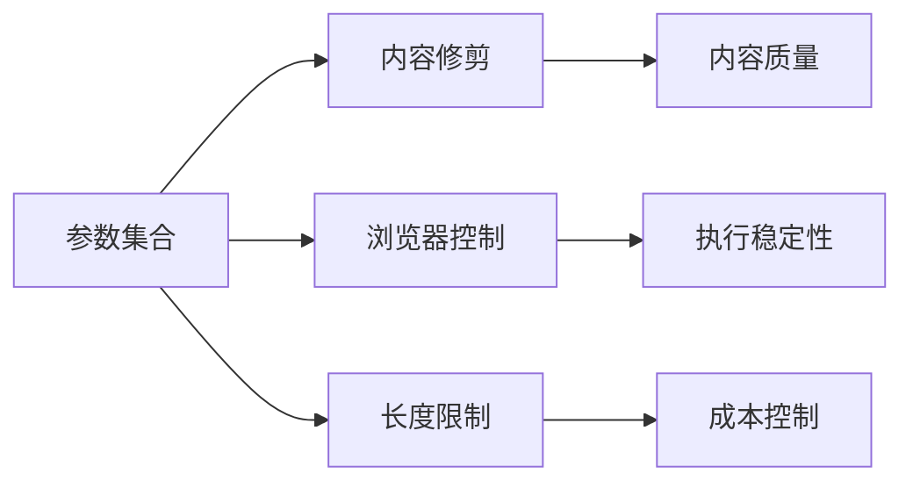

# Crawl4AI 网页抓取

<cite>
**本文引用的文件**
- [crawl4ai.mdx](file://tools/toolkits/web-scrape/crawl4ai.mdx)
- [crawl4ai-tools.mdx](file://examples/tools/crawl4ai-tools.mdx)
- [built-in.mdx](file://cookbook/tools/built-in.mdx)
- [web-extraction-agent.mdx](file://cookbook/agents/web-extraction-agent.mdx)
</cite>

## 目录
1. [简介](#简介)
2. [项目结构](#项目结构)
3. [核心组件](#核心组件)
4. [架构总览](#架构总览)
5. [详细组件分析](#详细组件分析)
6. [依赖关系分析](#依赖关系分析)
7. [性能考量](#性能考量)
8. [故障排查指南](#故障排查指南)
9. [结论](#结论)
10. [附录](#附录)

## 简介
本技术文档围绕 Crawl4AI 网页抓取工具包在 Agno 生态中的使用与集成展开，重点说明其在 AI 驱动的网页抓取、智能内容识别、结构化数据提取与语义理解方面的能力边界与配置要点。文档同时覆盖抓取策略配置（如内容修剪、超时、等待条件等）、内容过滤规则（阈值参数）以及数据质量保障机制（如浏览器模式、超时控制），并给出在代理、团队与工作流中进行智能化网页数据抓取的实践建议，涵盖新闻文章提取、产品信息抓取与社交媒体内容分析场景。最后提供准确性优化、批量处理策略与成本控制方案。

## 项目结构
本仓库中与 Crawl4AI 相关的内容主要分布在以下位置：
- 工具参考与参数说明：tools/toolkits/web-scrape/crawl4ai.mdx
- 使用示例与多 Agent 场景：examples/tools/crawl4ai-tools.mdx
- 内置工具总览（包含 Crawl4AI 条目）：cookbook/tools/built-in.mdx
- 结构化数据提取范式（可类比到 Crawl4AI 的结构化输出思路）：cookbook/agents/web-extraction-agent.mdx

图表来源
- [crawl4ai.mdx:19-25](file://tools/toolkits/web-scrape/crawl4ai.mdx#L19-L25)
- [crawl4ai-tools.mdx:10-32](file://examples/tools/crawl4ai-tools.mdx#L10-L32)
- [web-extraction-agent.mdx:74-90](file://cookbook/agents/web-extraction-agent.mdx#L74-L90)

章节来源
- [crawl4ai.mdx:1-50](file://tools/toolkits/web-scrape/crawl4ai.mdx#L1-L50)
- [crawl4ai-tools.mdx:1-149](file://examples/tools/crawl4ai-tools.mdx#L1-L149)
- [built-in.mdx:92-104](file://cookbook/tools/built-in.mdx#L92-L104)
- [web-extraction-agent.mdx:1-140](file://cookbook/agents/web-extraction-agent.mdx#L1-L140)

## 核心组件
- Crawl4aiTools 工具：封装对 Crawl4AI WebCrawler 的调用，支持内容修剪、浏览器行为控制与函数级启用开关。
- WebCrawler：底层爬虫能力，负责页面抓取与内容抽取。
- 内容修剪（Pruning）：通过阈值参数过滤噪声，聚焦主内容。
- 浏览器控制：headless 模式与 wait_until 等参数影响渲染与稳定性。
- 结构化输出（可选）：结合 Pydantic 模型实现结构化数据提取，便于后续处理与存储。

章节来源
- [crawl4ai.mdx:27-41](file://tools/toolkits/web-scrape/crawl4ai.mdx#L27-L41)
- [crawl4ai-tools.mdx:34-68](file://examples/tools/crawl4ai-tools.mdx#L34-L68)
- [web-extraction-agent.mdx:44-90](file://cookbook/agents/web-extraction-agent.mdx#L44-L90)

## 架构总览
下图展示了从 Agent 到 Crawl4AI 工具再到 WebCrawler 的调用链路，以及内容修剪与浏览器控制的关键节点。

图表来源
- [crawl4ai.mdx:29-39](file://tools/toolkits/web-scrape/crawl4ai.mdx#L29-L39)
- [crawl4ai.mdx:43-45](file://tools/toolkits/web-scrape/crawl4ai.mdx#L43-L45)
- [crawl4ai-tools.mdx:18-32](file://examples/tools/crawl4ai-tools.mdx#L18-L32)

## 详细组件分析

### 组件一：Crawl4aiTools 参数与行为
- 关键参数
  - max_length：限制返回文本长度，默认 1000；设为 None 可获取更长内容。
  - timeout：爬取操作超时秒数，默认 60。
  - use_pruning：是否启用内容修剪以去除无关内容。
  - pruning_threshold：内容修剪的相关性评分阈值，默认 0.48。
  - bm25_threshold：BM25 相关性评分阈值，默认 1.0。
  - headless：浏览器是否无头模式，默认 True。
  - wait_until：浏览器等待条件（如 domcontentloaded、load、networkidle）。
  - enable_crawl：是否启用爬取功能。
  - all：是否启用所有可用函数（开启后忽略具体 enable_* 开关）。
- 函数能力
  - web_crawler：基于 Crawl4AI 的 WebCrawler 进行网站抓取，支持 URL 与可选 max_length。

图表来源
- [crawl4ai.mdx:29-39](file://tools/toolkits/web-scrape/crawl4ai.mdx#L29-L39)
- [crawl4ai.mdx:43-45](file://tools/toolkits/web-scrape/crawl4ai.mdx#L43-L45)

章节来源
- [crawl4ai.mdx:27-41](file://tools/toolkits/web-scrape/crawl4ai.mdx#L27-L41)
- [crawl4ai.mdx:43-45](file://tools/toolkits/web-scrape/crawl4ai.mdx#L43-L45)

### 组件二：Agent 集成与多场景示例
- 全量能力 + 内容修剪：适合综合性网页研究与内容分析。
- 基础能力组合：仅启用页面抓取与内容提取，禁用链接与截图，聚焦文本摘要。
- 全功能模式：通过 all=True 启用所有函数，适用于高级分析与可视化。
- 视觉分析聚焦：关闭修剪，启用截图与布局分析（若存在对应函数），专注视觉结构与设计。

图表来源
- [crawl4ai-tools.mdx:18-68](file://examples/tools/crawl4ai-tools.mdx#L18-L68)

章节来源
- [crawl4ai-tools.mdx:18-68](file://examples/tools/crawl4ai-tools.mdx#L18-L68)

### 组件三：结构化数据提取与质量保障
- 结构化输出思路：参考 Web Extraction Agent 中的 Pydantic 模型（如 PageInformation），将抓取到的内容映射到结构化字段（标题、描述、内容段落、链接、联系方式、元数据等）。
- 质量保障机制：
  - 控制返回长度（max_length）与超时（timeout）。
  - 通过内容修剪（pruning_threshold、bm25_threshold）提升相关性。
  - 选择合适的浏览器等待条件（wait_until）以确保动态内容加载完成。
  - 无头模式（headless）提升稳定性与性能。

图表来源
- [web-extraction-agent.mdx:20-29](file://cookbook/agents/web-extraction-agent.mdx#L20-L29)
- [web-extraction-agent.mdx:44-90](file://cookbook/agents/web-extraction-agent.mdx#L44-L90)
- [crawl4ai.mdx:31-36](file://tools/toolkits/web-scrape/crawl4ai.mdx#L31-L36)

章节来源
- [web-extraction-agent.mdx:44-90](file://cookbook/agents/web-extraction-agent.mdx#L44-L90)
- [crawl4ai.mdx:31-36](file://tools/toolkits/web-scrape/crawl4ai.mdx#L31-L36)

### 组件四：与其他抓取工具的关系
- Crawl4AI 与 Firecrawl、Newspaper、Spider 等工具同属“Web Scraping”类别，均可用于网页内容提取与结构化处理。
- 在需要 AI 驱动的智能抓取与内容理解时，Crawl4AI 提供统一的工具接口与参数体系，便于在 Agent/Team/Workflow 中复用。

章节来源
- [built-in.mdx:92-104](file://cookbook/tools/built-in.mdx#L92-L104)

## 依赖关系分析
- 工具依赖：Crawl4aiTools 依赖 Crawl4AI 的 WebCrawler 能力与浏览器渲染环境。
- 参数耦合：max_length、timeout、use_pruning、pruning_threshold、bm25_threshold、headless、wait_until 等参数共同决定抓取行为与输出质量。
- 功能开关：enable_crawl 与 all 参数控制函数集，避免不必要的开销。

图表来源
- [crawl4ai.mdx:29-39](file://tools/toolkits/web-scrape/crawl4ai.mdx#L29-L39)

章节来源
- [crawl4ai.mdx:29-39](file://tools/toolkits/web-scrape/crawl4ai.mdx#L29-L39)

## 性能考量
- 浏览器模式与等待条件
  - 无头模式（headless=True）通常更稳定且资源占用更低，适合批量任务。
  - wait_until 可根据页面复杂度调整（如 domcontentloaded、load、networkidle），平衡速度与完整性。
- 内容修剪与阈值
  - 合理设置 pruning_threshold 与 bm25_threshold，可在保证相关性的前提下减少噪声，提高下游处理效率。
- 返回长度与超时
  - 通过 max_length 与 timeout 控制单次抓取的成本与时效，避免过长内容导致的内存与时间压力。
- 批量策略
  - 将多个 URL 分批执行，结合队列与并发上限，避免触发目标站点限流或自身资源瓶颈。
- 成本控制
  - 优先使用无头模式与较短等待条件；对静态内容可降低渲染要求；对动态内容再适当放宽。
  - 对高价值目标先小规模验证（低 max_length、短 timeout），再逐步扩大范围。

## 故障排查指南
- 页面空白或内容不完整
  - 检查 wait_until 是否过早；尝试改为 load 或 networkidle。
  - 若为 SPA，确认已等待关键资源加载完成。
- 抓取超时
  - 提升 timeout；检查网络与代理；必要时切换为非无头模式定位问题。
- 内容噪声过多
  - 启用 use_pruning 并调整 pruning_threshold 与 bm25_threshold。
- 输出过长或内存压力大
  - 设置较小的 max_length；分段抓取或分页处理。
- 功能未生效
  - 若使用 all=True，确认无需显式设置 enable_*；否则按需关闭不需要的功能以降低成本。

章节来源
- [crawl4ai.mdx:31-39](file://tools/toolkits/web-scrape/crawl4ai.mdx#L31-L39)

## 结论
Crawl4AI 在 Agno 中提供了统一的网页抓取与内容理解入口，通过参数化配置与函数级开关，能够在不同场景下灵活权衡准确性、性能与成本。结合内容修剪、浏览器控制与结构化输出机制，可支撑从新闻文章、产品信息到社交媒体内容的多样化抓取需求，并在代理、团队与工作流中实现规模化与自动化。

## 附录
- 快速开始
  - 安装 Crawl4AI 库并创建 Agent，使用 Crawl4aiTools 进行网页抓取与内容提取。
- 参考示例
  - 多 Agent 场景：综合能力、基础能力、全功能模式与视觉分析聚焦。
  - 结构化输出：参考 Web Extraction Agent 的模型设计，将抓取结果映射为结构化对象。

章节来源
- [crawl4ai.mdx:7-13](file://tools/toolkits/web-scrape/crawl4ai.mdx#L7-L13)
- [crawl4ai.mdx:15-25](file://tools/toolkits/web-scrape/crawl4ai.mdx#L15-L25)
- [crawl4ai-tools.mdx:92-135](file://examples/tools/crawl4ai-tools.mdx#L92-L135)
- [web-extraction-agent.mdx:74-90](file://cookbook/agents/web-extraction-agent.mdx#L74-L90)