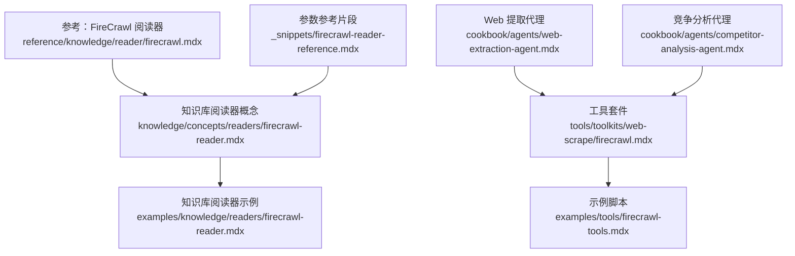
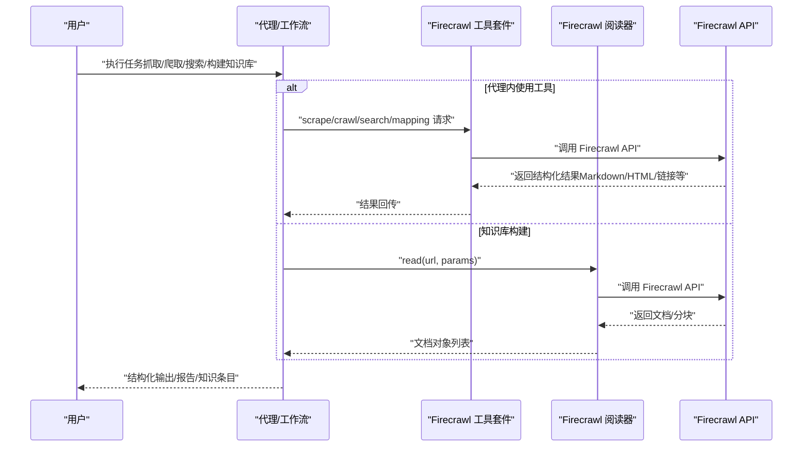
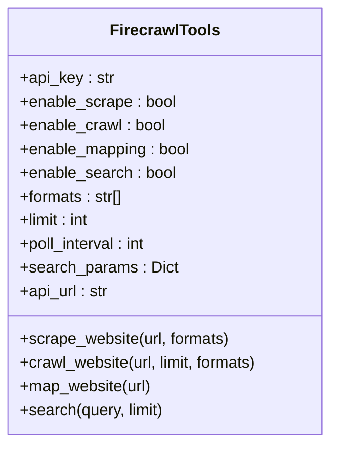
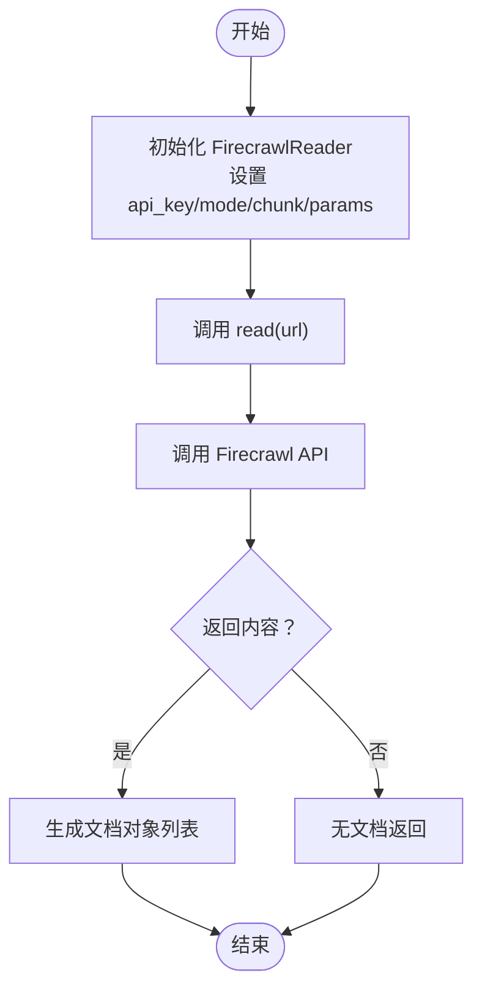
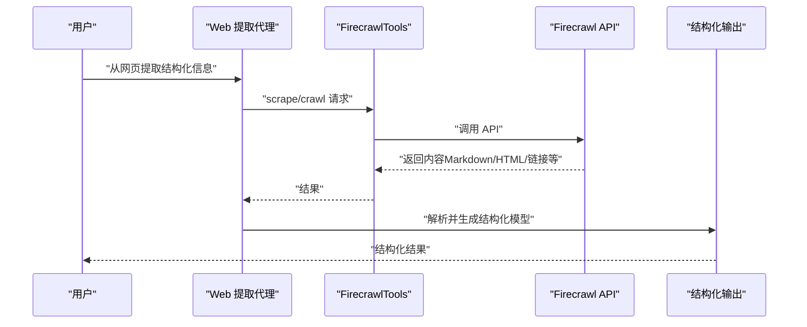
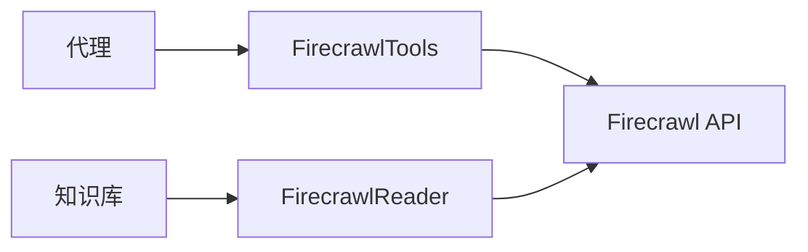

# Firecrawl 网页抓取

<cite>
**本文引用的文件**
- [firecrawl 工具概览](file://tools/toolkits/web-scrape/firecrawl.mdx)
- [Firecrawl 工具示例](file://examples/tools/firecrawl-tools.mdx)
- [知识库阅读器：Firecrawl](file://knowledge/concepts/readers/firecrawl-reader.mdx)
- [知识库阅读器：Firecrawl（示例）](file://examples/knowledge/readers/firecrawl-reader.mdx)
- [参考：FireCrawl 阅读器](file://reference/knowledge/reader/firecrawl.mdx)
- [Web 提取代理](file://cookbook/agents/web-extraction-agent.mdx)
- [竞争分析代理](file://cookbook/agents/competitor-analysis-agent.mdx)
- [Firecrawl 参数参考（片段）](file://_snippets/firecrawl-reader-reference.mdx)
</cite>

## 目录
1. [简介](#简介)
2. [项目结构](#项目结构)
3. [核心组件](#核心组件)
4. [架构总览](#架构总览)
5. [详细组件分析](#详细组件分析)
6. [依赖关系分析](#依赖关系分析)
7. [性能考虑](#性能考虑)
8. [故障排查指南](#故障排查指南)
9. [结论](#结论)
10. [附录](#附录)

## 简介
本技术文档系统性介绍 Firecrawl 在本仓库中的集成与使用方式，重点覆盖以下方面：
- 基于 Firecrawl 的现代化网页抓取能力：单页抓取、站点爬取、站点映射与网络搜索
- AI 驱动的内容提取与结构化数据转换：通过代理与结构化输出模型实现
- 多模态内容处理：以 Markdown、HTML、链接等格式返回，适配大模型消费
- 在代理、团队与工作流中的应用：文档提取、表格识别、多媒体内容处理等场景
- 准确性提升、性能优化与成本控制策略

## 项目结构
围绕 Firecrawl 的文档与示例主要分布在如下位置：
- 工具套件：tools/toolkits/web-scrape/firecrawl.mdx
- 示例：examples/tools/firecrawl-tools.mdx
- 知识库阅读器：knowledge/concepts/readers/firecrawl-reader.mdx、examples/knowledge/readers/firecrawl-reader.mdx、reference/knowledge/reader/firecrawl.mdx
- 代理用法：cookbook/agents/web-extraction-agent.mdx、cookbook/agents/competitor-analysis-agent.mdx
- 参数参考：_snippets/firecrawl-reader-reference.mdx

**图表来源**
- [firecrawl 工具概览](file://tools/toolkits/web-scrape/firecrawl.mdx)
- [Firecrawl 工具示例](file://examples/tools/firecrawl-tools.mdx)
- [知识库阅读器：Firecrawl](file://knowledge/concepts/readers/firecrawl-reader.mdx)
- [知识库阅读器：Firecrawl（示例）](file://examples/knowledge/readers/firecrawl-reader.mdx)
- [参考：FireCrawl 阅读器](file://reference/knowledge/reader/firecrawl.mdx)
- [Web 提取代理](file://cookbook/agents/web-extraction-agent.mdx)
- [竞争分析代理](file://cookbook/agents/competitor-analysis-agent.mdx)
- [Firecrawl 参数参考（片段）](file://_snippets/firecrawl-reader-reference.mdx)

**章节来源**
- [firecrawl 工具概览](file://tools/toolkits/web-scrape/firecrawl.mdx)
- [Firecrawl 工具示例](file://examples/tools/firecrawl-tools.mdx)
- [知识库阅读器：Firecrawl](file://knowledge/concepts/readers/firecrawl-reader.mdx)
- [知识库阅读器：Firecrawl（示例）](file://examples/knowledge/readers/firecrawl-reader.mdx)
- [参考：FireCrawl 阅读器](file://reference/knowledge/reader/firecrawl.mdx)
- [Web 提取代理](file://cookbook/agents/web-extraction-agent.mdx)
- [竞争分析代理](file://cookbook/agents/competitor-analysis-agent.mdx)
- [Firecrawl 参数参考（片段）](file://_snippets/firecrawl-reader-reference.mdx)

## 核心组件
- Firecrawl 工具套件（FirecrawlTools）
  - 功能：支持网站抓取、站点爬取、站点映射、网络搜索；可配置格式（如 markdown、html、links）、限制数量、轮询间隔、搜索参数等
  - 典型用途：在代理中直接执行“抓取/爬取/搜索”，并以结构化或富文本形式返回结果
- Firecrawl 阅读器（FirecrawlReader）
  - 功能：面向知识库构建，将网页内容转化为文档对象，支持分块与参数化配置
  - 典型用途：批量构建知识库、按需抓取与切片
- 代理集成
  - Web 提取代理：结合结构化输出模型，从网页中抽取标题、描述、内容段落、链接、联系方式、元数据等
  - 竞争分析代理：多阶段研究流程，结合搜索、爬取、站点映射与推理工具，生成结构化报告

**章节来源**
- [firecrawl 工具概览](file://tools/toolkits/web-scrape/firecrawl.mdx)
- [知识库阅读器：Firecrawl](file://knowledge/concepts/readers/firecrawl-reader.mdx)
- [Web 提取代理](file://cookbook/agents/web-extraction-agent.mdx)
- [竞争分析代理](file://cookbook/agents/competitor-analysis-agent.mdx)

## 架构总览
下图展示了在代理与知识库场景中，Firecrawl 的典型调用链路与数据流向。

**图表来源**
- [firecrawl 工具概览](file://tools/toolkits/web-scrape/firecrawl.mdx)
- [知识库阅读器：Firecrawl](file://knowledge/concepts/readers/firecrawl-reader.mdx)
- [Web 提取代理](file://cookbook/agents/web-extraction-agent.mdx)
- [竞争分析代理](file://cookbook/agents/competitor-analysis-agent.mdx)

## 详细组件分析

### 组件一：Firecrawl 工具套件（FirecrawlTools）
- 能力边界
  - 单页抓取：抓取指定 URL，支持多种输出格式
  - 站点爬取：按深度/限制抓取站点内页面
  - 站点映射：获取站点结构图谱
  - 网络搜索：基于查询进行搜索并返回结果
- 关键参数
  - 认证：api_key 或环境变量 FIRECRAWL_API_KEY
  - 功能开关：enable_scrape、enable_crawl、enable_mapping、enable_search、all
  - 输出格式：formats（如 markdown、html、links）
  - 限制与轮询：limit、poll_interval
  - 搜索参数：search_params
  - API 地址：api_url
- 使用建议
  - 在代理中启用所需功能，避免不必要的调用
  - 合理设置 limit 与 poll_interval 控制成本与时延
  - 明确 formats 以减少后处理开销

**图表来源**
- [firecrawl 工具概览](file://tools/toolkits/web-scrape/firecrawl.mdx)

**章节来源**
- [firecrawl 工具概览](file://tools/toolkits/web-scrape/firecrawl.mdx)
- [Firecrawl 工具示例](file://examples/tools/firecrawl-tools.mdx)

### 组件二：Firecrawl 阅读器（FirecrawlReader）
- 能力边界
  - 将网页内容转为文档对象，便于后续嵌入与检索
  - 支持分块（chunk），适合大规模知识库构建
  - 支持模式切换（scrape/crawl）与参数透传
- 关键参数
  - api_key：认证
  - mode：scrape 或 crawl
  - chunk：是否分块
  - params：透传给底层 API 的参数（如 formats、limit 等）

**图表来源**
- [知识库阅读器：Firecrawl](file://knowledge/concepts/readers/firecrawl-reader.mdx)
- [Firecrawl 参数参考（片段）](file://_snippets/firecrawl-reader-reference.mdx)

**章节来源**
- [知识库阅读器：Firecrawl](file://knowledge/concepts/readers/firecrawl-reader.mdx)
- [知识库阅读器：Firecrawl（示例）](file://examples/knowledge/readers/firecrawl-reader.mdx)
- [参考：FireCrawl 阅读器](file://reference/knowledge/reader/firecrawl.mdx)
- [Firecrawl 参数参考（片段）](file://_snippets/firecrawl-reader-reference.mdx)

### 组件三：代理中的 Firecrawl 应用
- Web 提取代理
  - 流程：抓取 → 分析 → 提取 → 结构化
  - 输出：结构化模型（标题、描述、内容段落、链接、联系方式、元数据等）
  - 适用：文档提取、知识库构建、自动化文档生成
- 竞争分析代理
  - 流程：发现 → 分析 → 对比 → 综合 → 报告
  - 工具组合：FirecrawlTools + ReasoningTools
  - 输出：结构化报告（SWOT、对比矩阵、建议等）

**图表来源**
- [Web 提取代理](file://cookbook/agents/web-extraction-agent.mdx)
- [firecrawl 工具概览](file://tools/toolkits/web-scrape/firecrawl.mdx)

**章节来源**
- [Web 提取代理](file://cookbook/agents/web-extraction-agent.mdx)
- [竞争分析代理](file://cookbook/agents/competitor-analysis-agent.mdx)

## 依赖关系分析
- 组件耦合
  - 代理层依赖工具层（FirecrawlTools）
  - 知识库层依赖阅读器（FirecrawlReader）
  - 工具层与阅读器均依赖 Firecrawl API
- 外部依赖
  - Firecrawl API（可通过 api_url 自定义）
  - 环境变量 FIRECRAWL_API_KEY
- 可能的循环依赖
  - 文档中未见循环导入或循环依赖迹象

**图表来源**
- [firecrawl 工具概览](file://tools/toolkits/web-scrape/firecrawl.mdx)
- [知识库阅读器：Firecrawl](file://knowledge/concepts/readers/firecrawl-reader.mdx)
- [Web 提取代理](file://cookbook/agents/web-extraction-agent.mdx)
- [竞争分析代理](file://cookbook/agents/competitor-analysis-agent.mdx)

**章节来源**
- [firecrawl 工具概览](file://tools/toolkits/web-scrape/firecrawl.mdx)
- [知识库阅读器：Firecrawl](file://knowledge/concepts/readers/firecrawl-reader.mdx)
- [Web 提取代理](file://cookbook/agents/web-extraction-agent.mdx)
- [竞争分析代理](file://cookbook/agents/competitor-analysis-agent.mdx)

## 性能考虑
- 成本控制
  - 合理设置 limit 与 poll_interval，避免过度请求
  - 仅启用必要的功能开关（enable_scrape/enable_crawl/enable_search）
  - 明确 formats，减少冗余数据传输与后处理
- 准确性提升
  - 使用结构化输出模型约束提取字段，降低歧义
  - 在代理指令中明确优先级与筛选规则
  - 对复杂页面采用分块策略（chunk）并结合映射（mapping）理解结构
- 性能优化
  - 批量知识库构建时优先使用 crawl 并设置合理 limit
  - 利用轮询间隔（poll_interval）平衡实时性与成本
  - 对重复抓取的页面缓存结果或复用中间产物

[本节为通用指导，无需特定文件引用]

## 故障排查指南
- 常见问题
  - API 密钥未配置或无效：检查环境变量 FIRECRAWL_API_KEY 是否正确设置
  - 请求超时或轮询等待过长：适当提高 poll_interval 或降低 limit
  - 返回内容为空：确认 URL 正确、目标站点可访问、formats 设置合理
  - 结果格式不符合预期：核对 formats 与 params 中的输出选项
- 排查步骤
  - 在代理中开启调试输出，观察工具返回结构
  - 使用最小化示例验证单个功能（如仅启用 scrape）
  - 检查网络连通性与防火墙策略
  - 查看知识库阅读器示例中的错误处理逻辑

**章节来源**
- [Firecrawl 工具示例](file://examples/tools/firecrawl-tools.mdx)
- [知识库阅读器：Firecrawl（示例）](file://examples/knowledge/readers/firecrawl-reader.mdx)

## 结论
本仓库提供了 Firecrawl 在代理、知识库与多阶段分析流程中的完整集成路径。通过工具套件与阅读器，开发者可以快速实现高质量的网页抓取、结构化内容提取与知识库构建，并在团队与工作流中规模化应用。配合合理的参数配置与流程设计，可在保证准确性的同时显著优化性能与成本。

[本节为总结，无需特定文件引用]

## 附录
- 快速上手
  - 安装依赖：安装 firecrawl-py 与 agno
  - 设置 API 密钥：导出 FIRECRAWL_API_KEY
  - 运行示例：参考示例脚本与代理示例
- 相关资源
  - 工具参数与函数说明：参见工具概览文档
  - 知识库参数与用法：参见阅读器文档与示例
  - 代理用法：参见 Web 提取代理与竞争分析代理示例

**章节来源**
- [firecrawl 工具概览](file://tools/toolkits/web-scrape/firecrawl.mdx)
- [知识库阅读器：Firecrawl](file://knowledge/concepts/readers/firecrawl-reader.mdx)
- [Web 提取代理](file://cookbook/agents/web-extraction-agent.mdx)
- [竞争分析代理](file://cookbook/agents/competitor-analysis-agent.mdx)