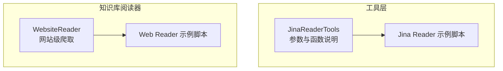
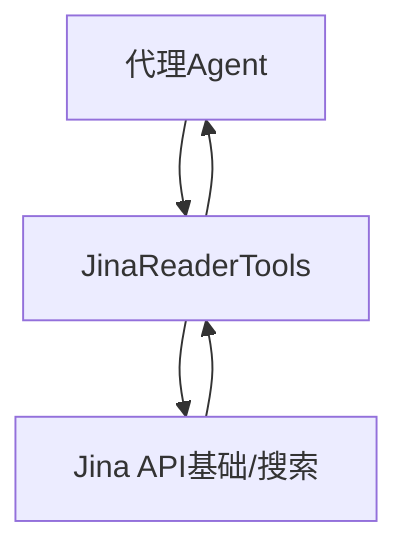
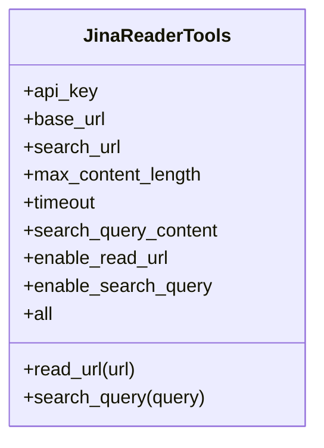
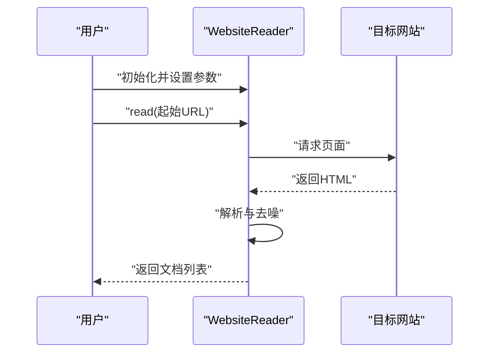
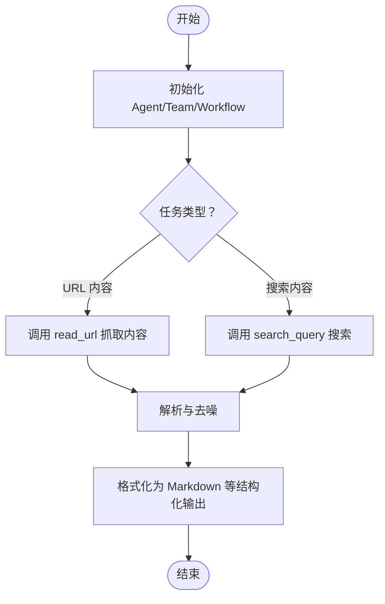
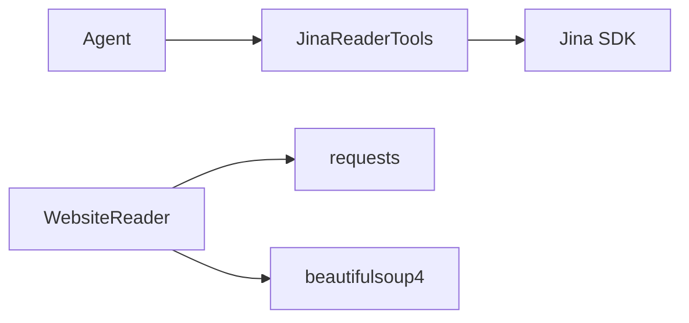

# Jina Reader 网页抓取

<cite>
**本文引用的文件**
- [jina-reader.mdx](file://tools/toolkits/web-scrape/jina-reader.mdx)
- [jinareader-tools.mdx](file://examples/tools/jinareader-tools.mdx)
- [website-reader.mdx](file://reference/knowledge/reader/website.mdx)
- [website-reader.mdx（概念）](file://knowledge/concepts/readers/website-reader.mdx)
- [web-reader.mdx](file://examples/knowledge/readers/web-reader.mdx)
</cite>

## 目录
1. [简介](#简介)
2. [项目结构](#项目结构)
3. [核心组件](#核心组件)
4. [架构总览](#架构总览)
5. [详细组件分析](#详细组件分析)
6. [依赖关系分析](#依赖关系分析)
7. [性能考虑](#性能考虑)
8. [故障排查指南](#故障排查指南)
9. [结论](#结论)
10. [附录](#附录)

## 简介
本技术文档围绕 Jina Reader 网页抓取工具包展开，系统性介绍其在网页内容提取中的能力与使用方式，重点覆盖以下方面：
- 内容解析：URL 文本内容读取、搜索查询结果抓取
- 去噪与格式化：通过参数控制截断长度、超时、返回格式等
- 结构化输出：支持 Markdown 等 LLM 友好格式
- 在代理（Agent）、团队（Team）与工作流（Workflow）中的应用：新闻内容提取、博客文章整理、学术论文解析等场景
- 准确性提升技巧、批量处理优化与内容质量评估方法

Jina Reader 工具通过外部 API 提供网页内容抽取与摘要能力，同时仓库中也提供了网站级爬取器 WebsiteReader，用于整站抓取并构建知识库。

## 项目结构
与 Jina Reader 相关的文档分布在“工具”、“知识库阅读器”和“示例”三个维度：
- 工具层：JinaReaderTools 的参数、函数与使用说明
- 知识库阅读器：WebsiteReader 的概念与示例
- 示例：Jina Reader 的调用示例与运行步骤

**图表来源**
- [jina-reader.mdx:1-51](file://tools/toolkits/web-scrape/jina-reader.mdx#L1-L51)
- [jinareader-tools.mdx:1-38](file://examples/tools/jinareader-tools.mdx#L1-L38)
- [website-reader.mdx（概念）:1-64](file://knowledge/concepts/readers/website-reader.mdx#L1-L64)
- [web-reader.mdx:1-39](file://examples/knowledge/readers/web-reader.mdx#L1-L39)

**章节来源**
- [jina-reader.mdx:1-51](file://tools/toolkits/web-scrape/jina-reader.mdx#L1-L51)
- [website-reader.mdx（概念）:1-64](file://knowledge/concepts/readers/website-reader.mdx#L1-L64)

## 核心组件
- JinaReaderTools
  - 功能：提供 read_url 与 search_query 两类能力，分别用于从指定 URL 抓取内容与执行搜索查询
  - 关键参数：API 密钥、基础 URL、搜索 URL、最大内容长度、请求超时、是否包含搜索结果内容、启用的功能开关等
  - 输出：返回截断后的内容或错误信息；适合直接喂给 LLM 生成摘要、分类等任务
- WebsiteReader
  - 功能：整站爬取，按深度与链接数量限制进行抓取，生成文档集合
  - 适用：构建知识库、批量抓取站点内页面

**章节来源**
- [jina-reader.mdx:27-47](file://tools/toolkits/web-scrape/jina-reader.mdx#L27-L47)
- [website-reader.mdx（概念）:5-29](file://knowledge/concepts/readers/website-reader.mdx#L5-L29)

## 架构总览
Jina Reader 的典型使用路径如下：
- 代理（Agent）通过工具调用 JinaReaderTools
- 工具根据配置访问 Jina API（基础 URL 或搜索 URL）
- 返回结构化文本（如 Markdown），供后续处理或直接消费

**图表来源**
- [jina-reader.mdx:15-25](file://tools/toolkits/web-scrape/jina-reader.mdx#L15-L25)

## 详细组件分析

### 组件一：JinaReaderTools 参数与函数
- 参数要点
  - 认证与服务端点：支持显式传入 API Key 或使用环境变量；可自定义基础 URL 与搜索 URL
  - 内容长度与超时：通过最大内容长度与超时参数控制响应体积与稳定性
  - 功能开关：按需启用 read_url、search_query 或全部功能
- 函数说明
  - read_url：对单个 URL 执行内容读取，返回截断后的文本或错误
  - search_query：基于关键词执行搜索，返回截断后的搜索结果或错误

**图表来源**
- [jina-reader.mdx:27-47](file://tools/toolkits/web-scrape/jina-reader.mdx#L27-L47)

**章节来源**
- [jina-reader.mdx:27-47](file://tools/toolkits/web-scrape/jina-reader.mdx#L27-L47)

### 组件二：WebsiteReader（网站级爬取）
- 能力概述：按深度与链接数限制进行整站爬取，生成文档列表
- 使用流程：实例化 WebsiteReader，设置参数，调用 read 获取文档集合
- 典型用途：构建知识库、批量抓取站点内容

**图表来源**
- [website-reader.mdx（概念）:9-29](file://knowledge/concepts/readers/website-reader.mdx#L9-L29)

**章节来源**
- [website-reader.mdx（概念）:5-29](file://knowledge/concepts/readers/website-reader.mdx#L5-L29)
- [web-reader.mdx:1-26](file://examples/knowledge/readers/web-reader.mdx#L1-L26)

### 组件三：在代理、团队与工作流中的使用
- 代理（Agent）使用 Jina Reader
  - 将 JinaReaderTools 注入 Agent，即可在提示词中直接调用“读取 URL”或“搜索”指令
  - 适合快速摘要、内容净化与结构化输出
- 团队（Team）与工作流（Workflow）
  - 可将“网页抓取”作为工作流中的一个步骤，结合缓存与重试策略，实现批量抓取与统一处理
  - 适用于新闻聚合、博客文章整理、学术论文解析等场景

[此图为概念流程图，不对应具体源码文件，故无图表来源]

## 依赖关系分析
- 外部依赖
  - Jina SDK：用于访问 Jina Reader API
  - requests/beautifulsoup4：WebsiteReader 示例中用于网页请求与解析
- 内部依赖
  - Agent/Team/Workflow：通过工具接口调用 JinaReaderTools
  - 示例脚本：演示如何实例化 Agent 并调用工具

**图表来源**
- [jina-reader.mdx:9-13](file://tools/toolkits/web-scrape/jina-reader.mdx#L9-L13)
- [website-reader.mdx（概念）:36-40](file://knowledge/concepts/readers/website-reader.mdx#L36-L40)

**章节来源**
- [jina-reader.mdx:9-13](file://tools/toolkits/web-scrape/jina-reader.mdx#L9-L13)
- [website-reader.mdx（概念）:36-40](file://knowledge/concepts/readers/website-reader.mdx#L36-L40)

## 性能考虑
- 请求超时与内容长度
  - 合理设置超时时间，避免长时间阻塞
  - 控制最大内容长度，减少下游处理压力
- 批量抓取优化
  - 引入并发与限速策略，避免触发目标站点限流
  - 使用缓存机制，避免重复抓取相同 URL
- 输出格式选择
  - 对于 LLM 输入，优先使用 Markdown 等结构化格式，提高下游处理效率

[本节为通用建议，无需章节来源]

## 故障排查指南
- 认证失败
  - 确认已正确设置 API Key 或环境变量
- 请求超时
  - 调整 timeout 参数；必要时在网络稳定环境下重试
- 内容过长或为空
  - 调整 max_content_length；检查 URL 是否有效
- 网站反爬虫
  - 降低并发、增加延时；必要时使用代理或更换 UA

[本节为通用建议，无需章节来源]

## 结论
Jina Reader 工具包为网页内容提取提供了简洁高效的接口，配合 WebsiteReader 可实现从单页到整站的多种抓取需求。通过合理配置参数、引入缓存与并发控制，并采用结构化输出格式，可在代理、团队与工作流中稳定地完成新闻、博客与学术内容的净化与结构化处理。

[本节为总结性内容，无需章节来源]

## 附录

### A. 快速上手（基于示例）
- 安装依赖与运行示例脚本，验证工具链可用性
- 在 Agent 中注入 JinaReaderTools，编写提示词以触发 read_url 或 search_query

**章节来源**
- [jinareader-tools.mdx:26-37](file://examples/tools/jinareader-tools.mdx#L26-L37)

### B. 参数与函数参考（摘要）
- JinaReaderTools
  - 参数：api_key、base_url、search_url、max_content_length、timeout、search_query_content、enable_read_url、enable_search_query、all
  - 方法：read_url(url)、search_query(query)
- WebsiteReader
  - 示例：设置 max_depth、max_links，调用 read(url) 获取文档列表

**章节来源**
- [jina-reader.mdx:27-47](file://tools/toolkits/web-scrape/jina-reader.mdx#L27-L47)
- [website-reader.mdx（概念）:61-64](file://knowledge/concepts/readers/website-reader.mdx#L61-L64)