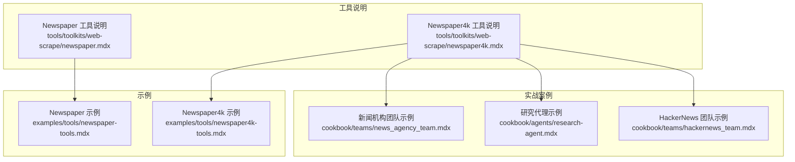
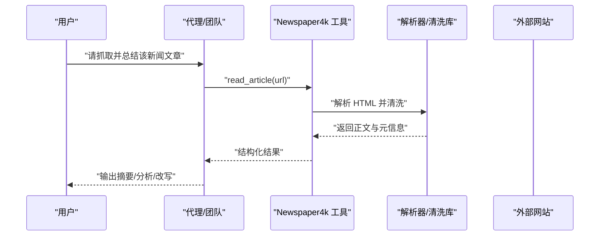
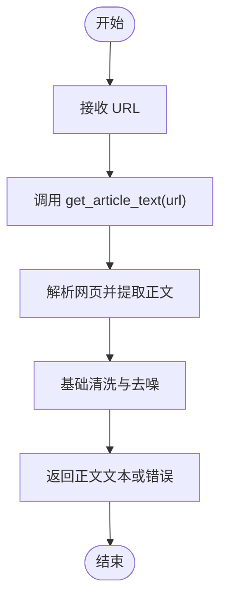
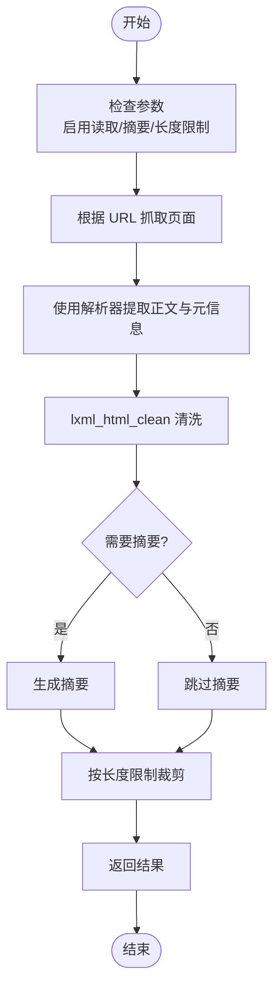
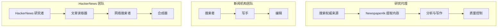
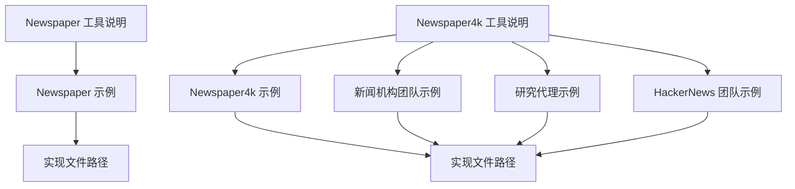

# Newspaper 网页抓取

<cite>
**本文引用的文件**
- [Newspaper 工具说明](file://tools/toolkits/web-scrape/newspaper.mdx)
- [Newspaper4k 工具说明](file://tools/toolkits/web-scrape/newspaper4k.mdx)
- [Newspaper 示例](file://examples/tools/newspaper-tools.mdx)
- [Newspaper4k 示例](file://examples/tools/newspaper4k-tools.mdx)
- [新闻机构团队示例](file://cookbook/teams/news_agency_team.mdx)
- [研究代理示例](file://cookbook/agents/research-agent.mdx)
- [HackerNews 团队示例](file://cookbook/teams/hackernews_team.mdx)
</cite>

## 目录
1. [简介](#简介)
2. [项目结构](#项目结构)
3. [核心组件](#核心组件)
4. [架构概览](#架构概览)
5. [详细组件分析](#详细组件分析)
6. [依赖关系分析](#依赖关系分析)
7. [性能考虑](#性能考虑)
8. [故障排除指南](#故障排除指南)
9. [结论](#结论)
10. [附录](#附录)

## 简介
本技术文档面向使用 Newspaper 网页抓取工具包的开发者与数据工程师，系统性介绍在代理（Agent）、团队（Team）与工作流（Workflow）场景中进行新闻内容抓取与处理的方法。重点覆盖以下能力与实践：
- 新闻文章正文识别：从网页中抽取干净、去广告的正文文本
- 元信息提取：标题、作者、发布时间等关键元数据
- 内容解析与语言处理：基于 Newspaper4k 的现代解析器与 lxml_html_clean 清洗
- 多语言支持与语言检测：通过目标语言参数与清洗库实现跨语言抓取
- 新闻聚合与内容处理：结合 DuckDuckGo 搜索、HackerNews 聚合、全文阅读与结构化输出
- 应用场景：新闻聚合、主题分析、情感分析、事实核查与专业写作
- 准确性优化：精度优先与召回优先策略、内容长度限制、去重与树大小控制
- 批量处理与质量控制：并行抓取、缓存与错误恢复、输出模板与来源标注

## 项目结构
仓库中与 Newspaper 工具相关的内容主要分布在以下位置：
- 工具说明文档：位于工具目录下的 web-scrape 子目录，分别介绍 Newspaper 与 Newspaper4k 的参数、函数与资源链接
- 示例文档：examples 下包含独立工具使用的示例脚本与运行说明
- 团队与代理示例：cookbook 中包含多个实战案例，展示在团队与代理中集成 Newspaper4k 进行新闻聚合与写作

图表来源
- [Newspaper 工具说明:1-42](file://tools/toolkits/web-scrape/newspaper.mdx#L1-L42)
- [Newspaper4k 工具说明:1-45](file://tools/toolkits/web-scrape/newspaper4k.mdx#L1-L45)
- [Newspaper 示例:1-42](file://examples/tools/newspaper-tools.mdx#L1-L42)
- [Newspaper4k 示例:1-42](file://examples/tools/newspaper4k-tools.mdx#L1-L42)
- [新闻机构团队示例:1-103](file://cookbook/teams/news_agency_team.mdx#L1-L103)
- [研究代理示例:1-205](file://cookbook/agents/research-agent.mdx#L1-L205)
- [HackerNews 团队示例:1-134](file://cookbook/teams/hackernews_team.mdx#L1-L134)

章节来源
- [Newspaper 工具说明:1-42](file://tools/toolkits/web-scrape/newspaper.mdx#L1-L42)
- [Newspaper4k 工具说明:1-45](file://tools/toolkits/web-scrape/newspaper4k.mdx#L1-L45)

## 核心组件
- NewspaperTools（旧版）
  - 功能：从指定 URL 获取文章文本
  - 关键参数：启用文章文本获取开关
  - 关键函数：get_article_text(url)
- Newspaper4kTools（新版）
  - 功能：读取文章全文与元数据，支持摘要生成
  - 关键参数：启用读取文章、是否包含摘要、文章最大长度
  - 关键函数：read_article()、get_article_data()

章节来源
- [Newspaper 工具说明:27-37](file://tools/toolkits/web-scrape/newspaper.mdx#L27-L37)
- [Newspaper4k 工具说明:27-40](file://tools/toolkits/web-scrape/newspaper4k.mdx#L27-L40)

## 架构概览
Newspaper 工具在代理/团队中的典型调用链如下：
- 代理或团队通过工具接口发起抓取请求
- 工具内部使用 Newspaper4k 解析器与 lxml_html_clean 清洗库
- 返回结构化的正文文本与元信息（标题、作者、发布时间等）
- 上层模型（如 GPT）对内容进行摘要、分析或改写

图表来源
- [Newspaper4k 工具说明:15-25](file://tools/toolkits/web-scrape/newspaper4k.mdx#L15-L25)
- [研究代理示例:34-46](file://cookbook/agents/research-agent.mdx#L34-L46)
- [新闻机构团队示例:34-53](file://cookbook/teams/news_agency_team.mdx#L34-L53)

## 详细组件分析

### 组件 A：NewspaperTools（文章正文提取）
- 设计要点
  - 专注于从 URL 提取文章正文，适合基础场景
  - 参数简单，易于集成到现有工作流
- 数据流
  - 输入：URL 字符串
  - 处理：调用工具函数获取正文
  - 输出：纯文本正文或错误信息
- 适用场景
  - 快速提取正文用于下游 NLP 或摘要任务
  - 与其他工具组合使用（如搜索引擎）

图表来源
- [Newspaper 工具说明:27-37](file://tools/toolkits/web-scrape/newspaper.mdx#L27-L37)

章节来源
- [Newspaper 工具说明:1-42](file://tools/toolkits/web-scrape/newspaper.mdx#L1-L42)

### 组件 B：Newspaper4kTools（全文与元信息）
- 设计要点
  - 支持读取文章全文与元信息，可选生成摘要
  - 提供参数控制处理范围与质量
- 关键参数
  - 启用读取文章：控制是否执行全文读取
  - 包含摘要：是否同时返回摘要
  - 文章长度：限制处理或返回的最大长度
- 关键函数
  - read_article()：读取完整文章内容
  - get_article_data()：读取全文与元信息
- 适用场景
  - 高质量新闻聚合与写作
  - 研究型工作流中的事实核查与交叉验证
  - 团队协作中的内容读取与上下文增强

图表来源
- [Newspaper4k 工具说明:27-40](file://tools/toolkits/web-scrape/newspaper4k.mdx#L27-L40)

章节来源
- [Newspaper4k 工具说明:1-45](file://tools/toolkits/web-scrape/newspaper4k.mdx#L1-L45)

### 组件 C：实战应用（代理/团队/工作流）
- 研究代理（Research Agent）
  - 流程：搜索权威来源 → 使用 Newspaper4k 提取内容 → 分析与写作 → 质量控制
  - 特点：严格的输出模板、平衡视角、专家引述与来源标注
- 新闻机构团队（News Agency Team）
  - 角色：搜索者（搜索相关 URL）、写手（使用 Newspaper4k 读取并撰写）、编辑（审校）
  - 特点：多人协作、明确指令、高质量输出
- HackerNews 团队（HackerNews Team）
  - 角色：HackerNews 研究者（获取热门故事）、文章读取器（读取全文）、网络搜索者（补充背景）、合成器（结构化输出）
  - 特点：实时数据与网络研究结合、结构化输出模式

图表来源
- [研究代理示例:20-31](file://cookbook/agents/research-agent.mdx#L20-L31)
- [新闻机构团队示例:23-53](file://cookbook/teams/news_agency_team.mdx#L23-L53)
- [HackerNews 团队示例:51-86](file://cookbook/teams/hackernews_team.mdx#L51-L86)

章节来源
- [研究代理示例:1-205](file://cookbook/agents/research-agent.mdx#L1-L205)
- [新闻机构团队示例:1-103](file://cookbook/teams/news_agency_team.mdx#L1-L103)
- [HackerNews 团队示例:1-134](file://cookbook/teams/hackernews_team.mdx#L1-L134)

## 依赖关系分析
- 外部依赖
  - newspaper3k：旧版 Newspaper 工具的基础库
  - newspaper4k 与 lxml_html_clean：新版 Newspaper4k 的核心解析与清洗库
- 内部依赖
  - 工具说明文档与示例文档相互映射，示例文档指向具体实现文件路径
  - 实战案例依赖工具与搜索工具（如 DuckDuckGo）协同工作

图表来源
- [Newspaper 工具说明:39-41](file://tools/toolkits/web-scrape/newspaper.mdx#L39-L41)
- [Newspaper4k 工具说明:42-44](file://tools/toolkits/web-scrape/newspaper4k.mdx#L42-L44)
- [Newspaper 示例:1-42](file://examples/tools/newspaper-tools.mdx#L1-L42)
- [Newspaper4k 示例:1-42](file://examples/tools/newspaper4k-tools.mdx#L1-L42)

章节来源
- [Newspaper 工具说明:1-42](file://tools/toolkits/web-scrape/newspaper.mdx#L1-L42)
- [Newspaper4k 工具说明:1-45](file://tools/toolkits/web-scrape/newspaper4k.mdx#L1-L45)

## 性能考虑
- 解析与清洗成本
  - 使用 lxml_html_clean 可显著提升清洗效率与稳定性
  - 控制文章长度上限可减少内存占用与处理时间
- 批量处理策略
  - 并行抓取多个 URL，结合错误重试与超时控制
  - 对重复 URL 去重，避免重复解析
- 缓存与复用
  - 对已解析的文章内容进行缓存，降低重复抓取开销
- 资源限制
  - 设置最大树大小与内存阈值，防止异常页面导致资源耗尽

## 故障排除指南
- 常见问题
  - 网页结构复杂：优先使用 Newspaper4k 的清洗库；必要时调整解析参数
  - 语言不匹配：通过目标语言参数与清洗库配合，确保正确识别与清洗
  - 依赖缺失：安装 newspaper3k 或 newspaper4k 与 lxml_html_clean
- 排查步骤
  - 检查 URL 是否可访问与返回状态码
  - 查看工具返回的错误信息，定位解析失败原因
  - 调整文章长度限制与清洗策略，观察效果变化
- 建议
  - 在团队与代理中加入“质量控制”步骤，对输出进行人工复核与修正
  - 使用结构化输出模板，便于后续分析与溯源

## 结论
Newspaper 工具包为新闻内容抓取提供了从基础正文提取到全文与元信息读取的完整能力。通过与搜索工具、模型与团队协作的结合，可在新闻聚合、主题分析、情感分析与专业写作等场景中高效落地。建议在生产环境中采用精度优先与召回优先相结合的策略，并辅以缓存、去重与质量控制机制，以获得更稳定与高质量的结果。

## 附录
- 安装与运行
  - Newspaper：安装 newspaper3k 后即可使用
  - Newspaper4k：安装 newspaper4k 与 lxml_html_clean 后即可使用
- 示例运行
  - 参考示例文档中的运行步骤，设置环境变量后直接运行对应脚本
- 进一步阅读
  - 实战案例展示了在代理与团队中集成 Newspaper4k 的多种方式，可作为最佳实践参考