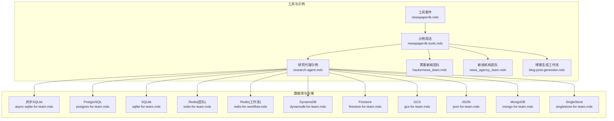
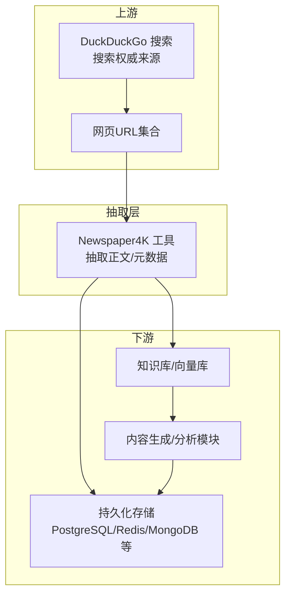
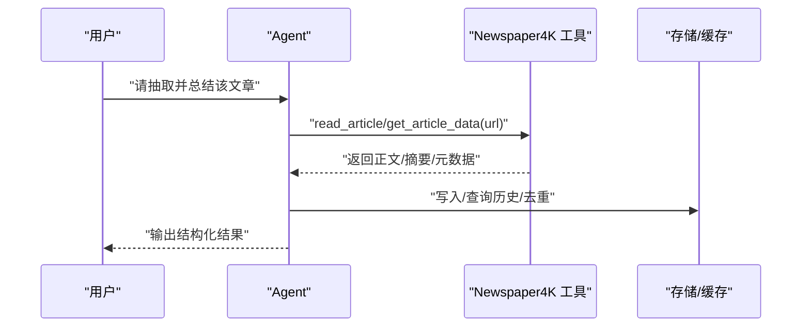
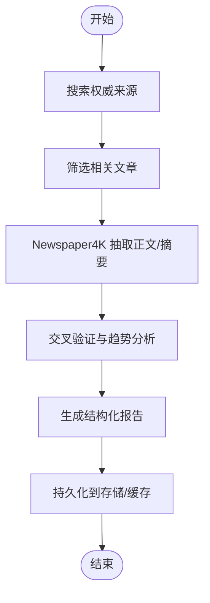
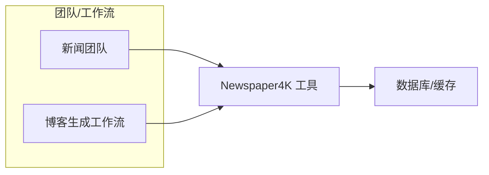
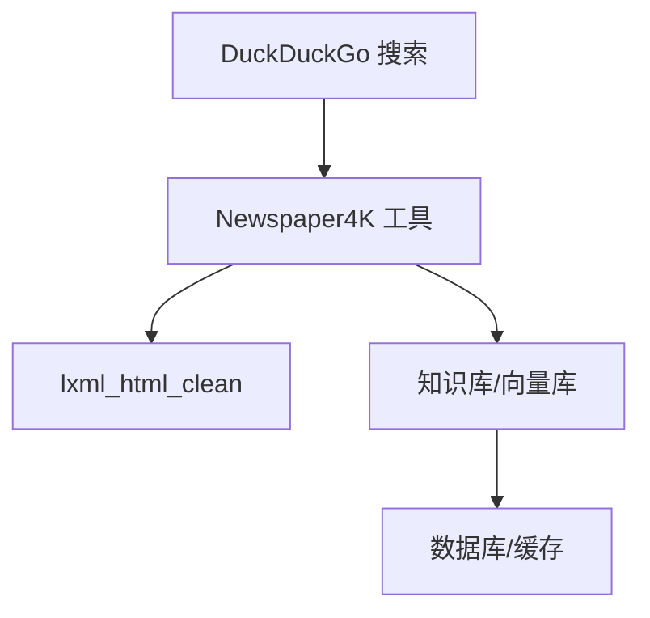

# Newspaper4K 网页抓取

<cite>
**本文引用的文件**
- [newspaper4k.mdx](file://tools/toolkits/web-scrape/newspaper4k.mdx)
- [newspaper4k-tools.mdx](file://examples/tools/newspaper4k-tools.mdx)
- [research-agent.mdx](file://cookbook/agents/research-agent.mdx)
- [hackernews_team.mdx](file://cookbook/teams/hackernews_team.mdx)
- [news_agency_team.mdx](file://cookbook/teams/news_agency_team.mdx)
- [blog-post-generator.mdx](file://cookbook/workflows/blog-post-generator.mdx)
- [built-in.mdx](file://cookbook/tools/built-in.mdx)
- [async-sqlite-for-team.mdx](file://database/providers/async-sqlite/usage/async-sqlite-for-team.mdx)
- [postgres-for-team.mdx](file://database/providers/postgres/usage/postgres-for-team.mdx)
- [sqlite-for-team.mdx](file://database/providers/sqlite/usage/sqlite-for-team.mdx)
- [redis-for-team.mdx](file://database/providers/redis/usage/redis-for-team.mdx)
- [redis-for-workflow.mdx](file://database/providers/redis/usage/redis-for-workflow.mdx)
- [dynamodb-for-team.mdx](file://database/providers/dynamodb/usage/dynamodb-for-team.mdx)
- [firestore-for-team.mdx](file://database/providers/firestore/usage/firestore-for-team.mdx)
- [gcs-for-team.mdx](file://database/providers/gcs/usage/gcs-for-team.mdx)
- [json-for-team.mdx](file://database/providers/json/usage/json-for-team.mdx)
- [mongo-for-team.mdx](file://database/providers/mongo/usage/mongodb-for-team.mdx)
- [singlestore-for-team.mdx](file://database/providers/singlestore/usage/singlestore-for-team.mdx)
</cite>

## 目录
1. [简介](#简介)
2. [项目结构](#项目结构)
3. [核心组件](#核心组件)
4. [架构总览](#架构总览)
5. [详细组件分析](#详细组件分析)
6. [依赖关系分析](#依赖关系分析)
7. [性能考虑](#性能考虑)
8. [故障排查指南](#故障排查指南)
9. [结论](#结论)
10. [附录](#附录)

## 简介
本技术文档围绕 Newspaper4K 网页抓取工具包展开，系统化介绍其在新闻文章提取方面的高性能能力与可扩展特性。基于仓库中的示例与工具文档，本文将从架构设计、数据流、并发与实时处理、性能优化与资源管理、以及在代理（Agent）、团队（Team）与工作流（Workflow）中的规模化应用角度进行深入解析，并给出大规模部署的最佳实践建议。

## 项目结构
仓库以文档为主，Newspaper4K 的使用与集成主要体现在以下几类文档中：
- 工具套件参考：提供参数、函数与安装前置条件
- 示例与用法：展示在研究代理、新闻团队、博客生成工作流等场景中的组合使用
- 数据库存储参考：提供多种存储方案与依赖安装指引，支撑大规模内容持久化与检索

图表来源
- [newspaper4k.mdx:1-45](file://tools/toolkits/web-scrape/newspaper4k.mdx#L1-L45)
- [newspaper4k-tools.mdx:1-42](file://examples/tools/newspaper4k-tools.mdx#L1-L42)
- [research-agent.mdx:1-200](file://cookbook/agents/research-agent.mdx#L1-L200)
- [hackernews_team.mdx:1-120](file://cookbook/teams/hackernews_team.mdx#L1-L120)
- [news_agency_team.mdx:1-120](file://cookbook/teams/news_agency_team.mdx#L1-L120)
- [blog-post-generator.mdx:1-600](file://cookbook/workflows/blog-post-generator.mdx#L1-L600)
- [async-sqlite-for-team.mdx:1-30](file://database/providers/async-sqlite/usage/async-sqlite-for-team.mdx#L1-L30)
- [postgres-for-team.mdx:1-60](file://database/providers/postgres/usage/postgres-for-team.mdx#L1-L60)
- [sqlite-for-team.mdx:1-30](file://database/providers/sqlite/usage/sqlite-for-team.mdx#L1-L30)
- [redis-for-team.mdx:1-40](file://database/providers/redis/usage/redis-for-team.mdx#L1-L40)
- [redis-for-workflow.mdx:1-40](file://database/providers/redis/usage/redis-for-workflow.mdx#L1-L40)
- [dynamodb-for-team.mdx:1-30](file://database/providers/dynamodb/usage/dynamodb-for-team.mdx#L1-L30)
- [firestore-for-team.mdx:1-30](file://database/providers/firestore/usage/firestore-for-team.mdx#L1-L30)
- [gcs-for-team.mdx:1-30](file://database/providers/gcs/usage/gcs-for-team.mdx#L1-L30)
- [json-for-team.mdx:1-30](file://database/providers/json/usage/json-for-team.mdx#L1-L30)
- [mongo-for-team.mdx:1-40](file://database/providers/mongo/usage/mongodb-for-team.mdx#L1-L40)
- [singlestore-for-team.mdx:1-30](file://database/providers/singlestore/usage/singlestore-for-team.mdx#L1-L30)

章节来源
- [newspaper4k.mdx:1-45](file://tools/toolkits/web-scrape/newspaper4k.mdx#L1-L45)
- [newspaper4k-tools.mdx:1-42](file://examples/tools/newspaper4k-tools.mdx#L1-L42)

## 核心组件
- 工具套件参数与函数
  - 参数：启用全文阅读、是否包含摘要、文章长度限制
  - 函数：读取文章全文、获取文章数据
- 示例与用法
  - 在研究代理中结合搜索引擎与 Newspaper4K 实现“搜索-抽取-分析-写作”的完整流程
  - 在新闻团队与博客生成工作流中作为内容抽取的核心步骤
- 存储与依赖
  - 提供多种数据库与缓存的依赖安装指引，便于大规模内容持久化与检索

章节来源
- [newspaper4k.mdx:27-44](file://tools/toolkits/web-scrape/newspaper4k.mdx#L27-L44)
- [built-in.mdx:90-110](file://cookbook/tools/built-in.mdx#L90-L110)

## 架构总览
Newspaper4K 在整体系统中的定位是“高精度文章内容抽取层”，通常与搜索工具、知识库、向量化存储、缓存系统协同工作，形成“搜索-抽取-索引-检索-生成”的闭环。

图表来源
- [research-agent.mdx:20-30](file://cookbook/agents/research-agent.mdx#L20-L30)
- [newspaper4k.mdx:15-25](file://tools/toolkits/web-scrape/newspaper4k.mdx#L15-L25)

## 详细组件分析

### 组件A：Newspaper4K 工具套件
- 功能职责
  - 从新闻网站抽取干净、无广告的正文内容
  - 支持摘要抽取与全文抽取两种模式
  - 可配置最大长度，控制输出规模
- 关键参数
  - 启用全文阅读、包含摘要、文章长度限制
- 典型调用序列
  - Agent 初始化工具
  - 接收用户请求（URL或主题）
  - 调用工具函数抽取内容
  - 将结果传递给后续分析/生成模块

图表来源
- [newspaper4k.mdx:27-44](file://tools/toolkits/web-scrape/newspaper4k.mdx#L27-L44)
- [newspaper4k-tools.mdx:18-26](file://examples/tools/newspaper4k-tools.mdx#L18-L26)

章节来源
- [newspaper4k.mdx:1-45](file://tools/toolkits/web-scrape/newspaper4k.mdx#L1-L45)
- [newspaper4k-tools.mdx:1-42](file://examples/tools/newspaper4k-tools.mdx#L1-L42)

### 组件B：在研究代理中的应用
- 流程要点
  - 搜索阶段：使用 DuckDuckGo 获取权威来源列表
  - 抽取阶段：使用 Newspaper4K 对相关文章进行高精度抽取
  - 分析阶段：交叉验证事实、识别趋势
  - 写作阶段：按 NYT 风格生成结构化报告
- 并发与实时
  - 可通过并行调度多个 URL 的抽取任务
  - 结合缓存与去重策略，避免重复抓取

图表来源
- [research-agent.mdx:20-30](file://cookbook/agents/research-agent.mdx#L20-L30)

章节来源
- [research-agent.mdx:1-200](file://cookbook/agents/research-agent.mdx#L1-L200)

### 组件C：在新闻团队与工作流中的规模化应用
- 新闻团队
  - 将 Newspaper4K 作为团队成员工具之一，配合搜索与分类模块，实现新闻采集与初步处理
- 博客生成工作流
  - 将抽取的内容注入到博客生成链路，结合模板与样式规则输出成品
- 存储与依赖
  - 多种数据库与缓存方案的安装指引，支持不同规模的数据持久化需求

图表来源
- [hackernews_team.mdx:1-120](file://cookbook/teams/hackernews_team.mdx#L1-L120)
- [news_agency_team.mdx:1-120](file://cookbook/teams/news_agency_team.mdx#L1-L120)
- [blog-post-generator.mdx:1-600](file://cookbook/workflows/blog-post-generator.mdx#L1-L600)

章节来源
- [hackernews_team.mdx:1-120](file://cookbook/teams/hackernews_team.mdx#L1-L120)
- [news_agency_team.mdx:1-120](file://cookbook/teams/news_agency_team.mdx#L1-L120)
- [blog-post-generator.mdx:1-600](file://cookbook/workflows/blog-post-generator.mdx#L1-L600)

## 依赖关系分析
- 工具依赖
  - Newspaper4K 与 lxml_html_clean 为必备依赖
- 数据库与缓存
  - 提供 PostgreSQL、SQLite、Redis、DynamoDB、Firestore、GCS、JSON、MongoDB、SingleStore 等多方案安装指引
- 集成点
  - 与搜索引擎（如 DuckDuckGo）组合，形成“搜索-抽取-存储-生成”的流水线

图表来源
- [newspaper4k.mdx:7-13](file://tools/toolkits/web-scrape/newspaper4k.mdx#L7-L13)
- [built-in.mdx:90-110](file://cookbook/tools/built-in.mdx#L90-L110)

章节来源
- [newspaper4k.mdx:1-45](file://tools/toolkits/web-scrape/newspaper4k.mdx#L1-L45)
- [built-in.mdx:90-110](file://cookbook/tools/built-in.mdx#L90-L110)

## 性能考虑
- 抽取性能
  - 合理设置文章长度上限，避免超长页面带来的内存与时间开销
  - 使用摘要模式时，优先获取标题、作者、日期等元数据，减少正文解析成本
- 并发与批处理
  - 对多个 URL 并行执行抽取，结合队列与限速策略，避免对目标站点造成压力
  - 使用缓存与去重机制，降低重复抓取概率
- 存储与检索
  - 选择合适的存储方案（如 Redis 缓存热点、PostgreSQL/单表存储结构化数据），平衡读写性能与一致性
  - 对抽取结果进行分片与索引，提升检索效率
- 资源管理
  - 控制并发度与内存占用，避免在大规模抓取时出现 OOM
  - 定期清理过期内容与缓存，保持系统健康运行

## 故障排查指南
- 常见问题
  - 依赖缺失：确保已安装 Newspaper4K 与 lxml_html_clean
  - 权限与网络：检查代理、防火墙与网络连通性
  - 目标站点反爬：调整请求头、延时与并发度
  - 存储连接：核对数据库/缓存的连接参数与权限
- 定位方法
  - 开启调试模式，观察工具调用链路
  - 记录失败 URL 与错误码，进行针对性修复
  - 对比缓存命中率与去重效果，评估重复抓取问题
- 参考安装指引
  - 团队与工作流场景下的依赖安装命令可作为排障对照

章节来源
- [newspaper4k.mdx:7-13](file://tools/toolkits/web-scrape/newspaper4k.mdx#L7-L13)
- [async-sqlite-for-team.mdx:1-30](file://database/providers/async-sqlite/usage/async-sqlite-for-team.mdx#L1-L30)
- [postgres-for-team.mdx:1-60](file://database/providers/postgres/usage/postgres-for-team.mdx#L1-L60)
- [sqlite-for-team.mdx:1-30](file://database/providers/sqlite/usage/sqlite-for-team.mdx#L1-L30)
- [redis-for-team.mdx:1-40](file://database/providers/redis/usage/redis-for-team.mdx#L1-L40)
- [redis-for-workflow.mdx:1-40](file://database/providers/redis/usage/redis-for-workflow.mdx#L1-L40)
- [dynamodb-for-team.mdx:1-30](file://database/providers/dynamodb/usage/dynamodb-for-team.mdx#L1-L30)
- [firestore-for-team.mdx:1-30](file://database/providers/firestore/usage/firestore-for-team.mdx#L1-L30)
- [gcs-for-team.mdx:1-30](file://database/providers/gcs/usage/gcs-for-team.mdx#L1-L30)
- [json-for-team.mdx:1-30](file://database/providers/json/usage/json-for-team.mdx#L1-L30)
- [mongo-for-team.mdx:1-40](file://database/providers/mongo/usage/mongodb-for-team.mdx#L1-L40)
- [singlestore-for-team.mdx:1-30](file://database/providers/singlestore/usage/singlestore-for-team.mdx#L1-L30)

## 结论
Newspaper4K 作为高精度新闻文章抽取工具，在研究代理、新闻团队与工作流中扮演了“内容抽取中枢”的角色。通过与搜索引擎、知识库、向量化存储及多种数据库/缓存的协同，能够实现从“搜索-抽取-索引-检索-生成”的完整链路。在规模化部署中，应重点关注依赖管理、并发控制、缓存与去重策略、以及存储方案的选择与优化，从而在保证质量的同时实现高性能与可扩展性。

## 附录
- 快速上手
  - 安装依赖：Newspaper4K 与 lxml_html_clean
  - 创建 Agent 并添加 Newspaper4K 工具
  - 输入目标 URL 或主题，触发抽取与后续处理
- 扩展建议
  - 引入代理池与随机 UA，降低被封禁风险
  - 增加重试与熔断机制，提升鲁棒性
  - 对抽取结果进行二次清洗与结构化标注，增强检索与分析效果