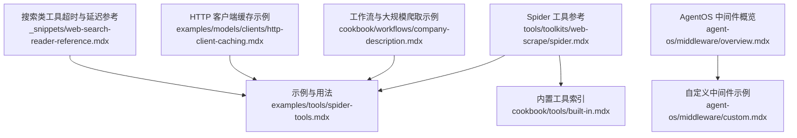
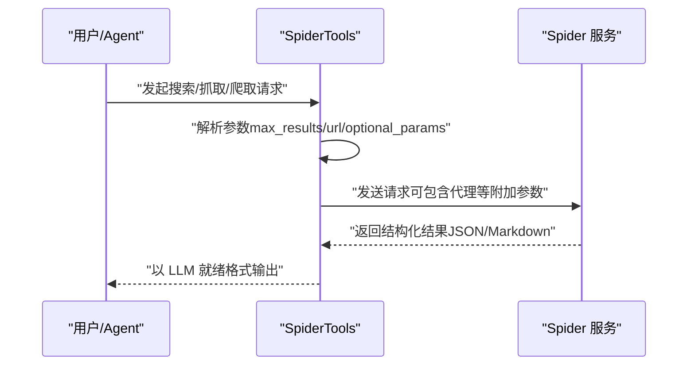
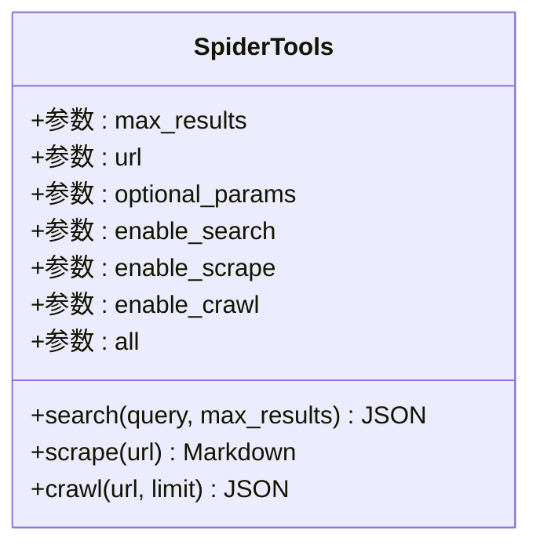
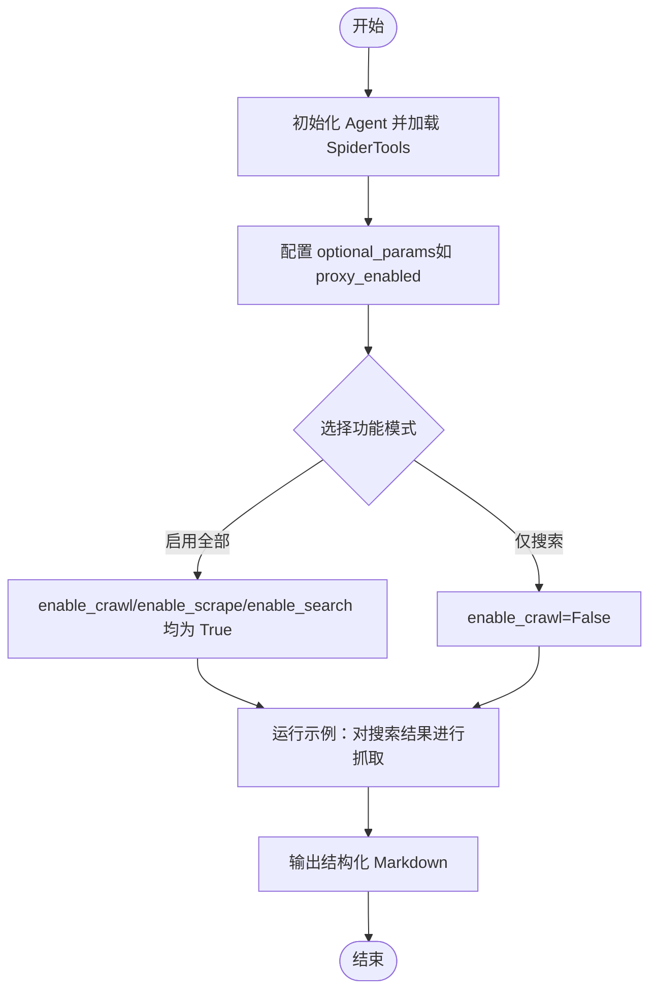
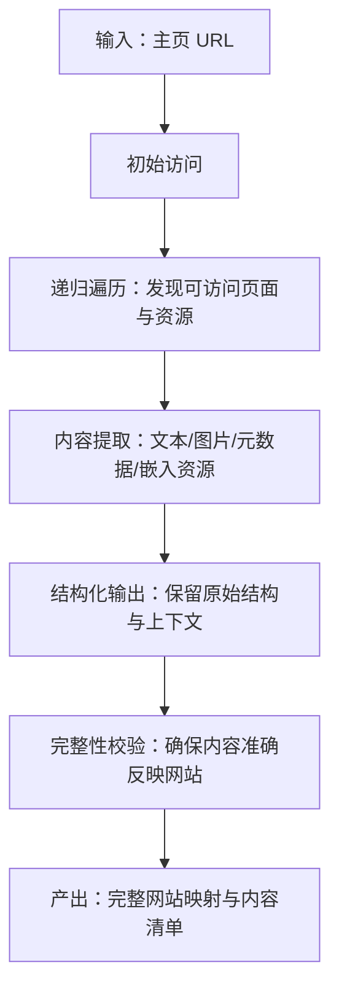
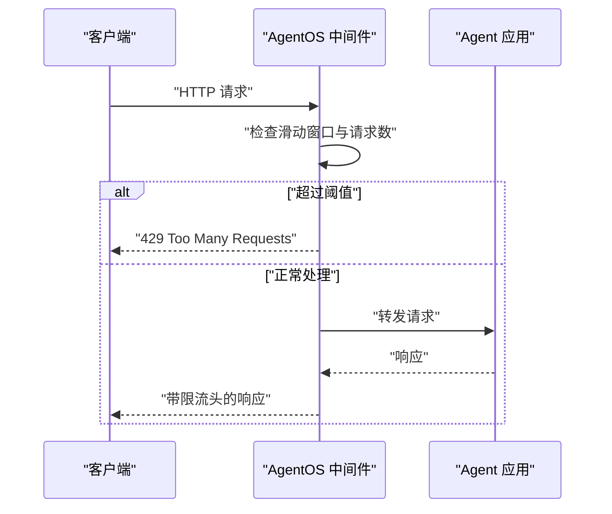
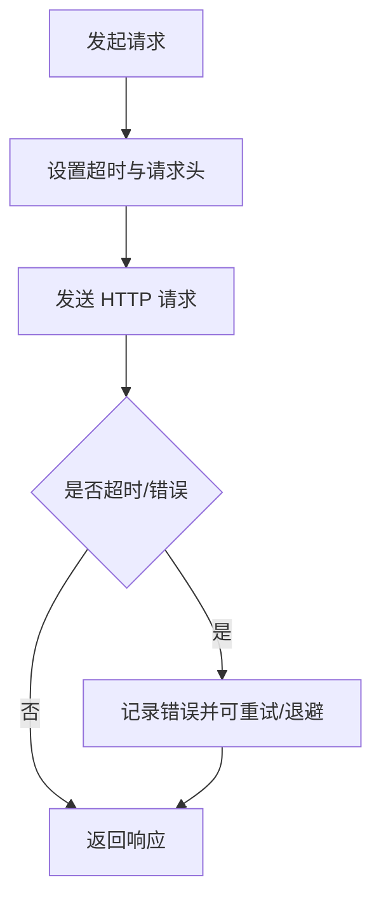
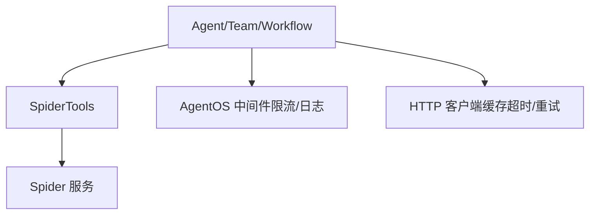

# Spider 网页抓取

<cite>
**本文引用的文件**
- [spider.mdx](file://tools/toolkits/web-scrape/spider.mdx)
- [spider-tools.mdx](file://examples/tools/spider-tools.mdx)
- [built-in.mdx](file://cookbook/tools/built-in.mdx)
- [company-description.mdx](file://cookbook/workflows/company-description.mdx)
- [custom.mdx](file://agent-os/middleware/custom.mdx)
- [overview.mdx](file://agent-os/middleware/overview.mdx)
- [http-client-caching.mdx](file://examples/models/clients/http-client-caching.mdx)
- [web-search-reader-reference.mdx](file://_snippets/web-search-reader-reference.mdx)
</cite>

## 目录
1. [简介](#简介)
2. [项目结构](#项目结构)
3. [核心组件](#核心组件)
4. [架构总览](#架构总览)
5. [详细组件分析](#详细组件分析)
6. [依赖关系分析](#依赖关系分析)
7. [性能考量](#性能考量)
8. [故障排查指南](#故障排查指南)
9. [结论](#结论)
10. [附录](#附录)

## 简介
本技术文档围绕 Spider 网页抓取工具包展开，系统性介绍其在网页搜索、页面抓取与网站深度遍历（爬取）方面的能力，并结合仓库中的示例与参考文档，给出配置选项、规则设置、访问频率控制、代理支持、团队协作与工作流集成、大规模部署与反爬虫应对策略，以及效率优化建议。读者可据此在代理、团队与工作流场景中，完成网站映射生成、内容发现与链接质量评估等任务。

## 项目结构
与 Spider 相关的内容主要分布在以下位置：
- 工具套件参考：tools/toolkits/web-scrape/spider.mdx
- 示例与用法：examples/tools/spider-tools.mdx
- 内置工具索引：cookbook/tools/built-in.mdx
- 大规模爬取提示与工作流示例：cookbook/workflows/company-description.mdx
- 访问频率控制与中间件实践：agent-os/middleware/overview.mdx、agent-os/middleware/custom.mdx
- HTTP 客户端缓存与超时配置示例：examples/models/clients/http-client-caching.mdx
- 搜索类工具的超时与延迟配置参考：_snippets/web-search-reader-reference.mdx

图表来源
- [spider.mdx:1-50](file://tools/toolkits/web-scrape/spider.mdx#L1-L50)
- [spider-tools.mdx:1-65](file://examples/tools/spider-tools.mdx#L1-L65)
- [built-in.mdx:100-100](file://cookbook/tools/built-in.mdx#L100-L100)
- [company-description.mdx:107-116](file://cookbook/workflows/company-description.mdx#L107-L116)
- [overview.mdx:11-11](file://agent-os/middleware/overview.mdx#L11-L11)
- [custom.mdx:11-13](file://agent-os/middleware/custom.mdx#L11-L13)
- [http-client-caching.mdx:124-165](file://examples/models/clients/http-client-caching.mdx#L124-L165)
- [web-search-reader-reference.mdx:2-10](file://_snippets/web-search-reader-reference.mdx#L2-L10)

章节来源
- [spider.mdx:1-50](file://tools/toolkits/web-scrape/spider.mdx#L1-L50)
- [spider-tools.mdx:1-65](file://examples/tools/spider-tools.mdx#L1-L65)
- [built-in.mdx:100-100](file://cookbook/tools/built-in.mdx#L100-L100)
- [company-description.mdx:107-116](file://cookbook/workflows/company-description.mdx#L107-L116)
- [overview.mdx:11-11](file://agent-os/middleware/overview.mdx#L11-L11)
- [custom.mdx:11-13](file://agent-os/middleware/custom.mdx#L11-L13)
- [http-client-caching.mdx:124-165](file://examples/models/clients/http-client-caching.mdx#L124-L165)
- [web-search-reader-reference.mdx:2-10](file://_snippets/web-search-reader-reference.mdx#L2-L10)

## 核心组件
- Spider 工具集（SpiderTools）
  - 功能：提供搜索、抓取、爬取三大能力，返回面向大模型的结构化 Markdown 数据。
  - 关键参数：
    - max_results：默认最大结果数
    - url：默认操作 URL
    - optional_params：附加参数（如代理启用等）
    - enable_search：是否启用搜索
    - enable_scrape：是否启用抓取
    - enable_crawl：是否启用爬取
    - all：是否启用全部工具（优先级高于单个开关）
  - 关键函数：
    - search(query, max_results=5)：返回 JSON 结果
    - scrape(url)：返回页面 Markdown
    - crawl(url, limit=10)：返回爬取结果 JSON

- 示例与用法
  - 支持通过 optional_params 传入 proxy_enabled 等参数
  - 可按需仅启用搜索，禁用抓取与爬取

- 工具集成与索引
  - Spider 被收录为内置工具之一，便于在 Agent/Team/Workflow 中直接调用

章节来源
- [spider.mdx:27-46](file://tools/toolkits/web-scrape/spider.mdx#L27-L46)
- [spider-tools.mdx:23-37](file://examples/tools/spider-tools.mdx#L23-L37)
- [built-in.mdx:100-100](file://cookbook/tools/built-in.mdx#L100-L100)

## 架构总览
下图展示了从 Agent 发起请求到 Spider 工具执行，再到返回结构化数据的整体流程。该流程体现了“搜索-抓取-爬取”的三层能力，以及可选的代理参数注入。

图表来源
- [spider.mdx:27-46](file://tools/toolkits/web-scrape/spider.mdx#L27-L46)
- [spider-tools.mdx:23-37](file://examples/tools/spider-tools.mdx#L23-L37)

## 详细组件分析

### 组件一：Spider 工具参数与函数
- 参数表
  - max_results：限制搜索结果数量
  - url：默认目标 URL
  - optional_params：附加参数字典（如 proxy_enabled）
  - enable_search/enable_scrape/enable_crawl：功能开关
  - all：一键启用全部功能

- 函数行为
  - search：执行 Web 搜索，返回 JSON
  - scrape：抓取指定 URL 页面，返回 Markdown
  - crawl：从给定 URL 开始爬取，限制最大页数，返回 JSON

图表来源
- [spider.mdx:27-46](file://tools/toolkits/web-scrape/spider.mdx#L27-L46)

章节来源
- [spider.mdx:27-46](file://tools/toolkits/web-scrape/spider.mdx#L27-L46)

### 组件二：示例与代理配置
- 示例要点
  - 使用 optional_params 注入 proxy_enabled 实现代理启用
  - 可通过 enable_crawl=False 仅保留搜索能力
  - 默认示例启用所有功能，返回 LLM 就绪的 Markdown

图表来源
- [spider-tools.mdx:23-37](file://examples/tools/spider-tools.mdx#L23-L37)
- [spider-tools.mdx:46-50](file://examples/tools/spider-tools.mdx#L46-L50)

章节来源
- [spider-tools.mdx:23-37](file://examples/tools/spider-tools.mdx#L23-L37)
- [spider-tools.mdx:46-50](file://examples/tools/spider-tools.mdx#L46-L50)

### 组件三：大规模网站爬取与工作流
- 工作流思路
  - 以“从主页开始，递归遍历网站，提取内容并保持原结构”为核心指导
  - 适用于生成网站映射、内容发现与链接质量评估等场景

图表来源
- [company-description.mdx:107-116](file://cookbook/workflows/company-description.mdx#L107-L116)

章节来源
- [company-description.mdx:107-116](file://cookbook/workflows/company-description.mdx#L107-L116)

### 组件四：访问频率控制与中间件
- AgentOS 中间件
  - 提供速率限制与请求日志记录等能力，可作为外部防护层
  - 支持滑动窗口计数、每 IP 限流、响应头透传等特性

图表来源
- [overview.mdx:11-11](file://agent-os/middleware/overview.mdx#L11-L11)
- [custom.mdx:40-67](file://agent-os/middleware/custom.mdx#L40-L67)

章节来源
- [overview.mdx:11-11](file://agent-os/middleware/overview.mdx#L11-L11)
- [custom.mdx:40-67](file://agent-os/middleware/custom.mdx#L40-L67)

### 组件五：HTTP 客户端与超时/重试策略
- HTTP 客户端缓存与请求追踪
  - 通过自定义传输层注入请求标识、服务名与序号
  - 记录请求/响应状态，便于问题定位与性能分析

- 搜索类工具的超时与延迟
  - search_timeout/request_timeout：搜索与 HTTP 请求超时
  - delay_between_requests：请求间隔
  - search_delay/rate_limit_delay：搜索间隔与被限流时的等待

图表来源
- [http-client-caching.mdx:124-165](file://examples/models/clients/http-client-caching.mdx#L124-L165)
- [web-search-reader-reference.mdx:2-10](file://_snippets/web-search-reader-reference.mdx#L2-L10)

章节来源
- [http-client-caching.mdx:124-165](file://examples/models/clients/http-client-caching.mdx#L124-L165)
- [web-search-reader-reference.mdx:2-10](file://_snippets/web-search-reader-reference.mdx#L2-L10)

## 依赖关系分析
- 组件耦合
  - SpiderTools 依赖外部 Spider 服务（通过 optional_params 注入代理等参数）
  - Agent/Team/Workflow 通过工具接口调用 SpiderTools
  - AgentOS 中间件与 HTTP 客户端缓存为外部辅助能力，用于限流与可观测性

图表来源
- [spider.mdx:27-46](file://tools/toolkits/web-scrape/spider.mdx#L27-L46)
- [spider-tools.mdx:23-37](file://examples/tools/spider-tools.mdx#L23-L37)
- [overview.mdx:11-11](file://agent-os/middleware/overview.mdx#L11-L11)
- [http-client-caching.mdx:124-165](file://examples/models/clients/http-client-caching.mdx#L124-L165)

章节来源
- [spider.mdx:27-46](file://tools/toolkits/web-scrape/spider.mdx#L27-L46)
- [spider-tools.mdx:23-37](file://examples/tools/spider-tools.mdx#L23-L37)
- [overview.mdx:11-11](file://agent-os/middleware/overview.mdx#L11-L11)
- [http-client-caching.mdx:124-165](file://examples/models/clients/http-client-caching.mdx#L124-L165)

## 性能考量
- 代理与网络
  - 通过 optional_params 启用代理，有助于规避地域限制与负载均衡
- 请求节流
  - 使用 AgentOS 中间件实现滑动窗口限流，避免触发目标站点的反爬机制
- 超时与重试
  - 配置合理的 search_timeout/request_timeout 与 delay_between_requests，降低失败率
  - 在被限流时采用 rate_limit_delay，避免短时间密集重试
- 缓存与追踪
  - 利用 HTTP 客户端缓存与请求追踪，减少重复请求并提升可观测性

## 故障排查指南
- 速率限制
  - 现象：收到 429 错误或响应头提示限流
  - 排查：检查中间件配置的 requests_per_minute 与 window_size；确认是否针对不同 IP 设置了独立阈值
- 超时与重试
  - 现象：请求长时间无响应或频繁失败
  - 排查：核对 search_timeout/request_timeout；观察是否因 rate_limit_delay 导致整体延迟过高
- 代理不可用
  - 现象：启用 proxy_enabled 后仍无法访问目标站点
  - 排查：确认代理可用性与认证方式；检查 optional_params 是否正确传递

章节来源
- [custom.mdx:40-67](file://agent-os/middleware/custom.mdx#L40-L67)
- [web-search-reader-reference.mdx:2-10](file://_snippets/web-search-reader-reference.mdx#L2-L10)
- [http-client-caching.mdx:124-165](file://examples/models/clients/http-client-caching.mdx#L124-L165)

## 结论
Spider 工具包提供了从搜索、抓取到爬取的一体化能力，配合代理、限流与超时策略，可在代理、团队与工作流场景中高效完成网站映射生成、内容发现与链接质量评估等任务。通过合理配置 optional_params、中间件与 HTTP 客户端参数，可显著提升稳定性与性能，并满足大规模部署需求。

## 附录
- 快速上手
  - 安装依赖库后，初始化 Agent 并加载 SpiderTools
  - 通过 optional_params 启用代理，按需开启/关闭功能开关
  - 在工作流中串联搜索-抓取-爬取步骤，形成完整的网站映射与内容发现管线

章节来源
- [spider.mdx:7-13](file://tools/toolkits/web-scrape/spider.mdx#L7-L13)
- [spider-tools.mdx:23-37](file://examples/tools/spider-tools.mdx#L23-L37)
- [built-in.mdx:100-100](file://cookbook/tools/built-in.mdx#L100-L100)