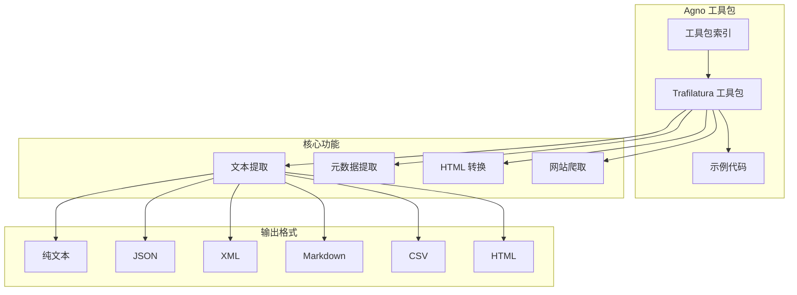
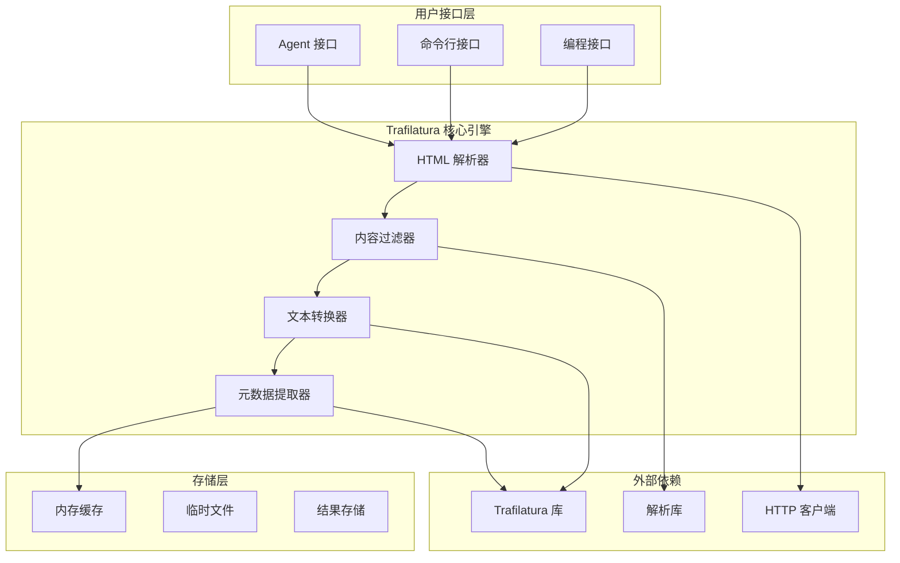
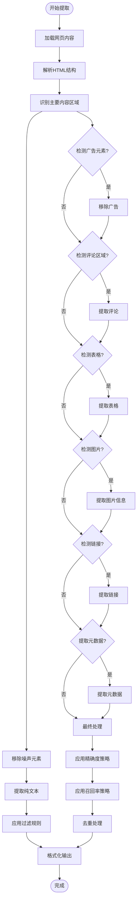
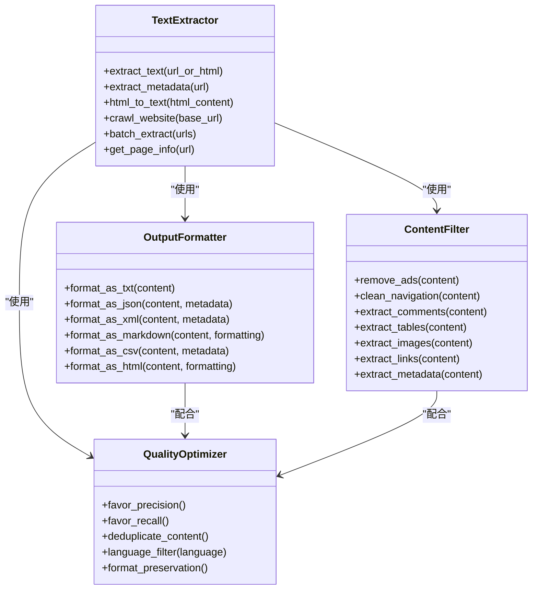
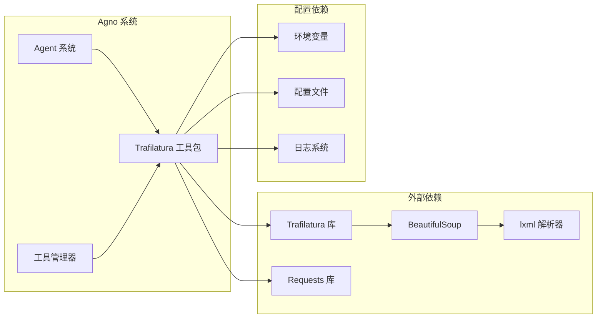

# Trafilatura 网页抓取

<cite>
**本文档引用的文件**
- [trafilatura.mdx](file://tools/toolkits/web-scrape/trafilatura.mdx)
- [trafilatura-tools.mdx](file://examples/tools/trafilatura-tools.mdx)
- [overview.mdx](file://tools/toolkits/overview.mdx)
- [overview.mdx](file://examples/tools/overview.mdx)
</cite>

## 目录
1. [简介](#简介)
2. [项目结构](#项目结构)
3. [核心组件](#核心组件)
4. [架构概览](#架构概览)
5. [详细组件分析](#详细组件分析)
6. [依赖关系分析](#依赖关系分析)
7. [性能考虑](#性能考虑)
8. [故障排除指南](#故障排除指南)
9. [结论](#结论)

## 简介

Trafilatura 是一个强大的网页抓取和文本提取工具包，专为从网页中提取干净、可读的文本内容而设计。该工具包提供了先进的网络爬取和内容分析能力，支持网站爬取和内容研究。

Trafilatura 工具包的主要特点包括：
- 高精度的文本提取算法
- 多种输出格式支持（纯文本、JSON、XML、Markdown、CSV、HTML）
- 内容去噪和格式保持机制
- 元数据提取功能
- 批量处理能力
- 支持网站爬取和多页面内容提取

## 项目结构

Trafilatura 工具包在 Agno 生态系统中的组织结构如下：

**图表来源**
- [overview.mdx:298-304](file://tools/toolkits/overview.mdx#L298-L304)
- [trafilatura.mdx:27-65](file://tools/toolkits/web-scrape/trafilatura.mdx#L27-L65)

**章节来源**
- [overview.mdx:298-304](file://tools/toolkits/overview.mdx#L298-L304)
- [trafilatura.mdx:1-65](file://tools/toolkits/web-scrape/trafilatura.mdx#L1-L65)

## 核心组件

### Trafilatura 工具包参数

Trafilatura 工具包提供了丰富的配置选项，支持灵活的内容提取策略：

| 参数名称 | 类型 | 默认值 | 描述 |
|---------|------|--------|------|
| `output_format` | str | "txt" | 默认输出格式（txt, json, xml, markdown, csv, html） |
| `include_comments` | bool | False | 是否提取评论内容 |
| `include_tables` | bool | False | 是否包含表格内容 |
| `include_images` | bool | False | 是否包含图像信息（实验性功能） |
| `include_formatting` | bool | False | 是否保留文本格式 |
| `include_links` | bool | False | 是否保留链接（实验性功能） |
| `with_metadata` | bool | False | 是否在提取中包含元数据 |
| `favor_precision` | bool | False | 是否优先考虑精确度而非召回率 |
| `favor_recall` | bool | False | 是否优先考虑召回率而非精确度 |
| `target_language` | Optional[str] | None | 目标语言过滤器（ISO 639-1格式） |
| `deduplicate` | bool | True | 是否移除重复片段 |
| `max_crawl_urls` | int | 100 | 每个网站爬取的最大URL数量 |
| `max_known_urls` | int | 1000 | 爬取过程中的最大已知URL数量 |
| `enable_extract_text` | bool | True | 是否提取文本内容 |
| `enable_extract_metadata` | bool | True | 是否提取元数据信息 |
| `enable_html_to_text` | bool | True | 是否将HTML内容转换为纯文本 |
| `enable_batch_extract` | bool | True | 是否批量提取多个URL的内容 |

**章节来源**
- [trafilatura.mdx:29-48](file://tools/toolkits/web-scrape/trafilatura.mdx#L29-L48)

### 主要功能函数

Trafilatura 工具包提供了以下核心功能：

| 函数名称 | 描述 |
|---------|------|
| `extract_text` | 从URL或HTML中提取干净的文本内容 |
| `extract_metadata` | 从网页中提取元数据信息 |
| `html_to_text` | 将HTML内容转换为干净的文本 |
| `crawl_website` | 爬取网站并从多个页面提取内容 |
| `batch_extract` | 批量从多个URL提取内容 |
| `get_page_info` | 获取包含元数据的综合页面信息 |

**章节来源**
- [trafilatura.mdx:49-59](file://tools/toolkits/web-scrape/trafilatura.mdx#L49-L59)

## 架构概览

Trafilatura 工具包采用模块化架构设计，支持多种使用场景和配置选项：

**图表来源**
- [trafilatura.mdx:1-25](file://tools/toolkits/web-scrape/trafilatura.mdx#L1-L25)

## 详细组件分析

### 文本提取算法

Trafilatura 的文本提取算法采用了多层次的内容识别和过滤机制：

**图表来源**
- [trafilatura-tools.mdx:137-192](file://examples/tools/trafilatura-tools.mdx#L137-L192)

### 内容去噪技术

Trafilatura 实现了多种内容去噪技术来提高提取质量：

1. **广告内容过滤**：自动识别并移除广告元素
2. **导航栏清理**：移除导航菜单和侧边栏内容
3. **脚注和版权信息处理**：智能识别和处理版权信息
4. **重复内容检测**：通过语义相似度检测重复内容
5. **格式标准化**：统一文本格式和编码

### 格式保持机制

Trafilatura 支持多种输出格式，并保持内容的结构完整性：

**图表来源**
- [trafilatura.mdx:49-59](file://tools/toolkits/web-scrape/trafilatura.mdx#L49-L59)

**章节来源**
- [trafilatura.mdx:49-65](file://tools/toolkits/web-scrape/trafilatura.mdx#L49-L65)

## 依赖关系分析

Trafilatura 工具包的依赖关系相对简洁，主要依赖于外部的 Trafilatura 库：

**图表来源**
- [trafilatura.mdx:60-65](file://tools/toolkits/web-scrape/trafilatura.mdx#L60-L65)

**章节来源**
- [trafilatura.mdx:60-65](file://tools/toolkits/web-scrape/trafilatura.mdx#L60-L65)

## 性能考虑

### 提取策略优化

Trafilatura 提供了两种主要的提取策略来平衡准确性和完整性：

1. **高精确度提取**（favor_precision=True）
   - 优先考虑提取内容的准确性
   - 可能会遗漏一些内容
   - 适合需要高质量内容的场景

2. **高召回率提取**（favor_recall=True）
   - 优先考虑捕获尽可能多的内容
   - 可能包含一些不相关内容
   - 适合需要全面内容的场景

### 批量处理优化

对于大量网页的处理，建议采用以下策略：

- **并发处理**：利用异步特性提高处理速度
- **缓存机制**：缓存已处理的网页内容
- **错误重试**：实现智能的错误重试机制
- **资源限制**：设置合理的内存和时间限制

## 故障排除指南

### 常见问题及解决方案

1. **安装问题**
   - 确保正确安装 Trafilatura 库
   - 检查 Python 版本兼容性
   - 验证网络连接状态

2. **提取质量不佳**
   - 调整精确度和召回率设置
   - 使用目标语言过滤器
   - 启用去重功能

3. **性能问题**
   - 优化并发设置
   - 实施适当的缓存策略
   - 调整超时参数

### 调试技巧

- 启用详细的日志记录
- 使用小规模测试集验证配置
- 监控内存使用情况
- 实施超时和重试机制

**章节来源**
- [trafilatura-tools.mdx:15-18](file://examples/tools/trafilatura-tools.mdx#L15-L18)

## 结论

Trafilatura 网页抓取工具包为 Agno 生态系统提供了强大而灵活的文本提取能力。其模块化设计支持多种使用场景，从简单的单页面提取到复杂的批量处理和网站爬取。

关键优势包括：
- **高度可配置**：丰富的参数选项满足不同需求
- **多格式支持**：支持多种输出格式以适应不同应用场景
- **智能去噪**：先进的内容过滤技术确保提取质量
- **易于集成**：与 Agno Agent 系统无缝集成

通过合理配置和使用，Trafilatura 工具包能够有效支持各种网页文本提取和处理任务，包括文章内容提取、评论收集、元数据获取等应用场景。