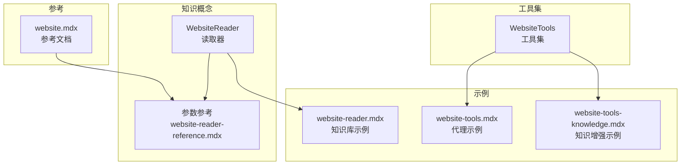
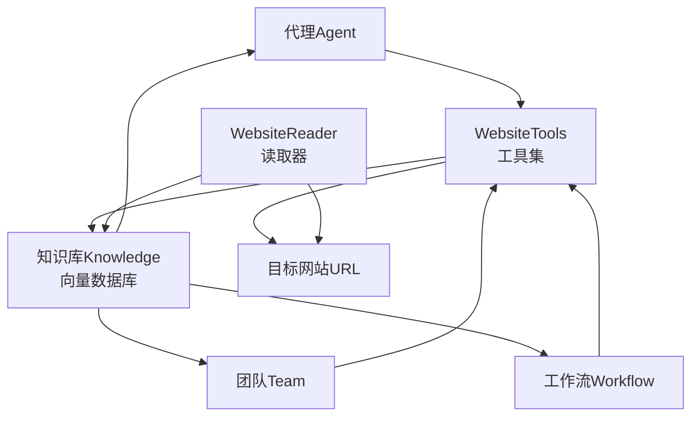
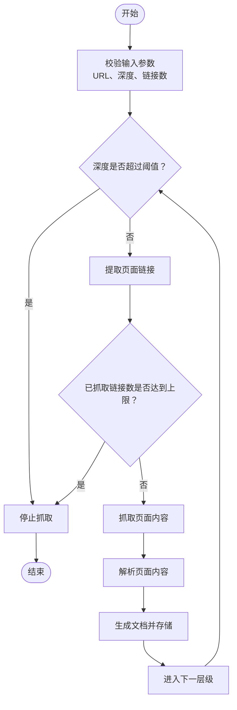
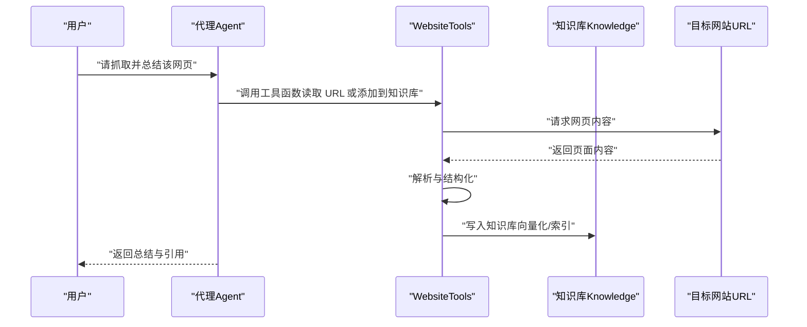
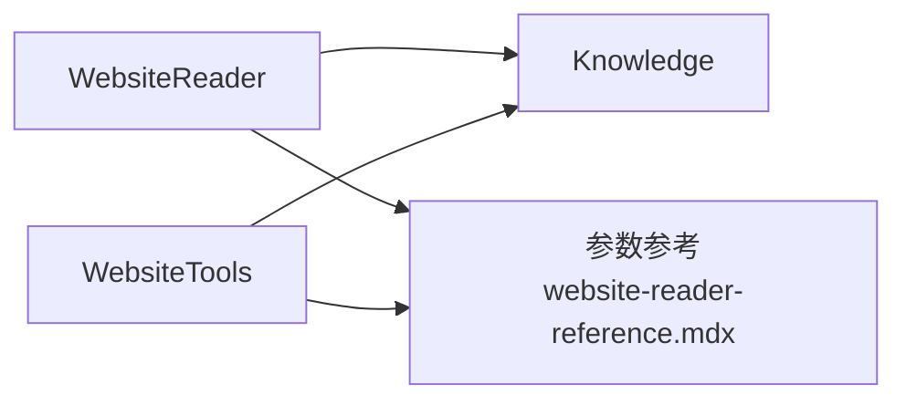

# Website 网页抓取

<cite>
**本文引用的文件**
- [website.mdx](file://tools/toolkits/web-scrape/website.mdx)
- [website-reader.mdx](file://knowledge/concepts/readers/website-reader.mdx)
- [_snippets/website-reader-reference.mdx](file://_snippets/website-reader-reference.mdx)
- [website-reader.mdx](file://examples/knowledge/readers/website-reader.mdx)
- [website-tools.mdx](file://examples/tools/website-tools.mdx)
- [website-tools-knowledge.mdx](file://examples/tools/website-tools-knowledge.mdx)
- [website.mdx](file://reference/knowledge/reader/website.mdx)
</cite>

## 目录
1. [简介](#简介)
2. [项目结构](#项目结构)
3. [核心组件](#核心组件)
4. [架构总览](#架构总览)
5. [详细组件分析](#详细组件分析)
6. [依赖关系分析](#依赖关系分析)
7. [性能考虑](#性能考虑)
8. [故障排查指南](#故障排查指南)
9. [结论](#结论)
10. [附录](#附录)

## 简介
本技术文档围绕 Website 网页抓取工具包展开，系统性介绍其通用网页抓取能力与知识构建流程，覆盖以下主题：
- 网站结构分析：解析页面内容、提取链接与语义片段
- 链接提取与内容分类：基于规则与层级深度的抓取策略
- 抓取策略配置：最大深度、最大链接数、范围限制与并发控制
- 在代理（Agent）、团队（Team）与工作流（Workflow）中的应用：网站内容索引、知识图谱构建与内容推荐
- 效率优化、数据组织与知识管理最佳实践

Website 工具包提供两类能力入口：
- WebsiteReader：面向知识库构建的“读取器”，可将整站或指定站点的内容抓取并入库
- WebsiteTools：面向代理的“工具集”，支持在对话中直接抓取网页并加入知识库

## 项目结构
Website 相关文档分布在多个模块：
- 工具集文档：tools/toolkits/web-scrape/website.mdx
- 知识概念文档：knowledge/concepts/readers/website-reader.mdx
- 参数参考片段：_snippets/website-reader-reference.mdx
- 示例用法：examples/knowledge/readers/website-reader.mdx、examples/tools/website-tools.mdx、examples/tools/website-tools-knowledge.mdx
- 参考文档：reference/knowledge/reader/website.mdx

图表来源
- [website.mdx:1-43](file://tools/toolkits/web-scrape/website.mdx#L1-L43)
- [website-reader.mdx:1-64](file://knowledge/concepts/readers/website-reader.mdx#L1-L64)
- [_snippets/website-reader-reference.mdx:1-6](file://_snippets/website-reader-reference.mdx#L1-L6)
- [website-reader.mdx:1-56](file://examples/knowledge/readers/website-reader.mdx#L1-L56)
- [website-tools.mdx:1-54](file://examples/tools/website-tools.mdx#L1-L54)
- [website-tools-knowledge.mdx:1-75](file://examples/tools/website-tools-knowledge.mdx#L1-L75)
- [website.mdx:1-9](file://reference/knowledge/reader/website.mdx#L1-L9)

章节来源
- [website.mdx:1-43](file://tools/toolkits/web-scrape/website.mdx#L1-L43)
- [website-reader.mdx:1-64](file://knowledge/concepts/readers/website-reader.mdx#L1-L64)
- [_snippets/website-reader-reference.mdx:1-6](file://_snippets/website-reader-reference.mdx#L1-L6)
- [website-reader.mdx:1-56](file://examples/knowledge/readers/website-reader.mdx#L1-L56)
- [website-tools.mdx:1-54](file://examples/tools/website-tools.mdx#L1-L54)
- [website-tools-knowledge.mdx:1-75](file://examples/tools/website-tools-knowledge.mdx#L1-L75)
- [website.mdx:1-9](file://reference/knowledge/reader/website.mdx#L1-L9)

## 核心组件
- WebsiteReader（读取器）
  - 职责：抓取网站内容，按层级深度与链接数量进行控制，输出结构化文档集合
  - 关键参数：目标 URL、最大深度、最大链接数
  - 典型用法：将网站内容插入向量数据库，供检索增强问答（RAG）使用
- WebsiteTools（工具集）
  - 职责：在代理执行过程中，解析网页并将其内容加入知识库；提供“添加到知识库”和“读取 URL”的函数
  - 关键参数：关联的知识库实例
  - 典型用法：在多轮对话中动态抓取网页并增强回答

章节来源
- [website-reader.mdx:1-64](file://knowledge/concepts/readers/website-reader.mdx#L1-L64)
- [_snippets/website-reader-reference.mdx:1-6](file://_snippets/website-reader-reference.mdx#L1-L6)
- [website.mdx:1-43](file://tools/toolkits/web-scrape/website.mdx#L1-L43)

## 架构总览
Website 工具包在系统中的位置与交互如下：

图表来源
- [website.mdx:1-43](file://tools/toolkits/web-scrape/website.mdx#L1-L43)
- [website-reader.mdx:1-64](file://knowledge/concepts/readers/website-reader.mdx#L1-L64)
- [website-reader.mdx:1-56](file://examples/knowledge/readers/website-reader.mdx#L1-L56)
- [website-tools.mdx:1-54](file://examples/tools/website-tools.mdx#L1-L54)
- [website-tools-knowledge.mdx:1-75](file://examples/tools/website-tools-knowledge.mdx#L1-L75)

## 详细组件分析

### WebsiteReader 组件分析
- 功能定位
  - 将整站或指定站点内容抓取为结构化文档，便于后续嵌入与检索
  - 支持通过最大深度与最大链接数控制抓取范围，避免无限爬取
- 输入输出
  - 输入：目标 URL、抓取策略参数（最大深度、最大链接数）
  - 输出：文档列表（名称、正文、长度等）
- 错误处理
  - 包装异常并返回错误类型与信息，便于调试
- 使用场景
  - 知识库构建：将网站内容写入向量数据库，供检索增强问答使用
  - 内容分类：结合下游分类器对文档进行主题归类

图表来源
- [website-reader.mdx:1-64](file://knowledge/concepts/readers/website-reader.mdx#L1-L64)
- [_snippets/website-reader-reference.mdx:1-6](file://_snippets/website-reader-reference.mdx#L1-L6)

章节来源
- [website-reader.mdx:1-64](file://knowledge/concepts/readers/website-reader.mdx#L1-L64)
- [_snippets/website-reader-reference.mdx:1-6](file://_snippets/website-reader-reference.mdx#L1-L6)

### WebsiteTools 组件分析
- 功能定位
  - 在代理执行期间，直接对网页进行解析与抓取，并将结果写入知识库
  - 提供“添加到知识库”和“读取 URL”两个常用函数
- 参数与行为
  - 关联知识库：确保抓取结果能被后续检索与推理使用
  - 函数职责：将网页内容结构化后存入知识库；或返回页面内容供进一步处理
- 应用场景
  - 代理对话：用户询问某网站内容时，自动抓取并总结
  - 团队协作：团队成员共享知识库，统一抓取与更新网站内容
  - 工作流：在自动化流程中定期抓取站点并更新知识库

图表来源
- [website.mdx:1-43](file://tools/toolkits/web-scrape/website.mdx#L1-L43)
- [website-tools.mdx:1-54](file://examples/tools/website-tools.mdx#L1-L54)
- [website-tools-knowledge.mdx:1-75](file://examples/tools/website-tools-knowledge.mdx#L1-L75)

章节来源
- [website.mdx:1-43](file://tools/toolkits/web-scrape/website.mdx#L1-L43)
- [website-tools.mdx:1-54](file://examples/tools/website-tools.mdx#L1-L54)
- [website-tools-knowledge.mdx:1-75](file://examples/tools/website-tools-knowledge.mdx#L1-L75)

### 抓取策略配置与范围控制
- 最大深度（max_depth）
  - 控制链接爬取的层级深度，避免无界扩展
- 最大链接数（max_links）
  - 控制单次运行抓取的链接上限，平衡覆盖率与资源消耗
- 范围限制
  - 建议限定目标域或路径前缀，防止跨域抓取与无关页面
- 并发与节流
  - 建议设置请求间隔与并发上限，尊重 robots 协议与服务器负载

章节来源
- [_snippets/website-reader-reference.mdx:1-6](file://_snippets/website-reader-reference.mdx#L1-L6)
- [website-reader.mdx:1-64](file://knowledge/concepts/readers/website-reader.mdx#L1-L64)

### 在代理、团队与工作流中的应用
- 代理（Agent）
  - 使用 WebsiteTools 在对话中即时抓取网页并总结，提升回答准确性
  - 结合知识库检索，实现“先抓取、后检索、再生成”的 RAG 流程
- 团队（Team）
  - 多智能体协同：部分成员负责抓取，其他成员负责分类、摘要与推荐
  - 共享知识库：统一维护网站内容索引，减少重复抓取
- 工作流（Workflow）
  - 定时任务：周期性抓取关键站点，增量更新知识库
  - 条件分支：根据内容类型（新闻、文档、产品页）选择不同解析策略

章节来源
- [website-tools.mdx:1-54](file://examples/tools/website-tools.mdx#L1-L54)
- [website-tools-knowledge.mdx:1-75](file://examples/tools/website-tools-knowledge.mdx#L1-L75)

### 知识构建与内容推荐
- 网站内容索引
  - 使用 WebsiteReader 将网站内容写入向量数据库，建立可检索的文档索引
- 知识图谱构建
  - 基于解析出的实体与关系（如标题、段落、链接），抽取三元组并构建图谱
- 内容推荐
  - 基于用户查询与相似度检索，推荐相关网页或段落

章节来源
- [website-reader.mdx:1-56](file://examples/knowledge/readers/website-reader.mdx#L1-L56)
- [website.mdx:1-43](file://tools/toolkits/web-scrape/website.mdx#L1-L43)

## 依赖关系分析
Website 工具包的依赖与耦合关系如下：
- WebsiteTools 依赖知识库（Knowledge）以持久化抓取结果
- WebsiteReader 作为独立读取器，可直接对接知识库或下游处理模块
- 参数参考片段集中定义了关键配置项，保证工具与读取器的一致性

图表来源
- [website-reader.mdx:1-64](file://knowledge/concepts/readers/website-reader.mdx#L1-L64)
- [_snippets/website-reader-reference.mdx:1-6](file://_snippets/website-reader-reference.mdx#L1-L6)
- [website.mdx:1-43](file://tools/toolkits/web-scrape/website.mdx#L1-L43)

章节来源
- [website-reader.mdx:1-64](file://knowledge/concepts/readers/website-reader.mdx#L1-L64)
- [_snippets/website-reader-reference.mdx:1-6](file://_snippets/website-reader-reference.mdx#L1-L6)
- [website.mdx:1-43](file://tools/toolkits/web-scrape/website.mdx#L1-L43)

## 性能考虑
- 抓取范围控制
  - 合理设置最大深度与最大链接数，避免大规模网络请求导致超时或封禁
- 并发与限速
  - 控制并发连接数与请求间隔，降低对目标服务器的压力
- 缓存与增量更新
  - 对已抓取页面进行缓存，仅对变更内容进行增量更新
- 存储与检索优化
  - 使用高效的向量数据库与合适的嵌入模型，平衡精度与速度
- 解析与清洗
  - 过滤广告、导航与重复内容，提升文档质量与检索效果

## 故障排查指南
- 常见问题
  - 网络超时或拒绝访问：检查代理设置、请求头与速率限制
  - 页面解析失败：确认目标页面是否包含动态渲染内容，必要时启用浏览器模式
  - 知识库写入失败：核对数据库连接、表结构与嵌入维度
- 调试建议
  - 开启日志记录，捕获请求状态码与响应时间
  - 分阶段验证：先抓取少量页面，再扩大范围
  - 使用参数参考校验输入参数是否符合预期

章节来源
- [website-reader.mdx:1-64](file://knowledge/concepts/readers/website-reader.mdx#L1-L64)
- [_snippets/website-reader-reference.mdx:1-6](file://_snippets/website-reader-reference.mdx#L1-L6)

## 结论
Website 网页抓取工具包提供了从“抓取—解析—索引—检索—应用”的完整能力链路。通过合理的抓取策略配置与范围控制，结合知识库与向量数据库，可在代理、团队与工作流中高效构建网站知识体系，并支持知识图谱与内容推荐等高级应用。建议在生产环境中重视性能优化、数据质量与合规性，持续迭代抓取与解析策略。

## 附录
- 快速上手
  - 安装依赖：beautifulsoup4（工具集示例）、openai（示例）、pgvector（示例）
  - 设置环境变量：OPENAI_API_KEY
  - 运行示例：参考各示例文档中的命令与脚本
- 参考链接
  - WebsiteReader 参考：[website.mdx:1-9](file://reference/knowledge/reader/website.mdx#L1-L9)
  - WebsiteTools 参考：[website.mdx:1-43](file://tools/toolkits/web-scrape/website.mdx#L1-L43)