# 网页抓取工具包

<cite>
**本文引用的文件**
- [AgentQL 工具包](file://tools/toolkits/web-scrape/agentql.mdx)
- [BrowserBase 工具包](file://tools/toolkits/web-scrape/browserbase.mdx)
- [Crawl4AI 工具包](file://tools/toolkits/web-scrape/crawl4ai.mdx)
- [Jina Reader 工具包](file://tools/toolkits/web-scrape/jina-reader.mdx)
- [Newspaper 工具包](file://tools/toolkits/web-scrape/newspaper.mdx)
- [Newspaper4k 工具包](file://tools/toolkits/web-scrape/newspaper4k.mdx)
- [Website 工具包](file://tools/toolkits/web-scrape/website.mdx)
- [Firecrawl 工具包](file://tools/toolkits/web-scrape/firecrawl.mdx)
- [Spider 工具包](file://tools/toolkits/web-scrape/spider.mdx)
- [Trafilatura 工具包](file://tools/toolkits/web-scrape/trafilatura.mdx)
- [BrightData 工具包](file://tools/toolkits/web-scrape/brightdata.mdx)
- [工具包总览](file://tools/toolkits/overview.mdx)
- [Firecrawl 阅读器片段](file://_snippets/firecrawl-reader-reference.mdx)
- [Website 阅读器片段](file://_snippets/website-reader-reference.mdx)
- [网站知识库示例](file://examples/knowledge/readers/website-reader.mdx)
- [竞争对手分析代理示例](file://cookbook/agents/competitor-analysis-agent.mdx)
- [网络研究代理示例](file://cookbook/agents/research-agent.mdx)
- [网页提取代理示例](file://cookbook/agents/web-extraction-agent.mdx)
</cite>

## 目录
1. [简介](#简介)
2. [项目结构](#项目结构)
3. [核心组件](#核心组件)
4. [架构概览](#架构概览)
5. [详细组件分析](#详细组件分析)
6. [依赖关系分析](#依赖关系分析)
7. [性能考虑](#性能考虑)
8. [故障排除指南](#故障排除指南)
9. [结论](#结论)
10. [附录](#附录)

## 简介
本文件系统性梳理 Agno 生态中提供的 12 个网页抓取相关工具包，覆盖从通用爬虫到专业内容抽取、从结构化数据获取到图片与截图处理的完整能力谱系。每个工具包均包含：
- 爬虫配置参数与启用开关
- 反爬虫应对策略与最佳实践
- 数据提取方法与内容解析技术
- 抓取结果的数据格式与元数据提取
- 图片处理与截图能力
- 在代理、团队与工作流中的实际应用案例（新闻聚合、内容分析、价格监控、市场调研等）
- 效率优化、数据质量保证与法律合规建议

## 项目结构
网页抓取工具包主要分布在以下路径：
- 工具包文档：tools/toolkits/web-scrape/*.mdx
- 工具包总览：tools/toolkits/overview.mdx
- 示例与用法：cookbook/agents/* 与 examples/knowledge/readers/*
- 片段参考：_snippets/*-reader-reference.mdx

```mermaid
graph TB
A["工具包总览<br/>tools/toolkits/overview.mdx"] --> B["AgentQL<br/>tools/toolkits/web-scrape/agentql.mdx"]
A --> C["BrowserBase<br/>tools/toolkits/web-scrape/browserbase.mdx"]
A --> D["Crawl4AI<br/>tools/toolkits/web-scrape/crawl4ai.mdx"]
A --> E["Jina Reader<br/>tools/toolkits/web-scrape/jina-reader.mdx"]
A --> F["Newspaper<br/>tools/toolkits/web-scrape/newspaper.mdx"]
A --> G["Newspaper4k<br/>tools/toolkits/web-scrape/newspaper4k.mdx"]
A --> H["Website<br/>tools/toolkits/web-scrape/website.mdx"]
A --> I["Firecrawl<br/>tools/toolkits/web-scrape/firecrawl.mdx"]
A --> J["Spider<br/>tools/toolkits/web-scrape/spider.mdx"]
A --> K["Trafilatura<br/>tools/toolkits/web-scrape/trafilatura.mdx"]
A --> L["BrightData<br/>tools/toolkits/web-scrape/brightdata.mdx"]
```

**图表来源**
- [工具包总览:224-286](file://tools/toolkits/overview.mdx#L224-L286)
- [AgentQL 工具包:1-61](file://tools/toolkits/web-scrape/agentql.mdx#L1-L61)
- [BrowserBase 工具包:1-74](file://tools/toolkits/web-scrape/browserbase.mdx#L1-L74)
- [Crawl4AI 工具包:1-50](file://tools/toolkits/web-scrape/crawl4ai.mdx#L1-L50)
- [Jina Reader 工具包:1-51](file://tools/toolkits/web-scrape/jina-reader.mdx#L1-L51)
- [Newspaper 工具包:1-42](file://tools/toolkits/web-scrape/newspaper.mdx#L1-L42)
- [Newspaper4k 工具包:1-45](file://tools/toolkits/web-scrape/newspaper4k.mdx#L1-L45)
- [Website 工具包:1-43](file://tools/toolkits/web-scrape/website.mdx#L1-L43)
- [Firecrawl 工具包:1-60](file://tools/toolkits/web-scrape/firecrawl.mdx#L1-L60)
- [Spider 工具包:1-50](file://tools/toolkits/web-scrape/spider.mdx#L1-L50)
- [Trafilatura 工具包:1-65](file://tools/toolkits/web-scrape/trafilatura.mdx#L1-L65)
- [BrightData 工具包:1-133](file://tools/toolkits/web-scrape/brightdata.mdx#L1-L133)

**章节来源**
- [工具包总览:224-286](file://tools/toolkits/overview.mdx#L224-L286)

## 核心组件
本节概述各工具包的核心职责、典型使用场景与关键参数。

- AgentQL：基于浏览器的结构化查询与页面抓取，适合需要精准定位元素与文本的场景。
- BrowserBase：无头浏览器自动化服务，支持导航、截图、页面内容获取与会话管理。
- Crawl4AI：通用爬虫与内容抽取，支持内容修剪与相关性评分，适合批量内容收集。
- Jina Reader：URL 内容读取与搜索查询，适合快速摘要与检索。
- Newspaper/Newspaper4k：新闻文章解析与摘要，Newspaper4k 支持更丰富的元数据与摘要选项。
- Website：将网站内容加入知识库，支持 URL 读取与知识库关联。
- Firecrawl：多形态抓取（站点映射、搜索、爬取、刮取），适合结构化输出与大规模采集。
- Spider：开源爬虫，提供搜索、抓取、爬取能力，适合成本敏感场景。
- Trafilatura：高级文本抽取与内容分析，支持多种输出格式与元数据提取。
- BrightData：综合型抓取平台，支持 Markdown 转换、截图、搜索引擎结果与多平台结构化数据。

**章节来源**
- [AgentQL 工具包:1-61](file://tools/toolkits/web-scrape/agentql.mdx#L1-L61)
- [BrowserBase 工具包:1-74](file://tools/toolkits/web-scrape/browserbase.mdx#L1-L74)
- [Crawl4AI 工具包:1-50](file://tools/toolkits/web-scrape/crawl4ai.mdx#L1-L50)
- [Jina Reader 工具包:1-51](file://tools/toolkits/web-scrape/jina-reader.mdx#L1-L51)
- [Newspaper 工具包:1-42](file://tools/toolkits/web-scrape/newspaper.mdx#L1-L42)
- [Newspaper4k 工具包:1-45](file://tools/toolkits/web-scrape/newspaper4k.mdx#L1-L45)
- [Website 工具包:1-43](file://tools/toolkits/web-scrape/website.mdx#L1-L43)
- [Firecrawl 工具包:1-60](file://tools/toolkits/web-scrape/firecrawl.mdx#L1-L60)
- [Spider 工具包:1-50](file://tools/toolkits/web-scrape/spider.mdx#L1-L50)
- [Trafilatura 工具包:1-65](file://tools/toolkits/web-scrape/trafilatura.mdx#L1-L65)
- [BrightData 工具包:1-133](file://tools/toolkits/web-scrape/brightdata.mdx#L1-L133)

## 架构概览
下图展示各工具包在代理-团队-工作流中的集成方式与调用关系：

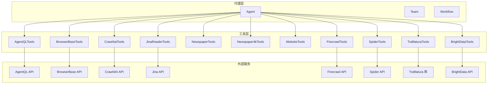

**图表来源**
- [AgentQL 工具包:1-61](file://tools/toolkits/web-scrape/agentql.mdx#L1-L61)
- [BrowserBase 工具包:1-74](file://tools/toolkits/web-scrape/browserbase.mdx#L1-L74)
- [Crawl4AI 工具包:1-50](file://tools/toolkits/web-scrape/crawl4ai.mdx#L1-L50)
- [Jina Reader 工具包:1-51](file://tools/toolkits/web-scrape/jina-reader.mdx#L1-L51)
- [Firecrawl 工具包:1-60](file://tools/toolkits/web-scrape/firecrawl.mdx#L1-L60)
- [Spider 工具包:1-50](file://tools/toolkits/web-scrape/spider.mdx#L1-L50)
- [Trafilatura 工具包:1-65](file://tools/toolkits/web-scrape/trafilatura.mdx#L1-L65)
- [BrightData 工具包:1-133](file://tools/toolkits/web-scrape/brightdata.mdx#L1-L133)

## 详细组件分析

### AgentQL 工具包
- 爬虫配置与启用开关
  - 关键参数：api_key、scrape、agentql_query、enable_scrape_website、enable_custom_scrape_website、all
  - 启用功能：scrape_website、custom_scrape_website
- 反爬虫策略
  - 基于浏览器实例执行，减少静态请求特征；通过自定义查询提升命中精度，降低无效内容返回
- 数据提取与解析
  - 支持标准文本抓取与自定义 AgentQL 查询，适合结构化字段抽取
- 结果格式与元数据
  - 返回文本或查询结果，可结合下游模型进行结构化输出
- 典型用例
  - 页面要素定位与批量文本抽取，适用于电商详情页、产品规格表等

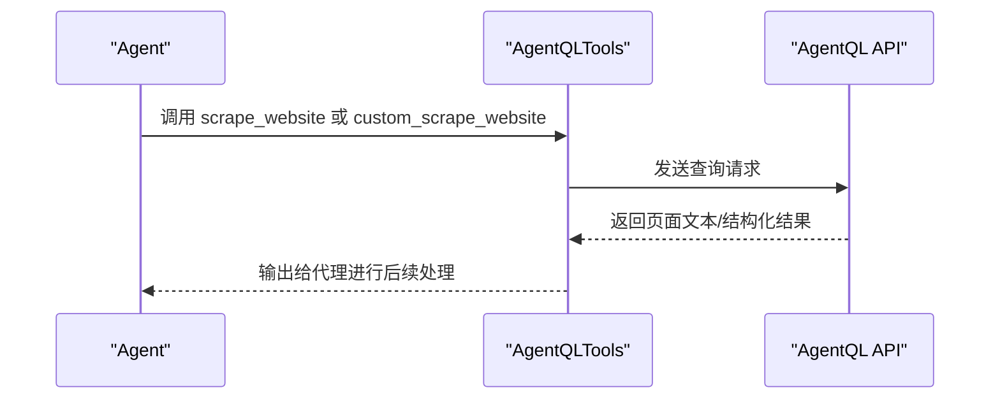

**图表来源**
- [AgentQL 工具包:40-61](file://tools/toolkits/web-scrape/agentql.mdx#L40-L61)

**章节来源**
- [AgentQL 工具包:1-61](file://tools/toolkits/web-scrape/agentql.mdx#L1-L61)

### BrowserBase 工具包
- 爬虫配置与启用开关
  - 关键参数：api_key、project_id、base_url、enable_navigate_to、enable_screenshot、enable_get_page_content、enable_close_session、all
  - 启用功能：navigate_to、screenshot、get_page_content、close_session
- 反爬虫策略
  - 使用 BrowserBase 的托管无头浏览器，隐藏真实 IP 与浏览器指纹；支持区域化接入与自定义端点
- 数据提取与解析
  - 导航至目标页面后抓取 HTML 内容，支持全屏截图与页面快照
- 结果格式与元数据
  - HTML 文本、图像数据（截图）、会话状态
- 典型用例
  - 自动化测试验证、响应式布局视觉监控、网站变更监测

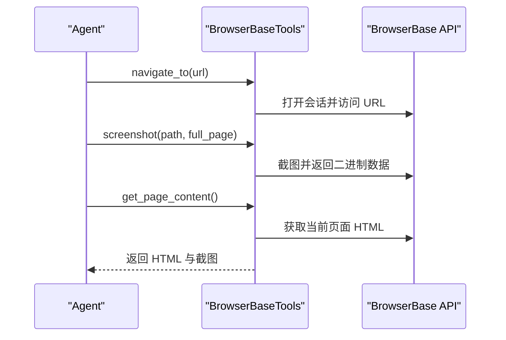

**图表来源**
- [BrowserBase 工具包:49-74](file://tools/toolkits/web-scrape/browserbase.mdx#L49-L74)

**章节来源**
- [BrowserBase 工具包:1-74](file://tools/toolkits/web-scrape/browserbase.mdx#L1-L74)

### Crawl4AI 工具包
- 爬虫配置与启用开关
  - 关键参数：max_length、timeout、use_pruning、pruning_threshold、bm25_threshold、headless、wait_until、enable_crawl、all
  - 启用功能：web_crawler
- 反爬虫策略
  - headless 模式运行；wait_until 控制等待时机以规避动态加载；内容修剪降低噪声
- 数据提取与解析
  - 使用 WebCrawler 抓取指定 URL，支持限制返回文本长度
- 结果格式与元数据
  - 文本内容（可裁剪），便于后续结构化处理
- 典型用例
  - 快速内容采集与预处理，适合构建知识库的上游数据源

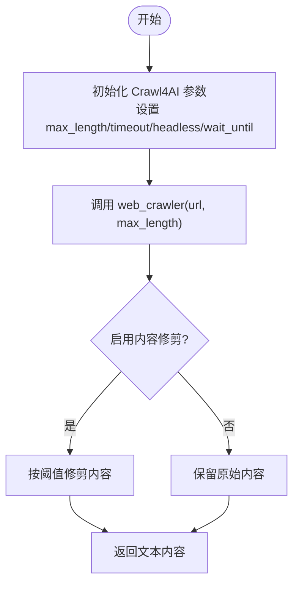

**图表来源**
- [Crawl4AI 工具包:27-46](file://tools/toolkits/web-scrape/crawl4ai.mdx#L27-L46)

**章节来源**
- [Crawl4AI 工具包:1-50](file://tools/toolkits/web-scrape/crawl4ai.mdx#L1-L50)

### Jina Reader 工具包
- 爬虫配置与启用开关
  - 关键参数：api_key、base_url、search_url、max_content_length、timeout、search_query_content、enable_read_url、enable_search_query、all
  - 启用功能：read_url、search_query
- 反爬虫策略
  - 使用官方 API，避免直接解析网页带来的检测风险
- 数据提取与解析
  - 读取 URL 内容或执行搜索查询，返回截断后的结果
- 结果格式与元数据
  - 文本摘要或搜索结果列表
- 典型用例
  - 快速摘要与检索，适合信息初筛与热点追踪

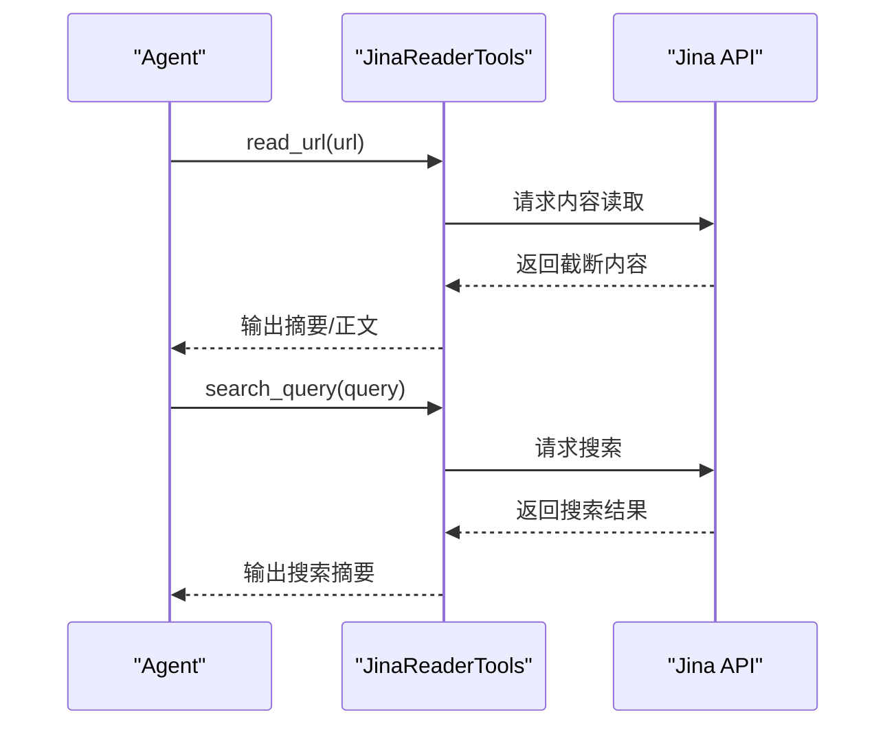

**图表来源**
- [Jina Reader 工具包:27-47](file://tools/toolkits/web-scrape/jina-reader.mdx#L27-L47)

**章节来源**
- [Jina Reader 工具包:1-51](file://tools/toolkits/web-scrape/jina-reader.mdx#L1-L51)

### Newspaper/Newspaper4k 工具包
- 爬虫配置与启用开关
  - Newspaper：get_article_text（启用开关）
  - Newspaper4k：get_article_data/read_article（启用开关）、include_summary、article_length
- 反爬虫策略
  - 通过库内置的解析器与语言模型识别，减少误判
- 数据提取与解析
  - 解析文章正文、标题、作者、发布时间等结构化信息
- 结果格式与元数据
  - 文章全文、摘要（可选）、元数据字典
- 典型用例
  - 新闻聚合、学术文献摘要、博客文章提炼

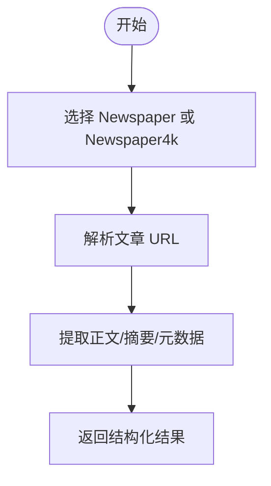

**图表来源**
- [Newspaper 工具包:27-38](file://tools/toolkits/web-scrape/newspaper.mdx#L27-L38)
- [Newspaper4k 工具包:27-40](file://tools/toolkits/web-scrape/newspaper4k.mdx#L27-L40)

**章节来源**
- [Newspaper 工具包:1-42](file://tools/toolkits/web-scrape/newspaper.mdx#L1-L42)
- [Newspaper4k 工具包:1-45](file://tools/toolkits/web-scrape/newspaper4k.mdx#L1-L45)

### Website 工具包
- 爬虫配置与启用开关
  - 关键参数：knowledge（知识库对象）
  - 启用功能：add_website_to_knowledge_base、read_url
- 反爬虫策略
  - 通过 BeautifulSoup 解析，避免复杂 JS 渲染导致的不稳定
- 数据提取与解析
  - 读取 URL 内容并添加到知识库，支持 HTTPS 网站
- 结果格式与元数据
  - 网页文本与结构化分块，便于后续检索
- 典型用例
  - 将官网文档、产品介绍等结构化入库，支撑 RAG 场景

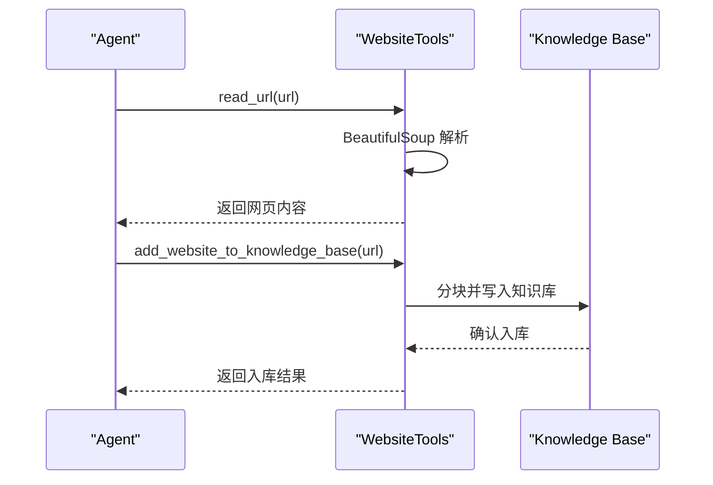

**图表来源**
- [Website 工具包:27-39](file://tools/toolkits/web-scrape/website.mdx#L27-L39)

**章节来源**
- [Website 工具包:1-43](file://tools/toolkits/web-scrape/website.mdx#L1-L43)

### Firecrawl 工具包
- 爬虫配置与启用开关
  - 关键参数：api_key、enable_scrape、enable_crawl、enable_mapping、enable_search、formats、limit、poll_interval、search_params、api_url、all
  - 启用功能：scrape_website、crawl_website、map_website、search
- 反爬虫策略
  - 官方 API 服务，具备抗检测能力；支持轮询与异步任务
- 数据提取与解析
  - 返回 JSON 格式的结果，包含页面内容、链接、结构化数据等
- 结果格式与元数据
  - JSON（可选多种格式），支持深度爬取与站点映射
- 典型用例
  - 新闻聚合、价格监控、市场情报收集、结构化数据导出

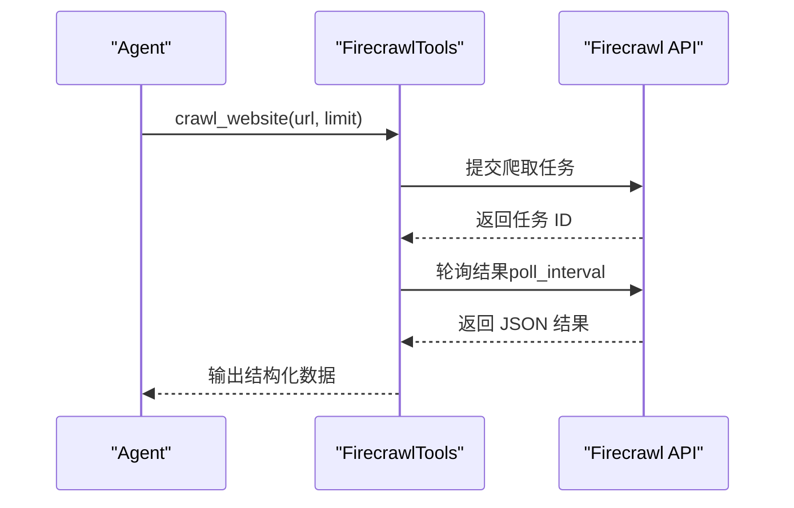

**图表来源**
- [Firecrawl 工具包:32-56](file://tools/toolkits/web-scrape/firecrawl.mdx#L32-L56)

**章节来源**
- [Firecrawl 工具包:1-60](file://tools/toolkits/web-scrape/firecrawl.mdx#L1-L60)

### Spider 工具包
- 爬虫配置与启用开关
  - 关键参数：max_results、url、optional_params、enable_search、enable_scrape、enable_crawl、all
  - 启用功能：search、scrape、crawl
- 反爬虫策略
  - 开源客户端，支持默认的请求头与重试机制
- 数据提取与解析
  - 返回 Markdown 或 JSON，支持搜索、抓取、爬取
- 结果格式与元数据
  - Markdown 文本或 JSON 列表
- 典型用例
  - 快速新闻抓取、博客文章解析、竞品信息收集

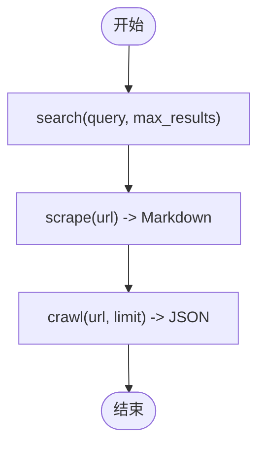

**图表来源**
- [Spider 工具包:27-46](file://tools/toolkits/web-scrape/spider.mdx#L27-L46)

**章节来源**
- [Spider 工具包:1-50](file://tools/toolkits/web-scrape/spider.mdx#L1-L50)

### Trafilatura 工具包
- 爬虫配置与启用开关
  - 关键参数：output_format、include_comments、include_tables、include_images、include_formatting、include_links、with_metadata、favor_precision、favor_recall、target_language、deduplicate、max_crawl_urls、max_known_urls、enable_extract_text、enable_extract_metadata、enable_html_to_text、enable_batch_extract
  - 启用功能：extract_text、extract_metadata、html_to_text、crawl_website、batch_extract、get_page_info
- 反爬虫策略
  - 本地库解析，避免网络请求暴露；支持语言过滤与去重
- 数据提取与解析
  - 多格式输出（txt/json/xml/markdown/csv/html），支持元数据与批量抽取
- 结果格式与元数据
  - 多种格式文本/JSON，含页面信息与结构化元数据
- 典型用例
  - 学术资料整理、内容分析、批量网页清洗

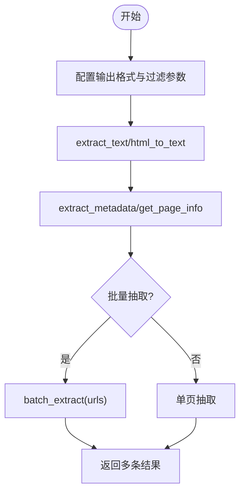

**图表来源**
- [Trafilatura 工具包:27-59](file://tools/toolkits/web-scrape/trafilatura.mdx#L27-L59)

**章节来源**
- [Trafilatura 工具包:1-65](file://tools/toolkits/web-scrape/trafilatura.mdx#L1-L65)

### BrightData 工具包
- 爬虫配置与启用开关
  - 关键参数：api_key、enable_scrape_markdown、enable_screenshot、enable_search_engine、enable_web_data_feed、all、serp_zone、web_unlocker_zone、verbose、timeout
  - 启用功能：scrape_as_markdown、get_screenshot、search_engine、web_data_feed
- 反爬虫策略
  - 提供 Web Unlocker Zone 与 SERP Zone，支持多区域与高并发
- 数据提取与解析
  - 支持 Markdown 转换、截图、搜索引擎结果、多平台结构化数据
- 结果格式与元数据
  - Markdown 文本、图像数据、结构化 JSON
- 典型用例
  - 价格监控、招聘数据抓取、社交媒体画像、企业尽调

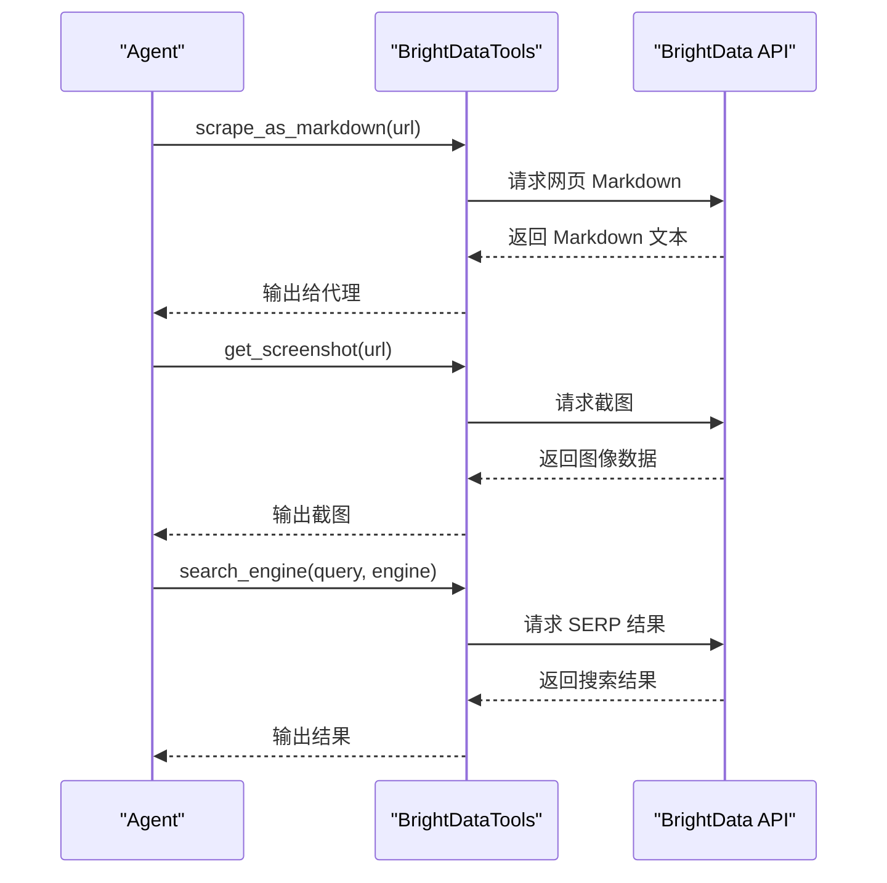

**图表来源**
- [BrightData 工具包:54-77](file://tools/toolkits/web-scrape/brightdata.mdx#L54-L77)

**章节来源**
- [BrightData 工具包:1-133](file://tools/toolkits/web-scrape/brightdata.mdx#L1-L133)

## 依赖关系分析
- 组件耦合
  - 各工具包与外部服务之间为松耦合（API/SDK），内部通过统一的工具接口暴露功能
  - Website 与知识库存在弱耦合（knowledge 参数），便于集成 RAG
- 直接与间接依赖
  - 外部依赖：各服务的 SDK/库（如 agentql、browserbase、crawl4ai、jina、firecrawl-py、spider-client、requests 等）
  - 环境变量：API Key、区域配置等
- 循环依赖
  - 无循环依赖，工具包间相互独立
- 接口契约
  - 统一的启用开关与参数命名风格，便于组合与切换

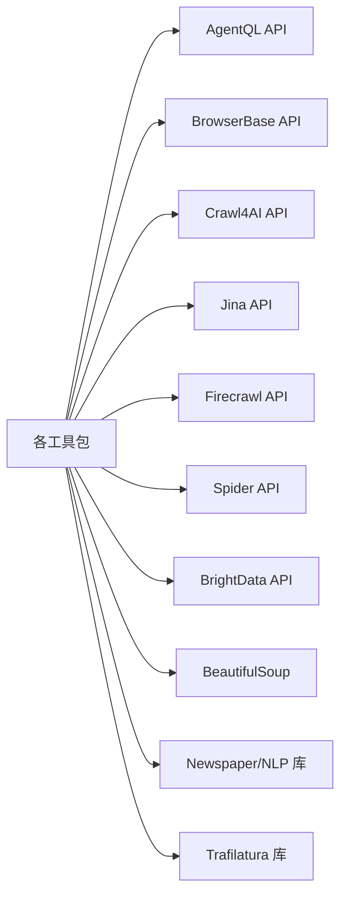

**图表来源**
- [AgentQL 工具包:7-17](file://tools/toolkits/web-scrape/agentql.mdx#L7-L17)
- [BrowserBase 工具包:7-15](file://tools/toolkits/web-scrape/browserbase.mdx#L7-L15)
- [Crawl4AI 工具包:7-13](file://tools/toolkits/web-scrape/crawl4ai.mdx#L7-L13)
- [Jina Reader 工具包:7-13](file://tools/toolkits/web-scrape/jina-reader.mdx#L7-L13)
- [Firecrawl 工具包:8-18](file://tools/toolkits/web-scrape/firecrawl.mdx#L8-L18)
- [Spider 工具包:7-13](file://tools/toolkits/web-scrape/spider.mdx#L7-L13)
- [Website 工具包:7-13](file://tools/toolkits/web-scrape/website.mdx#L7-L13)
- [Trafilatura 工具包:1-65](file://tools/toolkits/web-scrape/trafilatura.mdx#L1-L65)
- [BrightData 工具包:7-27](file://tools/toolkits/web-scrape/brightdata.mdx#L7-L27)

**章节来源**
- [AgentQL 工具包:7-17](file://tools/toolkits/web-scrape/agentql.mdx#L7-L17)
- [BrowserBase 工具包:7-15](file://tools/toolkits/web-scrape/browserbase.mdx#L7-L15)
- [Crawl4AI 工具包:7-13](file://tools/toolkits/web-scrape/crawl4ai.mdx#L7-L13)
- [Jina Reader 工具包:7-13](file://tools/toolkits/web-scrape/jina-reader.mdx#L7-L13)
- [Firecrawl 工具包:8-18](file://tools/toolkits/web-scrape/firecrawl.mdx#L8-L18)
- [Spider 工具包:7-13](file://tools/toolkits/web-scrape/spider.mdx#L7-L13)
- [Website 工具包:7-13](file://tools/toolkits/web-scrape/website.mdx#L7-L13)
- [Trafilatura 工具包:1-65](file://tools/toolkits/web-scrape/trafilatura.mdx#L1-L65)
- [BrightData 工具包:7-27](file://tools/toolkits/web-scrape/brightdata.mdx#L7-L27)

## 性能考虑
- 并发与限速
  - 合理设置 poll_interval、timeout、limit，避免触发服务端限流
- 内容修剪与去噪
  - 使用 use_pruning、pruning_threshold、bm25_threshold 减少无关内容传输
- 输出格式选择
  - 优先选择轻量格式（如 Markdown）以降低存储与传输成本
- 缓存与复用
  - 对重复 URL 的结果进行缓存，减少重复抓取
- 本地解析优先
  - Trafilatura 与 BeautifulSoup 适合本地解析，减少网络往返

## 故障排除指南
- 认证失败
  - 检查环境变量是否正确设置（如 AGENTQL_API_KEY、FIRECRAWL_API_KEY、BRIGHT_DATA_API_KEY 等）
- 服务不可达
  - 核对 base_url、api_url 与网络连通性；必要时使用自定义端点
- 结果为空或不完整
  - 调整 wait_until、headless、timeout；检查目标网站的动态加载策略
- 图片/截图异常
  - 确认 get_screenshot 的输出路径权限与磁盘空间；检查截图参数（full_page）

**章节来源**
- [AgentQL 工具包:15-17](file://tools/toolkits/web-scrape/agentql.mdx#L15-L17)
- [Firecrawl 工具包:16-18](file://tools/toolkits/web-scrape/firecrawl.mdx#L16-L18)
- [BrightData 工具包:15-27](file://tools/toolkits/web-scrape/brightdata.mdx#L15-L27)

## 结论
上述工具包覆盖了从基础网页抓取到高级内容解析与结构化输出的完整链路。通过合理的参数配置、反爬虫策略与性能优化，可在代理、团队与工作流中实现新闻聚合、内容分析、价格监控与市场调研等多样化场景。建议根据业务需求选择合适的工具包组合，并建立完善的质量控制与合规流程。

## 附录

### 实际应用场景与用例
- 新闻聚合与内容分析
  - 使用 Firecrawl 进行站点爬取与搜索，结合 Newspaper4k 提取文章正文与摘要
  - 参考示例：[竞争对手分析代理:10-128](file://cookbook/agents/competitor-analysis-agent.mdx#L10-L128)，[网络研究代理:11-44](file://cookbook/agents/research-agent.mdx#L11-L44)
- 价格监控与市场调研
  - 使用 BrightData 的结构化数据接口与截图能力，结合代理进行持续监控
  - 参考片段：[Firecrawl 阅读器片段:2-3](file://_snippets/firecrawl-reader-reference.mdx#L2-L3)，[Website 阅读器片段](file://_snippets/website-reader-reference.mdx)
- 知识库构建
  - 使用 Website 工具包将官网内容加入知识库，支持后续检索与问答
  - 参考示例：[网站知识库示例](file://examples/knowledge/readers/website-reader.mdx)

**章节来源**
- [竞争对手分析代理示例:10-128](file://cookbook/agents/competitor-analysis-agent.mdx#L10-L128)
- [网络研究代理示例:11-44](file://cookbook/agents/research-agent.mdx#L11-L44)
- [Firecrawl 阅读器片段:2-3](file://_snippets/firecrawl-reader-reference.mdx#L2-L3)
- [Website 阅读器片段](file://_snippets/website-reader-reference.mdx)
- [网站知识库示例](file://examples/knowledge/readers/website-reader.mdx)