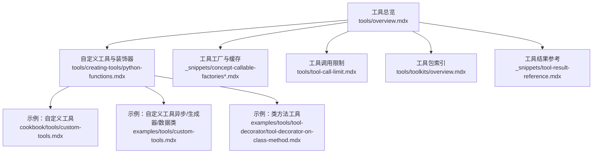
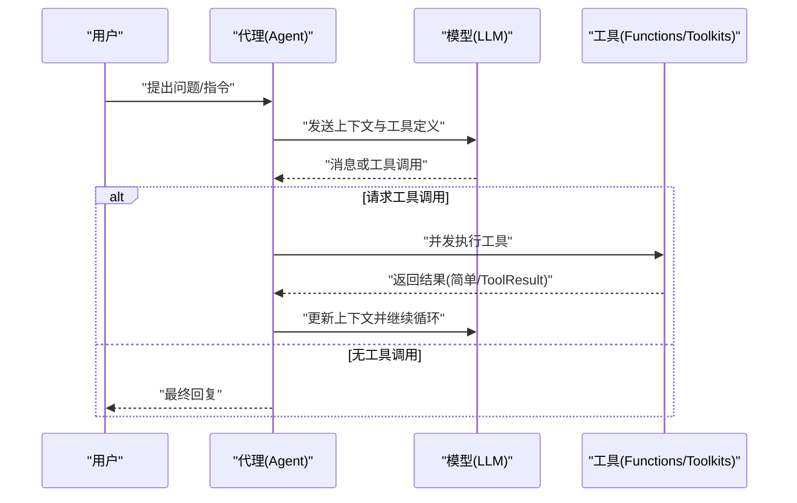
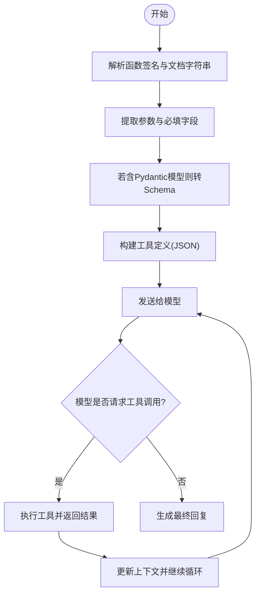
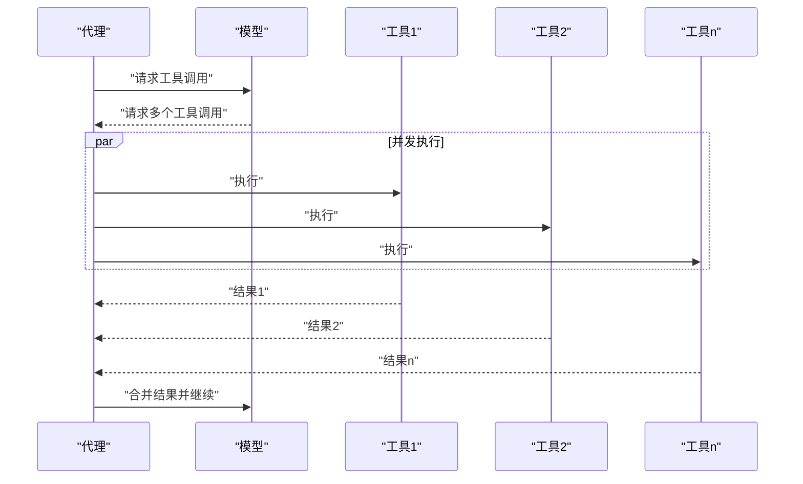
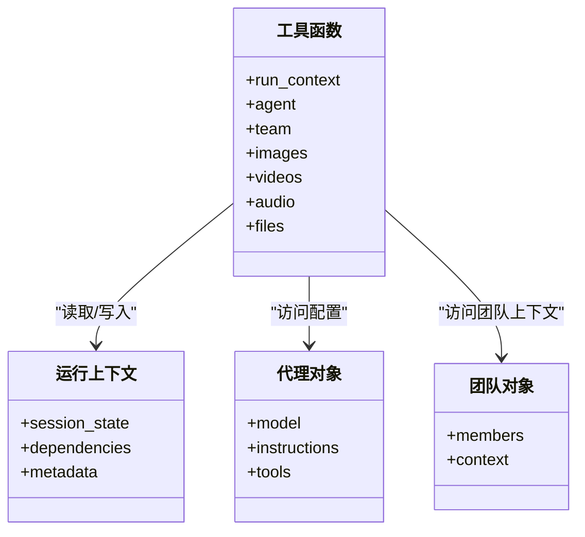
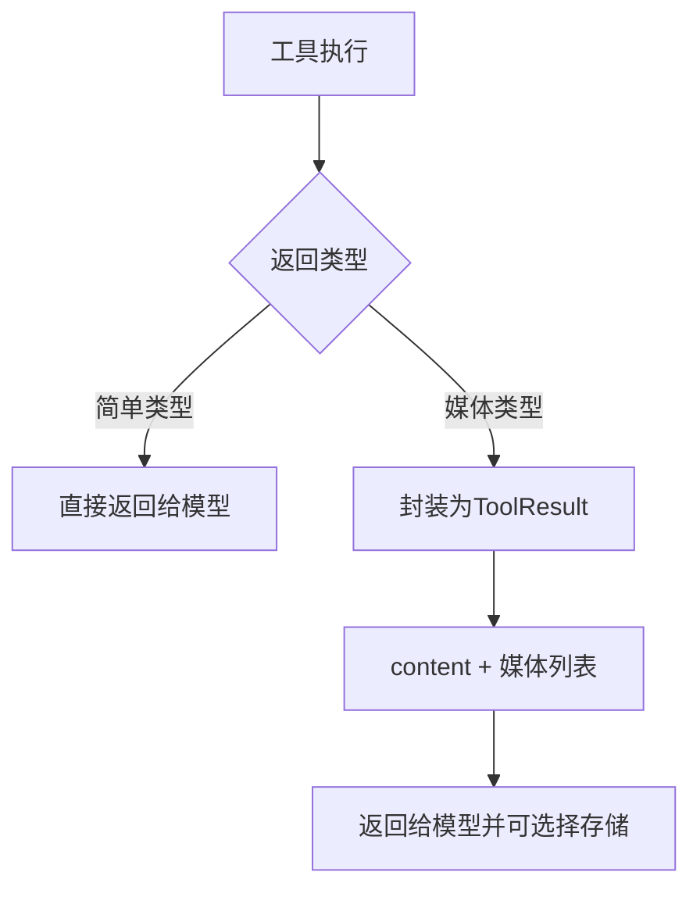
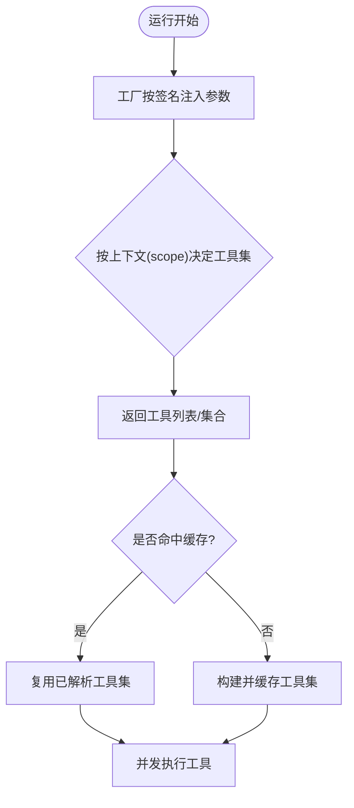
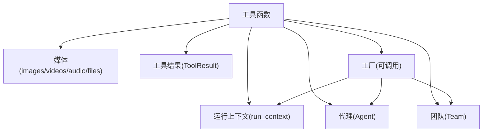

# 工具基础概念

<cite>
**本文引用的文件**
- [tools/overview.mdx](file://tools/overview.mdx)
- [tools/creating-tools/python-functions.mdx](file://tools/creating-tools/python-functions.mdx)
- [_snippets/concept-callable-factories.mdx](file://_snippets/concept-callable-factories.mdx)
- [_snippets/concept-callable-factories-caching.mdx](file://_snippets/concept-callable-factories-caching.mdx)
- [tools/tool-call-limit.mdx](file://tools/tool-call-limit.mdx)
- [cookbook/tools/custom-tools.mdx](file://cookbook/tools/custom-tools.mdx)
- [examples/tools/custom-tools.mdx](file://examples/tools/custom-tools.mdx)
- [examples/tools/tool-decorator/tool-decorator-on-class-method.mdx](file://examples/tools/tool-decorator/tool-decorator-on-class-method.mdx)
- [tools/toolkits/overview.mdx](file://tools/toolkits/overview.mdx)
- [_snippets/tool-result-reference.mdx](file://_snippets/tool-result-reference.mdx)
</cite>

## 目录
1. [简介](#简介)
2. [项目结构](#项目结构)
3. [核心组件](#核心组件)
4. [架构总览](#架构总览)
5. [详细组件分析](#详细组件分析)
6. [依赖关系分析](#依赖关系分析)
7. [性能考量](#性能考量)
8. [故障排查指南](#故障排查指南)
9. [结论](#结论)
10. [附录](#附录)

## 简介
本篇文档围绕智能代理系统中的“工具”基础概念展开，系统阐述工具如何让代理具备真实世界行动能力：通过与外部系统交互（如网络检索、数据库查询、邮件发送等）完成实际操作。文档重点覆盖以下主题：
- LLM 循环中的工具调用流程
- 工具定义的自动转换机制（函数签名与文档字符串到模型可用的工具定义）
- 工具执行的并发处理策略
- 内置参数系统（run_context、agent、team、媒体参数）的使用方法
- 工具结果类型（从简单返回值到 ToolResult 媒体内容）
- 工具工厂模式与动态配置
- 实际示例路径（以源码片段路径代替具体代码）

## 项目结构
本仓库中与“工具”直接相关的内容主要分布在如下位置：
- 工具总览与使用说明：tools/overview.mdx
- 自定义工具与装饰器：tools/creating-tools/python-functions.mdx、cookbook/tools/custom-tools.mdx、examples/tools/custom-tools.mdx
- 工具工厂与缓存：_snippets/concept-callable-factories.mdx、_snippets/concept-callable-factories-caching.mdx
- 工具调用限制：tools/tool-call-limit.mdx
- 工具包索引：tools/toolkits/overview.mdx
- 工具结果参考：_snippets/tool-result-reference.mdx
- 类方法工具示例：examples/tools/tool-decorator/tool-decorator-on-class-method.mdx

**图表来源**
- [tools/overview.mdx:1-566](file://tools/overview.mdx#L1-L566)
- [tools/creating-tools/python-functions.mdx:1-143](file://tools/creating-tools/python-functions.mdx#L1-L143)
- [_snippets/concept-callable-factories.mdx:1-8](file://_snippets/concept-callable-factories.mdx#L1-L8)
- [_snippets/concept-callable-factories-caching.mdx:1-16](file://_snippets/concept-callable-factories-caching.mdx#L1-L16)
- [tools/tool-call-limit.mdx:1-35](file://tools/tool-call-limit.mdx#L1-L35)
- [tools/toolkits/overview.mdx:1-800](file://tools/toolkits/overview.mdx#L1-L800)
- [_snippets/tool-result-reference.mdx:1-6](file://_snippets/tool-result-reference.mdx#L1-L6)
- [cookbook/tools/custom-tools.mdx:1-194](file://cookbook/tools/custom-tools.mdx#L1-L194)
- [examples/tools/custom-tools.mdx:1-202](file://examples/tools/custom-tools.mdx#L1-L202)
- [examples/tools/tool-decorator/tool-decorator-on-class-method.mdx:1-124](file://examples/tools/tool-decorator/tool-decorator-on-class-method.mdx#L1-L124)

**章节来源**
- [tools/overview.mdx:1-566](file://tools/overview.mdx#L1-L566)
- [tools/creating-tools/python-functions.mdx:1-143](file://tools/creating-tools/python-functions.mdx#L1-L143)
- [_snippets/concept-callable-factories.mdx:1-8](file://_snippets/concept-callable-factories.mdx#L1-L8)
- [_snippets/concept-callable-factories-caching.mdx:1-16](file://_snippets/concept-callable-factories-caching.mdx#L1-L16)
- [tools/tool-call-limit.mdx:1-35](file://tools/tool-call-limit.mdx#L1-L35)
- [tools/toolkits/overview.mdx:1-800](file://tools/toolkits/overview.mdx#L1-L800)
- [_snippets/tool-result-reference.mdx:1-6](file://_snippets/tool-result-reference.mdx#L1-L6)
- [cookbook/tools/custom-tools.mdx:1-194](file://cookbook/tools/custom-tools.mdx#L1-L194)
- [examples/tools/custom-tools.mdx:1-202](file://examples/tools/custom-tools.mdx#L1-L202)
- [examples/tools/tool-decorator/tool-decorator-on-class-method.mdx:1-124](file://examples/tools/tool-decorator/tool-decorator-on-class-method.mdx#L1-L124)

## 核心组件
- 工具定义与自动转换
  - Agno 将 Python 函数及其文档字符串自动转换为模型可理解的工具定义（JSON Schema），描述名称、参数与返回类型；支持 Pydantic 模型作为参数自动转义。
  - 示例路径：[tools/overview.mdx:59-154](file://tools/overview.mdx#L59-L154)
- 工具执行与并发
  - 当模型请求多个工具调用时，使用异步运行方式可在同一轮响应中并发执行多个工具，显著提升长耗时任务的吞吐与响应速度。
  - 示例路径：[tools/overview.mdx:156-174](file://tools/overview.mdx#L156-L174)
- 内置参数系统
  - run_context：访问会话状态、依赖、元数据等
  - agent/team：直接获取代理或团队实例
  - 媒体参数：images/videos/audio/files，支持媒体输入与输出控制
  - 示例路径：[tools/overview.mdx:267-350](file://tools/overview.mdx#L267-L350)、[tools/creating-tools/python-functions.mdx:46-77](file://tools/creating-tools/python-functions.mdx#L46-L77)
- 工具结果类型
  - 简单返回类型：字符串、整数、浮点、字典、列表等
  - 媒体内容：必须使用 ToolResult 返回图像/视频/音频等产物
  - 示例路径：[tools/overview.mdx:352-418](file://tools/overview.mdx#L352-L418)、[_snippets/tool-result-reference.mdx:1-6](file://_snippets/tool-result-reference.mdx#L1-L6)
- 工具工厂模式与动态配置
  - 使用可调用工厂按运行上下文动态注入工具集，支持基于 agent/team、run_context、session_state 的签名注入，并可启用缓存以优化性能
  - 示例路径：[tools/overview.mdx:419-520](file://tools/overview.mdx#L419-L520)、[_snippets/concept-callable-factories.mdx:1-8](file://_snippets/concept-callable-factories.mdx#L1-L8)、[_snippets/concept-callable-factories-caching.mdx:1-16](file://_snippets/concept-callable-factories-caching.mdx#L1-L16)
- 工具装饰器与高级特性
  - 支持确认前置、用户输入、外部执行、显示结果、停止后续对话、工具钩子、结果缓存等
  - 示例路径：[tools/creating-tools/python-functions.mdx:79-143](file://tools/creating-tools/python-functions.mdx#L79-L143)、[cookbook/tools/custom-tools.mdx:167-177](file://cookbook/tools/custom-tools.mdx#L167-L177)
- 工具包与工具集合
  - 提供 120+ 预置工具包，涵盖搜索、社交、网页抓取、数据库、本地能力、模型原生能力等
  - 示例路径：[tools/toolkits/overview.mdx:1-800](file://tools/toolkits/overview.mdx#L1-L800)

**章节来源**
- [tools/overview.mdx:59-174](file://tools/overview.mdx#L59-L174)
- [tools/creating-tools/python-functions.mdx:46-143](file://tools/creating-tools/python-functions.mdx#L46-L143)
- [_snippets/tool-result-reference.mdx:1-6](file://_snippets/tool-result-reference.mdx#L1-L6)
- [_snippets/concept-callable-factories.mdx:1-8](file://_snippets/concept-callable-factories.mdx#L1-L8)
- [_snippets/concept-callable-factories-caching.mdx:1-16](file://_snippets/concept-callable-factories-caching.mdx#L1-L16)
- [tools/tool-call-limit.mdx:1-35](file://tools/tool-call-limit.mdx#L1-L35)
- [tools/toolkits/overview.mdx:1-800](file://tools/toolkits/overview.mdx#L1-L800)

## 架构总览
下图展示了 LLM 循环中工具调用的关键步骤，以及工具定义自动转换、并发执行与结果返回的总体流程。

**图表来源**
- [tools/overview.mdx:50-58](file://tools/overview.mdx#L50-L58)
- [tools/overview.mdx:156-174](file://tools/overview.mdx#L156-L174)

## 详细组件分析

### 组件一：工具定义与自动转换
- 自动转换规则
  - 从函数签名与文档字符串提取工具名称、描述、参数与返回类型
  - 文档字符串中的“Args”段落用于生成参数属性与必填字段
  - 支持 Pydantic 模型参数自动转为 JSON Schema
- 典型流程
  - 定义函数 → Agno 解析签名与 docstring → 生成工具定义 → 发送给模型 → 模型根据定义发起工具调用 → 执行工具并返回结果

**图表来源**
- [tools/overview.mdx:59-154](file://tools/overview.mdx#L59-L154)

**章节来源**
- [tools/overview.mdx:59-154](file://tools/overview.mdx#L59-L154)

### 组件二：工具执行与并发处理
- 并发执行前提
  - 需要支持并行函数调用的模型（例如 OpenAI 的 parallel_tool_calls）
- 并发行为
  - 在一次响应中同时触发多个工具调用时，Agno 会在后台并发执行这些工具
  - 对同步工具，将在独立线程中并发执行
- 性能收益
  - 显著降低长耗时工具串行等待带来的整体延迟

**图表来源**
- [tools/overview.mdx:156-174](file://tools/overview.mdx#L156-L174)

**章节来源**
- [tools/overview.mdx:156-174](file://tools/overview.mdx#L156-L174)

### 组件三：内置参数系统
- run_context：访问会话状态、依赖、元数据等，便于跨轮次持久化与共享
- agent/team：直接获取代理或团队实例，读取其配置与状态
- 媒体参数：images/videos/audio/files，支持对输入媒体进行处理与输出控制
- 使用建议
  - 在需要跨轮次保存状态或读取团队配置时优先使用内置参数
  - 处理图片/视频/音频等媒体时，统一通过媒体参数传入与传出

**图表来源**
- [tools/overview.mdx:267-350](file://tools/overview.mdx#L267-L350)
- [tools/creating-tools/python-functions.mdx:46-77](file://tools/creating-tools/python-functions.mdx#L46-L77)

**章节来源**
- [tools/overview.mdx:267-350](file://tools/overview.mdx#L267-L350)
- [tools/creating-tools/python-functions.mdx:46-77](file://tools/creating-tools/python-functions.mdx#L46-L77)

### 组件四：工具结果类型与 ToolResult
- 简单返回类型
  - 字符串、整数、浮点、字典、列表等，直接作为工具结果返回
- 媒体内容
  - 必须使用 ToolResult 包裹内容与媒体对象（图像/视频/音频），以便模型接收与存储
- 参数说明
  - content：文本内容
  - images/videos/audios：媒体产物列表

**图表来源**
- [tools/overview.mdx:352-418](file://tools/overview.mdx#L352-L418)
- [_snippets/tool-result-reference.mdx:1-6](file://_snippets/tool-result-reference.mdx#L1-L6)

**章节来源**
- [tools/overview.mdx:352-418](file://tools/overview.mdx#L352-L418)
- [_snippets/tool-result-reference.mdx:1-6](file://_snippets/tool-result-reference.mdx#L1-L6)

### 组件五：工具工厂模式与动态配置
- 动态工厂
  - 通过可调用工厂在运行时按上下文注入工具集，支持基于 user_id/session_id 的缓存
- 注入参数
  - 自动注入 agent/team、run_context、session_state 等参数
- 缓存策略
  - 可启用缓存并自定义键，避免重复解析与初始化
- 应用场景
  - 不同角色用户可见工具集不同
  - 基于会话记忆定制工具行为

**图表来源**
- [tools/overview.mdx:419-520](file://tools/overview.mdx#L419-L520)
- [_snippets/concept-callable-factories.mdx:1-8](file://_snippets/concept-callable-factories.mdx#L1-L8)
- [_snippets/concept-callable-factories-caching.mdx:1-16](file://_snippets/concept-callable-factories-caching.mdx#L1-L16)

**章节来源**
- [tools/overview.mdx:419-520](file://tools/overview.mdx#L419-L520)
- [_snippets/concept-callable-factories.mdx:1-8](file://_snippets/concept-callable-factories.mdx#L1-L8)
- [_snippets/concept-callable-factories-caching.mdx:1-16](file://_snippets/concept-callable-factories-caching.mdx#L1-L16)

### 组件六：工具装饰器与高级功能
- 装饰器选项
  - requires_confirmation：执行前要求确认
  - requires_user_input：执行前要求用户提供字段
  - external_execution：在代理外部执行
  - show_result：是否向用户展示结果
  - stop_after_tool_call：工具执行后停止
  - tool_hooks：前后钩子
  - cache_results：结果缓存
- 示例路径
  - 基础装饰器用法与高级选项：[tools/creating-tools/python-functions.mdx:79-143](file://tools/creating-tools/python-functions.mdx#L79-L143)
  - 工具选项一览：[cookbook/tools/custom-tools.mdx:167-177](file://cookbook/tools/custom-tools.mdx#L167-L177)

**章节来源**
- [tools/creating-tools/python-functions.mdx:79-143](file://tools/creating-tools/python-functions.mdx#L79-L143)
- [cookbook/tools/custom-tools.mdx:167-177](file://cookbook/tools/custom-tools.mdx#L167-L177)

### 组件七：工具包与工具集合
- 工具包索引
  - 涵盖搜索、社交、网页抓取、数据库、本地能力、模型原生能力等类别
- 使用方式
  - 直接将工具包实例加入代理的 tools 列表，即可获得对应能力

**章节来源**
- [tools/toolkits/overview.mdx:1-800](file://tools/toolkits/overview.mdx#L1-L800)

### 组件八：工具调用限制
- 目的
  - 防止无限循环、控制成本与性能
- 用法
  - 初始化 Agent 或 Team 时设置 tool_call_limit
- 行为
  - 若一次性请求超过限制，将只执行允许数量的工具调用
  - 限制作用于整次运行而非单次请求

**章节来源**
- [tools/tool-call-limit.mdx:1-35](file://tools/tool-call-limit.mdx#L1-L35)

### 组件九：示例与最佳实践
- 自定义工具（函数/异步/生成器/数据类/Pydantic）
  - 示例路径：[examples/tools/custom-tools.mdx:1-202](file://examples/tools/custom-tools.mdx#L1-L202)、[cookbook/tools/custom-tools.mdx:1-194](file://cookbook/tools/custom-tools.mdx#L1-L194)
- 类方法工具（带状态）
  - 示例路径：[examples/tools/tool-decorator/tool-decorator-on-class-method.mdx:1-124](file://examples/tools/tool-decorator/tool-decorator-on-class-method.mdx#L1-L124)

**章节来源**
- [examples/tools/custom-tools.mdx:1-202](file://examples/tools/custom-tools.mdx#L1-L202)
- [cookbook/tools/custom-tools.mdx:1-194](file://cookbook/tools/custom-tools.mdx#L1-L194)
- [examples/tools/tool-decorator/tool-decorator-on-class-method.mdx:1-124](file://examples/tools/tool-decorator/tool-decorator-on-class-method.mdx#L1-L124)

## 依赖关系分析
- 工具与模型
  - 工具定义由 Agno 自动生成并发送给模型；模型据此发起工具调用
- 工具与运行上下文
  - 工具可通过 run_context 访问会话状态与依赖，实现跨轮次持久化
- 工具与代理/团队
  - 工具可直接访问 agent/team，读取其配置与状态
- 工具与媒体
  - 媒体参数用于输入与输出媒体，ToolResult 用于承载媒体产物
- 工具与工厂
  - 工厂按上下文动态注入工具集，支持缓存与签名注入

**图表来源**
- [tools/overview.mdx:267-350](file://tools/overview.mdx#L267-L350)
- [tools/overview.mdx:419-520](file://tools/overview.mdx#L419-L520)
- [_snippets/tool-result-reference.mdx:1-6](file://_snippets/tool-result-reference.mdx#L1-L6)

**章节来源**
- [tools/overview.mdx:267-350](file://tools/overview.mdx#L267-L350)
- [tools/overview.mdx:419-520](file://tools/overview.mdx#L419-L520)
- [_snippets/tool-result-reference.mdx:1-6](file://_snippets/tool-result-reference.mdx#L1-L6)

## 性能考量
- 并发执行工具
  - 在支持并行函数调用的模型上，使用异步运行方式可显著缩短长耗时工具的总耗时
- 结果缓存
  - 启用工具结果缓存可避免重复计算，适用于昂贵或幂等的工具调用
- 工具工厂缓存
  - 按 user_id/session_id 或自定义键缓存工具集，减少重复解析与初始化开销
- 工具调用限制
  - 合理设置 tool_call_limit，避免无限循环与资源浪费

[本节为通用指导，不直接分析具体文件]

## 故障排查指南
- 工具未被识别
  - 确认函数具备清晰的文档字符串与参数注释，以便自动转换为工具定义
  - 参考：[tools/overview.mdx:59-154](file://tools/overview.mdx#L59-L154)
- 工具未并发执行
  - 确认使用的模型支持并行函数调用；检查运行方式是否为异步
  - 参考：[tools/overview.mdx:156-174](file://tools/overview.mdx#L156-L174)
- 媒体未返回给模型
  - 使用 ToolResult 包裹媒体内容，并确保启用了媒体发送与存储
  - 参考：[tools/overview.mdx:352-418](file://tools/overview.mdx#L352-L418)、[_snippets/tool-result-reference.mdx:1-6](file://_snippets/tool-result-reference.mdx#L1-L6)
- 工具集未按角色变化
  - 检查工厂是否正确注入 agent/team、run_context、session_state，并开启缓存
  - 参考：[tools/overview.mdx:419-520](file://tools/overview.mdx#L419-L520)、[_snippets/concept-callable-factories.mdx:1-8](file://_snippets/concept-callable-factories.mdx#L1-L8)、[_snippets/concept-callable-factories-caching.mdx:1-16](file://_snippets/concept-callable-factories-caching.mdx#L1-L16)
- 工具调用过多导致成本高
  - 设置 tool_call_limit 控制最大调用次数
  - 参考：[tools/tool-call-limit.mdx:1-35](file://tools/tool-call-limit.mdx#L1-L35)

**章节来源**
- [tools/overview.mdx:59-174](file://tools/overview.mdx#L59-L174)
- [tools/overview.mdx:352-418](file://tools/overview.mdx#L352-L418)
- [_snippets/tool-result-reference.mdx:1-6](file://_snippets/tool-result-reference.mdx#L1-L6)
- [tools/overview.mdx:419-520](file://tools/overview.mdx#L419-L520)
- [_snippets/concept-callable-factories.mdx:1-8](file://_snippets/concept-callable-factories.mdx#L1-L8)
- [_snippets/concept-callable-factories-caching.mdx:1-16](file://_snippets/concept-callable-factories-caching.mdx#L1-L16)
- [tools/tool-call-limit.mdx:1-35](file://tools/tool-call-limit.mdx#L1-L35)

## 结论
工具是智能代理系统连接现实世界的关键桥梁。通过自动化的工具定义转换、并发执行策略、内置参数系统、灵活的结果类型与工厂模式，Agno 为代理提供了强大的外部交互能力与可扩展性。合理运用装饰器、缓存与调用限制，可以在保证安全与可控的前提下最大化工具的实用价值。

[本节为总结性内容，不直接分析具体文件]

## 附录
- 实际示例路径（以源码片段路径代替具体代码）
  - 基础工具与装饰器：[tools/creating-tools/python-functions.mdx:79-143](file://tools/creating-tools/python-functions.mdx#L79-L143)
  - 自定义工具示例（函数/异步/生成器/数据类/Pydantic）：[examples/tools/custom-tools.mdx:1-202](file://examples/tools/custom-tools.mdx#L1-L202)、[cookbook/tools/custom-tools.mdx:1-194](file://cookbook/tools/custom-tools.mdx#L1-L194)
  - 类方法工具（带状态）：[examples/tools/tool-decorator/tool-decorator-on-class-method.mdx:1-124](file://examples/tools/tool-decorator/tool-decorator-on-class-method.mdx#L1-L124)
  - 工具包索引：[tools/toolkits/overview.mdx:1-800](file://tools/toolkits/overview.mdx#L1-L800)
  - 工具调用限制：[tools/tool-call-limit.mdx:1-35](file://tools/tool-call-limit.mdx#L1-L35)
  - 工具结果参考：[_snippets/tool-result-reference.mdx:1-6](file://_snippets/tool-result-reference.mdx#L1-L6)
  - 工具工厂与缓存：[tools/overview.mdx:419-520](file://tools/overview.mdx#L419-L520)、[_snippets/concept-callable-factories.mdx:1-8](file://_snippets/concept-callable-factories.mdx#L1-L8)、[_snippets/concept-callable-factories-caching.mdx:1-16](file://_snippets/concept-callable-factories-caching.mdx#L1-L16)