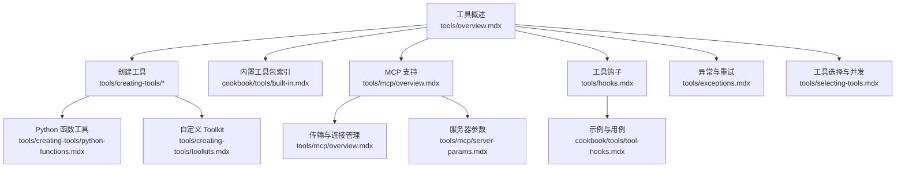
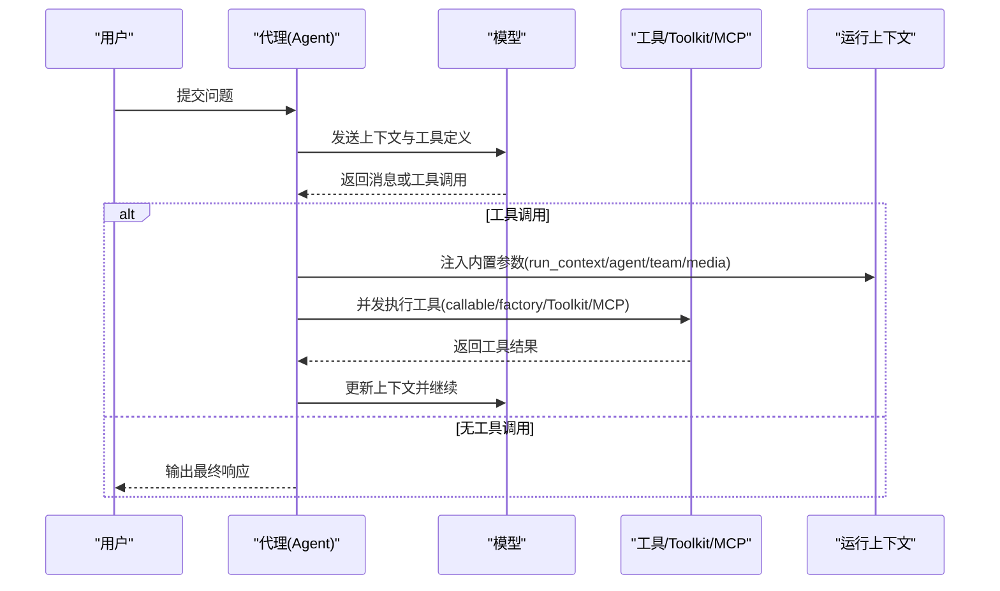
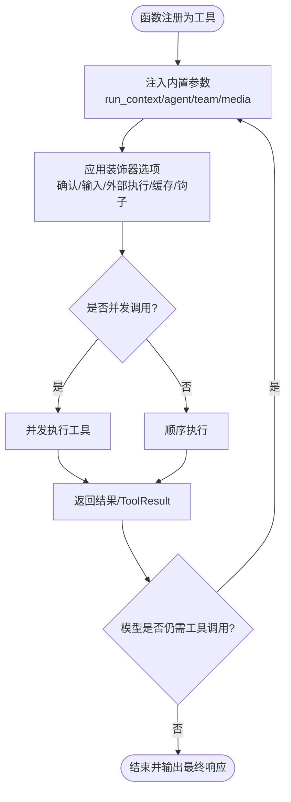
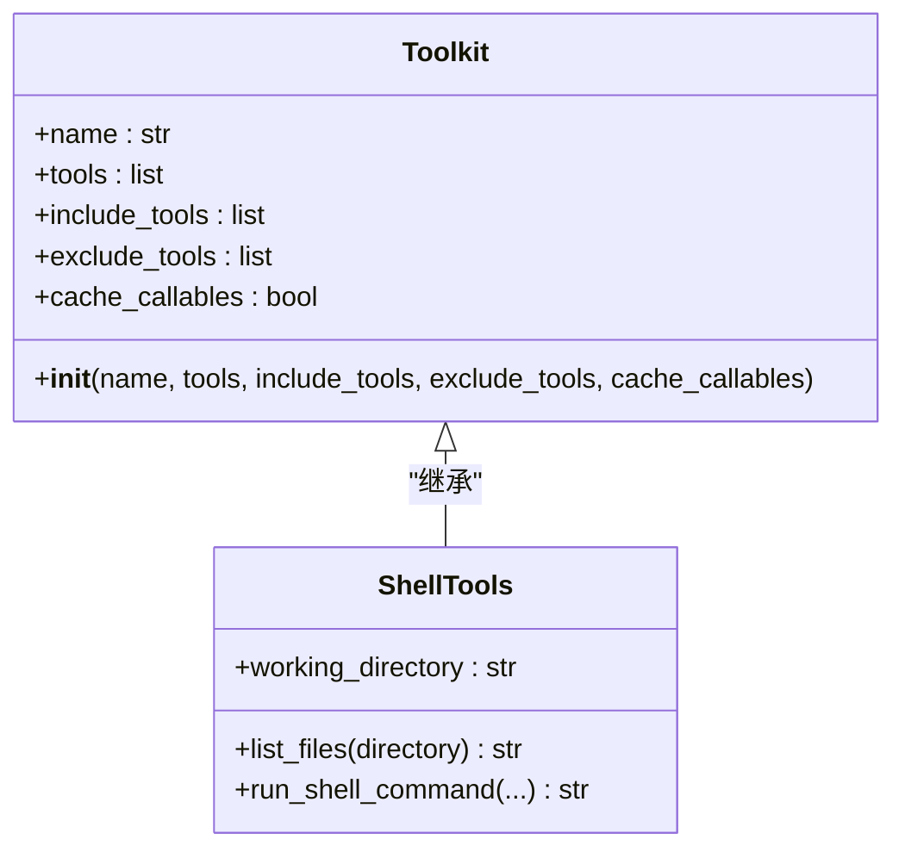
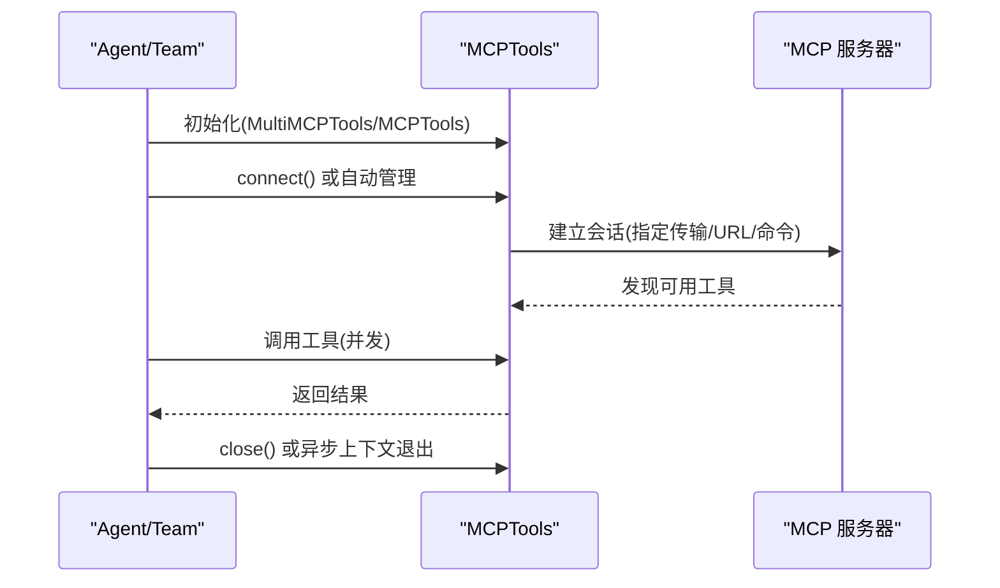
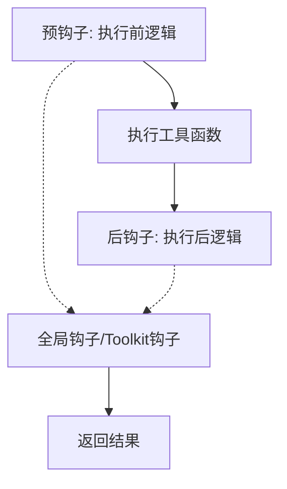
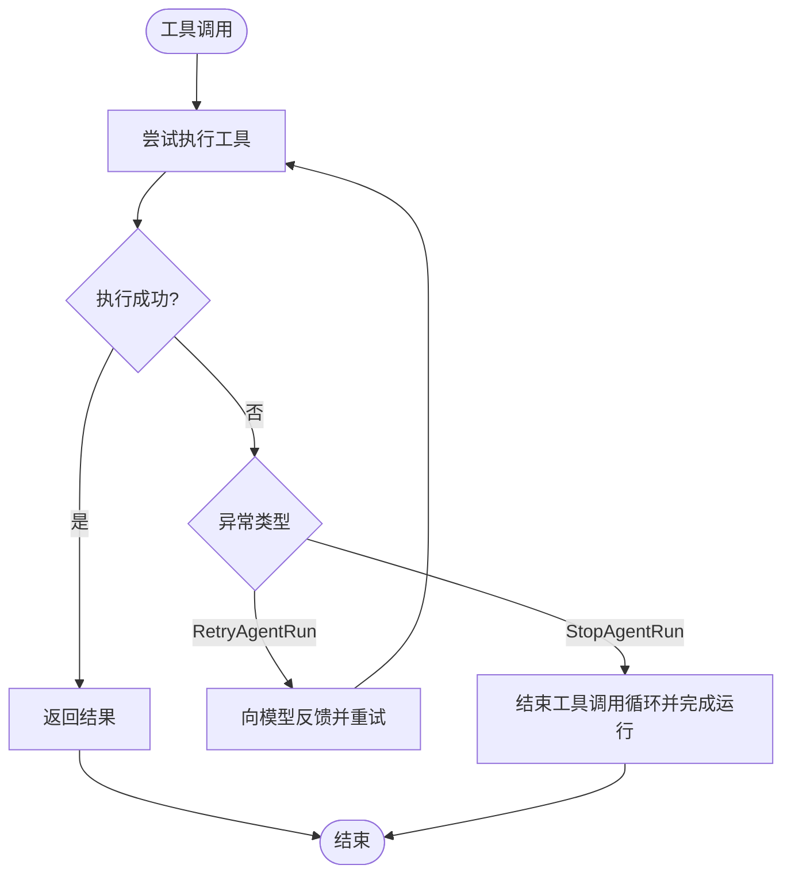
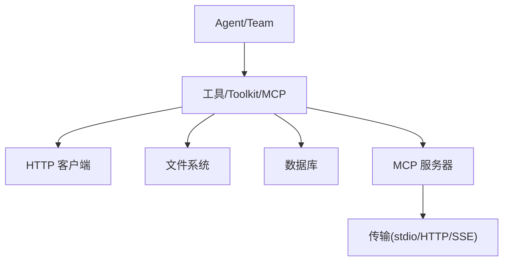

# 工具系统

<cite>
**本文引用的文件**   
- [tools/overview.mdx](file://tools/overview.mdx)
- [cookbook/tools/built-in.mdx](file://cookbook/tools/built-in.mdx)
- [tools/creating-tools/overview.mdx](file://tools/creating-tools/overview.mdx)
- [tools/creating-tools/python-functions.mdx](file://tools/creating-tools/python-functions.mdx)
- [tools/creating-tools/toolkits.mdx](file://tools/creating-tools/toolkits.mdx)
- [tools/mcp/overview.mdx](file://tools/mcp/overview.mdx)
- [tools/mcp/server-params.mdx](file://tools/mcp/server-params.mdx)
- [tools/hooks.mdx](file://tools/hooks.mdx)
- [cookbook/tools/tool-hooks.mdx](file://cookbook/tools/tool-hooks.mdx)
- [tools/exceptions.mdx](file://tools/exceptions.mdx)
- [tools/selecting-tools.mdx](file://tools/selecting-tools.mdx)
- [tools/async-tools.mdx](file://tools/async-tools.mdx)
- [agent-os/mcp/tools.mdx](file://agent-os/mcp/tools.mdx)
- [reference/tools/toolkit.mdx](file://reference/tools/toolkit.mdx)
</cite>

## 目录
1. [简介](#简介)
2. [项目结构](#项目结构)
3. [核心组件](#核心组件)
4. [架构总览](#架构总览)
5. [详细组件分析](#详细组件分析)
6. [依赖关系分析](#依赖关系分析)
7. [性能考量](#性能考量)
8. [故障排查指南](#故障排查指南)
9. [结论](#结论)
10. [附录](#附录)

## 简介
本文件系统性阐述工具系统的核心概念、实现方式与最佳实践，覆盖以下主题：
- 工具的定义、分类与在智能代理中的作用
- 工具创建指南：Python 函数工具、类方法工具（自定义 Toolkit）、以及装饰器增强
- 工具包集合：100+ 预构建工具的分类与使用方法
- MCP 协议支持：服务器配置、工具发现与远程工具调用
- 使用模式：代理工具、团队工具、工作流工具的应用场景
- 工具装饰器：缓存、重试、停止控制等能力
- 工具钩子系统：预钩子、后钩子与工具级钩子
- 异步工具、异常处理与工具选择限制的实际示例

## 项目结构
工具系统文档分布在多个章节中，围绕“工具概述”“创建工具”“内置工具包”“MCP 支持”“钩子与异常”“选择与并发”等维度组织。

**图表来源**
- [tools/overview.mdx:1-566](file://tools/overview.mdx#L1-L566)
- [tools/creating-tools/overview.mdx:1-27](file://tools/creating-tools/overview.mdx#L1-L27)
- [cookbook/tools/built-in.mdx:1-235](file://cookbook/tools/built-in.mdx#L1-L235)
- [tools/mcp/overview.mdx:1-257](file://tools/mcp/overview.mdx#L1-L257)
- [tools/hooks.mdx:1-188](file://tools/hooks.mdx#L1-L188)
- [cookbook/tools/tool-hooks.mdx:180-209](file://cookbook/tools/tool-hooks.mdx#L180-L209)
- [tools/exceptions.mdx:1-112](file://tools/exceptions.mdx#L1-L112)
- [tools/selecting-tools.mdx:1-56](file://tools/selecting-tools.mdx#L1-L56)

**章节来源**
- [tools/overview.mdx:1-566](file://tools/overview.mdx#L1-L566)
- [cookbook/tools/built-in.mdx:1-235](file://cookbook/tools/built-in.mdx#L1-L235)

## 核心组件
- 工具与工具函数：任何可调用的 Python 函数均可作为工具；通过装饰器增强行为（确认、用户输入、外部执行、结果展示、停止控制、缓存、钩子）。
- Toolkit：封装一组协同工作的工具函数，共享内部状态，便于复用与管理。
- MCP 工具：通过标准化协议连接外部系统，支持多种传输（stdio、Streamable HTTP、SSE），具备连接生命周期管理与自动刷新机制。
- 钩子系统：在工具调用前后注入逻辑，支持全局、Toolkit 级与工具级钩子。
- 异常与重试：在工具调用循环内通过异常驱动反馈与终止，支持模型重试与运行结束。
- 工具选择与并发：支持按需包含/排除工具，异步并发执行以提升吞吐。

**章节来源**
- [tools/creating-tools/overview.mdx:1-27](file://tools/creating-tools/overview.mdx#L1-L27)
- [tools/creating-tools/python-functions.mdx:79-143](file://tools/creating-tools/python-functions.mdx#L79-L143)
- [tools/creating-tools/toolkits.mdx:1-43](file://tools/creating-tools/toolkits.mdx#L1-L43)
- [tools/mcp/overview.mdx:1-257](file://tools/mcp/overview.mdx#L1-L257)
- [tools/hooks.mdx:1-188](file://tools/hooks.mdx#L1-L188)
- [tools/exceptions.mdx:1-112](file://tools/exceptions.mdx#L1-L112)
- [tools/selecting-tools.mdx:1-56](file://tools/selecting-tools.mdx#L1-L56)

## 架构总览
下图展示了工具系统在智能代理中的典型交互流程：模型生成消息或工具调用 → 工具执行（可并发）→ 结果返回模型 → 循环直至无工具调用。

**图表来源**
- [tools/overview.mdx:50-175](file://tools/overview.mdx#L50-L175)
- [tools/creating-tools/python-functions.mdx:46-78](file://tools/creating-tools/python-functions.mdx#L46-L78)
- [tools/mcp/overview.mdx:26-74](file://tools/mcp/overview.mdx#L26-L74)

## 详细组件分析

### 工具与工具函数
- 定义与行为：任意 Python 函数可作为工具；通过装饰器可启用确认、用户输入、外部执行、结果展示、停止控制、缓存与钩子。
- 内置参数：run_context、agent、team、images/videos/audio/files 等，用于访问会话状态、依赖、元数据与媒体资源。
- 结果类型：简单类型或 ToolResult（含媒体时必须）。
- 可选工厂：基于运行上下文动态生成工具集，支持缓存与按用户/会话作用域定制。

**图表来源**
- [tools/creating-tools/python-functions.mdx:79-143](file://tools/creating-tools/python-functions.mdx#L79-L143)
- [tools/overview.mdx:267-351](file://tools/overview.mdx#L267-L351)
- [tools/overview.mdx:419-521](file://tools/overview.mdx#L419-L521)

**章节来源**
- [tools/creating-tools/python-functions.mdx:1-143](file://tools/creating-tools/python-functions.mdx#L1-L143)
- [tools/overview.mdx:267-351](file://tools/overview.mdx#L267-L351)
- [tools/overview.mdx:419-521](file://tools/overview.mdx#L419-L521)

### 自定义 Toolkit
- 设计目标：将相关工具聚合到类中，共享状态，提升开发体验。
- 实现步骤：继承 Toolkit 基类，将函数加入 tools 列表，构造时传入名称与工具列表。
- 全局与工具级钩子：父级钩子对所有子工具生效；可按需在工具上叠加钩子。

**图表来源**
- [tools/creating-tools/toolkits.mdx:1-43](file://tools/creating-tools/toolkits.mdx#L1-L43)
- [reference/tools/toolkit.mdx:1-17](file://reference/tools/toolkit.mdx#L1-L17)

**章节来源**
- [tools/creating-tools/toolkits.mdx:1-43](file://tools/creating-tools/toolkits.mdx#L1-L43)
- [reference/tools/toolkit.mdx:1-17](file://reference/tools/toolkit.mdx#L1-L17)

### 内置工具包集合（100+）
- 分类与示例：搜索工具（DuckDuckGo、Tavily、Exa、Brave、Serper、SerpAPI、Wikipedia、Arxiv、PubMed、HackerNews）、金融工具（YFinance、OpenBB、FinancialDatasets）、数据库工具（Postgres、DuckDB、Neo4j、SQL、CSV、Pandas、BigQuery、Redshift）、网络爬取（Firecrawl、Crawl4AI、Newspaper、Newspaper4k、Jina、Spider、Oxylabs、BrightData）、社交与通信（Slack、Discord、X(Twitter)、Reddit、Email、Gmail、Twilio、WhatsApp、Telegram、Webex）、生产力（Google Calendar、Google Sheets、Google Drive、Notion、Todoist、Trello、Linear、Jira、ClickUp、Confluence、Cal.com、Zoom）、开发者工具（GitHub、Bitbucket、Shell、Python、Docker、File、Airflow、AWS Lambda、E2B、Daytona）、AI 与媒体（DALL·E、Replicate、Fal、LumaLabs、ModelsLabs、ElevenLabs、Cartesia、MLX Transcribe、YouTube、Giphy、OpenCV）、实用工具（Calculator、Sleep、Weather、Maps、Visualization、WebBrowser）。
- 使用方法：导入对应 Toolkit，实例化并传入 Agent 的 tools 参数；部分工具支持 include_tools/exclude_tools 进行裁剪。

**章节来源**
- [cookbook/tools/built-in.mdx:23-235](file://cookbook/tools/built-in.mdx#L23-L235)

### MCP 协议支持
- 连接与生命周期：推荐显式 connect()/close() 或使用异步上下文管理器；在 AgentOS 中由框架自动管理生命周期。
- 连接刷新：设置 refresh_connection 在每次运行前检查并重建连接，刷新可用工具清单，适合托管服务器频繁重启或变更场景。
- 传输类型：stdio、Streamable HTTP、SSE；默认 stdio；可通过命令或 URL 指定服务器。
- 服务器参数：stdio 场景可使用 StdioServerParameters，包含 command、args、env 等键。
- AgentOS 集成：在 AgentOS 中使用 MCPTools 时无需手动连接/断开，但可按需刷新连接。

**图表来源**
- [tools/mcp/overview.mdx:129-212](file://tools/mcp/overview.mdx#L129-L212)
- [tools/mcp/server-params.mdx:1-24](file://tools/mcp/server-params.mdx#L1-L24)
- [agent-os/mcp/tools.mdx:46-56](file://agent-os/mcp/tools.mdx#L46-L56)

**章节来源**
- [tools/mcp/overview.mdx:1-257](file://tools/mcp/overview.mdx#L1-L257)
- [tools/mcp/server-params.mdx:1-24](file://tools/mcp/server-params.mdx#L1-L24)
- [agent-os/mcp/tools.mdx:46-56](file://agent-os/mcp/tools.mdx#L46-L56)

### 工具使用模式
- 代理工具：单体代理直接使用工具函数或 Toolkit，适用于点状任务与简单协作。
- 团队工具：多代理共享工具能力，适合需要分工与协作的复杂推理任务。
- 工作流工具：在多步骤流水线中编排工具调用，结合条件分支、并行执行与质量保障。

说明：本节为概念性总结，不直接分析具体文件。

### 工具装饰器与钩子系统
- 装饰器能力：requires_confirmation、requires_user_input、external_execution、show_result、stop_after_tool_call、tool_hooks、cache_results、cache_dir、cache_ttl 等。
- 钩子类型：预钩子（执行前）、后钩子（执行后）；支持全局（Agent/Team）、Toolkit 级与工具级叠加。
- 用例：日志记录、输入校验、结果转换、限流、缓存、审计、错误处理等。

**图表来源**
- [tools/creating-tools/python-functions.mdx:79-143](file://tools/creating-tools/python-functions.mdx#L79-L143)
- [tools/hooks.mdx:129-188](file://tools/hooks.mdx#L129-L188)
- [cookbook/tools/tool-hooks.mdx:180-209](file://cookbook/tools/tool-hooks.mdx#L180-L209)

**章节来源**
- [tools/creating-tools/python-functions.mdx:79-143](file://tools/creating-tools/python-functions.mdx#L79-L143)
- [tools/hooks.mdx:1-188](file://tools/hooks.mdx#L1-L188)
- [cookbook/tools/tool-hooks.mdx:180-209](file://cookbook/tools/tool-hooks.mdx#L180-L209)

### 异步工具、异常处理与工具选择限制
- 异步工具：使用异步函数作为工具，配合并发执行提升吞吐；在并发场景下工具可并行请求与执行。
- 异常与重试：在工具调用循环内抛出 RetryAgentRun 可向模型提供反馈并允许其调整策略；抛出 StopAgentRun 可立即结束工具调用循环并完成运行。
- 工具选择限制：通过 include_tools/exclude_tools 对 Toolkit 进行裁剪，减少暴露面并聚焦特定能力。

**图表来源**
- [tools/async-tools.mdx:1-6](file://tools/async-tools.mdx#L1-L6)
- [tools/exceptions.mdx:18-101](file://tools/exceptions.mdx#L18-L101)
- [tools/selecting-tools.mdx:8-24](file://tools/selecting-tools.mdx#L8-L24)

**章节来源**
- [tools/async-tools.mdx:1-6](file://tools/async-tools.mdx#L1-L6)
- [tools/exceptions.mdx:1-112](file://tools/exceptions.mdx#L1-L112)
- [tools/selecting-tools.mdx:1-56](file://tools/selecting-tools.mdx#L1-L56)

## 依赖关系分析
- 组件耦合：工具函数与 Toolkit 通过统一接口被代理调度；MCP 工具通过传输层与外部服务器解耦。
- 外部依赖：HTTP 客户端、文件系统、数据库、第三方 API；MCP 服务器与传输协议。
- 生命周期：MCP 连接需显式管理或由 AgentOS 自动管理；工具缓存与钩子可跨多次运行保持一致性。

**图表来源**
- [tools/overview.mdx:156-175](file://tools/overview.mdx#L156-L175)
- [tools/mcp/overview.mdx:212-218](file://tools/mcp/overview.mdx#L212-L218)

**章节来源**
- [tools/overview.mdx:156-175](file://tools/overview.mdx#L156-L175)
- [tools/mcp/overview.mdx:212-218](file://tools/mcp/overview.mdx#L212-L218)

## 性能考量
- 并发执行：在支持并行函数调用的模型上，工具并发可显著降低端到端延迟。
- 缓存策略：合理使用装饰器缓存与工具工厂缓存，避免重复计算与外部调用。
- 连接管理：避免在每次运行都建立/关闭 MCP 连接；必要时使用 refresh_connection 保证可用性。
- 工具裁剪：通过 include/exclude 控制工具集规模，减少模型上下文与工具定义复杂度。

## 故障排查指南
- MCP 连接失败：检查传输参数、URL/命令与环境变量；必要时开启连接刷新。
- 工具超时或不稳定：为工具添加重试与超时控制；在钩子中记录耗时与错误。
- 结果不符合预期：使用 pre/post 钩子进行输入/输出规范化；必要时抛出 RetryAgentRun 提示模型修正。
- 权限与鉴权：MCP 服务器可能需要认证令牌，确保绑定参数与获取器正确配置。

**章节来源**
- [tools/mcp/overview.mdx:191-211](file://tools/mcp/overview.mdx#L191-L211)
- [tools/exceptions.mdx:18-101](file://tools/exceptions.mdx#L18-L101)
- [tools/hooks.mdx:129-188](file://tools/hooks.mdx#L129-L188)

## 结论
工具系统通过“函数即工具”的简洁范式、可组合的 Toolkit、标准化的 MCP 协议与灵活的装饰器/钩子体系，为智能代理提供了强大的外部世界接入能力。结合并发执行、缓存与连接刷新等优化手段，可在生产环境中实现高可靠、高性能与易维护的工具链路。

## 附录
- 快速参考
  - 工具装饰器常用参数：requires_confirmation、requires_user_input、external_execution、show_result、stop_after_tool_call、tool_hooks、cache_results、cache_dir、cache_ttl。
  - MCP 服务器参数：command、url、transport、server_params（stdio 环境变量、参数、命令）。
  - 工具选择：include_tools/exclude_tools 用于裁剪 Toolkit 能力集。
  - 异常：RetryAgentRun（提示模型重试）、StopAgentRun（结束工具调用循环）。

**章节来源**
- [tools/creating-tools/python-functions.mdx:79-143](file://tools/creating-tools/python-functions.mdx#L79-L143)
- [tools/mcp/server-params.mdx:1-24](file://tools/mcp/server-params.mdx#L1-L24)
- [tools/selecting-tools.mdx:8-24](file://tools/selecting-tools.mdx#L8-L24)
- [tools/exceptions.mdx:18-101](file://tools/exceptions.mdx#L18-L101)