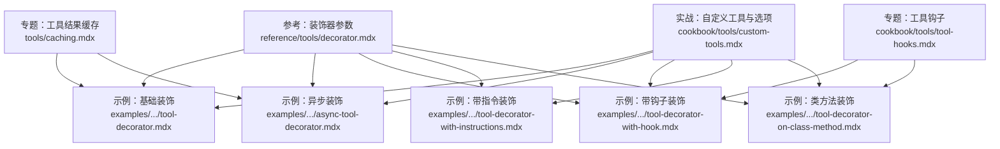
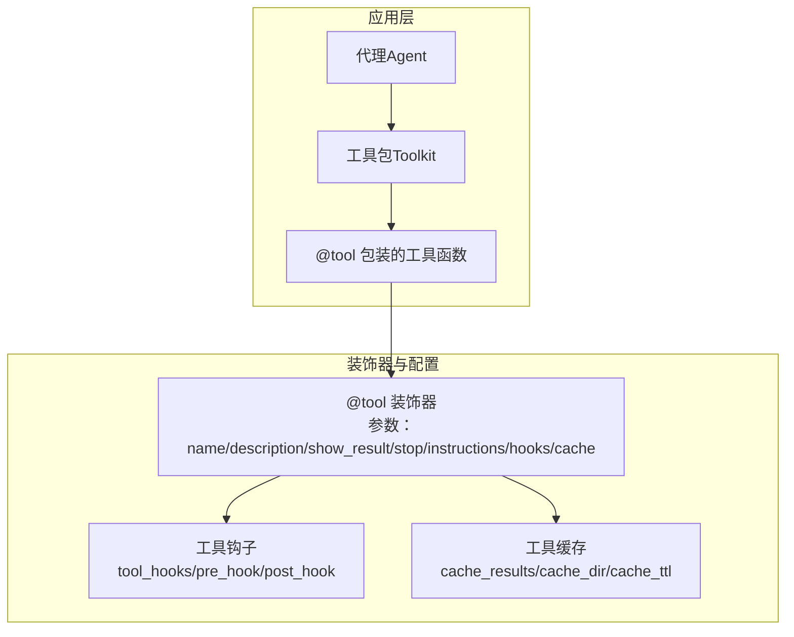
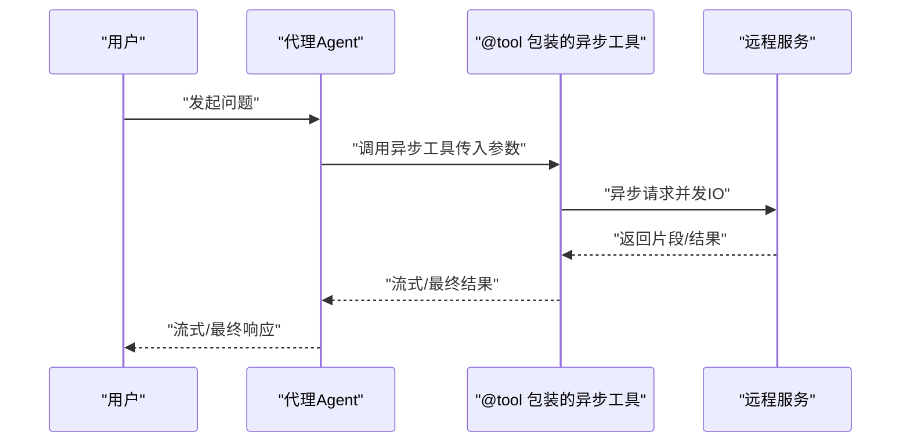
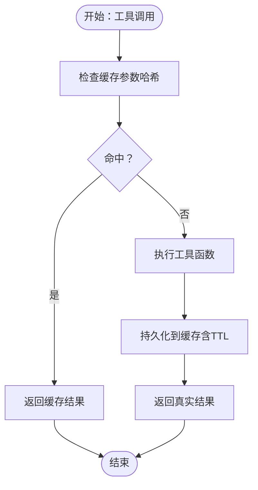
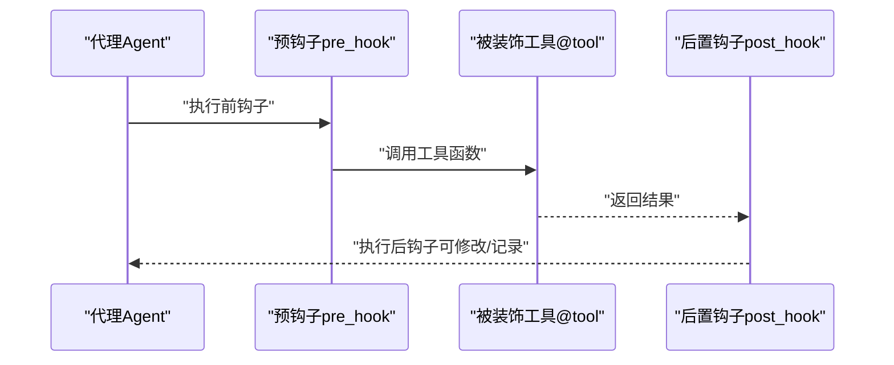
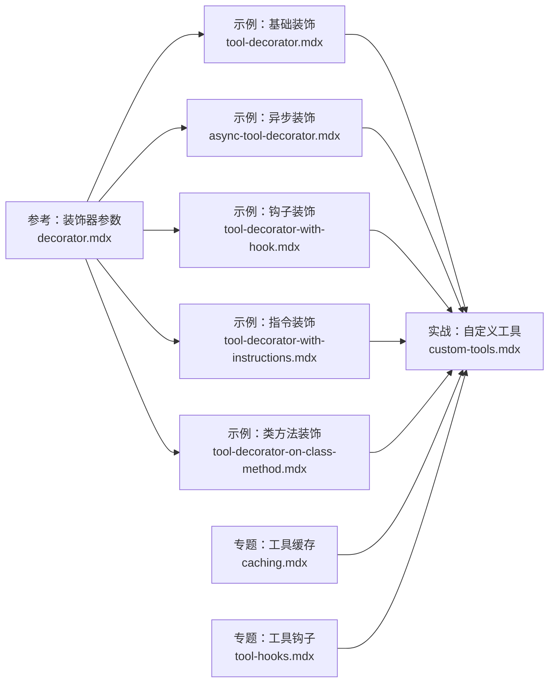

# 工具装饰器

<cite>
**本文引用的文件**
- [reference/tools/decorator.mdx](file://reference/tools/decorator.mdx)
- [examples/tools/tool-decorator/tool-decorator.mdx](file://examples/tools/tool-decorator/tool-decorator.mdx)
- [examples/tools/tool-decorator/async-tool-decorator.mdx](file://examples/tools/tool-decorator/async-tool-decorator.mdx)
- [examples/tools/tool-decorator/tool-decorator-with-hook.mdx](file://examples/tools/tool-decorator/tool-decorator-with-hook.mdx)
- [examples/tools/tool-decorator/tool-decorator-with-instructions.mdx](file://examples/tools/tool-decorator/tool-decorator-with-instructions.mdx)
- [examples/tools/tool-decorator/tool-decorator-on-class-method.mdx](file://examples/tools/tool-decorator/tool-decorator-on-class-method.mdx)
- [cookbook/tools/custom-tools.mdx](file://cookbook/tools/custom-tools.mdx)
- [tools/caching.mdx](file://tools/caching.mdx)
- [cookbook/tools/tool-hooks.mdx](file://cookbook/tools/tool-hooks.mdx)
</cite>

## 目录
1. [简介](#简介)
2. [项目结构](#项目结构)
3. [核心组件](#核心组件)
4. [架构总览](#架构总览)
5. [详细组件分析](#详细组件分析)
6. [依赖关系分析](#依赖关系分析)
7. [性能考虑](#性能考虑)
8. [故障排查指南](#故障排查指南)
9. [结论](#结论)
10. [附录](#附录)

## 简介
本篇文档系统化阐述“工具装饰器”的概念、作用与使用方式，围绕 @tool 装饰器展开，覆盖以下主题：
- 基础装饰与工具元数据：名称、描述、结果可见性等
- 异步工具装饰与并发执行控制
- 工具调用缓存：策略、失效与性能优化
- 停止代理运行装饰：工具执行后的代理控制与流程中断
- 带钩子的工具装饰：装饰器与工具钩子的组合使用
- 带指令的工具装饰：在装饰器中添加工具说明与使用指导
- 完整示例与最佳实践

## 项目结构
本仓库中与“工具装饰器”直接相关的内容主要分布在以下位置：
- 参考与参数说明：reference/tools/decorator.mdx
- 示例与用法：examples/tools/tool-decorator 下的多个示例
- 实战与进阶：cookbook/tools/custom-tools.mdx、cookbook/tools/tool-hooks.mdx
- 缓存专题：tools/caching.mdx

图表来源
- [reference/tools/decorator.mdx:1-22](file://reference/tools/decorator.mdx#L1-L22)
- [examples/tools/tool-decorator/tool-decorator.mdx:1-177](file://examples/tools/tool-decorator/tool-decorator.mdx#L1-L177)
- [examples/tools/tool-decorator/async-tool-decorator.mdx:1-77](file://examples/tools/tool-decorator/async-tool-decorator.mdx#L1-L77)
- [examples/tools/tool-decorator/tool-decorator-with-hook.mdx:1-84](file://examples/tools/tool-decorator/tool-decorator-with-hook.mdx#L1-L84)
- [examples/tools/tool-decorator/tool-decorator-with-instructions.mdx:1-80](file://examples/tools/tool-decorator/tool-decorator-with-instructions.mdx#L1-L80)
- [examples/tools/tool-decorator/tool-decorator-on-class-method.mdx:1-125](file://examples/tools/tool-decorator/tool-decorator-on-class-method.mdx#L1-L125)
- [cookbook/tools/custom-tools.mdx:1-194](file://cookbook/tools/custom-tools.mdx#L1-L194)
- [tools/caching.mdx:1-53](file://tools/caching.mdx#L1-L53)
- [cookbook/tools/tool-hooks.mdx:130-209](file://cookbook/tools/tool-hooks.mdx#L130-L209)

章节来源
- [reference/tools/decorator.mdx:1-22](file://reference/tools/decorator.mdx#L1-L22)
- [examples/tools/tool-decorator/tool-decorator.mdx:1-177](file://examples/tools/tool-decorator/tool-decorator.mdx#L1-L177)
- [examples/tools/tool-decorator/async-tool-decorator.mdx:1-77](file://examples/tools/tool-decorator/async-tool-decorator.mdx#L1-L77)
- [examples/tools/tool-decorator/tool-decorator-with-hook.mdx:1-84](file://examples/tools/tool-decorator/tool-decorator-with-hook.mdx#L1-L84)
- [examples/tools/tool-decorator/tool-decorator-with-instructions.mdx:1-80](file://examples/tools/tool-decorator/tool-decorator-with-instructions.mdx#L1-L80)
- [examples/tools/tool-decorator/tool-decorator-on-class-method.mdx:1-125](file://examples/tools/tool-decorator/tool-decorator-on-class-method.mdx#L1-L125)
- [cookbook/tools/custom-tools.mdx:1-194](file://cookbook/tools/custom-tools.mdx#L1-L194)
- [tools/caching.mdx:1-53](file://tools/caching.mdx#L1-L53)
- [cookbook/tools/tool-hooks.mdx:130-209](file://cookbook/tools/tool-hooks.mdx#L130-L209)

## 核心组件
- @tool 装饰器：用于将函数或类方法包装为可被代理使用的工具，并注入元数据与行为控制（如是否显示结果、是否停止代理、是否缓存、是否需要确认、是否需要用户输入、外部执行、指令、钩子等）
- 工具钩子（tool_hooks/pre_hook/post_hook）：在工具执行前后插入横切逻辑，支持日志、校验、限流、审计、缓存等
- 工具缓存（cache_results/cache_dir/cache_ttl）：对工具结果进行磁盘缓存，避免重复计算与外部调用
- 异步工具：支持 async 函数与异步迭代器，配合代理的异步执行能力
- 停止代理运行（stop_after_tool_call）：在工具执行后立即终止代理后续步骤

章节来源
- [reference/tools/decorator.mdx:7-22](file://reference/tools/decorator.mdx#L7-L22)
- [cookbook/tools/custom-tools.mdx:167-177](file://cookbook/tools/custom-tools.mdx#L167-L177)
- [tools/caching.mdx:13-53](file://tools/caching.mdx#L13-L53)
- [cookbook/tools/tool-hooks.mdx:183-194](file://cookbook/tools/tool-hooks.mdx#L183-L194)

## 架构总览
下图展示了“工具装饰器”在系统中的角色与交互：

图表来源
- [reference/tools/decorator.mdx:7-22](file://reference/tools/decorator.mdx#L7-L22)
- [cookbook/tools/custom-tools.mdx:167-177](file://cookbook/tools/custom-tools.mdx#L167-L177)
- [tools/caching.mdx:13-53](file://tools/caching.mdx#L13-L53)
- [cookbook/tools/tool-hooks.mdx:183-194](file://cookbook/tools/tool-hooks.mdx#L183-L194)

## 详细组件分析

### @tool 装饰器：参数与元数据
- 关键参数
  - 名称与描述：name、description
  - 结果可见性：show_result
  - 执行后停止：stop_after_tool_call
  - 指令与说明：instructions
  - 钩子：tool_hooks、pre_hook、post_hook
  - 用户交互：requires_confirmation、requires_user_input、user_input_fields
  - 外部执行：external_execution
  - 缓存：cache_results、cache_dir、cache_ttl
- 元数据注入：装饰器会从函数签名与文档字符串提取工具元信息，供模型理解工具用途与参数
- 使用场景：同步函数、异步函数、生成器/异步迭代器、类方法（绑定到 Toolkit）

章节来源
- [reference/tools/decorator.mdx:7-22](file://reference/tools/decorator.mdx#L7-L22)
- [cookbook/tools/custom-tools.mdx:8-19](file://cookbook/tools/custom-tools.mdx#L8-L19)
- [examples/tools/tool-decorator/tool-decorator.mdx:25-42](file://examples/tools/tool-decorator/tool-decorator.mdx#L25-L42)

### 异步工具装饰器：异步与并发控制
- 支持 async 函数与异步迭代器（AsyncIterator/Generator），便于流式输出与并发网络请求
- 并发控制：通过异步客户端与事件循环管理 IO 并发；在代理层面可配合异步打印与流式响应
- 示例要点：异步获取远程数据、按需返回片段、与代理的异步执行接口配合

图表来源
- [examples/tools/tool-decorator/async-tool-decorator.mdx:26-46](file://examples/tools/tool-decorator/async-tool-decorator.mdx#L26-L46)
- [examples/tools/tool-decorator/tool-decorator.mdx:69-93](file://examples/tools/tool-decorator/tool-decorator.mdx#L69-L93)

章节来源
- [examples/tools/tool-decorator/async-tool-decorator.mdx:1-77](file://examples/tools/tool-decorator/async-tool-decorator.mdx#L1-L77)
- [examples/tools/tool-decorator/tool-decorator.mdx:55-144](file://examples/tools/tool-decorator/tool-decorator.mdx#L55-L144)

### 工具调用缓存装饰器：策略、失效与性能优化
- 启用方式：在 Toolkit 构造时开启或在 @tool 上启用
- 存储与失效：基于磁盘缓存，支持 TTL 控制；相同参数的重复调用可直接命中缓存
- 性能优化：减少重复 API 调用、规避限流、降低延迟与成本
- 注意事项：缓存键由参数决定；变更函数逻辑可能影响缓存一致性，建议谨慎处理

图表来源
- [tools/caching.mdx:13-53](file://tools/caching.mdx#L13-L53)
- [cookbook/tools/custom-tools.mdx:103-119](file://cookbook/tools/custom-tools.mdx#L103-L119)

章节来源
- [tools/caching.mdx:1-53](file://tools/caching.mdx#L1-L53)
- [cookbook/tools/custom-tools.mdx:99-119](file://cookbook/tools/custom-tools.mdx#L99-L119)

### 停止代理运行装饰器：工具执行后的控制与中断
- 参数：stop_after_tool_call
- 行为：工具执行完成后，代理不再继续后续步骤，适合事务性操作（提交订单、发送通知等）
- 使用建议：仅对确定性、不可回退的操作启用，确保用户已明确结果

章节来源
- [cookbook/tools/custom-tools.mdx:121-137](file://cookbook/tools/custom-tools.mdx#L121-L137)
- [examples/tools/tool-decorator/tool-decorator-on-class-method.mdx:38-47](file://examples/tools/tool-decorator/tool-decorator-on-class-method.mdx#L38-L47)

### 带钩子的工具装饰器：装饰器与工具钩子的结合
- 工具钩子类型：tool_hooks（列表）、pre_hook、post_hook
- 适用场景：日志记录、输入校验、结果转换、限流、审计、错误处理、缓存穿透
- 组合策略：可在 @tool 中直接声明，也可在 Toolkit 层统一注入；支持父子 Toolkit 的钩子传播

图表来源
- [examples/tools/tool-decorator/tool-decorator-with-hook.mdx:22-33](file://examples/tools/tool-decorator/tool-decorator-with-hook.mdx#L22-L33)
- [cookbook/tools/tool-hooks.mdx:130-159](file://cookbook/tools/tool-hooks.mdx#L130-L159)

章节来源
- [examples/tools/tool-decorator/tool-decorator-with-hook.mdx:1-84](file://examples/tools/tool-decorator/tool-decorator-with-hook.mdx#L1-L84)
- [cookbook/tools/tool-hooks.mdx:130-209](file://cookbook/tools/tool-hooks.mdx#L130-L209)

### 带指令的工具装饰器：说明与使用指导
- 参数：instructions
- 作用：向模型提供工具使用上下文、输出格式要求、注意事项等，提升工具使用的准确性与一致性
- 示例：温度单位转换、新闻内容呈现要点等

章节来源
- [examples/tools/tool-decorator/tool-decorator-with-instructions.mdx:22-37](file://examples/tools/tool-decorator/tool-decorator-with-instructions.mdx#L22-L37)
- [cookbook/tools/custom-tools.mdx:73-97](file://cookbook/tools/custom-tools.mdx#L73-L97)

### 类方法与生成器装饰：状态化与流式输出
- 类方法装饰：在 Toolkit 中使用 @tool 装饰实例方法，支持状态字段与多工具协作
- 生成器/异步迭代器：适用于分片输出、流式传输与逐步反馈
- 停止控制：可与 stop_after_tool_call 配合，实现“一次性”工具链

章节来源
- [examples/tools/tool-decorator/tool-decorator-on-class-method.mdx:23-81](file://examples/tools/tool-decorator/tool-decorator-on-class-method.mdx#L23-L81)
- [cookbook/tools/custom-tools.mdx:139-165](file://cookbook/tools/custom-tools.mdx#L139-L165)

## 依赖关系分析
- 装饰器参数与行为由参考文档统一定义
- 示例文档演示了参数的实际使用与组合
- 实战文档提供了缓存、钩子与类方法装饰的进阶用法
- 工具缓存与钩子分别作为独立专题文档，强调其在工程实践中的重要性

图表来源
- [reference/tools/decorator.mdx:1-22](file://reference/tools/decorator.mdx#L1-L22)
- [examples/tools/tool-decorator/tool-decorator.mdx:1-177](file://examples/tools/tool-decorator/tool-decorator.mdx#L1-L177)
- [examples/tools/tool-decorator/async-tool-decorator.mdx:1-77](file://examples/tools/tool-decorator/async-tool-decorator.mdx#L1-L77)
- [examples/tools/tool-decorator/tool-decorator-with-hook.mdx:1-84](file://examples/tools/tool-decorator/tool-decorator-with-hook.mdx#L1-L84)
- [examples/tools/tool-decorator/tool-decorator-with-instructions.mdx:1-80](file://examples/tools/tool-decorator/tool-decorator-with-instructions.mdx#L1-L80)
- [examples/tools/tool-decorator/tool-decorator-on-class-method.mdx:1-125](file://examples/tools/tool-decorator/tool-decorator-on-class-method.mdx#L1-L125)
- [cookbook/tools/custom-tools.mdx:1-194](file://cookbook/tools/custom-tools.mdx#L1-L194)
- [tools/caching.mdx:1-53](file://tools/caching.mdx#L1-L53)
- [cookbook/tools/tool-hooks.mdx:130-209](file://cookbook/tools/tool-hooks.mdx#L130-L209)

章节来源
- [reference/tools/decorator.mdx:1-22](file://reference/tools/decorator.mdx#L1-L22)
- [cookbook/tools/custom-tools.mdx:1-194](file://cookbook/tools/custom-tools.mdx#L1-L194)
- [tools/caching.mdx:1-53](file://tools/caching.mdx#L1-L53)
- [cookbook/tools/tool-hooks.mdx:130-209](file://cookbook/tools/tool-hooks.mdx#L130-L209)

## 性能考虑
- 缓存优先：对昂贵或易限流的工具启用缓存，合理设置 TTL，平衡新鲜度与性能
- 异步并发：利用异步工具与异步客户端，提高 IO 密集型任务吞吐
- 流式输出：对大结果采用生成器/异步迭代器，降低内存峰值与等待时间
- 钩子开销：避免在钩子中执行重逻辑，必要时做轻量级封装与异步化

## 故障排查指南
- 工具未注册/不可见
  - 检查是否正确使用 @tool 装饰，以及是否将工具加入 Agent 的 tools 列表
  - 类方法装饰需确保在 Toolkit 初始化时正确绑定
- 异步工具无响应
  - 确认使用异步客户端与异步执行入口；检查事件循环与并发限制
- 缓存不生效
  - 确认 cache_results 开启、缓存目录可写、参数完全一致
  - 如函数逻辑变更，请评估缓存一致性并清理旧缓存
- 钩子未触发
  - 确认钩子函数签名与调用约定；对于 Toolkit，确认钩子在初始化阶段正确注入
- 工具执行后代理未停止
  - 检查 stop_after_tool_call 是否正确设置

章节来源
- [cookbook/tools/custom-tools.mdx:139-165](file://cookbook/tools/custom-tools.mdx#L139-L165)
- [tools/caching.mdx:13-53](file://tools/caching.mdx#L13-L53)
- [cookbook/tools/tool-hooks.mdx:130-159](file://cookbook/tools/tool-hooks.mdx#L130-L159)

## 结论
@tool 装饰器是构建智能代理工具体系的核心构件。通过参数化配置、异步支持、缓存与钩子机制，开发者可以快速、安全、高效地扩展代理能力。建议在实际工程中遵循“先装饰再组合、先缓存再并发、先钩子再业务”的原则，结合示例与专题文档形成稳定的最佳实践。

## 附录
- 完整示例清单与路径
  - 基础装饰与同步工具：[examples/tools/tool-decorator/tool-decorator.mdx](file://examples/tools/tool-decorator/tool-decorator.mdx)
  - 异步装饰与并发：[examples/tools/tool-decorator/async-tool-decorator.mdx](file://examples/tools/tool-decorator/async-tool-decorator.mdx)
  - 带钩子装饰：[examples/tools/tool-decorator/tool-decorator-with-hook.mdx](file://examples/tools/tool-decorator/tool-decorator-with-hook.mdx)
  - 带指令装饰：[examples/tools/tool-decorator/tool-decorator-with-instructions.mdx](file://examples/tools/tool-decorator/tool-decorator-with-instructions.mdx)
  - 类方法与生成器装饰：[examples/tools/tool-decorator/tool-decorator-on-class-method.mdx](file://examples/tools/tool-decorator/tool-decorator-on-class-method.mdx)
  - 自定义工具与选项：[cookbook/tools/custom-tools.mdx](file://cookbook/tools/custom-tools.mdx)
  - 工具结果缓存：[tools/caching.mdx](file://tools/caching.mdx)
  - 工具钩子专题：[cookbook/tools/tool-hooks.mdx](file://cookbook/tools/tool-hooks.mdx)
- 参数速查（节选）
  - 名称/描述/结果可见性/停止控制/指令/钩子/用户交互/外部执行/缓存
  - 参考：[reference/tools/decorator.mdx:7-22](file://reference/tools/decorator.mdx#L7-L22)