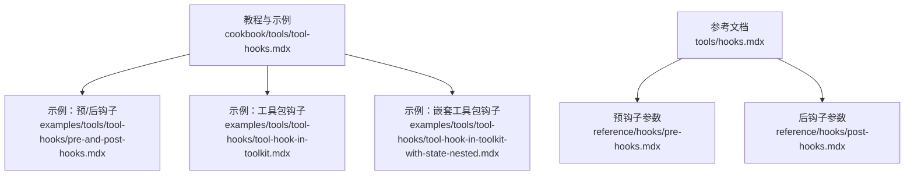
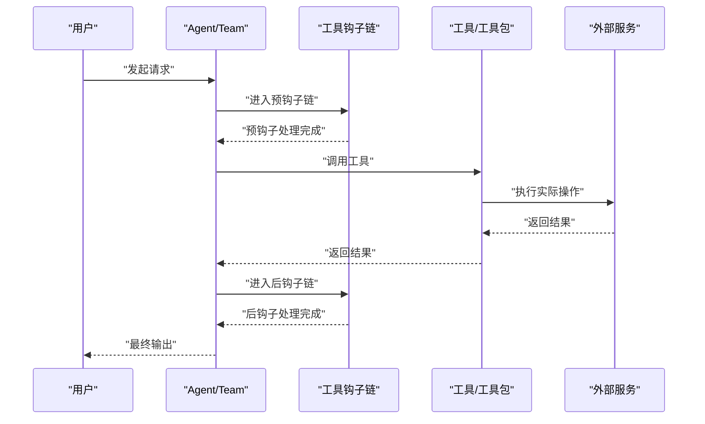
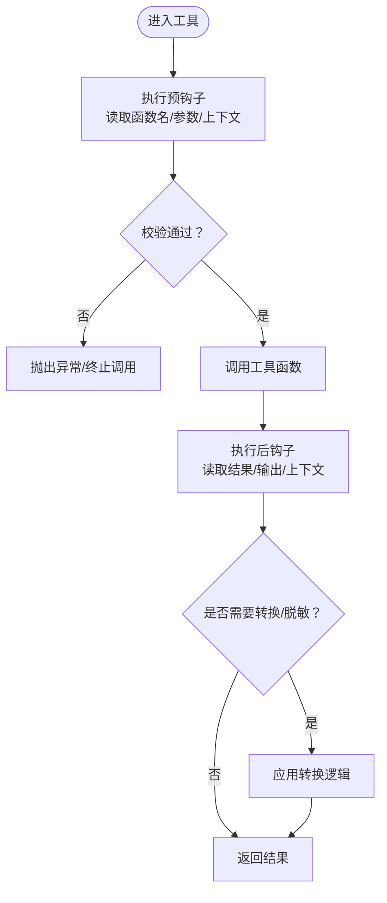
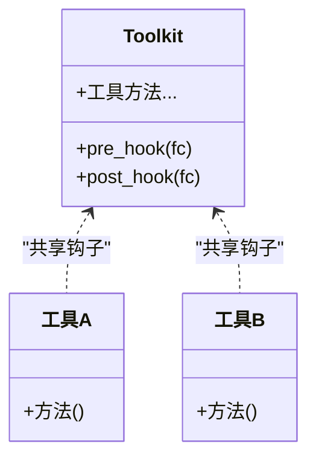
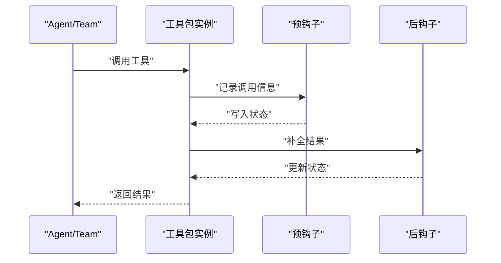
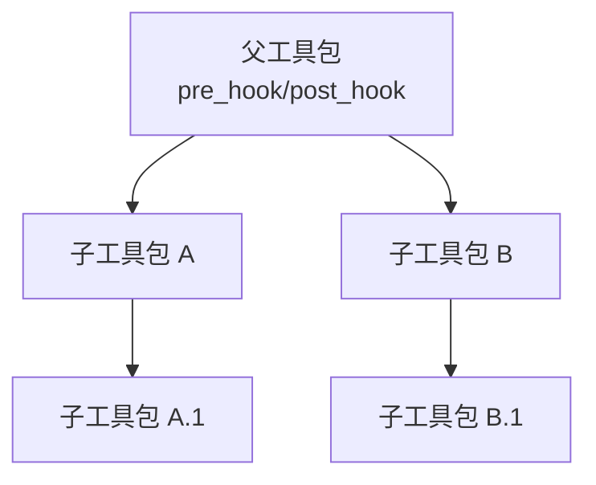
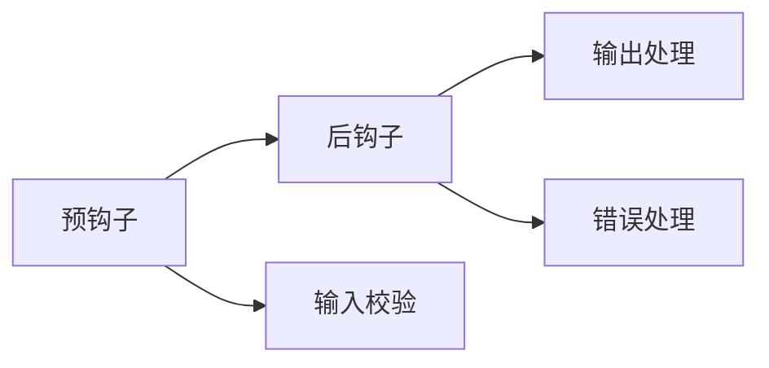

# 工具钩子系统

<cite>
**本文引用的文件**
- [cookbook/tools/tool-hooks.mdx](file://cookbook/tools/tool-hooks.mdx)
- [tools/hooks.mdx](file://tools/hooks.mdx)
- [reference/hooks/pre-hooks.mdx](file://reference/hooks/pre-hooks.mdx)
- [reference/hooks/post-hooks.mdx](file://reference/hooks/post-hooks.mdx)
- [examples/tools/tool-hooks/pre-and-post-hooks.mdx](file://examples/tools/tool-hooks/pre-and-post-hooks.mdx)
- [examples/tools/tool-hooks/tool-hook-in-toolkit.mdx](file://examples/tools/tool-hooks/tool-hook-in-toolkit.mdx)
- [examples/tools/tool-hooks/tool-hook-in-toolkit-with-state-nested.mdx](file://examples/tools/tool-hooks/tool-hook-in-toolkit-with-state-nested.mdx)
</cite>

## 目录
1. [简介](#简介)
2. [项目结构](#项目结构)
3. [核心组件](#核心组件)
4. [架构总览](#架构总览)
5. [详细组件分析](#详细组件分析)
6. [依赖关系分析](#依赖关系分析)
7. [性能考量](#性能考量)
8. [故障排查指南](#故障排查指南)
9. [结论](#结论)
10. [附录](#附录)

## 简介
本技术文档围绕“工具钩子系统”展开，系统性阐述工具钩子的概念、作用与实现方式，重点覆盖以下主题：
- 钩子如何在工具执行前后插入自定义逻辑（预钩子与后钩子）
- 输入验证、输出处理与错误捕获的实践方法
- 工具包（Toolkit）级别的钩子配置与钩子链执行顺序
- 带状态的工具钩子：如何在钩子中访问与修改工具的状态信息
- 嵌套工具包钩子：多层工具包的钩子继承与覆盖机制
- 实际应用场景：日志记录、性能监控、安全检查、数据转换等
- 钩子与工具装饰器的结合使用，提供完整的钩子系统集成示例

## 项目结构
工具钩子相关内容主要分布在以下三类文档中：
- 教程与用法：cookbook 与 examples 中的工具钩子示例与讲解
- 参考文档：工具钩子参数与运行时注入信息
- 概念说明：工具钩子与工具装饰器的结合使用

**图表来源**
- [cookbook/tools/tool-hooks.mdx:1-211](file://cookbook/tools/tool-hooks.mdx#L1-L211)
- [tools/hooks.mdx:1-188](file://tools/hooks.mdx#L1-L188)
- [reference/hooks/pre-hooks.mdx:1-21](file://reference/hooks/pre-hooks.mdx#L1-L21)
- [reference/hooks/post-hooks.mdx:1-21](file://reference/hooks/post-hooks.mdx#L1-L21)
- [examples/tools/tool-hooks/pre-and-post-hooks.mdx:1-126](file://examples/tools/tool-hooks/pre-and-post-hooks.mdx#L1-L126)
- [examples/tools/tool-hooks/tool-hook-in-toolkit.mdx:121-157](file://examples/tools/tool-hooks/tool-hook-in-toolkit.mdx#L121-L157)
- [examples/tools/tool-hooks/tool-hook-in-toolkit-with-state-nested.mdx:73-108](file://examples/tools/tool-hooks/tool-hook-in-toolkit-with-state-nested.mdx#L73-L108)

**章节来源**
- [cookbook/tools/tool-hooks.mdx:1-211](file://cookbook/tools/tool-hooks.mdx#L1-L211)
- [tools/hooks.mdx:1-188](file://tools/hooks.mdx#L1-L188)

## 核心组件
- 工具钩子（Tool Hooks）
  - 定义：在工具调用前或后执行的自定义逻辑函数，用于日志、校验、转换、限流、缓存、审计、错误处理等
  - 参数注入：支持注入 agent、team、run_input/run_output、session、session_state、dependencies、metadata、user_id、debug_mode 等上下文信息
  - 多钩子链：可对 Agent/Team 或单个工具设置多个钩子，按顺序执行
- 预钩子（Pre Hooks）与后钩子（Post Hooks）
  - 预钩子：在工具调用前执行，常用于输入校验、限流、缓存命中判断、参数替换等
  - 后钩子：在工具调用后执行，常用于结果转换、审计记录、异常捕获与统一处理
- 工具包（Toolkit）钩子
  - 在工具包级别统一配置钩子，对包内所有工具生效
  - 支持钩子链：父级工具包钩子可传播到子工具包，实现统一治理
- 带状态的工具钩子
  - 通过在工具包实例上维护状态（如调用日志），在钩子中读写状态，实现跨调用的审计与追踪
- 嵌套工具包钩子
  - 父工具包钩子可覆盖/继承到子工具包，形成层级化的钩子策略

**章节来源**
- [tools/hooks.mdx:1-188](file://tools/hooks.mdx#L1-L188)
- [reference/hooks/pre-hooks.mdx:1-21](file://reference/hooks/pre-hooks.mdx#L1-L21)
- [reference/hooks/post-hooks.mdx:1-21](file://reference/hooks/post-hooks.mdx#L1-L21)
- [cookbook/tools/tool-hooks.mdx:88-181](file://cookbook/tools/tool-hooks.mdx#L88-L181)

## 架构总览
下图展示了工具钩子在 Agent/Team 执行流程中的位置与交互：

**图表来源**
- [tools/hooks.mdx:84-94](file://tools/hooks.mdx#L84-L94)
- [cookbook/tools/tool-hooks.mdx:28-62](file://cookbook/tools/tool-hooks.mdx#L28-L62)

## 详细组件分析

### 组件一：预钩子与后钩子（@tool 装饰器）
- 功能要点
  - 使用 @tool 的 pre_hook 与 post_hook 参数分别注册预钩子与后钩子
  - 预钩子可读取函数名、函数调用对象与参数；后钩子可读取运行输出与会话上下文
  - 支持同步与异步钩子，适用于流式与异步工具
- 典型场景
  - 日志记录：在预钩子中记录入参，在后钩子中记录结果
  - 输入验证：在预钩子中校验参数合法性
  - 结果转换：在后钩子中对结果进行格式化或脱敏
  - 错误捕获：在后钩子中统一处理异常并记录审计
- 示例路径
  - [示例：预/后钩子:1-126](file://examples/tools/tool-hooks/pre-and-post-hooks.mdx#L1-L126)
  - [教程：预/后钩子:28-62](file://cookbook/tools/tool-hooks.mdx#L28-L62)

**图表来源**
- [examples/tools/tool-hooks/pre-and-post-hooks.mdx:23-52](file://examples/tools/tool-hooks/pre-and-post-hooks.mdx#L23-L52)
- [tools/hooks.mdx:129-166](file://tools/hooks.mdx#L129-L166)

**章节来源**
- [examples/tools/tool-hooks/pre-and-post-hooks.mdx:1-126](file://examples/tools/tool-hooks/pre-and-post-hooks.mdx#L1-L126)
- [tools/hooks.mdx:129-166](file://tools/hooks.mdx#L129-L166)

### 组件二：工具包级别的钩子（Toolkit）
- 功能要点
  - 在工具包构造时设置 pre_hook 与 post_hook，对包内所有工具生效
  - 支持在运行时动态替换工具包钩子，实现灵活的策略切换
- 典型场景
  - 统一审计：在工具包级别记录所有工具调用
  - 权限控制：在工具包级别拦截敏感操作
  - 缓存策略：在工具包级别实现统一的缓存与回源逻辑
- 示例路径
  - [教程：工具包钩子:88-121](file://cookbook/tools/tool-hooks.mdx#L88-121)
  - [示例：工具包钩子:121-157](file://examples/tools/tool-hooks/tool-hook-in-toolkit.mdx#L121-L157)

**图表来源**
- [cookbook/tools/tool-hooks.mdx:102-120](file://cookbook/tools/tool-hooks.mdx#L102-L120)
- [examples/tools/tool-hooks/tool-hook-in-toolkit.mdx:121-157](file://examples/tools/tool-hooks/tool-hook-in-toolkit.mdx#L121-L157)

**章节来源**
- [cookbook/tools/tool-hooks.mdx:88-121](file://cookbook/tools/tool-hooks.mdx#L88-L121)
- [examples/tools/tool-hooks/tool-hook-in-toolkit.mdx:121-157](file://examples/tools/tool-hooks/tool-hook-in-toolkit.mdx#L121-L157)

### 组件三：带状态的工具钩子（审计日志）
- 功能要点
  - 在工具包实例中维护状态（如调用日志列表），在预钩子中记录调用信息，在后钩子中补全结果
  - 通过 Agent/Team 的 session_state 与 dependencies 获取上下文，实现跨调用的状态共享
- 典型场景
  - 审计追踪：记录每次调用的函数名、参数、时间戳与结果
  - 用户画像注入：根据会话状态动态替换参数
- 示例路径
  - [教程：带状态的工具钩子:122-159](file://cookbook/tools/tool-hooks.mdx#L122-159)
  - [示例：嵌套工具包钩子（含状态）:73-108](file://examples/tools/tool-hooks/tool-hook-in-toolkit-with-state-nested.mdx#L73-108)

**图表来源**
- [cookbook/tools/tool-hooks.mdx:130-159](file://cookbook/tools/tool-hooks.mdx#L130-L159)
- [examples/tools/tool-hooks/tool-hook-in-toolkit-with-state-nested.mdx:73-108](file://examples/tools/tool-hooks/tool-hook-in-toolkit-with-state-nested.mdx#L73-L108)

**章节来源**
- [cookbook/tools/tool-hooks.mdx:122-159](file://cookbook/tools/tool-hooks.mdx#L122-L159)
- [examples/tools/tool-hooks/tool-hook-in-toolkit-with-state-nested.mdx:73-108](file://examples/tools/tool-hooks/tool-hook-in-toolkit-with-state-nested.mdx#L73-L108)

### 组件四：嵌套工具包钩子（父子继承与覆盖）
- 功能要点
  - 父工具包钩子可传播到子工具包，实现统一治理
  - 子工具包可覆盖父钩子，实现差异化策略
- 典型场景
  - 分层治理：总部统一审计，区域可覆盖特定规则
  - 多租户隔离：父钩子提供默认策略，租户可定制钩子
- 示例路径
  - [教程：嵌套工具包钩子:161-181](file://cookbook/tools/tool-hooks.mdx#L161-181)

**图表来源**
- [cookbook/tools/tool-hooks.mdx:169-181](file://cookbook/tools/tool-hooks.mdx#L169-L181)

**章节来源**
- [cookbook/tools/tool-hooks.mdx:161-181](file://cookbook/tools/tool-hooks.mdx#L161-L181)

### 组件五：钩子参数与运行时注入
- 预钩子参数
  - agent、team、run_input、session、session_state、dependencies、metadata、user_id、debug_mode
- 后钩子参数
  - agent、team、run_output、session、session_state、dependencies、metadata、user_id、debug_mode
- 使用建议
  - 在预钩子中进行参数校验与替换
  - 在后钩子中进行结果转换与异常统一处理
  - 利用 session_state 与 dependencies 实现跨调用状态共享

**章节来源**
- [reference/hooks/pre-hooks.mdx:1-21](file://reference/hooks/pre-hooks.mdx#L1-L21)
- [reference/hooks/post-hooks.mdx:1-21](file://reference/hooks/post-hooks.mdx#L1-L21)

## 依赖关系分析
- 组件耦合
  - 工具钩子与工具/工具包强耦合，钩子通过函数签名与上下文参数与调用方解耦
  - 钩子链内部遵循顺序执行原则，前一个钩子的输出作为下一个钩子的输入
- 外部依赖
  - 钩子可能依赖外部服务（如日志、审计、缓存），需注意异步与超时处理
- 循环依赖
  - 工具钩子不应直接或间接依赖自身，避免循环调用

[此图为概念性依赖示意，不直接映射具体源文件，故无图表来源]

## 性能考量
- 异步钩子
  - 对于网络或 I/O 密集型钩子（如日志、缓存），优先使用异步实现以避免阻塞
- 钩子链长度
  - 控制钩子数量与复杂度，避免过长链导致延迟累积
- 缓存与去重
  - 在预钩子中实现缓存命中判断，减少重复调用
- 资源释放
  - 在后钩子中确保资源清理（如连接池、临时文件）

[本节为通用性能建议，不直接分析具体文件，故无章节来源]

## 故障排查指南
- 常见问题
  - 钩子未生效：确认钩子注册方式（@tool 装饰器 vs Agent/Team 工具钩子）、参数名称与类型匹配
  - 上下文缺失：检查 session_state、dependencies 是否正确传递
  - 异常被吞没：在后钩子中统一捕获并记录异常，避免静默失败
- 排查步骤
  - 在预钩子中打印入参与上下文，确认注入是否正确
  - 在后钩子中打印输出与异常栈，定位失败点
  - 逐步禁用钩子，缩小问题范围
- 相关参考
  - [工具钩子参数与运行时注入:1-188](file://tools/hooks.mdx#L1-L188)
  - [预钩子参数:1-21](file://reference/hooks/pre-hooks.mdx#L1-L21)
  - [后钩子参数:1-21](file://reference/hooks/post-hooks.mdx#L1-L21)

**章节来源**
- [tools/hooks.mdx:1-188](file://tools/hooks.mdx#L1-L188)
- [reference/hooks/pre-hooks.mdx:1-21](file://reference/hooks/pre-hooks.mdx#L1-L21)
- [reference/hooks/post-hooks.mdx:1-21](file://reference/hooks/post-hooks.mdx#L1-L21)

## 结论
工具钩子系统提供了在工具执行前后插入自定义逻辑的统一机制，具备以下优势：
- 灵活的钩子类型（预钩子、后钩子、工具包钩子）
- 可组合的钩子链与层级化的嵌套策略
- 丰富的运行时上下文注入，便于实现日志、校验、转换、审计与错误处理等场景
- 易于扩展与维护，适合在复杂业务中构建一致的治理策略

[本节为总结性内容，不直接分析具体文件，故无章节来源]

## 附录
- 实际应用场景速览
  - 日志记录：在预钩子中记录入参，在后钩子中记录结果与耗时
  - 输入验证：在预钩子中校验参数合法性与权限
  - 结果转换：在后钩子中进行格式化、脱敏或结构化
  - 限流与缓存：在预钩子中实现缓存命中与并发控制
  - 审计与合规：在工具包级别统一记录调用轨迹
  - 错误处理：在后钩子中统一捕获异常并上报
- 集成示例路径
  - [教程：工具钩子:183-209](file://cookbook/tools/tool-hooks.mdx#L183-L209)
  - [示例：预/后钩子:1-126](file://examples/tools/tool-hooks/pre-and-post-hooks.mdx#L1-L126)
  - [示例：工具包钩子:121-157](file://examples/tools/tool-hooks/tool-hook-in-toolkit.mdx#L121-L157)
  - [示例：嵌套工具包钩子（含状态）:73-108](file://examples/tools/tool-hooks/tool-hook-in-toolkit-with-state-nested.mdx#L73-108)

**章节来源**
- [cookbook/tools/tool-hooks.mdx:183-209](file://cookbook/tools/tool-hooks.mdx#L183-L209)
- [examples/tools/tool-hooks/pre-and-post-hooks.mdx:1-126](file://examples/tools/tool-hooks/pre-and-post-hooks.mdx#L1-L126)
- [examples/tools/tool-hooks/tool-hook-in-toolkit.mdx:121-157](file://examples/tools/tool-hooks/tool-hook-in-toolkit.mdx#L121-L157)
- [examples/tools/tool-hooks/tool-hook-in-toolkit-with-state-nested.mdx:73-108](file://examples/tools/tool-hooks/tool-hook-in-toolkit-with-state-nested.mdx#L73-L108)