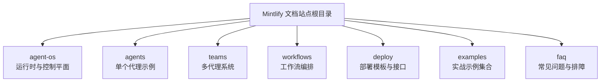
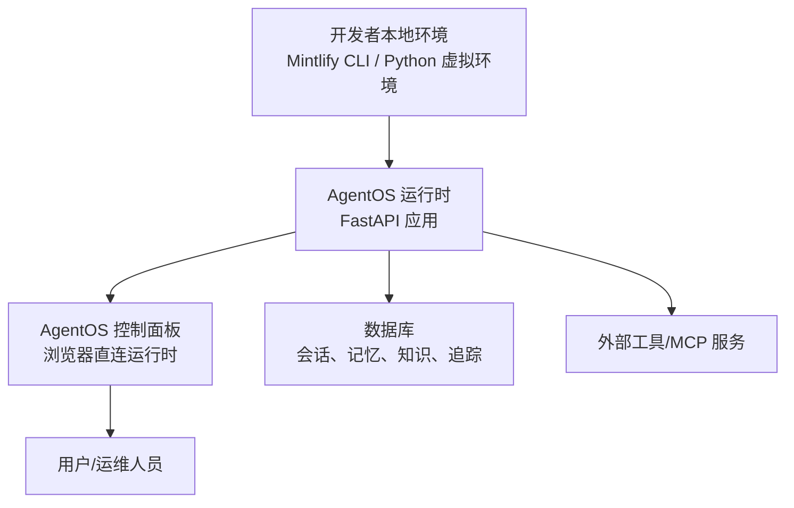
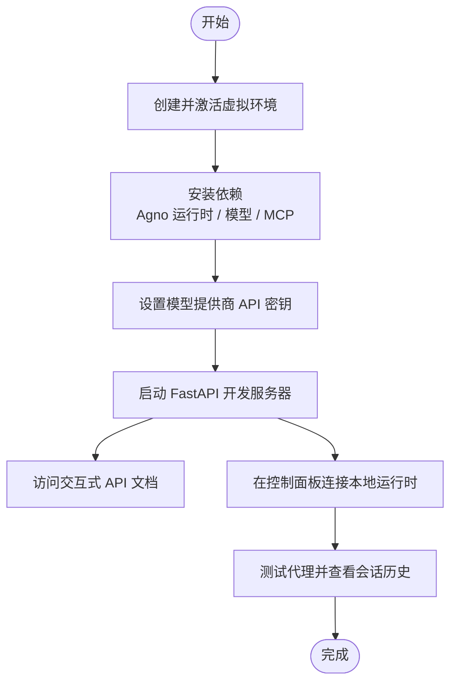
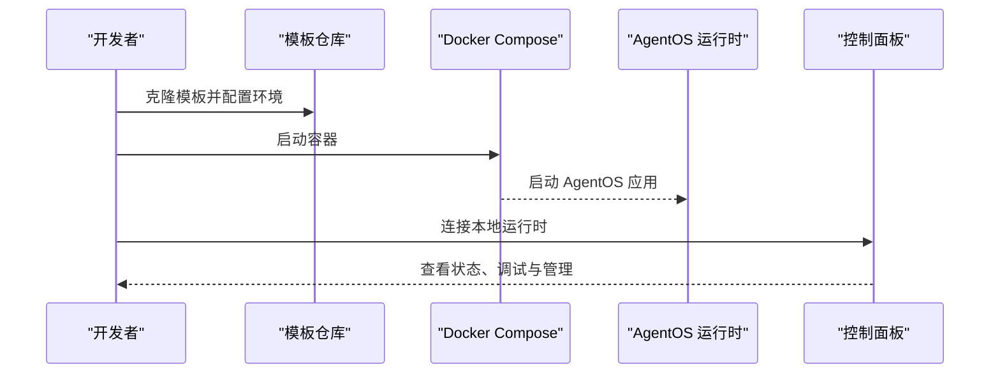
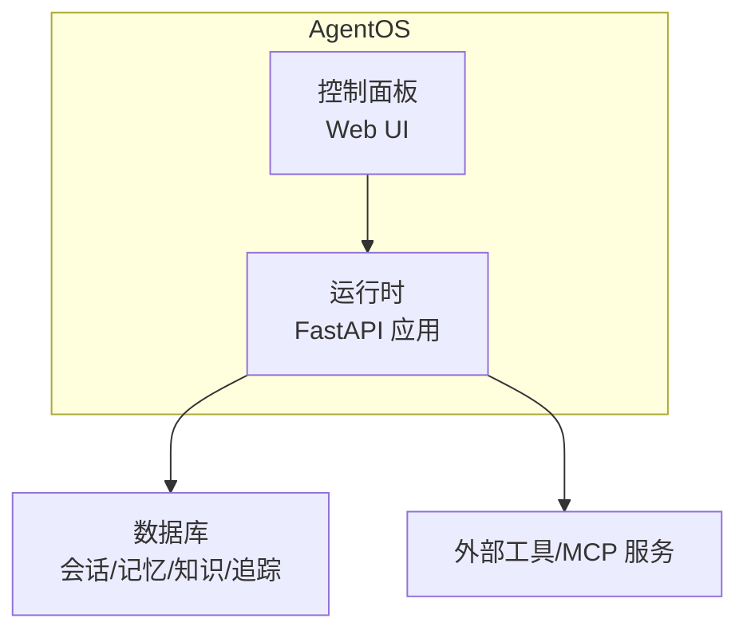
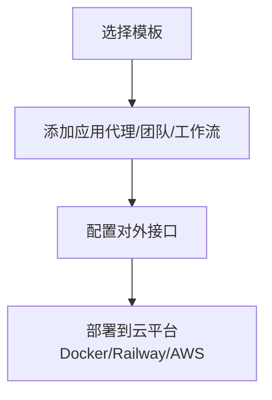
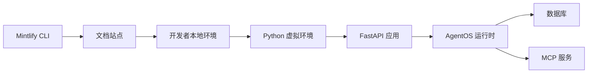

# 快速开始

<cite>
**本文引用的文件**
- [README.md](file://README.md)
- [first-agent.mdx](file://first-agent.mdx)
- [first-multi-agent-system.mdx](file://first-multi-agent-system.mdx)
- [agent-os/introduction.mdx](file://agent-os/introduction.mdx)
- [agent-os/run-your-os.mdx](file://agent-os/run-your-os.mdx)
- [deploy/introduction.mdx](file://deploy/introduction.mdx)
- [faq/environment-variables.mdx](file://faq/environment-variables.mdx)
- [faq/openai-key-request-for-other-models.mdx](file://faq/openai-key-request-for-other-models.mdx)
- [faq/could-not-connect-to-docker.mdx](file://faq/could-not-connect-to-docker.mdx)
- [faq/rbac-auth-failed.mdx](file://faq/rbac-auth-failed.mdx)
- [faq/tpm-issues.mdx](file://faq/tpm-issues.mdx)
</cite>

## 目录
1. [简介](#简介)
2. [项目结构](#项目结构)
3. [核心组件](#核心组件)
4. [架构总览](#架构总览)
5. [详细组件分析](#详细组件分析)
6. [依赖关系分析](#依赖关系分析)
7. [性能考虑](#性能考虑)
8. [故障排除指南](#故障排除指南)
9. [结论](#结论)
10. [附录](#附录)

## 简介
本指南面向首次接触 Agno 框架的新用户，目标是帮助你在最短时间内完成本地开发环境搭建、运行第一个代理（Agent）、理解多代理系统（Team）的构建方式，并掌握基础的团队协作与生产部署思路。文档内容基于仓库中的官方文档与示例，覆盖从 Mintlify CLI 安装到本地开发、运行、连接控制面板、以及常见问题排查。

## 项目结构
该仓库为基于 Mintlify 的文档站点，核心内容分布在多个主题目录中，包括：
- agent-os：AgentOS 运行时与控制平面的使用说明
- agents、teams、workflows：代理、团队与工作流的使用与示例
- deploy：部署模板与接口集成
- examples：丰富的实战示例与用法
- faq：常见问题与排障指南

下面给出一个概念性的项目结构图，帮助你建立整体认知：

## 核心组件
- Mintlify CLI：用于本地预览与构建文档站点
- AgentOS：将代理封装为可生产的 FastAPI 应用，提供控制面板与可观测性
- 代理（Agent）：由模型、存储、工具等组成，支持会话记忆与流式输出
- 多代理系统（Team）：多个代理协同工作，实现复杂任务分解与协作
- 部署模板：Docker、Railway、AWS 等平台的一键部署方案

章节来源
- [README.md:1-83](file://README.md#L1-L83)
- [agent-os/introduction.mdx:1-113](file://agent-os/introduction.mdx#L1-L113)

## 架构总览
下图展示了从本地开发到控制面板连接的整体架构，以及 AgentOS 的两部分组成（运行时与控制平面）：

图表来源
- [agent-os/introduction.mdx:40-91](file://agent-os/introduction.mdx#L40-L91)

章节来源
- [agent-os/introduction.mdx:40-91](file://agent-os/introduction.mdx#L40-L91)

## 详细组件分析

### 第一个代理：从 20 行代码起步
你将创建一个具备以下能力的代理：
- 连接 MCP 服务器
- 存储与检索历史对话
- 作为生产级 API 提供流式响应

操作步骤要点：
- 创建虚拟环境并激活
- 安装依赖（Agno 运行时、模型提供商、MCP 工具）
- 设置模型提供商的 API 密钥
- 启动 FastAPI 开发服务器
- 在浏览器中访问交互式 API 文档
- 通过控制面板连接本地运行时进行管理与调试

章节来源
- [first-agent.mdx:16-103](file://first-agent.mdx#L16-L103)
- [agent-os/run-your-os.mdx:36-77](file://agent-os/run-your-os.mdx#L36-L77)

### 多代理系统：构建团队协作
你将运行一个包含三个代理的多代理系统：
- Scout：企业图书馆员，负责导航文档库、提取答案并学习使用模式
- Knowledge Agent：基于向量数据库的问答代理（混合检索）
- MCP Agent：通过 MCP 协议连接外部工具

本地运行与部署要点：
- 克隆模板仓库
- 配置环境变量（如 OpenAI API Key）
- 使用 Docker Compose 启动应用
- 通过控制面板连接本地或生产环境
- 部署到 Railway 并管理日志与更新

章节来源
- [first-multi-agent-system.mdx:23-113](file://first-multi-agent-system.mdx#L23-L113)

### AgentOS 运行时与控制面板
- 运行时：将你的代理封装为 FastAPI 应用，提供 50+ 个开箱即用的 API 端点，支持 SSE 流式输出
- 控制面板：浏览器直连运行时，无需代理或第三方传输，数据完全私有化
- 安全与治理：基于 JWT 的 RBAC、守卫（Guardrails）、人工介入（Human-in-the-loop）

章节来源
- [agent-os/introduction.mdx:9-14](file://agent-os/introduction.mdx#L9-L14)
- [agent-os/introduction.mdx:76-91](file://agent-os/introduction.mdx#L76-L91)

### 部署到云平台
- 选择模板：空白画布或预置解决方案
- 添加应用：按需添加代理、团队或工作流
- 暴露接口：通过 Slack、Discord、Telegram、MCP 或自定义 UI 对外提供服务

章节来源
- [deploy/introduction.mdx:11-101](file://deploy/introduction.mdx#L11-L101)

## 依赖关系分析
- 文档站点依赖 Mintlify CLI 进行本地开发与链接检查
- AgentOS 运行时依赖 Python 生态（FastAPI、uv 虚拟环境、依赖安装）
- 外部服务依赖（如模型提供商 API Key）需要正确配置
- 多代理系统通常配合 Docker 与数据库（如 PostgreSQL）进行本地与生产部署

章节来源
- [README.md:5-32](file://README.md#L5-L32)
- [agent-os/run-your-os.mdx:52-76](file://agent-os/run-your-os.mdx#L52-L76)

## 性能考虑
- 使用流式输出（SSE）提升用户体验
- 合理配置会话与历史记录数量，避免上下文过长导致性能下降
- 选择合适的嵌入器与向量数据库，平衡检索质量与延迟
- 在生产环境中启用追踪与可观测性，便于定位性能瓶颈

## 故障排除指南

### Mintlify 依赖更新与页面 404
- 如果本地开发未启动，请尝试更新 Mintlify 依赖
- 若页面显示 404，请确认当前目录包含 docs.json

章节来源
- [README.md:65-68](file://README.md#L65-L68)

### 环境变量设置（macOS / Windows）
- macOS：可通过 Shell 临时或永久设置环境变量
- Windows：可在 PowerShell 或命令提示符中临时或永久设置，并在新会话中生效

章节来源
- [faq/environment-variables.mdx:8-119](file://faq/environment-variables.mdx#L8-L119)

### 使用其他模型时仍被要求 OpenAI Key
- 默认模型与嵌入器可能指向 OpenAI，若希望使用其他模型或嵌入器，需显式配置
- 参考示例：指定 Google Gemini 模型或嵌入器

章节来源
- [faq/openai-key-request-for-other-models.mdx:6-61](file://faq/openai-key-request-for-other-models.mdx#L6-L61)

### Docker 连接失败
- 常见原因：缺少 /var/run/docker.sock 或权限不足
- 解决方案：创建符号链接或修正权限；必要时加入 docker 用户组

章节来源
- [faq/could-not-connect-to-docker.mdx:6-59](file://faq/could-not-connect-to-docker.mdx#L6-L59)

### RBAC 授权失败（JWT 验证）
- 当同时启用安全密钥与授权时，授权优先于安全密钥
- 版本较老（< v2.3.13）仅支持安全密钥认证；新版本可切换至 JWT 授权并配置验证密钥

章节来源
- [faq/rbac-auth-failed.mdx:8-63](file://faq/rbac-auth-failed.mdx#L8-L63)

### 令牌每分钟（TPM）限流
- 对于受限的模型（如 OpenAI），可启用指数退避并调整重试间隔
- 示例：在代理初始化时配置指数退避与重试延迟

章节来源
- [faq/tpm-issues.mdx:8-28](file://faq/tpm-issues.mdx#L8-L28)

## 结论
通过本指南，你已经完成了：
- Mintlify 文档站点的本地开发环境搭建
- 第一个代理的创建与运行
- 多代理系统的本地运行与控制面板连接
- 基础的团队协作与生产部署思路
- 常见问题的排查方法

建议下一步：
- 深入探索 AgentOS 的运行时与控制面板功能
- 尝试添加自定义代理、工具与接口
- 参考部署模板将系统上线到云平台

## 附录
- 本地开发命令与端点参考：参见“运行你的 AgentOS”与“控制面板”相关文档
- 实战示例：浏览 examples 目录中的各类示例，快速上手不同场景