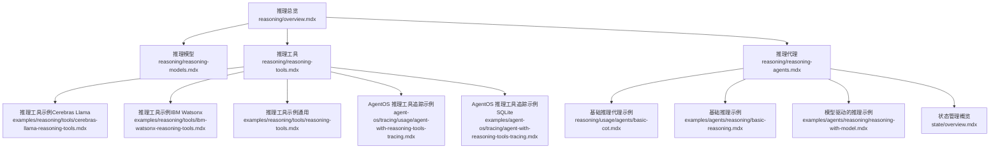
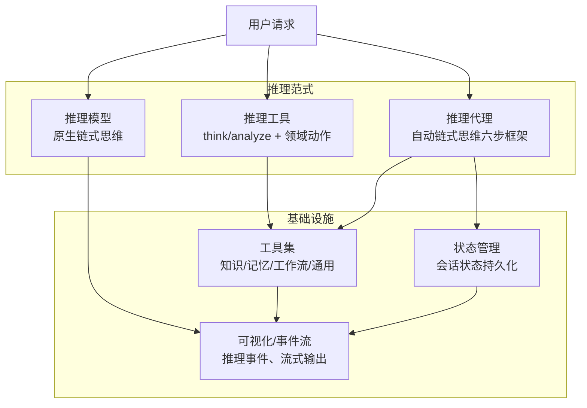
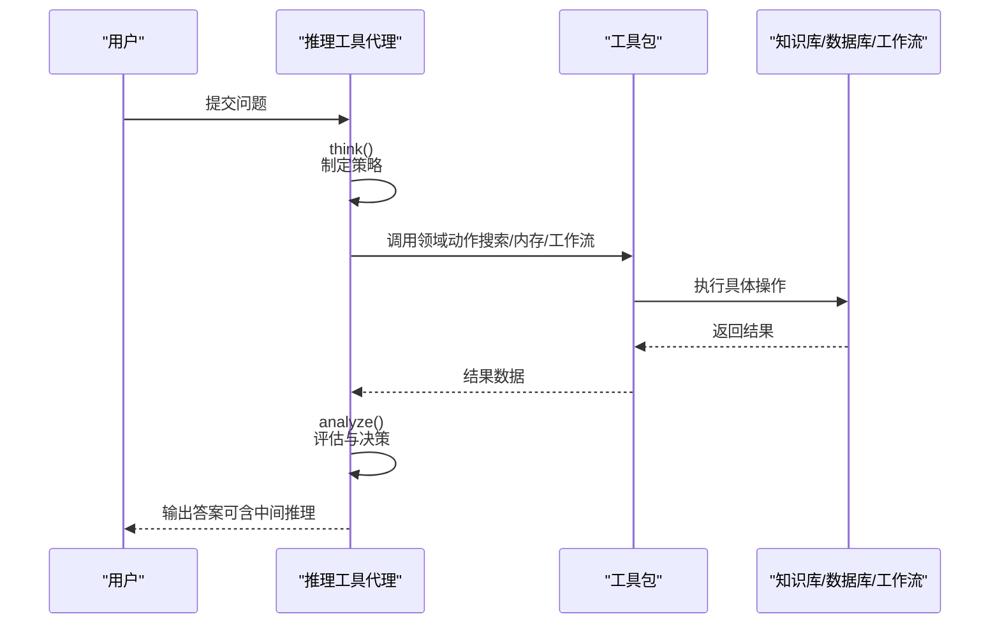
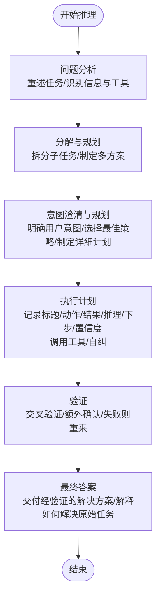
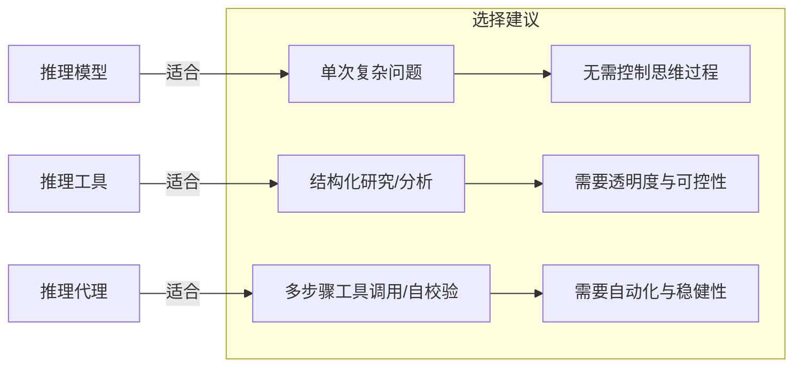

# 推理代理

<cite>
**本文引用的文件**
- [推理总览](file://reasoning/overview.mdx)
- [推理模型](file://reasoning/reasoning-models.mdx)
- [推理工具](file://reasoning/reasoning-tools.mdx)
- [推理代理](file://reasoning/reasoning-agents.mdx)
- [基础推理代理示例](file://reasoning/usage/agents/basic-cot.mdx)
- [基础推理示例](file://examples/agents/reasoning/basic-reasoning.mdx)
- [模型驱动的推理示例](file://examples/agents/reasoning/reasoning-with-model.mdx)
- [推理工具示例（Cerebras Llama）](file://examples/reasoning/tools/cerebras-llama-reasoning-tools.mdx)
- [推理工具示例（IBM Watsonx）](file://examples/reasoning/tools/ibm-watsonx-reasoning-tools.mdx)
- [推理工具示例（通用）](file://examples/reasoning/tools/reasoning-tools.mdx)
- [AgentOS 推理工具追踪示例](file://agent-os/tracing/usage/agent-with-reasoning-tools-tracing.mdx)
- [AgentOS 推理工具追踪示例（SQLit）](file://examples/agent-os/tracing/agent-with-reasoning-tools-tracing.mdx)
- [状态管理概览](file://state/overview.mdx)
</cite>

## 目录
1. [引言](#引言)
2. [项目结构](#项目结构)
3. [核心组件](#核心组件)
4. [架构总览](#架构总览)
5. [详细组件分析](#详细组件分析)
6. [依赖关系分析](#依赖关系分析)
7. [性能考虑](#性能考虑)
8. [故障排除指南](#故障排除指南)
9. [结论](#结论)
10. [附录](#附录)

## 引言
本技术文档围绕“推理代理”展开，系统阐述如何通过提示工程与工具集成，将任意常规模型转化为具备链式思维与自我校验能力的推理系统。文档覆盖三种推理范式：推理模型（原生链式思维）、推理工具（显式思考与分析工具集）、推理代理（自动化的结构化链式思维）。同时给出配置选项、构建指南、复杂任务应用、性能优化与故障排除建议，帮助开发者高效落地推理代理。

## 项目结构
围绕推理代理的相关文档主要分布在以下模块：
- 推理总览：定义推理价值、工作原理与三种范式对比
- 推理模型：原生推理模型的使用方式与流式推理事件
- 推理工具：四种推理工具包（通用、知识、记忆、工作流）及 Think → Act → Analyze 模式
- 推理代理：自动链式思维、工具调用、自校验与迭代控制
- 示例：基础推理代理、模型驱动推理、推理工具示例、AgentOS 追踪示例
- 状态管理：会话状态持久化与共享，支撑跨轮次推理

**图表来源**
- [推理总览](file://reasoning/overview.mdx)
- [推理模型](file://reasoning/reasoning-models.mdx)
- [推理工具](file://reasoning/reasoning-tools.mdx)
- [推理代理](file://reasoning/reasoning-agents.mdx)
- [基础推理代理示例](file://reasoning/usage/agents/basic-cot.mdx)
- [基础推理示例](file://examples/agents/reasoning/basic-reasoning.mdx)
- [模型驱动的推理示例](file://examples/agents/reasoning/reasoning-with-model.mdx)
- [推理工具示例（Cerebras Llama）](file://examples/reasoning/tools/cerebras-llama-reasoning-tools.mdx)
- [推理工具示例（IBM Watsonx）](file://examples/reasoning/tools/ibm-watsonx-reasoning-tools.mdx)
- [推理工具示例（通用）](file://examples/reasoning/tools/reasoning-tools.mdx)
- [AgentOS 推理工具追踪示例](file://agent-os/tracing/usage/agent-with-reasoning-tools-tracing.mdx)
- [AgentOS 推理工具追踪示例（SQLite）](file://examples/agent-os/tracing/agent-with-reasoning-tools-tracing.mdx)
- [状态管理概览](file://state/overview.mdx)

**章节来源**
- [推理总览](file://reasoning/overview.mdx)
- [推理模型](file://reasoning/reasoning-models.mdx)
- [推理工具](file://reasoning/reasoning-tools.mdx)
- [推理代理](file://reasoning/reasoning-agents.mdx)

## 核心组件
- 推理模型（Reasoning Models）
  - 原生链式思维模型在生成最终回答前输出内部思维链，适合单次复杂问题求解
  - 支持与响应模型分离，以获得更强的推理能力与更自然的输出
- 推理工具（Reasoning Tools）
  - 提供统一的 think()/analyze() 工具与领域专用动作（搜索知识、内存 CRUD、运行工作流），按需触发
  - 统一遵循 Think → Act → Analyze 循环，透明可控
- 推理代理（Reasoning Agents）
  - 将任意模型转换为自动链式思维系统，内置六步框架：问题分析、分解与规划、意图澄清、执行计划、验证、最终答案
  - 可配置最小/最大推理步数、显示完整推理过程、捕获推理事件等

**章节来源**
- [推理模型](file://reasoning/reasoning-models.mdx)
- [推理工具](file://reasoning/reasoning-tools.mdx)
- [推理代理](file://reasoning/reasoning-agents.mdx)

## 架构总览
推理代理通过“提示工程 + 工具集成 + 状态管理”的组合，形成可迭代、可验证、可追踪的推理闭环。下图展示了三种范式的统一视图与关键交互点。

**图表来源**
- [推理模型](file://reasoning/reasoning-models.mdx)
- [推理工具](file://reasoning/reasoning-tools.mdx)
- [推理代理](file://reasoning/reasoning-agents.mdx)
- [状态管理概览](file://state/overview.mdx)

## 详细组件分析

### 推理模型（Reasoning Models）
- 特性
  - 在生成最终回答前输出连续的内部思维链
  - 适合单次复杂问题（数学、编码、物理等）
  - 可与响应模型分离，兼顾推理质量与语言表达
- 流式推理与事件
  - 支持流式输出推理内容与推理事件，便于前端实时展示与调试
- 使用要点
  - 对于简单任务，直接使用推理模型即可；对于需要工具调用或多轮交互的任务，结合推理代理或推理工具更合适

**章节来源**
- [推理模型](file://reasoning/reasoning-models.mdx)

### 推理工具（Reasoning Tools）
- 四大工具包
  - ReasoningTools：通用思考与分析
  - KnowledgeTools：检索增强与知识分析
  - MemoryTools：用户记忆的增删改查与推理
  - WorkflowTools：工作流执行与推理
- Think → Act → Analyze 循环
  - Agent 决定何时思考、何时行动、何时分析，并根据结果迭代
- 配置与扩展
  - 可启用/禁用 think/analyze
  - 自动注入指导语与少量示例，支持自定义指令与示例
  - 多工具包组合时注意函数名唯一性，避免覆盖

**图表来源**
- [推理工具](file://reasoning/reasoning-tools.mdx)

**章节来源**
- [推理工具](file://reasoning/reasoning-tools.mdx)

### 推理代理（Reasoning Agents）
- 自动化链式思维
  - 六步框架：问题分析 → 分解与规划 → 意图澄清 → 执行计划 → 验证 → 最终答案
  - 可迭代执行，逐步调用工具、自我校验、修正错误
- 配置选项
  - 显示选项：是否展示完整推理过程
  - 事件捕获：ReasoningStarted/ReasoningStep/ReasoningCompleted 等事件
  - 迭代控制：最小/最大推理步数，防止无限循环
  - 自定义推理代理：传入独立的推理 Agent，定制指令与风格
- 应用场景
  - 复杂多步骤任务（逻辑谜题、数学证明、科学论文批判性评估、旅行规划等）
  - 需要工具调用与结果累积的序列化任务

**图表来源**
- [推理代理](file://reasoning/reasoning-agents.mdx)

**章节来源**
- [推理代理](file://reasoning/reasoning-agents.mdx)

### 推理代理构建指南
- 模型选择
  - 若目标是“自动链式思维”，优先使用推理代理（适用于非推理模型）
  - 若已有推理模型且任务为单次复杂问题，可直接使用推理模型
  - 对于需要自然语言输出的场景，可采用“推理模型 + 响应模型”的组合
- 工具集成
  - 根据任务类型选择合适的工具包（知识、记忆、工作流、通用）
  - 合理设置 think/analyze 的启用与自定义指令，提升一致性与可解释性
- 状态管理
  - 利用会话状态持久化保存中间结果与上下文，支持跨轮次推理
  - 在工具中访问 run_context.session_state，实现状态读写与共享

**章节来源**
- [推理代理](file://reasoning/reasoning-agents.mdx)
- [推理工具](file://reasoning/reasoning-tools.mdx)
- [状态管理概览](file://state/overview.mdx)

### 复杂任务应用示例
- 多步骤工具调用
  - 通过推理代理循环调用工具，逐步收集信息并验证，最终输出综合报告
- 迭代思维与自我纠错
  - 在每一步记录置信度与推理依据，若验证失败则回退并重新规划
- 自然语言与结构化输出
  - 使用 Markdown/表格等格式化输出，提升可读性与专业性

**章节来源**
- [推理代理](file://reasoning/reasoning-agents.mdx)
- [基础推理示例](file://examples/agents/reasoning/basic-reasoning.mdx)
- [模型驱动的推理示例](file://examples/agents/reasoning/reasoning-with-model.mdx)

## 依赖关系分析
- 三范式对比
  - 推理模型：连续思维链（全推理轨迹可见），适合单次复杂问题
  - 推理工具：显式思考与分析（结构化分步），适合研究与分析
  - 推理代理：自动化链式思维（代理交互式迭代），适合多步骤工具调用与自校验

**图表来源**
- [推理总览](file://reasoning/overview.mdx)

**章节来源**
- [推理总览](file://reasoning/overview.mdx)

## 性能考虑
- 步数控制
  - 为不同复杂度任务设置合理的最小/最大推理步数，避免过度计算
- 流式输出与事件捕获
  - 使用流式推理与事件回调，降低前端等待时间并提升可观测性
- 工具调用成本
  - 合理设计 Think → Act → Analyze 的迭代次数，减少不必要的工具调用
- 模型分离策略
  - 将推理模型与响应模型分离，既能保证推理质量又能优化输出体验

[本节为通用性能建议，不直接分析具体文件]

## 故障排除指南
- 无法看到完整推理过程
  - 确认已开启显示完整推理过程与流式事件
- 工具冲突或重复函数名
  - 多工具包组合时禁用重复的 think/analyze，或自定义函数名
- 会话状态未更新
  - 在工具中正确访问 run_context.session_state 并确保持久化配置生效
- 追踪与可视化
  - 使用 AgentOS 追踪功能查看推理事件与中间结果，定位异常环节

**章节来源**
- [推理代理](file://reasoning/reasoning-agents.mdx)
- [推理工具](file://reasoning/reasoning-tools.mdx)
- [AgentOS 推理工具追踪示例](file://agent-os/tracing/usage/agent-with-reasoning-tools-tracing.mdx)
- [AgentOS 推理工具追踪示例（SQLite）](file://examples/agent-os/tracing/agent-with-reasoning-tools-tracing.mdx)
- [状态管理概览](file://state/overview.mdx)

## 结论
推理代理通过“提示工程 + 工具集成 + 状态管理”的体系化设计，将任意模型转变为具备链式思维、工具调用与自我校验能力的智能体。开发者可根据任务特性选择推理模型、推理工具或推理代理，并结合流式事件与追踪能力，实现高可靠、可解释、易维护的推理系统。

[本节为总结性内容，不直接分析具体文件]

## 附录
- 快速参考
  - 推理模型：适合单次复杂问题，支持推理与响应模型分离
  - 推理工具：显式思考与分析，透明可控，适合研究与分析
  - 推理代理：自动化链式思维，适合多步骤工具调用与自校验
- 示例索引
  - 基础推理代理：[基础推理代理示例](file://reasoning/usage/agents/basic-cot.mdx)
  - 基础推理示例：[基础推理示例](file://examples/agents/reasoning/basic-reasoning.mdx)
  - 模型驱动推理：[模型驱动的推理示例](file://examples/agents/reasoning/reasoning-with-model.mdx)
  - 推理工具示例：[推理工具示例（Cerebras Llama）](file://examples/reasoning/tools/cerebras-llama-reasoning-tools.mdx)、[推理工具示例（IBM Watsonx）](file://examples/reasoning/tools/ibm-watsonx-reasoning-tools.mdx)、[推理工具示例（通用）](file://examples/reasoning/tools/reasoning-tools.mdx)
  - AgentOS 追踪示例：[AgentOS 推理工具追踪示例](file://agent-os/tracing/usage/agent-with-reasoning-tools-tracing.mdx)、[AgentOS 推理工具追踪示例（SQLite）](file://examples/agent-os/tracing/agent-with-reasoning-tools-tracing.mdx)

[本节为补充索引，不直接分析具体文件]