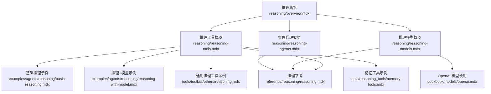
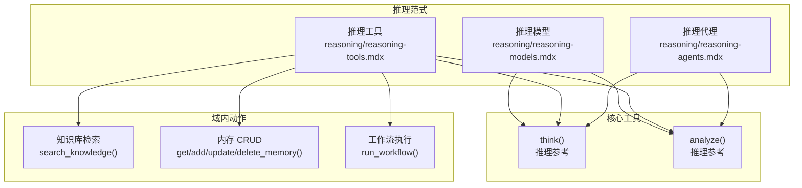
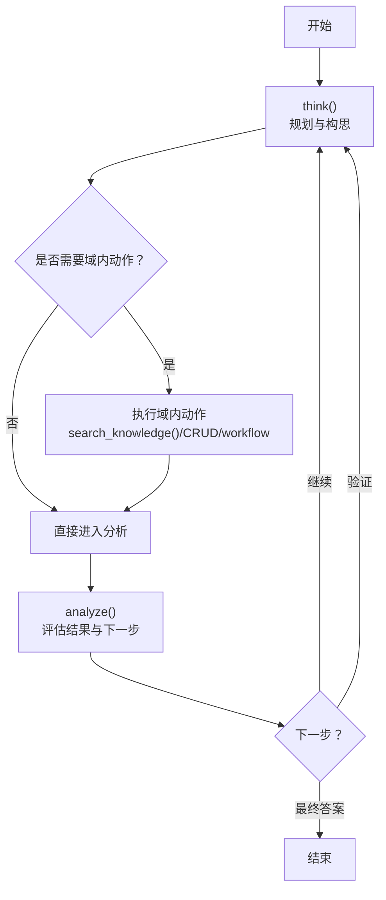
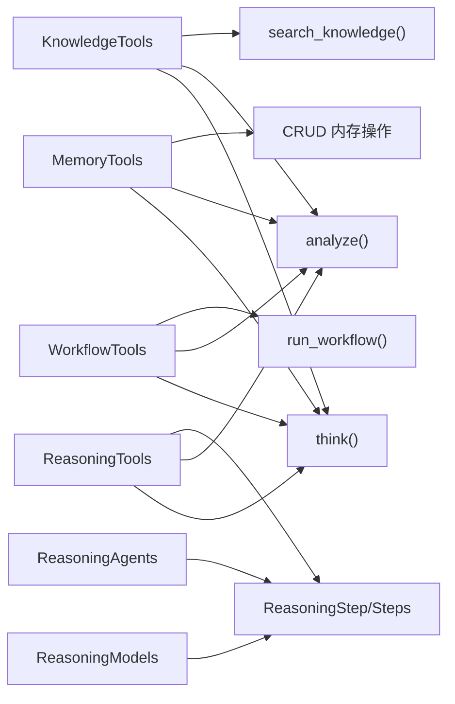

# 推理工具

<cite>
**本文引用的文件**   
- [推理总览](file://reasoning/overview.mdx)
- [推理工具概览](file://reasoning/reasoning-tools.mdx)
- [推理模型概览](file://reasoning/reasoning-models.mdx)
- [推理代理概览](file://reasoning/reasoning-agents.mdx)
- [推理参考](file://reference/reasoning/reasoning.mdx)
- [基础推理示例](file://examples/agents/reasoning/basic-reasoning.mdx)
- [推理+模型示例](file://examples/agents/reasoning/reasoning-with-model.mdx)
- [OpenAI 模型使用](file://cookbook/models/openai.mdx)
- [通用推理工具示例](file://tools/toolkits/others/reasoning.mdx)
- [记忆工具示例](file://tools/reasoning_tools/memory-tools.mdx)
</cite>

## 目录
1. [简介](#简介)
2. [项目结构](#项目结构)
3. [核心组件](#核心组件)
4. [架构总览](#架构总览)
5. [详细组件分析](#详细组件分析)
6. [依赖关系分析](#依赖关系分析)
7. [性能考量](#性能考量)
8. [故障排查指南](#故障排查指南)
9. [结论](#结论)
10. [附录](#附录)

## 简介
本技术文档围绕推理工具展开，系统阐述其设计理念、实现机制与使用方法，并覆盖思维工具、分析工具与结构化思考辅助工具三类能力。文档同时给出在研究分析、数据分析、问题解决与决策制定等任务中的应用示例，说明与多模型提供商（如 OpenAI）的集成方式与最佳实践，并提供扩展与自定义指南，帮助开发者按需打造专用推理工具。

## 项目结构
推理相关内容分布在“推理”主题文档中，涵盖三种推理范式：推理模型、推理工具、推理代理；并配套参考数据结构、事件类型与示例工程。

**图表来源**
- [推理总览:1-187](file://reasoning/overview.mdx#L1-L187)
- [推理工具概览:1-420](file://reasoning/reasoning-tools.mdx#L1-L420)
- [推理模型概览:1-193](file://reasoning/reasoning-models.mdx#L1-L193)
- [推理代理概览:1-345](file://reasoning/reasoning-agents.mdx#L1-L345)
- [推理参考:1-186](file://reference/reasoning/reasoning.mdx#L1-L186)
- [基础推理示例:1-53](file://examples/agents/reasoning/basic-reasoning.mdx#L1-L53)
- [推理+模型示例:1-52](file://examples/agents/reasoning/reasoning-with-model.mdx#L1-L52)
- [通用推理工具示例:1-49](file://tools/toolkits/others/reasoning.mdx#L1-L49)
- [记忆工具示例:1-26](file://tools/reasoning_tools/memory-tools.mdx#L1-L26)
- [OpenAI 模型使用:1-107](file://cookbook/models/openai.mdx#L1-L107)

**章节来源**
- [推理总览:1-187](file://reasoning/overview.mdx#L1-L187)
- [推理工具概览:1-420](file://reasoning/reasoning-tools.mdx#L1-L420)
- [推理模型概览:1-193](file://reasoning/reasoning-models.mdx#L1-L193)
- [推理代理概览:1-345](file://reasoning/reasoning-agents.mdx#L1-L345)
- [推理参考:1-186](file://reference/reasoning/reasoning.mdx#L1-L186)
- [基础推理示例:1-53](file://examples/agents/reasoning/basic-reasoning.mdx#L1-L53)
- [推理+模型示例:1-52](file://examples/agents/reasoning/reasoning-with-model.mdx#L1-L52)
- [通用推理工具示例:1-49](file://tools/toolkits/others/reasoning.mdx#L1-L49)
- [记忆工具示例:1-26](file://tools/reasoning_tools/memory-tools.mdx#L1-L26)
- [OpenAI 模型使用:1-107](file://cookbook/models/openai.mdx#L1-L107)

## 核心组件
- 思维工具（think）
  - 作用：作为“草稿纸/思维板”，用于对问题进行分步思考与规划。
  - 参数要点：标题、思考内容、拟采取的行动、置信度等。
  - 返回：格式化的已执行推理步骤列表。
- 分析工具（analyze）
  - 作用：对前序动作的结果进行评估，决定下一步是继续、验证还是最终回答。
  - 参数要点：标题、上一步结果、分析内容、下一步动作选择、置信度等。
  - 返回：格式化的已执行推理步骤列表。
- 结构化思考辅助
  - 统一的“思考→行动→分析→重复或给出答案”的循环，适用于所有推理范式。
  - 可结合知识库检索、内存操作、工作流执行等域内动作，形成“域内思考”。

**章节来源**
- [推理工具概览:41-74](file://reasoning/reasoning-tools.mdx#L41-L74)
- [推理参考:62-96](file://reference/reasoning/reasoning.mdx#L62-L96)

## 架构总览
推理工具支持三种路径：推理模型（原生链式思维）、推理工具（显式 think/analyze 工具）、推理代理（框架驱动的迭代思维）。它们共享统一的“思考→行动→分析”循环与数据结构。

**图表来源**
- [推理模型概览:1-193](file://reasoning/reasoning-models.mdx#L1-L193)
- [推理工具概览:1-420](file://reasoning/reasoning-tools.mdx#L1-L420)
- [推理代理概览:1-345](file://reasoning/reasoning-agents.mdx#L1-L345)
- [推理参考:62-96](file://reference/reasoning/reasoning.mdx#L62-L96)

## 详细组件分析

### 思维工具（think）与分析工具（analyze）
- 设计理念
  - 将“思考”和“分析”从模型内部迁移到显式工具，让代理在需要时才启动系统性推理，提升可控性与透明度。
  - 通过统一的数据结构（如 ReasoningStep）承载每一步的标题、思考、行动、结果、下一步与置信度。
- 关键参数与行为
  - think：接收会话状态、标题、思考内容、拟采取的行动、置信度，返回格式化推理步骤列表。
  - analyze：接收会话状态、标题、上一步结果、分析内容、下一步动作（continue/validate/final_answer）、置信度，返回格式化推理步骤列表。
- 使用建议
  - 对于需要逐步验证与迭代的任务，优先使用推理工具；对于简单直接的问题，可关闭 analyze 或仅启用 think。

**图表来源**
- [推理工具概览:238-251](file://reasoning/reasoning-tools.mdx#L238-L251)
- [推理参考:62-96](file://reference/reasoning/reasoning.mdx#L62-L96)

**章节来源**
- [推理参考:62-96](file://reference/reasoning/reasoning.mdx#L62-L96)
- [推理工具概览:238-251](file://reasoning/reasoning-tools.mdx#L238-L251)

### 四大推理工具包
- ReasoningTools（通用）
  - 提供 think/analyze，适合无域内工具的通用问题求解。
- KnowledgeTools（知识库）
  - 在 think/analyze 基础上增加 search_knowledge，适合需要检索与验证的场景。
- MemoryTools（记忆）
  - 在 think/analyze 基础上增加 get/add/update/delete_memory，适合个性化与上下文持久化。
- WorkflowTools（工作流）
  - 在 think/analyze 基础上增加 run_workflow，适合复杂流程编排与多步骤任务。

注意：当组合多个工具包时，若存在同名函数（如 think/analyze），代理仅保留首个实现，后续会静默丢弃重复项。可通过禁用 enable_think/enable_analyze 或重命名函数避免冲突。

**章节来源**
- [推理工具概览:11-302](file://reasoning/reasoning-tools.mdx#L11-L302)

### 推理模型（Reasoning Models）
- 特点：模型在生成最终答案前先输出内部链式思维，适合单次复杂任务（数学、代码、物理）。
- 配置要点：可单独设置 reasoning_model，或将推理模型与响应模型分离，以获得更强的推理能力与更自然的表达。
- 流式展示：支持 stream 与 stream_events，实时展示推理过程。

**章节来源**
- [推理模型概览:1-193](file://reasoning/reasoning-models.mdx#L1-L193)
- [推理参考:156-178](file://reference/reasoning/reasoning.mdx#L156-L178)

### 推理代理（Reasoning Agents）
- 特点：将任意模型转换为推理系统，遵循 6 步框架（问题分析→分解与策略→意图澄清与计划→执行计划→验证→最终答案），可迭代、可工具调用、可自我修正。
- 配置要点：reasoning=True，可指定 reasoning_model、reasoning_agent、最小/最大推理步数、显示完整推理过程与事件流式输出。
- 适用场景：多步骤、需要工具调用与验证的复杂任务。

**章节来源**
- [推理代理概览:1-345](file://reasoning/reasoning-agents.mdx#L1-L345)
- [推理参考:156-178](file://reference/reasoning/reasoning.mdx#L156-L178)

### 数据结构与事件
- ReasoningStep：承载单步推理的标题、思考、行动、结果、下一步动作与置信度。
- ReasoningSteps：推理步骤容器，常用于推理代理的结构化输出。
- Reasoning 事件：ReasoningStarted、ReasoningStep、ReasoningCompleted，便于 UI 展示与程序化追踪。

**章节来源**
- [推理参考:8-155](file://reference/reasoning/reasoning.mdx#L8-L155)

## 依赖关系分析
- 三类推理范式共享同一套数据结构与事件体系，确保跨范式的可观测性与一致性。
- 推理工具包之间存在函数名冲突风险（think/analyze），组合使用时需注意去重或重命名。
- 推理模型与推理代理在某些场景可互补：前者强调单次深度推理，后者强调迭代与工具调用。

**图表来源**
- [推理工具概览:11-19](file://reasoning/reasoning-tools.mdx#L11-L19)
- [推理参考:8-44](file://reference/reasoning/reasoning.mdx#L8-L44)

**章节来源**
- [推理工具概览:11-19](file://reasoning/reasoning-tools.mdx#L11-L19)
- [推理参考:8-44](file://reference/reasoning/reasoning.mdx#L8-L44)

## 性能考量
- 合理设置推理步数上限与下限，避免不必要的迭代开销。
- 对于简单任务，优先使用推理工具的 think/analyze 控制推理触发时机，减少模型负担。
- 当使用推理模型时，可将推理模型与响应模型分离，以兼顾推理质量与输出自然度。
- 在流式场景中，谨慎开启完整推理展示，避免过多日志影响吞吐。

## 故障排查指南
- 重复函数名导致工具缺失
  - 现象：组合多个工具包后，think/analyze 之一不可见。
  - 处理：禁用后续工具包的 enable_think/enable_analyze，或重命名函数。
- 推理步数过多或过少
  - 现象：推理时间过长或结论不充分。
  - 处理：调整 reasoning_min_steps 与 reasoning_max_steps，结合 show_full_reasoning 观察实际步数。
- 事件流未显示
  - 现象：推理过程未实时展示。
  - 处理：确认 stream=True 与 stream_events=True 的配置，并监听 ReasoningStarted/ReasoningStep/ReasoningCompleted 事件。

**章节来源**
- [推理工具概览:20-21](file://reasoning/reasoning-tools.mdx#L20-L21)
- [推理代理概览:166-181](file://reasoning/reasoning-agents.mdx#L166-L181)
- [推理参考:97-155](file://reference/reasoning/reasoning.mdx#L97-L155)

## 结论
推理工具通过“显式思维+结构化分析”的方式，为任何模型注入系统性推理能力，既保持灵活性又增强可控性与透明度。配合知识库、内存与工作流等域内动作，可在研究分析、数据分析、问题解决与决策制定等复杂任务中发挥显著价值。开发者可根据任务特性选择推理模型、推理工具或推理代理，并通过统一的数据结构与事件体系实现可观测与可扩展。

## 附录

### 使用方法与配置要点
- 工具配置
  - 启用/禁用具体工具：enable_think、enable_analyze。
  - 自动注入说明：add_instructions。
  - 示例引导：add_few_shot 与 few_shot_examples。
- 调用模式
  - 显式工具：think/analyze 与域内动作（search_knowledge/get/add/update/delete_memory/run_workflow）交替使用。
  - 推理代理：reasoning=True，自动执行 6 步框架，支持工具调用与验证。
  - 推理模型：单独设置 reasoning_model，或分离推理与响应模型。
- 结果处理
  - 使用 ReasoningStep/ReasoningSteps 获取结构化推理轨迹。
  - 通过 Reasoning 事件流实现实时展示与程序化处理。

**章节来源**
- [推理工具概览:304-398](file://reasoning/reasoning-tools.mdx#L304-L398)
- [推理代理概览:149-204](file://reasoning/reasoning-agents.mdx#L149-L204)
- [推理模型概览:89-140](file://reasoning/reasoning-models.mdx#L89-L140)
- [推理参考:156-178](file://reference/reasoning/reasoning.mdx#L156-L178)

### 应用示例（任务类型）
- 研究分析
  - 使用 KnowledgeTools 进行检索-分析-再检索的迭代流程，结合 cite 指令要求来源。
- 数据分析
  - 先 think 规划分析维度，再 run_workflow 执行数据处理步骤，最后 analyze 得出结论。
- 问题解决
  - 使用 ReasoningTools 的 think/analyze 循环，逐步拆解问题、验证方案、给出最终答案。
- 决策制定
  - 使用 MemoryTools 记录偏好与历史，结合 KnowledgeTools 搜索相关信息，再通过 WorkflowTools 执行决策流程。

**章节来源**
- [推理工具概览:75-130](file://reasoning/reasoning-tools.mdx#L75-L130)
- [推理工具概览:131-181](file://reasoning/reasoning-tools.mdx#L131-L181)
- [推理工具概览:182-237](file://reasoning/reasoning-tools.mdx#L182-L237)

### 与模型提供商的集成（以 OpenAI 为例）
- 使用 Responses/Chat API 与工具、视觉、结构化输出等能力。
- 推理模型：o1-pro/gpt-5.2 等具备原生推理能力的模型。
- 推理+响应分离：推理模型（如 gpt-5-mini）与响应模型（如 gpt-4o）搭配使用。
- 运行示例与环境准备参见示例工程与模型使用文档。

**章节来源**
- [OpenAI 模型使用:1-107](file://cookbook/models/openai.mdx#L1-L107)
- [推理模型概览:18-87](file://reasoning/reasoning-models.mdx#L18-L87)
- [推理+模型示例:1-52](file://examples/agents/reasoning/reasoning-with-model.mdx#L1-L52)

### 扩展与自定义指南
- 自定义域内动作
  - 在现有工具包基础上扩展新的动作（如 search_knowledge 的变体、CRUD 的条件过滤等）。
- 自定义 think/analyze
  - 为不同域定制独立的 think/analyze 函数名（如 knowledge_think/memory_analyze），避免冲突。
- 输出与事件
  - 通过 ReasoningStep/ReasoningCompleted 事件导出推理轨迹，构建可视化面板或审计日志。

**章节来源**
- [推理工具概览:263-302](file://reasoning/reasoning-tools.mdx#L263-L302)
- [推理参考:156-178](file://reference/reasoning/reasoning.mdx#L156-L178)