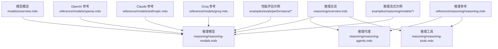
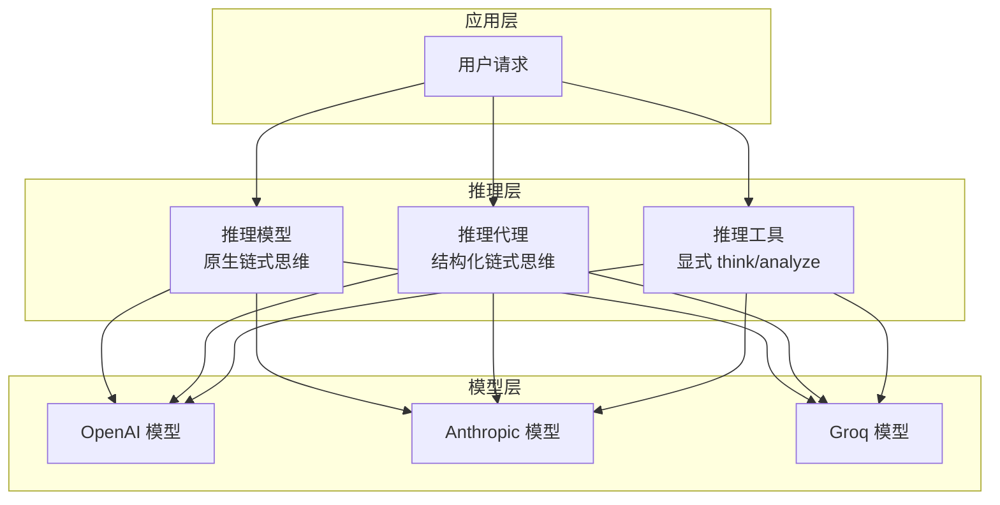
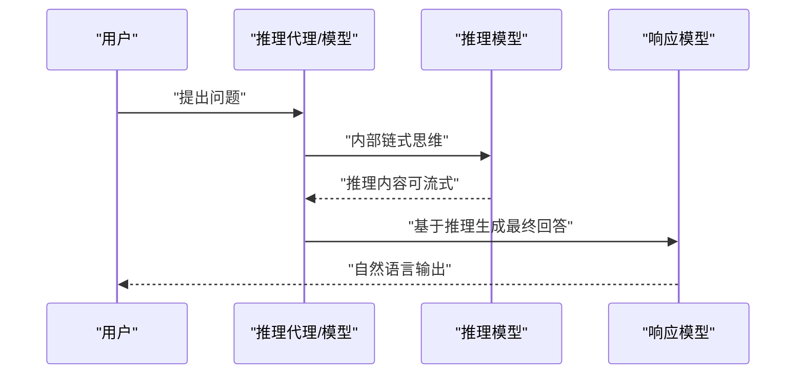
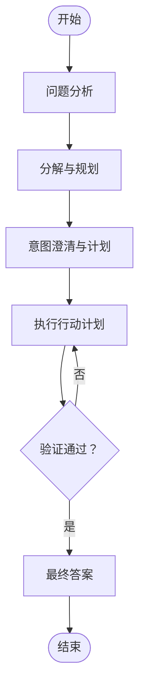
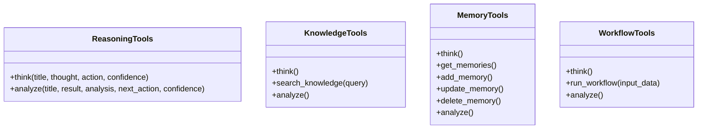
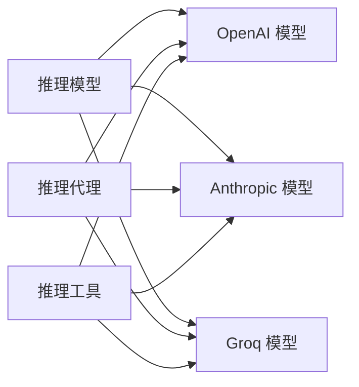

# 推理模型

<cite>
**本文引用的文件**
- [推理总览](file://reasoning/overview.mdx)
- [推理模型](file://reasoning/reasoning-models.mdx)
- [推理代理](file://reasoning/reasoning-agents.mdx)
- [推理工具](file://reasoning/reasoning-tools.mdx)
- [推理参考](file://reference/reasoning/reasoning.mdx)
- [模型概览](file://models/overview.mdx)
- [OpenAI 模型参考](file://reference/models/openai.mdx)
- [Claude 模型参考](file://reference/models/anthropic.mdx)
- [Groq 模型参考](file://reference/models/groq.mdx)
- [性能评估示例：简单响应](file://examples/evals/performance/simple-response.mdx)
- [性能评估示例：数据库日志](file://examples/evals/performance/db-logging.mdx)
- [Vertex AI 基础推理流式示例](file://examples/reasoning/models/vertex-ai/basic-reasoning-stream.mdx)
- [OpenAI 推理流式示例](file://examples/reasoning/models/openai/reasoning-stream.mdx)
</cite>

## 目录
1. [简介](#简介)
2. [项目结构](#项目结构)
3. [核心组件](#核心组件)
4. [架构总览](#架构总览)
5. [详细组件分析](#详细组件分析)
6. [依赖关系分析](#依赖关系分析)
7. [性能考量](#性能考量)
8. [故障排查指南](#故障排查指南)
9. [结论](#结论)
10. [附录](#附录)

## 简介
本技术文档围绕“推理模型”展开，系统阐述原生推理模型的特性与优势（链式思维生成、内部思考过程、自动推理能力），并提供配置指南（模型选择标准、参数调优、性能监控）、在多场景下的应用表现（数学计算、科学分析、逻辑推理、创意写作）、推理模型与响应模型的组合策略（性能权衡与成本优化），以及最佳实践与常见问题解决方案。

## 项目结构
围绕“推理”主题，知识库提供了三类核心路径：
- 推理总览：介绍推理的概念、三种实现方式及其对比
- 推理模型：原生推理模型的使用与组合策略
- 推理代理：通过结构化链式思维增强任意模型
- 推理工具：显式“思考→行动→分析”的工具集
- 推理参考：数据结构、事件类型与显示参数
- 模型参考：各提供商模型的参数与能力
- 性能评估示例：基准测试与数据库日志记录

图表来源
- [推理总览:1-187](file://reasoning/overview.mdx#L1-L187)
- [推理模型:1-193](file://reasoning/reasoning-models.mdx#L1-L193)
- [推理代理:1-345](file://reasoning/reasoning-agents.mdx#L1-L345)
- [推理工具:1-420](file://reasoning/reasoning-tools.mdx#L1-L420)
- [推理参考:1-186](file://reference/reasoning/reasoning.mdx#L1-L186)
- [模型概览:1-62](file://models/overview.mdx#L1-L62)
- [OpenAI 模型参考:1-53](file://reference/models/openai.mdx#L1-L53)
- [Claude 模型参考:1-32](file://reference/models/anthropic.mdx#L1-L32)
- [Groq 模型参考:1-21](file://reference/models/groq.mdx#L1-L21)
- [性能评估示例：简单响应:1-61](file://examples/evals/performance/simple-response.mdx#L1-L61)
- [性能评估示例：数据库日志:38-67](file://examples/evals/performance/db-logging.mdx#L38-L67)
- [Vertex AI 基础推理流式示例:69-94](file://examples/reasoning/models/vertex-ai/basic-reasoning-stream.mdx#L69-L94)
- [OpenAI 推理流式示例:45-85](file://examples/reasoning/models/openai/reasoning-stream.mdx#L45-L85)

章节来源
- [推理总览:1-187](file://reasoning/overview.mdx#L1-L187)
- [推理模型:1-193](file://reasoning/reasoning-models.mdx#L1-L193)
- [推理代理:1-345](file://reasoning/reasoning-agents.mdx#L1-L345)
- [推理工具:1-420](file://reasoning/reasoning-tools.mdx#L1-L420)
- [推理参考:1-186](file://reference/reasoning/reasoning.mdx#L1-L186)
- [模型概览:1-62](file://models/overview.mdx#L1-L62)
- [OpenAI 模型参考:1-53](file://reference/models/openai.mdx#L1-L53)
- [Claude 模型参考:1-32](file://reference/models/anthropic.mdx#L1-L32)
- [Groq 模型参考:1-21](file://reference/models/groq.mdx#L1-L21)
- [性能评估示例：简单响应:1-61](file://examples/evals/performance/simple-response.mdx#L1-L61)
- [性能评估示例：数据库日志:38-67](file://examples/evals/performance/db-logging.mdx#L38-L67)
- [Vertex AI 基础推理流式示例:69-94](file://examples/reasoning/models/vertex-ai/basic-reasoning-stream.mdx#L69-L94)
- [OpenAI 推理流式示例:45-85](file://examples/reasoning/models/openai/reasoning-stream.mdx#L45-L85)

## 核心组件
- 原生推理模型（Reasoning Models）
  - 特点：在模型层面对话前进行内部链式思维，适合单次复杂任务
  - 典型模型：OpenAI o1-pro/gpt-5-mini、Claude 3.7 sonnet 扩展思维模式、Gemini 2.0 Thinking、DeepSeek-R1
  - 组合策略：推理模型 + 响应模型（如 DeepSeek-R1 + Claude），以提升推理准确性与输出自然度
- 推理代理（Reasoning Agents）
  - 特点：对任意模型强制结构化链式思维，迭代执行、工具调用、自验证
  - 适用：多步骤工具调用、需要自我纠错的任务
- 推理工具（Reasoning Tools）
  - 特点：显式的 think()/analyze() 工具，Agent 自主决定何时思考/行动/分析
  - 工具套件：通用推理工具、知识库推理工具、记忆推理工具、工作流推理工具
- 推理参考（Reasoning Reference）
  - 数据结构：ReasoningStep、ReasoningSteps、NextAction 枚举
  - 事件：ReasoningStarted、ReasoningStep、ReasoningCompleted
  - 显示参数：show_full_reasoning、stream_events

章节来源
- [推理总览:29-184](file://reasoning/overview.mdx#L29-L184)
- [推理模型:1-193](file://reasoning/reasoning-models.mdx#L1-L193)
- [推理代理:1-345](file://reasoning/reasoning-agents.mdx#L1-L345)
- [推理工具:1-420](file://reasoning/reasoning-tools.mdx#L1-L420)
- [推理参考:1-186](file://reference/reasoning/reasoning.mdx#L1-L186)

## 架构总览
下图展示了三种推理方式在系统中的位置与交互关系，以及与模型层的关系。

图表来源
- [推理总览:42-184](file://reasoning/overview.mdx#L42-L184)
- [推理模型:1-193](file://reasoning/reasoning-models.mdx#L1-L193)
- [推理代理:1-345](file://reasoning/reasoning-agents.mdx#L1-L345)
- [推理工具:1-420](file://reasoning/reasoning-tools.mdx#L1-L420)
- [OpenAI 模型参考:1-53](file://reference/models/openai.mdx#L1-L53)
- [Claude 模型参考:1-32](file://reference/models/anthropic.mdx#L1-L32)
- [Groq 模型参考:1-21](file://reference/models/groq.mdx#L1-L21)

## 详细组件分析

### 原生推理模型（Reasoning Models）
- 内部思考过程
  - 在生成最终回答前，模型先产生长链式思维，随后再输出结论
  - 支持“推理努力级别”（如 OpenAI 的 reasoning_effort）与“思维预算”（如 Claude thinking 配置）
- 组合策略
  - 推理模型（如 DeepSeek-R1）用于高质量解题，响应模型（如 Claude Sonnet/GPT-4o）用于自然语言输出
- 流式推理
  - 可开启 stream=True 与 stream_events=True 实时观察推理过程
  - 可捕获推理事件（reasoning_started、reasoning_content_delta、run_content、run_completed）

图表来源
- [推理模型:89-140](file://reasoning/reasoning-models.mdx#L89-L140)
- [推理参考:97-154](file://reference/reasoning/reasoning.mdx#L97-L154)

章节来源
- [推理模型:1-193](file://reasoning/reasoning-models.mdx#L1-L193)
- [推理参考:97-154](file://reference/reasoning/reasoning.mdx#L97-L154)
- [OpenAI 模型参考:17-18](file://reference/models/openai.mdx#L17-L18)
- [Claude 模型参考:15-16](file://reference/models/anthropic.mdx#L15-L16)

### 推理代理（Reasoning Agents）
- 结构化链式思维框架（Problem Analysis → Decompose and Strategize → Intent Clarification → Execute → Validation → Final Answer）
- 迭代控制：最小/最大推理步数（reasoning_min_steps、reasoning_max_steps）
- 工具集成：在推理过程中调用工具获取信息、交叉验证
- 可视化：show_full_reasoning 展示完整推理过程；stream_events 实时流式事件

图表来源
- [推理代理:31-65](file://reasoning/reasoning-agents.mdx#L31-L65)

章节来源
- [推理代理:1-345](file://reasoning/reasoning-agents.mdx#L1-L345)
- [推理参考:156-177](file://reference/reasoning/reasoning.mdx#L156-L177)

### 推理工具（Reasoning Tools）
- 四大工具套件
  - ReasoningTools：通用 think/analyze
  - KnowledgeTools：检索知识库并分析结果
  - MemoryTools：管理用户记忆（增删改查）
  - WorkflowTools：执行与分析工作流
- Think → Act → Analyze 循环：Agent 自主决策何时思考、何时行动、何时分析
- 多工具组合：可同时启用多个工具包，注意去重或自定义函数名避免冲突

图表来源
- [推理工具:41-251](file://reasoning/reasoning-tools.mdx#L41-L251)

章节来源
- [推理工具:1-420](file://reasoning/reasoning-tools.mdx#L1-L420)

### 推理参考（Reasoning Reference）
- 数据结构
  - ReasoningStep：包含标题、推理内容、行动、结果、下一步动作、置信度、元数据
  - ReasoningSteps：推理步骤容器
  - NextAction：继续、验证、最终答案、重置
- 事件
  - ReasoningStarted、ReasoningStep、ReasoningCompleted
- 显示参数
  - show_full_reasoning、stream_events

章节来源
- [推理参考:1-186](file://reference/reasoning/reasoning.mdx#L1-L186)

## 依赖关系分析
- 模型依赖
  - OpenAI：支持 reasoning_effort、max_completion_tokens、温度/采样参数等
  - Anthropic：支持 thinking 配置、缓存系统提示、客户端参数
  - Groq：兼容 OpenAI 接口，支持大多数 OpenAI 参数
- 推理与模型的耦合
  - 原生推理模型直接在模型层产生推理内容
  - 推理代理通过 prompt engineering 强制结构化推理
  - 推理工具通过显式工具注入推理循环

图表来源
- [推理模型:1-193](file://reasoning/reasoning-models.mdx#L1-L193)
- [推理代理:1-345](file://reasoning/reasoning-agents.mdx#L1-L345)
- [推理工具:1-420](file://reasoning/reasoning-tools.mdx#L1-L420)
- [OpenAI 模型参考:1-53](file://reference/models/openai.mdx#L1-L53)
- [Claude 模型参考:1-32](file://reference/models/anthropic.mdx#L1-L32)
- [Groq 模型参考:1-21](file://reference/models/groq.mdx#L1-L21)

章节来源
- [OpenAI 模型参考:1-53](file://reference/models/openai.mdx#L1-L53)
- [Claude 模型参考:1-32](file://reference/models/anthropic.mdx#L1-L32)
- [Groq 模型参考:1-21](file://reference/models/groq.mdx#L1-L21)

## 性能考量
- 基准测试
  - 使用 PerformanceEval 对简单响应进行基准评估，统计运行时间与摘要
  - 将评估结果写入数据库，便于长期跟踪
- 推理流式监控
  - 启用 stream=True 与 stream_events=True，实时观察推理事件（reasoning_started、reasoning_content_delta、run_content、run_completed）
- 成本与延迟权衡
  - 原生推理模型适合单次复杂任务，但可能产生较长推理内容
  - 推理代理适合多步骤工具调用，可通过调整 reasoning_min_steps/reasoning_max_steps 控制迭代次数
  - 推理工具适合按需推理，减少不必要的思考开销

章节来源
- [性能评估示例：简单响应:1-61](file://examples/evals/performance/simple-response.mdx#L1-L61)
- [性能评估示例：数据库日志:38-67](file://examples/evals/performance/db-logging.mdx#L38-L67)
- [Vertex AI 基础推理流式示例:69-94](file://examples/reasoning/models/vertex-ai/basic-reasoning-stream.mdx#L69-L94)
- [OpenAI 推理流式示例:45-85](file://examples/reasoning/models/openai/reasoning-stream.mdx#L45-L85)

## 故障排查指南
- 错误处理与重试
  - 模型层可配置 retries、retry_delay、指数退避等参数，提升稳定性
- 事件与日志
  - 使用推理事件（reasoning_started、reasoning_content_delta、run_content、run_completed）定位推理阶段问题
  - 将评估结果写入数据库，结合调试模式定位性能瓶颈
- 常见问题
  - 推理过长导致成本上升：降低 reasoning_max_steps 或切换为推理工具按需推理
  - 输出不自然：采用“推理模型 + 响应模型”组合策略
  - 流式体验差：确保 stream=True 与 stream_events=True 正确配置

章节来源
- [模型概览:29-44](file://models/overview.mdx#L29-L44)
- [推理参考:97-154](file://reference/reasoning/reasoning.mdx#L97-L154)
- [性能评估示例：简单响应:1-61](file://examples/evals/performance/simple-response.mdx#L1-L61)
- [性能评估示例：数据库日志:38-67](file://examples/evals/performance/db-logging.mdx#L38-L67)

## 结论
原生推理模型、推理代理与推理工具分别覆盖“单次高质量推理”、“结构化迭代推理”和“显式按需推理”。通过合理的模型选择、参数调优与性能监控，可在数学计算、科学分析、逻辑推理与创意写作等场景中取得稳定且可控的效果。组合使用推理模型与响应模型，既能保证推理质量，又能优化输出自然度与成本。

## 附录

### 应用场景示例（概念性说明）
- 数学计算：原生推理模型直接给出链式思维与答案；推理代理在多工具调用中逐步求解
- 科学分析：推理工具通过知识库检索与分析，形成结构化报告
- 逻辑推理：推理代理在多步验证后给出最终结论
- 创意写作：推理代理在结构化框架下产出连贯内容

### 最佳实践清单
- 优先选择与任务匹配的推理方式：单次复杂问题选原生推理模型；多步骤工具调用选推理代理；按需推理选推理工具
- 调整推理步数：从较低上限起步，逐步增加至满足需求
- 组合模型：推理模型负责解题，响应模型负责自然语言输出
- 开启流式事件：便于实时观测与调试
- 使用性能评估：建立基线，持续监控成本与延迟