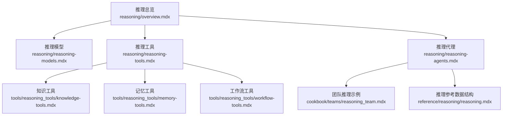
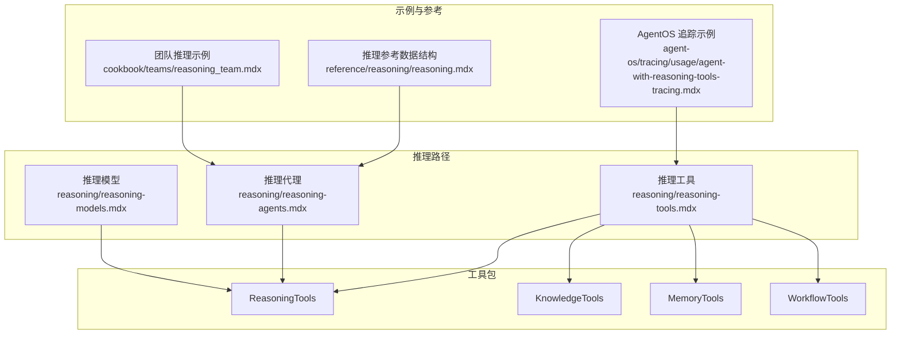
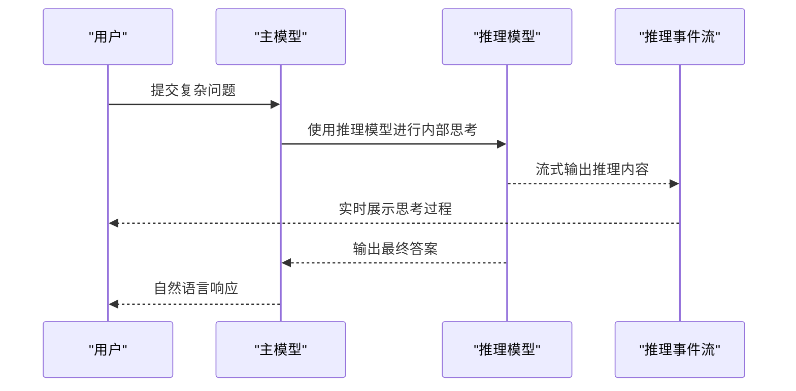
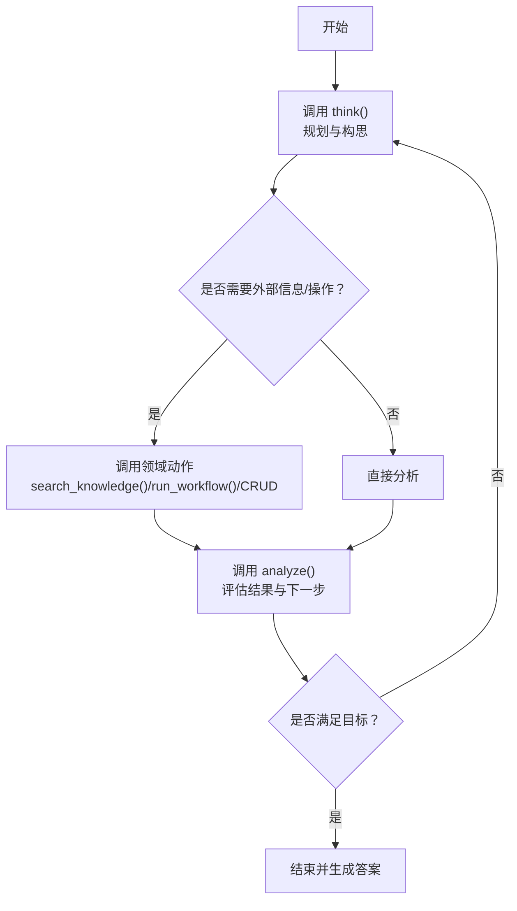
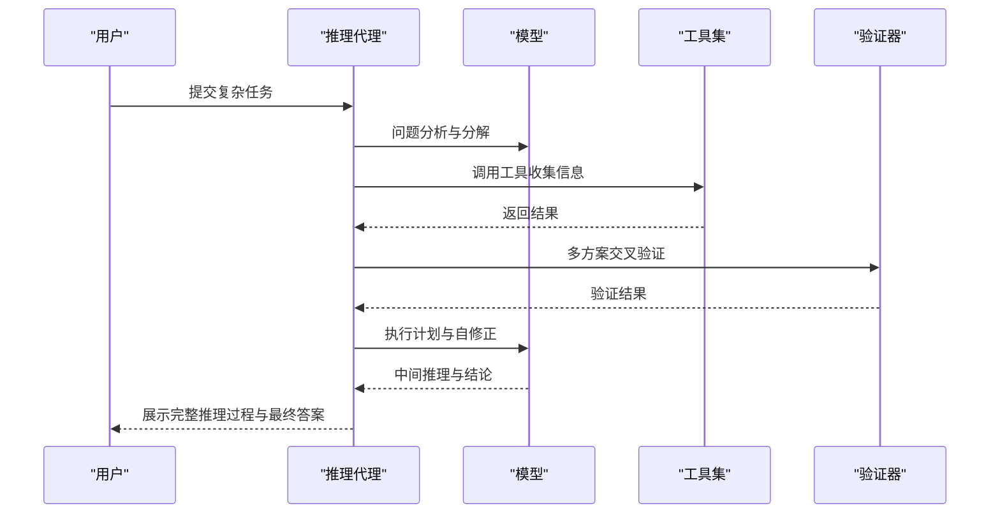
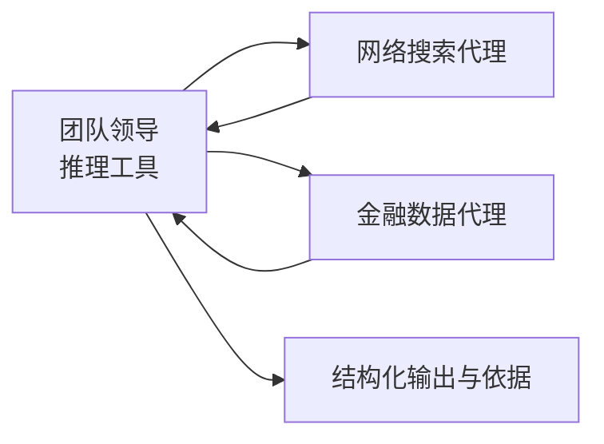
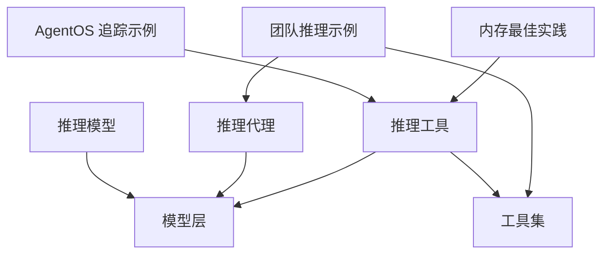

# 推理系统

<cite>
**本文引用的文件**
- [推理总览](file://reasoning/overview.mdx)
- [推理模型](file://reasoning/reasoning-models.mdx)
- [推理工具](file://reasoning/reasoning-tools.mdx)
- [推理代理](file://reasoning/reasoning-agents.mdx)
- [团队推理示例](file://cookbook/teams/reasoning_team.mdx)
- [推理参考数据结构](file://reference/reasoning/reasoning.mdx)
- [AgentOS 推理工具追踪示例](file://agent-os/tracing/usage/agent-with-reasoning-tools-tracing.mdx)
- [推理工具示例：Cerebras Llama](file://examples/reasoning/tools/cerebras-llama-reasoning-tools.mdx)
- [推理工具示例：通用示例](file://examples/reasoning/tools/reasoning-tools.mdx)
- [推理工具示例：IBM Watsonx](file://examples/reasoning/tools/ibm-watsonx-reasoning-tools.mdx)
- [Agent 推理示例：数学证明](file://examples/reasoning/agents/mathematical-proof.mdx)
- [内存最佳实践](file://memory/best-practices.mdx)
- [AgentOS 推理工具追踪示例（完整）](file://examples/agent-os/tracing/agent-with-reasoning-tools-tracing.mdx)
</cite>

## 目录
1. [引言](#引言)
2. [项目结构](#项目结构)
3. [核心组件](#核心组件)
4. [架构总览](#架构总览)
5. [详细组件分析](#详细组件分析)
6. [依赖关系分析](#依赖关系分析)
7. [性能考虑](#性能考虑)
8. [故障排查指南](#故障排查指南)
9. [结论](#结论)
10. [附录](#附录)

## 引言
本技术文档面向推理系统的设计者与使用者，系统性阐述“链式思维”“多跳推理”“复杂问题求解”的核心理念与工程实现，覆盖推理代理的构建与配置、推理模型的选型与参数调优、推理工具（知识、记忆、工作流）的落地方式，并通过数学证明、逻辑推理、科学研究等真实场景示例展示推理系统的应用价值。同时，文档提供性能优化与成本控制策略，以及结果验证与解释方法，帮助在准确性与效率之间取得平衡。

## 项目结构
围绕推理能力，仓库提供了三大路径：
- 推理模型：直接使用具备内置“思考”能力的模型，适合单次复杂任务。
- 推理工具：为任意模型注入显式的“思考/分析”工具，按需启用推理循环。
- 推理代理：对任意模型施加结构化的链式思维框架，自动迭代并自我校验。

图表来源
- [推理总览:1-187](file://reasoning/overview.mdx#L1-L187)
- [推理模型:1-193](file://reasoning/reasoning-models.mdx#L1-L193)
- [推理工具:1-420](file://reasoning/reasoning-tools.mdx#L1-L420)
- [推理代理:1-345](file://reasoning/reasoning-agents.mdx#L1-L345)
- [团队推理示例:1-128](file://cookbook/teams/reasoning_team.mdx#L1-L128)
- [推理参考数据结构:1-26](file://reference/reasoning/reasoning.mdx#L1-L26)

章节来源
- [推理总览:1-187](file://reasoning/overview.mdx#L1-L187)

## 核心组件
- 链式思维（Chain-of-Thought, CoT）：模型内部逐步分解问题，再输出最终答案，适合单次复杂任务。
- ReAct（Reason and Act）：在“思考—行动—观察—重复”循环中，结合工具调用与自验证，适合需要多步工具交互的任务。
- 四类推理工具包：
  - ReasoningTools：通用“思考/分析”，适用于逻辑与数学问题。
  - KnowledgeTools：检索增强推理，结合知识库搜索与分析。
  - MemoryTools：基于用户记忆的增量化推理，支持 CRUD 操作。
  - WorkflowTools：面向工作流执行的推理，支持动态输入与结果评估。

章节来源
- [推理总览:29-75](file://reasoning/overview.mdx#L29-L75)
- [推理工具:11-318](file://reasoning/reasoning-tools.mdx#L11-L318)

## 架构总览
下图展示了三种推理路径在系统中的位置与交互关系，以及与工具包的衔接。

图表来源
- [推理模型:1-193](file://reasoning/reasoning-models.mdx#L1-L193)
- [推理工具:1-420](file://reasoning/reasoning-tools.mdx#L1-L420)
- [推理代理:1-345](file://reasoning/reasoning-agents.mdx#L1-L345)
- [团队推理示例:1-128](file://cookbook/teams/reasoning_team.mdx#L1-L128)
- [推理参考数据结构:1-26](file://reference/reasoning/reasoning.mdx#L1-L26)
- [AgentOS 推理工具追踪示例:1-85](file://agent-os/tracing/usage/agent-with-reasoning-tools-tracing.mdx#L1-L85)

## 详细组件分析

### 组件A：推理模型（Reasoning Models）
- 特点：模型层内置“思考”，无需额外工具，适合单次复杂任务（数学、代码、物理）。
- 配置要点：可与响应模型分离，以“强推理+自然语言输出”组合提升体验；支持高推理强度与流式推理事件。
- 应用建议：对简单任务优先使用原生推理模型；复杂任务可搭配工具或推理代理。

图表来源
- [推理模型:114-178](file://reasoning/reasoning-models.mdx#L114-L178)

章节来源
- [推理模型:1-193](file://reasoning/reasoning-models.mdx#L1-L193)

### 组件B：推理工具（Reasoning Tools）
- 特点：为任意模型注入“思考/分析”工具，按需启用推理循环，透明可控。
- 工具包能力：
  - ReasoningTools：think/analyze，通用推理。
  - KnowledgeTools：think/search_knowledge/analyze，检索增强。
  - MemoryTools：think/get/add/update/delete_memory/analyze，记忆增量化。
  - WorkflowTools：think/run_workflow/analyze，工作流编排推理。
- 使用建议：根据任务域选择工具包；多工具包组合时注意函数名冲突与去重。

图表来源
- [推理工具:238-251](file://reasoning/reasoning-tools.mdx#L238-L251)

章节来源
- [推理工具:1-420](file://reasoning/reasoning-tools.mdx#L1-L420)

### 组件C：推理代理（Reasoning Agents）
- 特点：对任意模型施加结构化链式思维框架，自动迭代、工具调用、自验证，适合多步骤任务。
- 6步框架：问题分析→分解与策略→意图澄清与计划→执行计划→验证→最终答案。
- 配置要点：最小/最大推理步数、显示推理过程、捕获推理事件、自定义推理代理。

图表来源
- [推理代理:29-65](file://reasoning/reasoning-agents.mdx#L29-L65)

章节来源
- [推理代理:1-345](file://reasoning/reasoning-agents.mdx#L1-L345)

### 组件D：团队推理（Reasoning Teams）
- 特点：由推理工具驱动的团队，协调多个专业代理完成复杂查询，如金融研究、市场情报等。
- 示例要点：团队领导使用推理工具规划→委派→合成→呈现，全程可见推理过程。

图表来源
- [团队推理示例:20-82](file://cookbook/teams/reasoning_team.mdx#L20-L82)

章节来源
- [团队推理示例:1-128](file://cookbook/teams/reasoning_team.mdx#L1-L128)

### 组件E：推理参考数据结构（ReasoningStep 等）
- ReasoningStep：表示一次推理步骤，包含标题、推理内容、行动、结果、下一步动作、置信度与元数据。
- NextAction：枚举值，指示继续、验证、最终答案或重置。
- 用途：统一推理事件的数据契约，便于可视化、追踪与调试。

章节来源
- [推理参考数据结构:1-26](file://reference/reasoning/reasoning.mdx#L1-L26)

## 依赖关系分析
- 推理模型与推理代理均依赖于底层模型能力；推理工具不依赖特定模型，但需要合适的提示词与工具集。
- 团队推理示例依赖推理工具与多代理协作；AgentOS 追踪示例用于端到端可观测性。
- 内存工具与推理工具存在耦合：当开启“代理式记忆”时，每次记忆操作会触发嵌套 LLM 调用，需谨慎配置以避免令牌爆炸。

图表来源
- [推理模型:1-193](file://reasoning/reasoning-models.mdx#L1-L193)
- [推理代理:1-345](file://reasoning/reasoning-agents.mdx#L1-L345)
- [推理工具:1-420](file://reasoning/reasoning-tools.mdx#L1-L420)
- [团队推理示例:1-128](file://cookbook/teams/reasoning_team.mdx#L1-L128)
- [AgentOS 推理工具追踪示例:1-85](file://agent-os/tracing/usage/agent-with-reasoning-tools-tracing.mdx#L1-L85)
- [内存最佳实践:1-25](file://memory/best-practices.mdx#L1-L25)

章节来源
- [内存最佳实践:1-25](file://memory/best-practices.mdx#L1-L25)

## 性能考虑
- 合理选择推理路径
  - 单次复杂任务优先推理模型，减少工具往返开销。
  - 多步工具交互与自验证需求强时，优先推理代理或推理工具。
- 控制推理步数与事件流
  - 通过最小/最大推理步数限制迭代次数；仅在需要时开启完整推理展示。
  - 使用事件流实时观测推理进度，避免不必要的全量日志。
- 模型与响应分离
  - 使用强推理模型（如 DeepSeek-R1）解决问题，再用自然语言模型（如 Claude/GPT-4o）生成流畅回答，兼顾准确与表达。
- 记忆与工具的成本陷阱
  - “代理式记忆”会在每次记忆操作触发独立 LLM 调用，随着记忆增长导致令牌用量激增。生产环境建议：
    - 默认启用自动记忆更新；
    - 明确 user_id；
    - 对记忆操作使用更便宜的模型；
    - 实施长期应用的裁剪策略；
    - 生产监控令牌使用，及时发现异常增长。

章节来源
- [推理代理:166-181](file://reasoning/reasoning-agents.mdx#L166-L181)
- [推理模型:89-112](file://reasoning/reasoning-models.mdx#L89-L112)
- [内存最佳实践:1-25](file://memory/best-practices.mdx#L1-L25)

## 故障排查指南
- 无法看到推理过程
  - 确认已开启推理事件流与完整推理展示参数；检查事件类型与捕获逻辑。
- 推理过长或卡顿
  - 调整最小/最大推理步数；必要时降低工具调用频率或合并请求。
- 结果可信度不足
  - 在推理代理中增加验证步骤；在推理工具中引入多源交叉验证。
- 可观测性与调试
  - 使用 AgentOS 追踪示例，启用 tracing 并观察推理事件流，定位瓶颈与错误点。

章节来源
- [AgentOS 推理工具追踪示例:1-85](file://agent-os/tracing/usage/agent-with-reasoning-tools-tracing.mdx#L1-L85)
- [AgentOS 推理工具追踪示例（完整）:1-85](file://examples/agent-os/tracing/agent-with-reasoning-tools-tracing.mdx#L1-L85)

## 结论
推理系统通过“链式思维”“ReAct 循环”与“结构化框架”显著提升了复杂问题求解的质量与可解释性。在工程实践中，应根据任务特性选择推理模型、推理工具或推理代理；通过合理的步数控制、事件流与模型分离策略实现性能与成本的平衡；借助工具包与团队协作完成跨域推理；最后以可观测性与验证机制保障结果可信与可解释。

## 附录

### 实际应用示例索引
- 数学证明：使用推理代理与推理模型对比演示，强调严谨性与可解释性。
- 逻辑推理：通过逻辑谜题训练推理工具的“思考/分析”闭环。
- 科学研究：对论文摘要进行方法学、结果与结论的批判性评估。
- 金融研究：团队推理示例整合网络搜索与金融数据，形成结构化报告。

章节来源
- [Agent 推理示例：数学证明:1-56](file://examples/reasoning/agents/mathematical-proof.mdx#L1-L56)
- [推理工具示例：Cerebras Llama:1-71](file://examples/reasoning/tools/cerebras-llama-reasoning-tools.mdx#L1-L71)
- [推理工具示例：通用示例:1-71](file://examples/reasoning/tools/reasoning-tools.mdx#L1-L71)
- [推理工具示例：IBM Watsonx:1-93](file://examples/reasoning/tools/ibm-watsonx-reasoning-tools.mdx#L1-L93)
- [团队推理示例:1-128](file://cookbook/teams/reasoning_team.mdx#L1-L128)