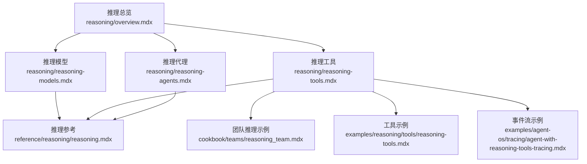
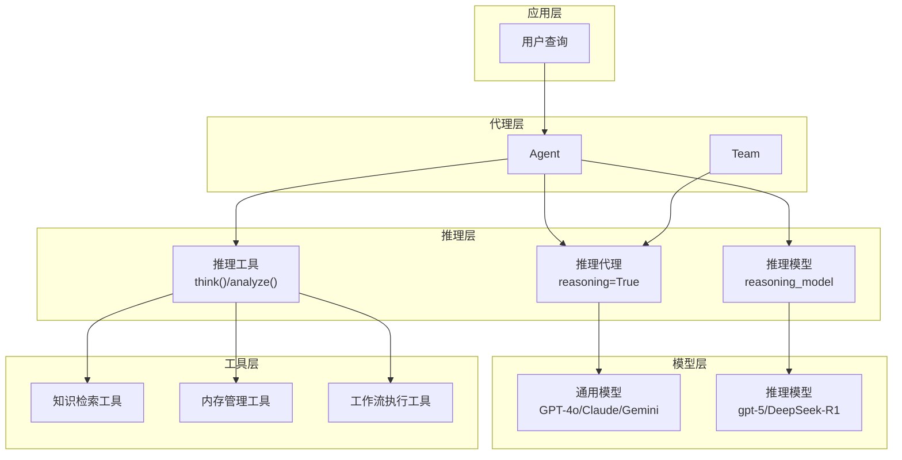
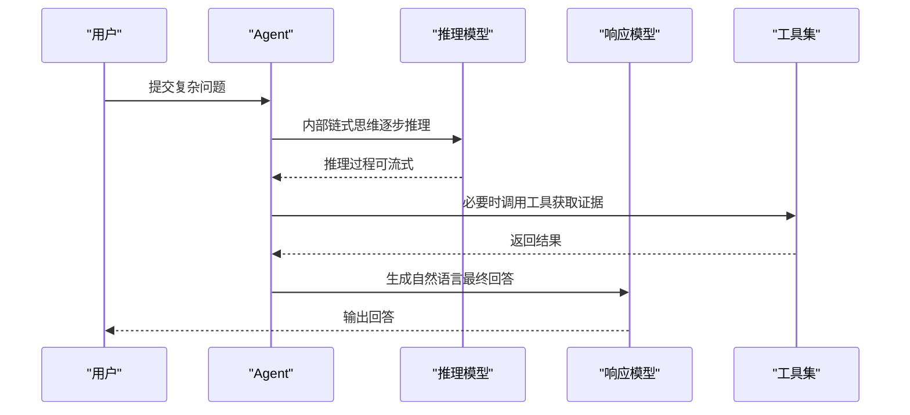
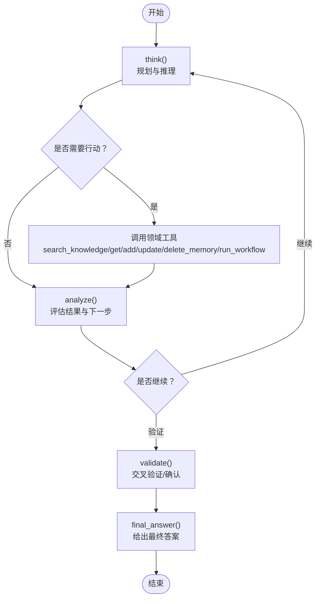
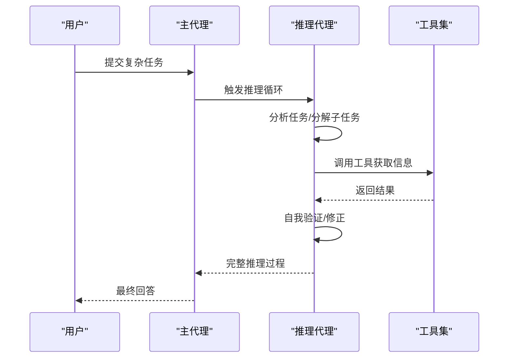
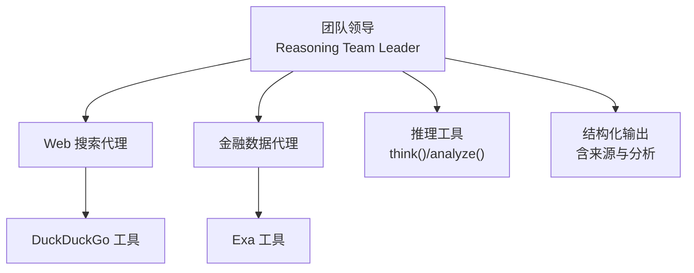
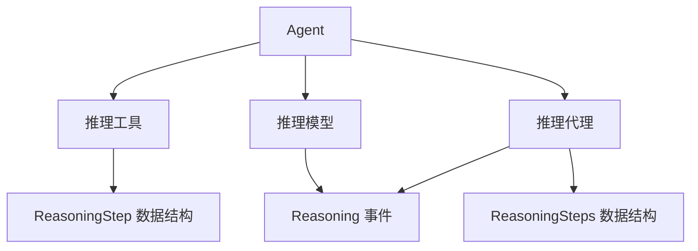

# 推理系统概述

<cite>
**本文引用的文件**
- [推理总览](file://reasoning/overview.mdx)
- [推理模型](file://reasoning/reasoning-models.mdx)
- [推理工具](file://reasoning/reasoning-tools.mdx)
- [推理代理](file://reasoning/reasoning-agents.mdx)
- [团队推理示例](file://cookbook/teams/reasoning_team.mdx)
- [推理参考](file://reference/reasoning/reasoning.mdx)
- [推理事件流示例](file://examples/agent-os/tracing/agent-with-reasoning-tools-tracing.mdx)
- [推理工具示例](file://examples/reasoning/tools/reasoning-tools.mdx)
</cite>

## 目录
1. [引言](#引言)
2. [项目结构](#项目结构)
3. [核心组件](#核心组件)
4. [架构总览](#架构总览)
5. [详细组件分析](#详细组件分析)
6. [依赖关系分析](#依赖关系分析)
7. [性能考量](#性能考量)
8. [故障排查指南](#故障排查指南)
9. [结论](#结论)
10. [附录](#附录)

## 引言
本文件面向开发者与产品团队，系统性介绍推理系统在代理中的价值与落地方式。推理系统通过“链式思维”“多跳推理”与“复杂问题求解”，显著提升代理在多步骤思考、自我验证、错误纠正与战略规划方面的能力。Agno 提供三种推理实现路径：
- 推理模型：原生具备内部链式思维的模型（如 gpt-5、Claude 4.5 Sonnet Thinking、DeepSeek-R1），适合单次复杂任务。
- 推理工具：为任意模型注入显式的“思考/分析”工具（如 think()/analyze()），让代理按需决定何时思考、何时行动。
- 推理代理：以结构化链式思维对任何模型进行增强，自动迭代执行计划、行动、验证与最终回答。

## 项目结构
围绕推理主题，仓库提供了从概览到具体实现、从示例到参考的完整知识谱系：
- 概览与选型：reasoning/overview.mdx
- 三类实现详解：reasoning/reasoning-models.mdx、reasoning/reasoning-tools.mdx、reasoning/reasoning-agents.mdx
- 团队级推理示例：cookbook/teams/reasoning_team.mdx
- 推理数据结构与事件：reference/reasoning/reasoning.mdx
- 实时事件流与追踪示例：examples/agent-os/tracing/agent-with-reasoning-tools-tracing.mdx
- 工具示例：examples/reasoning/tools/reasoning-tools.mdx

图表来源
- [推理总览:1-187](file://reasoning/overview.mdx#L1-L187)
- [推理模型:1-193](file://reasoning/reasoning-models.mdx#L1-L193)
- [推理工具:1-420](file://reasoning/reasoning-tools.mdx#L1-L420)
- [推理代理:1-345](file://reasoning/reasoning-agents.mdx#L1-L345)
- [团队推理示例:1-128](file://cookbook/teams/reasoning_team.mdx#L1-L128)
- [推理参考:1-186](file://reference/reasoning/reasoning.mdx#L1-L186)
- [推理工具示例:1-108](file://examples/reasoning/tools/reasoning-tools.mdx#L1-L108)
- [推理事件流示例:1-120](file://examples/agent-os/tracing/agent-with-reasoning-tools-tracing.mdx#L1-L120)

章节来源
- [推理总览:1-187](file://reasoning/overview.mdx#L1-L187)

## 核心组件
- 链式思维（Chain-of-Thought, CoT）：模型或代理在生成最终答案前，先进行内部逐步推理。
- ReAct（Reason and Act）：代理在“思考—行动—观察—重复”的循环中，结合工具调用与结果验证，逐步逼近正确答案。
- 三种实现路径：
  - 推理模型：原生具备内部链式思维，适合单次复杂任务；可与响应模型分离，兼顾“准确推理+自然输出”。
  - 推理工具：为任意模型注入 think()/analyze() 等显式工具，按需控制“何时思考、何时行动”。
  - 推理代理：对任意模型施加结构化链式思维框架，自动迭代执行计划、行动、验证与最终回答。

章节来源
- [推理总览:23-41](file://reasoning/overview.mdx#L23-L41)
- [推理模型:1-14](file://reasoning/reasoning-models.mdx#L1-L14)
- [推理工具:8-37](file://reasoning/reasoning-tools.mdx#L8-L37)
- [推理代理:15-65](file://reasoning/reasoning-agents.mdx#L15-L65)

## 架构总览
下图展示了三种推理实现路径在系统中的位置与交互关系，以及与模型、工具、代理的关系。

图表来源
- [推理模型:1-14](file://reasoning/reasoning-models.mdx#L1-L14)
- [推理工具:11-24](file://reasoning/reasoning-tools.mdx#L11-L24)
- [推理代理:17-27](file://reasoning/reasoning-agents.mdx#L17-L27)

## 详细组件分析

### 组件A：推理模型
- 特点
  - 原生内部链式思维，适合单次复杂任务（数学、编码、物理等）。
  - 可与响应模型分离，实现“强推理+自然输出”的组合。
  - 支持推理内容流式输出与事件捕获，便于可观测性与调试。
- 典型场景
  - 单次复杂问题求解（如伦理难题、数学证明、科学论文评估）。
  - 需要高置信度但不频繁交互的任务。
- 配置要点
  - 选择推理模型（如 gpt-5、DeepSeek-R1）。
  - 可选设置推理强度（如 reasoning_effort）。
  - 可选搭配响应模型（如 Claude）以获得更自然的输出。
  - 启用流式推理与事件监听，便于实时观测。
- 使用示例
  - 直接使用推理模型进行复杂问题求解。
  - 将推理模型与响应模型组合，兼顾准确与表达。
  - 在团队中作为成员使用推理模型，与其他成员协同。

图表来源
- [推理模型:114-140](file://reasoning/reasoning-models.mdx#L114-L140)
- [推理模型:142-178](file://reasoning/reasoning-models.mdx#L142-L178)

章节来源
- [推理模型:1-193](file://reasoning/reasoning-models.mdx#L1-L193)

### 组件B：推理工具
- 特点
  - 为任意模型注入显式“思考/分析”工具，按需控制何时思考、何时行动。
  - 提供四种专用工具包：通用推理、知识检索、内存管理、工作流执行。
  - 严格遵循“Think → Act → Analyze → Repeat”的循环，贴近人类思维模式。
- 典型场景
  - 需要结构化研究与分析的任务（如文献检索、用户偏好记忆、多步工作流编排）。
  - 对推理过程可见性有较高要求的场景。
- 配置要点
  - 选择合适的工具包（ReasoningTools/KnowledgeTools/MemoryTools/WorkflowTools）。
  - 控制 think()/analyze() 的启用与自定义指令、示例。
  - 可组合多个工具包，注意函数名唯一性或自定义重命名。
- 使用示例
  - 使用 ReasoningTools 进行逻辑推理与数学比较。
  - 使用 KnowledgeTools 结合知识库进行多轮检索与分析。
  - 使用 MemoryTools 记忆与更新用户偏好，支持个性化交互。
  - 使用 WorkflowTools 编排多步骤自动化流程。

图表来源
- [推理工具:240-251](file://reasoning/reasoning-tools.mdx#L240-L251)

章节来源
- [推理工具:1-420](file://reasoning/reasoning-tools.mdx#L1-L420)

### 组件C：推理代理
- 特点
  - 对任意模型施加结构化链式思维框架，自动迭代执行“计划—行动—验证—最终回答”。
  - 支持最小/最大推理步数控制，防止无限循环。
  - 支持事件流与完整推理过程展示，便于可观测性与调试。
- 典型场景
  - 多步骤、多工具调用的复杂任务（如旅行规划、科学论文批判性评估）。
  - 需要自动链式思维与自我校验的场景。
- 配置要点
  - 设置 reasoning=True，必要时指定 reasoning_model 或自定义 reasoning_agent。
  - 调整 reasoning_min_steps 与 reasoning_max_steps。
  - 开启 show_full_reasoning 与 stream_events 观察推理过程。
- 使用示例
  - 将普通模型（如 GPT-4o、Claude Sonnet）转换为推理代理。
  - 结合工具（如 HackerNews）进行多轮信息收集与验证。
  - 在团队中作为领导者协调成员，展示透明的决策过程。

图表来源
- [推理代理:29-65](file://reasoning/reasoning-agents.mdx#L29-L65)
- [推理代理:166-181](file://reasoning/reasoning-agents.mdx#L166-L181)

章节来源
- [推理代理:1-345](file://reasoning/reasoning-agents.mdx#L1-L345)

### 团队级推理示例
- 场景：构建一个由 Web 搜索代理、金融数据代理与团队领导组成的推理团队，领导使用推理工具进行透明的分析与决策，协调成员完成公司与股价信息的检索与呈现。
- 关键点：团队成员角色明确，推理过程可见，最终输出包含来源与结构化数据。

图表来源
- [团队推理示例:34-83](file://cookbook/teams/reasoning_team.mdx#L34-L83)

章节来源
- [团队推理示例:1-128](file://cookbook/teams/reasoning_team.mdx#L1-L128)

## 依赖关系分析
- 三类推理实现均依赖于 Agent/Team 的运行时环境与事件系统。
- 推理模型依赖于特定模型提供商的推理能力与参数（如 reasoning_effort）。
- 推理工具依赖于具体工具包（知识库、内存、工作流）的可用性与配置。
- 推理代理依赖于主代理的模型与工具，同时通过内部推理循环与事件系统进行可观测性。

图表来源
- [推理参考:8-45](file://reference/reasoning/reasoning.mdx#L8-L45)
- [推理参考:97-155](file://reference/reasoning/reasoning.mdx#L97-L155)

章节来源
- [推理参考:1-186](file://reference/reasoning/reasoning.mdx#L1-L186)

## 性能考量
- 推理模型
  - 流式推理与事件监听会增加网络与计算开销，建议仅在需要可观测性时开启。
  - 推理强度（reasoning_effort）越高，响应时间越长，应根据任务复杂度权衡。
- 推理工具
  - 工具调用次数越多，整体耗时越长；合理设计“思考—行动—分析”的迭代次数。
  - 多工具包组合时，注意避免重复注册导致的性能损耗。
- 推理代理
  - 最小/最大推理步数直接影响响应时间与准确性，建议从较低步数起步，逐步调整。
  - 事件流与完整推理展示会增加输出体积，生产环境可按需关闭。

## 故障排查指南
- 无法看到推理过程
  - 检查是否启用 show_full_reasoning 与 stream_events。
  - 对于推理模型，确认已启用推理事件流（reasoning_started、reasoning_content_delta、run_content）。
- 推理循环过长或卡住
  - 调整 reasoning_min_steps 与 reasoning_max_steps，确保不会无限循环。
  - 检查工具调用是否返回预期结果，避免无效循环。
- 多工具包冲突
  - 当组合多个工具包时，若出现函数名冲突，禁用后续工具包中的 think/analyze，或自定义重命名。
- 事件监听异常
  - 确认事件类型与属性与参考一致（ReasoningStarted、ReasoningStep、ReasoningCompleted）。

章节来源
- [推理参考:170-178](file://reference/reasoning/reasoning.mdx#L170-L178)
- [推理参考:101-155](file://reference/reasoning/reasoning.mdx#L101-L155)
- [推理代理:166-181](file://reasoning/reasoning-agents.mdx#L166-L181)
- [推理工具:263-303](file://reasoning/reasoning-tools.mdx#L263-L303)

## 结论
推理系统通过链式思维、ReAct 循环与结构化框架，显著提升了代理在复杂问题求解中的能力。选择何种实现路径取决于任务特性与工程约束：
- 单次复杂任务且信任模型内部推理：优先推理模型。
- 需要显式控制与可见性：优先推理工具。
- 需要自动链式思维与自我校验：优先推理代理。
在实际工程中，可将三者组合使用，以达到“强推理+可控过程+自然输出”的平衡。

## 附录

### 三种实现方式对比与选型建议
- 推理模型：连续（完整推理轨迹）、适合单次复杂问题、需推理能力模型。
- 推理工具：结构化（显式逐步）、适合结构化研究与分析、适用于任意模型。
- 推理代理：迭代（代理交互）、适合多步骤工具型任务、适用于任意模型。

章节来源
- [推理总览:176-184](file://reasoning/overview.mdx#L176-L184)

### 实际使用示例与最佳实践
- 示例一：使用推理工具进行逻辑谜题求解
  - 使用 ReasoningTools 注入 think()/analyze()，按需控制推理过程。
  - 参考：[推理工具示例:1-108](file://examples/reasoning/tools/reasoning-tools.mdx#L1-L108)
- 示例二：团队推理协作（Web 搜索 + 金融数据 + 推理领导）
  - 团队领导使用推理工具进行透明分析，协调成员完成信息整合。
  - 参考：[团队推理示例:1-128](file://cookbook/teams/reasoning_team.mdx#L1-L128)
- 示例三：推理事件流与追踪
  - 通过事件监听实时查看推理开始、推理步骤与完成事件。
  - 参考：[推理事件流示例:1-120](file://examples/agent-os/tracing/agent-with-reasoning-tools-tracing.mdx#L1-L120)