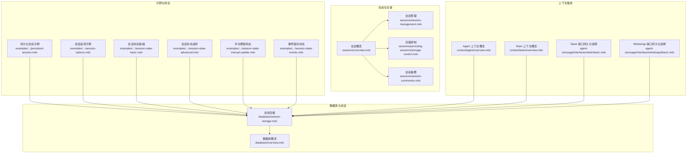
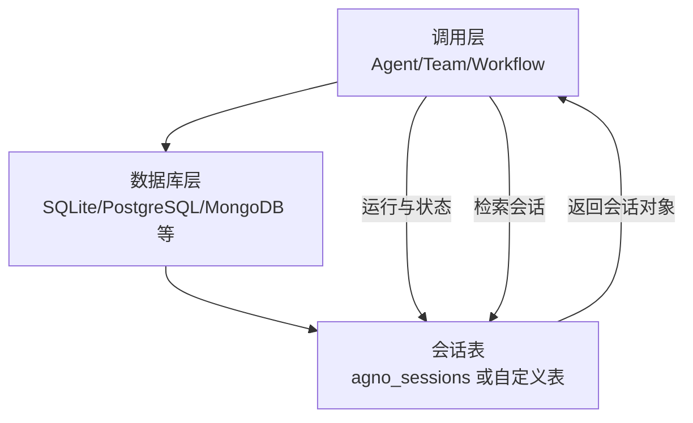
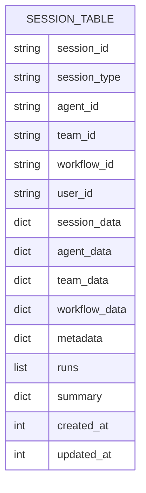
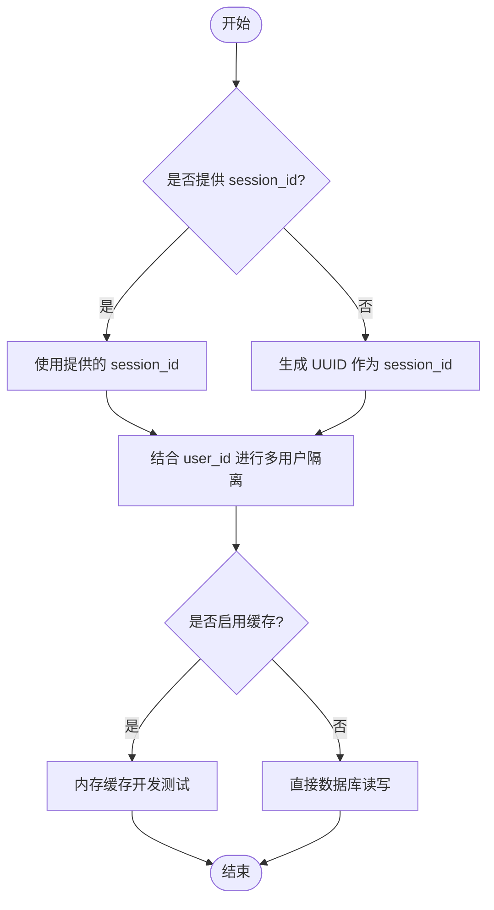
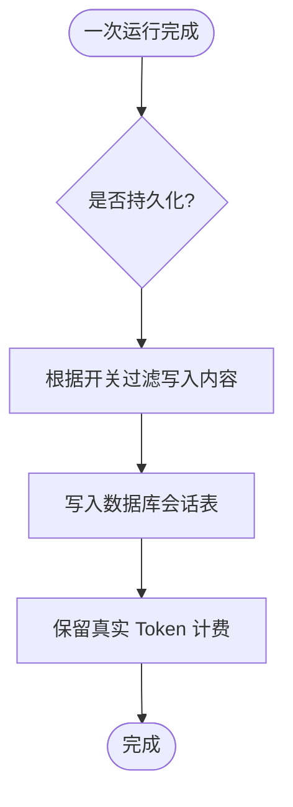
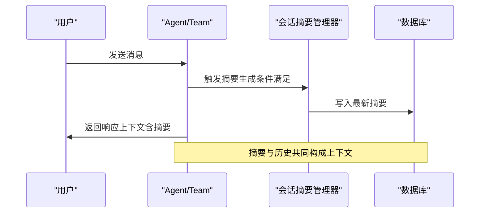
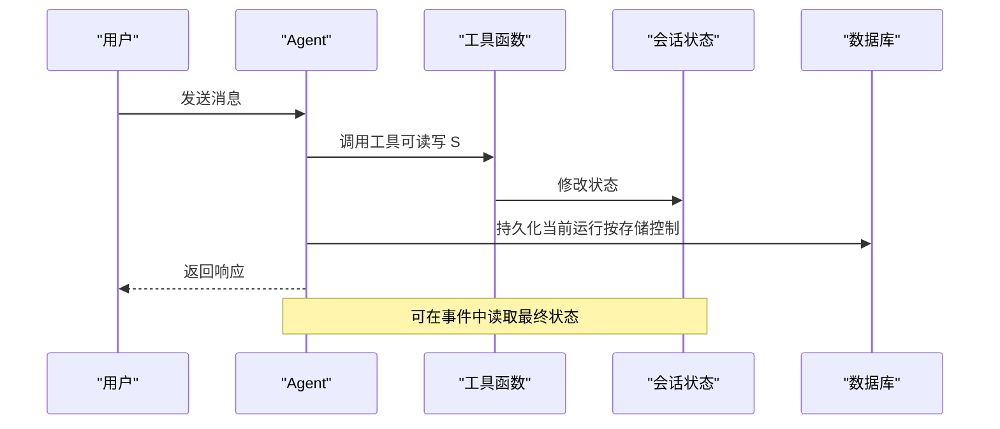
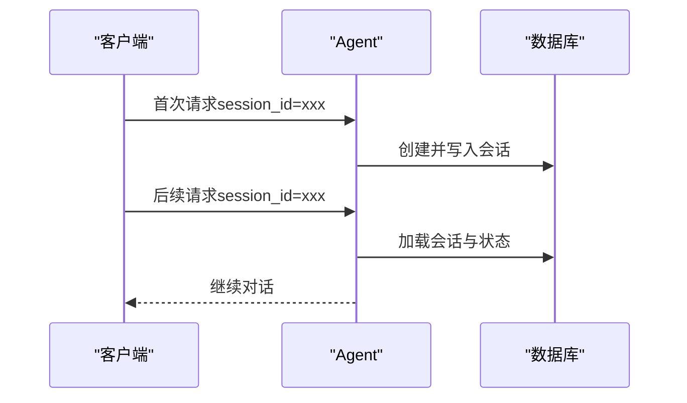
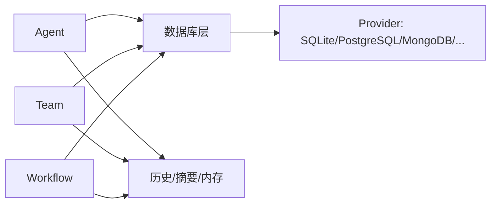

# 会话存储

<cite>
**本文引用的文件**
- [database/session-storage.mdx](file://database/session-storage.mdx)
- [sessions/overview.mdx](file://sessions/overview.mdx)
- [sessions/session-management.mdx](file://sessions/session-management.mdx)
- [sessions/persisting-sessions/storage-control.mdx](file://sessions/persisting-sessions/storage-control.mdx)
- [sessions/session-summaries.mdx](file://sessions/session-summaries.mdx)
- [database/overview.mdx](file://database/overview.mdx)
- [examples/agents/state-and-session/persistent-session.mdx](file://examples/agents/state-and-session/persistent-session.mdx)
- [examples/agents/state-and-session/session-options.mdx](file://examples/agents/state-and-session/session-options.mdx)
- [examples/agents/state-and-session/session-state-basic.mdx](file://examples/agents/state-and-session/session-state-basic.mdx)
- [examples/agents/state-and-session/session-state-advanced.mdx](file://examples/agents/state-and-session/session-state-advanced.mdx)
- [examples/agents/state-and-session/session-state-manual-update.mdx](file://examples/agents/state-and-session/session-state-manual-update.mdx)
- [examples/agents/state-and-session/session-state-events.mdx](file://examples/agents/state-and-session/session-state-events.mdx)
- [context/agent/overview.mdx](file://context/agent/overview.mdx)
- [context/team/overview.mdx](file://context/team/overview.mdx)
- [agent-os/usage/interfaces/slack/basic.mdx](file://agent-os/usage/interfaces/slack/basic.mdx)
- [agent-os/usage/interfaces/whatsapp/basic.mdx](file://agent-os/usage/interfaces/whatsapp/basic.mdx)
</cite>

## 目录
1. [简介](#简介)
2. [项目结构](#项目结构)
3. [核心组件](#核心组件)
4. [架构总览](#架构总览)
5. [详细组件分析](#详细组件分析)
6. [依赖关系分析](#依赖关系分析)
7. [性能考量](#性能考量)
8. [故障排查指南](#故障排查指南)
9. [结论](#结论)
10. [附录](#附录)

## 简介
本文件系统性介绍会话存储能力：如何将用户与代理（Agent）、团队（Team）或工作流（Workflow）之间的多轮交互持久化到数据库，使会话在不同时间点保持连贯性。内容涵盖会话 ID 生成策略、存储的数据结构与生命周期、会话状态与上下文管理、会话恢复与过期处理、安全与隐私保护、配置示例与最佳实践，以及监控与调试方法。

## 项目结构
围绕会话存储的关键文档分布在以下模块：
- 数据库与会话存储：定义会话表结构、检索接口与适用范围
- 会话概览与管理：会话概念、ID 策略、命名与缓存
- 存储控制：媒体、工具消息与历史消息的持久化开关
- 会话摘要：长对话压缩与成本优化
- 示例与用法：Agent/Team/Workflow 的持久化与状态维护
- 上下文集成：会话与历史、知识、内存等的协同

**图表来源**
- [sessions/overview.mdx:1-87](file://sessions/overview.mdx#L1-L87)
- [sessions/session-management.mdx:1-189](file://sessions/session-management.mdx#L1-L189)
- [sessions/persisting-sessions/storage-control.mdx:1-208](file://sessions/persisting-sessions/storage-control.mdx#L1-L208)
- [sessions/session-summaries.mdx:1-184](file://sessions/session-summaries.mdx#L1-L184)
- [database/session-storage.mdx:1-119](file://database/session-storage.mdx#L1-L119)
- [database/overview.mdx:1-130](file://database/overview.mdx#L1-L130)
- [examples/agents/state-and-session/persistent-session.mdx:1-50](file://examples/agents/state-and-session/persistent-session.mdx#L1-L50)
- [examples/agents/state-and-session/session-options.mdx:1-65](file://examples/agents/state-and-session/session-options.mdx#L1-L65)
- [examples/agents/state-and-session/session-state-basic.mdx:1-70](file://examples/agents/state-and-session/session-state-basic.mdx#L1-L70)
- [examples/agents/state-and-session/session-state-advanced.mdx:1-124](file://examples/agents/state-and-session/session-state-advanced.mdx#L1-L124)
- [examples/agents/state-and-session/session-state-manual-update.mdx:1-73](file://examples/agents/state-and-session/session-state-manual-update.mdx#L1-L73)
- [examples/agents/state-and-session/session-state-events.mdx:1-72](file://examples/agents/state-and-session/session-state-events.mdx#L1-L72)
- [context/agent/overview.mdx:321-321](file://context/agent/overview.mdx#L321-L321)
- [context/team/overview.mdx:477-477](file://context/team/overview.mdx#L477-L477)
- [agent-os/usage/interfaces/slack/basic.mdx:65-65](file://agent-os/usage/interfaces/slack/basic.mdx#L65-L65)
- [agent-os/usage/interfaces/whatsapp/basic.mdx:68-68](file://agent-os/usage/interfaces/whatsapp/basic.mdx#L68-L68)

**章节来源**
- [sessions/overview.mdx:1-87](file://sessions/overview.mdx#L1-L87)
- [database/overview.mdx:1-130](file://database/overview.mdx#L1-L130)

## 核心组件
- 会话表与字段：会话记录包含会话标识、类型、所属主体（Agent/Team/Workflow）、用户标识、会话数据、元数据、运行列表、摘要、时间戳等，支持按自定义表名存储。
- 会话检索：通过统一的会话检索接口按 session_id 获取完整会话，包含运行列表与消息历史。
- 会话生命周期：会话随首次运行创建；无数据库时仅单次交互有效；启用数据库后可跨请求延续。
- 会话状态：在 Agent/Team/Workflow 中维护共享状态，支持初始化、工具修改、事件回调与手动更新。
- 历史与摘要：可选择是否存储历史消息、媒体与工具结果；支持自动摘要以降低上下文开销。
- 会话管理：支持自定义 session_id、命名、自动命名与内存缓存（开发测试用途）。

**章节来源**
- [database/session-storage.mdx:9-119](file://database/session-storage.mdx#L9-L119)
- [sessions/overview.mdx:12-28](file://sessions/overview.mdx#L12-L28)
- [sessions/session-management.mdx:10-189](file://sessions/session-management.mdx#L10-L189)
- [sessions/persisting-sessions/storage-control.mdx:8-208](file://sessions/persisting-sessions/storage-control.mdx#L8-L208)
- [sessions/session-summaries.mdx:44-184](file://sessions/session-summaries.mdx#L44-L184)

## 架构总览
会话存储贯穿“调用层（Agent/Team/Workflow）—数据库层（多种 Provider）—会话表”的链路。调用层负责运行与状态维护，数据库层负责持久化与检索，会话表承载会话元数据与运行记录。

**图表来源**
- [database/session-storage.mdx:7-119](file://database/session-storage.mdx#L7-L119)
- [database/overview.mdx:105-121](file://database/overview.mdx#L105-L121)

## 详细组件分析

### 会话表结构与检索
- 表结构要点：session_id、session_type、agent_id/team_id/workflow_id、user_id、session_data、agent_data、team_data、workflow_data、metadata、runs、summary、created_at、updated_at。
- 检索方式：通过统一接口按 session_id 获取会话，访问 runs 与消息列表。
- 适用范围：对 Agent、Team、Workflow 均一致。

**图表来源**
- [database/session-storage.mdx:30-51](file://database/session-storage.mdx#L30-L51)

**章节来源**
- [database/session-storage.mdx:30-92](file://database/session-storage.mdx#L30-L92)

### 会话 ID 生成与管理
- 自动生成：未指定 session_id 时由系统生成唯一标识。
- 手动指定：结合 user_id 实现多用户隔离与自定义追踪。
- 命名与缓存：支持手动命名与自动命名（基于模型生成），支持内存缓存（开发测试）。

**图表来源**
- [sessions/session-management.mdx:10-189](file://sessions/session-management.mdx#L10-L189)

**章节来源**
- [sessions/session-management.mdx:10-189](file://sessions/session-management.mdx#L10-L189)

### 存储控制：媒体/工具/历史消息
- 三类开关：
  - store_media：控制图片、视频、音频与上传文件是否持久化。
  - store_tool_messages：控制工具调用与结果是否持久化，并移除对应助手消息中的工具引用。
  - store_history_messages：控制历史消息是否持久化，默认关闭以避免膨胀。
- 运行时一切照常，仅在落库阶段过滤；建议配合外部存储（如对象存储）存放大体积媒体。

**图表来源**
- [sessions/persisting-sessions/storage-control.mdx:8-208](file://sessions/persisting-sessions/storage-control.mdx#L8-L208)

**章节来源**
- [sessions/persisting-sessions/storage-control.mdx:8-208](file://sessions/persisting-sessions/storage-control.mdx#L8-L208)

### 会话摘要：长对话压缩
- 自动摘要：在满足条件后自动生成并更新摘要，存储于数据库。
- 上下文注入：默认启用摘要注入，减少上下文长度；可与近期历史组合使用。
- 成本优化：摘要生成可使用低成本模型或异步任务。

**图表来源**
- [sessions/session-summaries.mdx:44-170](file://sessions/session-summaries.mdx#L44-L170)

**章节来源**
- [sessions/session-summaries.mdx:44-184](file://sessions/session-summaries.mdx#L44-L184)

### 会话状态与上下文
- 初始化：在创建 Agent/Team/Workflow 时传入初始 session_state。
- 工具修改：工具函数可通过运行上下文访问与修改 session_state。
- 事件回调：运行完成后事件中可读取最终 session_state。
- 手动更新：支持在运行后读取并更新 session_state 并写回。

**图表来源**
- [examples/agents/state-and-session/session-state-basic.mdx:21-56](file://examples/agents/state-and-session/session-state-basic.mdx#L21-L56)
- [examples/agents/state-and-session/session-state-advanced.mdx:24-110](file://examples/agents/state-and-session/session-state-advanced.mdx#L24-L110)
- [examples/agents/state-and-session/session-state-events.mdx:50-58](file://examples/agents/state-and-session/session-state-events.mdx#L50-L58)
- [examples/agents/state-and-session/session-state-manual-update.mdx:50-58](file://examples/agents/state-and-session/session-state-manual-update.mdx#L50-L58)

**章节来源**
- [examples/agents/state-and-session/session-state-basic.mdx:1-70](file://examples/agents/state-and-session/session-state-basic.mdx#L1-L70)
- [examples/agents/state-and-session/session-state-advanced.mdx:1-124](file://examples/agents/state-and-session/session-state-advanced.mdx#L1-L124)
- [examples/agents/state-and-session/session-state-events.mdx:1-72](file://examples/agents/state-and-session/session-state-events.mdx#L1-L72)
- [examples/agents/state-and-session/session-state-manual-update.mdx:1-73](file://examples/agents/state-and-session/session-state-manual-update.mdx#L1-L73)

### 会话恢复与过期处理
- 恢复：通过相同 session_id 在后续请求中继续同一会话，数据库保存的历史与状态会被加载。
- 过期：会话本身无内置过期字段；可通过业务策略在应用层实现“超时清理”或“归档迁移”。

**图表来源**
- [sessions/overview.mdx:30-58](file://sessions/overview.mdx#L30-L58)
- [database/session-storage.mdx:52-92](file://database/session-storage.mdx#L52-L92)

**章节来源**
- [sessions/overview.mdx:30-58](file://sessions/overview.mdx#L30-L58)
- [database/session-storage.mdx:52-92](file://database/session-storage.mdx#L52-L92)

### 安全与隐私
- 敏感数据处理：建议将大体量媒体与敏感内容外置存储（如对象存储），数据库仅存引用。
- 访问控制：通过数据库连接权限与应用侧鉴权控制会话数据访问。
- 隐私保护：按需关闭 store_history_messages/store_tool_messages/store_media，减少持久化面；必要时对数据库进行加密与审计。

**章节来源**
- [sessions/persisting-sessions/storage-control.mdx:47-124](file://sessions/persisting-sessions/storage-control.mdx#L47-L124)

### 实际配置示例与路径
- 启用持久化会话（PostgreSQL 自定义表名）
  - 参考路径：[examples/agents/state-and-session/persistent-session.mdx:17-29](file://examples/agents/state-and-session/persistent-session.mdx#L17-L29)
- 控制存储开关（不存储历史消息）
  - 参考路径：[examples/agents/state-and-session/session-options.mdx:21-27](file://examples/agents/state-and-session/session-options.mdx#L21-L27)
- 会话状态基础（初始化与工具修改）
  - 参考路径：[examples/agents/state-and-session/session-state-basic.mdx:34-43](file://examples/agents/state-and-session/session-state-basic.mdx#L34-L43)
- 会话状态进阶（增删查与指令中使用）
  - 参考路径：[examples/agents/state-and-session/session-state-advanced.mdx:71-86](file://examples/agents/state-and-session/session-state-advanced.mdx#L71-L86)
- 事件与手动更新
  - 参考路径：[examples/agents/state-and-session/session-state-events.mdx:50-58](file://examples/agents/state-and-session/session-state-events.mdx#L50-L58)、[examples/agents/state-and-session/session-state-manual-update.mdx:50-58](file://examples/agents/state-and-session/session-state-manual-update.mdx#L50-L58)

**章节来源**
- [examples/agents/state-and-session/persistent-session.mdx:1-50](file://examples/agents/state-and-session/persistent-session.mdx#L1-L50)
- [examples/agents/state-and-session/session-options.mdx:1-65](file://examples/agents/state-and-session/session-options.mdx#L1-L65)
- [examples/agents/state-and-session/session-state-basic.mdx:1-70](file://examples/agents/state-and-session/session-state-basic.mdx#L1-L70)
- [examples/agents/state-and-session/session-state-advanced.mdx:1-124](file://examples/agents/state-and-session/session-state-advanced.mdx#L1-L124)
- [examples/agents/state-and-session/session-state-events.mdx:1-72](file://examples/agents/state-and-session/session-state-events.mdx#L1-L72)
- [examples/agents/state-and-session/session-state-manual-update.mdx:1-73](file://examples/agents/state-and-session/session-state-manual-update.mdx#L1-L73)

## 依赖关系分析
- 组件耦合：调用层（Agent/Team/Workflow）依赖数据库层；会话表为共享存储载体。
- 外部依赖：支持多种数据库 Provider，异步版本与同步版本需匹配引擎类型。
- 上下文集成：会话与历史、知识、内存等模块协同，历史需显式开启注入。

**图表来源**
- [database/overview.mdx:91-121](file://database/overview.mdx#L91-L121)
- [context/agent/overview.mdx:321-321](file://context/agent/overview.mdx#L321-L321)
- [context/team/overview.mdx:477-477](file://context/team/overview.mdx#L477-L477)

**章节来源**
- [database/overview.mdx:91-130](file://database/overview.mdx#L91-L130)
- [context/agent/overview.mdx:321-321](file://context/agent/overview.mdx#L321-L321)
- [context/team/overview.mdx:477-477](file://context/team/overview.mdx#L477-L477)

## 性能考量
- 会话缓存：启用内存缓存可减少数据库往返，但不建议生产使用。
- 存储控制：关闭 store_media/store_tool_messages/store_history_messages 可显著降低存储与查询压力。
- 会话摘要：对长对话启用摘要，减少上下文长度，提升吞吐与降低成本。
- 异步数据库：在高并发场景使用异步数据库类，避免阻塞。

**章节来源**
- [sessions/session-management.mdx:140-189](file://sessions/session-management.mdx#L140-L189)
- [sessions/persisting-sessions/storage-control.mdx:167-201](file://sessions/persisting-sessions/storage-control.mdx#L167-L201)
- [sessions/session-summaries.mdx:109-170](file://sessions/session-summaries.mdx#L109-L170)
- [database/overview.mdx:109-121](file://database/overview.mdx#L109-L121)

## 故障排查指南
- 缺少数据库：无数据库时会话无法跨请求持久化，仅单次有效。
- 引擎类型不匹配：同步/异步数据库类与引擎需成对使用，否则抛出上下文异常。
- 历史注入与存储：若历史未持久化但需要在后续会话中使用，需开启 store_history_messages 或在应用层自行管理。
- 媒体与工具存储：大体量媒体与工具结果可能导致表膨胀，建议外置存储并关闭相应开关。

**章节来源**
- [database/overview.mdx:122-130](file://database/overview.mdx#L122-L130)
- [sessions/persisting-sessions/storage-control.mdx:24-36](file://sessions/persisting-sessions/storage-control.mdx#L24-L36)

## 结论
会话存储通过统一的会话表与检索接口，为 Agent/Team/Workflow 提供了跨请求的连续对话体验。结合存储控制与会话摘要，可在保证效果的同时显著优化成本与性能。建议在生产中采用合适的数据库 Provider、外置大体量资源、合理开关与摘要策略，并在应用层实现必要的访问控制与审计机制。

## 附录
- 会话与接口集成：Slack/WhatsApp 等接口层也依赖数据库实现会话持久化。
- 数据库概览：快速入门示例与异步数据库使用说明。

**章节来源**
- [agent-os/usage/interfaces/slack/basic.mdx:65-65](file://agent-os/usage/interfaces/slack/basic.mdx#L65-L65)
- [agent-os/usage/interfaces/whatsapp/basic.mdx:68-68](file://agent-os/usage/interfaces/whatsapp/basic.mdx#L68-L68)
- [database/overview.mdx:20-39](file://database/overview.mdx#L20-L39)
- [database/overview.mdx:109-121](file://database/overview.mdx#L109-L121)