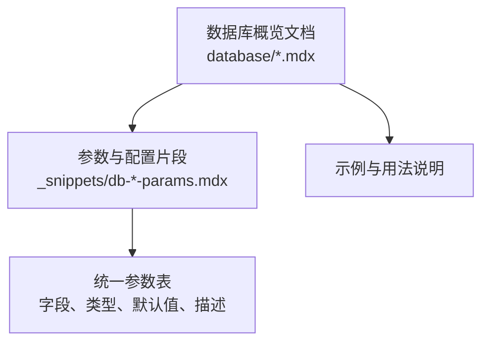
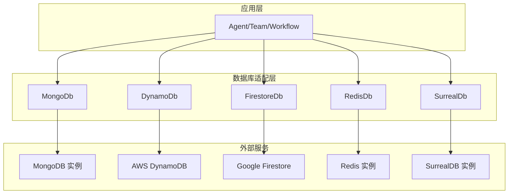
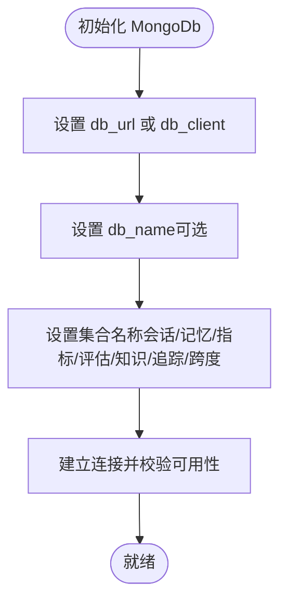
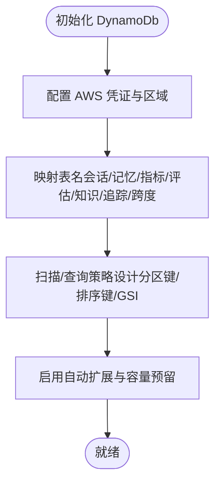
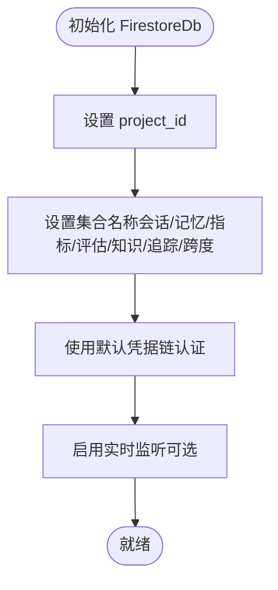
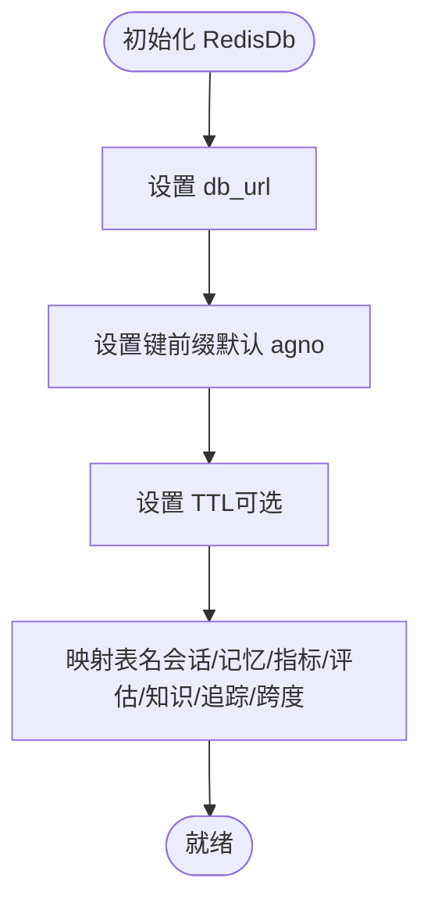
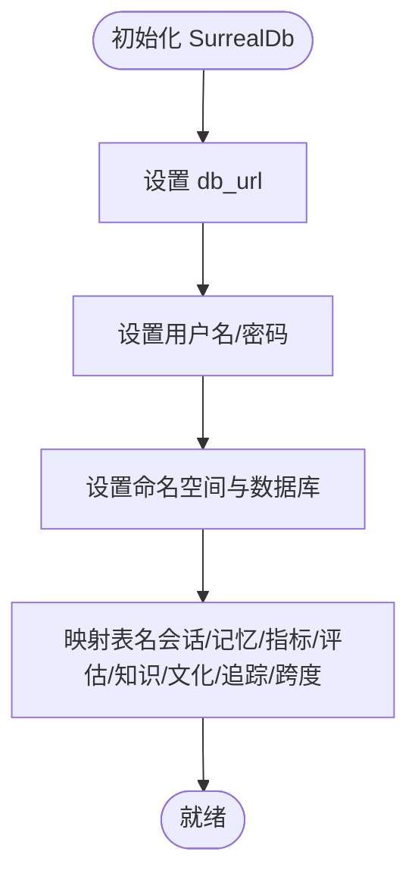
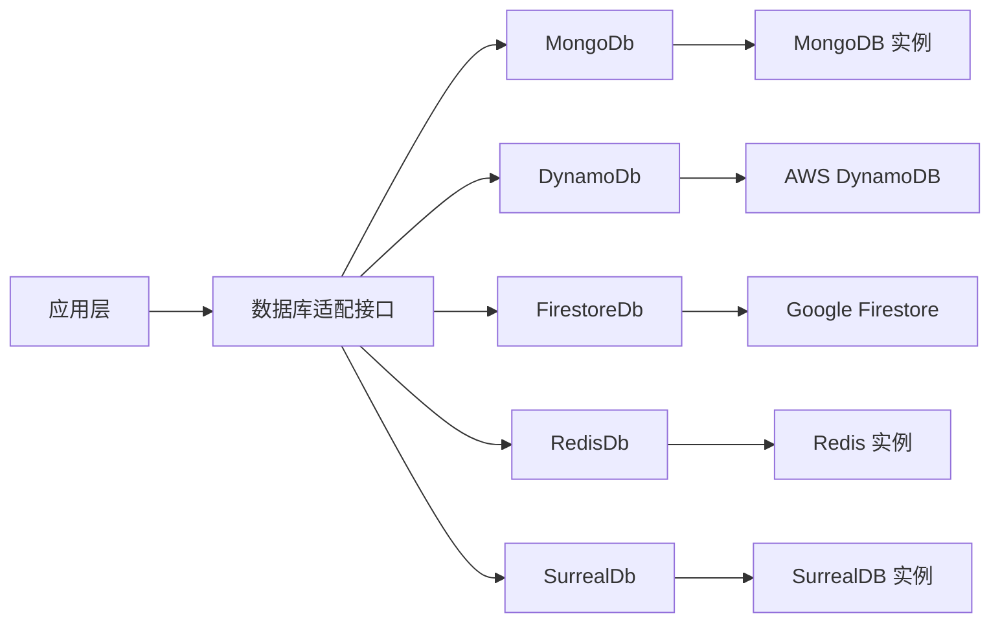

# NoSQL 数据库

<cite>
**本文引用的文件**
- [database/mongodb.mdx](file://database/mongodb.mdx)
- [_snippets/db-mongodb-params.mdx](file://_snippets/db-mongodb-params.mdx)
- [database/dynamodb.mdx](file://database/dynamodb.mdx)
- [_snippets/db-dynamodb-params.mdx](file://_snippets/db-dynamodb-params.mdx)
- [database/firestore.mdx](file://database/firestore.mdx)
- [_snippets/db-firestore-params.mdx](file://_snippets/db-firestore-params.mdx)
- [database/redis.mdx](file://database/redis.mdx)
- [_snippets/db-redis-params.mdx](file://_snippets/db-redis-params.mdx)
- [database/surreabdb.mdx](file://database/surreabdb.mdx)
- [_snippets/db-surrealdb-params.mdx](file://_snippets/db-surrealdb-params.mdx)
</cite>

## 目录
1. [简介](#简介)
2. [项目结构](#项目结构)
3. [核心组件](#核心组件)
4. [架构总览](#架构总览)
5. [详细组件分析](#详细组件分析)
6. [依赖关系分析](#依赖关系分析)
7. [性能考量](#性能考量)
8. [故障排查指南](#故障排查指南)
9. [结论](#结论)
10. [附录](#附录)

## 简介
本参考文档聚焦于 Agno 框架对多种 NoSQL 数据库的支持与实践，覆盖 MongoDB、DynamoDB、Firestore、Redis 与 SurrealDB。我们将从数据模型、连接配置、数据建模建议、性能优化策略到云原生选择与混合架构设计给出系统化指导，帮助在不同业务场景下做出合适的技术选型。

## 项目结构
围绕 NoSQL 数据库的文档分布在以下位置：
- 各数据库的概览文档位于 database 目录
- 参数表格与配置项通过 _snippets 中的独立片段文件维护，便于复用与统一

**章节来源**
- [database/mongodb.mdx:1-48](file://database/mongodb.mdx#L1-L48)
- [database/dynamodb.mdx:1-34](file://database/dynamodb.mdx#L1-L34)
- [database/firestore.mdx:1-41](file://database/firestore.mdx#L1-L41)
- [database/redis.mdx:1-40](file://database/redis.mdx#L1-L40)
- [database/surreabdb.mdx:1-43](file://database/surreabdb.mdx#L1-L43)

## 核心组件
- MongoDB：面向会话、记忆、指标、评估、知识、追踪与跨度的集合配置，适合文档型数据与灵活模式演进。
- DynamoDB：基于 AWS 的键值/文档存储，强调弹性扩展与按需计费，适合高并发与事件驱动场景。
- Firestore：Google 云原生文档数据库，具备实时同步与离线支持，适合需要强一致或最终一致的协作应用。
- Redis：内存键值存储与缓存，支持多种数据结构，适合高频读写与会话状态管理。
- SurrealDB：多模型数据库（文档/图/键值），提供统一查询语言与多连接协议，适合需要跨模型统一建模的应用。

**章节来源**
- [database/mongodb.mdx:7-26](file://database/mongodb.mdx#L7-L26)
- [database/dynamodb.mdx:7-25](file://database/dynamodb.mdx#L7-L25)
- [database/firestore.mdx:7-26](file://database/firestore.mdx#L7-L26)
- [database/redis.mdx:7-31](file://database/redis.mdx#L7-L31)
- [database/surreabdb.mdx:7-34](file://database/surreabdb.mdx#L7-L34)

## 架构总览
下图展示各 NoSQL 数据库在 Agno 中的典型使用位置与职责边界：

**图表来源**
- [database/mongodb.mdx:7-26](file://database/mongodb.mdx#L7-L26)
- [database/dynamodb.mdx:7-25](file://database/dynamodb.mdx#L7-L25)
- [database/firestore.mdx:7-26](file://database/firestore.mdx#L7-L26)
- [database/redis.mdx:7-31](file://database/redis.mdx#L7-L31)
- [database/surreabdb.mdx:7-34](file://database/surreabdb.mdx#L7-L34)

## 详细组件分析

### MongoDB 组件分析
- 数据模型与适用场景
  - 文档存储：天然适合非结构化与半结构化数据，易于扩展字段与嵌套结构。
  - 适合：会话历史、用户记忆、指标与评估记录、知识文档、追踪与跨度等。
- 连接与配置要点
  - 支持通过客户端实例或连接字符串接入；可自定义数据库名与集合名。
  - 建议为不同实体（会话、记忆、指标、评估、知识、追踪、跨度）设置独立集合，便于隔离与治理。
- 性能优化建议
  - 对常用查询字段建立索引；合理分片与副本集部署。
  - 控制单文档大小与嵌套深度，避免超大文档影响写入与复制性能。
  - 使用聚合管道进行复杂统计与报表，减少多次往返。

**图表来源**
- [_snippets/db-mongodb-params.mdx:1-13](file://_snippets/db-mongodb-params.mdx#L1-L13)

**章节来源**
- [database/mongodb.mdx:7-48](file://database/mongodb.mdx#L7-L48)
- [_snippets/db-mongodb-params.mdx:1-13](file://_snippets/db-mongodb-params.mdx#L1-L13)

### DynamoDB 组件分析
- 数据模型与适用场景
  - 键值/文档模型，支持高并发读写与自动扩展。
  - 适合：事件驱动、流式处理、低延迟查询、按分区键分布的数据。
- 连接与配置要点
  - 通过 AWS 凭证与区域配置；可自定义表名映射到会话、记忆、指标、评估、知识、追踪与跨度。
  - 建议将分区键/排序键设计为热点分散策略，避免写放大。
- 性能优化建议
  - 使用全局二级索引（GSI）支撑多样化查询；启用自动扩展并设置吞吐量上限。
  - 写入批处理与条件写入，降低失败重试成本。
  - 结合 Timestream 或 CloudWatch 指标监控吞吐与延迟。

**图表来源**
- [_snippets/db-dynamodb-params.mdx:1-15](file://_snippets/db-dynamodb-params.mdx#L1-L15)

**章节来源**
- [database/dynamodb.mdx:7-34](file://database/dynamodb.mdx#L7-L34)
- [_snippets/db-dynamodb-params.mdx:1-15](file://_snippets/db-dynamodb-params.mdx#L1-L15)

### Firestore 组件分析
- 数据模型与适用场景
  - 文档数据库，支持实时监听与离线同步，适合协作类应用与多端一致性需求。
  - 适合：会话与记忆的实时更新、知识库的增量同步、指标与评估的近实时展示。
- 连接与配置要点
  - 需要提供项目 ID，并使用默认凭据链进行认证。
  - 建议将集合按实体划分（会话、记忆、指标、评估、知识、追踪、跨度），并控制文档层级深度。
- 性能优化建议
  - 使用批量写入与事务；合理拆分大文档。
  - 利用子集合组织层级关系，减少宽表查询。
  - 结合 Firestore Security Rules 限制访问路径，降低无效查询。

**图表来源**
- [_snippets/db-firestore-params.mdx:1-13](file://_snippets/db-firestore-params.mdx#L1-L13)

**章节来源**
- [database/firestore.mdx:7-41](file://database/firestore.mdx#L7-L41)
- [_snippets/db-firestore-params.mdx:1-13](file://_snippets/db-firestore-params.mdx#L1-L13)

### Redis 组件分析
- 数据模型与适用场景
  - 内存键值存储，支持多种数据结构（字符串、哈希、列表、集合、有序集合），适合高频读写与会话状态。
  - 适合：会话缓存、短期记忆、指标聚合、限流令牌桶、分布式锁。
- 连接与配置要点
  - 支持连接 URL 与自定义前缀；可设置键过期时间；可自定义表名映射。
  - 建议使用命名空间前缀隔离不同租户或环境。
- 性能优化建议
  - 合理设置过期策略与内存淘汰策略；开启持久化（RDB/AOF）平衡性能与可靠性。
  - 使用流水线与连接池；避免大键与阻塞命令。
  - 将热数据放入内存，冷数据迁移至持久化存储。

**图表来源**
- [_snippets/db-redis-params.mdx:1-14](file://_snippets/db-redis-params.mdx#L1-L14)

**章节来源**
- [database/redis.mdx:7-40](file://database/redis.mdx#L7-L40)
- [_snippets/db-redis-params.mdx:1-14](file://_snippets/db-redis-params.mdx#L1-L14)

### SurrealDB 组件分析
- 数据模型与适用场景
  - 多模型（文档/图/键值），统一查询语言与多连接协议，适合需要跨模型统一建模与查询的应用。
  - 适合：知识图谱、关系密集型数据、统一实体与关系建模。
- 连接与配置要点
  - 支持 WebSocket 与 HTTP 连接；需指定命名空间与数据库名；可自定义表名映射。
  - 建议将实体与关系分别建模，利用多模型能力统一查询。
- 性能优化建议
  - 合理设计命名空间与数据库分离策略；使用索引加速查询。
  - 控制查询复杂度，避免深度遍历导致的性能问题。
  - 结合备份与高可用部署提升稳定性。

**图表来源**
- [_snippets/db-surrealdb-params.mdx:1-18](file://_snippets/db-surrealdb-params.mdx#L1-L18)

**章节来源**
- [database/surreabdb.mdx:7-43](file://database/surreabdb.mdx#L7-L43)
- [_snippets/db-surrealdb-params.mdx:1-18](file://_snippets/db-surrealdb-params.mdx#L1-L18)

## 依赖关系分析
- 组件耦合
  - 各数据库适配器均向应用层暴露统一接口，降低上层对具体数据库的依赖。
  - 参数配置通过片段文件集中维护，便于版本演进与一致性校验。
- 外部依赖
  - MongoDB、Redis、SurrealDB 为本地或私有化部署；DynamoDB、Firestore 依赖云厂商服务。
- 潜在风险
  - 云服务依赖可能带来网络与合规风险；需准备降级与迁移方案。
  - 不同数据库的查询能力与一致性模型差异较大，需在设计阶段明确约束。

**图表来源**
- [database/mongodb.mdx:7-26](file://database/mongodb.mdx#L7-L26)
- [database/dynamodb.mdx:7-25](file://database/dynamodb.mdx#L7-L25)
- [database/firestore.mdx:7-26](file://database/firestore.mdx#L7-L26)
- [database/redis.mdx:7-31](file://database/redis.mdx#L7-L31)
- [database/surreabdb.mdx:7-34](file://database/surreabdb.mdx#L7-L34)

## 性能考量
- 通用建议
  - 明确数据生命周期与归档策略，避免无限增长导致的查询与存储压力。
  - 在写入密集场景优先考虑云原生数据库（DynamoDB、Firestore）的自动扩展能力。
  - 对高频读取场景引入缓存（Redis），并结合失效策略与预热机制。
- 具体建议
  - MongoDB：合理索引与分片；聚合管道替代多次查询。
  - DynamoDB：GSI 设计与吞吐量预留；批量写入与条件写入。
  - Firestore：子集合与批量操作；离线同步与冲突解决。
  - Redis：内存淘汰策略与持久化；连接池与流水线。
  - SurrealDB：命名空间与索引；查询复杂度控制。

## 故障排查指南
- 连接失败
  - 检查连接 URL、凭证与网络可达性；确认端口与安全组放通。
- 权限不足
  - 校验 IAM 角色与策略（DynamoDB）、服务账号权限（Firestore）、Redis 访问控制。
- 性能异常
  - 关注慢查询与高延迟指标；检查索引缺失、表膨胀与缓存命中率。
- 数据不一致
  - 明确一致性模型（最终一致 vs 强一致）；必要时引入事务或幂等写入。
- 迁移与升级
  - 参考 v2 迁移脚本与参数兼容性；逐步切换并做好回滚预案。

## 结论
- 选型建议
  - 高并发与弹性扩展：优先 DynamoDB 或 Firestore。
  - 文档型与灵活模式：MongoDB。
  - 高频缓存与会话状态：Redis。
  - 跨模型统一建模与查询：SurrealDB。
- 架构建议
  - 采用“主数据库 + 缓存”的混合架构，热点数据走缓存，冷数据落盘。
  - 对关键数据实施多副本与异地容灾，确保高可用。
  - 建立统一的监控与告警体系，覆盖延迟、错误率与资源使用。

## 附录
- 参数对照表（节选）
  - MongoDB：支持 db_url、db_name、集合名映射（会话/记忆/指标/评估/知识/追踪/跨度）。
  - DynamoDB：支持 region、凭证与表名映射。
  - Firestore：支持 project_id 与集合名映射。
  - Redis：支持 db_url、键前缀、TTL 与表名映射。
  - SurrealDB：支持 db_url、凭证、命名空间与数据库名及表名映射。

**章节来源**
- [_snippets/db-mongodb-params.mdx:1-13](file://_snippets/db-mongodb-params.mdx#L1-L13)
- [_snippets/db-dynamodb-params.mdx:1-15](file://_snippets/db-dynamodb-params.mdx#L1-L15)
- [_snippets/db-firestore-params.mdx:1-13](file://_snippets/db-firestore-params.mdx#L1-L13)
- [_snippets/db-redis-params.mdx:1-14](file://_snippets/db-redis-params.mdx#L1-L14)
- [_snippets/db-surrealdb-params.mdx:1-18](file://_snippets/db-surrealdb-params.mdx#L1-L18)