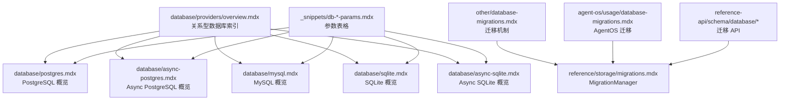
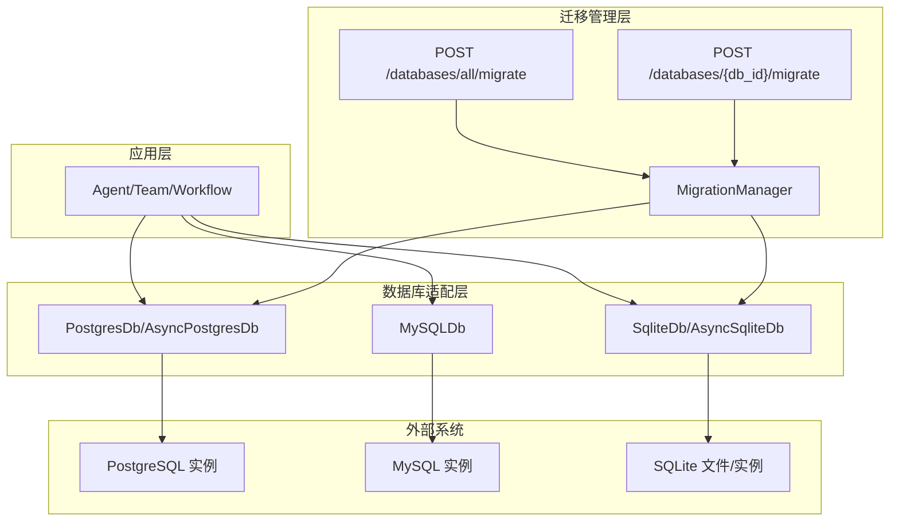
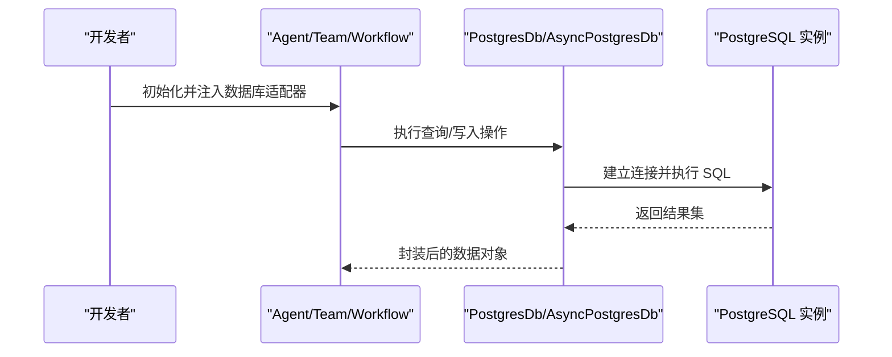
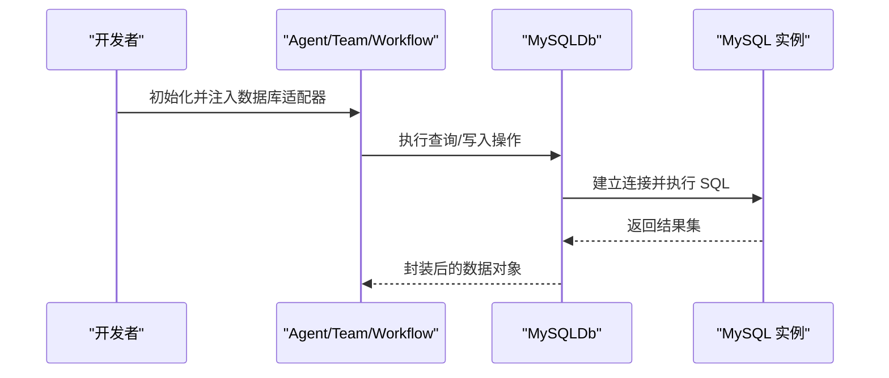
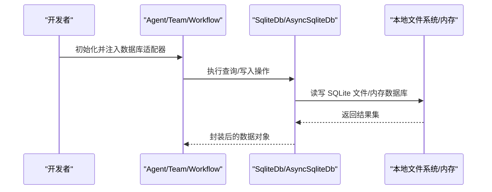
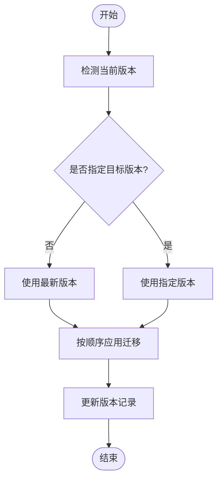
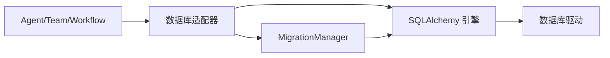
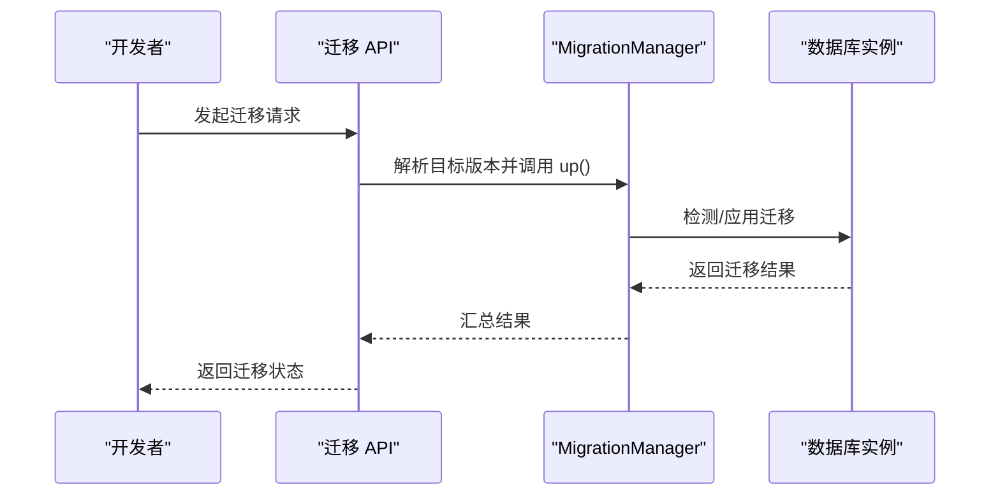

# 关系型数据库

<cite>
**本文引用的文件**
- [database/providers/overview.mdx](file://database/providers/overview.mdx)
- [database/postgres.mdx](file://database/postgres.mdx)
- [database/async-postgres.mdx](file://database/async-postgres.mdx)
- [database/mysql.mdx](file://database/mysql.mdx)
- [database/sqlite.mdx](file://database/sqlite.mdx)
- [database/async-sqlite.mdx](file://database/async-sqlite.mdx)
- [database/overview.mdx](file://database/overview.mdx)
- [_snippets/db-postgres-params.mdx](file://_snippets/db-postgres-params.mdx)
- [_snippets/db-async-postgres-params.mdx](file://_snippets/db-async-postgres-params.mdx)
- [_snippets/db-mysql-params.mdx](file://_snippets/db-mysql-params.mdx)
- [_snippets/db-async-sqlite-params.mdx](file://_snippets/db-async-sqlite-params.mdx)
- [other/database-migrations.mdx](file://other/database-migrations.mdx)
- [reference/storage/migrations.mdx](file://reference/storage/migrations.mdx)
- [agent-os/usage/database-migrations.mdx](file://agent-os/usage/database-migrations.mdx)
- [reference-api/schema/database/migrate-database.mdx](file://reference-api/schema/database/migrate-database.mdx)
- [reference-api/schema/database/migrate-all-databases.mdx](file://reference-api/schema/database/migrate-all-databases.mdx)
</cite>

## 目录
1. [简介](#简介)
2. [项目结构](#项目结构)
3. [核心组件](#核心组件)
4. [架构总览](#架构总览)
5. [详细组件分析](#详细组件分析)
6. [依赖分析](#依赖分析)
7. [性能考虑](#性能考虑)
8. [故障排查指南](#故障排查指南)
9. [结论](#结论)
10. [附录](#附录)

## 简介
本章节面向关系型数据库的使用者与维护者，系统性梳理 Agno 框架支持的关系型数据库生态，覆盖 PostgreSQL、MySQL、SQLite 及其异步版本。文档从“特点与适用场景”“配置与连接方式”“表结构设计建议”“性能优化技巧”“开发与生产最佳实践”五个维度展开，帮助读者在不同阶段选择合适的数据库方案。

## 项目结构
Agno 文档中与关系型数据库相关的内容主要分布在以下位置：
- database/providers/overview.mdx：关系型数据库索引与分类入口
- database/*.mdx：各数据库的概览、用法、参数与资源链接
- _snippets/db-*-params.mdx：各数据库类的参数表格
- other/database-migrations.mdx 与 reference/storage/migrations.mdx：数据库迁移机制与管理器
- agent-os/usage/database-migrations.mdx：AgentOS 场景下的迁移使用说明
- reference-api/schema/database/*：数据库迁移的 API 定义

**图示来源**
- [database/providers/overview.mdx:1-63](file://database/providers/overview.mdx#L1-L63)
- [database/postgres.mdx:1-47](file://database/postgres.mdx#L1-L47)
- [database/async-postgres.mdx:1-52](file://database/async-postgres.mdx#L1-L52)
- [database/mysql.mdx:1-44](file://database/mysql.mdx#L1-L44)
- [database/sqlite.mdx:1-29](file://database/sqlite.mdx#L1-L29)
- [database/async-sqlite.mdx:1-33](file://database/async-sqlite.mdx#L1-L33)
- [_snippets/db-postgres-params.mdx:1-14](file://_snippets/db-postgres-params.mdx#L1-L14)
- [_snippets/db-async-postgres-params.mdx:1-14](file://_snippets/db-async-postgres-params.mdx#L1-L14)
- [_snippets/db-mysql-params.mdx:1-13](file://_snippets/db-mysql-params.mdx#L1-L13)
- [_snippets/db-async-sqlite-params.mdx:1-13](file://_snippets/db-async-sqlite-params.mdx#L1-L13)
- [other/database-migrations.mdx:35-79](file://other/database-migrations.mdx#L35-L79)
- [reference/storage/migrations.mdx:1-170](file://reference/storage/migrations.mdx#L1-L170)
- [agent-os/usage/database-migrations.mdx:1-39](file://agent-os/usage/database-migrations.mdx#L1-L39)
- [reference-api/schema/database/migrate-database.mdx:1-3](file://reference-api/schema/database/migrate-database.mdx#L1-L3)
- [reference-api/schema/database/migrate-all-databases.mdx:1-3](file://reference-api/schema/database/migrate-all-databases.mdx#L1-L3)

**章节来源**
- [database/providers/overview.mdx:1-63](file://database/providers/overview.mdx#L1-L63)

## 核心组件
- PostgreSQL（同步与异步）
  - 特点：功能完备、ACID、扩展性强、适合生产环境；可结合向量扩展进行 RAG 场景
  - 适用场景：生产级会话存储、指标与评估数据持久化、知识库与追踪链路
  - 配置要点：支持通过 URL 或 SQLAlchemy 引擎注入；可自定义 schema 与多张表名
- MySQL（同步）
  - 特点：成熟稳定、部署广泛、企业级应用常见
  - 适用场景：中大型应用的会话与业务数据存储
  - 配置要点：支持 URL 或引擎注入；可自定义 schema 与多张表名
- SQLite（同步与异步）
  - 特点：零配置、轻量、跨平台、适合本地开发与测试
  - 适用场景：本地开发、CI/CD 测试、小规模数据与原型验证
  - 配置要点：支持文件路径或 URL；可自定义 schema 与多张表名
- 异步数据库（Async PostgreSQL、Async SQLite）
  - 特点：基于异步引擎，提升高并发下的吞吐与响应能力
  - 适用场景：高并发请求、长连接、事件驱动与流式处理
  - 配置要点：需使用异步引擎与正确的连接前缀；注意与同步类的混用问题

**章节来源**
- [database/postgres.mdx:1-47](file://database/postgres.mdx#L1-L47)
- [database/async-postgres.mdx:1-52](file://database/async-postgres.mdx#L1-L52)
- [database/mysql.mdx:1-44](file://database/mysql.mdx#L1-L44)
- [database/sqlite.mdx:1-29](file://database/sqlite.mdx#L1-L29)
- [database/async-sqlite.mdx:1-33](file://database/async-sqlite.mdx#L1-L33)
- [database/overview.mdx:109-130](file://database/overview.mdx#L109-L130)

## 架构总览
下图展示了 Agno 中关系型数据库的使用架构：应用层通过数据库适配器（如 PostgresDb、AsyncPostgresDb、MySQLDb、SqliteDb、AsyncSqliteDb）访问底层数据库；迁移管理器负责表结构演进与版本控制；API 层提供迁移端点以支持自动化升级。

**图示来源**
- [reference/storage/migrations.mdx:145-152](file://reference/storage/migrations.mdx#L145-L152)
- [reference-api/schema/database/migrate-database.mdx:1-3](file://reference-api/schema/database/migrate-database.mdx#L1-L3)
- [reference-api/schema/database/migrate-all-databases.mdx:1-3](file://reference-api/schema/database/migrate-all-databases.mdx#L1-L3)

## 详细组件分析

### PostgreSQL 组件分析
- 类与职责
  - PostgresDb：同步 PostgreSQL 存储适配器，支持 JSONB、schema 与多表配置
  - AsyncPostgresDb：异步 PostgreSQL 存储适配器，适用于高并发场景
- 参数与配置
  - 支持 id、db_url、db_engine、db_schema、session_table、memory_table、metrics_table、eval_table、knowledge_table、traces_table、spans_table 等
- 使用流程（序列图）

**图示来源**
- [database/postgres.mdx:9-22](file://database/postgres.mdx#L9-L22)
- [database/async-postgres.mdx:13-27](file://database/async-postgres.mdx#L13-L27)
- [_snippets/db-postgres-params.mdx:1-14](file://_snippets/db-postgres-params.mdx#L1-L14)
- [_snippets/db-async-postgres-params.mdx:1-14](file://_snippets/db-async-postgres-params.mdx#L1-L14)

**章节来源**
- [database/postgres.mdx:1-47](file://database/postgres.mdx#L1-L47)
- [database/async-postgres.mdx:1-52](file://database/async-postgres.mdx#L1-L52)
- [_snippets/db-postgres-params.mdx:1-14](file://_snippets/db-postgres-params.mdx#L1-L14)
- [_snippets/db-async-postgres-params.mdx:1-14](file://_snippets/db-async-postgres-params.mdx#L1-L14)

### MySQL 组件分析
- 类与职责
  - MySQLDb：同步 MySQL 存储适配器，支持 schema 与多表配置
- 参数与配置
  - 支持 id、db_engine、db_schema、db_url、session_table、memory_table、metrics_table、eval_table、knowledge_table、traces_table、spans_table 等
- 使用流程（序列图）

**图示来源**
- [database/mysql.mdx:9-20](file://database/mysql.mdx#L9-L20)
- [_snippets/db-mysql-params.mdx:1-13](file://_snippets/db-mysql-params.mdx#L1-L13)

**章节来源**
- [database/mysql.mdx:1-44](file://database/mysql.mdx#L1-L44)
- [_snippets/db-mysql-params.mdx:1-13](file://_snippets/db-mysql-params.mdx#L1-L13)

### SQLite 组件分析
- 类与职责
  - SqliteDb：同步 SQLite 存储适配器，适合本地开发与测试
  - AsyncSqliteDb：异步 SQLite 存储适配器，适合高并发本地场景
- 参数与配置
  - 支持 db_engine、db_url、db_file、session_table、memory_table、metrics_table、eval_table、knowledge_table、traces_table、spans_table 等
- 使用流程（序列图）

**图示来源**
- [database/sqlite.mdx:9-20](file://database/sqlite.mdx#L9-L20)
- [database/async-sqlite.mdx:13-24](file://database/async-sqlite.mdx#L13-L24)
- [_snippets/db-async-sqlite-params.mdx:1-13](file://_snippets/db-async-sqlite-params.mdx#L1-L13)

**章节来源**
- [database/sqlite.mdx:1-29](file://database/sqlite.mdx#L1-L29)
- [database/async-sqlite.mdx:1-33](file://database/async-sqlite.mdx#L1-L33)
- [_snippets/db-async-sqlite-params.mdx:1-13](file://_snippets/db-async-sqlite-params.mdx#L1-L13)

### 数据库迁移管理（MigrationManager）
- 能力概述
  - 自动记录与更新 schema 版本
  - 支持按目标版本升级/降级
  - 支持同步与异步数据库
  - 支持多表类型迁移（session/memory/metrics/eval/knowledge/culture）
- 支持的数据库
  - PostgreSQL（含异步）、SQLite（含异步）、MySQL、SingleStore
- API 使用
  - 提供 /databases/all/migrate 与 /databases/{db_id}/migrate 端点
- 迁移流程（流程图）

**图示来源**
- [reference/storage/migrations.mdx:35-47](file://reference/storage/migrations.mdx#L35-L47)
- [reference/storage/migrations.mdx:145-152](file://reference/storage/migrations.mdx#L145-L152)
- [reference-api/schema/database/migrate-database.mdx:1-3](file://reference-api/schema/database/migrate-database.mdx#L1-L3)
- [reference-api/schema/database/migrate-all-databases.mdx:1-3](file://reference-api/schema/database/migrate-all-databases.mdx#L1-L3)

**章节来源**
- [other/database-migrations.mdx:35-79](file://other/database-migrations.mdx#L35-L79)
- [reference/storage/migrations.mdx:1-170](file://reference/storage/migrations.mdx#L1-L170)
- [agent-os/usage/database-migrations.mdx:1-39](file://agent-os/usage/database-migrations.mdx#L1-L39)

## 依赖分析
- 组件耦合
  - 应用层仅依赖数据库适配器接口，不直接依赖具体数据库实现
  - 迁移管理器统一调度各数据库的迁移逻辑
- 外部依赖
  - SQLAlchemy 引擎（同步/异步）
  - 各数据库驱动（如 psycopg、pymysql、sqlite3）
- 潜在风险
  - 同步/异步混用导致运行时异常
  - 手动修改表结构可能破坏迁移一致性

**图示来源**
- [database/overview.mdx:109-130](file://database/overview.mdx#L109-L130)
- [reference/storage/migrations.mdx:145-152](file://reference/storage/migrations.mdx#L145-L152)

**章节来源**
- [database/overview.mdx:109-130](file://database/overview.mdx#L109-L130)
- [reference/storage/migrations.mdx:145-152](file://reference/storage/migrations.mdx#L145-L152)

## 性能考虑
- 选择策略
  - 开发与测试：优先 SQLite（同步/异步），零配置、易回滚
  - 生产环境：优先 PostgreSQL（同步/异步），具备更强的事务与扩展能力
  - 企业应用：MySQL 在成熟度与生态上具备优势
- 异步优势
  - 异步数据库在高并发请求下可显著降低阻塞时间，提升整体吞吐
- 连接与池化
  - 使用连接池减少频繁建立/销毁连接的开销
  - 合理设置超时与重试策略
- 表结构与索引
  - 对高频查询字段建立索引
  - 控制 JSON/JSONB 字段大小，避免过度膨胀
- 迁移与版本
  - 通过 MigrationManager 管理 schema 演进，避免手工变更破坏一致性

[本节为通用性能建议，无需特定文件引用]

## 故障排查指南
- 常见异常与定位
  - 缺少 Greenlet 异常：同步引擎与异步数据库类混用
  - 异步上下文未启动异常：异步引擎与同步数据库类混用
- 排查步骤
  - 确认使用的数据库类与引擎类型一致
  - 检查连接字符串格式与端口映射
  - 核对迁移状态与版本记录
- 相关端到端流程（序列图）

**图示来源**
- [database/overview.mdx:122-130](file://database/overview.mdx#L122-L130)
- [reference-api/schema/database/migrate-database.mdx:1-3](file://reference-api/schema/database/migrate-database.mdx#L1-L3)
- [reference-api/schema/database/migrate-all-databases.mdx:1-3](file://reference-api/schema/database/migrate-all-databases.mdx#L1-L3)

**章节来源**
- [database/overview.mdx:122-130](file://database/overview.mdx#L122-L130)
- [agent-os/usage/database-migrations.mdx:16-39](file://agent-os/usage/database-migrations.mdx#L16-L39)

## 结论
- 开发阶段：SQLite（同步/异步）是首选，快速迭代、易于回滚
- 生产阶段：PostgreSQL（同步/异步）是首选，功能完备、生态完善
- 企业场景：MySQL 具备成熟的部署与运维经验
- 异步数据库：在高并发与长连接场景下具备明显性能优势
- 迁移与治理：通过 MigrationManager 与 API 端点实现可控的 schema 演进

[本节为总结性内容，无需特定文件引用]

## 附录

### 连接配置示例（路径指引）
- PostgreSQL（同步）
  - 示例路径：[database/postgres.mdx:9-22](file://database/postgres.mdx#L9-L22)
- PostgreSQL（异步）
  - 示例路径：[database/async-postgres.mdx:13-27](file://database/async-postgres.mdx#L13-L27)
- MySQL（同步）
  - 示例路径：[database/mysql.mdx:9-20](file://database/mysql.mdx#L9-L20)
- SQLite（同步）
  - 示例路径：[database/sqlite.mdx:9-20](file://database/sqlite.mdx#L9-L20)
- SQLite（异步）
  - 示例路径：[database/async-sqlite.mdx:13-24](file://database/async-sqlite.mdx#L13-L24)

### 参数表（路径指引）
- PostgreSQL（同步/异步）
  - 参数表：[_snippets/db-postgres-params.mdx:1-14](file://_snippets/db-postgres-params.mdx#L1-L14)
  - 参数表：[_snippets/db-async-postgres-params.mdx:1-14](file://_snippets/db-async-postgres-params.mdx#L1-L14)
- MySQL（同步）
  - 参数表：[_snippets/db-mysql-params.mdx:1-13](file://_snippets/db-mysql-params.mdx#L1-L13)
- SQLite（同步/异步）
  - 参数表：[_snippets/db-async-sqlite-params.mdx:1-13](file://_snippets/db-async-sqlite-params.mdx#L1-L13)

### 表结构设计建议
- 分表策略
  - session_table：存放 Agent/Team/Workflow 会话
  - memory_table：存放记忆体
  - metrics_table：存放指标
  - eval_table：存放评估结果
  - knowledge_table：存放知识内容
  - traces_table/spans_table：存放追踪与跨度
- 设计原则
  - 明确主键与外键约束
  - 对高频查询列建立索引
  - 控制 JSON/JSONB 字段大小
  - 保留历史与审计字段（如 created_at/updated_at）

[本节为通用设计建议，无需特定文件引用]

### 性能优化技巧
- 连接与池化
  - 使用连接池，合理设置最大连接数与空闲回收
- 查询优化
  - 避免 N+1 查询，批量读取与合并写入
  - 利用数据库统计信息与执行计划
- 异步化
  - 在高并发场景优先采用异步数据库类
- 迁移与版本
  - 通过 MigrationManager 管理 schema 演进，避免手工变更

[本节为通用优化建议，无需特定文件引用]

### 最佳实践：开发与生产
- 开发环境（SQLite）
  - 使用本地文件或内存数据库，便于快速回滚与隔离
  - 通过异步 SQLite（AsyncSqliteDb）模拟高并发场景
- 生产环境（PostgreSQL）
  - 使用异步 PostgreSQL（AsyncPostgresDb）提升并发能力
  - 通过迁移 API 与 MigrationManager 管理 schema 升级
  - 配置备份与只读副本，确保可用性与灾备

[本节为通用最佳实践，无需特定文件引用]