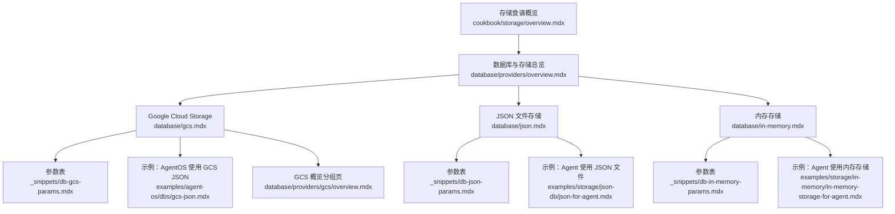
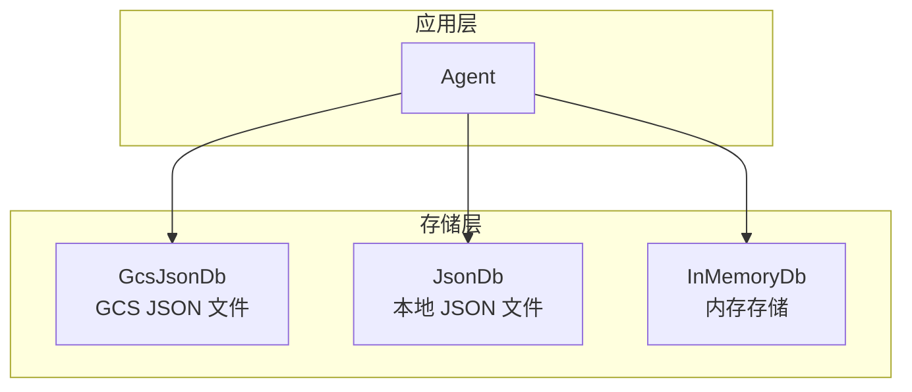
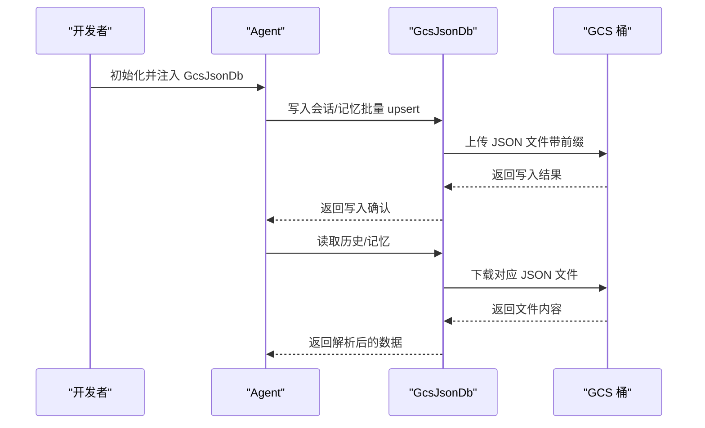
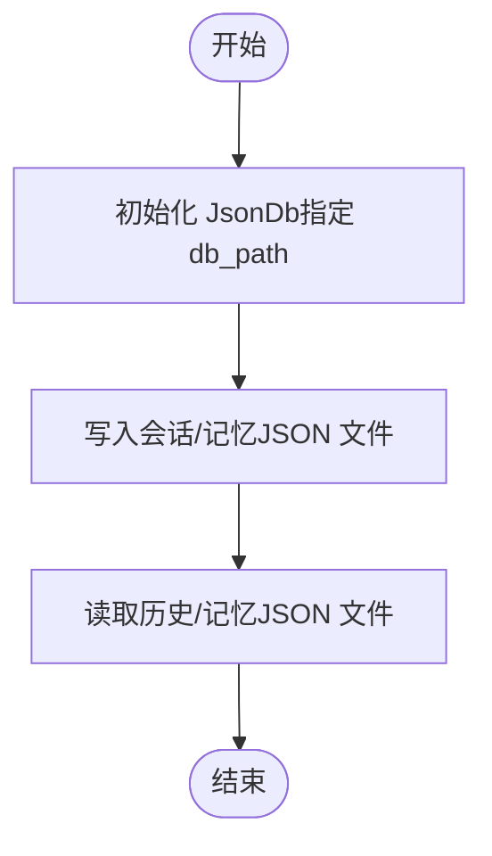
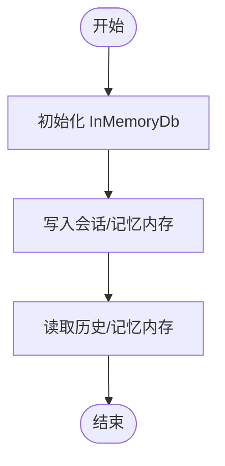
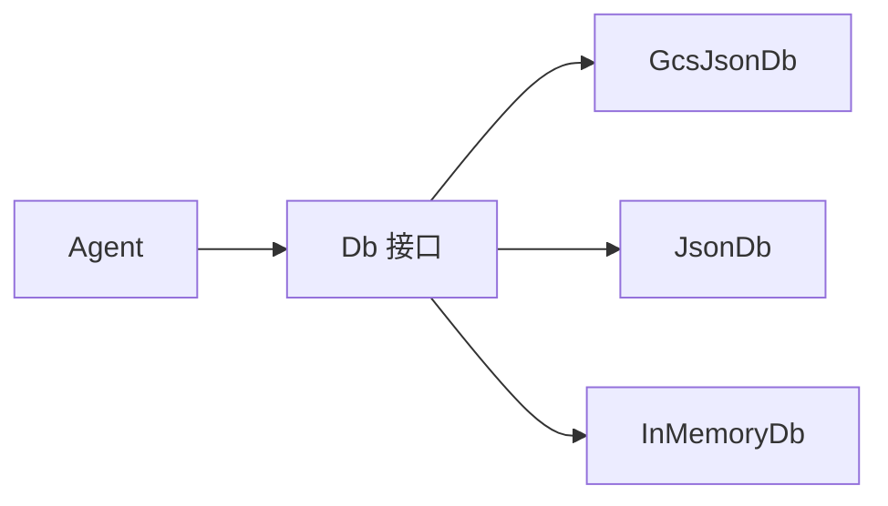

# 存储与文件系统

<cite>
**本文引用的文件**
- [database/gcs.mdx](file://database/gcs.mdx)
- [_snippets/db-gcs-params.mdx](file://_snippets/db-gcs-params.mdx)
- [database/providers/gcs/overview.mdx](file://database/providers/gcs/overview.mdx)
- [examples/agent-os/dbs/gcs-json.mdx](file://examples/agent-os/dbs/gcs-json.mdx)
- [database/json.mdx](file://database/json.mdx)
- [_snippets/db-json-params.mdx](file://_snippets/db-json-params.mdx)
- [examples/storage/json-db/json-for-agent.mdx](file://examples/storage/json-db/json-for-agent.mdx)
- [database/in-memory.mdx](file://database/in-memory.mdx)
- [_snippets/db-in-memory-params.mdx](file://_snippets/db-in-memory-params.mdx)
- [examples/storage/in-memory/in-memory-storage-for-agent.mdx](file://examples/storage/in-memory/in-memory-storage-for-agent.mdx)
- [_snippets/db-new-bulk-methods.mdx](file://_snippets/db-new-bulk-methods.mdx)
- [database/providers/overview.mdx](file://database/providers/overview.mdx)
- [cookbook/storage/overview.mdx](file://cookbook/storage/overview.mdx)
</cite>

## 目录
1. [简介](#简介)
2. [项目结构](#项目结构)
3. [核心组件](#核心组件)
4. [架构总览](#架构总览)
5. [详细组件分析](#详细组件分析)
6. [依赖关系分析](#依赖关系分析)
7. [性能考量](#性能考量)
8. [故障排查指南](#故障排查指南)
9. [结论](#结论)
10. [附录](#附录)

## 简介
本章节面向使用 Agno 框架进行智能体（Agent）开发的用户，系统性介绍框架支持的三类“存储与文件系统”集成：Google Cloud Storage（GCS）、JSON 文件存储与内存存储。我们将从特点、适用场景、配置方法、数据序列化建议与性能考虑等方面展开，并提供不同存储场景的选择指南与数据迁移策略。

## 项目结构
围绕存储与文件系统的文档主要分布在以下位置：
- 数据库与存储总览页：列出所有数据库与文件系统类型，含分类索引与链接
- 各存储后端的独立文档页：覆盖概览、参数表、用法示例与开发者资源
- 示例与食谱（cookbook）：提供可运行的最小示例，便于快速上手
- 参数片段：以表格形式汇总关键参数与默认值

图表来源
- [database/providers/overview.mdx:145-172](file://database/providers/overview.mdx#L145-L172)
- [database/gcs.mdx:1-47](file://database/gcs.mdx#L1-L47)
- [_snippets/db-gcs-params.mdx:1-11](file://_snippets/db-gcs-params.mdx#L1-L11)
- [database/providers/gcs/overview.mdx:1-42](file://database/providers/gcs/overview.mdx#L1-L42)
- [examples/agent-os/dbs/gcs-json.mdx:1-25](file://examples/agent-os/dbs/gcs-json.mdx#L1-L25)
- [database/json.mdx:1-34](file://database/json.mdx#L1-L34)
- [_snippets/db-json-params.mdx:1-13](file://_snippets/db-json-params.mdx#L1-L13)
- [examples/storage/json-db/json-for-agent.mdx:1-55](file://examples/storage/json-db/json-for-agent.mdx#L1-L55)
- [database/in-memory.mdx:1-30](file://database/in-memory.mdx#L1-L30)
- [_snippets/db-in-memory-params.mdx:1-9](file://_snippets/db-in-memory-params.mdx#L1-L9)
- [examples/storage/in-memory/in-memory-storage-for-agent.mdx:1-41](file://examples/storage/in-memory/in-memory-storage-for-agent.mdx#L1-L41)
- [cookbook/storage/overview.mdx:1-38](file://cookbook/storage/overview.mdx#L1-L38)

章节来源
- [database/providers/overview.mdx:145-172](file://database/providers/overview.mdx#L145-L172)
- [cookbook/storage/overview.mdx:1-38](file://cookbook/storage/overview.mdx#L1-L38)

## 核心组件
- GcsJsonDb（基于 GCS 的 JSON 数据库）
  - 特点：以 JSON 文件形式将会话等数据持久化到 GCS；支持前缀组织、多表分离（会话、记忆、指标、评估、知识、追踪等）；提供批量 upsert 方法提升大体量写入性能。
  - 适用场景：需要云端对象存储能力、跨实例共享状态、无需传统数据库即可获得结构化 JSON 持久化的场景。
  - 关键参数：桶名、路径前缀、项目与凭据、各业务表名等。
  - 参考：[GCS 概览:1-47](file://database/gcs.mdx#L1-L47)、[参数表:1-11](file://_snippets/db-gcs-params.mdx#L1-L11)、[批量方法:1-22](file://_snippets/db-new-bulk-methods.mdx#L1-L22)

- JsonDb（本地 JSON 文件数据库）
  - 特点：以本地 JSON 文件作为“数据库”，适合演示与测试；不推荐用于生产。
  - 适用场景：本地开发、快速原型、无数据库环境下的演示。
  - 关键参数：数据库目录路径、各业务表名等。
  - 参考：[JSON 概览:1-34](file://database/json.mdx#L1-L34)、[参数表:1-13](file://_snippets/db-json-params.mdx#L1-L13)

- InMemoryDb（内存存储）
  - 特点：纯内存实现，无需外部依赖；断电即失，适合测试与开发。
  - 适用场景：单元测试、功能验证、临时状态缓存。
  - 关键参数：各业务表名等。
  - 参考：[内存存储概览:1-30](file://database/in-memory.mdx#L1-L30)、[参数表:1-9](file://_snippets/db-in-memory-params.mdx#L1-L9)

章节来源
- [database/gcs.mdx:1-47](file://database/gcs.mdx#L1-L47)
- [_snippets/db-gcs-params.mdx:1-11](file://_snippets/db-gcs-params.mdx#L1-L11)
- [_snippets/db-new-bulk-methods.mdx:1-22](file://_snippets/db-new-bulk-methods.mdx#L1-L22)
- [database/json.mdx:1-34](file://database/json.mdx#L1-L34)
- [_snippets/db-json-params.mdx:1-13](file://_snippets/db-json-params.mdx#L1-L13)
- [database/in-memory.mdx:1-30](file://database/in-memory.mdx#L1-L30)
- [_snippets/db-in-memory-params.mdx:1-9](file://_snippets/db-in-memory-params.mdx#L1-L9)

## 架构总览
下图展示了三种存储后端在 Agno 中的角色与交互关系，以及它们与 Agent 的连接方式。

图表来源
- [database/gcs.mdx:7-8](file://database/gcs.mdx#L7-L8)
- [database/json.mdx:7-8](file://database/json.mdx#L7-L8)
- [database/in-memory.mdx:7-7](file://database/in-memory.mdx#L7-L7)

## 详细组件分析

### 组件一：Google Cloud Storage（GCS）JSON 存储
- 设计要点
  - 通过 JSON 文件在 GCS 中组织数据，支持按前缀分层管理。
  - 提供多表分离（会话、记忆、指标、评估、知识、追踪等），便于按域隔离。
  - 支持批量 upsert，降低大体量写入开销。
- 连接与配置
  - 需要 GCS 桶名与认证（本地开发、生产、GCP 实例三种模式）。
  - 可选前缀用于组织文件；默认会话表名等可自定义。
- 数据序列化建议
  - 使用标准 JSON 序列化；避免存储不可序列化对象。
  - 对大字段采用压缩或外部引用（如对象存储直链）。
- 性能考虑
  - 批量写入优先使用 upsert_sessions/upsert_memories。
  - 前缀与表拆分有助于并发读写与冷热数据分离。
- 示例与资源
  - AgentOS 使用 GCS JSON 的示例与说明：[示例文档:1-25](file://examples/agent-os/dbs/gcs-json.mdx#L1-L25)
  - GCS 概览与初始化示例：[GCS 概览:14-38](file://database/providers/gcs/overview.mdx#L14-L38)、[GCS 概览（另一版本）:14-38](file://database/gcs.mdx#L14-L38)

图表来源
- [database/providers/gcs/overview.mdx:14-38](file://database/providers/gcs/overview.mdx#L14-L38)
- [_snippets/db-new-bulk-methods.mdx:3-21](file://_snippets/db-new-bulk-methods.mdx#L3-L21)

章节来源
- [database/gcs.mdx:1-47](file://database/gcs.mdx#L1-L47)
- [_snippets/db-gcs-params.mdx:1-11](file://_snippets/db-gcs-params.mdx#L1-L11)
- [database/providers/gcs/overview.mdx:1-42](file://database/providers/gcs/overview.mdx#L1-L42)
- [examples/agent-os/dbs/gcs-json.mdx:1-25](file://examples/agent-os/dbs/gcs-json.mdx#L1-L25)
- [_snippets/db-new-bulk-methods.mdx:1-22](file://_snippets/db-new-bulk-methods.mdx#L1-L22)

### 组件二：JSON 文件存储
- 设计要点
  - 将会话与记忆等以 JSON 文件形式保存在本地文件系统中。
  - 不适合生产，仅用于演示与测试。
- 连接与配置
  - 指定数据库目录路径；可自定义各表文件名。
- 数据序列化建议
  - 保持 JSON 兼容的数据结构；避免循环引用。
- 性能考虑
  - 文件系统随机访问与锁竞争可能成为瓶颈；建议小规模使用。
- 示例与资源
  - Agent 使用 JSON 文件存储的示例：[示例文档:1-55](file://examples/storage/json-db/json-for-agent.mdx#L1-L55)

图表来源
- [database/json.mdx:17-26](file://database/json.mdx#L17-L26)
- [_snippets/db-json-params.mdx:1-13](file://_snippets/db-json-params.mdx#L1-L13)

章节来源
- [database/json.mdx:1-34](file://database/json.mdx#L1-L34)
- [_snippets/db-json-params.mdx:1-13](file://_snippets/db-json-params.mdx#L1-L13)
- [examples/storage/json-db/json-for-agent.mdx:1-55](file://examples/storage/json-db/json-for-agent.mdx#L1-L55)

### 组件三：内存存储
- 设计要点
  - 完全驻留在内存中的存储，无需外部依赖。
  - 断电或进程退出即丢失数据，适合测试与开发。
- 连接与配置
  - 直接初始化 InMemoryDb；可自定义各表名。
- 数据序列化建议
  - 以原生对象形式存储，注意避免跨进程共享导致的副作用。
- 性能考虑
  - 读写延迟极低；但容量受限于可用内存。
- 示例与资源
  - Agent 使用内存存储的示例：[示例文档:1-41](file://examples/storage/in-memory/in-memory-storage-for-agent.mdx#L1-L41)

图表来源
- [database/in-memory.mdx:14-25](file://database/in-memory.mdx#L14-L25)
- [_snippets/db-in-memory-params.mdx:1-9](file://_snippets/db-in-memory-params.mdx#L1-L9)

章节来源
- [database/in-memory.mdx:1-30](file://database/in-memory.mdx#L1-L30)
- [_snippets/db-in-memory-params.mdx:1-9](file://_snippets/db-in-memory-params.mdx#L1-L9)
- [examples/storage/in-memory/in-memory-storage-for-agent.mdx:1-41](file://examples/storage/in-memory/in-memory-storage-for-agent.mdx#L1-L41)

## 依赖关系分析
- 存储后端与 Agent 的耦合度低：通过统一的 Db 接口抽象，可在不同后端间切换。
- 批量方法（upsert_sessions/upsert_memories）为高吞吐场景提供优化路径。
- 参数表统一了各后端的关键配置项，便于横向对比与迁移。

图表来源
- [_snippets/db-new-bulk-methods.mdx:3-21](file://_snippets/db-new-bulk-methods.mdx#L3-L21)

章节来源
- [_snippets/db-new-bulk-methods.mdx:1-22](file://_snippets/db-new-bulk-methods.mdx#L1-L22)

## 性能考量
- GCS JSON
  - 优点：分布式、可扩展、跨实例共享；适合团队协作与长期留存。
  - 注意：网络延迟与对象存储 API 调用成本；建议批量写入与合理前缀组织。
- JSON 文件
  - 优点：零依赖、易调试。
  - 注意：文件系统随机访问与锁竞争；不适合高并发或大规模数据。
- 内存存储
  - 优点：极致低延迟。
  - 注意：易失性与容量限制；仅限测试与短期缓存。

## 故障排查指南
- 认证与权限
  - GCS：确保本地开发、生产或 GCP 实例的凭据配置正确；检查桶存在与访问权限。
  - 参考：[GCS 示例说明:6-19](file://examples/agent-os/dbs/gcs-json.mdx#L6-L19)
- 路径与前缀
  - 确认 db_path 或 prefix 设置正确；避免冲突或覆盖。
  - 参考：[JSON 参数表:4-5](file://_snippets/db-json-params.mdx#L4-L5)、[GCS 参数表:5-6](file://_snippets/db-gcs-params.mdx#L5-L6)
- 大数据量写入
  - 优先使用批量 upsert 方法，减少调用次数与 IO 开销。
  - 参考：[批量方法说明:3-21](file://_snippets/db-new-bulk-methods.mdx#L3-L21)
- 生产建议
  - 避免在生产使用 JSON 文件与内存存储；优先选择关系型或云数据库。
  - 参考：[存储食谱概览（生产建议）:23-38](file://cookbook/storage/overview.mdx#L23-L38)

章节来源
- [examples/agent-os/dbs/gcs-json.mdx:6-19](file://examples/agent-os/dbs/gcs-json.mdx#L6-L19)
- [_snippets/db-json-params.mdx:4-5](file://_snippets/db-json-params.mdx#L4-L5)
- [_snippets/db-gcs-params.mdx:5-6](file://_snippets/db-gcs-params.mdx#L5-L6)
- [_snippets/db-new-bulk-methods.mdx:3-21](file://_snippets/db-new-bulk-methods.mdx#L3-L21)
- [cookbook/storage/overview.mdx:23-38](file://cookbook/storage/overview.mdx#L23-L38)

## 结论
- 若需云端可扩展、跨实例共享的状态持久化，优先选择 GCS JSON。
- 若仅做本地演示或快速原型，JSON 文件存储足够；生产请勿使用。
- 测试与开发阶段，内存存储可提供极致响应速度。
- 在不同后端之间迁移时，关注表结构、序列化格式与批量写入策略，结合参数表进行对照调整。

## 附录

### 三类存储的参数与适用场景速览
- GcsJsonDb
  - 关键参数：桶名、前缀、项目与凭据、各业务表名
  - 适用：云端团队协作、长期留存、对象存储优势
  - 参考：[参数表:1-11](file://_snippets/db-gcs-params.mdx#L1-L11)
- JsonDb
  - 关键参数：db_path、各业务表名
  - 适用：本地演示、无数据库环境
  - 参考：[参数表:1-13](file://_snippets/db-json-params.mdx#L1-L13)
- InMemoryDb
  - 关键参数：各业务表名
  - 适用：测试、短期缓存
  - 参考：[参数表:1-9](file://_snippets/db-in-memory-params.mdx#L1-L9)

### 选择指南与迁移策略
- 选择指南
  - 团队协作与云端部署：GCS JSON
  - 本地开发与演示：JSON 文件
  - 单元测试与功能验证：内存存储
- 迁移策略
  - 统一序列化格式（JSON），避免二进制或复杂对象。
  - 使用批量 upsert 减少迁移过程中的写入压力。
  - 逐步替换：先在新后端写入，再回填旧后端，最后切换流量。
  - 参考：[批量方法:3-21](file://_snippets/db-new-bulk-methods.mdx#L3-L21)

章节来源
- [_snippets/db-gcs-params.mdx:1-11](file://_snippets/db-gcs-params.mdx#L1-L11)
- [_snippets/db-json-params.mdx:1-13](file://_snippets/db-json-params.mdx#L1-L13)
- [_snippets/db-in-memory-params.mdx:1-9](file://_snippets/db-in-memory-params.mdx#L1-L9)
- [_snippets/db-new-bulk-methods.mdx:3-21](file://_snippets/db-new-bulk-methods.mdx#L3-L21)