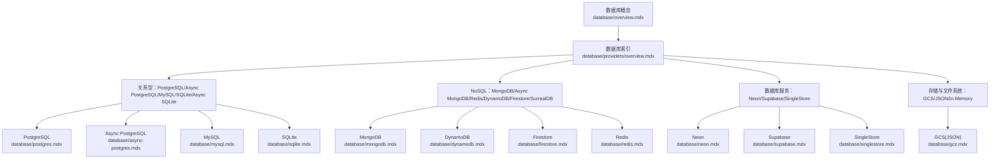
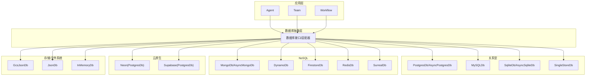
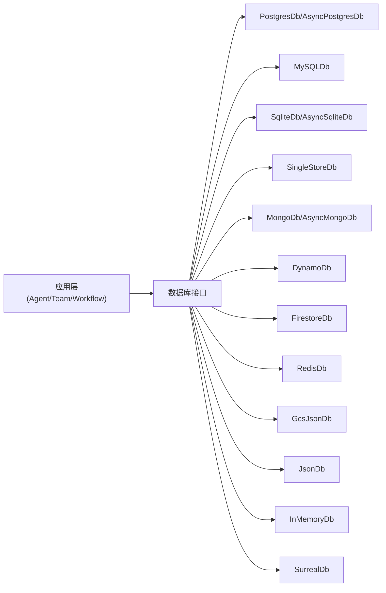

# 支持的数据库

<cite>
**本文引用的文件**
- [database/overview.mdx](file://database/overview.mdx)
- [database/providers/overview.mdx](file://database/providers/overview.mdx)
- [database/postgres.mdx](file://database/postgres.mdx)
- [database/async-postgres.mdx](file://database/async-postgres.mdx)
- [database/mysql.mdx](file://database/mysql.mdx)
- [database/sqlite.mdx](file://database/sqlite.mdx)
- [database/singlestore.mdx](file://database/singlestore.mdx)
- [database/mongodb.mdx](file://database/mongodb.mdx)
- [database/dynamodb.mdx](file://database/dynamodb.mdx)
- [database/firestore.mdx](file://database/firestore.mdx)
- [database/gcs.mdx](file://database/gcs.mdx)
- [database/redis.mdx](file://database/redis.mdx)
- [database/supabase.mdx](file://database/supabase.mdx)
- [database/neon.mdx](file://database/neon.mdx)
</cite>

## 目录
1. [简介](#简介)
2. [项目结构](#项目结构)
3. [核心组件](#核心组件)
4. [架构总览](#架构总览)
5. [详细组件分析](#详细组件分析)
6. [依赖分析](#依赖分析)
7. [性能考虑](#性能考虑)
8. [故障排查指南](#故障排查指南)
9. [结论](#结论)
10. [附录](#附录)

## 简介
本文件面向使用 Agno 框架的开发者与架构师，系统梳理框架支持的 13+ 数据库后端，覆盖关系型数据库（PostgreSQL、MySQL、SQLite、Singlestore）、NoSQL 数据库（MongoDB、DynamoDB、Cassandra、Couchbase）、云原生数据库（Firestore、GCS、Supabase、Neon）、内存数据库（Redis），以及异步数据库支持。文档从“特性与适用场景”“配置与参数”“最佳实践与性能优化”“开发/生产环境选型策略”等维度展开，帮助读者在不同阶段做出合理的技术决策。

## 项目结构
Agno 的数据库能力以“统一存储接口 + 多后端适配”的方式实现，核心入口位于数据库概览页，按类别组织各数据库的独立文档页，便于按需查阅。

图表来源
- [database/providers/overview.mdx:1-175](file://database/providers/overview.mdx#L1-L175)
- [database/overview.mdx:105-107](file://database/overview.mdx#L105-L107)

章节来源
- [database/overview.mdx:105-107](file://database/overview.mdx#L105-L107)
- [database/providers/overview.mdx:8-175](file://database/providers/overview.mdx#L8-L175)

## 核心组件
- 统一存储接口：Agent/Team/Workflow 可通过 db 参数注入任意数据库实现，保持上层调用一致。
- 后端适配器：
  - 关系型：PostgresDb、AsyncPostgresDb、MySQLDb、SqliteDb、AsyncSqliteDb
  - NoSQL：MongoDb、AsyncMongoDb、DynamoDb、FirestoreDb、RedisDb、SurrealDb
  - 云原生：Supabase（基于 PostgresDb）、Neon（基于 PostgresDb）
  - 存储：GcsJsonDb（JSON 文件存储于 GCS）、JsonDb、InMemoryDb
- 异步支持：AsyncPostgresDb、AsyncMysqlDb（部分后端）、AsyncMongoDb；同步与异步类名与连接串前缀存在差异，需严格匹配。

章节来源
- [database/overview.mdx:91-103](file://database/overview.mdx#L91-L103)
- [database/providers/overview.mdx:10-175](file://database/providers/overview.mdx#L10-L175)

## 架构总览
下图展示 Agno 在“应用层（Agent/Team/Workflow）—数据库抽象层—多后端实现”的分层关系，强调“可替换性”和“一致性”。

图表来源
- [database/providers/overview.mdx:10-175](file://database/providers/overview.mdx#L10-L175)
- [database/overview.mdx:91-103](file://database/overview.mdx#L91-L103)

## 详细组件分析

### 关系型数据库

#### PostgreSQL
- 特点与适用场景
  - 高可靠性、强一致、生态完善，适合生产环境持久化会话、知识与评估数据。
  - 支持向量扩展（如 PgVector），便于 RAG 场景。
- 连接与配置
  - 使用 PostgresDb 或 AsyncPostgresDb；异步版本需使用特定连接串前缀。
  - 提供 Docker 快速启动示例（含 PgVector 扩展镜像）。
- 最佳实践
  - 生产优先选用 PostgresDb；需要高并发/低延迟时考虑 AsyncPostgresDb。
  - 合理设置连接池大小、超时与重试策略。
- 性能优化
  - 为会话表与消息表建立合适索引；对向量字段使用专用索引。
  - 控制历史上下文长度，避免单次请求过大。

章节来源
- [database/postgres.mdx:1-47](file://database/postgres.mdx#L1-L47)
- [database/async-postgres.mdx:1-52](file://database/async-postgres.mdx#L1-L52)

#### MySQL
- 特点与适用场景
  - 成熟稳定、部署简单，适合中小规模应用与开发测试。
- 连接与配置
  - 使用 MySQLDb；提供 Docker 快速启动示例。
- 最佳实践
  - 开发环境优先；生产环境建议评估扩展性与运维成本。
- 性能优化
  - 合理设置字符集与排序规则；控制单表行数与分区策略。

章节来源
- [database/mysql.mdx:1-44](file://database/mysql.mdx#L1-L44)

#### SQLite
- 特点与适用场景
  - 轻量、零配置、跨平台，适合本地开发、演示与小规模应用。
- 连接与配置
  - 使用 SqliteDb；提供基础用法示例。
- 最佳实践
  - 仅用于开发/测试；避免在高并发/高写入场景使用。
- 性能优化
  - 控制 WAL 模式与同步级别；避免大事务与长锁。

章节来源
- [database/sqlite.mdx:1-29](file://database/sqlite.mdx#L1-L29)

#### Singlestore
- 特点与适用场景
  - 分布式关系型数据库，支持 HTAP，适合高吞吐与实时分析场景。
- 连接与配置
  - 使用 SingleStoreDb；提供基于环境变量的连接串拼装示例。
- 最佳实践
  - 评估集群规模与成本；结合向量/全文检索需求进行表设计。
- 性能优化
  - 列式存储与分区策略；合理设置副本与分片。

章节来源
- [database/singlestore.mdx:1-43](file://database/singlestore.mdx#L1-L43)

### NoSQL 数据库

#### MongoDB
- 特点与适用场景
  - 文档模型灵活，适合非结构化或半结构化会话与记忆数据。
- 连接与配置
  - 使用 MongoDb；提供 Docker 快速启动示例。
- 最佳实践
  - 为会话与消息集合建立索引；控制单文档大小。
- 性能优化
  - 使用聚合管道优化查询；分片与副本集提升可用性。

章节来源
- [database/mongodb.mdx:1-48](file://database/mongodb.mdx#L1-L48)

#### DynamoDB
- 特点与适用场景
  - 完全托管、弹性伸缩，适合高并发与无服务器架构。
- 连接与配置
  - 使用 DynamoDb；需配置 AWS 凭证（区域、AK/SK）。
- 最佳实践
  - 设计合理的主键与全局二级索引；控制读写容量单位。
- 性能优化
  - 使用 ProvisionedThroughput 或 On-Demand；启用压缩与批量写入。

章节来源
- [database/dynamodb.mdx:1-34](file://database/dynamodb.mdx#L1-L34)

#### Cassandra（概念性说明）
- 选择标准
  - 超大规模写入、多数据中心复制、最终一致模型适用。
- 注意事项
  - 与 Agno 当前文档未直接对应具体实现，建议评估社区适配度与生态支持后再引入。

[本节为概念性内容，不直接分析具体文件]

#### Couchbase（概念性说明）
- 选择标准
  - 需要文档数据库的高级功能（N1QL 查询、事件驱动、多模型）。
- 注意事项
  - 与 Agno 当前文档未直接对应具体实现，建议评估集成复杂度与运维成本。

[本节为概念性内容，不直接分析具体文件]

### 云原生数据库

#### Firestore
- 特点与适用场景
  - 与 Google Cloud 深度集成，适合云原生应用与多终端同步。
- 连接与配置
  - 使用 FirestoreDb；需提供 project_id 并确保默认凭证有效。
- 最佳实践
  - 合理设计层级结构与安全规则；利用离线支持与增量同步。
- 性能优化
  - 使用批处理与聚合查询；避免深分页。

章节来源
- [database/firestore.mdx:1-41](file://database/firestore.mdx#L1-L41)

#### GCS（JSON）
- 特点与适用场景
  - 将会话与状态以 JSON 形式存储于 GCS，适合审计与归档。
- 连接与配置
  - 使用 GcsJsonDb；需提供桶名、前缀、项目与凭据。
- 最佳实践
  - 为不同租户/会话设置命名空间前缀；开启生命周期管理。
- 性能优化
  - 合理划分对象数量与大小；使用并行读写。

章节来源
- [database/gcs.mdx:1-47](file://database/gcs.mdx#L1-L47)

#### Supabase
- 特点与适用场景
  - 基于 PostgreSQL 的开源平台，快速搭建后端即服务。
- 连接与配置
  - 使用 PostgresDb；提供基于环境变量的连接串示例。
- 最佳实践
  - 与 Supabase Auth/Functions 协同；注意 API 限流与安全策略。
- 性能优化
  - 合理索引与物化视图；使用 RLS 控制访问。

章节来源
- [database/supabase.mdx:1-42](file://database/supabase.mdx#L1-L42)

#### Neon
- 特点与适用场景
  - 无服务器 PostgreSQL，按需计费、自动扩缩容，适合弹性应用。
- 连接与配置
  - 使用 PostgresDb；提供从环境变量读取连接串的示例。
- 最佳实践
  - 结合 CI/CD 自动化部署；监控冷启动与连接复用。
- 性能优化
  - 使用连接池与预热；避免长时间事务。

章节来源
- [database/neon.mdx:1-37](file://database/neon.mdx#L1-L37)

### 内存数据库

#### Redis
- 特点与适用场景
  - 高吞吐、低延迟，适合缓存、会话临时存储与分布式锁。
- 连接与配置
  - 使用 RedisDb；提供 Docker 快速启动示例。
- 最佳实践
  - 明确 TTL 与淘汰策略；区分热数据与温数据。
- 性能优化
  - 使用连接池与 Pipeline；合理选择数据结构。

章节来源
- [database/redis.mdx:1-40](file://database/redis.mdx#L1-L40)

### 异步数据库支持
- 支持范围
  - AsyncPostgresDb、AsyncMongoDb；MySQL/SQLite 的异步实现以“异步 MySQL/异步 SQLite”形式提供索引页。
- 使用要点
  - 同步/异步类名与连接串前缀必须匹配；错误混用会导致运行时异常。
- 故障排查
  - 缺少 Greenlet：使用异步数据库类时需同步引擎。
  - AsyncContext 未启动：使用同步数据库类时需异步引擎。

章节来源
- [database/overview.mdx:109-130](file://database/overview.mdx#L109-L130)
- [database/providers/overview.mdx:22-58](file://database/providers/overview.mdx#L22-L58)

## 依赖分析
- 组件耦合
  - 应用层仅依赖数据库接口，后端实现可替换，耦合度低。
  - 关系型与云原生数据库共享 PostgresDb 抽象（Supabase/Neon）。
- 外部依赖
  - 关系型：PostgreSQL/MySQL 驱动、连接池。
  - NoSQL：MongoDB 驱动、AWS SDK（DynamoDB）、Google Cloud SDK（Firestore/GCS）。
  - 内存：Redis 客户端。
- 潜在风险
  - 异步与同步混用导致的运行时异常。
  - 云服务凭据泄露与权限配置不当。

图表来源
- [database/providers/overview.mdx:10-175](file://database/providers/overview.mdx#L10-L175)

## 性能考虑
- 连接与池化
  - 合理设置最大连接数、空闲连接与超时；避免连接泄漏。
- 索引与查询
  - 对会话/消息关键字段建立索引；避免 N+1 查询。
- 数据模型
  - 关系型：规范化与反规范化权衡；NoSQL：嵌套与去嵌套策略。
- 缓存与归档
  - Redis 作为热缓存；GCS 存 JSON 作为冷归档。
- 异步与并发
  - 异步数据库减少阻塞；注意并发写入冲突与幂等设计。

[本节为通用指导，不直接分析具体文件]

## 故障排查指南
- 常见异常与对策
  - 缺少 Greenlet：使用异步数据库类时，确保使用异步引擎。
  - AsyncContext 未启动：使用同步数据库类时，确保使用同步引擎。
- 云服务认证
  - DynamoDB：检查区域、AK/SK 是否正确。
  - Firestore/GCS：检查默认凭据与项目权限。
- 连接串前缀
  - 异步版本需使用特定前缀；否则无法建立连接。
- 日志与可观测性
  - 记录慢查询与错误码；结合数据库自带审计日志定位问题。

章节来源
- [database/overview.mdx:122-130](file://database/overview.mdx#L122-L130)

## 结论
- 开发环境：SQLite 适合本地快速迭代；MongoDB/Redis 适合原型验证。
- 测试环境：可复用开发数据库，但需隔离命名空间与权限。
- 生产环境：优先 PostgreSQL（或 Neon/Supabase）；高并发/低延迟场景可引入异步数据库；NoSQL 适用于非结构化数据与高扩展需求；云原生方案降低运维负担。
- 选型建议：以业务数据形态（结构化/半结构化/非结构化）与一致性要求（强一致/最终一致）为核心依据，再结合团队运维能力与成本预算。

[本节为总结性内容，不直接分析具体文件]

## 附录

### 开发/生产环境选型策略
- 开发/测试
  - SQLite：零依赖、易部署；适合本地与 CI。
  - MongoDB：灵活模型，适合快速迭代。
  - Redis：缓存与会话临时存储。
- 预生产/生产
  - PostgreSQL：强一致、生态完善；配合 PgVector 实现 RAG。
  - AsyncPostgres：高并发场景。
  - DynamoDB/Firestore：云原生弹性与托管优势。
  - GCS(JSON)：合规与归档需求。
  - Supabase/Neon：Serverless PostgreSQL，降低运维成本。

章节来源
- [database/overview.mdx:105-107](file://database/overview.mdx#L105-L107)
- [database/sqlite.mdx:1-29](file://database/sqlite.mdx#L1-L29)
- [database/postgres.mdx:1-47](file://database/postgres.mdx#L1-L47)
- [database/async-postgres.mdx:1-52](file://database/async-postgres.mdx#L1-L52)
- [database/mongodb.mdx:1-48](file://database/mongodb.mdx#L1-L48)
- [database/dynamodb.mdx:1-34](file://database/dynamodb.mdx#L1-L34)
- [database/firestore.mdx:1-41](file://database/firestore.mdx#L1-L41)
- [database/gcs.mdx:1-47](file://database/gcs.mdx#L1-L47)
- [database/supabase.mdx:1-42](file://database/supabase.mdx#L1-L42)
- [database/neon.mdx:1-37](file://database/neon.mdx#L1-L37)