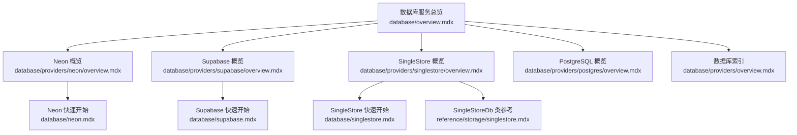
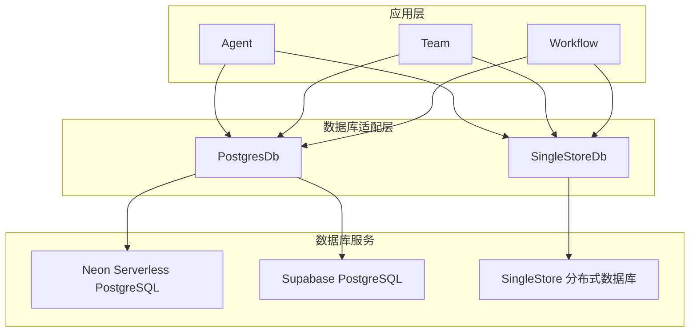
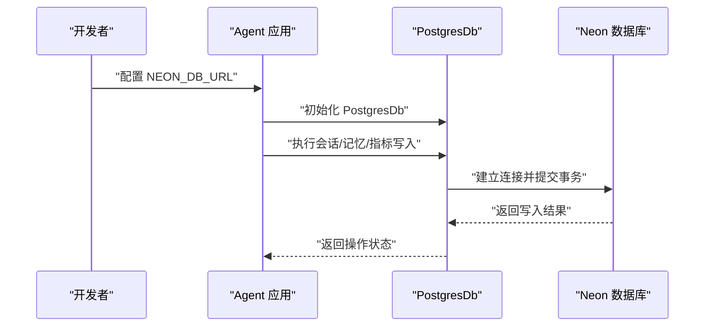
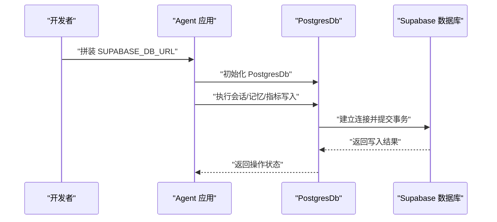
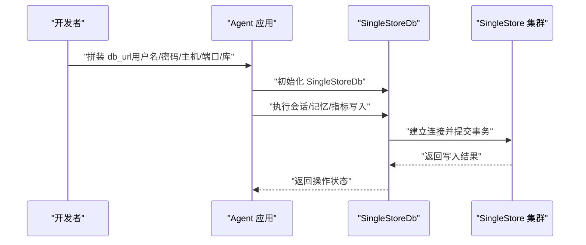
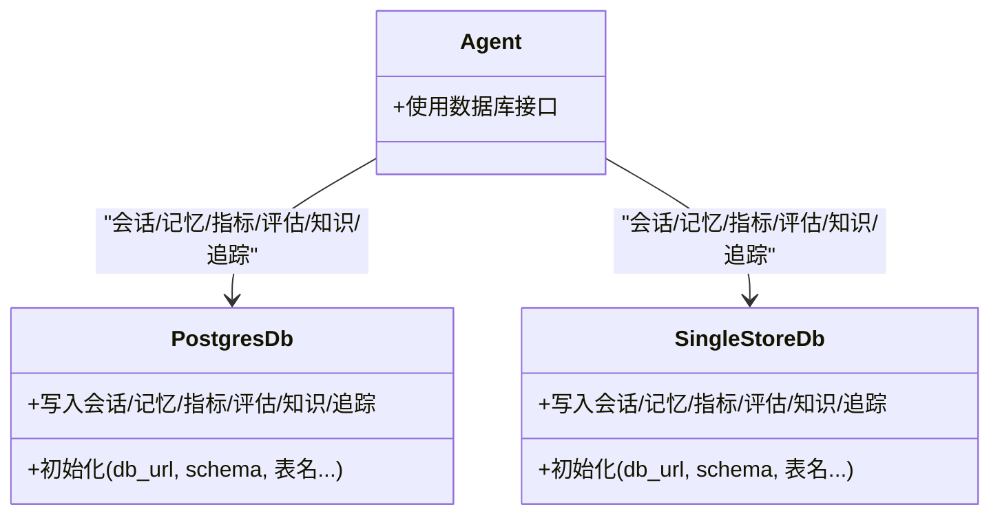

# 数据库服务

<cite>
**本文引用的文件**
- [database/neon.mdx](file://database/neon.mdx)
- [database/supabase.mdx](file://database/supabase.mdx)
- [database/singlestore.mdx](file://database/singlestore.mdx)
- [database/providers/neon/overview.mdx](file://database/providers/neon/overview.mdx)
- [database/providers/supabase/overview.mdx](file://database/providers/supabase/overview.mdx)
- [database/providers/singlestore/overview.mdx](file://database/providers/singlestore/overview.mdx)
- [_snippets/db-postgres-params.mdx](file://_snippets/db-postgres-params.mdx)
- [_snippets/db-singlestore-params.mdx](file://_snippets/db-singlestore-params.mdx)
- [database/overview.mdx](file://database/overview.mdx)
- [database/providers/postgres/overview.mdx](file://database/providers/postgres/overview.mdx)
- [database/providers/overview.mdx](file://database/providers/overview.mdx)
- [reference/storage/singlestore.mdx](file://reference/storage/singlestore.mdx)
</cite>

## 目录
1. [简介](#简介)
2. [项目结构](#项目结构)
3. [核心组件](#核心组件)
4. [架构总览](#架构总览)
5. [详细组件分析](#详细组件分析)
6. [依赖关系分析](#依赖关系分析)
7. [性能考虑](#性能考虑)
8. [故障排查指南](#故障排查指南)
9. [结论](#结论)
10. [附录](#附录)

## 简介
本章节面向使用 Agno 框架的开发者，系统性介绍三种云原生数据库服务：Neon、Supabase 与 SingleStore。内容涵盖它们在框架中的定位、使用方式、参数配置、部署要点与成本优化建议，并给出选择标准、迁移策略与监控最佳实践，帮助你在不同业务阶段做出合适的技术选型。

## 项目结构
围绕数据库服务的文档主要分布在以下路径：
- database/neon.mdx、database/supabase.mdx、database/singlestore.mdx：三种服务的快速入门与使用示例
- database/providers/neon/overview.mdx、database/providers/supabase/overview.mdx、database/providers/singlestore/overview.mdx：服务级概览与参数说明
- database/providers/postgres/overview.mdx、database/providers/overview.mdx：PostgreSQL 生态与数据库索引
- _snippets/db-postgres-params.mdx、_snippets/db-singlestore-params.mdx：参数表（PostgreSQL 与 SingleStore）
- database/overview.mdx：数据库总体能力与异步支持
- reference/storage/singlestore.mdx：SingleStoreDb 类参考

**图示来源**
- [database/overview.mdx](file://database/overview.mdx)
- [database/providers/neon/overview.mdx](file://database/providers/neon/overview.mdx)
- [database/providers/supabase/overview.mdx](file://database/providers/supabase/overview.mdx)
- [database/providers/singlestore/overview.mdx](file://database/providers/singlestore/overview.mdx)
- [database/neon.mdx](file://database/neon.mdx)
- [database/supabase.mdx](file://database/supabase.mdx)
- [database/singlestore.mdx](file://database/singlestore.mdx)
- [database/providers/postgres/overview.mdx](file://database/providers/postgres/overview.mdx)
- [database/providers/overview.mdx](file://database/providers/overview.mdx)
- [reference/storage/singlestore.mdx](file://reference/storage/singlestore.mdx)

**章节来源**
- [database/overview.mdx](file://database/overview.mdx)
- [database/providers/overview.mdx](file://database/providers/overview.mdx)

## 核心组件
- Neon：通过 PostgresDb 连接 Neon 提供的 Serverless PostgreSQL，适合需要弹性扩缩容与按需计费的会话存储场景。
- Supabase：通过 PostgresDb 连接 Supabase 托管的 PostgreSQL，适合快速搭建后端与数据库一体化的开发体验。
- SingleStore：通过 SingleStoreDb 连接 SingleStore 分布式数据库，适合高吞吐、低延迟、实时分析与事务混合场景。

以上组件均遵循 Agno 的数据库接口约定，可直接注入到 Agent/Team/Workflow 中使用。

**章节来源**
- [database/neon.mdx](file://database/neon.mdx)
- [database/supabase.mdx](file://database/supabase.mdx)
- [database/singlestore.mdx](file://database/singlestore.mdx)
- [database/providers/neon/overview.mdx](file://database/providers/neon/overview.mdx)
- [database/providers/supabase/overview.mdx](file://database/providers/supabase/overview.mdx)
- [database/providers/singlestore/overview.mdx](file://database/providers/singlestore/overview.mdx)

## 架构总览
下图展示了 Agno 在不同数据库服务上的通用数据流：应用层（Agent/Team/Workflow）通过数据库适配器访问数据库，数据库服务负责持久化会话、记忆、指标、评估、知识与追踪等数据。

**图示来源**
- [database/overview.mdx](file://database/overview.mdx)
- [database/providers/postgres/overview.mdx](file://database/providers/postgres/overview.mdx)
- [database/providers/singlestore/overview.mdx](file://database/providers/singlestore/overview.mdx)
- [database/neon.mdx](file://database/neon.mdx)
- [database/supabase.mdx](file://database/supabase.mdx)
- [database/singlestore.mdx](file://database/singlestore.mdx)

## 详细组件分析

### Neon：Serverless PostgreSQL 服务
- 特点
  - 无服务器模式，自动扩缩容，按使用量计费
  - 与 Postgres 兼容，生态成熟，适合会话与状态持久化
- 使用方式
  - 通过 PostgresDb 连接 Neon 提供的数据库 URL
  - 示例路径：[database/neon.mdx](file://database/neon.mdx)
- 参数说明
  - PostgreSQL 通用参数（如连接 URL、表名、Schema 等）
  - 参考：[_snippets/db-postgres-params.mdx](file://_snippets/db-postgres-params.mdx)
- 部署与成本优化
  - 选择合适的计算层规格与活动存储策略
  - 合理设置连接池与长事务，避免冷启动抖动
  - 利用只读副本与备份策略保障可用性
- 监控与排障
  - 关注连接数、查询延迟与暂停/恢复事件
  - 使用数据库内置监控与日志进行问题定位

**图示来源**
- [database/neon.mdx](file://database/neon.mdx)
- [database/providers/postgres/overview.mdx](file://database/providers/postgres/overview.mdx)

**章节来源**
- [database/neon.mdx](file://database/neon.mdx)
- [database/providers/neon/overview.mdx](file://database/providers/neon/overview.mdx)
- [_snippets/db-postgres-params.mdx](file://_snippets/db-postgres-params.mdx)

### Supabase：开源 PostgreSQL 平台
- 特点
  - 开源、托管、一体化平台，提供认证、实时订阅、存储等配套能力
  - 与 Postgres 兼容，便于迁移与扩展
- 使用方式
  - 通过 PostgresDb 连接 Supabase 提供的数据库 URL
  - 示例路径：[database/supabase.mdx](file://database/supabase.mdx)
- 参数说明
  - PostgreSQL 通用参数
  - 参考：[_snippets/db-postgres-params.mdx](file://_snippets/db-postgres-params.mdx)
- 部署与成本优化
  - 合理规划项目规模与并发连接数
  - 使用连接池与批量写入降低开销
  - 借助 Supabase 的监控面板观察资源使用趋势
- 监控与排障
  - 关注慢查询与连接峰值
  - 结合平台提供的审计日志定位异常

**图示来源**
- [database/supabase.mdx](file://database/supabase.mdx)
- [database/providers/postgres/overview.mdx](file://database/providers/postgres/overview.mdx)

**章节来源**
- [database/supabase.mdx](file://database/supabase.mdx)
- [database/providers/supabase/overview.mdx](file://database/providers/supabase/overview.mdx)
- [_snippets/db-postgres-params.mdx](file://_snippets/db-postgres-params.mdx)

### SingleStore：分布式数据库
- 特点
  - 分布式架构，支持 HTAP（混合事务/分析处理），具备高吞吐与低延迟能力
  - 支持 JSON 数据类型与在线 Schema 变更
- 使用方式
  - 通过 SingleStoreDb 连接 SingleStore，使用 MySQL 协议 URL
  - 示例路径：[database/singlestore.mdx](file://database/singlestore.mdx)
- 参数说明
  - 包含通用参数与 SingleStore 特有参数
  - 参考：[_snippets/db-singlestore-params.mdx](file://_snippets/db-singlestore-params.mdx)
- 部署与成本优化
  - 合理规划集群规模与分区策略
  - 使用批量写入与压缩以降低存储与网络开销
  - 结合热点数据与分片策略提升查询性能
- 监控与排障
  - 关注节点健康度、复制延迟与查询执行计划
  - 使用类参考文档了解类能力与方法

**图示来源**
- [database/singlestore.mdx](file://database/singlestore.mdx)
- [reference/storage/singlestore.mdx](file://reference/storage/singlestore.mdx)
- [_snippets/db-singlestore-params.mdx](file://_snippets/db-singlestore-params.mdx)

**章节来源**
- [database/singlestore.mdx](file://database/singlestore.mdx)
- [database/providers/singlestore/overview.mdx](file://database/providers/singlestore/overview.mdx)
- [_snippets/db-singlestore-params.mdx](file://_snippets/db-singlestore-params.mdx)
- [reference/storage/singlestore.mdx](file://reference/storage/singlestore.mdx)

## 依赖关系分析
- 组件耦合
  - Agent/Team/Workflow 仅依赖数据库接口，不直接绑定具体实现，耦合度低、可替换性强
  - Neon 与 Supabase 均通过 PostgresDb 访问，SingleStore 通过 SingleStoreDb 访问
- 外部依赖
  - Neon 与 Supabase 依赖其托管 PostgreSQL 服务
  - SingleStore 依赖其托管或自管的分布式数据库集群
- 接口契约
  - PostgreSQL 与 SingleStore 的参数表定义了统一的配置项，便于跨服务切换

**图示来源**
- [database/providers/postgres/overview.mdx](file://database/providers/postgres/overview.mdx)
- [database/providers/singlestore/overview.mdx](file://database/providers/singlestore/overview.mdx)
- [database/overview.mdx](file://database/overview.mdx)

**章节来源**
- [database/overview.mdx](file://database/overview.mdx)
- [database/providers/postgres/overview.mdx](file://database/providers/postgres/overview.mdx)
- [database/providers/singlestore/overview.mdx](file://database/providers/singlestore/overview.mdx)

## 性能考虑
- 连接管理
  - 使用连接池减少连接开销；合理设置最大连接数与空闲超时
- 写入优化
  - 批量写入、合并更新；避免小事务频繁提交
- 查询优化
  - 为高频查询字段建立索引；控制返回列数量与分页大小
- 存储与网络
  - 启用压缩与归档策略；靠近数据库部署应用以降低网络延迟
- 异步支持
  - 对高并发场景优先采用异步数据库类，提升吞吐

[本节为通用指导，无需特定文件引用]

## 故障排查指南
- 常见问题与提示
  - 异常类型与原因：同步引擎与异步类混用、异步上下文未正确启动等
  - 参考：[database/overview.mdx](file://database/overview.mdx)
- 定位步骤
  - 检查连接字符串与凭据
  - 查看数据库日志与慢查询记录
  - 核对表结构与权限
- 处理建议
  - 对齐同步/异步模型，确保引擎与类匹配
  - 调整连接池参数与事务隔离级别

**章节来源**
- [database/overview.mdx](file://database/overview.mdx)

## 结论
- Neon 适合追求弹性与成本敏感的会话存储
- Supabase 适合需要一体化开发体验与快速迭代的团队
- SingleStore 适合高吞吐、低延迟与 HTAP 场景
- 三者均可通过 Agno 的数据库接口无缝接入，便于在不同阶段灵活切换与演进

[本节为总结，无需特定文件引用]

## 附录

### 选择标准
- 成本：按需计费 vs 固定规格；资源利用率与单价对比
- 可用性：SLA、备份与恢复、只读副本
- 易用性：是否提供一体化平台与工具链
- 性能：吞吐、延迟、并发连接数、索引与查询优化能力
- 迁移难度：兼容性、迁移工具与停机窗口

[本节为通用指导，无需特定文件引用]

### 迁移策略
- 评估现状：盘点现有数据结构、访问模式与性能瓶颈
- 制定路线：从开发环境到生产环境逐步迁移，采用双写校验
- 验证与回滚：建立灰度发布与回滚预案，确保数据一致性
- 监控与优化：持续观测性能指标并迭代调优

[本节为通用指导，无需特定文件引用]

### 监控最佳实践
- 指标体系：连接数、QPS、P95/P99 延迟、错误率、缓存命中率
- 日志管理：结构化日志、慢查询日志、审计日志
- 告警策略：基于阈值与趋势的分级告警，结合业务时段调整
- 审计与合规：保留必要的访问与变更记录，满足合规要求

[本节为通用指导，无需特定文件引用]