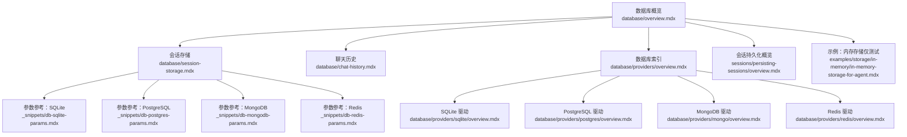
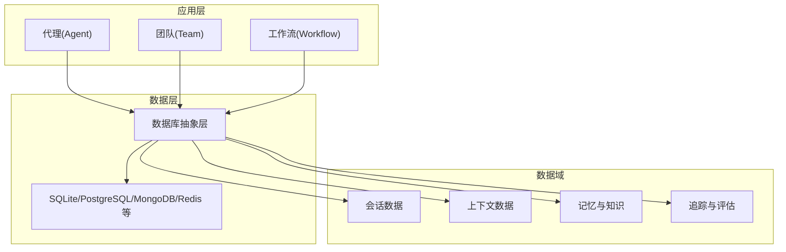
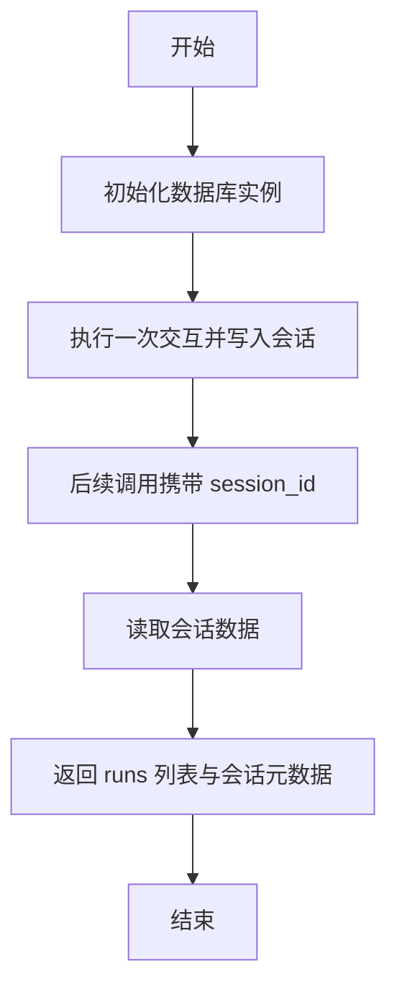
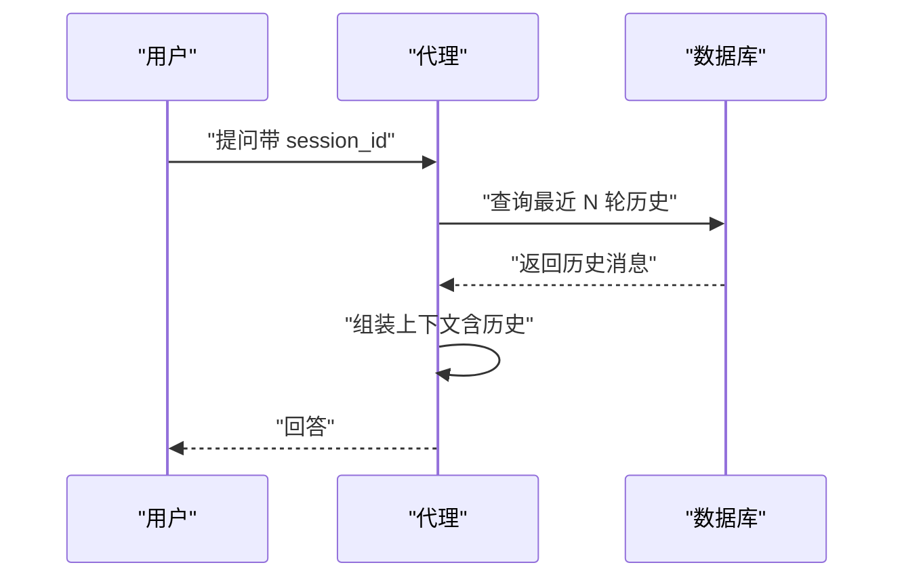
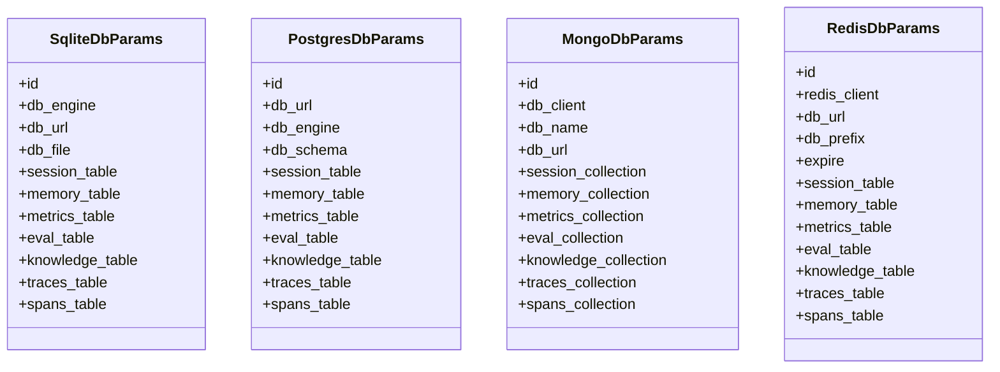
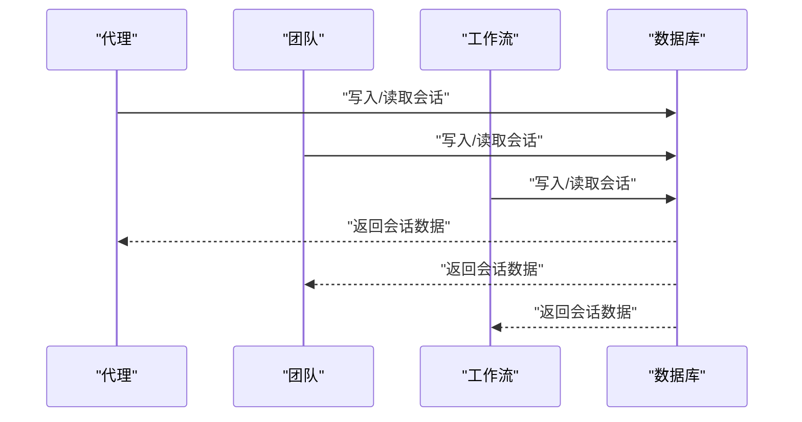
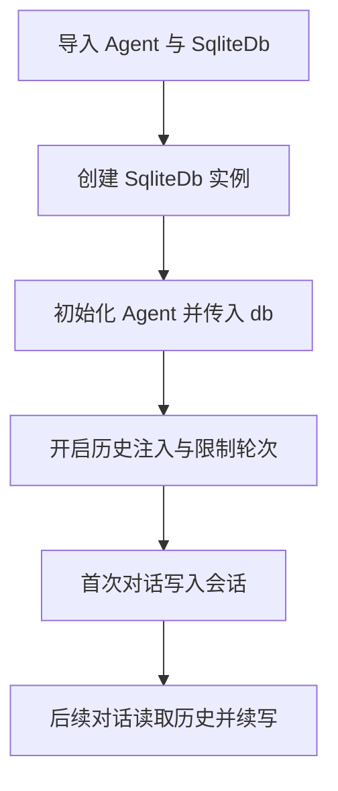
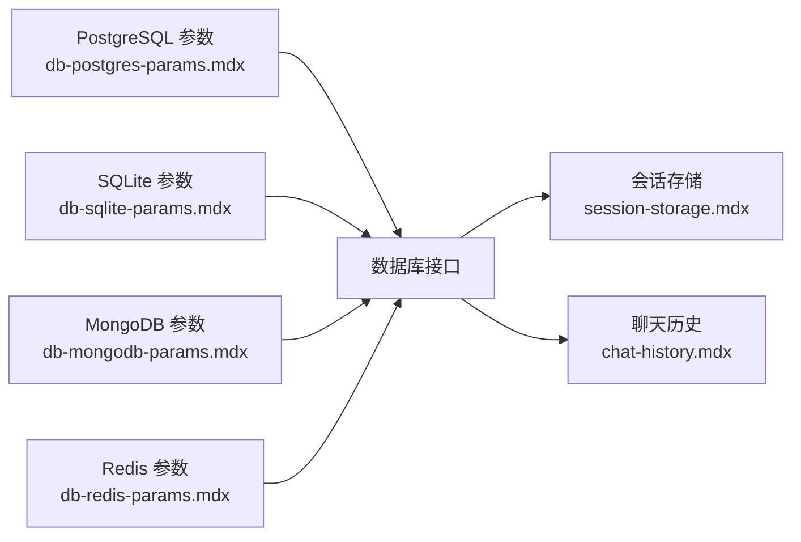

# 数据库基础

<cite>
**本文引用的文件**
- [database/overview.mdx](file://database/overview.mdx)
- [database/sqlite.mdx](file://database/sqlite.mdx)
- [database/session-storage.mdx](file://database/session-storage.mdx)
- [database/chat-history.mdx](file://database/chat-history.mdx)
- [database/providers/overview.mdx](file://database/providers/overview.mdx)
- [database/providers/sqlite/overview.mdx](file://database/providers/sqlite/overview.mdx)
- [database/providers/postgres/overview.mdx](file://database/providers/postgres/overview.mdx)
- [database/providers/mongo/overview.mdx](file://database/providers/mongo/overview.mdx)
- [database/providers/redis/overview.mdx](file://database/providers/redis/overview.mdx)
- [_snippets/db-sqlite-params.mdx](file://_snippets/db-sqlite-params.mdx)
- [_snippets/db-postgres-params.mdx](file://_snippets/db-postgres-params.mdx)
- [_snippets/db-mongodb-params.mdx](file://_snippets/db-mongodb-params.mdx)
- [_snippets/db-redis-params.mdx](file://_snippets/db-redis-params.mdx)
- [sessions/persisting-sessions/overview.mdx](file://sessions/persisting-sessions/overview.mdx)
- [examples/storage/in-memory/in-memory-storage-for-agent.mdx](file://examples/storage/in-memory/in-memory-storage-for-agent.mdx)
</cite>

## 目录
1. [引言](#引言)
2. [项目结构](#项目结构)
3. [核心组件](#核心组件)
4. [架构总览](#架构总览)
5. [详细组件分析](#详细组件分析)
6. [依赖关系分析](#依赖关系分析)
7. [性能考量](#性能考量)
8. [故障排查指南](#故障排查指南)
9. [结论](#结论)
10. [附录](#附录)

## 引言
本篇“数据库基础”面向希望在智能代理系统中引入持久化能力的读者，系统阐述数据库在代理（Agent）、团队（Team）与工作流（Workflow）中的核心作用：会话持久化、上下文管理、状态存储、记忆与知识管理、追踪与评估数据存储、数据所有权与第三方依赖规避等。文档同时给出快速开始示例，展示如何在代理中集成数据库（以 SQLite 为例），并说明其在多实体中的统一工作方式。

## 项目结构
围绕数据库主题，仓库提供了从概览到具体数据库驱动、参数说明、示例与最佳实践的完整路径：
- database 概览与功能清单：定义数据库在多轮对话、会话持久化、状态管理、上下文控制、记忆与知识、追踪与评估、数据所有权等方面的作用。
- 具体数据库驱动页面：覆盖 SQLite、PostgreSQL、MongoDB、Redis 等，包含用法、参数与运行示例。
- 会话存储与聊天历史：说明会话表结构、检索方法、在 Team 与 Workflow 中的一致性。
- 参数参考：按数据库类型列出表名、模式、连接参数等关键字段。
- 示例与最佳实践：包含 SQLite 快速集成、In-Memory 仅用于测试场景的提示。

**图表来源**
- [database/overview.mdx:1-130](file://database/overview.mdx#L1-L130)
- [database/session-storage.mdx:1-119](file://database/session-storage.mdx#L1-L119)
- [database/chat-history.mdx:1-159](file://database/chat-history.mdx#L1-L159)
- [database/providers/overview.mdx:1-175](file://database/providers/overview.mdx#L1-L175)
- [database/providers/sqlite/overview.mdx:1-24](file://database/providers/sqlite/overview.mdx#L1-L24)
- [database/providers/postgres/overview.mdx:1-42](file://database/providers/postgres/overview.mdx#L1-L42)
- [database/providers/mongo/overview.mdx:1-42](file://database/providers/mongo/overview.mdx#L1-L42)
- [database/providers/redis/overview.mdx:1-35](file://database/providers/redis/overview.mdx#L1-L35)
- [_snippets/db-sqlite-params.mdx:1-14](file://_snippets/db-sqlite-params.mdx#L1-L14)
- [_snippets/db-postgres-params.mdx:1-14](file://_snippets/db-postgres-params.mdx#L1-L14)
- [_snippets/db-mongodb-params.mdx:1-13](file://_snippets/db-mongodb-params.mdx#L1-L13)
- [_snippets/db-redis-params.mdx:1-14](file://_snippets/db-redis-params.mdx#L1-L14)
- [sessions/persisting-sessions/overview.mdx:28-65](file://sessions/persisting-sessions/overview.mdx#L28-L65)
- [examples/storage/in-memory/in-memory-storage-for-agent.mdx:1-40](file://examples/storage/in-memory/in-memory-storage-for-agent.mdx#L1-L40)

**章节来源**
- [database/overview.mdx:1-130](file://database/overview.mdx#L1-L130)
- [database/providers/overview.mdx:1-175](file://database/providers/overview.mdx#L1-L175)

## 核心组件
- 数据库作为基础设施，为代理系统提供会话持久化、上下文管理、状态存储、记忆与知识、追踪与评估、数据所有权等能力。
- 在代理、团队与工作流中，数据库的使用方式一致，通过统一的数据库接口实现跨实体的数据一致性。
- 支持多种数据库后端（关系型、NoSQL、云服务与文件系统），满足开发、测试与生产的不同阶段需求。

**章节来源**
- [database/overview.mdx:8-18](file://database/overview.mdx#L8-L18)
- [database/providers/overview.mdx:8-175](file://database/providers/overview.mdx#L8-L175)

## 架构总览
下图展示了数据库在智能代理系统中的位置与职责，以及与会话、上下文、记忆与知识、追踪与评估的关系。

**图表来源**
- [database/overview.mdx:8-18](file://database/overview.mdx#L8-L18)
- [database/providers/overview.mdx:10-175](file://database/providers/overview.mdx#L10-L175)

## 详细组件分析

### 组件一：会话持久化与检索
- 会话是相关运行的聚合，包含消息、响应、元数据与运行列表等。默认存储于特定表中，可通过参数自定义表名。
- 提供统一的检索接口，支持在代理、团队与工作流中一致使用。
- 工作流会话存储完整的流水线运行结果，不同于对话消息。

**图表来源**
- [database/session-storage.mdx:52-70](file://database/session-storage.mdx#L52-L70)

**章节来源**
- [database/session-storage.mdx:7-119](file://database/session-storage.mdx#L7-L119)

### 组件二：聊天历史与上下文控制
- 启用聊天历史后，系统会在每次请求中自动包含历史消息，支持限制历史轮数、消息总数与工具调用数量，避免上下文膨胀。
- 支持按需检索历史、跨会话检索，以及在团队与工作流中的历史共享与传递。

**图表来源**
- [database/chat-history.mdx:9-46](file://database/chat-history.mdx#L9-L46)

**章节来源**
- [database/chat-history.mdx:1-159](file://database/chat-history.mdx#L1-L159)

### 组件三：数据库驱动与参数
- SQLite：适用于本地开发，支持自定义表名与文件路径；参数包括会话、记忆、指标、评估、知识、追踪与跨度表名等。
- PostgreSQL：生产推荐，支持 schema 与表名定制；参数与 SQLite 类似但包含 schema 字段。
- MongoDB：支持集合名定制；参数包含客户端、数据库名、URL 与各集合名。
- Redis：支持键前缀与过期时间；参数包含客户端、URL、前缀与表名等。

**图表来源**
- [_snippets/db-sqlite-params.mdx:1-14](file://_snippets/db-sqlite-params.mdx#L1-L14)
- [_snippets/db-postgres-params.mdx:1-14](file://_snippets/db-postgres-params.mdx#L1-L14)
- [_snippets/db-mongodb-params.mdx:1-13](file://_snippets/db-mongodb-params.mdx#L1-L13)
- [_snippets/db-redis-params.mdx:1-14](file://_snippets/db-redis-params.mdx#L1-L14)

**章节来源**
- [_snippets/db-sqlite-params.mdx:1-14](file://_snippets/db-sqlite-params.mdx#L1-L14)
- [_snippets/db-postgres-params.mdx:1-14](file://_snippets/db-postgres-params.mdx#L1-L14)
- [_snippets/db-mongodb-params.mdx:1-13](file://_snippets/db-mongodb-params.mdx#L1-L13)
- [_snippets/db-redis-params.mdx:1-14](file://_snippets/db-redis-params.mdx#L1-L14)

### 组件四：统一工作方式（代理/团队/工作流）
- 在代理、团队与工作流中，数据库的使用方式完全一致：通过相同的数据库接口进行会话存储、上下文注入与检索。
- 可通过统一的数据库配置实现跨实体的数据一致性与可观测性。

**图表来源**
- [database/overview.mdx:91-104](file://database/overview.mdx#L91-L104)

**章节来源**
- [database/overview.mdx:91-104](file://database/overview.mdx#L91-L104)

### 组件五：快速开始（SQLite 基础配置与会话持久化）
- 使用 SQLite 进行本地会话持久化，启用历史注入与限制历史轮次，即可实现多轮对话的记忆与上下文复用。
- 示例路径：[database/sqlite.mdx:11-20](file://database/sqlite.mdx#L11-L20)，[database/overview.mdx:20-38](file://database/overview.mdx#L20-L38)。

**图表来源**
- [database/sqlite.mdx:11-20](file://database/sqlite.mdx#L11-L20)
- [database/overview.mdx:20-38](file://database/overview.mdx#L20-L38)

**章节来源**
- [database/sqlite.mdx:1-29](file://database/sqlite.mdx#L1-L29)
- [database/overview.mdx:20-38](file://database/overview.mdx#L20-L38)

## 依赖关系分析
- 数据库驱动与参数：不同数据库的参数差异体现在连接方式、表/集合命名、schema 与 TTL 等，但核心目标一致——为会话、记忆、知识、追踪与评估提供统一存储。
- 会话持久化与上下文控制：历史注入策略与限制参数直接影响上下文窗口大小与性能，应结合业务场景选择合适的策略。
- 统一接口：代理、团队与工作流共享同一套数据库接口，降低耦合度并提升可维护性。

**图表来源**
- [_snippets/db-postgres-params.mdx:1-14](file://_snippets/db-postgres-params.mdx#L1-L14)
- [_snippets/db-sqlite-params.mdx:1-14](file://_snippets/db-sqlite-params.mdx#L1-L14)
- [_snippets/db-mongodb-params.mdx:1-13](file://_snippets/db-mongodb-params.mdx#L1-L13)
- [_snippets/db-redis-params.mdx:1-14](file://_snippets/db-redis-params.mdx#L1-L14)
- [database/session-storage.mdx:30-51](file://database/session-storage.mdx#L30-L51)
- [database/chat-history.mdx:47-67](file://database/chat-history.mdx#L47-L67)

**章节来源**
- [_snippets/db-postgres-params.mdx:1-14](file://_snippets/db-postgres-params.mdx#L1-L14)
- [_snippets/db-sqlite-params.mdx:1-14](file://_snippets/db-sqlite-params.mdx#L1-L14)
- [_snippets/db-mongodb-params.mdx:1-13](file://_snippets/db-mongodb-params.mdx#L1-L13)
- [_snippets/db-redis-params.mdx:1-14](file://_snippets/db-redis-params.mdx#L1-L14)
- [database/session-storage.mdx:30-51](file://database/session-storage.mdx#L30-L51)
- [database/chat-history.mdx:47-67](file://database/chat-history.mdx#L47-L67)

## 性能考量
- 上下文窗口控制：通过限制历史轮次、消息总数与工具调用数量，平衡上下文长度与性能。
- 表/集合命名与索引：在生产环境建议为不同实体或环境设置独立表/集合，并在共享存储层优化索引与连接池。
- 存储介质选择：开发阶段可用 SQLite，生产阶段推荐 PostgreSQL；对高并发与低延迟有要求时可考虑 Redis 或云原生数据库。

**章节来源**
- [database/chat-history.mdx:47-67](file://database/chat-history.mdx#L47-L67)
- [sessions/persisting-sessions/overview.mdx:28-36](file://sessions/persisting-sessions/overview.mdx#L28-L36)

## 故障排查指南
- 缺少 Greenlet 异常：同步引擎与异步数据库类混用导致。请使用异步引擎创建函数以匹配异步数据库类。
- 异步上下文未启动异常：异步引擎与同步数据库类混用导致。请使用同步引擎创建函数以匹配同步数据库类。

**章节来源**
- [database/overview.mdx:122-130](file://database/overview.mdx#L122-L130)

## 结论
数据库是智能代理系统持久化能力的核心基石。通过统一的数据库接口，代理、团队与工作流可以在会话持久化、上下文管理、状态存储、记忆与知识、追踪与评估等方面获得一致且可扩展的能力。根据场景选择合适的数据库驱动与参数，并配合上下文控制策略，可在保证性能的同时实现强大的多轮对话与跨请求会话延续。

## 附录
- 快速开始示例（SQLite）：参见 [database/sqlite.mdx:11-20](file://database/sqlite.mdx#L11-L20) 与 [database/overview.mdx:20-38](file://database/overview.mdx#L20-L38)。
- 参数参考：SQLite、PostgreSQL、MongoDB、Redis 的参数表分别见 [_snippets/db-sqlite-params.mdx:1-14](file://_snippets/db-sqlite-params.mdx#L1-L14)、[_snippets/db-postgres-params.mdx:1-14](file://_snippets/db-postgres-params.mdx#L1-L14)、[_snippets/db-mongodb-params.mdx:1-13](file://_snippets/db-mongodb-params.mdx#L1-L13)、[_snippets/db-redis-params.mdx:1-14](file://_snippets/db-redis-params.mdx#L1-L14)。
- 示例：内存存储仅用于测试与演示，参见 [examples/storage/in-memory/in-memory-storage-for-agent.mdx:1-40](file://examples/storage/in-memory/in-memory-storage-for-agent.mdx#L1-L40)。