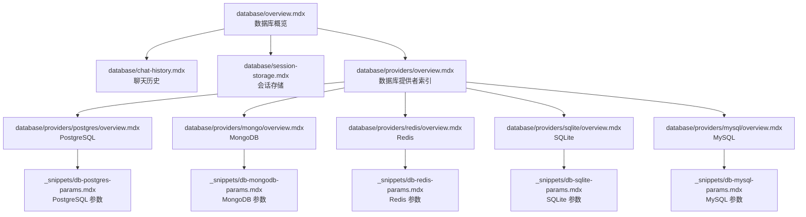
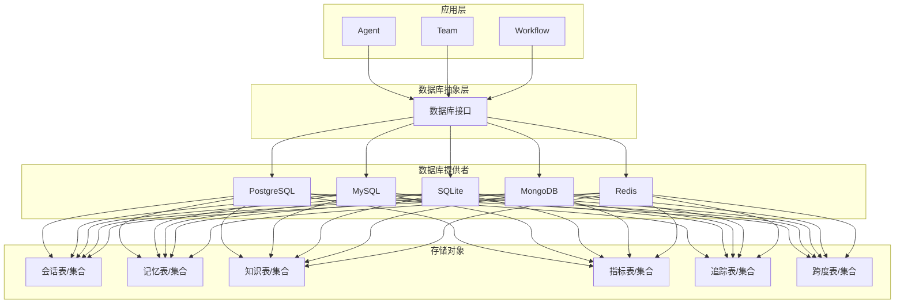
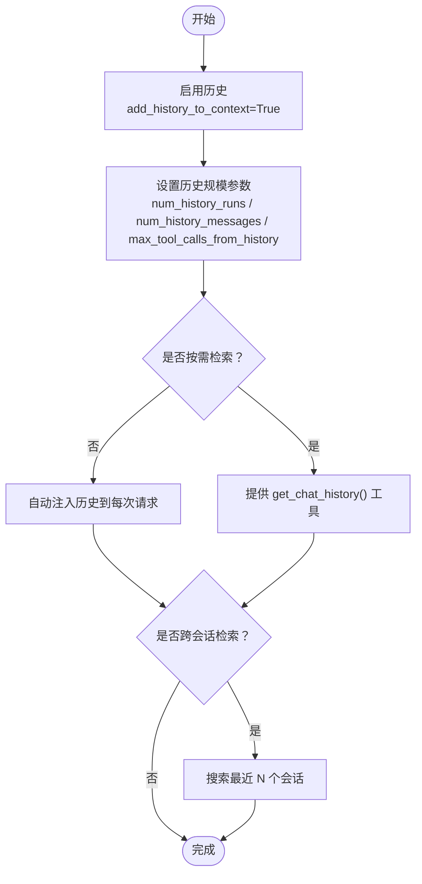
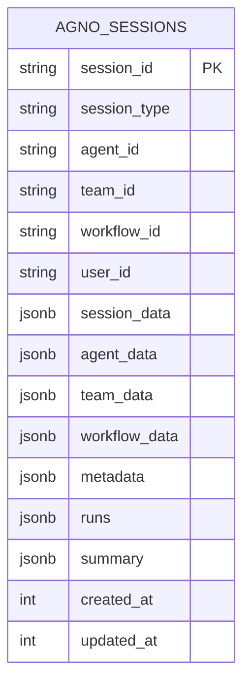
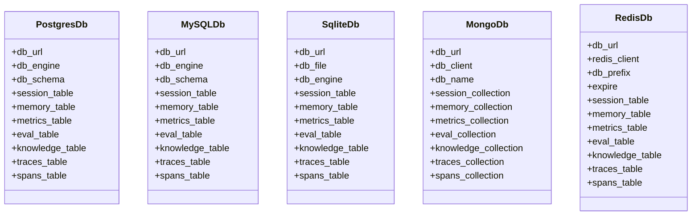
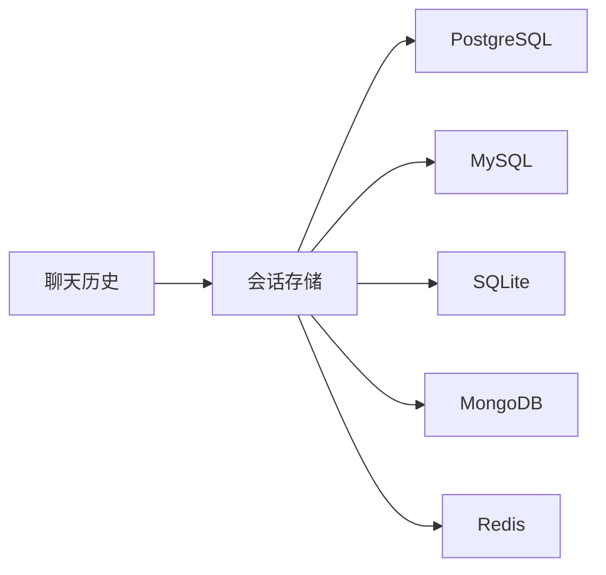

# 数据库系统

<cite>
**本文引用的文件**
- [database/overview.mdx](file://database/overview.mdx)
- [database/chat-history.mdx](file://database/chat-history.mdx)
- [database/session-storage.mdx](file://database/session-storage.mdx)
- [database/providers/overview.mdx](file://database/providers/overview.mdx)
- [database/providers/postgres/overview.mdx](file://database/providers/postgres/overview.mdx)
- [database/providers/mongo/overview.mdx](file://database/providers/mongo/overview.mdx)
- [database/providers/redis/overview.mdx](file://database/providers/redis/overview.mdx)
- [database/providers/sqlite/overview.mdx](file://database/providers/sqlite/overview.mdx)
- [database/providers/mysql/overview.mdx](file://database/providers/mysql/overview.mdx)
- [_snippets/db-postgres-params.mdx](file://_snippets/db-postgres-params.mdx)
- [_snippets/db-mongodb-params.mdx](file://_snippets/db-mongodb-params.mdx)
- [_snippets/db-redis-params.mdx](file://_snippets/db-redis-params.mdx)
- [_snippets/db-sqlite-params.mdx](file://_snippets/db-sqlite-params.mdx)
- [_snippets/db-mysql-params.mdx](file://_snippets/db-mysql-params.mdx)
</cite>

## 目录
1. [简介](#简介)
2. [项目结构](#项目结构)
3. [核心组件](#核心组件)
4. [架构总览](#架构总览)
5. [详细组件分析](#详细组件分析)
6. [依赖关系分析](#依赖关系分析)
7. [性能考虑](#性能考虑)
8. [故障排除指南](#故障排除指南)
9. [结论](#结论)
10. [附录](#附录)

## 简介
本技术文档面向数据库系统，聚焦于会话与聊天历史的持久化、表结构选择机制、以及多种数据库后端（含关系型与非关系型）的配置与使用。文档覆盖以下主题：
- 支持的数据库类型与适用场景
- 连接管理与数据持久化策略
- 表格选择机制：如何按需选择合适的表结构
- 聊天历史管理：消息存储、检索与清理策略
- 会话存储：配置与使用、持久化与恢复
- 连接配置、性能优化与故障排除示例

## 项目结构
数据库系统以“概览”“聊天历史”“会话存储”“数据库提供者索引”为核心页面，并通过各数据库提供者子页与参数片段进行具体说明。整体采用“文档即索引”的组织方式，便于快速定位不同数据库类型的使用与配置。

图表来源
- [database/overview.mdx:1-130](file://database/overview.mdx#L1-L130)
- [database/providers/overview.mdx:1-175](file://database/providers/overview.mdx#L1-L175)
- [database/providers/postgres/overview.mdx:1-42](file://database/providers/postgres/overview.mdx#L1-L42)
- [database/providers/mongo/overview.mdx:1-42](file://database/providers/mongo/overview.mdx#L1-L42)
- [database/providers/redis/overview.mdx:1-35](file://database/providers/redis/overview.mdx#L1-L35)
- [database/providers/sqlite/overview.mdx:1-24](file://database/providers/sqlite/overview.mdx#L1-L24)
- [database/providers/mysql/overview.mdx:1-39](file://database/providers/mysql/overview.mdx#L1-L39)

章节来源
- [database/overview.mdx:1-130](file://database/overview.mdx#L1-L130)
- [database/providers/overview.mdx:1-175](file://database/providers/overview.mdx#L1-L175)

## 核心组件
- 数据库提供者索引：统一列出支持的数据库类型，按关系型、NoSQL、数据库服务、存储与文件系统分类，便于按需选择。
- 聊天历史模块：启用多轮对话上下文、控制历史规模、按需检索、跨会话搜索、团队与工作流的历史共享。
- 会话存储模块：定义会话表结构、字段含义、读取与检索接口，支持不同实体（Agent/Team/Workflow）的会话持久化。
- 各数据库提供者：分别给出使用示例、运行方式与参数说明，覆盖 PostgreSQL、MySQL、SQLite、MongoDB、Redis 等。

章节来源
- [database/providers/overview.mdx:1-175](file://database/providers/overview.mdx#L1-L175)
- [database/chat-history.mdx:1-159](file://database/chat-history.mdx#L1-L159)
- [database/session-storage.mdx:1-119](file://database/session-storage.mdx#L1-L119)

## 架构总览
数据库系统围绕“会话与聊天历史”两大目标展开，通过统一的数据库接口适配多种后端，实现跨 Agent/Team/Workflow 的一致行为。下图展示了从应用到数据库层的交互路径与职责边界。

图表来源
- [database/overview.mdx:91-107](file://database/overview.mdx#L91-L107)
- [database/providers/overview.mdx:10-175](file://database/providers/overview.mdx#L10-L175)

## 详细组件分析

### 组件一：聊天历史管理
- 功能要点
  - 多轮对话上下文：通过开启“将历史加入上下文”，自动在每次请求中注入历史消息。
  - 历史规模控制：通过参数限制历史轮次、消息总数、工具调用消息数量等，平衡上下文长度与成本。
  - 按需检索：提供工具或编程方式按需获取历史，适用于审计、分析或大多数查询无需上下文的场景。
  - 跨会话检索：在多个会话间搜索上下文，注意控制搜索范围以避免上下文窗口溢出。
  - 团队与工作流：团队成员可共享历史；工作流步骤可复用上一步输出结果。
- 使用建议
  - 初期默认：历史轮次 3；如需更长对话，结合“会话摘要”降低 token 消耗。
  - 工具密集型：增加工具调用消息上限限制，减少噪声。
  - 跨会话：限制搜索会话数 2–3，避免上下文过载。

图表来源
- [database/chat-history.mdx:9-159](file://database/chat-history.mdx#L9-L159)

章节来源
- [database/chat-history.mdx:1-159](file://database/chat-history.mdx#L1-L159)

### 组件二：会话存储与表结构选择
- 存储内容
  - 会话标识、类型（Agent/Team/Workflow）、关联 ID、用户 ID、会话数据、配置元数据、运行记录、摘要、时间戳等。
- 表结构选择机制
  - 默认表名：统一使用“会话表”存放 Agent/Team/Workflow 的会话。
  - 自定义表：通过配置项将不同实体或环境的数据分离到独立表，提升可维护性与隔离性。
- 读取与检索
  - 提供统一的会话读取接口，支持 Agent/Team/Workflow 三类实体。
- 与其他模块的关系
  - 会话存储与聊天历史紧密耦合：历史注入与检索依赖会话表中的运行记录。
  - 会话摘要用于压缩长对话，降低 token 成本。

图表来源
- [database/session-storage.mdx:30-51](file://database/session-storage.mdx#L30-L51)

章节来源
- [database/session-storage.mdx:1-119](file://database/session-storage.mdx#L1-L119)

### 组件三：数据库提供者与参数配置
- 关系型数据库
  - PostgreSQL：生产级关系型数据库，适合高并发与复杂查询；支持异步版本。
  - MySQL：广泛部署的关系型数据库，适合中小规模应用。
  - SQLite：轻量本地存储，适合开发与测试。
- 非关系型数据库
  - MongoDB：文档型数据库，适合灵活 schema 与快速迭代。
  - Redis：内存键值存储，适合短期缓存与会话前缀隔离。
- 共同特性
  - 支持自定义表/集合名称，便于多租户或多环境隔离。
  - 提供统一的参数入口，覆盖连接字符串、引擎实例、schema、表/集合命名等。

图表来源
- [_snippets/db-postgres-params.mdx:1-14](file://_snippets/db-postgres-params.mdx#L1-L14)
- [_snippets/db-mysql-params.mdx:1-13](file://_snippets/db-mysql-params.mdx#L1-L13)
- [_snippets/db-sqlite-params.mdx:1-14](file://_snippets/db-sqlite-params.mdx#L1-L14)
- [_snippets/db-mongodb-params.mdx:1-13](file://_snippets/db-mongodb-params.mdx#L1-L13)
- [_snippets/db-redis-params.mdx:1-14](file://_snippets/db-redis-params.mdx#L1-L14)

章节来源
- [database/providers/postgres/overview.mdx:1-42](file://database/providers/postgres/overview.mdx#L1-L42)
- [database/providers/mysql/overview.mdx:1-39](file://database/providers/mysql/overview.mdx#L1-L39)
- [database/providers/sqlite/overview.mdx:1-24](file://database/providers/sqlite/overview.mdx#L1-L24)
- [database/providers/mongo/overview.mdx:1-42](file://database/providers/mongo/overview.mdx#L1-L42)
- [database/providers/redis/overview.mdx:1-35](file://database/providers/redis/overview.mdx#L1-L35)
- [_snippets/db-postgres-params.mdx:1-14](file://_snippets/db-postgres-params.mdx#L1-L14)
- [_snippets/db-mysql-params.mdx:1-13](file://_snippets/db-mysql-params.mdx#L1-L13)
- [_snippets/db-sqlite-params.mdx:1-14](file://_snippets/db-sqlite-params.mdx#L1-L14)
- [_snippets/db-mongodb-params.mdx:1-13](file://_snippets/db-mongodb-params.mdx#L1-L13)
- [_snippets/db-redis-params.mdx:1-14](file://_snippets/db-redis-params.mdx#L1-L14)

## 依赖关系分析
- 组件内聚与耦合
  - 聊天历史与会话存储高度耦合：前者依赖后者提供的运行记录进行上下文注入与检索。
  - 数据库提供者对上层透明：统一接口屏蔽差异，便于切换与扩展。
- 外部依赖
  - 关系型数据库依赖 SQLAlchemy 引擎；NoSQL 依赖对应客户端（如 MongoDB、Redis 客户端）。
- 可能的循环依赖
  - 文档层之间无直接循环依赖，仅通过参数片段与提供者子页进行引用。

图表来源
- [database/chat-history.mdx:1-159](file://database/chat-history.mdx#L1-L159)
- [database/session-storage.mdx:1-119](file://database/session-storage.mdx#L1-L119)
- [database/providers/overview.mdx:10-175](file://database/providers/overview.mdx#L10-L175)

章节来源
- [database/chat-history.mdx:1-159](file://database/chat-history.mdx#L1-L159)
- [database/session-storage.mdx:1-119](file://database/session-storage.mdx#L1-L119)
- [database/providers/overview.mdx:1-175](file://database/providers/overview.mdx#L1-L175)

## 性能考虑
- 历史规模控制
  - 通过限制历史轮次与消息总数，降低上下文长度，从而减少 token 消耗与延迟。
  - 对工具密集型任务，限制工具调用消息数量，减少噪声。
- 会话摘要
  - 对长对话使用会话摘要压缩上下文，显著降低后续请求的成本。
- 数据库选择
  - 开发与测试：SQLite 轻量便捷。
  - 生产与高并发：PostgreSQL/MySQL 更稳定；Redis 用于短期缓存与键空间隔离。
  - 文档型场景：MongoDB 适合灵活 schema 与快速演进。
- 连接与引擎
  - 异步应用使用异步数据库类与异步引擎，避免阻塞与上下文错误。

## 故障排除指南
- 异常类型与原因
  - 缺少 Greenlet 异常：同步引擎与异步数据库类混用导致。
  - 异步上下文未启动异常：异步引擎与同步数据库类混用导致。
- 排查步骤
  - 确认数据库类与引擎类型匹配（同步/异步）。
  - 检查连接字符串与凭据是否正确。
  - 在生产环境确认数据库可用性与网络连通性。
- 参考示例
  - 文档中提供了两类常见异常的说明与修正方向，便于快速定位问题。

章节来源
- [database/overview.mdx:122-130](file://database/overview.mdx#L122-L130)

## 结论
该数据库系统通过统一的接口与清晰的模块划分，实现了跨 Agent/Team/Workflow 的会话与聊天历史持久化。配合多样化的数据库提供者与完善的参数配置，开发者可在不同阶段与场景中灵活选择最适合的数据库方案。建议在开发阶段优先使用 SQLite，进入生产阶段则根据业务规模与特性选择 PostgreSQL/MySQL 或 MongoDB/Redis 等方案，并结合历史规模控制与会话摘要策略，持续优化性能与成本。

## 附录
- 快速开始
  - 使用 SQLite 进行本地开发与测试，启用历史注入与限制历史规模。
  - 使用 PostgreSQL/MySQL/Redis/MongoDB 等进行生产部署，按需自定义表/集合名称与连接参数。
- 最佳实践
  - 将不同实体或环境的数据分离到独立表/集合，提升可维护性。
  - 对长对话使用会话摘要，降低 token 成本。
  - 在异步应用中保持数据库类与引擎类型一致，避免上下文与协程相关异常。