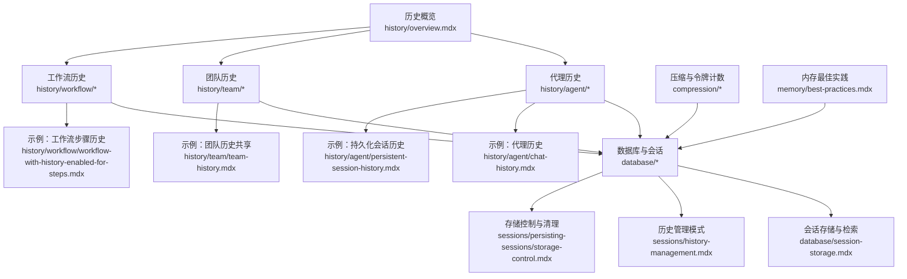
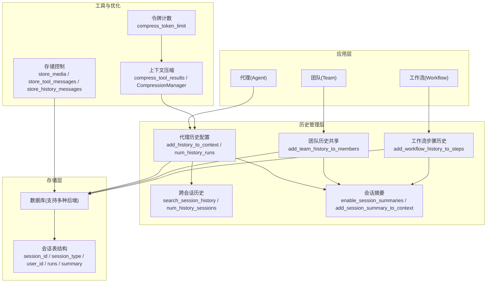
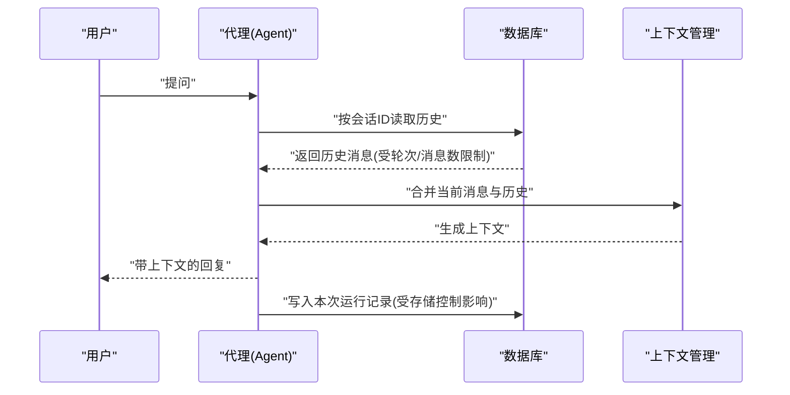
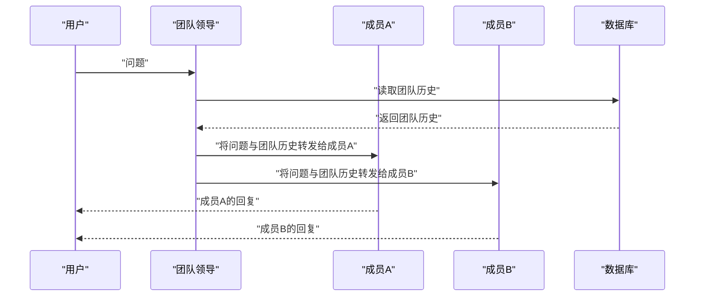
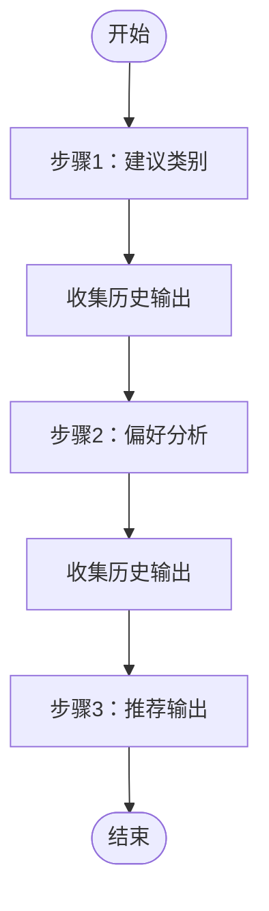
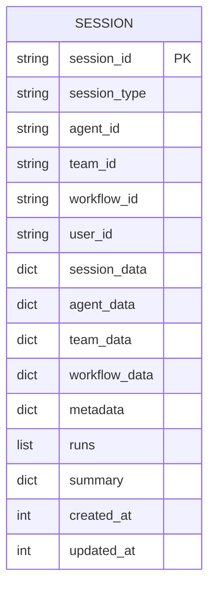
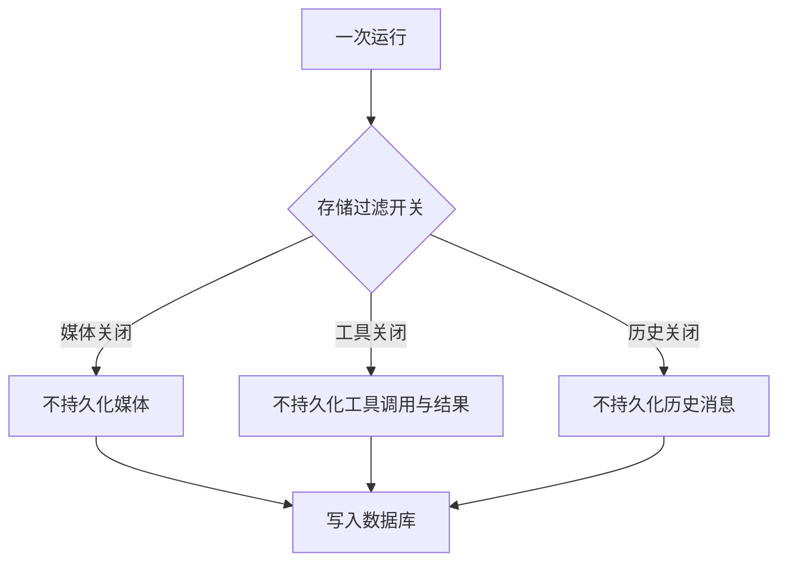
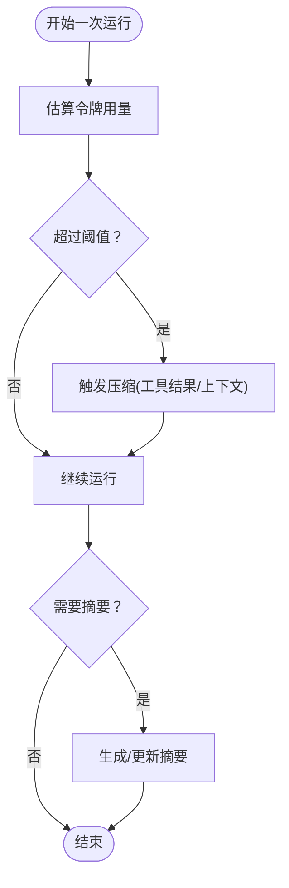
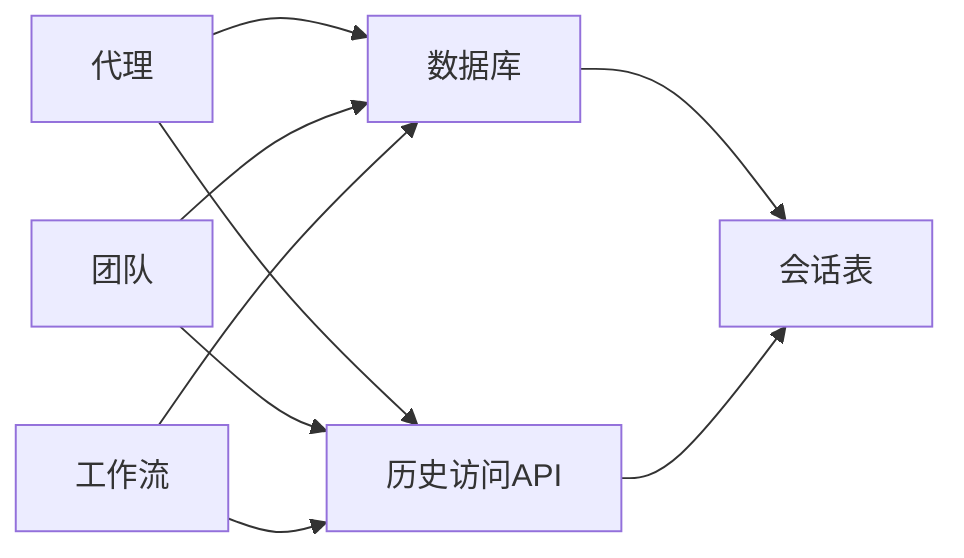

# 聊天历史管理

<cite>
**本文引用的文件**
- [history/overview.mdx](file://history/overview.mdx)
- [history/agent/chat-history.mdx](file://history/agent/chat-history.mdx)
- [history/agent/persistent-session-history.mdx](file://history/agent/persistent-session-history.mdx)
- [history/team/team-history.mdx](file://history/team/team-history.mdx)
- [history/workflow/workflow-with-history-enabled-for-steps.mdx](file://history/workflow/workflow-with-history-enabled-for-steps.mdx)
- [database/chat-history.mdx](file://database/chat-history.mdx)
- [database/session-storage.mdx](file://database/session-storage.mdx)
- [sessions/history-management.mdx](file://sessions/history-management.mdx)
- [sessions/persisting-sessions/storage-control.mdx](file://sessions/persisting-sessions/storage-control.mdx)
- [sessions/session-summaries.mdx](file://sessions/session-summaries.mdx)
- [examples/storage/chat-history.mdx](file://examples/storage/chat-history.mdx)
- [reference/agents/agent.mdx](file://reference/agents/agent.mdx)
- [reference/teams/team.mdx](file://reference/teams/team.mdx)
- [compression/overview.mdx](file://compression/overview.mdx)
- [compression/token-counting.mdx](file://compression/token-counting.mdx)
- [memory/best-practices.mdx](file://memory/best-practices.mdx)
</cite>

## 目录
1. [简介](#简介)
2. [项目结构](#项目结构)
3. [核心组件](#核心组件)
4. [架构总览](#架构总览)
5. [详细组件分析](#详细组件分析)
6. [依赖关系分析](#依赖关系分析)
7. [性能考虑](#性能考虑)
8. [故障排查指南](#故障排查指南)
9. [结论](#结论)
10. [附录](#附录)

## 简介
本文件系统性阐述聊天历史管理能力，覆盖多轮对话上下文构建、历史存储与检索、跨会话召回、以及在代理（Agent）、团队（Team）与工作流（Workflow）中的使用方式。重点包括：
- 如何在多轮对话中包含之前的聊天消息到上下文中，实现连续对话体验
- 历史消息的存储机制：消息格式、时间戳记录、用户标识符管理
- 历史轮次与跨会话保留策略：历史轮次数量、跨会话搜索、存储空间管理
- 历史检索与查询：按会话 ID 查询、按时间范围筛选、关键字搜索
- 在不同组件中的使用：代理上下文构建、团队协作对话、工作流状态保持
- 实际配置示例与代码片段路径，展示启用历史记录、设置历史轮次与清理策略
- 性能优化建议与最佳实践，确保高效运行

## 项目结构
围绕聊天历史管理的关键文档与示例分布如下：
- 概览与分层：history/* 提供各组件的历史能力概览与示例
- 数据库与会话：database/*、sessions/* 提供历史存储、会话表结构、检索接口与存储控制
- 示例与参考：examples/*、reference/* 提供可运行示例与API参考
- 压缩与内存：compression/*、memory/* 提供上下文压缩与内存优化策略

**图表来源**
- [history/overview.mdx:1-49](file://history/overview.mdx#L1-L49)
- [database/chat-history.mdx:1-159](file://database/chat-history.mdx#L1-L159)
- [database/session-storage.mdx:1-119](file://database/session-storage.mdx#L1-L119)
- [sessions/history-management.mdx:1-108](file://sessions/history-management.mdx#L1-L108)
- [sessions/persisting-sessions/storage-control.mdx:1-208](file://sessions/persisting-sessions/storage-control.mdx#L1-L208)
- [history/agent/chat-history.mdx:1-67](file://history/agent/chat-history.mdx#L1-L67)
- [history/agent/persistent-session-history.mdx:1-68](file://history/agent/persistent-session-history.mdx#L1-L68)
- [history/team/team-history.mdx:1-119](file://history/team/team-history.mdx#L1-L119)
- [history/workflow/workflow-with-history-enabled-for-steps.mdx:1-190](file://history/workflow/workflow-with-history-enabled-for-steps.mdx#L1-L190)
- [compression/overview.mdx:1-112](file://compression/overview.mdx#L1-L112)
- [memory/best-practices.mdx:1-158](file://memory/best-practices.mdx#L1-L158)

**章节来源**
- [history/overview.mdx:1-49](file://history/overview.mdx#L1-L49)
- [database/chat-history.mdx:1-159](file://database/chat-history.mdx#L1-L159)
- [database/session-storage.mdx:1-119](file://database/session-storage.mdx#L1-L119)
- [sessions/history-management.mdx:1-108](file://sessions/history-management.mdx#L1-L108)
- [sessions/persisting-sessions/storage-control.mdx:1-208](file://sessions/persisting-sessions/storage-control.mdx#L1-L208)

## 核心组件
- 代理（Agent）历史管理
  - 自动将历史纳入上下文：通过开关与轮次数控制历史长度
  - 程序化访问历史：按会话获取消息、最后运行输出等
  - 跨会话历史搜索：限定最近N个会话进行检索
- 团队（Team）历史管理
  - 成员间共享团队历史，使每个成员都能看到之前的交互
  - 控制是否直接转发用户输入给成员或由领导合成输入
- 工作流（Workflow）历史管理
  - 将前一步骤的输出作为上下文传递给后续步骤
  - 支持限制历史轮次与消息上限，避免上下文膨胀
- 会话存储与检索
  - 会话表结构：包含会话ID、类型、用户ID、运行记录、摘要等字段
  - 检索接口：按会话ID获取会话、消息、最后运行输出
- 存储控制与清理
  - 三类存储开关：媒体、工具调用结果、历史消息
  - 通过开关减少数据库体积，同时保持运行时体验
- 会话摘要
  - 自动生成并维护会话摘要，降低长对话的上下文成本
  - 可与近期历史结合使用，兼顾细节与成本
- 压缩与令牌计数
  - 针对工具结果与上下文进行自动压缩
  - 提供令牌估算，辅助规划与压缩阈值设定

**章节来源**
- [database/chat-history.mdx:1-159](file://database/chat-history.mdx#L1-L159)
- [database/session-storage.mdx:1-119](file://database/session-storage.mdx#L1-L119)
- [sessions/history-management.mdx:1-108](file://sessions/history-management.mdx#L1-L108)
- [sessions/persisting-sessions/storage-control.mdx:1-208](file://sessions/persisting-sessions/storage-control.mdx#L1-L208)
- [sessions/session-summaries.mdx:1-184](file://sessions/session-summaries.mdx#L1-L184)
- [compression/overview.mdx:1-112](file://compression/overview.mdx#L1-L112)
- [compression/token-counting.mdx:1-112](file://compression/token-counting.mdx#L1-L112)

## 架构总览
聊天历史管理在系统中的位置与交互如下：

**图表来源**
- [database/chat-history.mdx:1-159](file://database/chat-history.mdx#L1-L159)
- [database/session-storage.mdx:1-119](file://database/session-storage.mdx#L1-L119)
- [sessions/persisting-sessions/storage-control.mdx:1-208](file://sessions/persisting-sessions/storage-control.mdx#L1-L208)
- [sessions/session-summaries.mdx:1-184](file://sessions/session-summaries.mdx#L1-L184)
- [compression/overview.mdx:1-112](file://compression/overview.mdx#L1-L112)
- [compression/token-counting.mdx:1-112](file://compression/token-counting.mdx#L1-L112)

## 详细组件分析

### 代理（Agent）历史管理
- 启用上下文历史
  - 通过开关将历史纳入每次请求的上下文，并限制历史轮次
  - 示例路径：[history/agent/chat-history.mdx:1-67](file://history/agent/chat-history.mdx#L1-L67)
- 持久化会话与历史轮次
  - 使用数据库与会话ID，配合历史轮次参数实现可控的历史长度
  - 示例路径：[history/agent/persistent-session-history.mdx:1-68](file://history/agent/persistent-session-history.mdx#L1-L68)
- 程序化访问历史
  - 获取会话消息、聊天历史、最后运行输出等
  - 示例路径：[examples/storage/chat-history.mdx:1-57](file://examples/storage/chat-history.mdx#L1-L57)
- 跨会话历史
  - 允许在最近N个会话中搜索以获得更广的上下文
  - 示例路径：[history/agent/chat-history.mdx:1-67](file://history/agent/chat-history.mdx#L1-L67)

**图表来源**
- [database/chat-history.mdx:1-159](file://database/chat-history.mdx#L1-L159)
- [database/session-storage.mdx:1-119](file://database/session-storage.mdx#L1-L119)
- [sessions/persisting-sessions/storage-control.mdx:1-208](file://sessions/persisting-sessions/storage-control.mdx#L1-L208)

**章节来源**
- [history/agent/chat-history.mdx:1-67](file://history/agent/chat-history.mdx#L1-L67)
- [history/agent/persistent-session-history.mdx:1-68](file://history/agent/persistent-session-history.mdx#L1-L68)
- [examples/storage/chat-history.mdx:1-57](file://examples/storage/chat-history.mdx#L1-L57)
- [database/chat-history.mdx:1-159](file://database/chat-history.mdx#L1-L159)
- [database/session-storage.mdx:1-119](file://database/session-storage.mdx#L1-L119)
- [sessions/persisting-sessions/storage-control.mdx:1-208](file://sessions/persisting-sessions/storage-control.mdx#L1-L208)

### 团队（Team）历史管理
- 成员共享团队历史
  - 通过开关将团队历史附加到成员的任务中，实现跨成员上下文共享
  - 示例路径：[history/team/team-history.mdx:1-119](file://history/team/team-history.mdx#L1-L119)
- 输入路由与直接响应
  - 可选择由团队领导合成输入或直接将用户输入转发给成员
  - 示例路径：[history/team/team-history.mdx:1-119](file://history/team/team-history.mdx#L1-L119)

**图表来源**
- [history/team/team-history.mdx:1-119](file://history/team/team-history.mdx#L1-L119)
- [database/chat-history.mdx:1-159](file://database/chat-history.mdx#L1-L159)

**章节来源**
- [history/team/team-history.mdx:1-119](file://history/team/team-history.mdx#L1-L119)
- [database/chat-history.mdx:1-159](file://database/chat-history.mdx#L1-L159)

### 工作流（Workflow）历史管理
- 步骤间历史传递
  - 通过开关将前一或前几轮的步骤输出作为上下文传递给后续步骤
  - 示例路径：[history/workflow/workflow-with-history-enabled-for-steps.mdx:1-190](file://history/workflow/workflow-with-history-enabled-for-steps.mdx#L1-L190)
- 多步协作与偏好学习
  - 结合偏好分析函数与历史上下文，实现逐步细化的推荐或决策

**图表来源**
- [history/workflow/workflow-with-history-enabled-for-steps.mdx:1-190](file://history/workflow/workflow-with-history-enabled-for-steps.mdx#L1-L190)

**章节来源**
- [history/workflow/workflow-with-history-enabled-for-steps.mdx:1-190](file://history/workflow/workflow-with-history-enabled-for-steps.mdx#L1-L190)

### 会话存储与检索
- 会话表结构
  - 字段涵盖会话ID、类型、用户ID、运行记录、摘要、时间戳等
  - 示例路径：[database/session-storage.mdx:1-119](file://database/session-storage.mdx#L1-L119)
- 检索接口
  - 获取会话、会话消息、最后运行输出等
  - 示例路径：[database/session-storage.mdx:1-119](file://database/session-storage.mdx#L1-L119)
- 与团队/工作流的关系
  - 团队与工作流同样使用会话存储，但工作流会话存储的是完整流水线运行而非对话消息
  - 示例路径：[database/session-storage.mdx:1-119](file://database/session-storage.mdx#L1-L119)

**图表来源**
- [database/session-storage.mdx:1-119](file://database/session-storage.mdx#L1-L119)

**章节来源**
- [database/session-storage.mdx:1-119](file://database/session-storage.mdx#L1-L119)

### 存储控制与清理
- 三类存储开关
  - 媒体存储、工具消息存储、历史消息存储
  - 运行时仍可见全部内容，仅持久化阶段过滤
  - 示例路径：[sessions/persisting-sessions/storage-control.mdx:1-208](file://sessions/persisting-sessions/storage-control.mdx#L1-L208)
- 历史消息持久化策略
  - 默认不持久化历史消息，仅当前运行消息被写入
  - 可通过开关开启完整历史持久化
  - 示例路径：[sessions/persisting-sessions/storage-control.mdx:1-208](file://sessions/persisting-sessions/storage-control.mdx#L1-L208)
- 与上下文历史的区别
  - 上下文历史用于模型推理，存储控制用于数据库持久化
  - 示例路径：[database/chat-history.mdx:1-159](file://database/chat-history.mdx#L1-L159)

**图表来源**
- [sessions/persisting-sessions/storage-control.mdx:1-208](file://sessions/persisting-sessions/storage-control.mdx#L1-L208)
- [database/chat-history.mdx:1-159](file://database/chat-history.mdx#L1-L159)

**章节来源**
- [sessions/persisting-sessions/storage-control.mdx:1-208](file://sessions/persisting-sessions/storage-control.mdx#L1-L208)
- [database/chat-history.mdx:1-159](file://database/chat-history.mdx#L1-L159)

### 会话摘要与上下文压缩
- 会话摘要
  - 自动生成并维护摘要，降低长对话上下文成本
  - 可与近期历史结合使用，兼顾细节与成本
  - 示例路径：[sessions/session-summaries.mdx:1-184](file://sessions/session-summaries.mdx#L1-L184)
- 上下文压缩
  - 针对工具结果与上下文进行自动压缩，避免超出上下文窗口
  - 示例路径：[compression/overview.mdx:1-112](file://compression/overview.mdx#L1-L112)
- 令牌计数
  - 提供令牌估算，辅助规划与压缩阈值设定
  - 示例路径：[compression/token-counting.mdx:1-112](file://compression/token-counting.mdx#L1-L112)

**图表来源**
- [sessions/session-summaries.mdx:1-184](file://sessions/session-summaries.mdx#L1-L184)
- [compression/overview.mdx:1-112](file://compression/overview.mdx#L1-L112)
- [compression/token-counting.mdx:1-112](file://compression/token-counting.mdx#L1-L112)

**章节来源**
- [sessions/session-summaries.mdx:1-184](file://sessions/session-summaries.mdx#L1-L184)
- [compression/overview.mdx:1-112](file://compression/overview.mdx#L1-L112)
- [compression/token-counting.mdx:1-112](file://compression/token-counting.mdx#L1-L112)

## 依赖关系分析
- 组件耦合与内聚
  - 代理、团队、工作流均依赖数据库以实现会话持久化与历史检索
  - 历史管理与存储控制相互独立，既可组合使用也可单独启用
- 外部依赖与集成点
  - 数据库驱动：PostgreSQL、SQLite、DynamoDB、MongoDB、Redis、GCS JSON等
  - 令牌计数与压缩：依赖外部库进行估算与压缩
- 接口契约
  - 代理与团队提供统一的历史访问接口（如获取聊天历史、会话消息、最后运行输出）
  - 工作流通过步骤间传递实现历史上下文

**图表来源**
- [database/session-storage.mdx:1-119](file://database/session-storage.mdx#L1-L119)
- [reference/agents/agent.mdx:1-100](file://reference/agents/agent.mdx#L1-L100)
- [reference/teams/team.mdx:1-500](file://reference/teams/team.mdx#L1-L500)

**章节来源**
- [database/session-storage.mdx:1-119](file://database/session-storage.mdx#L1-L119)
- [reference/agents/agent.mdx:1-100](file://reference/agents/agent.mdx#L1-L100)
- [reference/teams/team.mdx:1-500](file://reference/teams/team.mdx#L1-L500)

## 性能考虑
- 历史轮次与消息上限
  - 通过限制历史轮次与消息总数，控制上下文大小
  - 示例路径：[database/chat-history.mdx:1-159](file://database/chat-history.mdx#L1-L159)
- 会话摘要
  - 长对话场景下显著降低令牌消耗，避免上下文窗口限制
  - 示例路径：[sessions/session-summaries.mdx:1-184](file://sessions/session-summaries.mdx#L1-L184)
- 存储控制
  - 关闭媒体、工具消息与历史消息的持久化，大幅减少数据库体积
  - 示例路径：[sessions/persisting-sessions/storage-control.mdx:1-208](file://sessions/persisting-sessions/storage-control.mdx#L1-L208)
- 上下文压缩
  - 对工具结果与上下文进行压缩，防止超限
  - 示例路径：[compression/overview.mdx:1-112](file://compression/overview.mdx#L1-L112)
- 令牌计数
  - 提供估算与阈值设置，辅助规划与压缩触发
  - 示例路径：[compression/token-counting.mdx:1-112](file://compression/token-counting.mdx#L1-L112)

**章节来源**
- [database/chat-history.mdx:1-159](file://database/chat-history.mdx#L1-L159)
- [sessions/session-summaries.mdx:1-184](file://sessions/session-summaries.mdx#L1-L184)
- [sessions/persisting-sessions/storage-control.mdx:1-208](file://sessions/persisting-sessions/storage-control.mdx#L1-L208)
- [compression/overview.mdx:1-112](file://compression/overview.mdx#L1-L112)
- [compression/token-counting.mdx:1-112](file://compression/token-counting.mdx#L1-L112)

## 故障排查指南
- 历史未生效
  - 确认已配置数据库并传入代理/团队/工作流
  - 确认启用了历史开关与合适的轮次/消息上限
  - 示例路径：[database/chat-history.mdx:1-159](file://database/chat-history.mdx#L1-L159)
- 跨会话历史过大
  - 降低跨会话轮次，避免填充上下文窗口
  - 示例路径：[database/chat-history.mdx:1-159](file://database/chat-history.mdx#L1-L159)
- 数据库体积增长过快
  - 关闭媒体与工具消息持久化，必要时关闭历史消息持久化
  - 示例路径：[sessions/persisting-sessions/storage-control.mdx:1-208](file://sessions/persisting-sessions/storage-control.mdx#L1-L208)
- 上下文超限
  - 启用会话摘要与上下文压缩，合理设置压缩阈值
  - 示例路径：[sessions/session-summaries.mdx:1-184](file://sessions/session-summaries.mdx#L1-L184)、[compression/overview.mdx:1-112](file://compression/overview.mdx#L1-L112)
- 程序化访问历史异常
  - 检查会话ID与用户ID是否正确传入
  - 示例路径：[database/session-storage.mdx:1-119](file://database/session-storage.mdx#L1-L119)

**章节来源**
- [database/chat-history.mdx:1-159](file://database/chat-history.mdx#L1-L159)
- [sessions/persisting-sessions/storage-control.mdx:1-208](file://sessions/persisting-sessions/storage-control.mdx#L1-L208)
- [sessions/session-summaries.mdx:1-184](file://sessions/session-summaries.mdx#L1-L184)
- [compression/overview.mdx:1-112](file://compression/overview.mdx#L1-L112)
- [database/session-storage.mdx:1-119](file://database/session-storage.mdx#L1-L119)

## 结论
聊天历史管理通过“数据库持久化 + 上下文控制 + 存储优化 + 摘要与压缩”的组合，在保证连续对话体验的同时，有效控制成本与性能风险。针对不同场景（短对话、长对话、工具密集型、跨会话召回），可灵活选择历史轮次、摘要与存储控制策略，并结合令牌计数与压缩阈值实现稳定高效的运行。

## 附录
- 实际配置示例与代码片段路径
  - 代理历史示例：[history/agent/chat-history.mdx:1-67](file://history/agent/chat-history.mdx#L1-L67)
  - 持久化会话历史示例：[history/agent/persistent-session-history.mdx:1-68](file://history/agent/persistent-session-history.mdx#L1-L68)
  - 团队历史共享示例：[history/team/team-history.mdx:1-119](file://history/team/team-history.mdx#L1-L119)
  - 工作流步骤历史示例：[history/workflow/workflow-with-history-enabled-for-steps.mdx:1-190](file://history/workflow/workflow-with-history-enabled-for-steps.mdx#L1-L190)
  - 存储控制示例：[sessions/persisting-sessions/storage-control.mdx:1-208](file://sessions/persisting-sessions/storage-control.mdx#L1-L208)
  - 会话摘要示例：[sessions/session-summaries.mdx:1-184](file://sessions/session-summaries.mdx#L1-L184)
  - 压缩与令牌计数示例：[compression/overview.mdx:1-112](file://compression/overview.mdx#L1-L112)、[compression/token-counting.mdx:1-112](file://compression/token-counting.mdx#L1-L112)
- 最佳实践参考
  - 内存管理与优化：[memory/best-practices.mdx:1-158](file://memory/best-practices.mdx#L1-L158)