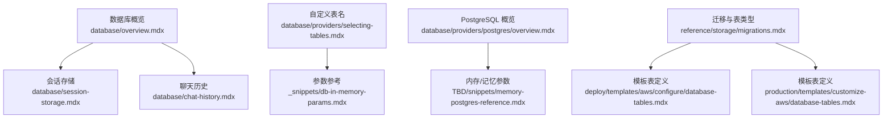
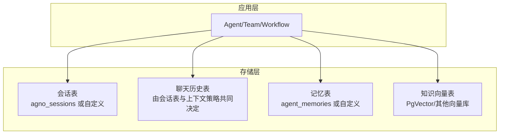
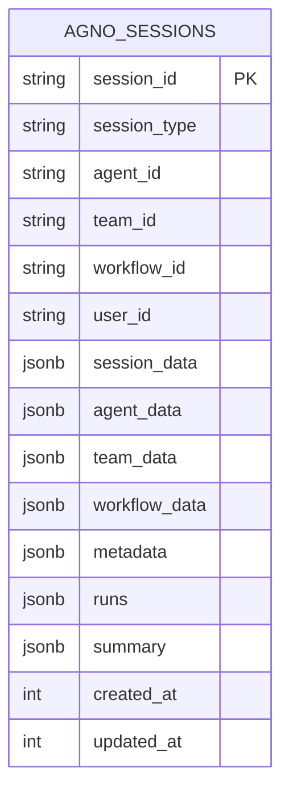
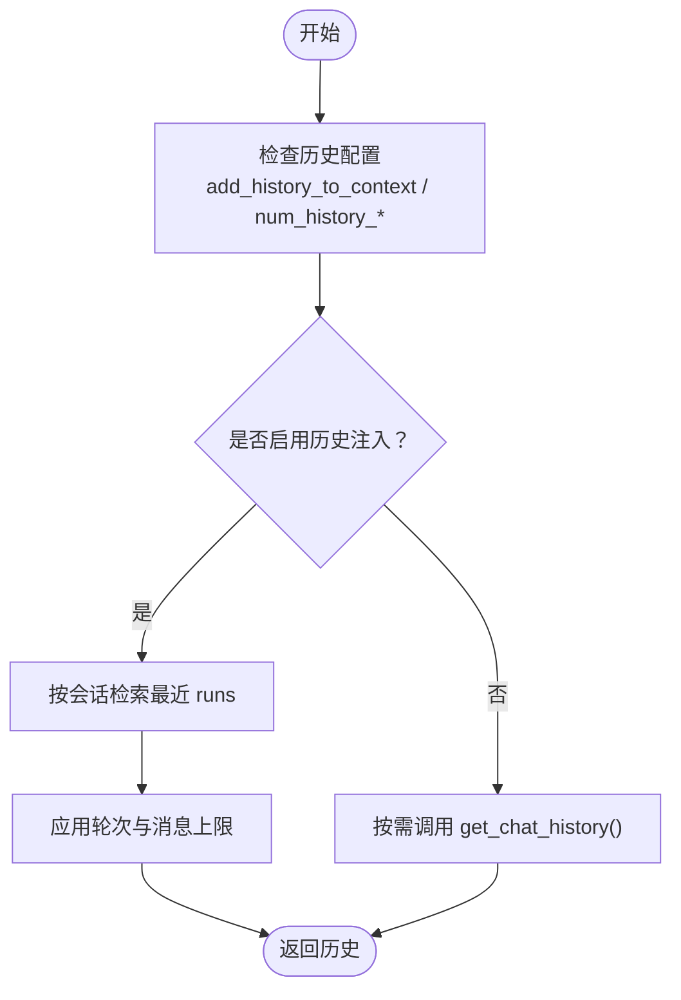
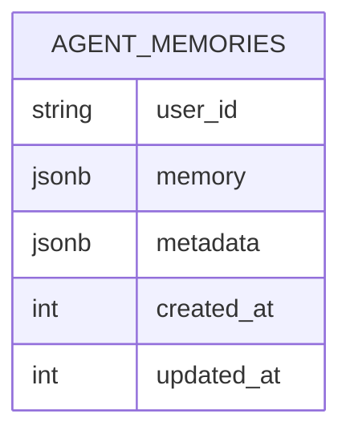
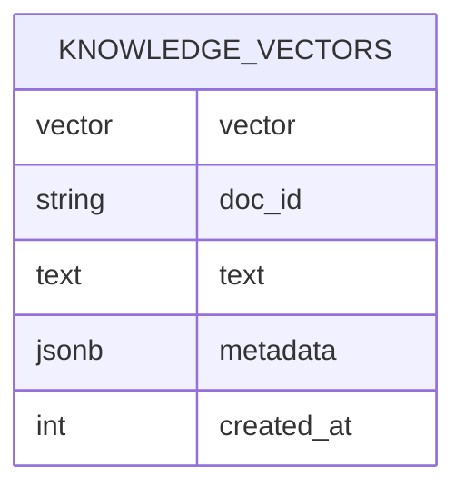
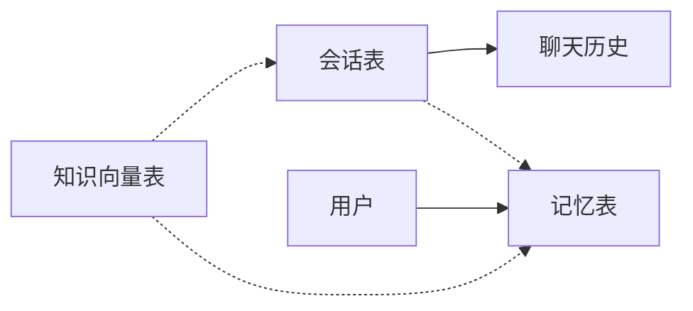

# 表格选择

<cite>
**本文引用的文件**
- [selecting-tables.mdx](file://database/providers/selecting-tables.mdx)
- [session-storage.mdx](file://database/session-storage.mdx)
- [chat-history.mdx](file://database/chat-history.mdx)
- [database-overview.mdx](file://database/overview.mdx)
- [postgres-overview.mdx](file://database/providers/postgres/overview.mdx)
- [db-in-memory-params.mdx](file://_snippets/db-in-memory-params.mdx)
- [memory-postgres-reference.mdx](file://TBD/snippets/memory-postgres-reference.mdx)
- [migrations.mdx](file://reference/storage/migrations.mdx)
- [database-tables.mdx（AWS 模板）](file://deploy/templates/aws/configure/database-tables.mdx)
- [database-tables.mdx（生产模板）](file://production/templates/customize-aws/database-tables.mdx)
</cite>

## 目录
1. [简介](#简介)
2. [项目结构](#项目结构)
3. [核心组件](#核心组件)
4. [架构总览](#架构总览)
5. [详细组件分析](#详细组件分析)
6. [依赖分析](#依赖分析)
7. [性能考量](#性能考量)
8. [故障排查指南](#故障排查指南)
9. [结论](#结论)
10. [附录](#附录)

## 简介
本文件面向“表格选择”主题，聚焦于如何基于使用场景与数据需求，选择合适的表结构与存储策略。内容覆盖会话表、聊天历史表、记忆表、知识向量表等的设计原则、字段定义、表间关系与约束、索引策略与查询优化，并给出小规模测试、中等规模应用与大规模生产三类环境下的表结构建议，以及在不同数据访问模式下的权衡取舍与实践指引。

## 项目结构
围绕“表格选择”的相关资料主要分布在以下位置：
- 数据库与会话：database/overview.mdx、database/session-storage.mdx、database/chat-history.mdx
- 自定义表名与参数：database/providers/selecting-tables.mdx、_snippets/db-in-memory-params.mdx
- PostgreSQL 使用与参数：database/providers/postgres/overview.mdx、TBD/snippets/memory-postgres-reference.mdx
- 迁移与表类型：reference/storage/migrations.mdx
- 模板化数据库表定义：deploy/templates/aws/configure/database-tables.mdx、production/templates/customize-aws/database-tables.mdx

**图表来源**
- [database-overview.mdx:1-130](file://database/overview.mdx#L1-L130)
- [session-storage.mdx:1-119](file://database/session-storage.mdx#L1-L119)
- [chat-history.mdx:1-159](file://database/chat-history.mdx#L1-L159)
- [selecting-tables.mdx:1-37](file://database/providers/selecting-tables.mdx#L1-L37)
- [db-in-memory-params.mdx:1-8](file://_snippets/db-in-memory-params.mdx#L1-L8)
- [postgres-overview.mdx:1-42](file://database/providers/postgres/overview.mdx#L1-L42)
- [memory-postgres-reference.mdx:1-8](file://TBD/snippets/memory-postgres-reference.mdx#L1-L8)
- [migrations.mdx:145-170](file://reference/storage/migrations.mdx#L145-L170)
- [database-tables.mdx（AWS 模板）:1-45](file://deploy/templates/aws/configure/database-tables.mdx#L1-L45)
- [database-tables.mdx（生产模板）:1-45](file://production/templates/customize-aws/database-tables.mdx#L1-L45)

**章节来源**
- [database-overview.mdx:1-130](file://database/overview.mdx#L1-L130)
- [selecting-tables.mdx:1-37](file://database/providers/selecting-tables.mdx#L1-L37)

## 核心组件
- 会话表（Session Table）
  - 默认表名：agno_sessions；可通过 session_table 自定义
  - 字段要点：会话标识、会话类型（agent/team/workflow）、用户标识、会话数据、运行记录、摘要、时间戳等
  - 作用：持久化会话与运行，支持团队与工作流
- 聊天历史表（Chat History）
  - 通过配置启用上下文包含、历史轮数与消息上限、跨会话检索等
  - 作用：控制上下文大小与检索范围，避免上下文窗口溢出
- 记忆表（Memory Table）
  - 可通过 memory_table 自定义表名
  - 支持按用户维度存储记忆，便于多会话、多用户的上下文增强
- 知识向量表（Knowledge Vector Table）
  - 通过向量数据库（如 PgVector）存储嵌入向量与元数据
  - 作用：支持高效相似性检索与 RAG 场景

**章节来源**
- [session-storage.mdx:9-51](file://database/session-storage.mdx#L9-L51)
- [chat-history.mdx:9-94](file://database/chat-history.mdx#L9-L94)
- [selecting-tables.mdx:8-37](file://database/providers/selecting-tables.mdx#L8-L37)
- [db-in-memory-params.mdx:1-8](file://_snippets/db-in-memory-params.mdx#L1-L8)

## 架构总览
下图展示“表格选择”在系统中的位置与交互关系：会话表承载对话生命周期，聊天历史表控制上下文注入策略，记忆表与知识向量表分别服务于用户级记忆与向量检索。

**图表来源**
- [session-storage.mdx:9-51](file://database/session-storage.mdx#L9-L51)
- [chat-history.mdx:9-94](file://database/chat-history.mdx#L9-L94)
- [selecting-tables.mdx:8-37](file://database/providers/selecting-tables.mdx#L8-L37)

## 详细组件分析

### 会话表（Session Table）
- 设计原则
  - 唯一标识：session_id
  - 类型区分：agent_id、team_id、workflow_id 用于区分会话类型
  - 用户绑定：user_id 将会话与用户关联
  - 数据聚合：session_data、agent_data、team_data、workflow_data 存储状态与配置
  - 运行记录：runs 列表保存每次运行的消息与响应
  - 摘要与元数据：summary、metadata 支持后续压缩与扩展
  - 时间戳：created_at、updated_at 支持审计与排序
- 字段定义（摘自会话表）
  - 字段清单与类型见会话表字段定义
- 外键与约束
  - 默认不强制外键约束；若需强一致性可结合业务逻辑在应用层校验
- 索引策略
  - 建议对 session_id、user_id、agent_id/team_id/workflow_id、created_at/updated_at 建立索引
- 查询优化
  - 按用户或会话检索时优先使用 session_id 与 user_id
  - 对 runs 列的处理建议采用分页或摘要化策略，避免大字段频繁读取

**图表来源**
- [session-storage.mdx:34-51](file://database/session-storage.mdx#L34-L51)

**章节来源**
- [session-storage.mdx:9-51](file://database/session-storage.mdx#L9-L51)

### 聊天历史表（Chat History）
- 设计原则
  - 通过 add_history_to_context 控制是否自动注入历史
  - 通过 num_history_runs、num_history_messages 控制上下文规模
  - 通过 search_session_history 与 num_history_sessions 实现跨会话检索
- 字段与关系
  - 历史来源于会话表的 runs 字段；查询时按会话与轮次过滤
- 索引策略
  - 建议对 session_id、created_at 建立复合索引以加速历史检索
- 查询优化
  - 限制历史轮次与消息总数，必要时结合会话摘要减少上下文体积

**图表来源**
- [chat-history.mdx:9-94](file://database/chat-history.mdx#L9-L94)

**章节来源**
- [chat-history.mdx:9-94](file://database/chat-history.mdx#L9-L94)

### 记忆表（Memory Table）
- 设计原则
  - 面向用户级记忆，支持多会话、多用户上下文增强
  - 可通过 memory_table 自定义表名
- 字段建议
  - user_id、memory（文本或结构化记忆）、metadata、created_at、updated_at
- 索引策略
  - 建议对 user_id、created_at 建立索引
- 查询优化
  - 结合时间窗口与关键词过滤，避免全表扫描

**图表来源**
- [selecting-tables.mdx:20-22](file://database/providers/selecting-tables.mdx#L20-L22)
- [db-in-memory-params.mdx:4-8](file://_snippets/db-in-memory-params.mdx#L4-L8)

**章节来源**
- [selecting-tables.mdx:8-37](file://database/providers/selecting-tables.mdx#L8-L37)
- [db-in-memory-params.mdx:1-8](file://_snippets/db-in-memory-params.mdx#L1-L8)

### 知识向量表（Knowledge Vector Table）
- 设计原则
  - 向量维度与嵌入模型一致；存储向量与元数据（如 doc_id、text、chunk_id）
  - 支持相似度检索与过滤
- 字段建议
  - vector（向量列）、doc_id、text、metadata、created_at
- 索引策略
  - 使用向量库提供的索引（如 ivfflat、hnsw），并建立元数据索引
- 查询优化
  - 控制查询 top_k 与过滤条件，避免超大候选集

**图表来源**
- [postgres-overview.mdx:1-42](file://database/providers/postgres/overview.mdx#L1-L42)
- [memory-postgres-reference.mdx:1-8](file://TBD/snippets/memory-postgres-reference.mdx#L1-L8)

**章节来源**
- [postgres-overview.mdx:1-42](file://database/providers/postgres/overview.mdx#L1-L42)
- [memory-postgres-reference.mdx:1-8](file://TBD/snippets/memory-postgres-reference.mdx#L1-L8)

## 依赖分析
- 组件耦合
  - 会话表与聊天历史表存在天然依赖：历史来源于 runs 字段
  - 记忆表与会话表解耦，但可按 user_id 关联
  - 知识向量表独立于会话与记忆，通过检索结果增强上下文
- 外部依赖
  - PostgreSQL、SQLite、MySQL 等关系型数据库作为会话与记忆存储
  - 向量数据库（如 PgVector）作为知识向量存储
- 迁移与版本
  - 支持 memory、session、metrics、eval、knowledge、culture 等表类型的迁移

**图表来源**
- [migrations.mdx:145-170](file://reference/storage/migrations.mdx#L145-L170)

**章节来源**
- [migrations.mdx:145-170](file://reference/storage/migrations.mdx#L145-L170)

## 性能考量
- 读写比例
  - 会话与记忆偏向读多写少；聊天历史注入频繁但体量可控
  - 知识向量检索高并发，需优化索引与过滤
- 查询复杂度
  - 会话检索以主键为主；历史查询需复合索引
  - 向量检索依赖向量库索引与过滤器
- 存储成本
  - 会话与记忆可按周期归档；历史可摘要化
  - 向量表需评估维度与索引开销

[本节为通用指导，无需具体文件分析]

## 故障排查指南
- 异步/同步引擎不匹配
  - 同步数据库类与异步引擎组合会导致异常；请使用对应异步引擎
- 迁移失败
  - 确认迁移目标数据库类型与表类型（memory/session/metrics/eval/knowledge/culture）

**章节来源**
- [database-overview.mdx:122-130](file://database/overview.mdx#L122-L130)
- [migrations.mdx:145-170](file://reference/storage/migrations.mdx#L145-L170)

## 结论
- 表格选择应围绕“数据生命周期、访问模式与成本”进行权衡
- 会话表优先保证唯一标识与时间序列完整性；聊天历史表通过参数控制上下文规模
- 记忆表与知识向量表分别满足用户级记忆与向量检索需求
- 在不同规模环境中，应差异化地设置索引、摘要与归档策略，确保性能与成本平衡

[本节为总结，无需具体文件分析]

## 附录

### 不同数据量级别的表结构建议
- 小规模测试环境
  - 数据库：SQLite（开发友好）
  - 表：默认表名即可；适度开启历史注入，限制历史轮次
  - 索引：最小化索引，仅保留必要字段索引
- 中等规模应用
  - 数据库：PostgreSQL（生产可用）
  - 表：自定义表名（session_table/memory_table 等）；引入会话摘要
  - 索引：为 session_id、user_id、时间戳建立索引
- 大规模生产环境
  - 数据库：PostgreSQL + 向量数据库（如 PgVector）
  - 表：拆分会话、记忆、指标、评估、知识等专用表；启用归档与冷热分层
  - 索引：向量库索引 + 元数据索引；定期维护与统计信息更新

**章节来源**
- [database-overview.mdx:105-121](file://database/overview.mdx#L105-L121)
- [postgres-overview.mdx:1-42](file://database/providers/postgres/overview.mdx#L1-L42)
- [selecting-tables.mdx:8-37](file://database/providers/selecting-tables.mdx#L8-L37)

### 表结构示例与配置路径
- 自定义表名示例（会话/记忆/指标）
  - 示例路径：[自定义表名示例:12-37](file://database/providers/selecting-tables.mdx#L12-L37)
- 参数参考（会话/记忆/指标/评估/知识）
  - 参数路径：[参数参考:1-8](file://_snippets/db-in-memory-params.mdx#L1-L8)
- PostgreSQL 内存/记忆参数
  - 参数路径：[PostgreSQL 参数:1-8](file://TBD/snippets/memory-postgres-reference.mdx#L1-L8)
- 模板化表定义（SQLAlchemy/Alembic）
  - AWS 模板：[模板表定义:14-43](file://deploy/templates/aws/configure/database-tables.mdx#L14-L43)
  - 生产模板：[模板表定义:14-43](file://production/templates/customize-aws/database-tables.mdx#L14-L43)

**章节来源**
- [selecting-tables.mdx:8-37](file://database/providers/selecting-tables.mdx#L8-L37)
- [db-in-memory-params.mdx:1-8](file://_snippets/db-in-memory-params.mdx#L1-L8)
- [memory-postgres-reference.mdx:1-8](file://TBD/snippets/memory-postgres-reference.mdx#L1-L8)
- [database-tables.mdx（AWS 模板）:14-43](file://deploy/templates/aws/configure/database-tables.mdx#L14-L43)
- [database-tables.mdx（生产模板）:14-43](file://production/templates/customize-aws/database-tables.mdx#L14-L43)