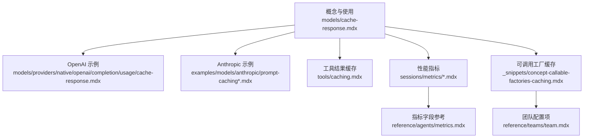
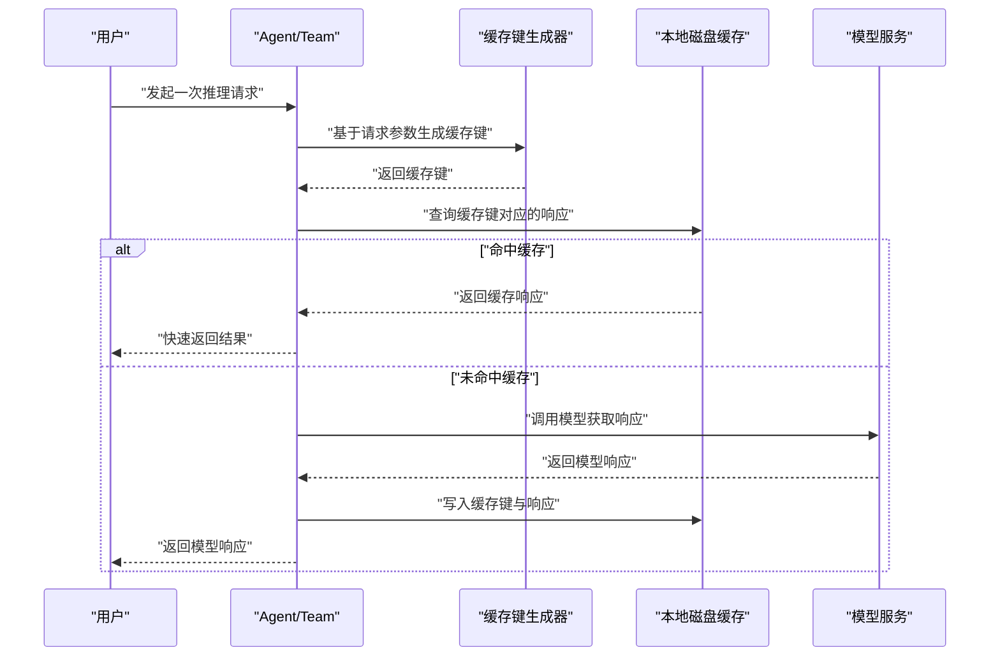
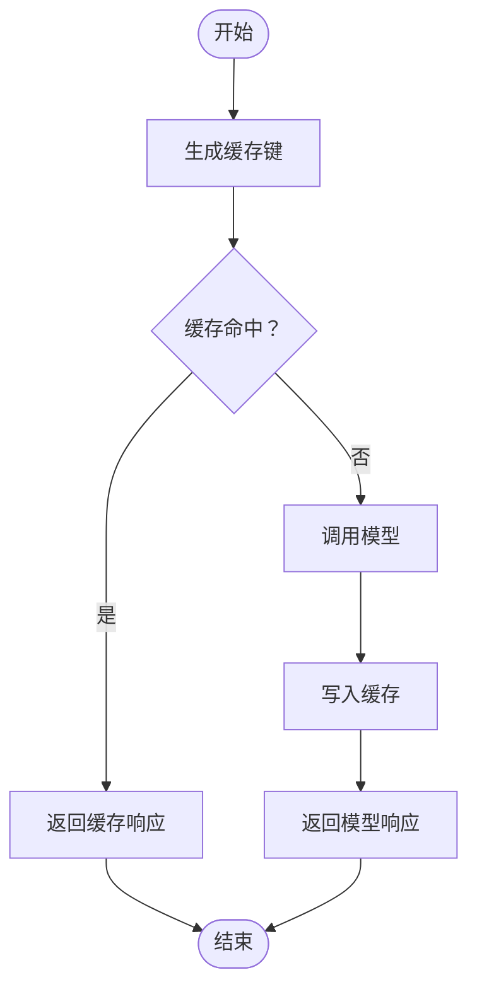
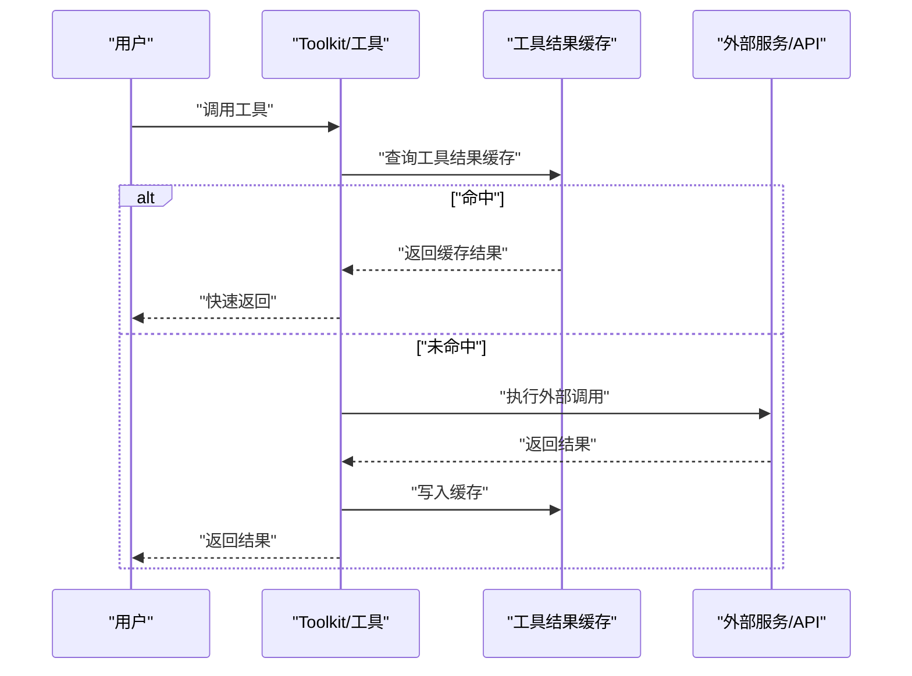
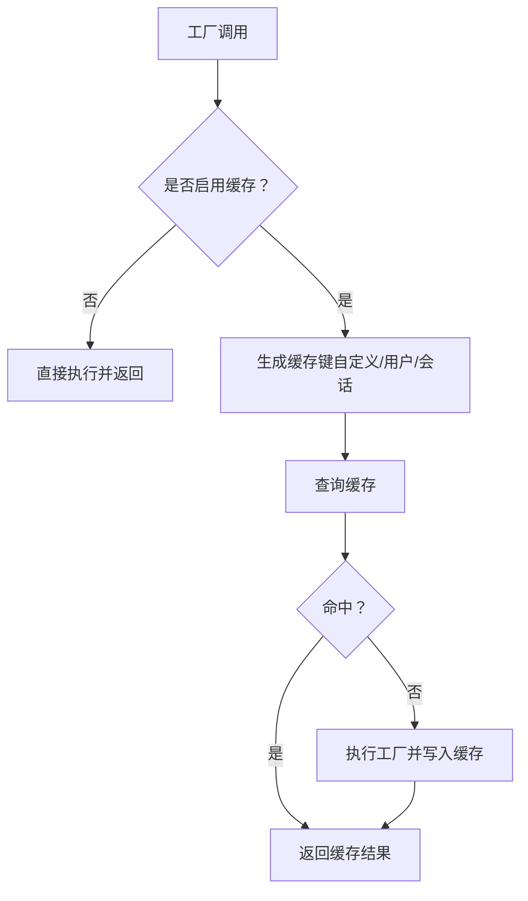
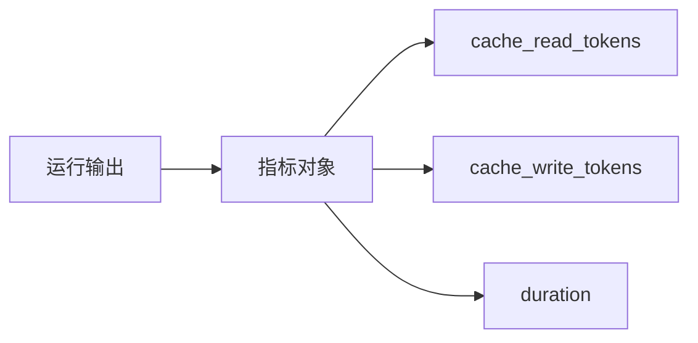
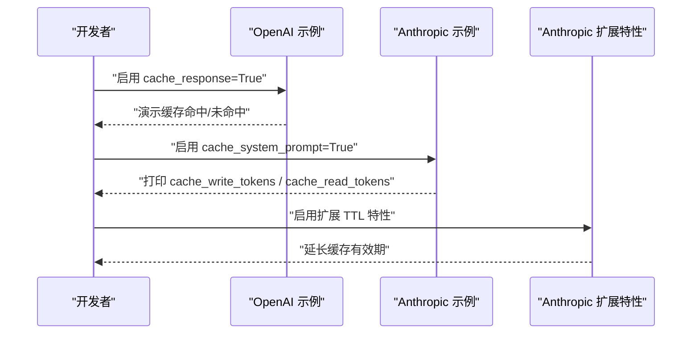
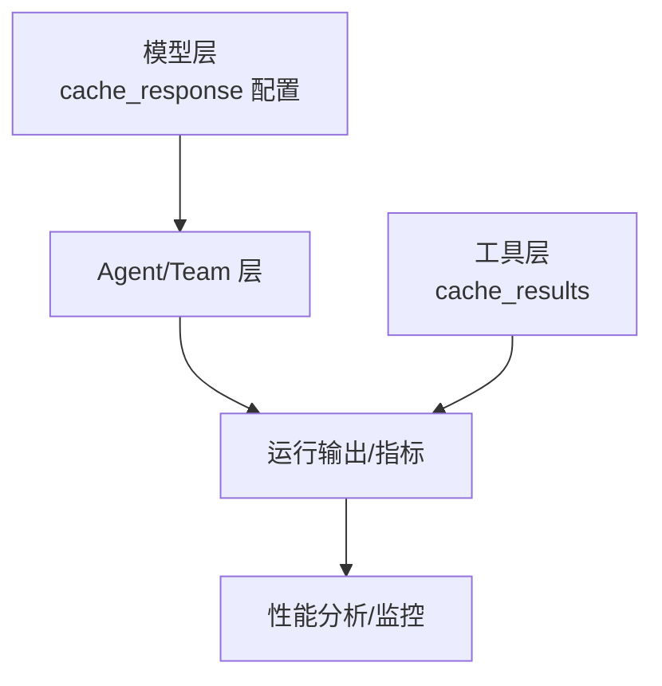

# 响应缓存机制

<cite>
**本文引用的文件**
- [models/cache-response.mdx](file://models/cache-response.mdx)
- [models/providers/native/openai/completion/usage/cache-response.mdx](file://models/providers/native/openai/completion/usage/cache-response.mdx)
- [tools/caching.mdx](file://tools/caching.mdx)
- [examples/models/anthropic/prompt-caching.mdx](file://examples/models/anthropic/prompt-caching.mdx)
- [examples/models/anthropic/prompt-caching-extended.mdx](file://examples/models/anthropic/prompt-caching-extended.mdx)
- [sessions/metrics/agent.mdx](file://sessions/metrics/agent.mdx)
- [reference/agents/metrics.mdx](file://reference/agents/metrics.mdx)
- [sessions/metrics/team.mdx](file://sessions/metrics/team.mdx)
- [_snippets/concept-callable-factories-caching.mdx](file://_snippets/concept-callable-factories-caching.mdx)
- [reference/teams/team.mdx](file://reference/teams/team.mdx)
</cite>

## 目录
1. [简介](#简介)
2. [项目结构](#项目结构)
3. [核心组件](#核心组件)
4. [架构总览](#架构总览)
5. [详细组件分析](#详细组件分析)
6. [依赖关系分析](#依赖关系分析)
7. [性能考量](#性能考量)
8. [故障排查指南](#故障排查指南)
9. [结论](#结论)
10. [附录](#附录)

## 简介
本技术文档围绕“响应缓存机制”展开，系统阐述模型响应缓存的重要性与性能优势（减少 API 调用次数、降低延迟）、缓存策略设计原理（缓存键生成、过期时间与失效机制）、配置选项（缓存 TTL、存储目录等）、一致性保障（参数变化与内容更新处理）、性能监控与调试（命中率与性能分析）、实际使用示例（不同场景下的启用与配置）、最佳实践（缓存粒度与内存管理）以及分布式环境中的挑战与解决方案。

## 项目结构
本仓库中与“响应缓存”直接相关的内容主要分布在以下位置：
- 概念与使用说明：models/cache-response.mdx
- 具体模型示例（OpenAI、Anthropic）：models/providers/native/*/usage/cache-response.mdx 与 examples/models/anthropic/*
- 工具结果缓存：tools/caching.mdx
- 性能指标与监控：sessions/metrics/* 与 reference/agents/metrics.mdx
- 可调用工厂缓存与清理：_snippets/concept-callable-factories-caching.mdx 与 reference/teams/team.mdx

**图表来源**
- [models/cache-response.mdx:1-183](file://models/cache-response.mdx#L1-L183)
- [models/providers/native/openai/completion/usage/cache-response.mdx:1-52](file://models/providers/native/openai/completion/usage/cache-response.mdx#L1-L52)
- [examples/models/anthropic/prompt-caching.mdx:1-78](file://examples/models/anthropic/prompt-caching.mdx#L1-L78)
- [tools/caching.mdx:1-53](file://tools/caching.mdx#L1-L53)
- [sessions/metrics/agent.mdx:58-78](file://sessions/metrics/agent.mdx#L58-L78)
- [reference/agents/metrics.mdx:1-24](file://reference/agents/metrics.mdx#L1-L24)
- [_snippets/concept-callable-factories-caching.mdx:1-16](file://_snippets/concept-callable-factories-caching.mdx#L1-L16)
- [reference/teams/team.mdx:113-116](file://reference/teams/team.mdx#L113-L116)

**章节来源**
- [models/cache-response.mdx:1-183](file://models/cache-response.mdx#L1-L183)
- [models/providers/native/openai/completion/usage/cache-response.mdx:1-52](file://models/providers/native/openai/completion/usage/cache-response.mdx#L1-L52)
- [examples/models/anthropic/prompt-caching.mdx:1-78](file://examples/models/anthropic/prompt-caching.mdx#L1-L78)
- [tools/caching.mdx:1-53](file://tools/caching.mdx#L1-L53)
- [sessions/metrics/agent.mdx:58-78](file://sessions/metrics/agent.mdx#L58-L78)
- [reference/agents/metrics.mdx:1-24](file://reference/agents/metrics.mdx#L1-L24)
- [_snippets/concept-callable-factories-caching.mdx:1-16](file://_snippets/concept-callable-factories-caching.mdx#L1-L16)
- [reference/teams/team.mdx:113-116](file://reference/teams/team.mdx#L113-L116)

## 核心组件
- 响应缓存开关与配置
  - 在模型初始化时通过布尔开关开启缓存，并支持 TTL 控制与自定义缓存目录。
  - 支持在 Agent 与 Team 中按成员或领导模型分别启用缓存。
- 缓存键生成
  - 基于请求参数（如消息、响应格式、工具等）生成唯一键，确保相同输入命中同一缓存。
- 过期与失效
  - 支持 TTL 自动过期；默认持久化到磁盘，跨会话与进程重启保留。
- 指标与监控
  - 提供 cache_read_tokens 与 cache_write_tokens 等指标，便于统计命中与写入情况。
- 工具结果缓存
  - 对工具函数调用结果进行磁盘缓存，避免重复计算与外部 API 调用。
- 可调用工厂缓存
  - 支持对可调用工厂（工具、知识、成员）结果按自定义键或用户/会话键缓存，并提供清理接口。

**章节来源**
- [models/cache-response.mdx:49-101](file://models/cache-response.mdx#L49-L101)
- [models/cache-response.mdx:104-152](file://models/cache-response.mdx#L104-L152)
- [tools/caching.mdx:13-52](file://tools/caching.mdx#L13-L52)
- [reference/agents/metrics.mdx:16-17](file://reference/agents/metrics.mdx#L16-L17)
- [_snippets/concept-callable-factories-caching.mdx:1-16](file://_snippets/concept-callable-factories-caching.mdx#L1-L16)

## 架构总览
响应缓存的整体流程如下：当启用缓存后，系统在发起模型调用前先根据请求参数生成缓存键并查询缓存；若命中则直接返回缓存结果；未命中则调用模型并将响应写入缓存；缓存具备 TTL 过期能力；同时提供指标用于观测命中与写入情况。

**图表来源**
- [models/cache-response.mdx:35-45](file://models/cache-response.mdx#L35-L45)
- [models/providers/native/openai/completion/usage/cache-response.mdx:12-41](file://models/providers/native/openai/completion/usage/cache-response.mdx#L12-L41)

## 详细组件分析

### 组件一：响应缓存策略与配置
- 缓存键生成
  - 基于请求参数（消息、响应格式、工具等）生成唯一键，确保语义一致的输入命中同一缓存。
- TTL 与存储
  - 支持 cache_ttl 控制过期时间；默认持久化到磁盘，路径可在配置中指定。
- 使用范围
  - 支持在 Agent 与 Team 的成员与领导模型上分别启用缓存，形成多层缓存。
- 流式输出
  - 支持流式响应缓存；命中时整体一次性返回。

**图表来源**
- [models/cache-response.mdx:35-45](file://models/cache-response.mdx#L35-L45)
- [models/cache-response.mdx:69-101](file://models/cache-response.mdx#L69-L101)
- [models/cache-response.mdx:104-152](file://models/cache-response.mdx#L104-L152)
- [models/cache-response.mdx:154-171](file://models/cache-response.mdx#L154-L171)

**章节来源**
- [models/cache-response.mdx:35-101](file://models/cache-response.mdx#L35-L101)
- [models/cache-response.mdx:104-171](file://models/cache-response.mdx#L104-L171)

### 组件二：工具结果缓存
- 目的：避免重复执行耗时或外部 API 调用，提升开发与测试效率。
- 启用方式：在 Toolkit 构造函数或 @tool 装饰器中设置 cache_results=True。
- 适用范围：所有 Agno Toolkits。

**图表来源**
- [tools/caching.mdx:13-52](file://tools/caching.mdx#L13-L52)

**章节来源**
- [tools/caching.mdx:1-53](file://tools/caching.mdx#L1-L53)

### 组件三：可调用工厂缓存与清理
- 可调用工厂缓存：对工具、知识、成员等工厂结果进行缓存，支持自定义键优先、其次 user_id、最后 session_id。
- 清理方式：提供 clear_callable_cache(kind=...) 或异步版本以强制重新解析。

**图表来源**
- [_snippets/concept-callable-factories-caching.mdx:1-16](file://_snippets/concept-callable-factories-caching.mdx#L1-L16)
- [reference/teams/team.mdx:113-116](file://reference/teams/team.mdx#L113-L116)

**章节来源**
- [_snippets/concept-callable-factories-caching.mdx:1-16](file://_snippets/concept-callable-factories-caching.mdx#L1-L16)
- [reference/teams/team.mdx:113-116](file://reference/teams/team.mdx#L113-L116)

### 组件四：性能指标与监控
- 关键指标
  - cache_read_tokens：从缓存读取的 token 数量
  - cache_write_tokens：写入缓存的 token 数量
  - duration：单次运行总耗时
- 使用建议
  - 通过对比 cache_read_tokens 与 cache_write_tokens，评估缓存命中收益与写入成本。
  - 结合 duration 分析缓存带来的端到端延迟改善。

**图表来源**
- [sessions/metrics/agent.mdx:58-78](file://sessions/metrics/agent.mdx#L58-L78)
- [reference/agents/metrics.mdx:16-21](file://reference/agents/metrics.mdx#L16-L21)
- [sessions/metrics/team.mdx:88-101](file://sessions/metrics/team.mdx#L88-L101)

**章节来源**
- [sessions/metrics/agent.mdx:58-78](file://sessions/metrics/agent.mdx#L58-L78)
- [reference/agents/metrics.mdx:1-24](file://reference/agents/metrics.mdx#L1-L24)
- [sessions/metrics/team.mdx:88-101](file://sessions/metrics/team.mdx#L88-L101)

### 组件五：示例与用法
- OpenAI 响应缓存示例
  - 展示首次调用命中 API 并缓存，后续相同请求命中缓存的完整流程。
- Anthropic 提示缓存示例
  - 展示系统提示缓存写入与读取的 token 计数差异，体现提示级缓存的价值。
- 延伸提示缓存（扩展 TTL）
  - 通过模型特性扩展缓存有效期，进一步降低重复写入成本。

**图表来源**
- [models/providers/native/openai/completion/usage/cache-response.mdx:12-41](file://models/providers/native/openai/completion/usage/cache-response.mdx#L12-L41)
- [examples/models/anthropic/prompt-caching.mdx:35-56](file://examples/models/anthropic/prompt-caching.mdx#L35-L56)
- [examples/models/anthropic/prompt-caching-extended.mdx:32-57](file://examples/models/anthropic/prompt-caching-extended.mdx#L32-L57)

**章节来源**
- [models/providers/native/openai/completion/usage/cache-response.mdx:1-52](file://models/providers/native/openai/completion/usage/cache-response.mdx#L1-L52)
- [examples/models/anthropic/prompt-caching.mdx:1-78](file://examples/models/anthropic/prompt-caching.mdx#L1-L78)
- [examples/models/anthropic/prompt-caching-extended.mdx:32-78](file://examples/models/anthropic/prompt-caching-extended.mdx#L32-L78)

## 依赖关系分析
- 模块耦合
  - 响应缓存与模型层强耦合（在模型初始化时配置），与 Agent/Team 层弱耦合（通过模型实例传递）。
  - 工具结果缓存与工具层解耦，通过装饰器或构造函数启用。
  - 指标模块与运行输出解耦，通过统一的指标对象暴露。
- 外部依赖
  - 缓存持久化依赖磁盘存储；指标采集依赖运行时统计。
- 潜在循环依赖
  - 当前文档未发现循环依赖迹象；各组件职责清晰。

**图表来源**
- [models/cache-response.mdx:49-101](file://models/cache-response.mdx#L49-L101)
- [tools/caching.mdx:13-52](file://tools/caching.mdx#L13-L52)
- [reference/agents/metrics.mdx:16-21](file://reference/agents/metrics.mdx#L16-L21)

**章节来源**
- [models/cache-response.mdx:49-101](file://models/cache-response.mdx#L49-L101)
- [tools/caching.mdx:13-52](file://tools/caching.mdx#L13-L52)
- [reference/agents/metrics.mdx:16-21](file://reference/agents/metrics.mdx#L16-L21)

## 性能考量
- 减少 API 调用与延迟
  - 相同输入命中缓存可显著降低端到端延迟与外部调用次数。
- 成本优化
  - 通过减少重复调用与写入，降低 token 与带宽消耗。
- 写入与读取权衡
  - 首次写入需要网络与磁盘 IO，后续读取为本地 IO，适合高频重复查询场景。
- TTL 设计
  - 合理设置 TTL 可平衡新鲜度与命中率；对动态内容建议更短 TTL 或禁用缓存。

[本节为通用指导，无需具体文件分析]

## 故障排查指南
- 缓存未生效
  - 检查是否正确设置 cache_response 或 cache_results 开关。
  - 确认请求参数完全一致（含工具、格式等），否则键不同导致未命中。
- 缓存命中率低
  - 观察 cache_read_tokens 与 cache_write_tokens 比例，确认是否存在频繁变更的输入。
  - 调整 TTL 或改用更稳定的输入。
- 缓存清理
  - 使用可调用工厂缓存清理接口，强制重新解析以验证最新结果。
- 指标缺失
  - 确认运行输出包含指标对象；部分模型/工具可能不提供特定指标。

**章节来源**
- [_snippets/concept-callable-factories-caching.mdx:10-16](file://_snippets/concept-callable-factories-caching.mdx#L10-L16)
- [reference/agents/metrics.mdx:16-21](file://reference/agents/metrics.mdx#L16-L21)

## 结论
响应缓存通过“缓存键生成—缓存查找—命中返回/未命中写入”的闭环，在开发与测试阶段显著降低 API 调用与延迟，带来可观的成本与效率收益。结合 TTL、存储目录、指标监控与可调用工厂缓存清理机制，可实现灵活可控的缓存策略。对于生产环境的动态内容，需谨慎评估新鲜度与缓存策略。

[本节为总结，无需具体文件分析]

## 附录

### A. 缓存配置选项清单
- cache_response：启用/禁用响应缓存（模型层）
- cache_ttl：缓存过期时间（秒），None 表示永不过期
- cache_dir：自定义缓存目录
- cache_results：启用/禁用工具结果缓存（工具层）
- cache_system_prompt：启用/禁用系统提示缓存（Anthropic）
- extended_cache_time：扩展缓存有效期（Anthropic）

**章节来源**
- [models/cache-response.mdx:69-101](file://models/cache-response.mdx#L69-L101)
- [examples/models/anthropic/prompt-caching-extended.mdx:32-42](file://examples/models/anthropic/prompt-caching-extended.mdx#L32-L42)

### B. 实际使用示例路径
- OpenAI 响应缓存示例：[models/providers/native/openai/completion/usage/cache-response.mdx:12-41](file://models/providers/native/openai/completion/usage/cache-response.mdx#L12-L41)
- Anthropic 提示缓存示例：[examples/models/anthropic/prompt-caching.mdx:35-56](file://examples/models/anthropic/prompt-caching.mdx#L35-L56)
- 延伸提示缓存（扩展 TTL）：[examples/models/anthropic/prompt-caching-extended.mdx:32-57](file://examples/models/anthropic/prompt-caching-extended.mdx#L32-L57)

**章节来源**
- [models/providers/native/openai/completion/usage/cache-response.mdx:12-41](file://models/providers/native/openai/completion/usage/cache-response.mdx#L12-L41)
- [examples/models/anthropic/prompt-caching.mdx:35-56](file://examples/models/anthropic/prompt-caching.mdx#L35-L56)
- [examples/models/anthropic/prompt-caching-extended.mdx:32-57](file://examples/models/anthropic/prompt-caching-extended.mdx#L32-L57)

### C. 缓存一致性与分布式挑战
- 一致性保障
  - 参数变化（如消息、工具、格式）会改变缓存键，从而触发新的缓存写入。
  - 对动态内容建议禁用缓存或缩短 TTL。
- 分布式环境
  - 本地磁盘缓存不具备跨节点共享能力；建议在分布式场景采用共享缓存（如 Redis）或在边缘节点统一缓存策略。
  - 可结合可调用工厂缓存与清理机制，确保关键变更后强制刷新。

**章节来源**
- [models/cache-response.mdx:35-45](file://models/cache-response.mdx#L35-L45)
- [_snippets/concept-callable-factories-caching.mdx:1-16](file://_snippets/concept-callable-factories-caching.mdx#L1-L16)