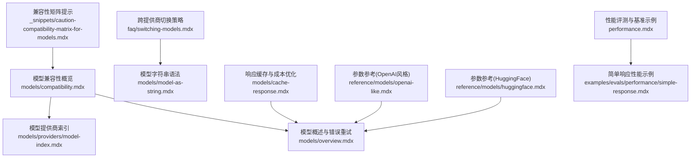
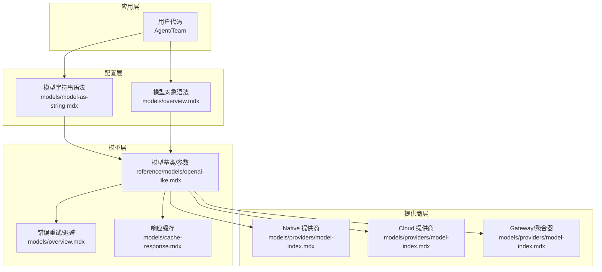
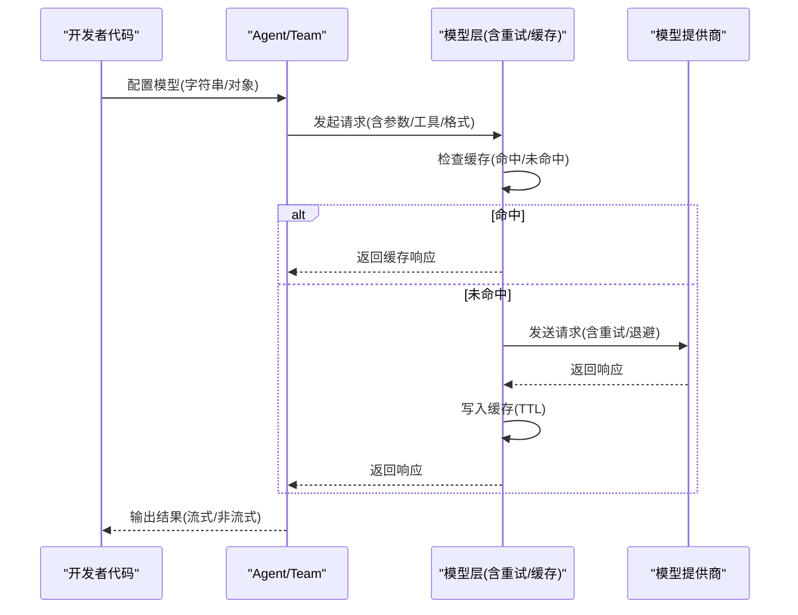
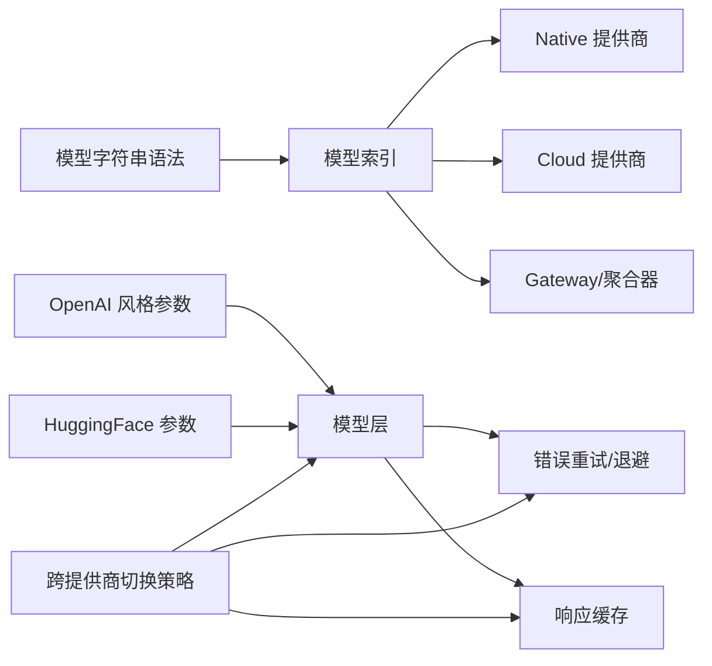

# 模型兼容性

<cite>
**本文引用的文件**
- [models/compatibility.mdx](file://models/compatibility.mdx)
- [models/overview.mdx](file://models/overview.mdx)
- [models/providers/model-index.mdx](file://models/providers/model-index.mdx)
- [faq/switching-models.mdx](file://faq/switching-models.mdx)
- [models/model-as-string.mdx](file://models/model-as-string.mdx)
- [models/cache-response.mdx](file://models/cache-response.mdx)
- [reference/models/openai-like.mdx](file://reference/models/openai-like.mdx)
- [reference/models/huggingface.mdx](file://reference/models/huggingface.mdx)
- [_snippets/caution-compatibility-matrix-for-models.mdx](file://_snippets/caution-compatibility-matrix-for-models.mdx)
- [performance.mdx](file://performance.mdx)
- [examples/evals/performance/simple-response.mdx](file://examples/evals/performance/simple-response.mdx)
</cite>

## 目录
1. [简介](#简介)
2. [项目结构](#项目结构)
3. [核心组件](#核心组件)
4. [架构总览](#架构总览)
5. [详细组件分析](#详细组件分析)
6. [依赖关系分析](#依赖关系分析)
7. [性能考量](#性能考量)
8. [故障排查指南](#故障排查指南)
9. [结论](#结论)
10. [附录](#附录)

## 简介
本技术文档聚焦于模型兼容性，系统梳理不同模型提供商在功能支持、参数差异、输出格式与特殊能力方面的兼容性现状，并提供可操作的迁移策略、版本兼容性建议、跨提供商的通用代码范式、性能与成本对比方法，以及能力抽象与标准化实践。目标是帮助开发者在不修改业务代码的前提下，在多个模型提供商之间平滑切换，同时最大化功能一致性与开发效率。

## 项目结构
围绕“模型兼容性”的知识分布在以下几类文档中：
- 兼容性概览与矩阵：models/compatibility.mdx
- 模型概述与错误重试机制：models/overview.mdx
- 模型提供商索引（按类别分组）：models/providers/model-index.mdx
- 跨提供商切换策略与示例：faq/switching-models.mdx
- 模型字符串语法与多模型类型配置：models/model-as-string.mdx
- 响应缓存与成本优化：models/cache-response.mdx
- 参数参考（以 OpenAI 风格为例）：reference/models/openai-like.mdx
- 具体提供商参数参考（如 HuggingFace）：reference/models/huggingface.mdx
- 兼容性矩阵提示：_snippets/caution-compatibility-matrix-for-models.mdx
- 性能评测与基准示例：performance.mdx、examples/evals/performance/simple-response.mdx

图表来源
- [models/compatibility.mdx](file://models/compatibility.mdx)
- [models/providers/model-index.mdx](file://models/providers/model-index.mdx)
- [models/overview.mdx](file://models/overview.mdx)
- [faq/switching-models.mdx](file://faq/switching-models.mdx)
- [models/model-as-string.mdx](file://models/model-as-string.mdx)
- [models/cache-response.mdx](file://models/cache-response.mdx)
- [reference/models/openai-like.mdx](file://reference/models/openai-like.mdx)
- [reference/models/huggingface.mdx](file://reference/models/huggingface.mdx)
- [_snippets/caution-compatibility-matrix-for-models.mdx](file://_snippets/caution-compatibility-matrix-for-models.mdx)
- [performance.mdx](file://performance.mdx)
- [examples/evals/performance/simple-response.mdx](file://examples/evals/performance/simple-response.mdx)

章节来源
- [models/compatibility.mdx](file://models/compatibility.mdx)
- [models/providers/model-index.mdx](file://models/providers/model-index.mdx)
- [models/overview.mdx](file://models/overview.mdx)
- [faq/switching-models.mdx](file://faq/switching-models.mdx)
- [models/model-as-string.mdx](file://models/model-as-string.mdx)
- [models/cache-response.mdx](file://models/cache-response.mdx)
- [reference/models/openai-like.mdx](file://reference/models/openai-like.mdx)
- [reference/models/huggingface.mdx](file://reference/models/huggingface.mdx)
- [_snippets/caution-compatibility-matrix-for-models.mdx](file://_snippets/caution-compatibility-matrix-for-models.mdx)
- [performance.mdx](file://performance.mdx)
- [examples/evals/performance/simple-response.mdx](file://examples/evals/performance/simple-response.mdx)

## 核心组件
- 兼容性矩阵与多模态支持：涵盖主流提供商的图像输入、音频输入、音频输出、视频输入、文件上传等能力差异。
- 错误重试与退避策略：统一的重试次数、重试间隔与指数退避配置，适用于多种模型类。
- 模型字符串语法：通过“provider:model_id”简化配置，保持与对象语法等价的功能。
- 多模型类型：支持主模型、推理模型、解析模型、输出模型的差异化配置。
- 响应缓存：本地磁盘缓存模型响应，降低重复调用与成本，支持 TTL 与自定义目录。
- 跨提供商切换策略：推荐同提供商内切换，避免消息历史格式差异导致的不可预测行为。

章节来源
- [models/compatibility.mdx](file://models/compatibility.mdx)
- [models/overview.mdx](file://models/overview.mdx)
- [models/model-as-string.mdx](file://models/model-as-string.mdx)
- [models/cache-response.mdx](file://models/cache-response.mdx)
- [faq/switching-models.mdx](file://faq/switching-models.mdx)

## 架构总览
下图展示了“模型兼容性”在系统中的位置与交互关系：从用户配置（字符串或对象）到模型层，再到各提供商实现；同时贯穿错误重试、响应缓存与跨提供商切换策略。

图表来源
- [models/model-as-string.mdx](file://models/model-as-string.mdx)
- [models/overview.mdx](file://models/overview.mdx)
- [reference/models/openai-like.mdx](file://reference/models/openai-like.mdx)
- [models/cache-response.mdx](file://models/cache-response.mdx)
- [models/providers/model-index.mdx](file://models/providers/model-index.mdx)

## 详细组件分析

### 兼容性矩阵与多模态支持
- 支持的通用能力：流式响应、工具调用、结构化输出、异步执行。
- 多模态支持：不同提供商对图像/音频/视频/文件的支持存在差异，需参考矩阵表进行选型。
- 特殊提示：部分提供商在工具调用或结构化输出方面存在限制，需结合框架能力与提供商原生支持综合评估。

章节来源
- [models/compatibility.mdx](file://models/compatibility.mdx)
- [_snippets/caution-compatibility-matrix-for-models.mdx](file://_snippets/caution-compatibility-matrix-for-models.mdx)

### 错误重试与退避策略
- 统一参数：重试次数、重试间隔、指数退避开关。
- 应用范围：可在模型层配置，也可在 Agent/Team 层配置以重试完整运行。
- 适用场景：临时失败、速率限制等网络/配额异常。

章节来源
- [models/overview.mdx](file://models/overview.mdx)

### 模型字符串语法与多模型类型
- 字符串语法：provider:model_id，等价于对象语法，便于快速配置。
- 多模型类型：主模型、推理模型、解析模型、输出模型，满足不同阶段的差异化需求。
- 示例路径：[模型字符串基础用法](file://models/model-as-string.mdx)，[多模型类型示例](file://models/model-as-string.mdx)

章节来源
- [models/model-as-string.mdx](file://models/model-as-string.mdx)

### 响应缓存与成本优化
- 缓存机制：基于请求参数生成唯一键，命中即返回缓存，未命中则调用 API 并写入缓存。
- TTL 与目录：可配置过期时间与缓存目录，默认持久化至磁盘。
- 使用场景：开发测试、批量回归、离线开发、限流保护。
- 示例路径：[响应缓存基本用法](file://models/cache-response.mdx)，[与 Agent/Team 的集成](file://models/cache-response.mdx)

章节来源
- [models/cache-response.mdx](file://models/cache-response.mdx)

### 跨提供商切换策略
- 推荐做法：同提供商内切换（安全），跨提供商切换（高风险）。
- 风险点：消息历史格式差异可能导致不可预测结果。
- 安全切换示例：在同一提供商内更换模型 ID。
- 跨提供商切换示例：在同一会话中从 OpenAI 切换到 Google Gemini，需谨慎验证。

章节来源
- [faq/switching-models.mdx](file://faq/switching-models.mdx)

### 参数抽象与标准化
- OpenAI 风格参数：温度、top_p、停止序列、种子、流式、请求/客户端附加参数、重试等。
- 具体提供商参数：如 HuggingFace 的 max_tokens、temperature、top_p、重复惩罚等。
- 抽象原则：优先使用统一参数名与默认值，必要时通过 request_params/client_params 扩展。

章节来源
- [reference/models/openai-like.mdx](file://reference/models/openai-like.mdx)
- [reference/models/huggingface.mdx](file://reference/models/huggingface.mdx)

### API/服务组件调用流程（序列图）
以下序列图展示“Agent 使用模型并触发提供商调用”的典型流程，体现错误重试与响应缓存的介入时机。

图表来源
- [models/overview.mdx](file://models/overview.mdx)
- [models/cache-response.mdx](file://models/cache-response.mdx)
- [models/model-as-string.mdx](file://models/model-as-string.mdx)

## 依赖关系分析
- 组件耦合与内聚
  - 模型层对提供商实现具有抽象接口，通过统一参数与错误重试/缓存策略提升内聚性。
  - 跨提供商切换主要受消息历史格式与工具调用支持差异影响，属于外部依赖耦合。
- 直接与间接依赖
  - 模型字符串语法直接依赖模型索引与提供商文档。
  - 响应缓存依赖文件系统与 TTL 策略。
  - 错误重试策略独立于具体提供商，但受网络/配额限制影响。
- 循环依赖
  - 文档间无循环引用，结构清晰。
- 外部依赖与集成点
  - 提供商 API 变更可能影响工具调用、结构化输出与多模态能力。
  - OpenAI 风格参数作为统一抽象，减少对具体提供商的绑定。

图表来源
- [models/model-as-string.mdx](file://models/model-as-string.mdx)
- [models/providers/model-index.mdx](file://models/providers/model-index.mdx)
- [reference/models/openai-like.mdx](file://reference/models/openai-like.mdx)
- [reference/models/huggingface.mdx](file://reference/models/huggingface.mdx)
- [models/overview.mdx](file://models/overview.mdx)
- [models/cache-response.mdx](file://models/cache-response.mdx)
- [faq/switching-models.mdx](file://faq/switching-models.mdx)

章节来源
- [models/model-as-string.mdx](file://models/model-as-string.mdx)
- [models/providers/model-index.mdx](file://models/providers/model-index.mdx)
- [reference/models/openai-like.mdx](file://reference/models/openai-like.mdx)
- [reference/models/huggingface.mdx](file://reference/models/huggingface.mdx)
- [models/overview.mdx](file://models/overview.mdx)
- [models/cache-response.mdx](file://models/cache-response.mdx)
- [faq/switching-models.mdx](file://faq/switching-models.mdx)

## 性能考量
- 性能评测
  - 提供了简单响应性能评测示例，可用于对比不同模型在相同负载下的延迟与吞吐。
  - 示例路径：[简单响应性能评测](file://examples/evals/performance/simple-response.mdx)
- 基准与视频演示
  - 文档提供了性能基准与视频演示，便于直观理解不同框架的性能表现。
  - 示例路径：[性能基准与视频](file://performance.mdx)
- 成本效益
  - 响应缓存可显著降低开发与测试阶段的 API 调用成本，但不适用于需要实时数据的生产场景。
  - 示例路径：[响应缓存](file://models/cache-response.mdx)

章节来源
- [examples/evals/performance/simple-response.mdx](file://examples/evals/performance/simple-response.mdx)
- [performance.mdx](file://performance.mdx)
- [models/cache-response.mdx](file://models/cache-response.mdx)

## 故障排查指南
- 常见问题
  - 跨提供商切换导致的消息历史格式不兼容：建议在同提供商内切换，或在切换前清理/转换历史格式。
  - 工具调用与结构化输出在部分提供商受限：需结合兼容性矩阵与框架能力进行降级或适配。
  - 速率限制与临时失败：启用重试与退避策略，合理设置重试次数与间隔。
- 建议步骤
  - 在开发环境先用响应缓存验证逻辑正确性，再逐步放开真实调用。
  - 对关键路径增加日志与指标，定位慢点与失败原因。
  - 对多模态输入，优先选择矩阵中标注支持的提供商，避免格式差异带来的不确定性。

章节来源
- [faq/switching-models.mdx](file://faq/switching-models.mdx)
- [models/compatibility.mdx](file://models/compatibility.mdx)
- [models/overview.mdx](file://models/overview.mdx)
- [models/cache-response.mdx](file://models/cache-response.mdx)

## 结论
通过统一的参数抽象、错误重试与响应缓存策略，以及严谨的跨提供商切换与兼容性矩阵，Agno 能够在多模型生态中提供一致的开发体验。建议优先采用模型字符串语法与多模型类型配置，配合缓存与重试策略，确保在不同提供商之间迁移时最小化代码变更与风险。对于性能与成本，应在开发阶段充分验证并在生产中持续监控与优化。

## 附录
- 快速参考
  - 兼容性矩阵与多模态支持：[models/compatibility.mdx](file://models/compatibility.mdx)
  - 模型提供商索引：[models/providers/model-index.mdx](file://models/providers/model-index.mdx)
  - 模型字符串语法：[models/model-as-string.mdx](file://models/model-as-string.mdx)
  - 错误重试与退避：[models/overview.mdx](file://models/overview.mdx)
  - 响应缓存：[models/cache-response.mdx](file://models/cache-response.mdx)
  - OpenAI 风格参数参考：[reference/models/openai-like.mdx](file://reference/models/openai-like.mdx)
  - HuggingFace 参数参考：[reference/models/huggingface.mdx](file://reference/models/huggingface.mdx)
  - 跨提供商切换策略：[faq/switching-models.mdx](file://faq/switching-models.mdx)
  - 性能评测示例：[examples/evals/performance/simple-response.mdx](file://examples/evals/performance/simple-response.mdx)