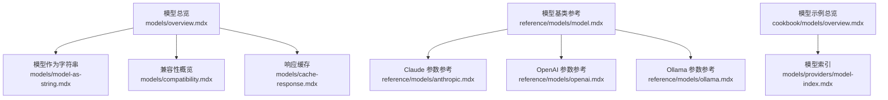
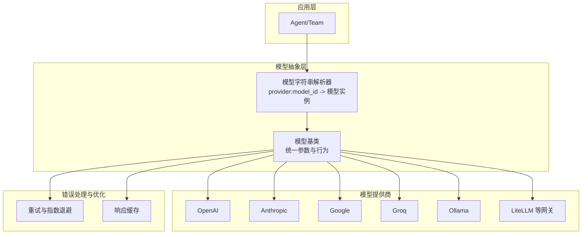
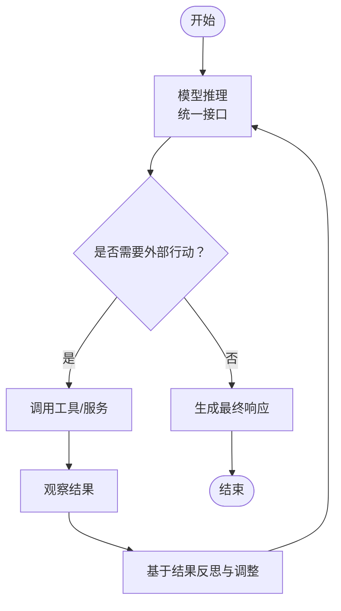
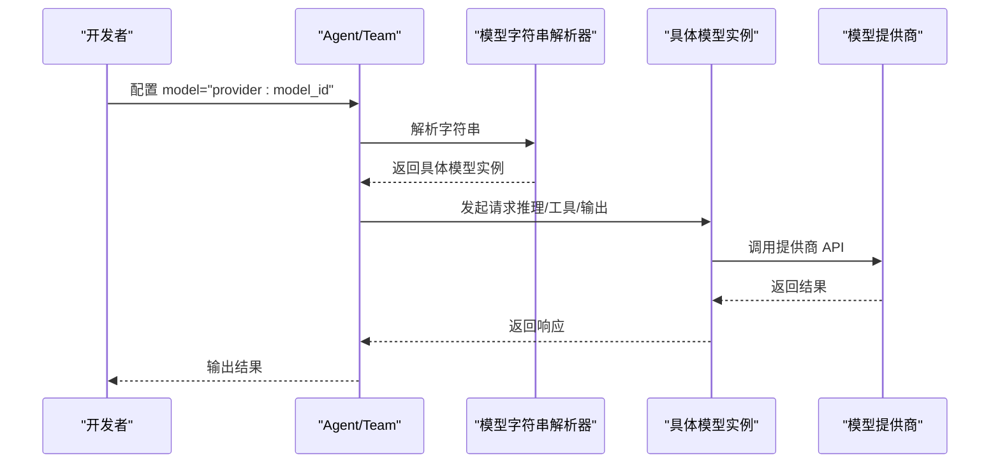
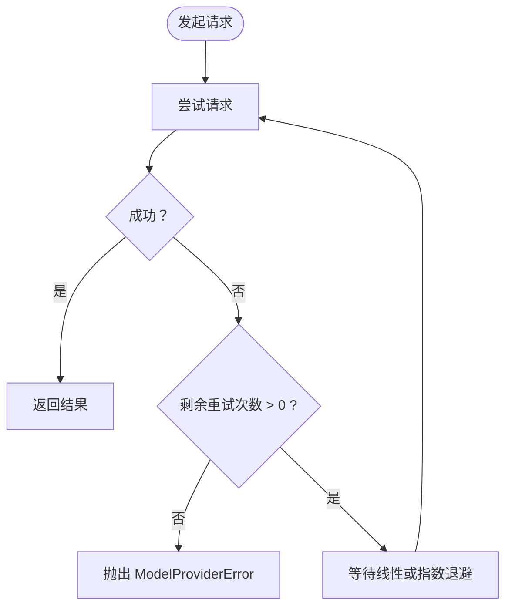
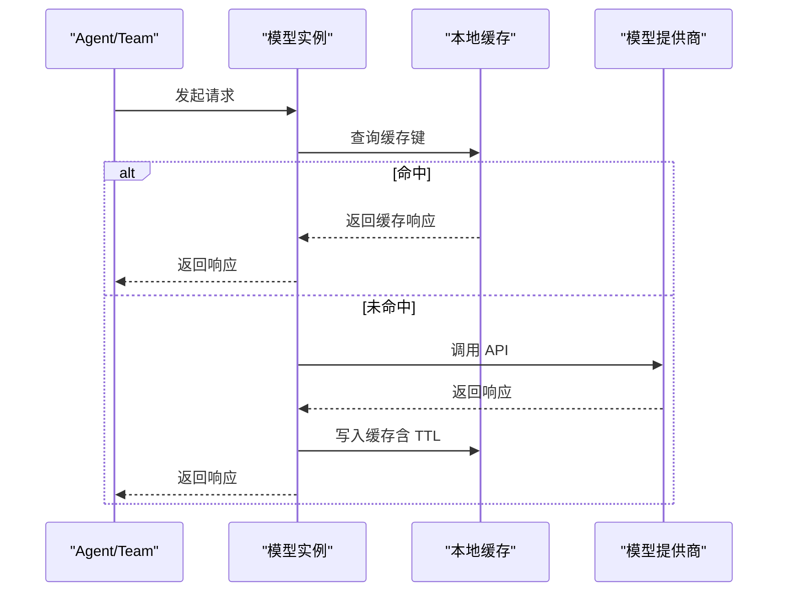
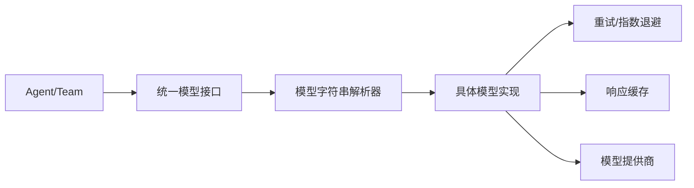

# 模型基础概念

<cite>
**本文引用的文件**
- [模型总览](file://models/overview.mdx)
- [模型作为字符串](file://models/model-as-string.mdx)
- [兼容性概览](file://models/compatibility.mdx)
- [响应缓存](file://models/cache-response.mdx)
- [模型索引](file://models/providers/model-index.mdx)
- [模型基类参考](file://reference/models/model.mdx)
- [Claude 参数参考](file://reference/models/anthropic.mdx)
- [OpenAI 参数参考](file://reference/models/openai.mdx)
- [Ollama 参数参考](file://reference/models/ollama.mdx)
- [模型示例总览](file://cookbook/models/overview.mdx)
</cite>

## 目录
1. [简介](#简介)
2. [项目结构](#项目结构)
3. [核心组件](#核心组件)
4. [架构总览](#架构总览)
5. [详细组件分析](#详细组件分析)
6. [依赖关系分析](#依赖关系分析)
7. [性能考量](#性能考量)
8. [故障排查指南](#故障排查指南)
9. [结论](#结论)
10. [附录](#附录)

## 简介
本章节面向“模型基础概念”，系统阐述以下内容：
- 什么是语言模型（LLMs）及其在智能代理系统中的角色与价值
- 模型如何充当代理的“大脑”：推理、行动与对用户的响应
- 错误处理机制：重试次数、重试间隔与指数退避策略
- 统一接口设计：通过“模型字符串”简化配置
- 实际用法示例：不同模型类与配置项的使用路径
- 最佳实践：如何根据场景选择合适的模型与参数

## 项目结构
围绕“模型基础概念”的知识分布在以下几类文档中：
- 概念与入门：模型总览、模型作为字符串、兼容性概览
- 配置与参数：模型基类参考、各模型参数参考（如 Claude、OpenAI、Ollama）
- 实践与示例：模型示例总览、响应缓存
- 提供商索引：模型索引，便于按类别浏览所有支持的模型

图表来源
- [模型总览:1-62](file://models/overview.mdx#L1-L62)
- [模型作为字符串:1-122](file://models/model-as-string.mdx#L1-L122)
- [兼容性概览:1-92](file://models/compatibility.mdx#L1-L92)
- [响应缓存:1-183](file://models/cache-response.mdx#L1-L183)
- [模型基类参考:1-30](file://reference/models/model.mdx#L1-L30)
- [Claude 参数参考:1-32](file://reference/models/anthropic.mdx#L1-L32)
- [OpenAI 参数参考:1-53](file://reference/models/openai.mdx#L1-L53)
- [Ollama 参数参考:35-37](file://reference/models/ollama.mdx#L35-L37)
- [模型示例总览:1-107](file://cookbook/models/overview.mdx#L1-L107)
- [模型索引:1-375](file://models/providers/model-index.mdx#L1-L375)

章节来源
- [模型总览:1-62](file://models/overview.mdx#L1-L62)
- [模型作为字符串:1-122](file://models/model-as-string.mdx#L1-L122)
- [兼容性概览:1-92](file://models/compatibility.mdx#L1-L92)
- [响应缓存:1-183](file://models/cache-response.mdx#L1-L183)
- [模型基类参考:1-30](file://reference/models/model.mdx#L1-L30)
- [Claude 参数参考:1-32](file://reference/models/anthropic.mdx#L1-L32)
- [OpenAI 参数参考:1-53](file://reference/models/openai.mdx#L1-L53)
- [Ollama 参数参考:35-37](file://reference/models/ollama.mdx#L35-L37)
- [模型示例总览:1-107](file://cookbook/models/overview.mdx#L1-L107)
- [模型索引:1-375](file://models/providers/model-index.mdx#L1-L375)

## 核心组件
- 模型总览：定义“模型是代理的大脑”，支撑推理、行动与响应；并引入“模型字符串”与“错误处理”两大主题。
- 模型作为字符串：提供 provider:model_id 的便捷语法，降低导入复杂度，同时与对象语法等价。
- 兼容性概览：列出核心能力（流式、工具调用、结构化输出、异步执行）及多模态支持矩阵。
- 响应缓存：在开发与测试阶段减少重复 API 调用，提升迭代效率。
- 模型基类参考：统一的参数清单，覆盖通用请求参数、缓存、重试等。
- 各模型参数参考：Claude、OpenAI、Ollama 等具体模型的参数与默认值。

章节来源
- [模型总览:9-27](file://models/overview.mdx#L9-L27)
- [模型作为字符串:12-14](file://models/model-as-string.mdx#L12-L14)
- [兼容性概览:10-37](file://models/compatibility.mdx#L10-L37)
- [响应缓存:12-28](file://models/cache-response.mdx#L12-L28)
- [模型基类参考:9-30](file://reference/models/model.mdx#L9-L30)
- [Claude 参数参考:10-32](file://reference/models/anthropic.mdx#L10-L32)
- [OpenAI 参数参考:10-53](file://reference/models/openai.mdx#L10-L53)
- [Ollama 参数参考:35-37](file://reference/models/ollama.mdx#L35-L37)

## 架构总览
下图展示了“模型作为代理大脑”的运行时视图：Agent/Team 通过统一的模型接口与多种模型提供商交互；在请求失败或限流时，可启用重试与指数退避；在开发阶段可启用响应缓存以降低成本与等待时间。

图表来源
- [模型总览:29-44](file://models/overview.mdx#L29-L44)
- [模型作为字符串:16-26](file://models/model-as-string.mdx#L16-L26)
- [模型基类参考:27-30](file://reference/models/model.mdx#L27-L30)
- [响应缓存:35-45](file://models/cache-response.mdx#L35-L45)
- [模型索引:10-375](file://models/providers/model-index.mdx#L10-L375)

## 详细组件分析

### 组件A：模型作为代理“大脑”
- 推理：通过统一的模型接口，Agent/Team 可调用不同提供商的模型进行思考与规划。
- 行动：结合工具调用（Tool Calling），模型可驱动外部系统或服务完成任务。
- 响应：支持流式输出、结构化输出与多模态输入/输出，满足多样化交互需求。

图表来源
- [模型总览:9-11](file://models/overview.mdx#L9-L11)
- [兼容性概览:10-16](file://models/compatibility.mdx#L10-L16)

章节来源
- [模型总览:9-11](file://models/overview.mdx#L9-L11)
- [兼容性概览:10-16](file://models/compatibility.mdx#L10-L16)

### 组件B：统一接口与模型字符串
- 统一接口：所有模型均继承自统一的模型基类，具备一致的参数与行为，便于切换提供商。
- 模型字符串：使用 provider:model_id 的字符串形式，无需导入具体模型类即可完成配置。
- 示例路径：
  - [Agent 使用字符串语法:37-47](file://models/model-as-string.mdx#L37-L47)
  - [Teams 使用字符串语法:53-80](file://models/model-as-string.mdx#L53-L80)
  - [多模型类型配置（主模型/推理模型/解析模型/输出模型）:89-99](file://models/model-as-string.mdx#L89-L99)

图表来源
- [模型作为字符串:16-26](file://models/model-as-string.mdx#L16-L26)
- [模型作为字符串:37-47](file://models/model-as-string.mdx#L37-L47)
- [模型作为字符串:53-80](file://models/model-as-string.mdx#L53-L80)
- [模型作为字符串:89-99](file://models/model-as-string.mdx#L89-L99)

章节来源
- [模型作为字符串:12-14](file://models/model-as-string.mdx#L12-L14)
- [模型作为字符串:16-26](file://models/model-as-string.mdx#L16-L26)
- [模型作为字符串:37-47](file://models/model-as-string.mdx#L37-L47)
- [模型作为字符串:53-80](file://models/model-as-string.mdx#L53-L80)
- [模型作为字符串:89-99](file://models/model-as-string.mdx#L89-L99)

### 组件C：错误处理机制（重试、延迟、指数退避）
- 重试次数：在请求失败时自动重试指定次数。
- 重试间隔：每次重试之间的等待秒数。
- 指数退避：开启后，每次重试间隔翻倍，避免雪崩效应。
- 配置位置：可在模型类上直接配置，也可在 Agent/Team 层配置以重试整个运行流程。
- 示例路径：
  - [模型重试配置示例（OpenAIResponses）:33-40](file://models/overview.mdx#L33-L40)
  - [模型基类重试参数:27-30](file://reference/models/model.mdx#L27-L30)
  - [Claude 重试参数:30-32](file://reference/models/anthropic.mdx#L30-L32)
  - [OpenAI 重试参数:50-52](file://reference/models/openai.mdx#L50-L52)
  - [Ollama 重试参数:35-37](file://reference/models/ollama.mdx#L35-L37)

图表来源
- [模型总览:29-44](file://models/overview.mdx#L29-L44)
- [模型基类参考:27-30](file://reference/models/model.mdx#L27-L30)
- [Claude 参数参考:30-32](file://reference/models/anthropic.mdx#L30-L32)
- [OpenAI 参数参考:50-52](file://reference/models/openai.mdx#L50-L52)
- [Ollama 参数参考:35-37](file://reference/models/ollama.mdx#L35-L37)

章节来源
- [模型总览:29-44](file://models/overview.mdx#L29-L44)
- [模型基类参考:27-30](file://reference/models/model.mdx#L27-L30)
- [Claude 参数参考:30-32](file://reference/models/anthropic.mdx#L30-L32)
- [OpenAI 参数参考:50-52](file://reference/models/openai.mdx#L50-L52)
- [Ollama 参数参考:35-37](file://reference/models/ollama.mdx#L35-L37)

### 组件D：响应缓存（开发与测试优化）
- 何时使用：在开发/测试阶段，相同查询反复命中模型时，可显著降低等待与成本。
- 工作原理：基于请求参数生成唯一键，命中则直接返回缓存，未命中则调用 API 并写入缓存；支持 TTL 过期与自定义缓存目录。
- 使用方式：在模型初始化时启用缓存，并可配置 TTL 与缓存目录。
- 示例路径：
  - [启用缓存与 TTL:51-83](file://models/cache-response.mdx#L51-L83)
  - [自定义缓存目录:89-101](file://models/cache-response.mdx#L89-L101)
  - [Agent/Team 中使用缓存:104-152](file://models/cache-response.mdx#L104-L152)
  - [流式场景下的缓存:154-171](file://models/cache-response.mdx#L154-L171)

图表来源
- [响应缓存:35-45](file://models/cache-response.mdx#L35-L45)
- [响应缓存:51-83](file://models/cache-response.mdx#L51-L83)
- [响应缓存:89-101](file://models/cache-response.mdx#L89-L101)
- [响应缓存:104-152](file://models/cache-response.mdx#L104-L152)
- [响应缓存:154-171](file://models/cache-response.mdx#L154-L171)

章节来源
- [响应缓存:12-28](file://models/cache-response.mdx#L12-L28)
- [响应缓存:35-45](file://models/cache-response.mdx#L35-L45)
- [响应缓存:51-83](file://models/cache-response.mdx#L51-L83)
- [响应缓存:89-101](file://models/cache-response.mdx#L89-L101)
- [响应缓存:104-152](file://models/cache-response.mdx#L104-L152)
- [响应缓存:154-171](file://models/cache-response.mdx#L154-L171)

### 组件E：多模态与核心能力
- 核心能力：所有模型均支持流式响应、工具调用、结构化输出、异步执行。
- 多模态支持：不同提供商对图像输入、音频输入/输出、视频输入、文件上传的支持情况不同，详见兼容性矩阵。
- 示例路径：
  - [核心能力列表:10-16](file://models/compatibility.mdx#L10-L16)
  - [多模态支持矩阵:39-88](file://models/compatibility.mdx#L39-L88)

章节来源
- [兼容性概览:10-16](file://models/compatibility.mdx#L10-L16)
- [兼容性概览:39-88](file://models/compatibility.mdx#L39-L88)

### 组件F：模型提供商索引与示例
- 模型索引：按“原生/本地/云/网关聚合”三大类组织，覆盖 40+ 提供商，便于快速定位目标模型。
- 示例总览：提供跨提供商的示例集合，同一 Agent 代码可无缝切换不同模型。
- 示例路径：
  - [模型索引卡片导航:10-375](file://models/providers/model-index.mdx#L10-L375)
  - [示例总览与快速开始:21-87](file://cookbook/models/overview.mdx#L21-L87)

章节来源
- [模型索引:10-375](file://models/providers/model-index.mdx#L10-L375)
- [模型示例总览:21-87](file://cookbook/models/overview.mdx#L21-L87)

## 依赖关系分析
- 组件耦合：
  - Agent/Team 仅依赖统一的模型接口，不直接耦合具体提供商。
  - 模型字符串解析器负责将 provider:model_id 映射到具体模型类。
  - 错误处理与缓存横切于模型基类，被所有模型共享。
- 外部依赖：
  - 各模型提供商的 SDK 或 HTTP 客户端。
  - 本地缓存存储（默认位于用户主目录）。

图表来源
- [模型作为字符串:16-26](file://models/model-as-string.mdx#L16-L26)
- [模型基类参考:27-30](file://reference/models/model.mdx#L27-L30)
- [响应缓存:35-45](file://models/cache-response.mdx#L35-L45)

章节来源
- [模型作为字符串:16-26](file://models/model-as-string.mdx#L16-L26)
- [模型基类参考:27-30](file://reference/models/model.mdx#L27-L30)
- [响应缓存:35-45](file://models/cache-response.mdx#L35-L45)

## 性能考量
- 流式输出：在长文本或工具调用过程中，优先使用流式响应以改善感知延迟。
- 结构化输出：在需要稳定 JSON/Schema 输出时启用严格模式，减少后处理开销。
- 缓存策略：开发/测试阶段启用缓存，生产环境谨慎使用，避免陈旧数据。
- 重试与退避：合理设置重试次数与初始延迟，开启指数退避以缓解瞬时拥塞。
- 多模态：根据场景选择支持相应模态的模型，避免不必要的传输与处理成本。

## 故障排查指南
- 常见问题与定位
  - 请求失败：检查重试配置与指数退避是否生效；确认网络与密钥。
  - 速率限制：增加重试延迟或开启指数退避；必要时降级模型或分摊并发。
  - 缓存命中异常：确认缓存键生成规则与请求参数一致性；检查 TTL 设置。
- 关键参数核对
  - 重试相关：retries、delay_between_retries、exponential_backoff
  - 缓存相关：cache_response、cache_ttl、cache_dir
  - 输出格式：response_format、strict_output（针对结构化输出）
- 参考路径
  - [模型基类重试与缓存参数:24-30](file://reference/models/model.mdx#L24-L30)
  - [Claude 重试参数:30-32](file://reference/models/anthropic.mdx#L30-L32)
  - [OpenAI 重试参数:50-52](file://reference/models/openai.mdx#L50-L52)
  - [Ollama 重试参数:35-37](file://reference/models/ollama.mdx#L35-L37)
  - [响应缓存配置与使用:69-101](file://models/cache-response.mdx#L69-L101)

章节来源
- [模型基类参考:24-30](file://reference/models/model.mdx#L24-L30)
- [Claude 参数参考:30-32](file://reference/models/anthropic.mdx#L30-L32)
- [OpenAI 参数参考:50-52](file://reference/models/openai.mdx#L50-L52)
- [Ollama 参数参考:35-37](file://reference/models/ollama.mdx#L35-L37)
- [响应缓存:69-101](file://models/cache-response.mdx#L69-L101)

## 结论
- 模型是智能代理的“大脑”，负责推理、行动与响应。
- 通过统一接口与模型字符串，可以极简地切换与配置不同提供商的模型。
- 错误处理（重试/指数退避）与响应缓存是提升稳定性与开发效率的关键手段。
- 在多模态与核心能力方面，应依据场景选择合适提供商与模型。

## 附录
- 快速上手路径
  - [模型总览与示例:13-23](file://models/overview.mdx#L13-L23)
  - [模型作为字符串示例:37-47](file://models/model-as-string.mdx#L37-L47)
  - [多模型类型配置示例:89-99](file://models/model-as-string.mdx#L89-L99)
  - [示例总览与一键运行:74-107](file://cookbook/models/overview.mdx#L74-L107)
- 更多提供商与参数
  - [模型索引（按分类浏览）:10-375](file://models/providers/model-index.mdx#L10-L375)
  - [各模型参数参考（Claude/OpenAI/Ollama）:10-32](file://reference/models/anthropic.mdx#L10-L32)
  - [各模型参数参考（OpenAI）:10-53](file://reference/models/openai.mdx#L10-L53)
  - [各模型参数参考（Ollama）:35-37](file://reference/models/ollama.mdx#L35-L37)