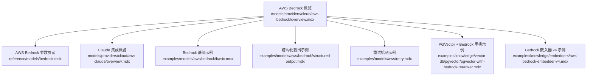
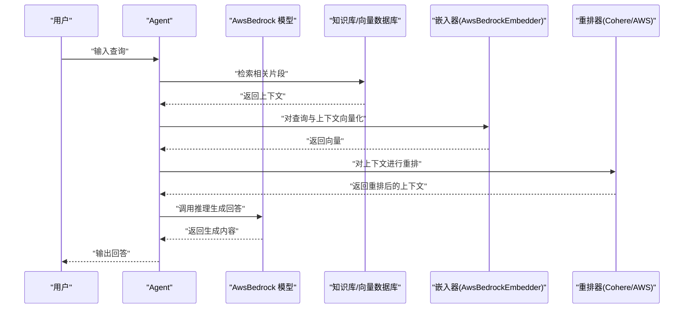
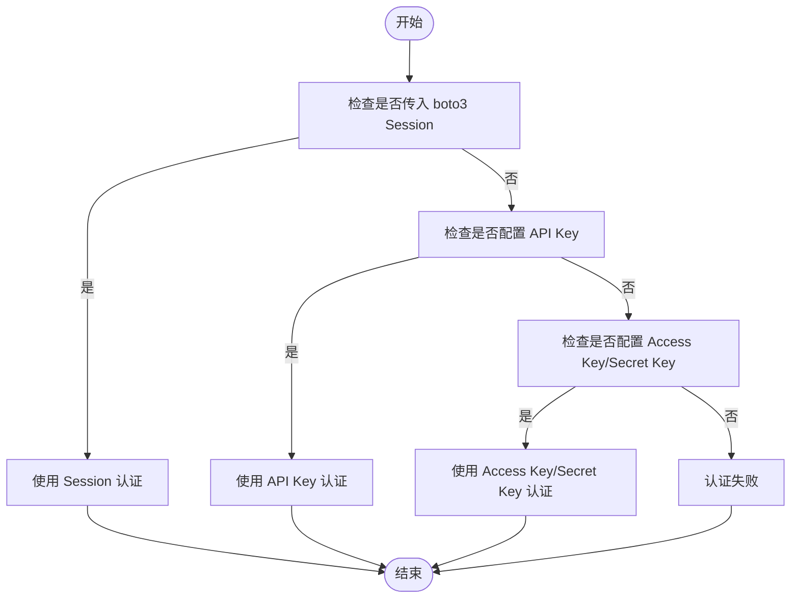
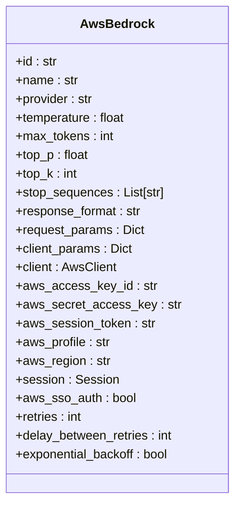
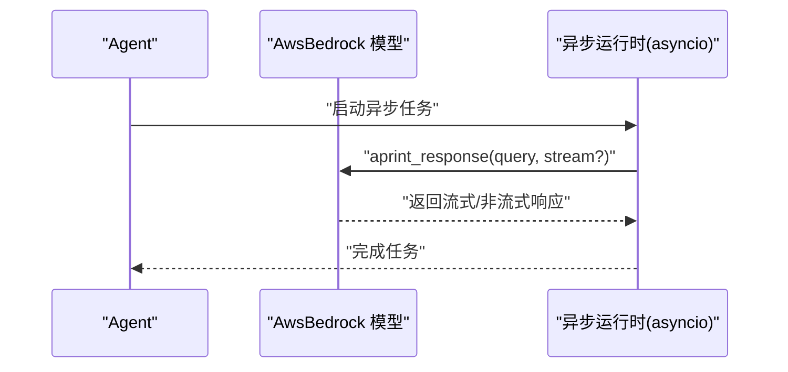
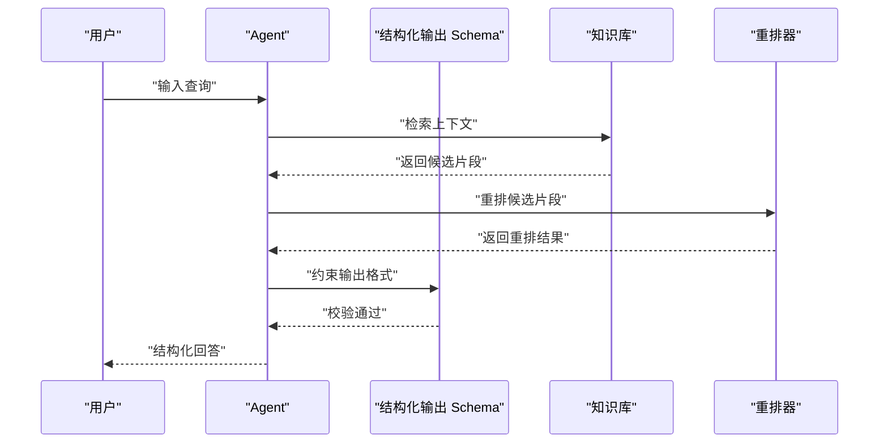
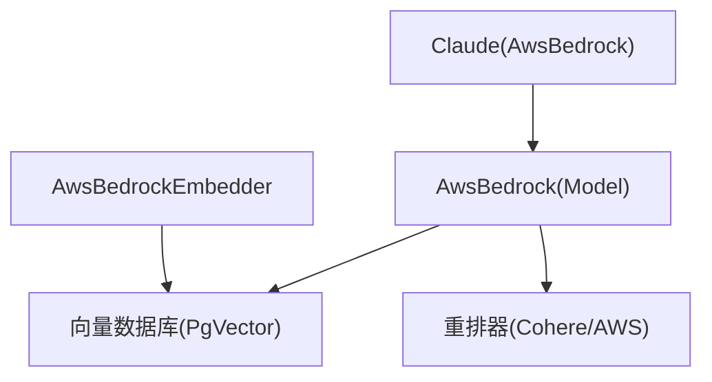

# AWS Bedrock

<cite>
**本文引用的文件**
- [AWS Bedrock 概览](file://models/providers/cloud/aws-bedrock/overview.mdx)
- [AWS Bedrock 参数参考](file://reference/models/bedrock.mdx)
- [Claude 模型概览](file://models/providers/cloud/aws-claude/overview.mdx)
- [AWS Bedrock 基础示例](file://examples/models/aws/bedrock/basic.mdx)
- [结构化输出示例](file://examples/models/aws/bedrock/structured-output.mdx)
- [重试机制示例](file://examples/models/aws/retry.mdx)
- [PGVector + Bedrock 重排示例](file://examples/knowledge/vector-db/pgvector/pgvector-with-bedrock-reranker.mdx)
- [Bedrock 嵌入器 v4 示例](file://examples/knowledge/embedders/aws-bedrock-embedder-v4.mdx)
</cite>

## 目录
1. [简介](#简介)
2. [项目结构](#项目结构)
3. [核心组件](#核心组件)
4. [架构总览](#架构总览)
5. [详细组件分析](#详细组件分析)
6. [依赖关系分析](#依赖关系分析)
7. [性能考虑](#性能考虑)
8. [故障排查指南](#故障排查指南)
9. [结论](#结论)
10. [附录](#附录)

## 简介
本文件面向在 AWS Bedrock 上集成云模型提供商的工程师与技术文档读者，系统性介绍如何在 Agent 中使用 AWS Bedrock 的多模型能力，覆盖认证方式（Access Key/Secret Key、SSO 认证、Boto3 Session）、模型选择与配置、异步支持要求（aioboto3）、性能优化与最佳实践，并提供 Agent 集成示例与参考路径。

## 项目结构
围绕 AWS Bedrock 的文档与示例分布在以下位置：
- 提供商概览：models/providers/cloud/aws-bedrock/overview.mdx
- 参数参考：reference/models/bedrock.mdx
- Claude 集成：models/providers/cloud/aws-claude/overview.mdx
- 示例：examples/models/aws/bedrock/*
- 知识体系示例：examples/knowledge/vector-db/pgvector/pgvector-with-bedrock-reranker.mdx
- 嵌入器示例：examples/knowledge/embedders/aws-bedrock-embedder-v4.mdx

**图表来源**
- [AWS Bedrock 概览:1-155](file://models/providers/cloud/aws-bedrock/overview.mdx#L1-L155)
- [AWS Bedrock 参数参考:1-31](file://reference/models/bedrock.mdx#L1-L31)
- [Claude 模型概览:1-162](file://models/providers/cloud/aws-claude/overview.mdx#L1-L162)
- [AWS Bedrock 基础示例:1-58](file://examples/models/aws/bedrock/basic.mdx#L1-L58)
- [结构化输出示例:1-76](file://examples/models/aws/bedrock/structured-output.mdx#L1-L76)
- [重试机制示例:1-49](file://examples/models/aws/retry.mdx#L1-L49)
- [PGVector + Bedrock 重排示例:48-84](file://examples/knowledge/vector-db/pgvector/pgvector-with-bedrock-reranker.mdx#L48-L84)
- [Bedrock 嵌入器 v4 示例:47-84](file://examples/knowledge/embedders/aws-bedrock-embedder-v4.mdx#L47-L84)

**章节来源**
- [AWS Bedrock 概览:1-155](file://models/providers/cloud/aws-bedrock/overview.mdx#L1-L155)
- [AWS Bedrock 参数参考:1-31](file://reference/models/bedrock.mdx#L1-L31)

## 核心组件
- 模型提供方：AwsBedrock（AWS Bedrock）
- 认证方式：Access Key/Secret Key、SSO 认证、Boto3 Session
- 异步支持：需要安装 aioboto3
- 参数与配置：id、name、provider、temperature、max_tokens、top_p、top_k、stop_sequences、response_format、request_params、client_params、client、aws_* 系列环境变量与显式参数
- 兼容性与多模型：Mistral、Amazon Nova、Claude（通过 AwsBedrock 或 Claude 模型）

**章节来源**
- [AWS Bedrock 概览:11-22](file://models/providers/cloud/aws-bedrock/overview.mdx#L11-L22)
- [AWS Bedrock 概览:134-155](file://models/providers/cloud/aws-bedrock/overview.mdx#L134-L155)
- [AWS Bedrock 参数参考:10-31](file://reference/models/bedrock.mdx#L10-L31)

## 架构总览
下图展示 Agent 使用 AwsBedrock 进行推理的整体流程，以及与知识库、嵌入器、重排器等组件的协作关系。

**图表来源**
- [PGVector + Bedrock 重排示例:48-84](file://examples/knowledge/vector-db/pgvector/pgvector-with-bedrock-reranker.mdx#L48-L84)
- [Bedrock 嵌入器 v4 示例:47-84](file://examples/knowledge/embedders/aws-bedrock-embedder-v4.mdx#L47-L84)

## 详细组件分析

### 组件一：认证与配置
- 支持三种认证方式，优先级顺序为：Session > API Key > Access Key/Secret Key
- 环境变量与显式参数可混合使用
- 区域与会话可显式指定或从环境变量读取

**图表来源**
- [AWS Bedrock 概览:107-109](file://models/providers/cloud/aws-bedrock/overview.mdx#L107-L109)

**章节来源**
- [AWS Bedrock 概览:24-109](file://models/providers/cloud/aws-bedrock/overview.mdx#L24-L109)

### 组件二：模型选择与参数
- 推荐模型与用途：
  - Mistral：通用性能良好
  - Amazon Nova：通用任务
  - Claude：通过 Claude 模型接入
- 关键参数：id、name、provider、temperature、max_tokens、top_p、top_k、stop_sequences、response_format、request_params、client_params、client、aws_* 系列

**图表来源**
- [AWS Bedrock 参数参考:10-31](file://reference/models/bedrock.mdx#L10-L31)
- [AWS Bedrock 概览:134-155](file://models/providers/cloud/aws-bedrock/overview.mdx#L134-L155)

**章节来源**
- [AWS Bedrock 概览:18-22](file://models/providers/cloud/aws-bedrock/overview.mdx#L18-L22)
- [AWS Bedrock 参数参考:10-31](file://reference/models/bedrock.mdx#L10-L31)

### 组件三：异步支持与性能
- 异步支持要求：安装 aioboto3
- 示例展示了同步、流式、异步与流式异步的多种调用方式
- 可通过 retries、delay_between_retries、exponential_backoff 控制重试策略

**图表来源**
- [AWS Bedrock 基础示例:32-43](file://examples/models/aws/bedrock/basic.mdx#L32-L43)

**章节来源**
- [AWS Bedrock 概览:11-16](file://models/providers/cloud/aws-bedrock/overview.mdx#L11-L16)
- [AWS Bedrock 基础示例:32-43](file://examples/models/aws/bedrock/basic.mdx#L32-L43)
- [重试机制示例:16-26](file://examples/models/aws/retry.mdx#L16-L26)

### 组件四：Agent 集成与最佳实践
- 结构化输出：通过 Pydantic Schema 约束模型输出格式
- 知识库集成：结合向量数据库与嵌入器，实现 RAG 场景
- 重排器：可选 Cohere 或 Amazon 重排器提升检索质量
- 多模型协同：在同一 Agent 中组合不同模型（如 Claude 用于推理、Mistral 用于生成）

**图表来源**
- [结构化输出示例:25-48](file://examples/models/aws/bedrock/structured-output.mdx#L25-L48)
- [PGVector + Bedrock 重排示例:48-84](file://examples/knowledge/vector-db/pgvector/pgvector-with-bedrock-reranker.mdx#L48-L84)

**章节来源**
- [结构化输出示例:25-48](file://examples/models/aws/bedrock/structured-output.mdx#L25-L48)
- [PGVector + Bedrock 重排示例:48-84](file://examples/knowledge/vector-db/pgvector/pgvector-with-bedrock-reranker.mdx#L48-L84)

## 依赖关系分析
- AwsBedrock 作为 Model 子类，继承通用模型参数；同时扩展 AWS 特定认证与客户端参数
- Claude 模型通过 AwsBedrock 提供的 Bedrock 通道访问 Anthropic Claude
- 知识库与嵌入器通过 AwsBedrockEmbedder 获取向量表示，支持不同维度与输入类型

**图表来源**
- [AWS Bedrock 概览:154-155](file://models/providers/cloud/aws-bedrock/overview.mdx#L154-L155)
- [Claude 模型概览:161-162](file://models/providers/cloud/aws-claude/overview.mdx#L161-L162)
- [Bedrock 嵌入器 v4 示例:47-84](file://examples/knowledge/embedders/aws-bedrock-embedder-v4.mdx#L47-L84)

**章节来源**
- [AWS Bedrock 概览:154-155](file://models/providers/cloud/aws-bedrock/overview.mdx#L154-L155)
- [Claude 模型概览:161-162](file://models/providers/cloud/aws-claude/overview.mdx#L161-L162)

## 性能考虑
- 合理设置 temperature、max_tokens、top_p/top_k、stop_sequences，以平衡生成质量与成本
- 在高延迟网络中启用重试与指数退避，避免瞬时错误导致失败
- 对于大文本与复杂 RAG 场景，优先使用合适的模型与重排器，减少无关上下文
- 异步调用可提升并发吞吐，但需注意资源限制与错误处理

[本节为通用指导，无需特定文件来源]

## 故障排查指南
- 认证失败：确认认证优先级与环境变量/显式参数是否正确配置
- 异步不可用：确保已安装 aioboto3 并按示例方式调用异步接口
- 模型不可用：检查模型 ID 是否正确，以及账户权限与区域设置
- 重试策略：根据场景调整 retries、delay_between_retries、exponential_backoff

**章节来源**
- [AWS Bedrock 概览:107-109](file://models/providers/cloud/aws-bedrock/overview.mdx#L107-L109)
- [重试机制示例:16-26](file://examples/models/aws/retry.mdx#L16-L26)

## 结论
通过 AwsBedrock，Agent 可灵活接入 Mistral、Amazon Nova、Claude 等多模型，并借助知识库与重排器构建高质量的 RAG 能力。结合异步支持与合理的重试策略，可在生产环境中获得稳定且高效的推理体验。

[本节为总结，无需特定文件来源]

## 附录
- 实际示例参考路径（不含代码内容，仅提供路径）：
  - [AWS Bedrock 基础示例:1-58](file://examples/models/aws/bedrock/basic.mdx#L1-L58)
  - [结构化输出示例:1-76](file://examples/models/aws/bedrock/structured-output.mdx#L1-L76)
  - [重试机制示例:1-49](file://examples/models/aws/retry.mdx#L1-L49)
  - [PGVector + Bedrock 重排示例:48-84](file://examples/knowledge/vector-db/pgvector/pgvector-with-bedrock-reranker.mdx#L48-L84)
  - [Bedrock 嵌入器 v4 示例:47-84](file://examples/knowledge/embedders/aws-bedrock-embedder-v4.mdx#L47-L84)

[本节为补充材料，无需特定文件来源]