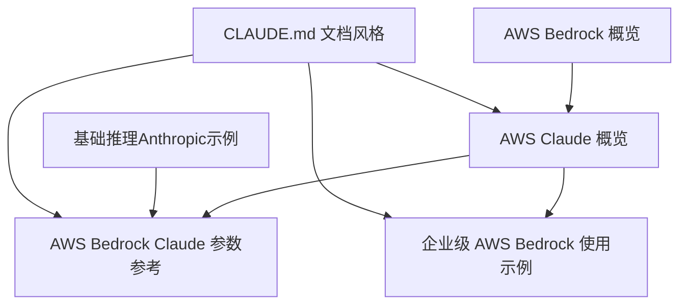
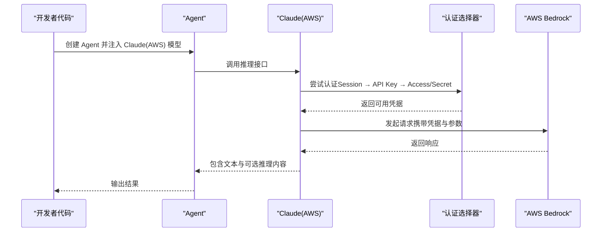
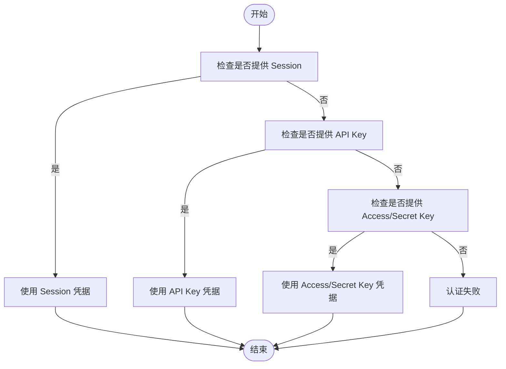
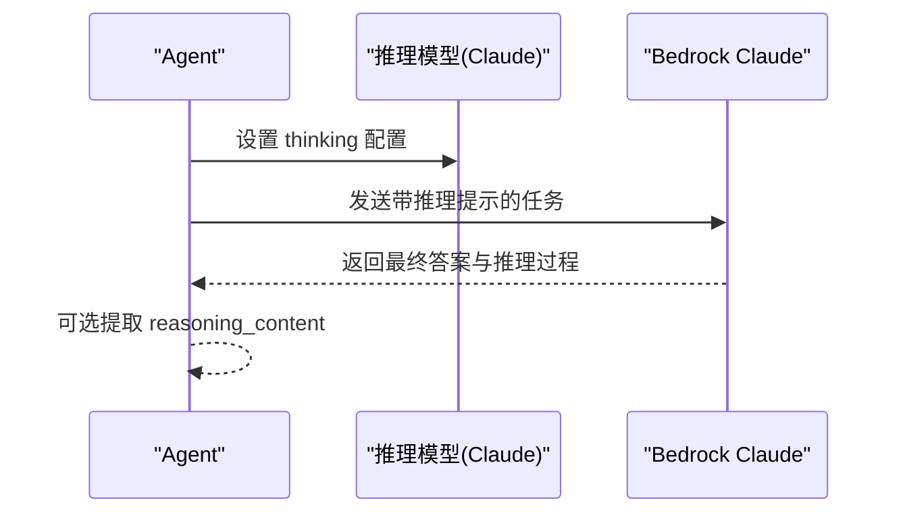
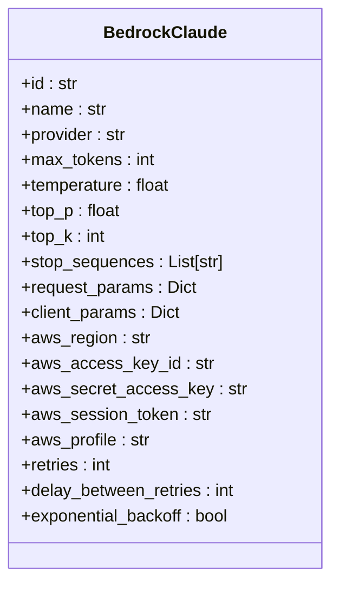
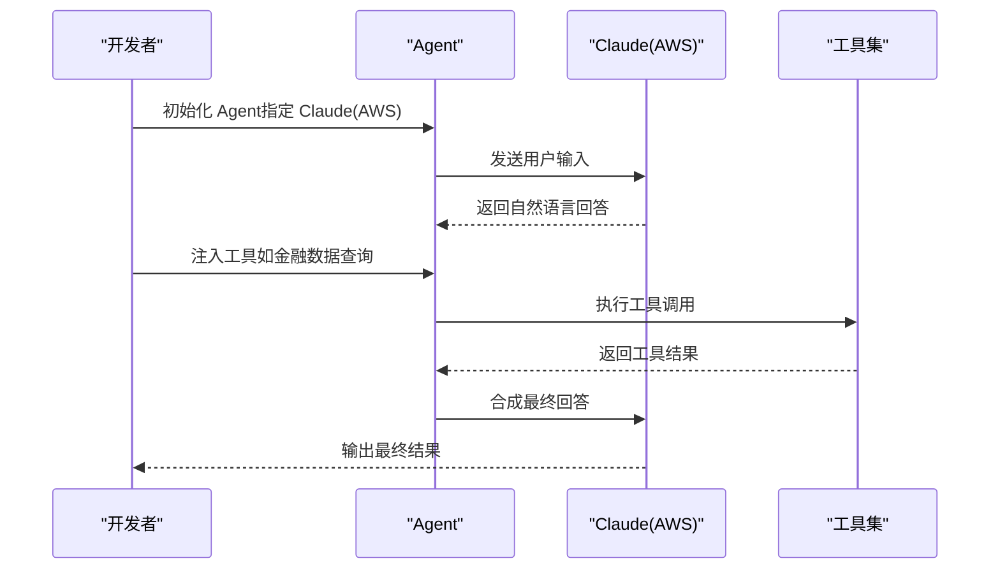
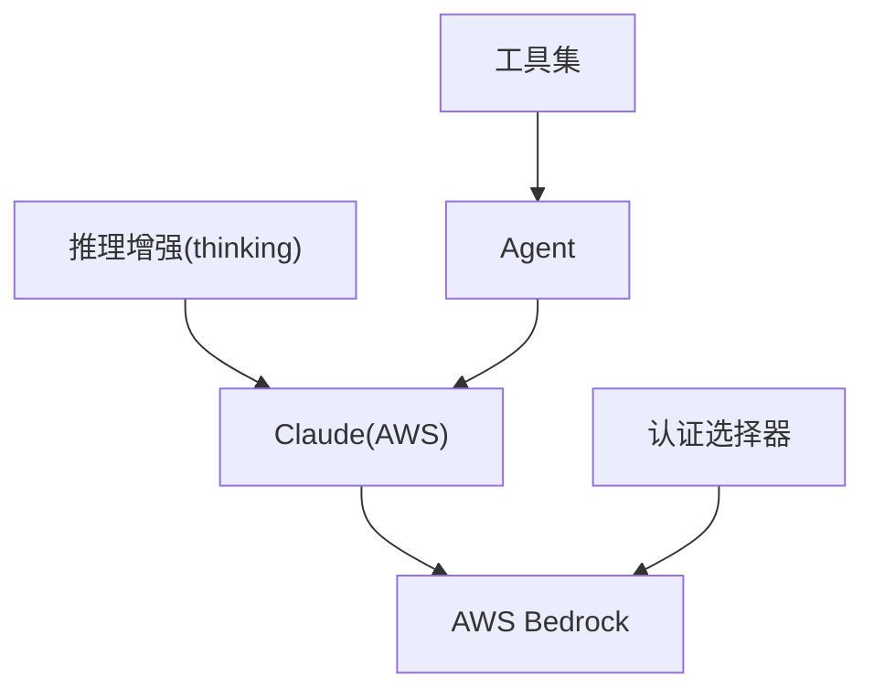

# AWS Claude

<cite>
**本文引用的文件**
- [CLAUDE.md](file://CLAUDE.md)
- [AWS Claude 概览](file://models/providers/cloud/aws-claude/overview.mdx)
- [AWS Bedrock Claude 参数参考](file://reference/models/bedrock-claude.mdx)
- [AWS Bedrock 概览](file://models/providers/cloud/aws-bedrock/overview.mdx)
- [企业级 AWS Bedrock 使用示例](file://cookbook/models/enterprise/aws-bedrock.mdx)
- [基础推理（Anthropic）示例](file://examples/reasoning/models/anthropic/basic-reasoning.mdx)
</cite>

## 目录
1. [简介](#简介)
2. [项目结构](#项目结构)
3. [核心组件](#核心组件)
4. [架构总览](#架构总览)
5. [详细组件分析](#详细组件分析)
6. [依赖关系分析](#依赖关系分析)
7. [性能考虑](#性能考虑)
8. [故障排除指南](#故障排除指南)
9. [结论](#结论)
10. [附录](#附录)

## 简介
本文件面向在 AWS Bedrock 上集成与使用 Claude 模型的工程师与技术文档读者，系统性介绍 Agno 中的 AWS Claude 集成方案、认证配置、参数与能力边界、典型 Agent 场景实践、性能调优与故障排除建议。内容基于仓库中已有的模型概览、参数参考与示例文档整理而成，确保可操作与可验证。

## 项目结构
围绕 AWS Claude 的文档与示例分布在以下区域：
- 模型概览与使用：AWS Claude 概览页面、AWS Bedrock 概览页面
- 参数参考：AWS Bedrock Claude 参数参考
- 示例与用法：企业级 AWS Bedrock 使用示例、基础推理示例
- 文档风格与写作规范：CLAUDE.md

图表来源
- [AWS Claude 概览:1-162](file://models/providers/cloud/aws-claude/overview.mdx#L1-L162)
- [AWS Bedrock Claude 参数参考:1-33](file://reference/models/bedrock-claude.mdx#L1-L33)
- [AWS Bedrock 概览:1-140](file://models/providers/cloud/aws-bedrock/overview.mdx#L1-L140)
- [企业级 AWS Bedrock 使用示例:1-72](file://cookbook/models/enterprise/aws-bedrock.mdx#L1-L72)
- [基础推理（Anthropic）示例:1-80](file://examples/reasoning/models/anthropic/basic-reasoning.mdx#L1-L80)
- [CLAUDE.md 文档风格:1-353](file://CLAUDE.md#L1-L353)

章节来源
- [AWS Claude 概览:1-162](file://models/providers/cloud/aws-claude/overview.mdx#L1-L162)
- [AWS Bedrock 概览:1-140](file://models/providers/cloud/aws-bedrock/overview.mdx#L1-L140)
- [AWS Bedrock Claude 参数参考:1-33](file://reference/models/bedrock-claude.mdx#L1-L33)
- [企业级 AWS Bedrock 使用示例:1-72](file://cookbook/models/enterprise/aws-bedrock.mdx#L1-L72)
- [基础推理（Anthropic）示例:1-80](file://examples/reasoning/models/anthropic/basic-reasoning.mdx#L1-L80)
- [CLAUDE.md 文档风格:1-353](file://CLAUDE.md#L1-L353)

## 核心组件
- AWS Bedrock Claude 模型封装：提供对 Anthropic Claude 系列模型在 AWS Bedrock 上的统一接入，支持多种认证方式与常用推理参数。
- 认证与会话：支持 API Key、Access/Secret Key、Boto3 Session 三种认证路径，并按优先级自动选择。
- 推理增强：通过 thinking 配置启用扩展思考能力，便于复杂推理任务。
- 参数与能力：覆盖 max_tokens、temperature、top_p、top_k、stop_sequences、request_params、client_params 等；同时具备 AWS Bedrock 特定的 region、access key、secret key、profile 等参数。

章节来源
- [AWS Claude 概览:15-162](file://models/providers/cloud/aws-claude/overview.mdx#L15-L162)
- [AWS Bedrock Claude 参数参考:8-33](file://reference/models/bedrock-claude.mdx#L8-L33)

## 架构总览
下图展示了从 Agent 到 AWS Bedrock 的调用链路与认证选择顺序：

图表来源
- [AWS Claude 概览:114-116](file://models/providers/cloud/aws-claude/overview.mdx#L114-L116)

章节来源
- [AWS Claude 概览:114-116](file://models/providers/cloud/aws-claude/overview.mdx#L114-L116)

## 详细组件分析

### 组件一：认证与会话管理
- 支持三种认证方式，按优先级自动选择：
  - Boto3 Session：适用于复杂环境或已有会话配置
  - API Key：推荐用于简化部署
  - Access/Secret Key：标准 AWS 凭证
- 环境变量与显式传参均可使用，便于本地开发与生产部署

图表来源
- [AWS Claude 概览:114-116](file://models/providers/cloud/aws-claude/overview.mdx#L114-L116)

章节来源
- [AWS Claude 概览:15-116](file://models/providers/cloud/aws-claude/overview.mdx#L15-L116)

### 组件二：推理增强（Thinking）
- 通过 reasoning_model 与 thinking 配置启用扩展思考能力，适合需要逐步推理的任务。
- 可以在运行后提取 reasoning_content，用于审计与分析。

图表来源
- [基础推理（Anthropic）示例:33-49](file://examples/reasoning/models/anthropic/basic-reasoning.mdx#L33-L49)

章节来源
- [基础推理（Anthropic）示例:1-80](file://examples/reasoning/models/anthropic/basic-reasoning.mdx#L1-L80)
- [AWS Bedrock Claude 参数参考:15-16](file://reference/models/bedrock-claude.mdx#L15-L16)

### 组件三：参数与能力边界
- 常用参数：id、name、provider、max_tokens、temperature、top_p、top_k、stop_sequences、request_params、client_params
- AWS 特有参数：aws_region、aws_access_key_id、aws_secret_access_key、aws_session_token、aws_profile
- 缓存与重试：支持缓存系统提示与重试策略（retries、delay_between_retries、exponential_backoff）

图表来源
- [AWS Bedrock Claude 参数参考:10-33](file://reference/models/bedrock-claude.mdx#L10-L33)

章节来源
- [AWS Bedrock Claude 参数参考:8-33](file://reference/models/bedrock-claude.mdx#L8-L33)

### 组件四：典型 Agent 集成示例
- 基础对话与流式输出：见企业级 AWS Bedrock 使用示例中的基础用法
- 工具调用：在 Claude(AWS) 上结合工具实现外部查询与处理
- 结构化输出：通过输出模式约束模型返回格式

图表来源
- [企业级 AWS Bedrock 使用示例:8-53](file://cookbook/models/enterprise/aws-bedrock.mdx#L8-L53)

章节来源
- [企业级 AWS Bedrock 使用示例:1-72](file://cookbook/models/enterprise/aws-bedrock.mdx#L1-L72)

## 依赖关系分析
- 模块耦合
  - Claude(AWS) 依赖 AWS Bedrock 提供的推理服务
  - 认证层独立于模型层，通过优先级策略解耦
  - 推理增强与工具调用均通过模型层统一暴露
- 外部依赖
  - AWS Bedrock 服务端能力与权限控制
  - 可选异步支持需安装 aioboto3

图表来源
- [AWS Bedrock 概览:11-16](file://models/providers/cloud/aws-bedrock/overview.mdx#L11-L16)
- [AWS Claude 概览:114-116](file://models/providers/cloud/aws-claude/overview.mdx#L114-L116)

章节来源
- [AWS Bedrock 概览:1-140](file://models/providers/cloud/aws-bedrock/overview.mdx#L1-L140)
- [AWS Claude 概览:114-116](file://models/providers/cloud/aws-claude/overview.mdx#L114-L116)

## 性能考虑
- 令牌上限与生成长度：合理设置 max_tokens，避免不必要的超长输出
- 渐进采样参数：通过 temperature、top_p、top_k 控制多样性与稳定性
- 缓存与重试：开启缓存系统提示与适度重试，平衡可靠性与延迟
- 异步执行：在支持场景下使用异步客户端提升吞吐

章节来源
- [AWS Bedrock Claude 参数参考:21-33](file://reference/models/bedrock-claude.mdx#L21-L33)
- [AWS Bedrock 概览:11-16](file://models/providers/cloud/aws-bedrock/overview.mdx#L11-L16)

## 故障排除指南
- 认证失败
  - 确认凭据来源与优先级：Session → API Key → Access/Secret Key
  - 检查 AWS_REGION、AWS_ACCESS_KEY_ID、AWS_SECRET_ACCESS_KEY 等环境变量
- 权限不足
  - 确保账户已在 AWS Bedrock 控制台完成模型访问授权
- 速率限制与配额
  - 关注 AWS Bedrock 服务端配额与速率限制，必要时降低并发或增加重试退避
- 推理内容不可用
  - 检查推理模型与 thinking 配置是否正确传递至模型层

章节来源
- [AWS Claude 概览:15-116](file://models/providers/cloud/aws-claude/overview.mdx#L15-L116)
- [AWS Bedrock 概览:24-32](file://models/providers/cloud/aws-bedrock/overview.mdx#L24-L32)

## 结论
通过 Agno 的 Claude(AWS) 封装，可以在 AWS Bedrock 上便捷地接入 Anthropic Claude 系列模型，并以统一的参数与认证方式适配多类 Agent 场景。结合推理增强、工具调用与结构化输出能力，可在安全合规的前提下快速构建高可靠、可扩展的智能体应用。建议在生产环境中配合缓存、重试与异步执行策略，持续监控令牌用量与延迟指标，以获得稳定且高性能的推理体验。

## 附录
- 快速对照表：常见参数与用途
  - id：指定具体 Claude 模型版本
  - max_tokens：限制生成长度
  - temperature/top_p/top_k：控制输出多样性
  - stop_sequences：终止序列
  - request_params/client_params：透传额外请求参数
  - aws_*：AWS 认证与区域配置
  - thinking：推理增强配置
  - retries/delay/exponential_backoff：重试策略

章节来源
- [AWS Bedrock Claude 参数参考:10-33](file://reference/models/bedrock-claude.mdx#L10-L33)
- [AWS Claude 概览:141-162](file://models/providers/cloud/aws-claude/overview.mdx#L141-L162)