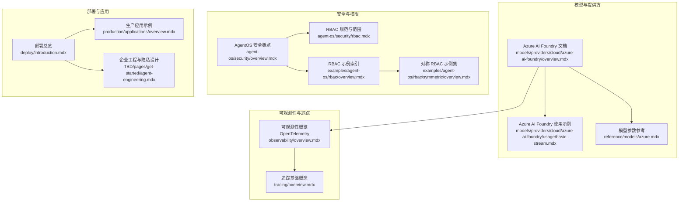
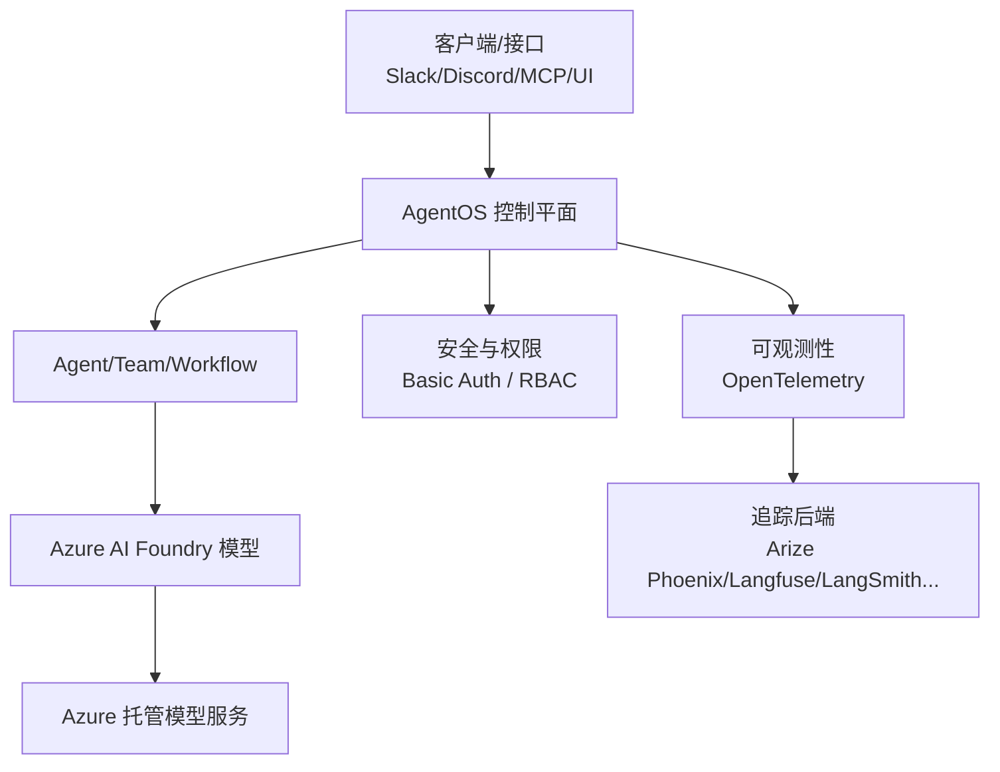
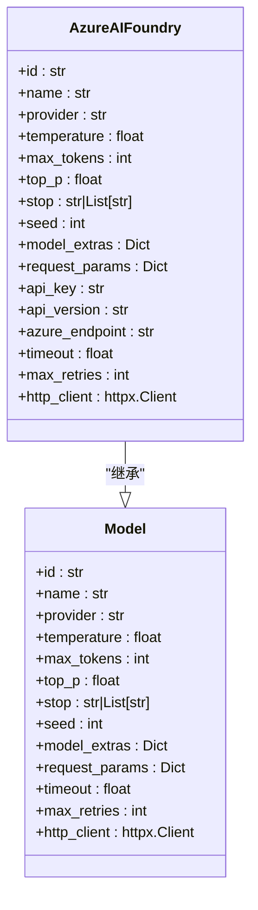
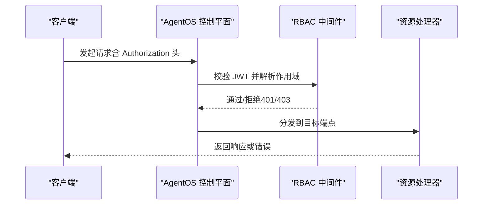
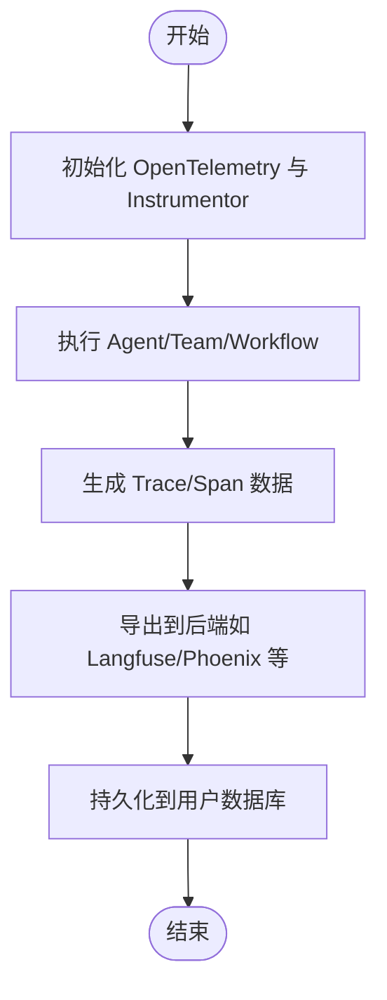
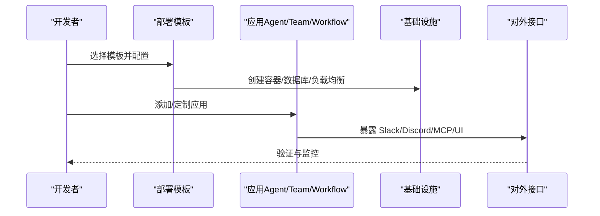
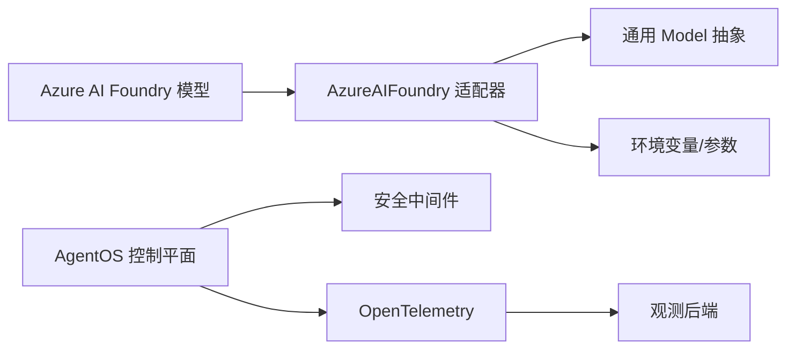

# Azure AI Foundry

<cite>
**本文引用的文件**
- [models/providers/cloud/azure-ai-foundry/overview.mdx](file://models/providers/cloud/azure-ai-foundry/overview.mdx)
- [models/providers/cloud/azure-ai-foundry/usage/basic-stream.mdx](file://models/providers/cloud/azure-ai-foundry/usage/basic-stream.mdx)
- [reference/models/azure.mdx](file://reference/models/azure.mdx)
- [agent-os/security/overview.mdx](file://agent-os/security/overview.mdx)
- [agent-os/security/rbac.mdx](file://agent-os/security/rbac.mdx)
- [examples/agent-os/rbac/overview.mdx](file://examples/agent-os/rbac/overview.mdx)
- [examples/agent-os/rbac/symmetric/overview.mdx](file://examples/agent-os/rbac/symmetric/overview.mdx)
- [observability/overview.mdx](file://observability/overview.mdx)
- [tracing/overview.mdx](file://tracing/overview.mdx)
- [deploy/introduction.mdx](file://deploy/introduction.mdx)
- [production/applications/overview.mdx](file://production/applications/overview.mdx)
- [TBD/pages/get-started/agent-engineering.mdx](file://TBD/pages/get-started/agent-engineering.mdx)
</cite>

## 目录
1. [简介](#简介)
2. [项目结构](#项目结构)
3. [核心组件](#核心组件)
4. [架构总览](#架构总览)
5. [详细组件分析](#详细组件分析)
6. [依赖关系分析](#依赖关系分析)
7. [性能与成本优化](#性能与成本优化)
8. [故障排查指南](#故障排查指南)
9. [结论](#结论)
10. [附录](#附录)

## 简介
本技术文档面向企业级用户，系统化介绍如何在 AgentOS 中使用 Azure AI Foundry 云模型提供商，涵盖以下关键主题：
- 多模型支持：Azure AI Foundry 提供的模型族谱与选择策略
- 安全与合规：基于 AgentOS 的认证与授权（RBAC）体系
- 高可用性与生产部署：模板化部署与可观测性集成
- 认证配置：环境变量驱动的 API Key 方式
- 模型管理与部署：参数化调优、流式输出与端点对接
- 成本优化与性能监控：令牌计数、延迟与吞吐优化建议
- 实战示例与最佳实践：从开发到生产的完整路径

## 项目结构
围绕 Azure AI Foundry 的文档与示例主要分布在如下位置：
- 模型提供方文档与用法示例：models/providers/cloud/azure-ai-foundry/*
- 模型参数参考：reference/models/azure.mdx
- 安全与权限控制：agent-os/security/*
- 可观测性与追踪：observability/*, tracing/*
- 生产部署与应用：deploy/*, production/applications/*

**图表来源**
- [models/providers/cloud/azure-ai-foundry/overview.mdx:1-94](file://models/providers/cloud/azure-ai-foundry/overview.mdx#L1-L94)
- [models/providers/cloud/azure-ai-foundry/usage/basic-stream.mdx:1-53](file://models/providers/cloud/azure-ai-foundry/usage/basic-stream.mdx#L1-L53)
- [reference/models/azure.mdx:1-30](file://reference/models/azure.mdx#L1-L30)
- [agent-os/security/overview.mdx:1-70](file://agent-os/security/overview.mdx#L1-L70)
- [agent-os/security/rbac.mdx:52-99](file://agent-os/security/rbac.mdx#L52-L99)
- [examples/agent-os/rbac/overview.mdx:1-9](file://examples/agent-os/rbac/overview.mdx#L1-L9)
- [examples/agent-os/rbac/symmetric/overview.mdx:1-12](file://examples/agent-os/rbac/symmetric/overview.mdx#L1-L12)
- [observability/overview.mdx:1-25](file://observability/overview.mdx#L1-L25)
- [tracing/overview.mdx:23-59](file://tracing/overview.mdx#L23-L59)
- [deploy/introduction.mdx:1-102](file://deploy/introduction.mdx#L1-L102)
- [production/applications/overview.mdx:1-169](file://production/applications/overview.mdx#L1-L169)
- [TBD/pages/get-started/agent-engineering.mdx:105-115](file://TBD/pages/get-started/agent-engineering.mdx#L105-L115)

**章节来源**
- [models/providers/cloud/azure-ai-foundry/overview.mdx:1-94](file://models/providers/cloud/azure-ai-foundry/overview.mdx#L1-L94)
- [models/providers/cloud/azure-ai-foundry/usage/basic-stream.mdx:1-53](file://models/providers/cloud/azure-ai-foundry/usage/basic-stream.mdx#L1-L53)
- [reference/models/azure.mdx:1-30](file://reference/models/azure.mdx#L1-L30)
- [agent-os/security/overview.mdx:1-70](file://agent-os/security/overview.mdx#L1-L70)
- [agent-os/security/rbac.mdx:52-99](file://agent-os/security/rbac.mdx#L52-L99)
- [examples/agent-os/rbac/overview.mdx:1-9](file://examples/agent-os/rbac/overview.mdx#L1-L9)
- [examples/agent-os/rbac/symmetric/overview.mdx:1-12](file://examples/agent-os/rbac/symmetric/overview.mdx#L1-L12)
- [observability/overview.mdx:1-25](file://observability/overview.mdx#L1-L25)
- [tracing/overview.mdx:23-59](file://tracing/overview.mdx#L23-L59)
- [deploy/introduction.mdx:1-102](file://deploy/introduction.mdx#L1-L102)
- [production/applications/overview.mdx:1-169](file://production/applications/overview.mdx#L1-L169)
- [TBD/pages/get-started/agent-engineering.mdx:105-115](file://TBD/pages/get-started/agent-engineering.mdx#L105-L115)

## 核心组件
- Azure AI Foundry 模型适配器：封装了与 Azure 托管模型交互所需的参数、认证与请求流程，支持温度、最大生成长度、流式输出等通用参数。
- AgentOS 安全与权限：提供基本认证与基于 JWT 的 RBAC 授权，支持细粒度资源与动作范围控制。
- 可观测性与追踪：通过 OpenTelemetry 自动注入与多种后端集成，实现端到端的链路追踪与性能监控。
- 生产部署模板与应用：提供从模板到应用的完整交付路径，覆盖容器化、数据库与接口暴露。

**章节来源**
- [reference/models/azure.mdx:8-30](file://reference/models/azure.mdx#L8-L30)
- [agent-os/security/overview.mdx:7-53](file://agent-os/security/overview.mdx#L7-L53)
- [observability/overview.mdx:1-25](file://observability/overview.mdx#L1-L25)
- [deploy/introduction.mdx:1-102](file://deploy/introduction.mdx#L1-L102)

## 架构总览
下图展示了 Azure AI Foundry 在 AgentOS 中的典型运行时架构：客户端/接口层通过 AgentOS 控制平面访问 Agent/Team/Workflow；Agent 调用 Azure AI Foundry 模型进行推理；安全层负责认证与授权；可观测性层采集链路与指标。

**图表来源**
- [models/providers/cloud/azure-ai-foundry/overview.mdx:1-94](file://models/providers/cloud/azure-ai-foundry/overview.mdx#L1-L94)
- [agent-os/security/overview.mdx:7-53](file://agent-os/security/overview.mdx#L7-L53)
- [observability/overview.mdx:1-25](file://observability/overview.mdx#L1-L25)

## 详细组件分析

### Azure AI Foundry 模型适配器
- 支持的模型族：Microsoft Phi、Meta Llama、Mistral、Cohere 等系列模型。
- 认证方式：通过环境变量 AZURE_API_KEY 与 AZURE_ENDPOINT 进行配置，亦可显式传入构造函数参数。
- 参数化调优：支持 temperature、max_tokens、top_p、stop、seed、频率/存在惩罚等。
- 流式输出：支持流式响应打印与事件迭代消费。
- 兼容性：作为通用 Model 子类，继承统一的参数与行为契约。

**图表来源**
- [reference/models/azure.mdx:8-30](file://reference/models/azure.mdx#L8-L30)
- [models/providers/cloud/azure-ai-foundry/overview.mdx:58-94](file://models/providers/cloud/azure-ai-foundry/overview.mdx#L58-L94)

**章节来源**
- [models/providers/cloud/azure-ai-foundry/overview.mdx:11-57](file://models/providers/cloud/azure-ai-foundry/overview.mdx#L11-L57)
- [models/providers/cloud/azure-ai-foundry/usage/basic-stream.mdx:7-28](file://models/providers/cloud/azure-ai-foundry/usage/basic-stream.mdx#L7-L28)
- [reference/models/azure.mdx:8-30](file://reference/models/azure.mdx#L8-L30)

### 认证与权限管理（RBAC）
- 基本认证：通过 OS_SECURITY_KEY 设置密钥，未携带有效 Bearer Token 的请求返回 401。
- RBAC：启用 authorization=True 后，使用 JWT 验证与作用域检查；需要设置 JWT_VERIFICATION_KEY。
- 范围格式：采用分层格式 resource:action 或 resource:<id>:action，支持通配符与管理员范围。
- 端点映射：系统、Agent、Team、Workflow 等资源均有对应读写删与执行范围。

**图表来源**
- [agent-os/security/overview.mdx:23-53](file://agent-os/security/overview.mdx#L23-L53)
- [agent-os/security/rbac.mdx:52-99](file://agent-os/security/rbac.mdx#L52-L99)

**章节来源**
- [agent-os/security/overview.mdx:14-53](file://agent-os/security/overview.mdx#L14-L53)
- [agent-os/security/rbac.mdx:52-99](file://agent-os/security/rbac.mdx#L52-L99)
- [examples/agent-os/rbac/overview.mdx:1-9](file://examples/agent-os/rbac/overview.mdx#L1-L9)
- [examples/agent-os/rbac/symmetric/overview.mdx:1-12](file://examples/agent-os/rbac/symmetric/overview.mdx#L1-L12)

### 可观测性与追踪
- OpenTelemetry 支持：自动注入、灵活导出至任意兼容后端。
- 追踪数据存储：所有追踪数据保存在用户自有数据库，不外泄。
- 关键价值：调试、性能、成本跟踪、行为分析与审计。

**图表来源**
- [observability/overview.mdx:1-25](file://observability/overview.mdx#L1-L25)
- [tracing/overview.mdx:23-59](file://tracing/overview.mdx#L23-L59)

**章节来源**
- [observability/overview.mdx:1-25](file://observability/overview.mdx#L1-L25)
- [tracing/overview.mdx:23-59](file://tracing/overview.mdx#L23-L59)

### 生产部署与应用
- 部署路径：从模板起步，添加应用，暴露接口。
- 应用示例：文本转 SQL、研究代理、知识代理、内容团队、销售通话分析等。
- 企业工程：私有化设计、数据主权、无外部传输、完全可控。

**图表来源**
- [deploy/introduction.mdx:1-102](file://deploy/introduction.mdx#L1-L102)
- [production/applications/overview.mdx:1-169](file://production/applications/overview.mdx#L1-L169)
- [TBD/pages/get-started/agent-engineering.mdx:105-115](file://TBD/pages/get-started/agent-engineering.mdx#L105-L115)

**章节来源**
- [deploy/introduction.mdx:1-102](file://deploy/introduction.mdx#L1-L102)
- [production/applications/overview.mdx:1-169](file://production/applications/overview.mdx#L1-L169)
- [TBD/pages/get-started/agent-engineering.mdx:105-115](file://TBD/pages/get-started/agent-engineering.mdx#L105-L115)

## 依赖关系分析
- 组件内聚与耦合
  - Azure AI Foundry 适配器与通用 Model 抽象强耦合，便于统一参数与生命周期管理。
  - 安全模块与控制平面紧密耦合，确保端到端访问控制。
  - 可观测性模块以非侵入方式接入，通过 OpenTelemetry 降低对业务代码的侵入。
- 外部依赖
  - Azure AI Foundry 服务端点与 API Key 为外部依赖，需通过环境变量或参数注入。
  - 可观测性后端（如 Langfuse、Phoenix 等）为可插拔扩展。

**图表来源**
- [reference/models/azure.mdx:8-30](file://reference/models/azure.mdx#L8-L30)
- [models/providers/cloud/azure-ai-foundry/overview.mdx:11-31](file://models/providers/cloud/azure-ai-foundry/overview.mdx#L11-L31)
- [agent-os/security/overview.mdx:23-53](file://agent-os/security/overview.mdx#L23-L53)
- [observability/overview.mdx:1-25](file://observability/overview.mdx#L1-L25)

**章节来源**
- [reference/models/azure.mdx:8-30](file://reference/models/azure.mdx#L8-L30)
- [models/providers/cloud/azure-ai-foundry/overview.mdx:11-31](file://models/providers/cloud/azure-ai-foundry/overview.mdx#L11-L31)
- [agent-os/security/overview.mdx:23-53](file://agent-os/security/overview.mdx#L23-L53)
- [observability/overview.mdx:1-25](file://observability/overview.mdx#L1-L25)

## 性能与成本优化
- 模型参数调优
  - 通过 temperature、top_p、max_tokens 等参数平衡质量与成本。
  - 使用频率/存在惩罚减少重复与无关输出，提升信息密度。
- 流式输出
  - 使用流式响应降低首字节延迟，改善用户体验。
- 可观测性与成本追踪
  - 利用追踪与指标监控延迟、吞吐与错误率，识别瓶颈。
  - 结合令牌计数与调用次数评估成本，定位高消耗路径。
- 部署与容量规划
  - 选择合适实例规格与副本数，结合自动扩缩容策略应对峰值。
  - 将数据库与缓存就近部署，减少跨区域网络开销。

[本节为通用指导，无需“章节来源”]

## 故障排查指南
- 认证失败（401/403）
  - 检查 OS_SECURITY_KEY 或 JWT_VERIFICATION_KEY 是否正确配置。
  - 确认请求头 Authorization 是否包含有效 Bearer Token。
  - 对照 RBAC 范围，确认角色是否具备所需资源与动作权限。
- Azure 认证失败
  - 确认 AZURE_API_KEY 与 AZURE_ENDPOINT 是否正确设置。
  - 若使用自定义 api_version，请确保版本与服务端一致。
- 可观测性问题
  - 确认 OpenTelemetry 已正确初始化与导出。
  - 检查后端凭据与网络连通性。
- 部署问题
  - 参考部署模板中的常见问题与解决步骤，如 ECR 登录过期、RDS 初始化耗时等。

**章节来源**
- [agent-os/security/overview.mdx:14-53](file://agent-os/security/overview.mdx#L14-L53)
- [agent-os/security/rbac.mdx:52-99](file://agent-os/security/rbac.mdx#L52-L99)
- [models/providers/cloud/azure-ai-foundry/overview.mdx:11-31](file://models/providers/cloud/azure-ai-foundry/overview.mdx#L11-L31)
- [observability/overview.mdx:1-25](file://observability/overview.mdx#L1-L25)
- [deploy/introduction.mdx:298-342](file://deploy/introduction.mdx#L298-L342)

## 结论
Azure AI Foundry 为企业提供了多模型、可扩展且易于集成的推理能力。结合 AgentOS 的安全与权限体系、可观测性与生产化部署模板，可在保障合规与性能的前提下快速构建与演进智能体应用。建议从最小可行模板起步，逐步引入 RBAC、流式输出与成本监控，并通过生产应用示例加速落地。

[本节为总结，无需“章节来源”]

## 附录
- 快速开始要点
  - 配置 AZURE_API_KEY 与 AZURE_ENDPOINT
  - 选择合适的模型 ID（如 Phi-4、Llama-3.1 系列等）
  - 开启流式输出以优化体验
  - 启用 RBAC 并定义最小权限范围
  - 集成 OpenTelemetry 以获得端到端可观测性
- 参考路径
  - Azure AI Foundry 文档与示例：[overview.mdx:1-94](file://models/providers/cloud/azure-ai-foundry/overview.mdx#L1-L94)、[basic-stream.mdx:1-53](file://models/providers/cloud/azure-ai-foundry/usage/basic-stream.mdx#L1-L53)
  - 模型参数参考：[azure.mdx:1-30](file://reference/models/azure.mdx#L1-L30)
  - 安全与权限：[security/overview.mdx:1-70](file://agent-os/security/overview.mdx#L1-L70)、[rbac.mdx:52-99](file://agent-os/security/rbac.mdx#L52-L99)
  - 可观测性：[observability/overview.mdx:1-25](file://observability/overview.mdx#L1-L25)、[tracing/overview.mdx:23-59](file://tracing/overview.mdx#L23-L59)
  - 部署与应用：[deploy/introduction.mdx:1-102](file://deploy/introduction.mdx#L1-L102)、[production/applications/overview.mdx:1-169](file://production/applications/overview.mdx#L1-L169)

[本节为补充信息，无需“章节来源”]