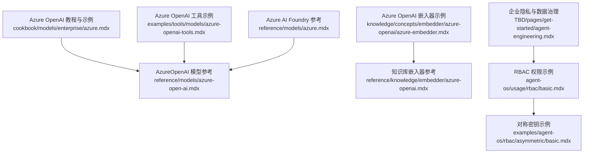
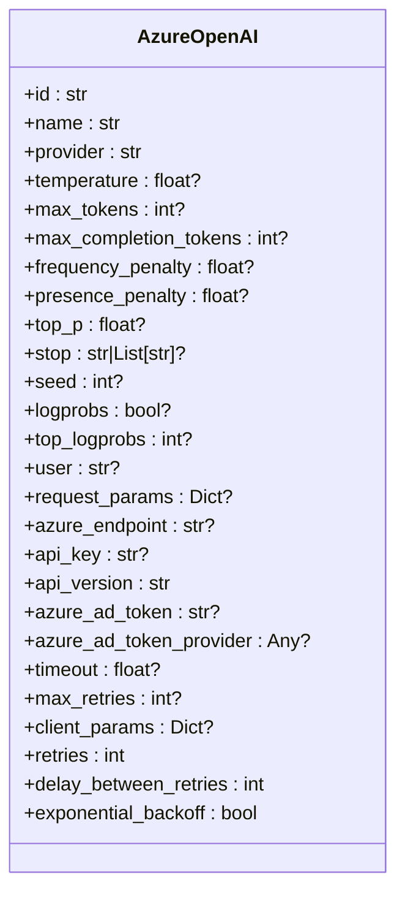
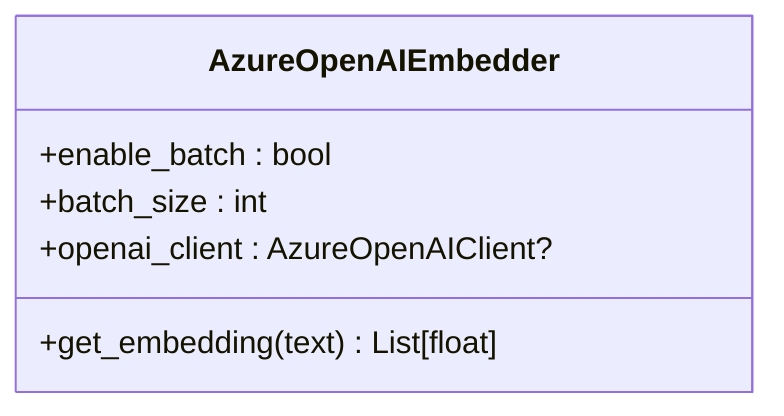
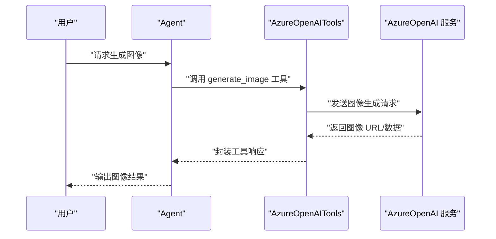
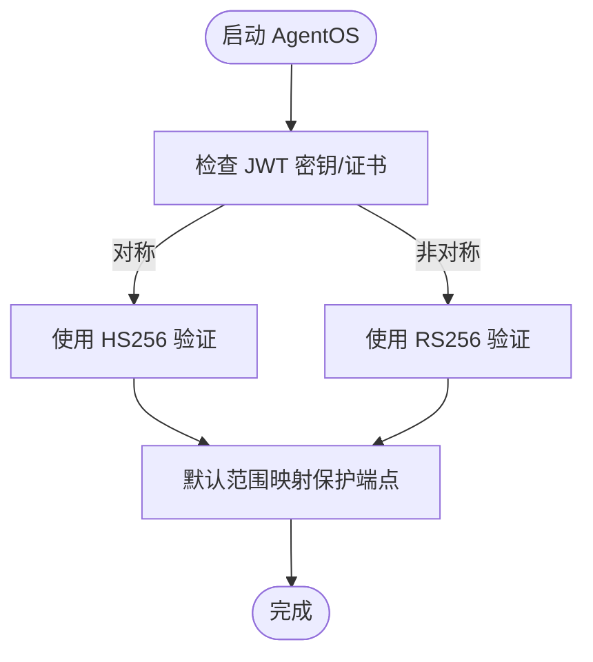
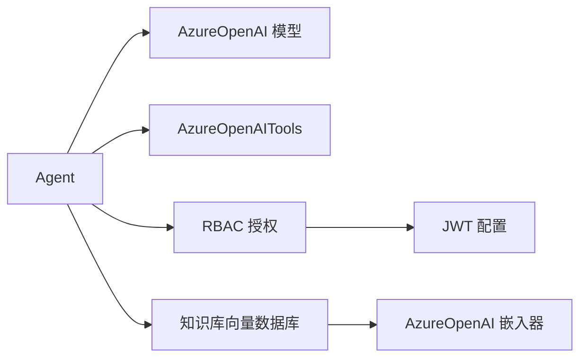

# Azure OpenAI

<cite>
**本文引用的文件**
- [cookbook/models/enterprise/azure.mdx](file://cookbook/models/enterprise/azure.mdx)
- [models/providers/cloud/azure-openai/overview.mdx](file://models/providers/cloud/azure-openai/overview.mdx)
- [reference/models/azure-open-ai.mdx](file://reference/models/azure-open-ai.mdx)
- [examples/tools/models/azure-openai-tools.mdx](file://examples/tools/models/azure-openai-tools.mdx)
- [knowledge/concepts/embedder/azure-openai/azure-embedder.mdx](file://knowledge/concepts/embedder/azure-openai/azure-embedder.mdx)
- [reference/models/azure.mdx](file://reference/models/azure.mdx)
- [TBD/pages/get-started/agent-engineering.mdx](file://TBD/pages/get-started/agent-engineering.mdx)
- [agent-os/usage/rbac/basic.mdx](file://agent-os/usage/rbac/basic.mdx)
- [examples/agent-os/rbac/asymmetric/basic.mdx](file://examples/agent-os/rbac/asymmetric/basic.mdx)
</cite>

## 目录
1. [简介](#简介)
2. [项目结构](#项目结构)
3. [核心组件](#核心组件)
4. [架构总览](#架构总览)
5. [详细组件分析](#详细组件分析)
6. [依赖关系分析](#依赖关系分析)
7. [性能考虑](#性能考虑)
8. [故障排除指南](#故障排除指南)
9. [结论](#结论)
10. [附录](#附录)

## 简介
本文件面向企业用户，系统化介绍如何在 Agno 框架中使用 Azure OpenAI 云模型提供商，覆盖以下关键主题：
- 企业级能力：数据治理、合规性、安全隔离与访问控制
- 部署架构与高可用配置建议
- 认证与授权配置：API 密钥管理、RBAC 设置、网络访问控制
- 模型版本管理与更新策略
- 成本控制与性能优化最佳实践
- 实际的企业级集成示例与故障排除

Azure OpenAI 在本仓库中通过 AzureOpenAI 模型接入，并支持多种参数与高级特性（如提示缓存、批量嵌入、重试与退避等）。同时，知识库嵌入器与工具集也提供了与 Azure OpenAI 的深度集成示例。

## 项目结构
围绕 Azure OpenAI 的文档与示例分布在多个目录中：
- 教程与示例：cookbook 与 examples 下的 Azure OpenAI 使用案例
- 参考文档：models 与 knowledge 下的参数与用法参考
- 安全与权限：agent-os 的 RBAC 示例与基础配置
- 企业隐私与数据治理：TBD 页面中的企业级隐私与数据主权说明



**图表来源**
- [cookbook/models/enterprise/azure.mdx:1-73](file://cookbook/models/enterprise/azure.mdx#L1-L73)
- [reference/models/azure-open-ai.mdx:1-37](file://reference/models/azure-open-ai.mdx#L1-L37)
- [examples/tools/models/azure-openai-tools.mdx:1-127](file://examples/tools/models/azure-openai-tools.mdx#L1-L127)
- [knowledge/concepts/embedder/azure-openai/azure-embedder.mdx:1-65](file://knowledge/concepts/embedder/azure-openai/azure-embedder.mdx#L1-L65)
- [reference/models/azure.mdx:1-34](file://reference/models/azure.mdx#L1-L34)
- [agent-os/usage/rbac/basic.mdx:1-52](file://agent-os/usage/rbac/basic.mdx#L1-L52)
- [examples/agent-os/rbac/asymmetric/basic.mdx:1-38](file://examples/agent-os/rbac/asymmetric/basic.mdx#L1-L38)
- [TBD/pages/get-started/agent-engineering.mdx:105-115](file://TBD/pages/get-started/agent-engineering.mdx#L105-L115)

**章节来源**
- [cookbook/models/enterprise/azure.mdx:1-73](file://cookbook/models/enterprise/azure.mdx#L1-L73)
- [models/providers/cloud/azure-openai/overview.mdx:1-81](file://models/providers/cloud/azure-openai/overview.mdx#L1-L81)
- [reference/models/azure-open-ai.mdx:1-37](file://reference/models/azure-open-ai.mdx#L1-L37)
- [examples/tools/models/azure-openai-tools.mdx:1-127](file://examples/tools/models/azure-openai-tools.mdx#L1-L127)
- [knowledge/concepts/embedder/azure-openai/azure-embedder.mdx:1-65](file://knowledge/concepts/embedder/azure-openai/azure-embedder.mdx#L1-L65)
- [reference/models/azure.mdx:1-34](file://reference/models/azure.mdx#L1-L34)
- [TBD/pages/get-started/agent-engineering.mdx:105-115](file://TBD/pages/get-started/agent-engineering.mdx#L105-L115)
- [agent-os/usage/rbac/basic.mdx:1-52](file://agent-os/usage/rbac/basic.mdx#L1-L52)
- [examples/agent-os/rbac/asymmetric/basic.mdx:1-38](file://examples/agent-os/rbac/asymmetric/basic.mdx#L1-L38)

## 核心组件
- AzureOpenAI 模型：用于调用 Azure 托管的 OpenAI 模型，支持温度、最大生成长度、停用词、随机种子、日志概率等参数；支持 Azure AD 令牌与自定义客户端配置。
- AzureOpenAI 嵌入器：用于知识库向量化，支持批量处理与速率限制规避。
- Azure OpenAI 工具：结合标准 OpenAI 模型与 Azure 图像生成能力，实现混合部署。
- RBAC 授权：基于 JWT 的角色访问控制，支持对称与非对称密钥签名验证。

**章节来源**
- [reference/models/azure-open-ai.mdx:1-37](file://reference/models/azure-open-ai.mdx#L1-L37)
- [knowledge/concepts/embedder/azure-openai/azure-embedder.mdx:1-65](file://knowledge/concepts/embedder/azure-openai/azure-embedder.mdx#L1-L65)
- [examples/tools/models/azure-openai-tools.mdx:1-127](file://examples/tools/models/azure-openai-tools.mdx#L1-L127)
- [agent-os/usage/rbac/basic.mdx:1-52](file://agent-os/usage/rbac/basic.mdx#L1-L52)
- [examples/agent-os/rbac/asymmetric/basic.mdx:1-38](file://examples/agent-os/rbac/asymmetric/basic.mdx#L1-L38)

## 架构总览
下图展示了在企业环境中使用 Azure OpenAI 的典型架构：Agent 通过 AzureOpenAI 模型调用 Azure 托管的 OpenAI 能力；知识库通过 AzureOpenAI 嵌入器进行向量化；工具链可选择混合部署（OpenAI 模型 + Azure 工具）或全 Azure 部署；权限层采用 RBAC 保护接口与资源。

```mermaid
graph TB
subgraph "应用层"
Agent["Agent 应用"]
Tools["AzureOpenAI 工具集"]
end
subgraph "模型服务层"
AOAI["AzureOpenAI 模型"]
Embed["AzureOpenAI 嵌入器"]
end
subgraph "基础设施层"
KDB["知识库向量数据库"]
RBAC["RBAC 授权网关"]
end
Agent --> AOAI
Agent --> Tools
Agent --> RBAC
Tools --> AOAI
Agent --> KDB
KDB <- --> Embed
```

**图表来源**
- [cookbook/models/enterprise/azure.mdx:8-18](file://cookbook/models/enterprise/azure.mdx#L8-L18)
- [examples/tools/models/azure-openai-tools.mdx:50-109](file://examples/tools/models/azure-openai-tools.mdx#L50-L109)
- [knowledge/concepts/embedder/azure-openai/azure-embedder.mdx:20-29](file://knowledge/concepts/embedder/azure-openai/azure-embedder.mdx#L20-L29)
- [agent-os/usage/rbac/basic.mdx:39-93](file://agent-os/usage/rbac/basic.mdx#L39-L93)

## 详细组件分析

### AzureOpenAI 模型
- 功能要点
  - 支持通过环境变量或显式参数设置 API Key、端点、部署名、API 版本等
  - 支持 Azure AD 令牌与令牌提供程序，便于企业统一身份认证
  - 提供重试次数、超时、指数退避等稳健性参数
  - 自动提示缓存（按文档说明）
- 参数概览（节选）
  - id、name、provider、temperature、max_tokens、max_completion_tokens、frequency_penalty、presence_penalty、top_p、stop、seed、logprobs、top_logprobs、user、request_params、azure_endpoint、api_key、api_version、azure_ad_token、azure_ad_token_provider、timeout、max_retries、client_params、retries、delay_between_retries、exponential_backoff



**图表来源**
- [reference/models/azure-open-ai.mdx:8-37](file://reference/models/azure-open-ai.mdx#L8-L37)

**章节来源**
- [models/providers/cloud/azure-openai/overview.mdx:55-81](file://models/providers/cloud/azure-openai/overview.mdx#L55-L81)
- [reference/models/azure-open-ai.mdx:1-37](file://reference/models/azure-open-ai.mdx#L1-L37)

### AzureOpenAI 嵌入器
- 功能要点
  - 将文本转换为向量，用于知识库检索
  - 支持批量处理以降低 API 调用频率与规避速率限制
  - 可与多种向量数据库配合使用
- 关键参数（节选）
  - openai_client、enable_batch、batch_size



**图表来源**
- [knowledge/concepts/embedder/azure-openai/azure-embedder.mdx:1-29](file://knowledge/concepts/embedder/azure-openai/azure-embedder.mdx#L1-L29)

**章节来源**
- [knowledge/concepts/embedder/azure-openai/azure-embedder.mdx:1-65](file://knowledge/concepts/embedder/azure-openai/azure-embedder.mdx#L1-L65)

### AzureOpenAI 工具（图像生成等）
- 功能要点
  - 支持混合部署：Agent 使用标准 OpenAI 模型，工具使用 Azure 图像生成
  - 支持全 Azure 部署：Agent 与工具均使用 Azure OpenAI
  - 通过环境变量传递 API Key、端点与部署名
- 典型流程
  - 校验必要环境变量
  - 创建 Agent（可混合或全 Azure）
  - 调用工具生成图像并返回结果



**图表来源**
- [examples/tools/models/azure-openai-tools.mdx:37-109](file://examples/tools/models/azure-openai-tools.mdx#L37-L109)

**章节来源**
- [examples/tools/models/azure-openai-tools.mdx:1-127](file://examples/tools/models/azure-openai-tools.mdx#L1-L127)

### RBAC 授权与访问控制
- 功能要点
  - 基于 JWT 的对称与非对称密钥签名验证
  - 默认范围映射自动保护端点
  - 支持 HS256 与 RS256 等算法
- 配置要点
  - 对称：设置验证密钥与算法
  - 非对称：私钥签名、公钥验证
  - AgentOS 启用授权并注入授权配置



**图表来源**
- [agent-os/usage/rbac/basic.mdx:39-93](file://agent-os/usage/rbac/basic.mdx#L39-L93)
- [examples/agent-os/rbac/asymmetric/basic.mdx:7-22](file://examples/agent-os/rbac/asymmetric/basic.mdx#L7-L22)

**章节来源**
- [agent-os/usage/rbac/basic.mdx:1-52](file://agent-os/usage/rbac/basic.mdx#L1-L52)
- [examples/agent-os/rbac/asymmetric/basic.mdx:1-38](file://examples/agent-os/rbac/asymmetric/basic.mdx#L1-L38)

## 依赖关系分析
- 组件耦合
  - Agent 依赖 AzureOpenAI 模型与可选工具集
  - 知识库依赖嵌入器与向量数据库
  - 授权依赖 AgentOS 与 JWT 配置
- 外部依赖
  - Azure OpenAI 服务端点与部署
  - Azure AD（可选，用于令牌）
  - 向量数据库（如 PostgreSQL + pgvector）



**图表来源**
- [cookbook/models/enterprise/azure.mdx:8-18](file://cookbook/models/enterprise/azure.mdx#L8-L18)
- [examples/tools/models/azure-openai-tools.mdx:50-109](file://examples/tools/models/azure-openai-tools.mdx#L50-L109)
- [knowledge/concepts/embedder/azure-openai/azure-embedder.mdx:20-29](file://knowledge/concepts/embedder/azure-openai/azure-embedder.mdx#L20-L29)
- [agent-os/usage/rbac/basic.mdx:39-93](file://agent-os/usage/rbac/basic.mdx#L39-L93)

**章节来源**
- [cookbook/models/enterprise/azure.mdx:1-73](file://cookbook/models/enterprise/azure.mdx#L1-L73)
- [examples/tools/models/azure-openai-tools.mdx:1-127](file://examples/tools/models/azure-openai-tools.mdx#L1-L127)
- [knowledge/concepts/embedder/azure-openai/azure-embedder.mdx:1-65](file://knowledge/concepts/embedder/azure-openai/azure-embedder.mdx#L1-L65)
- [agent-os/usage/rbac/basic.mdx:1-52](file://agent-os/usage/rbac/basic.mdx#L1-L52)

## 性能考虑
- 提示缓存
  - 文档明确指出使用 AzureOpenAI 时会自动进行提示缓存，有助于降低重复请求成本与延迟。
- 批量嵌入
  - 嵌入器支持批量处理，减少 API 调用次数，缓解速率限制。
- 重试与退避
  - 模型参数支持最大重试次数、重试间隔与指数退避，提升稳定性。
- 连接与超时
  - 通过超时与最大重试参数控制请求耗时与失败恢复策略。

**章节来源**
- [models/providers/cloud/azure-openai/overview.mdx:55-58](file://models/providers/cloud/azure-openai/overview.mdx#L55-L58)
- [reference/models/azure-open-ai.mdx:27-37](file://reference/models/azure-open-ai.mdx#L27-L37)
- [knowledge/concepts/embedder/azure-openai/azure-embedder.mdx:74-77](file://knowledge/concepts/embedder/azure-openai/azure-embedder.mdx#L74-L77)

## 故障排除指南
- 环境变量缺失
  - 症状：运行工具示例时报错“缺少 Azure OpenAI 基础要求”
  - 处理：确保设置 AZURE_OPENAI_API_KEY、AZURE_OPENAI_ENDPOINT、AZURE_OPENAI_IMAGE_DEPLOYMENT 等必要变量
- 认证失败
  - 症状：RBAC 校验失败或无法访问受保护端点
  - 处理：确认 JWT 密钥/证书正确、算法匹配（HS256 或 RS256），以及 AgentOS 已启用授权并注入相应配置
- 模型不可用或版本问题
  - 症状：请求超时或返回错误
  - 处理：检查 api_version 与端点是否匹配部署配置；必要时调整超时与重试参数

**章节来源**
- [examples/tools/models/azure-openai-tools.mdx:37-48](file://examples/tools/models/azure-openai-tools.mdx#L37-L48)
- [agent-os/usage/rbac/basic.mdx:39-93](file://agent-os/usage/rbac/basic.mdx#L39-L93)
- [reference/models/azure-open-ai.mdx:27-37](file://reference/models/azure-open-ai.mdx#L27-L37)

## 结论
通过本仓库提供的 AzureOpenAI 模型、嵌入器与工具示例，以及 RBAC 授权与企业隐私说明，可在企业环境中构建安全、合规且高性能的智能体应用。建议优先采用提示缓存、批量嵌入与稳健的重试策略，并结合 RBAC 与 Azure AD 实现统一的身份与访问控制。

## 附录
- 企业隐私与数据治理
  - 强调“私有设计”与“数据主权”，所有智能体系统在企业内部署，控制面直接连接到 AgentOS，避免外部数据传输。
- Azure AI Foundry
  - 提供 Azure 托管的 AI Foundry 模型参考，参数与 AzureOpenAI 类似，适用于不同场景的模型选择。

**章节来源**
- [TBD/pages/get-started/agent-engineering.mdx:105-115](file://TBD/pages/get-started/agent-engineering.mdx#L105-L115)
- [reference/models/azure.mdx:1-34](file://reference/models/azure.mdx#L1-L34)