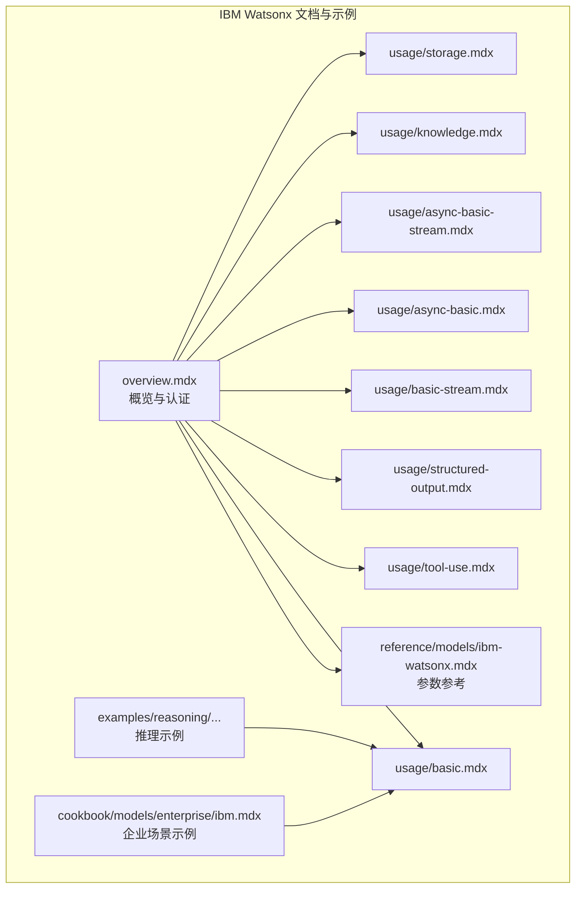
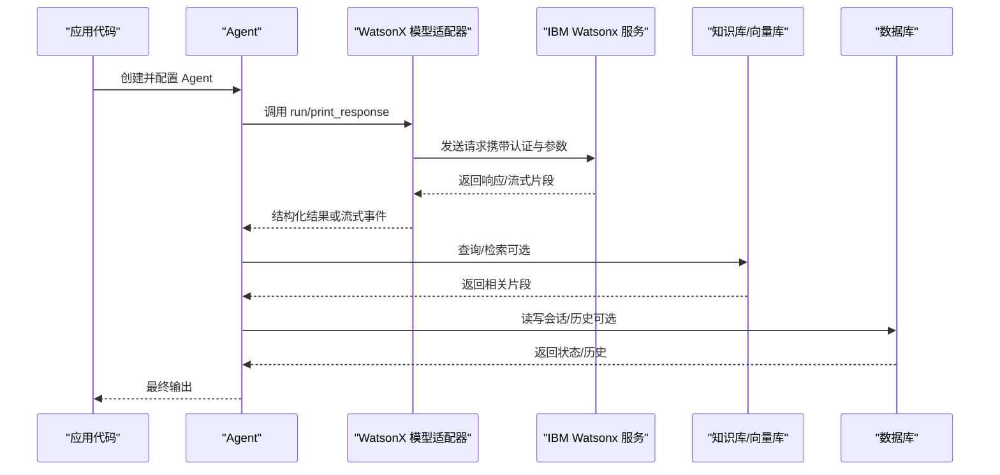
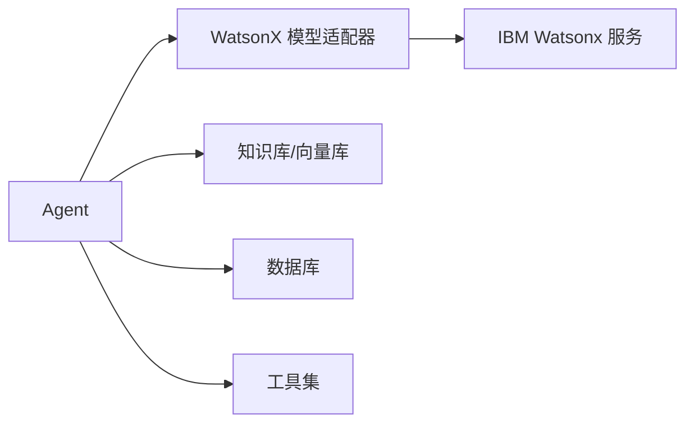

# IBM Watsonx

<cite>
**本文引用的文件**
- [cookbook/models/enterprise/ibm.mdx](file://cookbook/models/enterprise/ibm.mdx)
- [models/providers/cloud/ibm-watsonx/overview.mdx](file://models/providers/cloud/ibm-watsonx/overview.mdx)
- [reference/models/ibm-watsonx.mdx](file://reference/models/ibm-watsonx.mdx)
- [models/providers/cloud/ibm-watsonx/usage/basic.mdx](file://models/providers/cloud/ibm-watsonx/usage/basic.mdx)
- [models/providers/cloud/ibm-watsonx/usage/tool-use.mdx](file://models/providers/cloud/ibm-watsonx/usage/tool-use.mdx)
- [models/providers/cloud/ibm-watsonx/usage/structured-output.mdx](file://models/providers/cloud/ibm-watsonx/usage/structured-output.mdx)
- [models/providers/cloud/ibm-watsonx/usage/basic-stream.mdx](file://models/providers/cloud/ibm-watsonx/usage/basic-stream.mdx)
- [models/providers/cloud/ibm-watsonx/usage/async-basic.mdx](file://models/providers/cloud/ibm-watsonx/usage/async-basic.mdx)
- [models/providers/cloud/ibm-watsonx/usage/async-basic-stream.mdx](file://models/providers/cloud/ibm-watsonx/usage/async-basic-stream.mdx)
- [models/providers/cloud/ibm-watsonx/usage/knowledge.mdx](file://models/providers/cloud/ibm-watsonx/usage/knowledge.mdx)
- [models/providers/cloud/ibm-watsonx/usage/storage.mdx](file://models/providers/cloud/ibm-watsonx/usage/storage.mdx)
- [examples/reasoning/agents/ibm-watsonx-default-cot.mdx](file://examples/reasoning/agents/ibm-watsonx-default-cot.mdx)
- [TBD/pages/get-started/agent-engineering.mdx](file://TBD/pages/get-started/agent-engineering.mdx)
</cite>

## 目录
1. [简介](#简介)
2. [项目结构](#项目结构)
3. [核心组件](#核心组件)
4. [架构总览](#架构总览)
5. [详细组件分析](#详细组件分析)
6. [依赖关系分析](#依赖关系分析)
7. [性能考虑](#性能考虑)
8. [故障排查指南](#故障排查指南)
9. [结论](#结论)
10. [附录](#附录)

## 简介
本文件面向企业用户，系统化介绍 IBM Watsonx 云模型提供商在本仓库中的能力与使用方式。内容覆盖：
- 企业级特性：混合云部署、数据主权、合规与安全（结合框架整体设计）
- IBM Cloud 认证与 IAM 集成配置要点（环境变量与服务端点）
- Watsonx 模型使用指南与参数配置
- 多模型支持与模型管理思路
- 企业级安全与隐私保护措施
- 实际集成示例与最佳实践（含成本控制与性能优化建议）

## 项目结构
围绕 IBM Watsonx 的文档与示例主要分布在以下路径：
- 模型概览与认证：models/providers/cloud/ibm-watsonx/overview.mdx
- 参考参数：reference/models/ibm-watsonx.mdx
- 基础与进阶用法：usage 下的多个示例（basic、tool-use、structured-output、stream、async、knowledge、storage 等）
- 企业级理念与安全：TBD/pages/get-started/agent-engineering.mdx
- 企业场景示例：cookbook/models/enterprise/ibm.mdx
- 推理示例：examples/reasoning/agents/ibm-watsonx-default-cot.mdx

**图表来源**
- [models/providers/cloud/ibm-watsonx/overview.mdx:1-77](file://models/providers/cloud/ibm-watsonx/overview.mdx#L1-L77)
- [reference/models/ibm-watsonx.mdx:1-24](file://reference/models/ibm-watsonx.mdx#L1-L24)
- [models/providers/cloud/ibm-watsonx/usage/basic.mdx:1-46](file://models/providers/cloud/ibm-watsonx/usage/basic.mdx#L1-L46)
- [models/providers/cloud/ibm-watsonx/usage/tool-use.mdx:1-45](file://models/providers/cloud/ibm-watsonx/usage/tool-use.mdx#L1-L45)
- [models/providers/cloud/ibm-watsonx/usage/structured-output.mdx:1-71](file://models/providers/cloud/ibm-watsonx/usage/structured-output.mdx#L1-L71)
- [models/providers/cloud/ibm-watsonx/usage/basic-stream.mdx:1-48](file://models/providers/cloud/ibm-watsonx/usage/basic-stream.mdx#L1-L48)
- [models/providers/cloud/ibm-watsonx/usage/async-basic.mdx:1-48](file://models/providers/cloud/ibm-watsonx/usage/async-basic.mdx#L1-L48)
- [models/providers/cloud/ibm-watsonx/usage/async-basic-stream.mdx:1-51](file://models/providers/cloud/ibm-watsonx/usage/async-basic-stream.mdx#L1-L51)
- [models/providers/cloud/ibm-watsonx/usage/knowledge.mdx:1-64](file://models/providers/cloud/ibm-watsonx/usage/knowledge.mdx#L1-L64)
- [models/providers/cloud/ibm-watsonx/usage/storage.mdx:1-58](file://models/providers/cloud/ibm-watsonx/usage/storage.mdx#L1-L58)
- [examples/reasoning/agents/ibm-watsonx-default-cot.mdx:1-49](file://examples/reasoning/agents/ibm-watsonx-default-cot.mdx#L1-L49)
- [cookbook/models/enterprise/ibm.mdx:1-68](file://cookbook/models/enterprise/ibm.mdx#L1-L68)

**章节来源**
- [models/providers/cloud/ibm-watsonx/overview.mdx:1-77](file://models/providers/cloud/ibm-watsonx/overview.mdx#L1-L77)
- [reference/models/ibm-watsonx.mdx:1-24](file://reference/models/ibm-watsonx.mdx#L1-L24)

## 核心组件
- IBM Watsonx 模型适配器：封装 IBM Cloud 上的聊天接口，支持基础文本生成、流式输出、异步调用、工具调用、结构化输出、知识检索增强与存储持久化。
- 认证与配置：通过环境变量注入 API Key、Project ID、可选自定义服务端点；支持多区域端点选择。
- 参数体系：继承通用模型参数，扩展 Watsonx 特有参数（如空间 ID、部署 ID、附加生成参数）。

关键参数与行为（节选）：
- id：模型标识符（如 Llama、Granite 等）
- name/provider：模型名称与提供方标识
- api_key/base_url/project_id：认证与服务端点
- url/space_id/deployment_id/params：高级配置与生成参数
- 流式/异步：支持 token-by-token 输出与异步执行
- 工具/结构化输出/知识/存储：与框架其他模块无缝集成

**章节来源**
- [reference/models/ibm-watsonx.mdx:8-23](file://reference/models/ibm-watsonx.mdx#L8-L23)
- [models/providers/cloud/ibm-watsonx/overview.mdx:62-77](file://models/providers/cloud/ibm-watsonx/overview.mdx#L62-L77)

## 架构总览
下图展示从应用到 IBM Watsonx 的典型调用链路，以及与知识库、存储、工具等模块的协作关系。

**图表来源**
- [models/providers/cloud/ibm-watsonx/usage/basic.mdx:7-18](file://models/providers/cloud/ibm-watsonx/usage/basic.mdx#L7-L18)
- [models/providers/cloud/ibm-watsonx/usage/tool-use.mdx:7-17](file://models/providers/cloud/ibm-watsonx/usage/tool-use.mdx#L7-L17)
- [models/providers/cloud/ibm-watsonx/usage/knowledge.mdx:7-26](file://models/providers/cloud/ibm-watsonx/usage/knowledge.mdx#L7-L26)
- [models/providers/cloud/ibm-watsonx/usage/storage.mdx:7-24](file://models/providers/cloud/ibm-watsonx/usage/storage.mdx#L7-L24)

## 详细组件分析

### 组件一：认证与配置
- 环境变量
  - IBM_WATSONX_API_KEY：Watsonx API 密钥
  - IBM_WATSONX_PROJECT_ID：项目 ID
  - IBM_WATSONX_URL：可选，自定义服务端点，默认指向欧洲区域
- 获取方式：从 IBM Cloud 控制台获取凭据
- 适用范围：所有 Watsonx 使用示例均需设置上述变量

最佳实践：
- 将密钥与项目 ID 存储于受控的机密管理系统中，避免硬编码
- 在 CI/CD 中通过平台 IAM 与 OIDC 进行最小权限授权
- 对不同环境（开发/预发/生产）使用独立的项目与端点

**章节来源**
- [models/providers/cloud/ibm-watsonx/overview.mdx:19-36](file://models/providers/cloud/ibm-watsonx/overview.mdx#L19-L36)

### 组件二：基础与流式/异步调用
- 基础调用：创建 Agent 并直接打印响应
- 流式输出：逐 token 输出，适合交互体验
- 异步调用：并发处理多个请求，提升吞吐
- 依赖安装：示例中使用 ibm-watsonx-ai 与 agno

性能建议：
- 流式输出降低首字延迟，但注意网络抖动对拼接的影响
- 异步并发需结合后端限流与队列策略，避免过载

**章节来源**
- [models/providers/cloud/ibm-watsonx/usage/basic.mdx:7-18](file://models/providers/cloud/ibm-watsonx/usage/basic.mdx#L7-L18)
- [models/providers/cloud/ibm-watsonx/usage/basic-stream.mdx:7-20](file://models/providers/cloud/ibm-watsonx/usage/basic-stream.mdx#L7-L20)
- [models/providers/cloud/ibm-watsonx/usage/async-basic.mdx:7-20](file://models/providers/cloud/ibm-watsonx/usage/async-basic.mdx#L7-L20)
- [models/providers/cloud/ibm-watsonx/usage/async-basic-stream.mdx:7-23](file://models/providers/cloud/ibm-watsonx/usage/async-basic-stream.mdx#L7-L23)

### 组件三：工具调用与结构化输出
- 工具备选：示例中使用 HackerNewsTools 等
- 结构化输出：通过 Pydantic Schema 约束模型输出，便于解析与后续处理
- 推理增强：可启用链式思维模式以提升复杂问题求解质量

**章节来源**
- [models/providers/cloud/ibm-watsonx/usage/tool-use.mdx:7-17](file://models/providers/cloud/ibm-watsonx/usage/tool-use.mdx#L7-L17)
- [models/providers/cloud/ibm-watsonx/usage/structured-output.mdx:7-43](file://models/providers/cloud/ibm-watsonx/usage/structured-output.mdx#L7-L43)
- [examples/reasoning/agents/ibm-watsonx-default-cot.mdx:13-34](file://examples/reasoning/agents/ibm-watsonx-default-cot.mdx#L13-L34)

### 组件四：知识检索增强（RAG）与存储
- 知识库：将文档入库至向量数据库（示例使用 PostgreSQL + pgvector），Agent 可基于检索结果回答
- 存储：使用 PostgreSQL 持久化会话与历史，实现跨轮对话的状态保持
- 依赖：示例中包含 SQLAlchemy、pgvector、pypdf 等

**章节来源**
- [models/providers/cloud/ibm-watsonx/usage/knowledge.mdx:7-26](file://models/providers/cloud/ibm-watsonx/usage/knowledge.mdx#L7-L26)
- [models/providers/cloud/ibm-watsonx/usage/storage.mdx:7-24](file://models/providers/cloud/ibm-watsonx/usage/storage.mdx#L7-L24)

### 组件五：多模型支持与模型管理
- 模型选择：示例中涵盖 Llama、Granite、Mistral 等系列，按任务类型（通用/代码/视觉）推荐
- 参数扩展：params 字段用于温度、最大生成长度等生成参数；空间/部署 ID 支持私有化部署场景
- 管理建议：通过环境变量与配置文件分环境管理；为不同业务域配置专属模型与参数集

**章节来源**
- [models/providers/cloud/ibm-watsonx/overview.mdx:11-17](file://models/providers/cloud/ibm-watsonx/overview.mdx#L11-L17)
- [models/providers/cloud/ibm-watsonx/overview.mdx:64-75](file://models/providers/cloud/ibm-watsonx/overview.mdx#L64-L75)

### 组件六：企业级安全与隐私
- 私有化部署：框架整体强调“私有优先”，控制面直连本地 AgentOS，避免外部传输
- 数据主权：所有数据存储于企业数据库，消除外发与供应商锁定
- RBAC 与访问控制：框架提供细粒度权限模型，保护敏感上下文、工具与配置
- IAM 集成：通过平台 IAM 与 OIDC 实现最小权限授权，CI/CD 中可直接对接

**章节来源**
- [TBD/pages/get-started/agent-engineering.mdx:107-115](file://TBD/pages/get-started/agent-engineering.mdx#L107-L115)

## 依赖关系分析
IBM Watsonx 在本框架中的依赖关系如下：

- Agent 作为统一入口，组合模型、工具、知识库与存储
- WatsonX 适配器负责与 IBM 服务通信
- 知识库与存储为 Agent 提供上下文与状态持久化能力

**图表来源**
- [models/providers/cloud/ibm-watsonx/usage/knowledge.mdx:7-26](file://models/providers/cloud/ibm-watsonx/usage/knowledge.mdx#L7-L26)
- [models/providers/cloud/ibm-watsonx/usage/storage.mdx:7-24](file://models/providers/cloud/ibm-watsonx/usage/storage.mdx#L7-L24)

**章节来源**
- [models/providers/cloud/ibm-watsonx/usage/basic.mdx:7-18](file://models/providers/cloud/ibm-watsonx/usage/basic.mdx#L7-L18)
- [models/providers/cloud/ibm-watsonx/usage/tool-use.mdx:7-17](file://models/providers/cloud/ibm-watsonx/usage/tool-use.mdx#L7-L17)

## 性能考虑
- 生成参数调优
  - 温度：影响创造性与稳定性，建议在 0.3~0.7 区间试验
  - 最大新 token：控制输出长度，平衡成本与质量
  - top_p/nucleus：与温度协同，提升采样多样性
- 流式与异步
  - 流式输出可显著降低感知延迟，适用于实时对话
  - 异步并发提升吞吐，需结合限流与队列策略
- 网络与端点
  - 选择就近区域端点，减少 RTT
  - 自定义端点时确保 TLS 与证书校验
- 成本控制
  - 通过参数限制输出长度与采样范围
  - 合理使用缓存与上下文压缩
  - 对高频查询引入本地检索与工具调用，减少长文本生成

[本节为通用指导，不直接分析具体文件]

## 故障排查指南
- 认证失败
  - 检查 IBM_WATSONX_API_KEY 与 IBM_WATSONX_PROJECT_ID 是否正确设置
  - 确认 IBM_WATSONX_URL 指向正确的区域端点
- 请求超时/限流
  - 降低并发或增加重试间隔，必要时开启指数退避
  - 检查网络连通性与防火墙策略
- 输出格式异常
  - 若使用结构化输出，确认 Pydantic Schema 与模型提示词一致
- RAG/存储问题
  - 确认向量库与数据库连接字符串正确
  - 首次运行时允许加载知识库，后续可关闭重建逻辑

**章节来源**
- [models/providers/cloud/ibm-watsonx/overview.mdx:19-36](file://models/providers/cloud/ibm-watsonx/overview.mdx#L19-L36)
- [models/providers/cloud/ibm-watsonx/usage/knowledge.mdx:34-59](file://models/providers/cloud/ibm-watsonx/usage/knowledge.mdx#L34-L59)
- [models/providers/cloud/ibm-watsonx/usage/storage.mdx:32-57](file://models/providers/cloud/ibm-watsonx/usage/storage.mdx#L32-L57)

## 结论
本仓库提供了 IBM Watsonx 在企业级场景下的完整使用路径：从认证配置、基础与高级调用，到工具、结构化输出、RAG 与存储的端到端集成。结合框架的整体设计理念（私有优先、数据主权、RBAC 与 IAM），可在保证安全与合规的前提下，灵活地进行多模型管理与成本优化。

[本节为总结性内容，不直接分析具体文件]

## 附录

### A. 参数对照表（节选）
- id：模型标识符
- name/provider：模型名称与提供方
- api_key/base_url/project_id：认证与服务端点
- url/space_id/deployment_id：自定义端点与私有化部署
- params：生成参数（温度、最大新 token 等）

**章节来源**
- [reference/models/ibm-watsonx.mdx:10-21](file://reference/models/ibm-watsonx.mdx#L10-L21)
- [models/providers/cloud/ibm-watsonx/overview.mdx:64-75](file://models/providers/cloud/ibm-watsonx/overview.mdx#L64-L75)

### B. 示例清单
- 基础调用：basic.mdx
- 工具调用：tool-use.mdx
- 结构化输出：structured-output.mdx
- 流式输出：basic-stream.mdx
- 异步调用：async-basic.mdx、async-basic-stream.mdx
- 知识检索增强：knowledge.mdx
- 存储持久化：storage.mdx
- 企业场景示例：cookbook/models/enterprise/ibm.mdx
- 推理示例：examples/reasoning/agents/ibm-watsonx-default-cot.mdx

**章节来源**
- [models/providers/cloud/ibm-watsonx/usage/basic.mdx:1-46](file://models/providers/cloud/ibm-watsonx/usage/basic.mdx#L1-L46)
- [models/providers/cloud/ibm-watsonx/usage/tool-use.mdx:1-45](file://models/providers/cloud/ibm-watsonx/usage/tool-use.mdx#L1-L45)
- [models/providers/cloud/ibm-watsonx/usage/structured-output.mdx:1-71](file://models/providers/cloud/ibm-watsonx/usage/structured-output.mdx#L1-L71)
- [models/providers/cloud/ibm-watsonx/usage/basic-stream.mdx:1-48](file://models/providers/cloud/ibm-watsonx/usage/basic-stream.mdx#L1-L48)
- [models/providers/cloud/ibm-watsonx/usage/async-basic.mdx:1-48](file://models/providers/cloud/ibm-watsonx/usage/async-basic.mdx#L1-L48)
- [models/providers/cloud/ibm-watsonx/usage/async-basic-stream.mdx:1-51](file://models/providers/cloud/ibm-watsonx/usage/async-basic-stream.mdx#L1-L51)
- [models/providers/cloud/ibm-watsonx/usage/knowledge.mdx:1-64](file://models/providers/cloud/ibm-watsonx/usage/knowledge.mdx#L1-L64)
- [models/providers/cloud/ibm-watsonx/usage/storage.mdx:1-58](file://models/providers/cloud/ibm-watsonx/usage/storage.mdx#L1-L58)
- [cookbook/models/enterprise/ibm.mdx:1-68](file://cookbook/models/enterprise/ibm.mdx#L1-L68)
- [examples/reasoning/agents/ibm-watsonx-default-cot.mdx:1-49](file://examples/reasoning/agents/ibm-watsonx-default-cot.mdx#L1-L49)