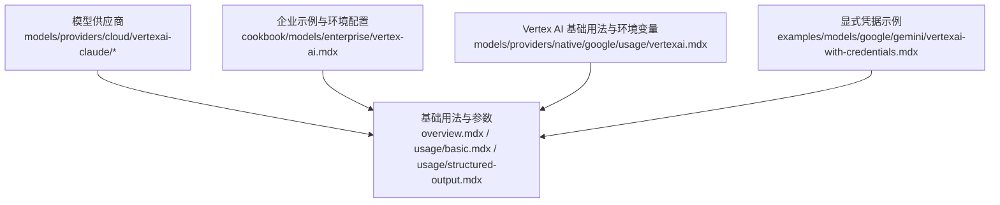
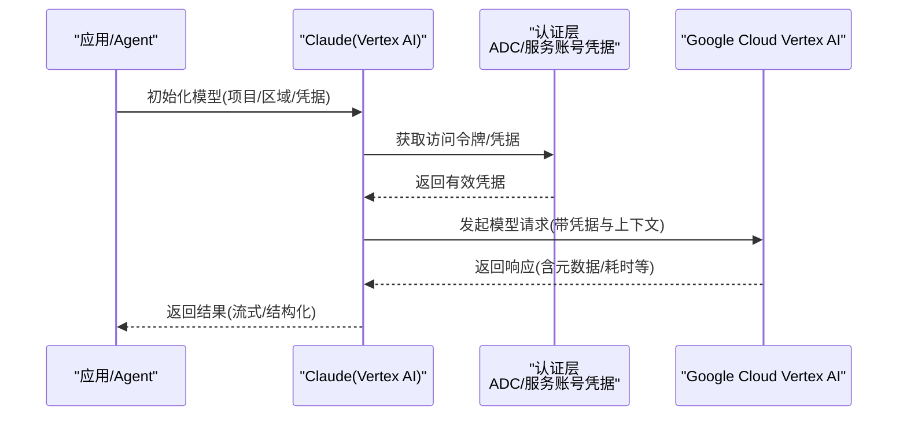
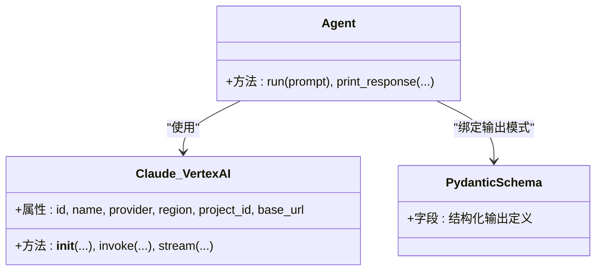
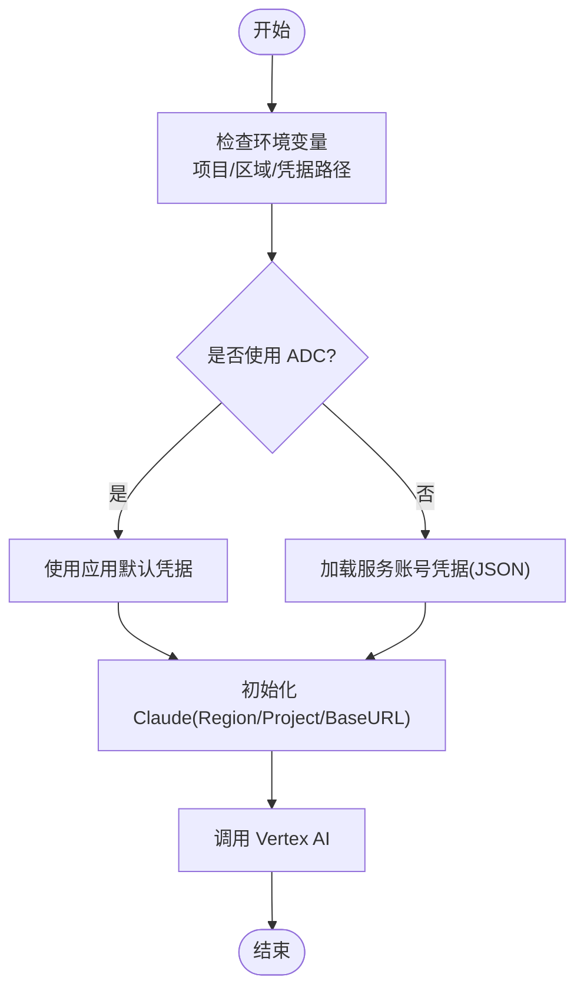
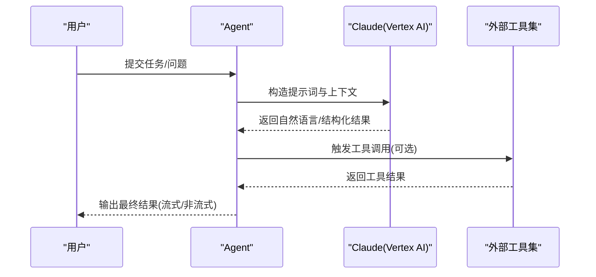
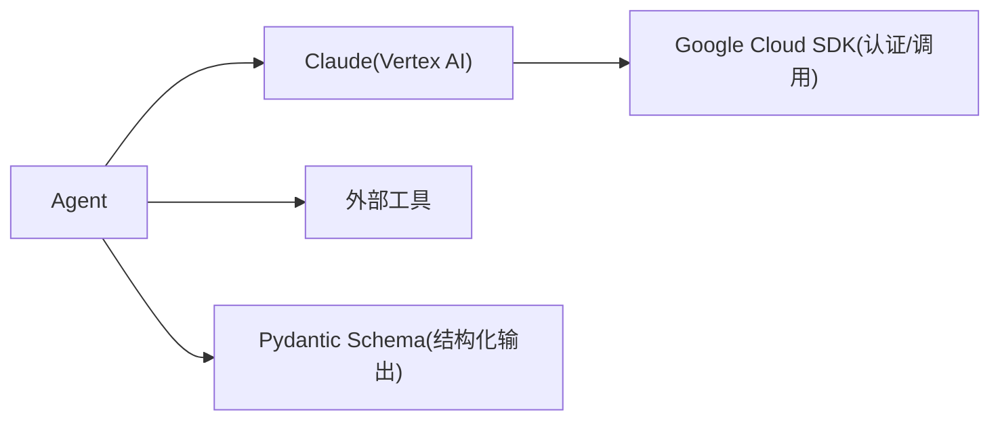

# Vertex AI Claude

<cite>
**本文引用的文件**
- [models/providers/cloud/vertexai-claude/overview.mdx](file://models/providers/cloud/vertexai-claude/overview.mdx)
- [models/providers/cloud/vertexai-claude/usage/basic.mdx](file://models/providers/cloud/vertexai-claude/usage/basic.mdx)
- [models/providers/cloud/vertexai-claude/usage/structured-output.mdx](file://models/providers/cloud/vertexai-claude/usage/structured-output.mdx)
- [cookbook/models/enterprise/vertex-ai.mdx](file://cookbook/models/enterprise/vertex-ai.mdx)
- [models/providers/native/google/usage/vertexai.mdx](file://models/providers/native/google/usage/vertexai.mdx)
- [examples/models/google/gemini/vertexai-with-credentials.mdx](file://examples/models/google/gemini/vertexai-with-credentials.mdx)
</cite>

## 目录
1. [简介](#简介)
2. [项目结构](#项目结构)
3. [核心组件](#核心组件)
4. [架构总览](#架构总览)
5. [详细组件分析](#详细组件分析)
6. [依赖关系分析](#依赖关系分析)
7. [性能与成本优化](#性能与成本优化)
8. [故障排查指南](#故障排查指南)
9. [结论](#结论)
10. [附录](#附录)

## 简介
本技术文档面向在 Google Cloud Vertex AI 平台上使用 Claude 模型（通过 Agno 的 Vertex AI 集成）进行企业级部署与运维的读者。内容覆盖：
- Vertex AI 的企业级能力概览（多租户隔离、数据安全、合规性等）
- Google Cloud 认证与 IAM 权限配置要点
- Claude 在 Vertex AI 上的使用方法、参数与配置选项
- 网络与安全设置（VPC、防火墙、私有访问等）
- 成本优化与性能调优建议
- 实际部署示例与运维最佳实践

## 项目结构
围绕 Vertex AI 与 Claude 的相关文档主要分布在以下路径：
- 模型供应商与用法：models/providers/cloud/vertexai-claude/*
- 企业级示例与环境配置：cookbook/models/enterprise/vertex-ai.mdx
- Vertex AI 基础用法与环境变量：models/providers/native/google/usage/vertexai.mdx
- 凭据显式传递示例（服务账号凭据）：examples/models/google/gemini/vertexai-with-credentials.mdx

**图表来源**
- [models/providers/cloud/vertexai-claude/overview.mdx:1-75](file://models/providers/cloud/vertexai-claude/overview.mdx#L1-L75)
- [models/providers/cloud/vertexai-claude/usage/basic.mdx:1-54](file://models/providers/cloud/vertexai-claude/usage/basic.mdx#L1-L54)
- [models/providers/cloud/vertexai-claude/usage/structured-output.mdx:1-77](file://models/providers/cloud/vertexai-claude/usage/structured-output.mdx#L1-L77)
- [cookbook/models/enterprise/vertex-ai.mdx:1-75](file://cookbook/models/enterprise/vertex-ai.mdx#L1-L75)
- [models/providers/native/google/usage/vertexai.mdx:1-71](file://models/providers/native/google/usage/vertexai.mdx#L1-L71)
- [examples/models/google/gemini/vertexai-with-credentials.mdx:1-66](file://examples/models/google/gemini/vertexai-with-credentials.mdx#L1-L66)

**章节来源**
- [models/providers/cloud/vertexai-claude/overview.mdx:1-75](file://models/providers/cloud/vertexai-claude/overview.mdx#L1-L75)
- [models/providers/cloud/vertexai-claude/usage/basic.mdx:1-54](file://models/providers/cloud/vertexai-claude/usage/basic.mdx#L1-L54)
- [models/providers/cloud/vertexai-claude/usage/structured-output.mdx:1-77](file://models/providers/cloud/vertexai-claude/usage/structured-output.mdx#L1-L77)
- [cookbook/models/enterprise/vertex-ai.mdx:1-75](file://cookbook/models/enterprise/vertex-ai.mdx#L1-L75)
- [models/providers/native/google/usage/vertexai.mdx:1-71](file://models/providers/native/google/usage/vertexai.mdx#L1-L71)
- [examples/models/google/gemini/vertexai-with-credentials.mdx:1-66](file://examples/models/google/gemini/vertexai-with-credentials.mdx#L1-L66)

## 核心组件
- Claude（Vertex AI）模型封装：基于 Anthropic Claude，扩展了 Vertex AI 集成，支持区域、项目、基础 URL 等参数，并复用大部分原生 Claude 参数。
- Agent 集成：通过 Agent 封装模型调用，支持流式输出、结构化输出（Pydantic Schema）、工具调用等。
- 环境与认证：支持应用默认凭据与显式服务账号凭据两种方式；可通过环境变量或构造函数参数指定项目、区域/位置。

关键参数（摘自模型文档）：
- id：具体 Vertex AI Claude 模型 ID
- name：模型名称标识
- provider：提供方（VertexAI）
- region/project_id/base_url：区域、项目、基础 URL（可选）

**章节来源**
- [models/providers/cloud/vertexai-claude/overview.mdx:63-75](file://models/providers/cloud/vertexai-claude/overview.mdx#L63-L75)
- [models/providers/cloud/vertexai-claude/usage/basic.mdx:7-19](file://models/providers/cloud/vertexai-claude/usage/basic.mdx#L7-L19)
- [models/providers/cloud/vertexai-claude/usage/structured-output.mdx:7-42](file://models/providers/cloud/vertexai-claude/usage/structured-output.mdx#L7-L42)

## 架构总览
下图展示了从应用到 Vertex AI 的典型调用链路，以及凭据与环境配置的关键节点。

**图表来源**
- [models/providers/cloud/vertexai-claude/overview.mdx:17-39](file://models/providers/cloud/vertexai-claude/overview.mdx#L17-L39)
- [cookbook/models/enterprise/vertex-ai.mdx:59-64](file://cookbook/models/enterprise/vertex-ai.mdx#L59-L64)
- [examples/models/google/gemini/vertexai-with-credentials.mdx:20-37](file://examples/models/google/gemini/vertexai-with-credentials.mdx#L20-L37)

## 详细组件分析

### 组件一：Claude（Vertex AI）模型封装
- 角色定位：在 Agno 中作为模型提供者，负责将用户请求转换为 Vertex AI 可理解的调用，并处理返回结果。
- 关键行为：
  - 支持通过构造函数传入项目、区域、基础 URL 等参数
  - 复用 Anthropic Claude 的参数体系，便于迁移与统一管理
  - 与 Agent 协作，支持流式输出与结构化输出

**图表来源**
- [models/providers/cloud/vertexai-claude/overview.mdx:63-75](file://models/providers/cloud/vertexai-claude/overview.mdx#L63-L75)
- [models/providers/cloud/vertexai-claude/usage/structured-output.mdx:15-37](file://models/providers/cloud/vertexai-claude/usage/structured-output.mdx#L15-L37)

**章节来源**
- [models/providers/cloud/vertexai-claude/overview.mdx:1-75](file://models/providers/cloud/vertexai-claude/overview.mdx#L1-L75)
- [models/providers/cloud/vertexai-claude/usage/structured-output.mdx:1-77](file://models/providers/cloud/vertexai-claude/usage/structured-output.mdx#L1-L77)

### 组件二：认证与凭据配置
- 应用默认凭据（ADC）：适用于本地开发与托管环境，通过 gcloud CLI 登录后自动生效。
- 显式服务账号凭据：适用于生产环境，通过服务账号 JSON 文件加载凭据对象，避免硬编码密钥。
- 环境变量：项目 ID、区域/位置、凭据文件路径等。

**图表来源**
- [models/providers/cloud/vertexai-claude/overview.mdx:17-39](file://models/providers/cloud/vertexai-claude/overview.mdx#L17-L39)
- [cookbook/models/enterprise/vertex-ai.mdx:59-64](file://cookbook/models/enterprise/vertex-ai.mdx#L59-L64)
- [examples/models/google/gemini/vertexai-with-credentials.mdx:20-37](file://examples/models/google/gemini/vertexai-with-credentials.mdx#L20-L37)

**章节来源**
- [models/providers/cloud/vertexai-claude/overview.mdx:17-39](file://models/providers/cloud/vertexai-claude/overview.mdx#L17-L39)
- [cookbook/models/enterprise/vertex-ai.mdx:59-64](file://cookbook/models/enterprise/vertex-ai.mdx#L59-L64)
- [examples/models/google/gemini/vertexai-with-credentials.mdx:1-66](file://examples/models/google/gemini/vertexai-with-credentials.mdx#L1-L66)

### 组件三：Agent 与工具集成
- Agent 负责编排对话、上下文与工具调用；Claude(Vertex AI) 作为底层推理引擎。
- 工具调用示例：结合外部工具（如金融数据查询）增强 Claude 的能力。
- 结构化输出：通过 Pydantic Schema 约束输出格式，提升下游处理稳定性。

**图表来源**
- [cookbook/models/enterprise/vertex-ai.mdx:24-38](file://cookbook/models/enterprise/vertex-ai.mdx#L24-L38)
- [models/providers/cloud/vertexai-claude/usage/structured-output.mdx:33-42](file://models/providers/cloud/vertexai-claude/usage/structured-output.mdx#L33-L42)

**章节来源**
- [cookbook/models/enterprise/vertex-ai.mdx:24-57](file://cookbook/models/enterprise/vertex-ai.mdx#L24-L57)
- [models/providers/cloud/vertexai-claude/usage/structured-output.mdx:1-77](file://models/providers/cloud/vertexai-claude/usage/structured-output.mdx#L1-L77)

## 依赖关系分析
- Claude(Vertex AI) 依赖于 Google Cloud SDK 的认证与调用能力。
- Agent 依赖 Claude(Vertex AI) 提供的推理接口，并可选择绑定工具与输出模式。
- 企业示例强调通过环境变量与显式凭据实现安全可控的运行时配置。

**图表来源**
- [models/providers/cloud/vertexai-claude/usage/basic.mdx:7-19](file://models/providers/cloud/vertexai-claude/usage/basic.mdx#L7-L19)
- [models/providers/cloud/vertexai-claude/usage/structured-output.mdx:7-42](file://models/providers/cloud/vertexai-claude/usage/structured-output.mdx#L7-L42)
- [cookbook/models/enterprise/vertex-ai.mdx:24-38](file://cookbook/models/enterprise/vertex-ai.mdx#L24-L38)

**章节来源**
- [models/providers/cloud/vertexai-claude/usage/basic.mdx:1-54](file://models/providers/cloud/vertexai-claude/usage/basic.mdx#L1-L54)
- [models/providers/cloud/vertexai-claude/usage/structured-output.mdx:1-77](file://models/providers/cloud/vertexai-claude/usage/structured-output.mdx#L1-L77)
- [cookbook/models/enterprise/vertex-ai.mdx:1-75](file://cookbook/models/enterprise/vertex-ai.mdx#L1-L75)

## 性能与成本优化
- 模型选择与版本：根据场景选择合适版本的 Claude 模型，平衡性能与成本。
- 流式输出：在长文本生成场景中启用流式输出，改善用户体验并降低首字延迟。
- 结构化输出：通过约束输出格式减少后处理开销，提高吞吐。
- 凭据与网络：优先使用显式服务账号凭据以简化权限管理；在网络层面尽量靠近 Vertex AI 所在区域，减少跨区调用。
- 上下文压缩与分页：对历史上下文进行压缩与分页，控制输入长度，降低 token 成本。
- 观测与评估：利用内置评估框架与追踪能力监控延迟、吞吐与错误率，持续优化。

[本节为通用指导，不直接分析特定文件]

## 故障排查指南
- 认证失败
  - 确认已设置项目 ID 与区域/位置环境变量
  - 使用应用默认凭据时，确认已登录 gcloud CLI
  - 生产环境建议使用显式服务账号凭据
- 权限不足
  - 确保服务账号具备 Vertex AI 相关角色与权限
  - 检查项目级 IAM 策略与资源级访问控制
- 网络与连通性
  - 如需私有访问，请确保 VPC、防火墙与路由策略允许出站访问 Vertex AI
  - 避免在受限网络环境下进行模型调用
- 输出格式异常
  - 若使用结构化输出，检查 Pydantic Schema 定义与模型输出一致性
  - 启用流式输出以便更快定位问题

**章节来源**
- [models/providers/cloud/vertexai-claude/overview.mdx:17-39](file://models/providers/cloud/vertexai-claude/overview.mdx#L17-L39)
- [cookbook/models/enterprise/vertex-ai.mdx:59-64](file://cookbook/models/enterprise/vertex-ai.mdx#L59-L64)
- [examples/models/google/gemini/vertexai-with-credentials.mdx:20-37](file://examples/models/google/gemini/vertexai-with-credentials.mdx#L20-L37)

## 结论
通过 Agno 的 Claude(Vertex AI) 集成，可以在 Google Cloud 上获得企业级的多租户隔离、数据安全与合规保障。配合合理的认证与 IAM 配置、网络与安全策略、以及性能与成本优化手段，可以构建稳定、高效且易于运维的智能体系统。建议在生产环境中采用显式服务账号凭据与就近网络部署，并结合结构化输出与流式能力提升整体体验与效率。

[本节为总结性内容，不直接分析特定文件]

## 附录

### 快速上手清单
- 设置环境变量：项目 ID、区域/位置
- 认证：应用默认凭据或显式服务账号凭据
- 初始化 Agent 与 Claude(Region/Project/BaseURL)
- 运行基础示例与结构化输出示例
- 部署前完成 IAM 与网络策略审查

**章节来源**
- [models/providers/cloud/vertexai-claude/usage/basic.mdx:21-53](file://models/providers/cloud/vertexai-claude/usage/basic.mdx#L21-L53)
- [models/providers/cloud/vertexai-claude/usage/structured-output.mdx:44-76](file://models/providers/cloud/vertexai-claude/usage/structured-output.mdx#L44-L76)
- [cookbook/models/enterprise/vertex-ai.mdx:59-74](file://cookbook/models/enterprise/vertex-ai.mdx#L59-L74)